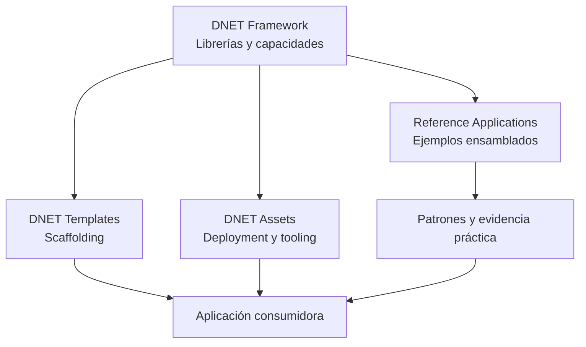
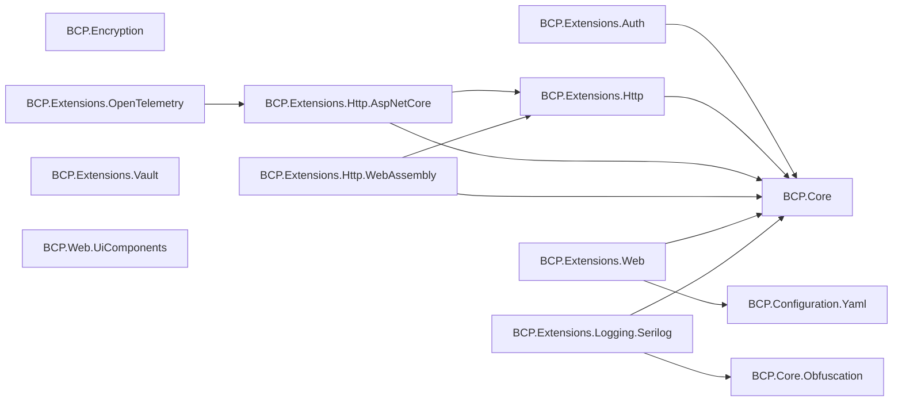
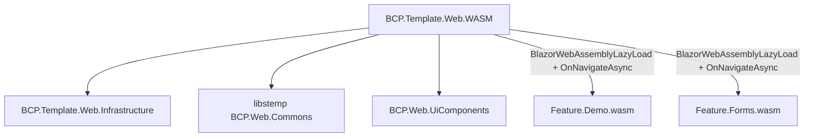
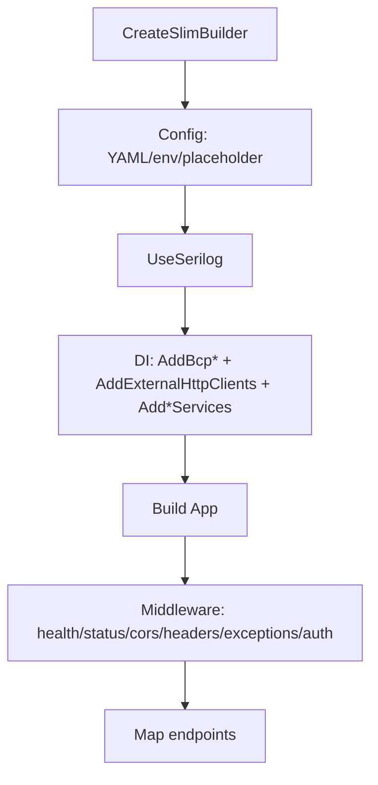
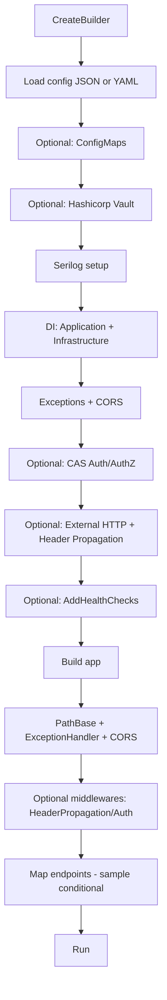
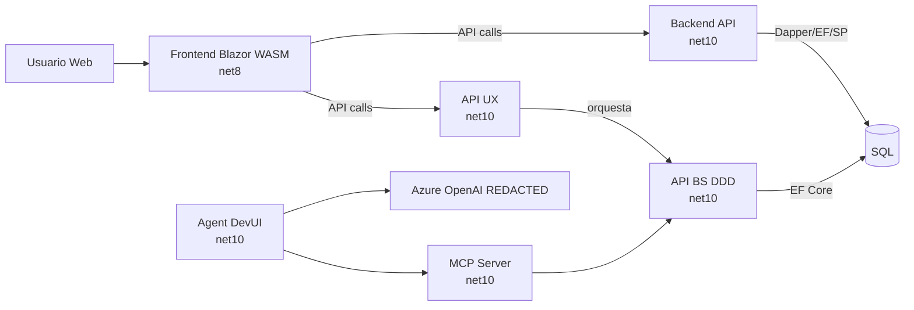
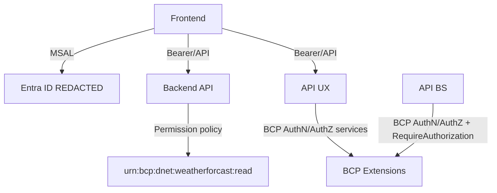
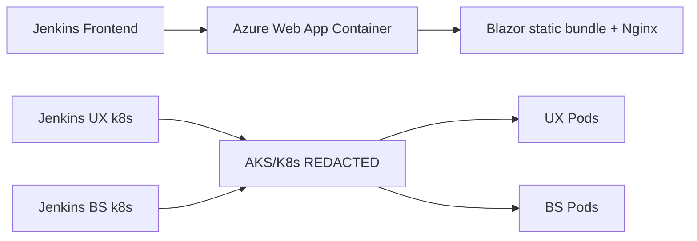
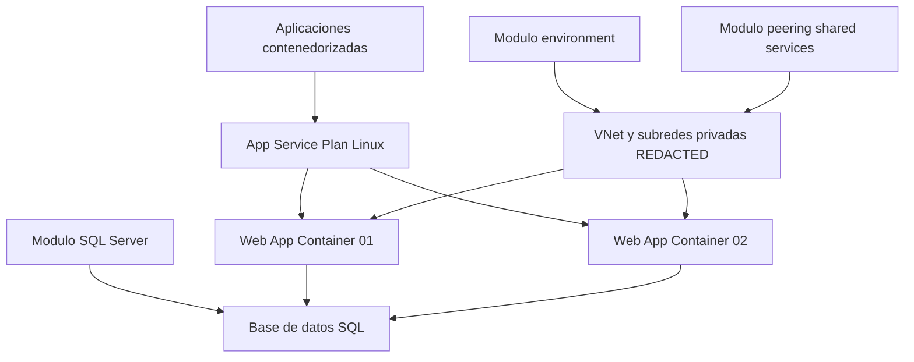
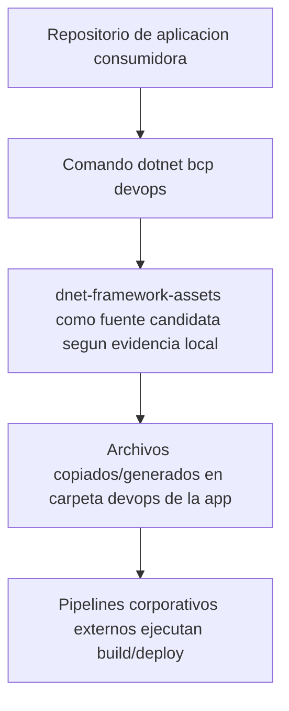

# DNET — Consolidado Arquitectónico Estructurado

**Fecha de consolidación:** 2026-09-30  
**Propósito:** sintetizar los hallazgos técnicos de los cuatro análisis DNET y conservar, como anexos, el contenido original completo sin modificaciones.

> **Regla de lectura:** esta primera parte es una síntesis. No reemplaza la evidencia detallada. Ante cualquier duda, contradicción o necesidad de bajar a implementación, prevalecen los análisis completos preservados en los anexos.

---

## 1. Alcance de la consolidación

Esta síntesis integra los análisis técnicos de:

1. `dnet-framework`
2. `dnet-framework-templates`
3. `dnet-sample-reference-applications`
4. `dnet-framework-assets`

El objetivo de esta capa de síntesis es responder, sin volver a repetir todo el detalle:

- qué es DNET técnicamente;
- qué responsabilidades resuelve el framework;
- qué decisiones materializan los templates;
- qué muestran realmente las aplicaciones de referencia;
- qué aportan los assets;
- qué decisiones quedan abiertas para una arquitectura futura;
- qué preguntas todavía requieren Confluence, DevOps o al equipo DNET.

No se propone todavía una arquitectura TO-BE.

---

## 2. Resumen ejecutivo

### 2.1 Qué es DNET según la evidencia analizada

DNET no se comporta como un único framework monolítico que imponga toda la arquitectura de una aplicación. La evidencia muestra un ecosistema compuesto por:

- **librerías reutilizables** para preocupaciones transversales;
- **templates** que materializan una estructura inicial;
- **aplicaciones de referencia** que demuestran patrones de uso;
- **assets** que complementan deployment, configuración y developer experience.

El framework central se compone explícitamente mediante extension methods y Dependency Injection. No se encontró un único `AddDnetFramework(...)` que encapsule toda la plataforma.

### 2.2 Qué resuelve el framework central

Se verificaron capacidades para:

- configuración JSON/YAML;
- contratos `Result` / `ApiException`;
- autenticación y autorización;
- autorización dinámica por permisos;
- clientes HTTP;
- resiliencia HTTP;
- propagación y validación de headers;
- manejo centralizado de errores;
- logging con Serilog;
- obfuscation/masking;
- OpenTelemetry;
- Vault;
- cifrado AES-GCM;
- soporte frontend WebAssembly para múltiples clientes HTTP;
- componentes/assets UI corporativos.

### 2.3 Qué NO impone el framework

No se encontró una capa de persistencia DNET obligatoria ni una restricción que obligue a:

- Entity Framework Core;
- Dapper;
- ADO.NET;
- una única base de datos;
- una única connection string;
- un único backend;
- una única topología de deployment;
- una única estrategia de modularidad frontend.

La implementación de datos y los límites funcionales siguen siendo responsabilidad de la aplicación consumidora.

### 2.4 Estado de la modularidad

La evidencia es mixta y debe distinguirse por fuente:

- El **sample Web dentro de `dnet-framework`** demuestra feature assemblies y lazy loading.
- El **template Web oficial actual** no genera esa modularidad.
- La **reference application frontend fijada por el superrepositorio** tampoco implementa lazy loading.

Por tanto:

> La modularidad frontend por ensamblados está demostrada como capacidad técnica, pero no está materializada actualmente como patrón estándar consistente entre template y reference application.

### 2.5 Estado de persistencia

La evidencia consolidada confirma compatibilidad con distintas estrategias:

- Dapper;
- ADO.NET;
- EF Core;
- Stored Procedures.

La reference backend demuestra coexistencia real de Dapper + EF Core + Stored Procedures.

### 2.6 Estado de deployment

La evidencia disponible se divide así:

- **IIS on-premise:** aparece documentado/mencionado, pero los repositorios analizados no contienen una receta técnica completa y vigente de deployment IIS productivo.
- **Azure App Service / Web App for Containers:** existen assets concretos Docker/Nginx/entrypoint y un Terraform referencial orientado a App Service.
- **AKS/Kubernetes:** existen configuraciones y variables por ambiente, probes, HPA, ingress y secretos, pero no se encontraron manifests/charts/pipelines completos en `dnet-framework-assets`.

La política oficial para elegir IIS, App Service o AKS no queda resuelta por los repositorios.

---

## 3. Baselines analizados

| Componente | Rama / baseline | Commit principal | Observación |
|---|---|---|---|
| `dnet-framework` | `develop` | `215cbdbd4f3f84f7648e9ad327cf788c6f2464f0` | HEAD validado contra `origin/develop` |
| `dnet-framework-templates` | `develop` | `179ab350ac87feae1dfc404e1e6a33b57a148f2b` | HEAD validado contra `origin/develop` |
| `dnet-sample-reference-applications` | `develop` | `44ea7b7b8acd4b75a80a936abf2b57df1ed0c7a0` | Superrepo con submódulos fijados por SHA |
| `dnet-framework-assets` | `develop` | `63406f8c827290dc5dc7d26679faec4446ca6c1a` | HEAD validado contra `origin/develop` |

### 3.1 Advertencia sobre el superrepositorio de referencia

El superrepositorio no representa una baseline homogénea de release:

- algunos submódulos fijados pertenecen a ramas feature;
- el frontend de referencia permanece en `net8.0`;
- backend, UX, BS, MCP y Agent están en `net10.0`;
- varias soluciones presentan drift de dependencias y fallos `NU1605`.

Por ello, las reference applications deben tratarse como **catálogo de patrones y ejemplos**, no como una certificación uniforme de release.

---

## 4. Mapa del ecosistema DNET



### 4.1 Rol de cada repositorio

| Pieza | Responsabilidad principal | Qué NO debe asumirse |
|---|---|---|
| Framework | Capacidades cross-cutting y contratos | No define por sí solo la arquitectura de negocio |
| Templates | Estructura inicial generada por `dotnet new` | No demuestra obligatoriedad corporativa |
| Reference Apps | Ejemplos end-to-end y patrones de uso | No constituyen una baseline uniforme/productiva |
| Assets | Docker, Nginx, vars AKS, Terraform referencial, skills/snippets | No contiene todos los pipelines ni una receta completa IIS |

---

## 5. Framework central: capacidades observadas

### 5.1 Backend / shared

| Capacidad | Evidencia consolidada | Estado |
|---|---|---|
| Contratos de error/resultados | `BCP.Core`, `ApiException`, `Result<T>` | Demostrado |
| YAML | `BCP.Configuration.Yaml` | Demostrado |
| AuthN/AuthZ | `BCP.Extensions.Auth` | Demostrado |
| Permisos dinámicos | `AddPermissionAuthorization` | Demostrado |
| HTTP y resiliencia | `BCP.Extensions.Http*` | Demostrado |
| API pipeline / errores | `BCP.Extensions.Web` | Demostrado |
| Logging | `BCP.Extensions.Logging.Serilog` | Demostrado |
| OpenTelemetry | `BCP.Extensions.OpenTelemetry` | Demostrado, cobertura de tests parcial |
| Vault | `BCP.Extensions.Vault` | Demostrado |
| Encryption | `BCP.Encryption` | Demostrado |
| Persistencia propia DNET | No encontrada | DNET no interviene |

### 5.2 Frontend

Se verificó:

- soporte para Blazor WebAssembly;
- múltiples HttpClients configurables;
- scopes por cliente;
- integración con MSAL/Graph en los samples/templates;
- assets/componentes UI corporativos;
- posibilidad técnica de feature assemblies y lazy loading.

No se verificó:

- runtime de plugins propio de DNET;
- discovery automático de módulos como capacidad DNET;
- navegación dinámica por permisos como comportamiento estándar generado.

---

## 6. Templates oficiales

Se identificaron dos templates actuales:

| Template | `shortName` | Arquitectura principal |
|---|---|---|
| Web | `blazorbcp` | Blazor WebAssembly + `BCP.Web.Commons` |
| API/Microservice | `webapibcp` | `Api / Application / Domain / Infrastructure` |

### 6.1 Template Web

Genera:

- Blazor WebAssembly standalone;
- `BCP.Web.Commons` local;
- MSAL/Graph;
- routing y `AuthorizeRouteView`;
- varios HttpClients;
- pruebas.

No genera:

- feature assemblies;
- lazy loading;
- discovery automático;
- menú dinámico por permisos;
- Docker/Jenkins/Kubernetes;
- una topología productiva de deployment.

### 6.2 Template API/Microservice

Genera estructura:

```text
Api
Application
Domain
Infrastructure
Tests
```

Dispone de opciones condicionales para capacidades como:

- autenticación;
- SQL;
- APIs externas;
- Vault;
- ConfigMaps;
- health checks.

No impone una tecnología de persistencia única.

### 6.3 Defectos detectados en combinaciones del template

Las pruebas de instanciación temporal detectaron problemas en combinaciones específicas, entre ellas:

- `includeSample=false`;
- `includeExternalApis=true`;
- `includeCas=true`;
- `includeHealthCheck=true`.

Esto debe tratarse como evidencia de defectos/limitaciones del template en el commit analizado, no como una restricción conceptual de DNET.

---

## 7. Reference applications: patrones realmente demostrados

### 7.1 Frontend de referencia

Demuestra:

- Blazor WASM;
- MSAL;
- Graph;
- múltiples HttpClients;
- autorización de rutas;
- shell/layout;
- Docker/Nginx/Jenkins para el ejemplo analizado.

No demuestra:

- lazy loading;
- feature assemblies;
- menú dinámico por permisos.

El modelo `MenuItem` posee `PolicyName`, pero el `NavMenu` analizado permanece estático.

### 7.2 Backend de referencia

Demuestra:

- Minimal APIs;
- separación `Application / Domain / Infrastructure`;
- Entra ID;
- autorización por permisos;
- health checks;
- Dapper;
- EF Core;
- Stored Procedures.

La protección de endpoints en la referencia es parcial: gran parte de las rutas observadas permanecen `AllowAnonymous`.

### 7.3 UX API

Demuestra una capa de experiencia/orquestación con:

- llamadas a servicios;
- auth/authz DNET;
- header propagation;
- manejo de errores.

También contiene endpoints presentes en código que no están mapeados en runtime en el commit analizado.

### 7.4 BS/DDD

Demuestra:

- modelado de dominio explícito;
- aggregate;
- estados;
- comentarios/relaciones;
- autorización aplicada en endpoints de dominio;
- EF Core en infraestructura.

### 7.5 MCP / Agent

Son referencias orientadas a PoC/demo. El análisis no permite considerarlas baseline productiva.

---

## 8. Frontend: conclusiones para arquitectura futura

### 8.1 Capacidades demostradas

| Capacidad | Estado consolidado |
|---|---|
| SPA Blazor WASM | Demostrado |
| Múltiples HttpClients/APIs | Demostrado |
| MSAL/Graph | Demostrado |
| Routing autorizado | Demostrado |
| Feature assemblies | Demostrado en sample del framework |
| Lazy loading | Demostrado en sample del framework |
| Feature assemblies en template oficial | No generado |
| Lazy loading en template oficial | No generado |
| Lazy loading en reference frontend fijada | No demostrado |
| Menú por policy/claims | Requiere implementación/adaptación |
| Discovery automático de módulos | No demostrado |

### 8.2 Lectura arquitectónica

DNET no bloquea una SPA con múltiples módulos ni múltiples APIs, pero tampoco proporciona una solución de suite modular lista para usar.

Los límites entre módulos, navegación, autorización funcional y estrategia de carga deben ser diseñados por la aplicación.

---

## 9. Backend: conclusiones para arquitectura futura

### 9.1 Capacidades demostradas

| Capacidad | Estado |
|---|---|
| Minimal APIs | Demostrado |
| Capas Application/Domain/Infrastructure | Generado/demostrado |
| Múltiples grupos de endpoints | Demostrado |
| Múltiples APIs independientes | Demostrado por las referencias |
| Experience API / UX | Demostrado |
| Business Service / DDD | Demostrado |
| API única con múltiples módulos | Posible; DNET no lo restringe |
| Extraer módulo posteriormente | Posible; no automatizado |
| Backend modular propietario DNET | No existe como runtime propio |

### 9.2 Lectura arquitectónica

DNET proporciona los building blocks transversales, pero no decide si una solución debe ser:

- una sola API;
- un monolito modular;
- varias APIs independientes;
- UX + BS;
- microservicios.

Esa frontera debe decidirse por dominio, operación y estrategia de migración.

---

## 10. Datos y persistencia

### 10.1 Tecnologías

| Tecnología / escenario | Estado consolidado |
|---|---|
| Dapper | Compatible y demostrado |
| ADO.NET / `SqlConnection` | Compatible y demostrado |
| EF Core | Compatible y demostrado |
| Stored Procedures | Compatible y demostrado |
| Varias connection strings | Posible; DNET no interviene |
| Varias bases SQL desde una API | Posible; DNET no interviene |
| Varios módulos sobre una misma base física | Posible; DNET no lo restringe |
| ORM obligatorio | No encontrado |

### 10.2 Consecuencia técnica

La migración a DNET no exige, según la evidencia del ecosistema analizado, reemplazar automáticamente una arquitectura basada en Stored Procedures por Entity Framework Core.

La estrategia de persistencia sigue siendo una decisión del consumidor.

---

## 11. Seguridad

### 11.1 Frontend

Se demuestra:

- MSAL;
- Entra;
- Graph;
- `AuthorizeRouteView`;
- claims/roles en account enrichment.

No se demuestra como patrón completo:

- navegación dinámica por permisos;
- ocultamiento automático de módulos;
- policy management modular.

### 11.2 Backend

Se demuestra:

- JWT;
- emisores PublicKey/OIDC;
- Entra ID en una referencia;
- autorización por scopes;
- autorización dinámica por permisos URN;
- `RequireAuthorization`.

La forma exacta de mapear roles/módulos/permisos de negocio sigue siendo responsabilidad de la aplicación y/o de reglas corporativas externas a los repositorios analizados.

### 11.3 Secretos

DNET provee integración con HashiCorp Vault y los assets AKS contemplan toggles Vault/Key Vault y secretos por ambiente.

---

## 12. Observabilidad, logging y configuración

### 12.1 Logging

Se verificó Serilog con:

- enriquecimiento;
- ofuscación;
- sink TCP;
- contexto de request/proyecto.

### 12.2 OpenTelemetry

Se verificó soporte para instrumentación de:

- ASP.NET Core;
- HttpClient;
- Entity Framework;
- SqlClient;
- logs;
- traces;
- metrics.

La cobertura automática de pruebas de la extensión OpenTelemetry es limitada en el commit analizado.

### 12.3 Configuración

El ecosistema contempla:

- JSON;
- YAML;
- configuración por environment;
- variables de entorno;
- placeholder resolution;
- Vault;
- ConfigMaps en escenarios preparados.

---

## 13. Deployment e infraestructura

### 13.1 Matriz consolidada

| Destino | Evidencia técnica disponible | Nivel de cierre |
|---|---|---|
| IIS Express | Perfil de desarrollo en Web template/sample | Desarrollo solamente |
| IIS on-premise | Menciones en código/docs/skills; sin assets concretos productivos | Parcial / requiere fuente externa |
| Azure App Service | Docker assets + App Service Linux + Terraform referencial | Evidencia concreta parcial |
| Azure Web App for Containers | Docker/Nginx/entrypoint Web/API | Evidencia concreta |
| AKS/Kubernetes | Vars por ambiente, probes, HPA, ingress, Vault/KeyVault; referencias en apps | Evidencia parcial |
| Kubernetes manifests/charts canónicos | No encontrados en assets | No determinado |

### 13.2 IIS

Los repositorios no cierran la receta productiva IIS:

- no se encontró `web.config` productivo canónico en assets;
- no se encontraron scripts IIS;
- no se encontró automatización de Hosting Bundle;
- aparece una opción `iis` en instrucciones de `dotnet bcp devops`.

La vigencia y receta oficial de IIS debe validarse mediante documentación corporativa/equipo DNET.

### 13.3 App Service

Se encontraron:

- runtime containers para Web/API;
- Nginx para SPA;
- entrypoints;
- Terraform referencial con App Service Plan y Web Apps Linux.

### 13.4 AKS

Se encontraron:

- variables `dev/cert/prod`;
- readiness/liveness;
- HPA;
- ingress;
- recursos;
- Vault/Key Vault;
- secretos/configmaps como opciones.

No se encontraron en `dnet-framework-assets` los charts/manifests/pipelines completos responsables del despliegue final.

---

## 14. Distribución y actualización

### 14.1 Librerías DNET

El framework está preparado para empaquetado NuGet y se verificó existencia de feed corporativo DNET en la configuración de assets/templates.

Dentro del repositorio `dnet-framework`, los samples consumen principalmente por `ProjectReference`, por lo que ese repositorio por sí solo no demuestra el flujo completo de publicación/upgrade de paquetes.

### 14.2 Templates

Los templates se empaquetan como `BCP.Templates` y generan código fuente local.

Una aplicación generada queda desacoplada del repositorio de templates.

Consecuencia:

- las capacidades consumidas vía `PackageReference` pueden evolucionar por versión de paquete;
- el código scaffolded/copied queda congelado en el repositorio consumidor hasta que el equipo lo modifique o regenere.

### 14.3 Assets

Existe evidencia de `dotnet bcp devops` como mecanismo para generar/copiar assets de DevOps en aplicaciones consumidoras.

No está determinado:

- cómo se versionan esos assets;
- cómo se sincronizan cambios posteriores;
- cómo se ejecuta un upgrade;
- cuál es el contrato exacto CLI ↔ assets.

---

## 15. Qué DNET resuelve y qué deja abierto

| Tema | DNET / ecosistema resuelve | Queda a decisión del aplicativo / gobierno |
|---|---|---|
| Auth técnica | Sí | Modelo funcional de roles/módulos/permisos |
| HTTP/resiliencia | Sí | Límites entre APIs |
| Error handling | Sí | Contratos funcionales específicos |
| Logging | Sí | Política operativa final |
| Observabilidad | Sí | SLO/SLA y exporters productivos |
| Secrets | Sí, parcialmente | Política por entorno |
| Persistencia | No impone | ORM/SP/repositorios/bases |
| Modularidad frontend | La permite | Diseño de módulos/shell/menu |
| Modularidad backend | La permite | Boundaries y deployment units |
| Deployment | Provee piezas | Selección IIS/App Service/AKS |
| CI/CD | Hay referencias/assets parciales | Pipeline canónico y gates |
| Versionado | Paquetes/templates tienen mecanismo | Política de upgrade/compatibilidad |

---

## 16. Matriz consolidada de capacidades relevantes

| Capacidad | Clasificación consolidada | Comentario |
|---|---|---|
| SPA Blazor WASM | DEMOSTRADO | Framework/template/reference |
| SPA con varias APIs | DEMOSTRADO | HttpClients configurables |
| SPA con feature assemblies | DEMOSTRADO COMO CAPACIDAD | Sample interno framework |
| Lazy loading | DEMOSTRADO COMO CAPACIDAD | No scaffolded por template ni reference actual |
| Menú dinámico por permisos | NO DEMOSTRADO | `PolicyName` existe, wiring falta |
| Auth MSAL/Entra frontend | DEMOSTRADO | Template/reference |
| Backend JWT/Entra | DEMOSTRADO | Reference backend |
| Autorización dinámica por permisos | DEMOSTRADO | Framework |
| API con varios grupos funcionales | DEMOSTRADO | Minimal APIs |
| API con varias bases | POSIBLE, DNET NO INTERVIENE | No restricción encontrada |
| Dapper | DEMOSTRADO | Samples/reference |
| EF Core | DEMOSTRADO | Reference |
| Stored Procedures | DEMOSTRADO | Reference |
| Experience API | DEMOSTRADO | UX reference |
| Business Service / DDD | DEMOSTRADO | BS reference |
| IIS productivo | DOCUMENTADO / NO CERRADO | Falta receta canónica |
| App Service containerizado | DEMOSTRADO PARCIAL | Assets y reference |
| AKS/Kubernetes | DEMOSTRADO PARCIAL | Variables/pipelines reference; faltan piezas canónicas |
| Docker/Nginx frontend | DEMOSTRADO | Assets/reference |
| Pipeline canónico corporativo | NO DETERMINADO | Fuera de assets analizados |

---

## 17. Drift y limitaciones observadas

### 17.1 Framework

Se observaron:

- documentación que aún menciona .NET 8 en algunos puntos;
- metadata de logging 8.0.0;
- proyectos de test placeholder en algunos módulos;
- nomenclatura histórica `BCP.Extensions.WebUI` vs `BCP.Web.UiComponents`.

### 17.2 Templates

Se observaron:

- versión README 10.0.0 vs `VersionPrefix=10.0.1`;
- combinaciones condicionales que no compilan/pasan pruebas;
- documentación de CI/CD que no se materializa en el template;
- health check registrado sin endpoint en una variante.

### 17.3 Reference applications

Se observaron:

- frontend `net8.0` frente a componentes backend `net10.0`;
- dependencias `Microsoft.Extensions.*` con `NU1605`;
- pipelines UX/BS declarando `NET_8` mientras los proyectos son `net10.0`;
- endpoints existentes pero no mapeados;
- varias rutas `AllowAnonymous` pese a infraestructura de auth;
- frontend sin modularidad lazy aunque esa capacidad exista en otro sample.

### 17.4 Assets

Se observaron:

- README de DevOps con estructura distinta a la real;
- referencias documentales a `iis0` sin carpeta/artefactos IIS presentes;
- claims de CI/CD completo sin pipelines dentro del repo;
- paquetes preview en algunas skills.

---

## 18. Decisiones que DNET no toma por nosotros

Los repositorios analizados no resuelven por sí solos las siguientes decisiones:

1. **Una SPA única vs múltiples SPAs.**
2. **Una API única vs múltiples APIs.**
3. **Monolito modular vs UX/BS vs microservicios.**
4. **Límite funcional de cada módulo.**
5. **Base de datos compartida vs bases separadas.**
6. **Estrategia de persistencia por módulo.**
7. **Modelo de autorización funcional de módulos/acciones.**
8. **Menú y navegación en función de permisos.**
9. **Unidad de deployment por módulo.**
10. **Uso inmediato de IIS vs App Service vs AKS.**
11. **Secuencia de migración de aplicaciones legacy.**
12. **Política de evolución/upgrade de código scaffolded y assets copiados.**

Estas deben considerarse decisiones de arquitectura/gobierno, no comportamientos impuestos automáticamente por DNET.

---

## 19. Preguntas que deben resolverse antes o durante el TO-BE

### 19.1 Alta prioridad arquitectónica

1. ¿Cuál es la política corporativa vigente para elegir App Service vs AKS?
2. ¿IIS on-premise continúa siendo una plataforma oficialmente soportada para DNET 10?
3. ¿Existe una guía corporativa para aplicaciones modulares/suites o solo patrones por aplicación?
4. ¿Existe un estándar oficial de autorización funcional por módulo/permiso?
5. ¿Existe una regla corporativa sobre cuándo separar una API/BS/microservicio?
6. ¿Qué capacidades DNET son obligatorias y cuáles opcionales?

### 19.2 Alta prioridad operativa

7. ¿Dónde viven los pipelines canónicos y security gates reales?
8. ¿Dónde viven los manifests/charts AKS canónicos?
9. ¿Cuál es el source of truth del Terraform productivo?
10. ¿Cómo funciona exactamente `dotnet bcp devops` contra `dnet-framework-assets`?
11. ¿Cómo se actualizan assets ya copiados en aplicaciones consumidoras?
12. ¿Cuál es la política de compatibilidad y upgrade de paquetes DNET?

### 19.3 Versionado

13. ¿Cuál es la baseline corporativa definitiva .NET 10 GA?
14. ¿Qué ocurre con reference applications todavía en `net8.0`?
15. ¿Cuáles referencias son consideradas vigentes/canónicas frente a PoC/demo?

---

## 20. Preguntas arquitectónicas que debe responder el análisis AS-IS de las aplicaciones

La siguiente fase no debe intentar adaptar inmediatamente los sistemas al template. Primero debe caracterizar cada aplicación para responder:

- cuáles son sus dominios/módulos reales;
- qué funcionalidades están acopladas;
- qué datos son propios y cuáles compartidos;
- qué stored procedures/tablas pertenecen a cada módulo;
- qué operaciones son lectura vs procesamiento/escritura;
- qué reportes/archivos produce;
- qué integraciones externas posee;
- qué procesos son síncronos o largos;
- cómo se autentica y autoriza actualmente;
- qué permisos deben sobrevivir a la migración;
- qué funcionalidades podrían migrarse independientemente;
- qué dependencias obligan a mantener módulos juntos;
- qué requerimientos operativos condicionan IIS/App Service/AKS.

Solo después de ese AS-IS debe evaluarse el TO-BE.

---

## 21. Lectura recomendada del consolidado

### Para decisiones rápidas

Leer esta síntesis, especialmente:

- § 8 Frontend
- § 9 Backend
- § 10 Datos
- § 11 Seguridad
- § 13 Deployment
- § 16 Matriz de capacidades
- § 18 Decisiones abiertas
- § 19 Preguntas pendientes

### Para implementación

Consultar los anexos completos por repositorio.

### Para resolver contradicciones

Mantener la clasificación original de cada análisis:

- hecho verificado;
- documentado pero no verificado;
- inferencia técnica;
- no determinado.

---

## 22. Índice de anexos preservados

El contenido original completo de `DNET_CONSOLIDADO.md` se conserva a continuación **sin modificaciones**.

Dentro de ese bloque se encuentran, en este orden:

1. **DNET Framework Technical Reference**
2. **DNET Framework Templates - Technical Reference**
3. **DNET Reference Applications - Technical Reference**
4. **Reverse Engineering Tecnico - dnet-framework-assets**

---

# ANEXOS — CONTENIDO ORIGINAL INTEGRAL

> A partir de la siguiente línea comienza el archivo `DNET_CONSOLIDADO.md` original.  
> El bloque siguiente se adjunta byte por byte sin alterar su contenido.

# DNET Framework Technical Reference

## Metadatos de verificacion

* Repositorio analizado: dnet-framework
* Rama: develop
* Commit: 215cbdbd4f3f84f7648e9ad327cf788c6f2464f0
* Fecha commit: 2026-03-17T01:43:03-05:00
* SO de analisis: Windows
* SDK usado en validacion: .NET SDK 10.0.401 (instalados: 10.0.301 y 10.0.401)
* Archivo global de version SDK: GLOBAL_JSON_MISSING
* Baseline Git (ultima pasada 2026-09-30): HEAD=215cbdbd4f3f84f7648e9ad327cf788c6f2464f0, origin/develop=215cbdbd4f3f84f7648e9ad327cf788c6f2464f0, COINCIDE=SI
* Estado local (git status -sb): ## develop...origin/develop / AM DNET_FRAMEWORK_TECHNICAL_REFERENCE.md / ?? DNET_FRAMEWORK_TECHNICAL_REFERENCE-v1.md

## Leyenda de clasificacion

* HECHO VERIFICADO EN CÓDIGO: hallazgo sustentado por inspeccion de codigo/proyectos/soluciones y/o ejecucion CLI.
* DOCUMENTADO PERO NO VERIFICADO: hallazgo declarado en README/docs pero no validado directamente por ejecucion o por evidencia suficiente en codigo.
* INFERENCIA TÉCNICA: conclusion deducida de la estructura y patrones observados, sin declaracion explicita unica.
* NO DETERMINADO: no existe evidencia suficiente en el repositorio analizado para concluir.

---

## A) Alcance y metodo

| Estado | Hallazgo | Evidencia |
| --- | --- | --- |
| HECHO VERIFICADO EN CÓDIGO | El analisis cubre solucion principal, librerias en src, pruebas en tests y templates en samples. | BCP.Extensions.slnx, src/, tests/, samples/ |
| HECHO VERIFICADO EN CÓDIGO | El entregable se limita a documentacion tecnica; no se modificaron archivos fuente del framework. | Estado git limpio antes de crear este archivo |
| HECHO VERIFICADO EN CÓDIGO | Se incluyo validacion por ejecucion: pruebas framework, pruebas sample API y build sample Web. | dotnet test BCP.Extensions.slnx; dotnet test samples/BCP.Template.Api/BCP.Template.Api.slnx; dotnet build samples/BCP.Template.Web/BCP.Template.Web.slnx |
| INFERENCIA TÉCNICA | El framework esta orientado a consumo por extensiones DI Add*/Use* y contratos de excepciones/resultados para APIS. | Presencia sistematica de extension methods y handlers en BCP.Extensions.* |

## B) Baseline tecnico (.NET, build, paquetes, feeds)

| Estado | Hallazgo | Evidencia |
| --- | --- | --- |
| HECHO VERIFICADO EN CÓDIGO | Baseline de compilacion de framework: net10.0. | Directory.Build.props: TargetFramework=net10.0 |
| HECHO VERIFICADO EN CÓDIGO | Version de framework declarada: 10.0.0. | Directory.Build.props: VersionPrefix=10.0.0 |
| HECHO VERIFICADO EN CÓDIGO | Gestion central de versiones de paquetes habilitada en raiz. | Directory.Packages.props: ManagePackageVersionsCentrally=true |
| HECHO VERIFICADO EN CÓDIGO | Salida de paquetes configurada centralmente en PackagesOutput y metadata de paquete/repositorio definida. | Directory.Build.props: PackageOutputPath, PackageProjectUrl, RepositoryUrl |
| HECHO VERIFICADO EN CÓDIGO | Feed raiz restringido a public-nuget corporativo. | nuget.config (raiz) |
| HECHO VERIFICADO EN CÓDIGO | Sample Web agrega feed adicional dnet-nuget y packageSourceMapping para BCP.*. | samples/BCP.Template.Web/nuget.config |
| HECHO VERIFICADO EN CÓDIGO | No existe pin de SDK por global.json. | GLOBAL_JSON_MISSING |
| HECHO VERIFICADO EN CÓDIGO | Se observan paquetes mayormente 10.x, con desviaciones puntuales. | Directory.Packages.props |

## C) Inventario de soluciones y proyectos

### Solucion principal

| Estado | Hallazgo | Evidencia |
| --- | --- | --- |
| HECHO VERIFICADO EN CÓDIGO | BCP.Extensions.slnx contiene 12 proyectos de src y 11 proyectos de tests. | BCP.Extensions.slnx |
| HECHO VERIFICADO EN CÓDIGO | BCP.Web.UiComponents existe en src pero no esta incluido en BCP.Extensions.slnx. | src/BCP.Web.UiComponents/BCP.Web.UiComponents.csproj y BCP.Extensions.slnx |

### Soluciones de muestras

| Estado | Hallazgo | Evidencia |
| --- | --- | --- |
| HECHO VERIFICADO EN CÓDIGO | samples/BCP.Template.Api.slnx referencia librerias del framework por ProjectReference y contiene 3 proyectos de pruebas. | samples/BCP.Template.Api/BCP.Template.Api.slnx |
| HECHO VERIFICADO EN CÓDIGO | samples/BCP.Template.Web.slnx incluye BCP.Web.UiComponents y BCP.Web.Commons, con app WASM y feature assemblies lazy-load. | samples/BCP.Template.Web/BCP.Template.Web.slnx, src/BCP.Template.Web.WASM/BCP.Template.Web.csproj |
| HECHO VERIFICADO EN CÓDIGO | No se encontraron proyectos de prueba en sample Web. | NO_TEST_PROJECTS_FOUND |

## D) Grafo de dependencias internas de librerias



| Estado | Hallazgo | Evidencia |
| --- | --- | --- |
| HECHO VERIFICADO EN CÓDIGO | El nucleo transversal se concentra en BCP.Core y BCP.Extensions.Http para composicion de otras librerias. | ProjectReference en csproj de src |
| INFERENCIA TÉCNICA | La dependencia OTel -> Http.AspNetCore sugiere reutilizacion de utilidades TLS/certificados para exporter OTLP. | BCP.Extensions.OpenTelemetry.csproj + OtlpExporterHelperExtensions.cs |

## E) BCP.Core: contratos base, errores y resultados

| Estado | Hallazgo | Evidencia |
| --- | --- | --- |
| HECHO VERIFICADO EN CÓDIGO | ErrorCategory define categorias canonicas (invalid-request, unauthorized, forbidden, conflict, etc.). | src/BCP.Core/Constants/ErrorCategory.cs |
| HECHO VERIFICADO EN CÓDIGO | ApiException soporta builder/mutacion, headers, properties, details y causa encadenada. | src/BCP.Core/Exceptions/ApiException.cs, ApiExceptionBuilder.cs |
| HECHO VERIFICADO EN CÓDIGO | Result encapsula exito/error con validaciones para acceso a Value y factories tipadas. | src/BCP.Core/Models/Result.cs |
| HECHO VERIFICADO EN CÓDIGO | Se exponen cabeceras canonicas HTTP para Request-ID, app-code, caller-name y errores. | src/BCP.Core/Header/HttpHeaderProperties.cs |
| HECHO VERIFICADO EN CÓDIGO | Existe cobertura de pruebas para categorias, excepciones, Result y headers. | tests/BCP.Core.Tests/* |

## F) BCP.Configuration.Yaml: provider YAML para IConfiguration

| Estado | Hallazgo | Evidencia |
| --- | --- | --- |
| HECHO VERIFICADO EN CÓDIGO | Se implementa AddYamlFile con sobrecargas equivalentes a proveedores nativos de archivos. | src/BCP.Configuration.Yaml/YamlConfigurationExtensions.cs |
| HECHO VERIFICADO EN CÓDIGO | El parser aplana mappings/sequences a claves jerarquicas con separador de configuracion (:). | src/BCP.Configuration.Yaml/YamlConfigurationStreamParser.cs |
| HECHO VERIFICADO EN CÓDIGO | Se detectan claves duplicadas y se lanzan errores de formato. | YamlConfigurationStreamParser.cs (duplicate key check) |
| HECHO VERIFICADO EN CÓDIGO | Se manejan null semanticos YAML (~, null, Null, NULL). | YamlConfigurationStreamParser.cs |
| HECHO VERIFICADO EN CÓDIGO | Existe bateria de pruebas para secuencias, nested sequences, BOM, nulls, optional file y escenarios invalidos. | tests/BCP.Configuration.Yaml.Tests/YamlConfigurationTest.cs, SequenceTests.cs |

## G) BCP.Encryption: cifrado AES-GCM

| Estado | Hallazgo | Evidencia |
| --- | --- | --- |
| HECHO VERIFICADO EN CÓDIGO | IEncryptionService define Encrypt/Decrypt. | src/BCP.Encryption/IEncryptionService.cs |
| HECHO VERIFICADO EN CÓDIGO | AesCryptoService usa AES-GCM con IV aleatorio por mensaje y tag de autenticacion. | src/BCP.Encryption/Services/AesCryptoService.cs |
| HECHO VERIFICADO EN CÓDIGO | Parametros de AES-GCM: IV 12 bytes y tag 16 bytes. | src/BCP.Encryption/Constants/AesGcmConstants.cs |
| HECHO VERIFICADO EN CÓDIGO | La salida cifrada concatena IV + ciphertext + tag y se serializa en Base64. | AesCryptoService.cs |
| HECHO VERIFICADO EN CÓDIGO | Pruebas validan roundtrip de cifrado y utilidades hex. | tests/BCP.Encryption.Tests/* |

## H) BCP.Extensions.Auth: autenticacion/autorizacion

| Estado | Hallazgo | Evidencia |
| --- | --- | --- |
| HECHO VERIFICADO EN CÓDIGO | AddBcpAuthenticationPlatform habilita esquema de policy y seleccion de issuer por claim iss del JWT. | src/BCP.Extensions.Auth/DependencyInjection.cs |
| HECHO VERIFICADO EN CÓDIGO | Se soportan emisores con PublicKey y emisores OIDC (Authority). | DependencyInjection.cs (ConfigureJwtBearerScheme / ConfigureJwtBearerOidcScheme) |
| HECHO VERIFICADO EN CÓDIGO | AddBcpAuthorization exige AllowedScopes y configura default policy por claim scope. | DependencyInjection.cs |
| HECHO VERIFICADO EN CÓDIGO | AddPermissionAuthorization registra policy provider dinamico y handler por permisos URN. | DependencyInjection.cs, PermissionAuthorizationPolicyProvider.cs, PermissionAuthorizationHandler.cs |
| HECHO VERIFICADO EN CÓDIGO | Eventos JWT convierten fallas de auth/challenge/forbidden a ApiException categorizadas. | DependencyInjection.cs (BuildJwtBearerEvents) |
| HECHO VERIFICADO EN CÓDIGO | Cobertura de pruebas para configuracion DI y flujo de provider/handler de permisos. | tests/BCP.Extensions.Auth.Tests/* |

## I) BCP.Extensions.Http (core + AspNetCore + WebAssembly)

### I.1 Core HTTP

| Estado | Hallazgo | Evidencia |
| --- | --- | --- |
| HECHO VERIFICADO EN CÓDIGO | Se proveen extensiones InvokeEndpoint y ExecuteRemoteCall para JSON y manejo de NoContent. | src/BCP.Extensions.Http/Extensions/HttpClientExtensions.cs |
| HECHO VERIFICADO EN CÓDIGO | Se provee configuracion de resiliencia con retry, circuit-breaker y timeout basada en Microsoft.Extensions.Http.Resilience. | src/BCP.Extensions.Http/Extensions/ResilienceHttpClientBuilderExtensions.cs |
| HECHO VERIFICADO EN CÓDIGO | QueryStringExtensions serializa pares simples y listas repetidas. | src/BCP.Extensions.Http/Extensions/QueryStringExtensions.cs |
| HECHO VERIFICADO EN CÓDIGO | Cobertura en este modulo es puntual (QueryString); no hay pruebas directas para todos los paths de resiliencia. | tests/BCP.Extensions.Http.Tests/* |

### I.2 AspNetCore HTTP

| Estado | Hallazgo | Evidencia |
| --- | --- | --- |
| HECHO VERIFICADO EN CÓDIGO | AddExternalHttpClients crea clientes desde configuracion Http:Clients e inyecta handlers de headers, token, excepciones, resiliencia y certificados. | src/BCP.Extensions.Http.AspNetCore/DependencyInjection.cs |
| HECHO VERIFICADO EN CÓDIGO | ApiExceptionHttpMessageHandler traduce errores HTTP/remotos a ApiException con categoria por status code. | src/BCP.Extensions.Http.AspNetCore/Handlers/ApiExceptionHttpMessageHandler.cs |
| HECHO VERIFICADO EN CÓDIGO | TokenValidationHttpClientHandler valida patron JWT y rechaza caracteres de control. | src/BCP.Extensions.Http.AspNetCore/Handlers/TokenValidationHttpClientHandler.cs |
| HECHO VERIFICADO EN CÓDIGO | ClientHttpHeadersHandler copia headers permitidos y bloquea headers reservados en request saliente. | src/BCP.Extensions.Http.AspNetCore/Handlers/ClientHttpHeadersHandler.cs |
| HECHO VERIFICADO EN CÓDIGO | SslClientExtensions crea SslClientAuthenticationOptions con trust store custom (root/intermediate). | src/BCP.Extensions.Http.AspNetCore/Extensions/SslClientExtensions.cs |
| HECHO VERIFICADO EN CÓDIGO | Existe soporte de invocacion SOAP (contenido + deserializacion). | src/BCP.Extensions.Http.AspNetCore/Extensions/SoapClientExtensions.cs |
| HECHO VERIFICADO EN CÓDIGO | Cobertura de pruebas amplia en AspNetCore HTTP (handlers, SOAP, SSL, options). | tests/BCP.Extensions.Http.AspNetCore.Tests/* |

### I.3 WebAssembly HTTP

| Estado | Hallazgo | Evidencia |
| --- | --- | --- |
| HECHO VERIFICADO EN CÓDIGO | AddExternalHttpClientBuilders retorna diccionario de IHttpClientBuilder para composicion posterior por capas consumidoras. | src/BCP.Extensions.Http.WebAssembly/DependencyInjection.cs |
| HECHO VERIFICADO EN CÓDIGO | Configuracion ClientHttp en WASM permite Scopes ademas de base HTTP. | src/BCP.Extensions.Http.WebAssembly/Options/HttpClientsOptions.cs |
| HECHO VERIFICADO EN CÓDIGO | No se identificaron pruebas dedicadas para BCP.Extensions.Http.WebAssembly. | tests/ (sin proyecto especifico WebAssembly) |

## J) BCP.Extensions.Web: pipeline de API, excepciones y resultados

| Estado | Hallazgo | Evidencia |
| --- | --- | --- |
| HECHO VERIFICADO EN CÓDIGO | AddApiBehaviorOptions reemplaza InvalidModelStateResponseFactory para devolver ApiException consistente. | src/BCP.Extensions.Web/DependencyInjection.cs, Helper/InvalidModelStateResponseFactoryHelper.cs |
| HECHO VERIFICADO EN CÓDIGO | AddExceptionServices registra handlers por tipo (BadRequest, FluentValidation, HttpRequest, ApiException, AnyException). | src/BCP.Extensions.Web/DependencyInjection.cs |
| HECHO VERIFICADO EN CÓDIGO | UseBcpHeaderValidation valida requeridos + regex/longitud de headers y responde ApiException en 400. | src/BCP.Extensions.Web/Middlewares/HeaderValidationMiddleware.cs |
| HECHO VERIFICADO EN CÓDIGO | UseBcpHeaderCopier propaga Request-ID y request-date al response. | src/BCP.Extensions.Web/Middlewares/HeaderCopierMiddleware.cs |
| HECHO VERIFICADO EN CÓDIGO | UseBcpStatusCodePages transforma 404 a payload ApiException tipado. | src/BCP.Extensions.Web/Extensions/MiddlewareExtensions.cs |
| HECHO VERIFICADO EN CÓDIGO | ResultExtensions y TypedResultsBcp proveen puente entre Result y respuesta HTTP estandarizada de ApiException. | src/BCP.Extensions.Web/Extensions/ResultExtensions.cs, Results/TypedResultsBcp.cs |
| HECHO VERIFICADO EN CÓDIGO | AddBcpConfigSources carga json/yml desde Bcp:Config y AddLoggingConfigFile usa LOGGING_CONFIG. | src/BCP.Extensions.Web/Extensions/ConfigurationExtensions.cs |
| HECHO VERIFICADO EN CÓDIGO | Existe cobertura de pruebas en middlewares, handlers, resolveres, resultados y extensiones. | tests/BCP.Extensions.Web.Tests/* |

## K) BCP.Extensions.Logging.Serilog: enriquecimiento, ofuscacion y sink TCP

| Estado | Hallazgo | Evidencia |
| --- | --- | --- |
| HECHO VERIFICADO EN CÓDIGO | Se exponen extensiones para enriquecer contexto (headers, activity ids, info de proyecto) y ofuscar campos sensibles. | src/BCP.Extensions.Logging.Serilog/DependencyInjection.cs, Enrichers/* |
| HECHO VERIFICADO EN CÓDIGO | ObfuscationDataEnricher aplica conversion por EventId y por RequestPath usando reglas configuradas. | src/BCP.Extensions.Logging.Serilog/Enrichers/ObfuscationDataEnricher.cs |
| HECHO VERIFICADO EN CÓDIGO | AddEmptySerilog crea logger base de consola y excluye SourceContext con Sensitive. | src/BCP.Extensions.Logging.Serilog/Extensions/SerilogLoggingBuilderExtensions.cs |
| HECHO VERIFICADO EN CÓDIGO | TCPSink/TcpSocketWriter implementan cola acotada, reconexion exponencial y soporte TLS. | src/BCP.Extensions.Logging.Serilog/Sinks/TCPSink.cs, Sinks/TCP/* |
| HECHO VERIFICADO EN CÓDIGO | Cobertura de pruebas incluye enrichers, converteres y socket writer. | tests/BCP.Extensions.Logging.Serilog.Tests/* |

## L) BCP.Extensions.OpenTelemetry: traces/metrics/logs + exporter helper

| Estado | Hallazgo | Evidencia |
| --- | --- | --- |
| HECHO VERIFICADO EN CÓDIGO | AddBcpOpenTelemetry configura tracing y metrics para ASP.NET Core/HttpClient/EF/SqlClient con filtros de rutas internas. | src/BCP.Extensions.OpenTelemetry/OpenTelemetryExtensions.cs |
| HECHO VERIFICADO EN CÓDIGO | Opcionalmente configura logging OpenTelemetry con processor custom (mascara atributo password). | OpenTelemetryExtensions.cs (CustomLogProcessor) |
| HECHO VERIFICADO EN CÓDIGO | OtlpExporterHelperExtensions habilita HttpClientFactory custom con certificados para App Service Linux via variables OTEL_EXPORTER_OTLP_*. | src/BCP.Extensions.OpenTelemetry/OtlpExporterHelperExtensions.cs |
| HECHO VERIFICADO EN CÓDIGO | El proyecto de pruebas OpenTelemetry es placeholder (UnitTest1) y no referencia al proyecto de produccion. | tests/BCP.Extensions.OpenTelemetry.Tests/UnitTest1.cs, BCP.Extensions.OpenTelemetry.Tests.csproj |

## M) BCP.Extensions.Vault: proveedor de configuracion HashiCorp

| Estado | Hallazgo | Evidencia |
| --- | --- | --- |
| HECHO VERIFICADO EN CÓDIGO | AddBcpHashicorpVault registra provider solo si Kv.Enabled=true y selecciona auth Token o Kubernetes. | src/BCP.Extensions.Vault/DependencyInjection.cs |
| HECHO VERIFICADO EN CÓDIGO | VaultConfigurationProvider lee contextos default + application, aplana JSON a claves de configuracion y soporta KeyPrefix. | src/BCP.Extensions.Vault/VaultConfigurationProvider.cs |
| HECHO VERIFICADO EN CÓDIGO | Maneja cache de version de secretos para reload incremental por path hash. | VaultConfigurationProvider.cs |
| HECHO VERIFICADO EN CÓDIGO | Soporta reemplazo de caracteres adicionales (por defecto '.') por ':' en claves finales. | VaultConfigurationProvider.cs, VaultOptions.cs |
| HECHO VERIFICADO EN CÓDIGO | Cobertura de pruebas valida carga de secretos, JSON, errores de parseo, reload y prefijos. | tests/BCP.Extensions.Vault.Tests/VaultConfigurationTest.cs |

## N) Validacion de ejecucion, drift, riesgos y checklist

### N.1 Evidencia de ejecucion (CLI)

| Estado | Hallazgo | Evidencia |
| --- | --- | --- |
| HECHO VERIFICADO EN CÓDIGO | Suite principal framework: 263/263 pruebas correctas. | dotnet test BCP.Extensions.slnx -c Release -v minimal |
| HECHO VERIFICADO EN CÓDIGO | Sample API: 5/5 pruebas correctas. | dotnet test samples/BCP.Template.Api/BCP.Template.Api.slnx -c Release -v minimal |
| HECHO VERIFICADO EN CÓDIGO | Sample Web: build correcto con 2 advertencias NU1510 (referencia redundante a System.Text.Json en BCP.Web.Commons). | dotnet build samples/BCP.Template.Web/BCP.Template.Web.slnx -c Release -v minimal |
| HECHO VERIFICADO EN CÓDIGO | No hay evidencia de tests automatizados para sample Web. | NO_TEST_PROJECTS_FOUND |

### N.2 Contradicciones y drift tecnico-documental

| Estado | Hallazgo | Evidencia | Impacto |
| --- | --- | --- | --- |
| HECHO VERIFICADO EN CÓDIGO | README del sample Web declara .NET 8, pero el codigo compila en net10.0. | samples/BCP.Template.Web/README.md vs samples/BCP.Template.Web/Directory.Build.props | Riesgo de onboarding con instrucciones desactualizadas |
| HECHO VERIFICADO EN CÓDIGO | logger.yml y logger-legacy.yml del sample API publican framework-version 8.0.0, mientras la extension fija 10.0.0. | samples/BCP.Template.Api/src/BCP.Template.Api/logger.yml, logger-legacy.yml, src/BCP.Extensions.Logging.Serilog/DependencyInjection.cs | Telemetria/log metadata inconsistente |
| HECHO VERIFICADO EN CÓDIGO | src/README.md lista BCP.Extensions.WebUI, mientras el proyecto real es BCP.Web.UiComponents. | src/README.md, src/BCP.Web.UiComponents/BCP.Web.UiComponents.csproj | Nomenclatura/documentacion inconsistente |
| HECHO VERIFICADO EN CÓDIGO | docs/README.md esta vacio. | docs/README.md | Vacio documental interno |
| HECHO VERIFICADO EN CÓDIGO | tests BCP.Core.Obfuscation.Tests y BCP.Extensions.OpenTelemetry.Tests son placeholders y sin ProjectReference al modulo productivo. | tests/BCP.Core.Obfuscation.Tests/*, tests/BCP.Extensions.OpenTelemetry.Tests/* | Cobertura funcional real limitada en esos modulos |
| HECHO VERIFICADO EN CÓDIGO | En baseline net10 existen dependencias puntuales no alineadas de major: AspNetCore.HealthChecks.SqlServer 9.0.0 y Microsoft.AspNetCore.Http.Abstractions 2.3.9 (test). | Directory.Packages.props, src/BCP.Extensions.Web/BCP.Extensions.Web.csproj, tests/BCP.Extensions.Web.Tests/BCP.Extensions.Web.Tests.csproj | Riesgo de deuda tecnica/compatibilidad futura |

### N.3 Redaccion de valores sensibles en esta referencia

| Estado | Hallazgo | Evidencia |
| --- | --- | --- |
| HECHO VERIFICADO EN CÓDIGO | Los samples contienen valores que pueden considerarse sensibles o corporativos (subscription keys, ids de cliente, authority URIs, public keys, endpoints internos). | samples/BCP.Template.Api/src/BCP.Template.Api/appsettings*.yml, logger*.yml; samples/BCP.Template.Web/src/BCP.Template.Web.WASM/wwwroot/appsettings.json |
| HECHO VERIFICADO EN CÓDIGO | En esta referencia se reportan esos datos solo como [REDACTED] cuando aplica. | Criterio aplicado en este documento |

Ejemplos de campos tratados como sensibles en esta referencia:

* Http:Clients:*:Headers:ocp-apim-subscription-key -> [REDACTED]
* Authentication:Issuers:*:PublicKey -> [REDACTED]
* AzureAd:ClientId / Authority (sample) -> [REDACTED]
* UserSecretsId (sample API csproj) -> [REDACTED]

### N.4 Hallazgos no concluyentes

| Estado | Hallazgo | Evidencia |
| --- | --- | --- |
| NO DETERMINADO | Politicas de publicacion de paquetes (cuando/donde se ejecuta dotnet pack/push en CI). | No hay pipeline CI principal evaluado en este alcance |
| NO DETERMINADO | SLO/SLA operativos y umbrales de observabilidad productivos. | No existe especificacion operativa formal en codigo revisado |
| NO DETERMINADO | Matriz de compatibilidad retroactiva por version de consumidor. | No se encontro contrato de compatibilidad versionado en este alcance |

### N.5 Checklist A-N de completitud

| Letra | Tema | Estado |
| --- | --- | --- |
| A | Alcance y metodo | COMPLETADO |
| B | Baseline tecnico | COMPLETADO |
| C | Inventario de soluciones/proyectos | COMPLETADO |
| D | Grafo de dependencias | COMPLETADO |
| E | Analisis BCP.Core | COMPLETADO |
| F | Analisis BCP.Configuration.Yaml | COMPLETADO |
| G | Analisis BCP.Encryption | COMPLETADO |
| H | Analisis BCP.Extensions.Auth | COMPLETADO |
| I | Analisis familia BCP.Extensions.Http | COMPLETADO |
| J | Analisis BCP.Extensions.Web | COMPLETADO |
| K | Analisis BCP.Extensions.Logging.Serilog | COMPLETADO |
| L | Analisis BCP.Extensions.OpenTelemetry | COMPLETADO |
| M | Analisis BCP.Extensions.Vault | COMPLETADO |
| N | Ejecucion, drift, riesgos y cierre | COMPLETADO |

## Cierre tecnico

* HECHO VERIFICADO EN CÓDIGO: El framework en develop compila sobre net10.0 y supera la suite principal ejecutada (263/263) y las pruebas del sample API (5/5).
* HECHO VERIFICADO EN CÓDIGO: Existen gaps de cobertura y madurez principalmente en BCP.Core.Obfuscation y BCP.Extensions.OpenTelemetry (proyectos de prueba placeholder), y ausencia de tests en sample Web.
* HECHO VERIFICADO EN CÓDIGO: Hay drift documental/configurable puntual (menciones a .NET 8 y metadata de logging 8.0.0) que conviene alinear para evitar ambiguedad operativa.
* HECHO VERIFICADO EN CÓDIGO: La evidencia validada en este alcance confirma compilacion net10, ejecucion de pruebas/build y disponibilidad de capacidades por extensiones; no se valida aqui adopcion productiva ni certificacion operativa multientorno.

## O) Distribucion del framework (modelo de entrega real)

| Estado | Hallazgo | Evidencia |
| --- | --- | --- |
| HECHO VERIFICADO EN CÓDIGO | El modelo de consumo dominante dentro del repo es por codigo fuente (ProjectReference), no por PackageReference a paquetes BCP.* publicados. | samples/BCP.Template.Api/src/BCP.Template.Api/BCP.Template.Api.csproj, samples/BCP.Template.Web/src/BCP.Template.Web.WASM/BCP.Template.Web.csproj |
| HECHO VERIFICADO EN CÓDIGO | Las librerias de src definen PackageId/metadata de NuGet, por lo que son empaquetables. | src/BCP.*/*.csproj |
| HECHO VERIFICADO EN CÓDIGO | La salida de empaquetado esta centralizada en PackagesOutput y con metadata SourceLink/repositorio. | Directory.Build.props |
| HECHO VERIFICADO EN CÓDIGO | No se identifico en este alcance un pipeline de pack/push que pruebe publicacion automatizada del framework. | Repositorio analizado sin pipeline CI principal para pack/push en alcance actual |
| HECHO VERIFICADO EN CÓDIGO | BCP.Web.UiComponents tiene version propia 4.21.2, distinta de la linea 10.0.0 del resto de extensiones. | src/BCP.Web.UiComponents/BCP.Web.UiComponents.csproj, Directory.Build.props |

Matriz de distribucion observada:

| Modo | Estado en repo | Implicancia tecnica |
| --- | --- | --- |
| Consumo por ProjectReference (monorepo) | ACTIVO | Cambios de framework impactan al consumidor en tiempo de build, sin frontera binaria de version publicada. |
| Consumo por PackageReference BCP.* | PREPARADO PERO NO EVIDENCIADO EN SAMPLES ACTUALES | Requiere pipeline de empaquetado/publicacion fuera del alcance del repo analizado. |

## P) Inventario arquitectónico de src (rol arquitectonico)

| Proyecto src | Side | Incluido en BCP.Extensions.slnx | Tests dedicados | Observacion de madurez |
| --- | --- | --- | --- | --- |
| BCP.Configuration.Yaml | backend | SI | SI | Provider con cobertura amplia. |
| BCP.Core | backend | SI | SI | Contratos base (Result, ApiException, headers) bien cubiertos. |
| BCP.Core.Obfuscation | backend | SI | PARCIAL | Test project placeholder; cobertura real baja. |
| BCP.Encryption | backend | SI | SI | AES-GCM y utilidades con pruebas. |
| BCP.Extensions.Auth | backend | SI | SI | JWT multi-issuer (PublicKey/OIDC) y permisos dinamicos. |
| BCP.Extensions.Http | backend | SI | SI (puntual) | Resiliencia y extensiones HTTP, cobertura no uniforme. |
| BCP.Extensions.Http.AspNetCore | backend | SI | SI | Familia de handlers/mensajeria con cobertura amplia. |
| BCP.Extensions.Http.WebAssembly | frontend | SI | NO DEDICADO | Enfocado en registro de builders HTTP para WASM. |
| BCP.Extensions.Logging.Serilog | backend | SI | SI | Enrichers + sink TCP + ofuscacion. |
| BCP.Extensions.OpenTelemetry | backend | SI | PARCIAL | Test project placeholder sin referencia al modulo productivo. |
| BCP.Extensions.Vault | backend | SI | SI | Provider de configuracion con token/kubernetes. |
| BCP.Extensions.Web | backend | SI | SI | Pipeline de API, errores, middlewares y config sources. |
| BCP.Web.UiComponents | frontend | NO | NO | Empaquetado de assets UI/NPM; no hay codigo fuente de componentes Razor en src local. |

## Q) Frontend y modularidad (WASM + feature assemblies)

| Estado | Hallazgo | Evidencia |
| --- | --- | --- |
| HECHO VERIFICADO EN CÓDIGO | El frontend de referencia usa Blazor WebAssembly standalone con raiz en BCP.Template.Web.WASM. | samples/BCP.Template.Web/src/BCP.Template.Web.WASM/BCP.Template.Web.csproj, Program.cs |
| HECHO VERIFICADO EN CÓDIGO | Existe modularidad por ensamblados lazy-load (`Feature.Demo`, `Feature.Forms`) cargados en OnNavigateAsync por prefijo de ruta. | samples/BCP.Template.Web/src/BCP.Template.Web.WASM/App.razor |
| HECHO VERIFICADO EN CÓDIGO | Las rutas `/demo*` y `/forms*` estan fisicamente en proyectos separados. | samples/BCP.Template.Web/src/BCP.Template.Web.Feature.Demo/Pages/*.razor, samples/BCP.Template.Web/src/BCP.Template.Web.Feature.Forms/Pages/*.razor |
| HECHO VERIFICADO EN CÓDIGO | La seguridad de UI combina `CascadingAuthenticationState`, `AuthorizeRouteView` y pagina con `[Authorize]`. | samples/BCP.Template.Web/src/BCP.Template.Web.WASM/App.razor, Pages/Weather.razor |
| HECHO VERIFICADO EN CÓDIGO | BCP.Web.Commons vive dentro del sample (`libstemp`) y concentra login MSAL/Graph, utilidades y servicios de UI. | samples/BCP.Template.Web/libstemp/BCP.Web.Commons/* |
| HECHO VERIFICADO EN CÓDIGO | BCP.Web.UiComponents en src funciona como paquete/contenedor de assets NPM, sin componentes Razor fuente en este repo. | src/BCP.Web.UiComponents/package.json, BCP.Web.UiComponents.targets |



Precision de segunda pasada:

* INFERENCIA TÉCNICA: La modularidad frontend actual es valida para particionar rutas/ensamblados, pero aun no evidencia politicas de versionado independiente por modulo ni boundaries de dominio estrictos entre feature assemblies.

## R) Bootstrap y DI (backend y frontend)

### R.1 Backend (sample API)

| Estado | Hallazgo | Evidencia |
| --- | --- | --- |
| HECHO VERIFICADO EN CÓDIGO | El arranque usa `WebApplication.CreateSlimBuilder`, Kestrel con TLS 1.2/1.3 y `AddServerHeader=false`. | samples/BCP.Template.Api/src/BCP.Template.Api/Program.cs |
| HECHO VERIFICADO EN CÓDIGO | La ruta activa de configuracion carga YAML (appsettings + logger + appsettings.{Environment}) y luego env vars + placeholder resolver. | Program.cs |
| HECHO VERIFICADO EN CÓDIGO | El pipeline DI se compone por extensiones del framework: Auth, Web, Http, Exceptions, HealthChecks, Logging/Serilog y Encryption. | Program.cs + extensiones en src/BCP.Extensions.* |
| HECHO VERIFICADO EN CÓDIGO | No existe un unico `AddDnetFramework(...)`; la composicion es explicita por capacidad. | Program.cs |

Flujo bootstrap backend observado:



### R.2 Frontend (sample Web)

| Estado | Hallazgo | Evidencia |
| --- | --- | --- |
| HECHO VERIFICADO EN CÓDIGO | El bootstrap frontend registra HttpClientServices (infra) y BlazorServices (MSAL/Graph desde commons). | samples/BCP.Template.Web/src/BCP.Template.Web.WASM/Program.cs |
| HECHO VERIFICADO EN CÓDIGO | La DI frontend queda dividida en capa WASM (host), infra HTTP y commons de autenticacion/Graph. | Program.cs, src/BCP.Template.Web.Infrastructure/DependencyInjection.cs, libstemp/BCP.Web.Commons/DependencyInjection.cs |

## S) Persistencia: cierre solicitado (clasificacion explicita)

| Punto solicitado | Clasificacion | Evidencia |
|---|---|---|
| multiples connection strings | POSIBLE, DNET NO INTERVIENE | samples/BCP.Template.Api/src/BCP.Template.Api/appsettings.Development.yml y appsettings.Production.yml definen `DefaultConnection` y `DefaultEncryptConnection`. |
| multiples SqlConnection | POSIBLE, DNET NO INTERVIENE | samples/BCP.Template.Api/src/BCP.Template.Infrastructure/Persistence/DbContext.cs construye `SqlConnection` a partir del string configurado; no existe restriccion de cantidad en DNET. |
| multiples bases SQL Server desde una API | POSIBLE, DNET NO INTERVIENE | El framework no define capa de persistencia obligatoria; la composicion queda en el consumidor (samples/BCP.Template.Api/src/BCP.Template.Infrastructure/DependencyInjection.cs). |
| Dapper | POSIBLE, DNET NO INTERVIENE | samples/BCP.Template.Api/src/BCP.Template.Infrastructure/BCP.Template.Infrastructure.csproj referencia Dapper y `SqlHelper` usa `QueryAsync/ExecuteAsync`. |
| ADO.NET | POSIBLE, DNET NO INTERVIENE | Uso directo de `IDbConnection`/`SqlConnection` en DbContext y SqlHelper. |
| EF Core | POSIBLE, DNET NO INTERVIENE | src/BCP.Extensions.OpenTelemetry/OpenTelemetryExtensions.cs incluye `AddEntityFrameworkCoreInstrumentation`; no hay repositorio/ORM impuesto por DNET. |
| Stored Procedures | POSIBLE, DNET NO INTERVIENE | `SqlHelper` recibe `CommandType`, habilitando `CommandType.StoredProcedure` en llamadas Dapper. |

Nota de cierre de persistencia:
* HECHO VERIFICADO EN CÓDIGO: no se observan restricciones de DNET que bloqueen estos escenarios; la implementacion concreta recae en el repositorio consumidor.

## T) Hosting y runtime: matriz de evidencia (IIS, App Service, AKS)

| Escenario | Evidencia en codigo | Estado de soporte observado | Observacion tecnica |
| --- | --- | --- | --- |
| Kestrel (self-host) | `CreateSlimBuilder` + `ConfigureKestrel` TLS12/13 | ACTIVO | Ruta principal de ejecucion en sample API. |
| IIS Express (dev frontend) | `launchSettings.json` de WASM con perfil `IIS Express` | ACTIVO (sample Web) | Perfil local de desarrollo; no implica topologia productiva por si solo. |
| IIS / Azure App Service (API) | Comentario explicito en Program.cs: "Add Configuration Settings for IIS and Azure App Services" + carga YAML | DOCUMENTADO EN CODIGO, NO PROBADO EN ESTE ALCANCE | Hay intencion y ruta de configuracion, pero no despliegue validado aqui. |
| Azure App Service Linux + OTLP custom TLS | `OtlpExporterHelperExtensions` con `IsAppServiceLinux()` y variables `OTEL_EXPORTER_OTLP_*` | SOPORTADO EN CODIGO | Adapta HttpClientFactory del exporter solo en Linux + env var habilitada. |
| AKS + Vault Kubernetes auth | Bloque comentado en Program.cs + vars `BCP_VAULT__KUBERNETES__*` + auth kubernetes en BCP.Extensions.Vault | PREPARADO / DESACTIVADO POR DEFECTO EN SAMPLE | El wiring existe, pero la activacion en sample esta comentada. |

## U) Configuraciones alternativas comentadas (samples)

Criterio de conteo aplicado en esta segunda pasada:

* Se cuentan solo alternativas tecnicas accionables (toggle/config/ruta de integracion) expresadas en codigo comentado.
* No se cuentan comentarios descriptivos sin accion tecnica.

Resultado: 20 configuraciones alternativas comentadas identificadas.

| Archivo | Tipo de alternativa | Cantidad |
| --- | --- | --- |
| samples/BCP.Template.Api/src/BCP.Template.Api/Program.cs | Alternativas de bootstrap/configuracion/observabilidad/autorizacion | 13 |
| samples/BCP.Template.Api/logger.yml | Alternativas de formato/sink Serilog (Console JSON, Async Logstash TCP) | 2 |
| samples/BCP.Template.Web/src/BCP.Template.Web.WASM/Pages/Weather.razor | Alternativas de invocacion HTTP demo | 4 |
| samples/BCP.Template.Api/src/BCP.Template.Api/Properties/launchSettings.json | Alternativas de variables Vault en comentarios inline | 1 |

Detalle representativo (no exhaustivo por linea):

* AKS: `AddLoggingConfigFile`, `AddBcpConfigSources`, `AddBcpHashicorpVault` (comentados).
* Serilog: multiples formatters/sinks alternativos comentados en Program.cs y logger.yml.
* Seguridad: `AddPermissionAuthorization(...)` comentado como switch funcional.
* Frontend demo: llamadas HTTP comentadas para CAS/APIMBS/todos.

## V) Capacidades modulares: cierre solicitado (clasificacion explicita)

| Capacidad solicitada | Clasificacion | Evidencia concreta |
|---|---|---|
| SPA con multiples modulos | POSIBLE, DNET NO INTERVIENE | samples/BCP.Template.Web/BCP.Template.Web.slnx separa WASM, Infrastructure y Feature assemblies. |
| feature assemblies | POSIBLE, DNET NO INTERVIENE | samples/BCP.Template.Web/src/BCP.Template.Web.WASM/BCP.Template.Web.csproj referencia `Feature.Demo` y `Feature.Forms`. |
| lazy loading | POSIBLE, DNET NO INTERVIENE | `BlazorWebAssemblyLazyLoad` + `LazyAssemblyLoader` en BCP.Template.Web.WASM/App.razor. |
| routing por modulo | POSIBLE, DNET NO INTERVIENE | Rutas `/demo/*` y `/forms/*` viven en proyectos feature separados. |
| autorizacion por modulo | POSIBLE, DNET PROVEE LOS MECANISMOS DE AUTORIZACIÓN PERO NO UNA ABSTRACCIÓN DE MÓDULO | BCP.Extensions.Auth provee `AddBcpAuthorization`/`AddPermissionAuthorization`; en sample hay `[Authorize]` y `RequireAuthorization(...)`. |
| menu dinamico por permisos | NO DETERMINADO | Existe `PolicyName` en `MenuItem`, pero no se evidencia filtrado dinamico por claims en NavMenu actual. |
| SPA consumiendo multiples APIs | SOPORTADO EXPLÍCITAMENTE | src/BCP.Extensions.Http.WebAssembly/DependencyInjection.cs registra multiples clientes por configuracion; sample infra registra `api/cas/apimbs/apimux/graph/apijson`. |
| API con multiples modulos | POSIBLE, DNET NO LO RESTRINGE | Program.cs mapea multiples endpoints por modulo y DI separa Application/Infrastructure. |
| API consumiendo multiples bases | POSIBLE, DNET NO INTERVIENE | No hay restriccion en DNET; persistencia queda en consumidor con su DI y cadenas de conexion. |
| varios modulos usando la misma base fisica | POSIBLE, DNET NO INTERVIENE | DNET no impone frontera de almacenamiento; repositorios y conexiones son definidos por el consumidor. |
| modulos con infraestructura independiente | POSIBLE, DNET NO INTERVIENE | Separacion de proyectos `BCP.Template.Application`, `BCP.Template.Infrastructure`, `BCP.Template.Domain`. |
| extraccion futura de un modulo hacia servicio independiente | POSIBLE, DNET NO INTERVIENE | Composicion por proyectos y extension methods facilita aislar modulos, sin mecanica automatica de extraccion en DNET. |

## W) Acoplamiento de infraestructura (matriz solicitada)

| Tecnologia | Framework conoce directamente | Solo sample | Infraestructura externa | Evidencia |
|---|---|---|---|---|
| IIS | NO | SI | SI | samples/BCP.Template.Api/src/BCP.Template.Api/Program.cs (comentario IIS/App Service) y samples/BCP.Template.Web/src/BCP.Template.Web.WASM/Properties/launchSettings.json (IIS Express). |
| Windows | SI | NO | SI | src/BCP.Extensions.OpenTelemetry/OtlpExporterHelperExtensions.cs usa `OperatingSystem.IsWindows()`. |
| Azure App Service | SI | NO | SI | `OTEL_EXPORTER_OTLP_APPSERVICE_ENABLE` en OtlpExporterHelperExtensions + comentario de Program.cs en sample API. |
| Linux | SI | NO | SI | `IsAppServiceLinux()` en OtlpExporterHelperExtensions valida no-Windows para ruta OTLP. |
| AKS | NO | SI | SI | Comentario de activacion AKS en Program.cs y variables `BCP__VAULT__KUBERNETES__*` en launchSettings del sample API. |
| Kubernetes | SI | NO | SI | src/BCP.Extensions.Vault/DependencyInjection.cs implementa auth `KubernetesAuthMethodInfo`. |
| Docker | NO | SI | SI | samples/BCP.Template.Web/devops/jenkins/Jenkinsfile-delivery-dev-pipeline.groovy usa `setDockerBuildEnvironmentVariables` y despliegue WebApp Container. |
| Vault | SI | NO | SI | Modulo dedicado src/BCP.Extensions.Vault/* y consumo en sample API via configuracion/ProjectReference. |

## X) Convenciones y controles de ingenieria (estado explicito)
| Item solicitado | Estado explicito | Evidencia |
|---|---|---|
| nullable | HECHO VERIFICADO EN CÓDIGO (habilitado) | `src/*/*.csproj` y `samples/*/Directory.Build.props` contienen `<Nullable>enable</Nullable>`. |
| analyzers | NO DETERMINADO | No se encontro configuracion explicita de `<EnableNETAnalyzers>`, `<AnalysisLevel>` o paquetes de analyzers dedicados en este alcance. |
| warnings-as-errors | NO DETERMINADO | No se encontro `<TreatWarningsAsErrors>` / `<WarningsAsErrors>` en props/csproj evaluados. |
| Sonar | DOCUMENTADO PERO NO VERIFICADO | README/src/README muestran badge SonarQube; no se validaron pipelines/gates de Sonar en este alcance. |
| SAST | DOCUMENTADO PERO NO VERIFICADO | README muestra badge SAST; Jenkins sample Web declara stage `SAST Analisys`. |
| dependency vulnerability scanning | DOCUMENTADO PERO NO VERIFICADO | README muestra badge JFrog Xray; Jenkins sample Web declara stage `Xray Scan`. |
| CODEOWNERS | HECHO VERIFICADO EN CÓDIGO (configurado) | Archivo CODEOWNERS define responsables globales del repo. |

## Y) Capacidades observadas y obligatoriedad demostrada

| Tema | Framework provee | Sample usa/demuestra | Obligatoriedad demostrada en este repo | Evidencia / alcance |
|---|---|---|---|---|
| frontend | SI | SI | NO DETERMINADA | `BCP.Extensions.Http.WebAssembly`, `BCP.Web.UiComponents` y sample Web; el repositorio no establece una arquitectura frontend obligatoria. |
| backend | SI | SI | NO DETERMINADA | Extensiones `AddBcp*`/`UseBcp*` y su composicion explicita en `Program.cs` del sample API. |
| persistencia | NO COMO CAPA DNET | SI, CON DAPPER/ADO.NET | NO APLICA / NO DETERMINADA | No existe modulo de persistencia obligatorio en `src/BCP.*`; el consumidor define su infraestructura. |
| autenticacion | SI | SI | NO DETERMINADA | `BCP.Extensions.Auth` provee autenticacion JWT multi-issuer; el sample la consume. |
| autorizacion | SI | SI | NO DETERMINADA | `AddBcpAuthorization` y `AddPermissionAuthorization`; no se encontro en este repo una regla de gobierno que obligue su uso. |
| HTTP | SI | SI | NO DETERMINADA | `BCP.Extensions.Http*` provee clientes, handlers y resiliencia configurables. |
| errores | SI | SI | NO DETERMINADA | `ApiException`, `Result<T>`, `AddApiBehaviorOptions`, `AddExceptionServices` y `ResultExtensions` definen un contrato disponible; la obligatoriedad organizacional requiere otra fuente. |
| logging | SI | SI | NO DETERMINADA | `BCP.Extensions.Logging.Serilog` y configuraciones de sample. |
| observabilidad | SI | SI/PARCIAL | NO DETERMINADA | `BCP.Extensions.OpenTelemetry`; algunas rutas/configuraciones dependen del entorno. |
| secretos | SI | ALTERNATIVA COMENTADA/CONFIGURABLE | NO DETERMINADA | `BCP.Extensions.Vault` y wiring AKS/Vault comentado en sample API. |
| modularidad | NO COMO RUNTIME PROPIO | SI, MEDIANTE BLAZOR/.NET | NO APLICA | El sample demuestra feature assemblies/lazy loading; DNET no introduce un runtime propio de plugins/modulos. |
| deployment | NO COMO RECETA UNICA | SI, EN SAMPLES/DEVOPS | NO DETERMINADA | Las variantes IIS/App Service/AKS aparecen en comentarios/configuracion/devops; la politica oficial debe validarse fuera de este repo. |

## Z) Fuentes pendientes y preguntas a resolver fuera de este repo
| Fuente pendiente | Pregunta concreta a resolver | Resultado esperado |
|---|---|---|
| dnet-framework-templates | Que version de runtime/base y que convenciones (auth, config, observabilidad, deployment) quedan fijadas por plantilla? | Matriz de plantillas por tipo de aplicacion y convenciones obligatorias/opcionales. |
| dnet-sample-reference-applications | Que escenarios end-to-end estan realmente validados en referencia (modularidad, hosting, seguridad, performance)? | Evidencia operativa de patrones recomendados y anti-patrones. |
| dnet-framework-cli | Que automatizaciones crea/modifica el CLI sobre proyectos consumidores y con que compatibilidad de versiones? | Contrato de comandos, efectos y estrategia de upgrade/migracion. |
| dnet-framework-assets | Cual es la fuente canonica de snippets/configs y su control de versiones/publicacion? | Trazabilidad de assets por version y politica de consumo segura. |
| infraestructura/DevOps | Cuales son los pipelines oficiales para pack/publish/deploy y gates reales (quality, security, rollback)? | Flujo certificable de release con evidencias de Sonar/SAST/SCA y promotion. |
| Confluence | Cual es la politica oficial de soporte, compatibilidad retroactiva y certificacion por entorno (IIS/App Service/AKS/Kubernetes)? | Criterios formales de adopcion y matriz de soporte publicada. |

## Checklist O-Z de completitud

| Letra | Tema | Estado |
| --- | --- | --- |
| O | Distribucion del framework | COMPLETADO |
| P | Inventario src completo | COMPLETADO |
| Q | Frontend y modularidad | COMPLETADO |
| R | Bootstrap y DI | COMPLETADO |
| S | Persistencia | COMPLETADO |
| T | Matriz hosting/runtime | COMPLETADO |
| U | Alternativas comentadas | COMPLETADO |
| V | Capacidades modulares futuras | COMPLETADO |
| W | Acoplamiento de infraestructura | COMPLETADO |
| X | Convenciones de ingenieria | COMPLETADO |
| Y | Capacidades y obligatoriedad observada | COMPLETADO |
| Z | Preguntas pendientes (otros repos) | COMPLETADO |

# DNET Framework Templates - Technical Reference

Fecha de análisis: 2026-09-30
Repositorio: dnet-framework-templates
Rama analizada: develop
Commit analizado: 179ab350ac87feae1dfc404e1e6a33b57a148f2b

## Alcance y reglas aplicadas
- Se analizó exclusivamente este repositorio.
- No se modificó ningún archivo fuente existente.
- No se realizaron commit/push/merge/reset/pull.
- Se ejecutaron comandos de inspección, restore, build y test.
- La instanciación de templates se hizo en entorno temporal aislado (`dotnet new --debug:custom-hive`) y luego se eliminó.
- Se evitó exponer datos sensibles. Donde aplica: [REDACTED].

## Leyenda de clasificación de evidencia
- HECHO VERIFICADO EN CÓDIGO
- DOCUMENTADO PERO NO VERIFICADO
- ALTERNATIVA COMENTADA / GUÍA
- INFERENCIA TÉCNICA
- NO DETERMINADO

---

## A. Baseline Git y versionado

### A.1 Estado Git de la rama analizada
- HECHO VERIFICADO EN CÓDIGO: `git fetch origin` ejecutado sin cambio de rama.
- HECHO VERIFICADO EN CÓDIGO: rama actual = `develop`.
- HECHO VERIFICADO EN CÓDIGO: `HEAD` = `179ab350ac87feae1dfc404e1e6a33b57a148f2b`.
- HECHO VERIFICADO EN CÓDIGO: `origin/develop` = `179ab350ac87feae1dfc404e1e6a33b57a148f2b`.
- HECHO VERIFICADO EN CÓDIGO: `HEAD` coincide con `origin/develop`.
- HECHO VERIFICADO EN CÓDIGO: fecha commit HEAD/origin-develop = `2026-07-19 20:16:44 -0500`.
- HECHO VERIFICADO EN CÓDIGO: estado local = `## develop...origin/develop` (sin cambios versionados).
- HECHO VERIFICADO EN CÓDIGO: branches remotas visibles relevantes:
  - `origin/develop`
  - `origin/master`
  - `origin/feature/automated-testing-bdd`
- HECHO VERIFICADO EN CÓDIGO: `develop` existe y está alineada con su upstream.

### A.2 Versionado técnico del repositorio/template
- HECHO VERIFICADO EN CÓDIGO: no existe `global.json` en el repositorio.
- HECHO VERIFICADO EN CÓDIGO: baseline TFM del repo y templates: `net10.0`.
  - `Directory.Build.props` (raíz): `TargetFramework=net10.0`.
  - `BCP.Template.Microservice/Directory.Build.props`: `TargetFramework=net10.0`.
  - `BCP.Template.Web/Directory.Build.props`: `TargetFramework=net10.0`.
- HECHO VERIFICADO EN CÓDIGO: SDK local detectado:
  - `dotnet --version`: `10.0.401`
  - instalados: `10.0.301`, `10.0.401`
- HECHO VERIFICADO EN CÓDIGO: template packaging:
  - `BCP.Templates.csproj`: `PackageType=Template`, `PackageId=BCP.Templates`.
  - Incluye `Microsoft.TemplateEngine.Tasks`.
  - Empaqueta contenido de `BCP.Template.Microservice/**` y `BCP.Template.Web/**`.
- HECHO VERIFICADO EN CÓDIGO: versionado detectado con potencial drift:
  - `Directory.Build.props` (raíz): `VersionPrefix=10.0.1`
  - `README.md` raíz: muestra `Version-10.0.0` y ejemplo de instalación `BCP.Templates::10.0.0`.
- HECHO VERIFICADO EN CÓDIGO: gestión de paquetes centralizada por template:
  - `BCP.Template.Microservice/Directory.Packages.props`
  - `BCP.Template.Web/Directory.Packages.props`
- HECHO VERIFICADO EN CÓDIGO: `nuget.config` en Web y Microservice mapea `BCP.*` a feed corporativo (`dnet-nuget`) y resto a `public-nuget`.

---

## B. Inventario real de templates

### B.1 Templates encontrados

| Template técnico | Nombre visible `dotnet new` | shortName | identity | type/tag | language | clasificaciones | source folder |
|---|---|---|---|---|---|---|---|
| BCP.Template.Microservice | Framework .NET - API Solution | webapibcp | BCP.Template.Microservice | solution | C# | API, Microservice, BCP | BCP.Template.Microservice |
| BCP.Template.Web | Framework .NET - Web Solution | blazorbcp | BCP.Template.Web | solution | C# | SPA, Blazor, WebAssembly, BCP | BCP.Template.Web |

Evidencia principal:
- `BCP.Template.Microservice/.template.config/template.json`
- `BCP.Template.Web/.template.config/template.json`
- `dotnet new list --debug:custom-hive [temporal]` (templates corporativos visibles: solo `webapibcp`, `blazorbcp`).

### B.2 Metadatos por template

#### Template: BCP.Template.Microservice
- HECHO VERIFICADO EN CÓDIGO:
  - `sourceName`: `BCP.Template.Microservice`
  - `defaultName`: `NewProject`
  - `symbols`:
    - `nameKebab` (derived)
    - `configformat` (`json|yml`, default `json`)
    - `includeSample` (bool, default `true`)
    - `includeCas` (bool, default `false`)
    - `includeConfigMaps` (bool, default `false`)
    - `includeSql` (bool, default `false`)
    - `includeExternalApis` (bool, default `false`)
    - `includeHealthCheck` (bool, default `false`)
    - `includeHashicorp` (bool, default `false`)
    - `UseJsonConfig` / `UseYmlConfig` (computed)
  - `modifiers` condicionales eliminan archivos según símbolos.
  - `postActions`: solo instrucciones manuales (no script ejecutado automáticamente).
  - `primaryOutputs`: `.slnx`, proyectos `Api/Application/Domain/Infrastructure` y tests.

#### Template: BCP.Template.Web
- HECHO VERIFICADO EN CÓDIGO:
  - `sourceName`: `BCP.Template.Web`
  - `defaultName`: `NewProject`
  - `symbols`:
    - `nameKebab` (derived, reemplaza `bcp-template-web`)
  - `modifiers`: reemplazo de `<NAME>` por `{{name}}`.
  - `postActions`: solo instrucciones manuales.
  - `primaryOutputs`: `.slnx`, proyecto Web, librería `BCP.Web.Commons`, tests.

### B.3 Búsqueda explícita de otros tipos de template

| Tipo buscado | Resultado en esta rama |
|---|---|
| API independiente | No encontrado |
| Web API independiente | No encontrado |
| Backend API independiente | No encontrado |
| SPA | Sí (`blazorbcp`) |
| BFF | No encontrado |
| Worker | No encontrado como template corporativo |
| Function | No encontrado |
| Library | No encontrado como template corporativo |
| Microservice | Sí (`webapibcp`) |

- HECHO VERIFICADO EN ESTA RAMA: solo existen dos templates corporativos reales (`webapibcp`, `blazorbcp`) en el paquete local instalado en hive temporal.

---

## C. Mecanismo de generación

### C.1 Tecnología de templates
- HECHO VERIFICADO EN CÓDIGO: se usa engine de `dotnet new` con esquema `template.json`.
- HECHO VERIFICADO EN CÓDIGO: `BCP.Templates.csproj` usa `Microsoft.TemplateEngine.Tasks` y `PackageType=Template`.
- HECHO VERIFICADO EN CÓDIGO: distribución esperada como paquete NuGet de templates (`BCP.Templates`).

### C.2 Operación conceptual por template

#### Microservice (`webapibcp`)
Template source
↓ (sourceName replacement + nameKebab transform)
↓ (evaluación symbols y modifiers: includeSample/includeSql/includeCas/etc.)
↓ (copiado/omisión de archivos condicionales)
↓ (postAction informativa)
↓ (solución generada con proyectos `Api/Application/Domain/Infrastructure` + tests)

#### Web (`blazorbcp`)
Template source
↓ (sourceName replacement + nameKebab transform)
↓ (copiado de estructura Web + Commons + tests)
↓ (postAction informativa)
↓ (solución generada Blazor WASM + librería compartida)

### C.3 ¿Scripts externos / post-actions ejecutables?
- HECHO VERIFICADO EN CÓDIGO: no hay `postActions` de script ejecutable; solo texto/manual instructions.
- HECHO VERIFICADO EN CÓDIGO: no hay scripts de scaffolding DevOps incluidos.

---

## D. Qué se copia vs qué se consume

### D.1 Matriz de composición

| Aspecto | Template Web | Template Microservice |
|---|---|---|
| Código fuente copiado | Sí. Todo `libs/`, `src/`, `tests/`, configs (según excludes) | Sí. Todo `src/`, `tests/`, configs (según excludes y modifiers) |
| PackageReference | Sí (`BCP.Extensions.Http.WebAssembly`, `BCP.Web.UiComponents`, `Microsoft.*`) | Sí (`BCP.Extensions.Web`, `BCP.Extensions.Logging.Serilog`, opcionales `BCP.Extensions.Auth`, `BCP.Extensions.Vault`, `Dapper`, `SqlClient`, `BCP.Extensions.Http*`) |
| ProjectReference | Sí (Web -> `libs/BCP.Web.Commons`) | Sí (API->Application/Infrastructure, Application->Domain, etc.) |
| NPM | Sí (`jest`, `babel-jest`, `jsdom`, etc.) | No |
| Condicional por symbols | Muy bajo (principalmente naming) | Alto (`configformat`, `includeSample`, `includeSql`, `includeCas`, etc.) |
| Dependencia de assets externos | NuGet feeds + paquetes UI estáticos | NuGet feeds + paquetes BCP opcionales por símbolo |

### D.2 Respuestas críticas
- HECHO VERIFICADO EN CÓDIGO: una aplicación generada queda desacoplada del repositorio de templates (no hay referencias al repo original).
- HECHO VERIFICADO EN CÓDIGO: sí puede actualizar capacidades DNET vía actualización de paquetes (`Directory.Packages.props`) cuando la capacidad se consume por `PackageReference`.
- HECHO VERIFICADO EN CÓDIGO: quedan congelados como código copiado:
  - Web: `BCP.Web.Commons` (ProjectReference local), páginas/layout/modelos/sample UI.
  - Microservice: estructura de capas, handlers/sample endpoints, pruebas y wiring base.

---

## E. Template Web

### E.1 Arquitectura generada real
- HECHO VERIFICADO EN CÓDIGO: solución generada contiene:
  - `src/<Nombre>.Web` (Blazor WebAssembly standalone)
  - `libs/BCP.Web.Commons` (librería reusable local)
  - `tests/<Nombre>.Web.Tests`
  - `tests/BCP.Web.Commons.Tests`
- HECHO VERIFICADO EN CÓDIGO: host WASM en `Program.cs` usa:
  - configuración por ambiente (`wwwroot/appsettings*.json`)
  - `AddWebDependencies`, `AddGraphHttpClientServices`, `AddBlazorServices`, `AddAuthentication`.
- HECHO VERIFICADO EN CÓDIGO: componentes UI y layout en:
  - `Layout/MainLayout.razor`, `Layout/NavMenu.razor`, `Layout/Welcome.razor`, `Layout/Unauthorized.razor`.
- HECHO VERIFICADO EN CÓDIGO: páginas incluidas por defecto:
  - `Home`
  - `Playground` (demo amplia de componentes, formularios, tabla, modales, etc.).
- HECHO VERIFICADO EN CÓDIGO: autenticación integrada con MSAL/Graph y componentes de login en `BCP.Web.Commons`.

### E.2 Configuración relevante
- HECHO VERIFICADO EN CÓDIGO: `launchSettings.json` incluye perfiles `http`, `https`, `IIS Express`.
- HECHO VERIFICADO EN CÓDIGO: `wwwroot/appsettings.Development.json` define `AzureAd`, `Graph`, `Http:Clients`.
- HECHO VERIFICADO EN CÓDIGO: `wwwroot/appsettings.Production.json` usa placeholders (`AD_CLIENT_ID`, `API_SCOPE`) como guía.

---

## F. Modularidad del template Web

### F.1 Evaluación pedida (feature assemblies / lazy loading)
- HECHO VERIFICADO EN CÓDIGO: no se encontró `BlazorWebAssemblyLazyLoad`.
- HECHO VERIFICADO EN CÓDIGO: no se encontró `LazyAssemblyLoader`.
- HECHO VERIFICADO EN CÓDIGO: no se encontró `AdditionalAssemblies` en Router.
- HECHO VERIFICADO EN CÓDIGO: `App.razor` define `OnNavigateAsync`, pero está vacío (`Task.CompletedTask`).

### F.2 Clasificación
- PROPORCIONADO POR EL TEMPLATE:
  - Router base con `AuthorizeRouteView`.
  - Estructura de páginas/layout/shared (`BCP.Web.Commons`).
- POSIBLE GRACIAS A BLAZOR/.NET PERO NO GENERADO POR EL TEMPLATE:
  - Feature assemblies separados.
  - Lazy loading por ensamblado.
  - Descubrimiento dinámico de módulos.

### F.3 Respuestas directas
- ¿Agregar un nuevo feature requiere nuevo proyecto/assembly + registro manual?
  - HECHO VERIFICADO EN CÓDIGO: sí, requiere wiring manual (solución, routing, menú, DI/config según necesidad).
- ¿Hay acoplamiento manual con shell?
  - HECHO VERIFICADO EN CÓDIGO: sí (`NavMenu` está hardcodeado con `Home`/`Playground`, Router usa `AppAssembly` único).
- ¿Existe discovery automático?
  - HECHO VERIFICADO EN CÓDIGO: no.
- ¿Plantilla ayuda a crear módulos nuevos o trae demo?
  - HECHO VERIFICADO EN CÓDIGO: trae estructura y demo (`Playground`), no scaffolding de módulos adicionales.

---

## G. Autenticación / autorización del template Web

### G.1 Qué genera realmente
- HECHO VERIFICADO EN CÓDIGO:
  - `AddMsalAuthentication<RemoteAuthenticationState, BcpUserAccount>`.
  - `GraphUserAccountFactory` para claims/foto/perfil Graph.
  - `CascadingAuthenticationState` y `AuthorizeRouteView` en `App.razor`.
  - Página protegida por atributo: `Playground` con `[Authorize]`.
  - Login/logout por `RemoteAuthenticatorView` (`Layout/Authentication.razor`).
- HECHO VERIFICADO EN CÓDIGO:
  - Scopes Graph por config; fallback `User.Read`.
  - `MenuItem.PolicyName` existe en modelo pero no se aplica en runtime del menú.

### G.2 Obligatorio vs ejemplo vs opcional
- GENERADO INCONDICIONALMENTE POR EL TEMPLATE:
  - Esqueleto MSAL/Graph está presente siempre en la plantilla Web.
- EJEMPLO:
  - Valores concretos de `AzureAd`/`Graph` en appsettings son de muestra ([REDACTED]).
- CONFIGURACIÓN OPCIONAL:
  - Ajuste de scopes/clientes en `appsettings.*`.

### G.3 Relación real con librerías
- HECHO VERIFICADO EN CÓDIGO:
  - `BCP.Web.Commons`: provee `AddGraphHttpClientServices`, `AddBlazorServices`, `GraphUserAccountFactory`, componentes login/UI.
  - `BCP.Extensions.Http.WebAssembly`: usado para builders HTTP externos.
- HECHO VERIFICADO EN CÓDIGO:
  - `BCP.Extensions.Auth` no es dependencia directa del template Web.

---

## H. HTTP del frontend

### H.1 Modelo de consumo esperado
- HECHO VERIFICADO EN CÓDIGO:
  - Registro automático por configuración `Http:Clients` (`AddExternalHttpClientBuilders`).
  - Clientes nombrados de ejemplo: `backend`, `apijson`.
  - `PlaygroundApiService` consume `apijson` (JSONPlaceholder) como sample.
  - `WebApiAuthorizationMessageHandler` está preparado para scopes del cliente `backend`.

### H.2 Multiplicidad de APIs
- HECHO VERIFICADO EN CÓDIGO: técnicamente permite SPA -> una API.
- HECHO VERIFICADO EN CÓDIGO: técnicamente permite SPA -> múltiples APIS (múltiples entradas en `Http:Clients`).
- INFERENCIA TÉCNICA: para APIs protegidas se debe configurar scopes por cliente y asociar handlers según estrategia de `BCP.Extensions.Http*`.

### H.3 CORS/topología
- HECHO VERIFICADO EN CÓDIGO: la plantilla frontend no configura CORS (propio de backend).
- ALTERNATIVA COMENTADA / GUÍA: URLs de ejemplo en appsettings (`localhost`, `azurewebsites`) no prueban topología productiva final.

---

## I. Template Microservice

### I.1 Árbol arquitectónico real generado
- HECHO VERIFICADO EN CÓDIGO
  - `src/<Nombre>.Api`
  - `src/<Nombre>.Application`
  - `src/<Nombre>.Domain`
  - `src/<Nombre>.Infrastructure`
  - `tests/*` por capa

### I.2 Patrones: verificación real

| Patrón/elemento | Verificación |
|---|---|
| Clean Architecture (capas separadas) | HECHO VERIFICADO EN CÓDIGO (estructura y referencias entre proyectos) |
| Vertical Slicing | HECHO VERIFICADO EN CÓDIGO (feature `Todos/ListTodos`) |
| DDD fuerte | INFERENCIA TÉCNICA: Parcial/mínimo (dominio reducido a records de ejemplo) |
| CQRS formal | HECHO VERIFICADO EN CÓDIGO: no hay MediatR ni separación Command/Query formal |
| Handlers | HECHO VERIFICADO EN CÓDIGO (`ListTodosHandler`) |
| Controllers MVC | HECHO VERIFICADO EN CÓDIGO: no, usa Minimal APIs |
| Domain events | HECHO VERIFICADO EN CÓDIGO: no encontrados |
| Validators dedicados (FluentValidation/etc.) | HECHO VERIFICADO EN CÓDIGO: no encontrados |
| Mapping | HECHO VERIFICADO EN CÓDIGO (`ListTodosMapping`) |
| Integraciones externas | HECHO VERIFICADO EN CÓDIGO: opcional (`includeExternalApis`) |

---

## J. Bootstrap del microservicio

### J.1 Flujo conceptual de Program.cs
- HECHO VERIFICADO EN CÓDIGO:
  - `WebApplication.CreateBuilder(args)` (no `CreateSlimBuilder`).
  - Configuración JSON o YAML según `configformat`.
  - Extensiones opcionales: ConfigMaps, Hashicorp Vault.
  - Serilog vía `UseSerilog` + `logger.*`.
  - DI de Application/Infrastructure.
  - Manejo de excepciones (`AddExceptionServices` + `UseExceptionHandler`).
  - CORS default policy con `WithOrigins("")` placeholder.
  - Auth/AuthZ opcional por `includeCas`.
  - External HTTP opcional por `includeExternalApis`.
  - Health checks opcional por `includeHealthCheck` (solo servicio registrado).
  - Endpoint sample `MapTodosEndpoint` condicionado por `includeSample` y `includeCas`.



### J.2 Hallazgo de implementación
- HECHO VERIFICADO EN CÓDIGO: si `includeHealthCheck=true`, no se encontró `MapHealthChecks(...)` en pipeline (solo `AddHealthChecks()`).

---

## K. Persistencia del microservicio

| Tema | Estado |
|---|---|
| EF Core / DbContext EF | HECHO VERIFICADO EN CÓDIGO: no generado |
| Dapper | HECHO VERIFICADO EN CÓDIGO: disponible solo con `includeSql=true` |
| ADO.NET SqlConnection | HECHO VERIFICADO EN CÓDIGO: sí (`DBContext` crea `SqlConnection`) |
| SQL Server | HECHO VERIFICADO EN CÓDIGO: sí, vía `Microsoft.Data.SqlClient` condicional |
| Stored Procedures | HECHO VERIFICADO EN CÓDIGO: no se encontraron ejemplos de SP |
| Repository | HECHO VERIFICADO EN CÓDIGO: sí, sample (`ITodosRepository`/`TodosRepository`) |
| UnitOfWork | HECHO VERIFICADO EN CÓDIGO: no |
| Manejo de transacciones | HECHO VERIFICADO EN CÓDIGO: no explícito |

Clasificación solicitada:
- DECISIÓN IMPUESTA POR TEMPLATE:
  - No se impone persistencia por defecto (`includeSql` default `false`).
- PATRÓN DE EJEMPLO:
  - Dapper + `DBContext` + `TodosRepository` (cuando `includeSql=true`).
- NO DEFINIDO:
  - EF Core, UnitOfWork, estrategia multi-DB/multi-connection-string avanzada.

Hallazgo adicional:
- HECHO VERIFICADO EN CÓDIGO: `ITodosRepository` no está integrado en el flujo principal del handler sample (usa `ITodosHttpService`).

---

## L. Seguridad del microservicio

| Tema | Evidencia |
|---|---|
| Autenticación backend (`includeCas`) | HECHO VERIFICADO EN CÓDIGO: el flag activa `AddBcpAuthenticationPlatform` y `AddBcpAuthorization`; la implementación utiliza JWT con emisores PublicKey/OIDC según configuración. |
| Scopes/permisos | HECHO VERIFICADO EN CÓDIGO: `AllowedScopes` en config (valores de ejemplo) |
| Entra ID | HECHO VERIFICADO EN CÓDIGO: aparecen issuers OIDC de ejemplo ([REDACTED]) |
| Secrets | HECHO VERIFICADO EN CÓDIGO: placeholders/env vars + `AddPlaceholderResolver` |
| Certificados | ALTERNATIVA COMENTADA / GUÍA: rutas de CA cert en `Http.Clients` de ejemplo |
| Vault | HECHO VERIFICADO EN CÓDIGO: opción `includeHashicorp` + `BCP.Extensions.Vault` + `AddBcpHashicorpVault` |

Nota de seguridad:
- HECHO VERIFICADO EN CÓDIGO: configuraciones incluyen datos de issuer/public key de ejemplo; en esta referencia se reportan como [REDACTED].

---

## M. IIS / App Service / AKS / Docker

| Aspecto | IIS | App Service | AKS |
|---|---|---|---|
| Perfil de ejecución local | HECHO VERIFICADO EN CÓDIGO: Web incluye `IIS Express` en `launchSettings` | NO DETERMINADO (no perfil específico local) | NO DETERMINADO |
| Configuración en código | HECHO VERIFICADO EN CÓDIGO: sin ramas específicas IIS en runtime | HECHO VERIFICADO EN CÓDIGO: URLs de ejemplo `azurewebsites` en configs/docs | DOCUMENTADO PERO NO VERIFICADO (mención en docs/historial) |
| Secrets/variables | HECHO VERIFICADO EN CÓDIGO: placeholders/env vars | HECHO VERIFICADO EN CÓDIGO: variables documentadas en README | DOCUMENTADO PERO NO VERIFICADO |
| Logging/telemetría | HECHO VERIFICADO EN CÓDIGO: Serilog base | HECHO VERIFICADO EN CÓDIGO: mismo código, sin branch específico | HECHO VERIFICADO EN CÓDIGO: mismo código, sin branch específico |
| Vault | HECHO VERIFICADO EN CÓDIGO: opcional `includeHashicorp` | Igual | Igual |
| Artefactos deployment en template | HECHO VERIFICADO EN CÓDIGO: no hay Dockerfile/Jenkins/manifests | HECHO VERIFICADO EN CÓDIGO: no incluidos | HECHO VERIFICADO EN CÓDIGO: no incluidos |
| Cambios de código por plataforma | INFERENCIA TÉCNICA: bajos, depende más de configuración externa | INFERENCIA TÉCNICA | INFERENCIA TÉCNICA |

Resumen:
- ACTIVO: perfiles locales (`IIS Express` solo en Web), runtime ASP.NET/Blazor base.
- ALTERNATIVA COMENTADA / GUÍA: múltiples referencias de despliegue en README y postActions.
- DOCUMENTADO: CI/CD, contenedorización, App Service.
- NO DETERMINADO: topología productiva final obligatoria por template.

---

## N. DevOps generado por templates

### N.1 Artefactos incluidos en el código generado
- HECHO VERIFICADO EN CÓDIGO: no se copian en esta rama:
  - `Jenkinsfile`
  - `Dockerfile`
  - manifests Kubernetes
  - Helm
  - Terraform
  - pipeline YAML CI/CD
  - Sonar/SAST/Xray config de pipeline

### N.2 Evidencia complementaria
- HECHO VERIFICADO EN CÓDIGO: `template.json` de Microservice excluye `devops/**/*`.
- ALTERNATIVA COMENTADA / GUÍA: postActions recomiendan `dotnet bcp devops` (descarga externa de deployment assets).

Conclusión de N:
- HECHO VERIFICADO EN CÓDIGO: la app recién generada no trae artefactos DevOps listos en esta rama.

---

## O. Diferencias Web vs Microservice

| Tema | Web | Microservice |
|---|---|---|
| Runtime | Blazor WebAssembly (cliente) | ASP.NET Core server (Minimal API) |
| Arquitectura | `src` + `libs` + tests | `Api/Application/Domain/Infrastructure` + tests |
| Proyectos base | Web + `BCP.Web.Commons` | 4 capas + test por capa |
| Auth | MSAL/Graph siempre scaffolded | CAS/Auth opcional por símbolo |
| Authorization | `AuthorizeRouteView` + `[Authorize]` sample | Opcional con `includeCas`; endpoint sample puede requerir auth |
| HTTP | `Http:Clients` + named clients frontend | `includeExternalApis` agrega rest clients/hdr propagation |
| Persistencia | No aplica backend en template | Opcional (`includeSql`) con Dapper/SqlClient |
| Logging | Logging client-side básico | Serilog + obfuscation rules config |
| Observabilidad | No OpenTelemetry scaffolded | No OpenTelemetry scaffolded |
| Vault | No integración directa en Web template | Opcional (`includeHashicorp`) |
| Modularidad | No lazy loading scaffolded; menú estático | Capas separadas; slices de ejemplo |
| Deployment artifacts | No incluidos | No incluidos |
| Testing | xUnit para Web y Commons, Jest configurado | xUnit por capa |
| Paquetes DNET | `BCP.Extensions.Http.WebAssembly`, `BCP.Web.UiComponents` | `BCP.Extensions.Web`, `BCP.Extensions.Logging.Serilog`, opcionales Auth/Http/Vault |

---

## P. Ausencia de template API independiente

### P.1 Hechos en esta rama
- HECHO VERIFICADO EN ESTA RAMA: solo hay 2 `template.json` actuales:
  - `BCP.Template.Microservice/.template.config/template.json`
  - `BCP.Template.Web/.template.config/template.json`
- HECHO VERIFICADO EN ESTA RAMA: `dotnet new list` (hive temporal) muestra únicamente templates corporativos:
  - `webapibcp`
  - `blazorbcp`
- HECHO VERIFICADO EN ESTA RAMA: `BCP.Templates.csproj` empaqueta contenido solo de `BCP.Template.Microservice/**` y `BCP.Template.Web/**`.

### P.2 Evidencia histórica local (sin checkout)
- HECHO VERIFICADO EN CÓDIGO: `git log -- **/.template.config/template.json` muestra que existieron rutas históricas:
  - `Template_Api/.template.config/template.json`
  - `Template_Api_Lite/.template.config/template.json`
  - `Template_Blazor/.template.config/template.json`
- HECHO VERIFICADO EN CÓDIGO: commits de reestructuración/refactor de templates (`#124`, renombres de carpetas, consolidación de estructura).

### P.3 ¿Por qué no existe hoy un template API independiente?
- NO DETERMINADO: la razón oficial exacta no está explícita en código/documentación de esta rama.
- INFERENCIA TÉCNICA: hubo consolidación/reorganización hacia `BCP.Template.Microservice` como oferta API actual.

### P.4 Fuente recomendada para responder la causa oficial
- Confluence / ADR internos del equipo DNET.
- Historial Git con PR description completa (no solo mensaje de commit).
- Equipo DNET (maintainers).
- Validación complementaria en `dnet-sample-reference-applications` (alineación práctica).

---

## Q. Capacidades para futura aplicación modular (evaluación solo de lo generado)

| Capacidad | Clasificación | Evidencia resumida |
|---|---|---|
| SPA con múltiples módulos | SOPORTADO PERO NO GENERADO | Router/menú actuales son simples; requiere expansión manual |
| Nuevos feature assemblies | SOPORTADO PERO NO GENERADO | No hay scaffolding ni discovery automático |
| Lazy loading | SOPORTADO PERO NO GENERADO | Sin `LazyAssemblyLoader`/`AdditionalAssemblies` |
| Navegación por módulo | SOPORTADO PERO NO GENERADO | `NavMenu` hardcoded |
| Autorización por módulo | SOPORTADO PERO NO GENERADO | Claims de roles existen; no policies de módulo pre-wired |
| Menú por permisos | NO SOPORTADO / REQUIERE ADAPTACIÓN | `PolicyName` existe en modelo pero no se aplica |
| Shared UI | GENERADO POR TEMPLATE | `libs/BCP.Web.Commons` |
| Múltiples APIs desde SPA | GENERADO/SOPORTADO | `Http:Clients` admite varios clientes |
| Backend modular (capas) | GENERADO POR TEMPLATE | Api/Application/Domain/Infrastructure |
| Módulos App/Domain/Infra separados | GENERADO POR TEMPLATE | Estructura y referencias de proyecto |
| Múltiples bases / connection strings | SOPORTADO PERO NO GENERADO | Solo `DefaultConnection` scaffolded |
| Stored Procedures | SOPORTADO PERO NO GENERADO | No hay SP sample; requeriría adaptación |
| Extraer módulo a microservicio futuro | SOPORTADO PERO NO GENERADO | Separación por capas/slices ayuda, no automatizado |
| IIS Express (desarrollo local Web) | GENERADO POR TEMPLATE | `launchSettings.json` del template Web incluye perfil `IIS Express`; esto solo evidencia ejecución local de desarrollo. |
| IIS productivo / on-premise | NO DETERMINADO EN ESTE REPOSITORIO | El template no genera configuración ni artefactos específicos de despliegue productivo en IIS; su soporte/receta oficial debe validarse en Confluence, DevOps o aplicaciones de referencia. |
| Migración posterior App Service | SOPORTADO PERO NO GENERADO | Docs/config placeholders |
| Migración posterior AKS | DOCUMENTADO PERO NO VERIFICADO | No manifests/scripts en esta rama |

---

## R. Qué impone el template (sin inferir obligatoriedad corporativa)

| Tema | Template lo genera | Removible / opcional | Dependencia DNET | Evidencia |
|---|---|---|---|---|
| Frontend base Blazor | Sí (Web) | Removible con refactor | Sí (`Microsoft.*`, `BCP.Web.UiComponents`) | `BCP.Template.Web/src/*` |
| Backend base API | Sí (Microservice) | Removible con refactor | Sí (`BCP.Extensions.Web`) | `BCP.Template.Microservice/src/*` |
| Arquitectura en capas backend | Sí | Ajustable | Parcial | `.slnx` + project refs |
| Auth frontend (MSAL/Graph) | Sí en Web | Reconfigurable | Sí (`Microsoft.Authentication.WebAssembly.Msal`) | `Program.cs`, `DependencyInjection.cs` Web |
| Auth backend CAS | Opcional por símbolo | Sí | Sí (`BCP.Extensions.Auth`) | `includeCas` |
| HTTP frontend multi-client | Sí | Configurable | Sí (`BCP.Extensions.Http.WebAssembly`) | `AddExternalHttpClientBuilders` |
| HTTP backend externo | Opcional por símbolo | Sí | Sí (`BCP.Extensions.Http*`) | `includeExternalApis` |
| Persistencia | No por defecto | Opcional (`includeSql`) | Sí (Dapper/SqlClient opcional) | `template.json` modifiers |
| Errores backend | Sí | Configurable | Sí (`AddExceptionsServices`) | `Program.cs` Microservice |
| Logging backend | Sí | Configurable | Sí (`BCP.Extensions.Logging.Serilog`) | `Program.cs` + `logger.*` |
| Observabilidad (OpenTelemetry) | No | N/A | No en template | Sin `BCP.Extensions.OpenTelemetry` |
| Vault | Opcional por símbolo | Sí | Sí (`BCP.Extensions.Vault`) | `includeHashicorp` |
| Modularidad | No lazy loading scaffolded; no | Requiere implementación manual | No scaffold | Sin `LazyAssemblyLoader` |
| DevOps artifacts | No | N/A | Externo | Sin Dockerfile/Jenkins/manifests |
| Deployment topology fija | No | N/A | Externo | Solo docs/guía |

Conclusión de R:
- HECHO VERIFICADO EN CÓDIGO: el template materializa una base técnica concreta, pero no demuestra obligatoriedad corporativa de todas las capacidades DNET solo por presencia en código.

---

## S. Validación por ejecución

### S.1 Build/test sobre templates fuente (repositorio)
- HECHO VERIFICADO EN CÓDIGO: Microservice restore/build/test ejecutados.
  - Build: OK.
  - Warnings: `NU1504` por `PackageReference` duplicado (`Microsoft.Extensions.Configuration.Abstractions`) en Infrastructure.
  - Tests: OK (10 passing), con warning de proyecto de tests API sin tests ejecutables en esa compilación.
- HECHO VERIFICADO EN CÓDIGO: Web restore/build/test ejecutados.
  - Build: OK.
  - Warnings: `BL0007` en varios componentes de `BCP.Web.Commons`.
  - Tests: OK (249 passing).

### S.2 Instanciación en entorno temporal aislado
- HECHO VERIFICADO EN CÓDIGO:
  - Instalación template local con `dotnet new install . --debug:custom-hive [temp]`.
  - Templates instalados en hive temporal: `webapibcp`, `blazorbcp`.
  - Instancias creadas:
    - `GeneratedWeb` (default)
    - `GeneratedMicroDefault` (default)
    - `GeneratedMicroAll` (all options enabled)
    - `GeneratedMicroNoSample` (`--includesample false`)
  - Entorno temporal eliminado al finalizar.

### S.3 Resultados sobre instancias generadas
- HECHO VERIFICADO EN CÓDIGO: `GeneratedWeb` restore/build/test OK (249 tests OK, warnings BL0007).
- HECHO VERIFICADO EN CÓDIGO: `GeneratedMicroDefault` restore/build/test OK.
- HECHO VERIFICADO EN CÓDIGO: `GeneratedMicroAll` con fallas:
  - Build error en tests de Infrastructure por namespace inválido:
    - `...Application.HttpServices.Dto` no existe.
  - Test API falla por `Unauthorized` cuando `includeCas=true` (test esperaba `200 OK`).
- HECHO VERIFICADO EN CÓDIGO: `GeneratedMicroNoSample` con falla de compilación:
  - `Infrastructure/GlobalUsings.cs` referencia `Application.HttpServices` aunque `includeSample=false` elimina ese folder.

### S.4 Incompatibilidades detectadas
1. HECHO VERIFICADO EN CÓDIGO: combinación `includeSample=false` rompe compilación por global usings no condicionales.
2. HECHO VERIFICADO EN CÓDIGO: combinación `includeExternalApis=true` expone namespace incorrecto en test (`HttpServices.Dto`).
3. HECHO VERIFICADO EN CÓDIGO: combinación `includeCas=true` hace que test de endpoint sample requiera token/autorización; test no está adaptado.
4. HECHO VERIFICADO EN CÓDIGO: `includeHealthCheck=true` registra health checks pero no mapea endpoint.

---

## T. Drift y contradicciones

| Tema | Documentación | Implementación | Estado | Impacto |
|---|---|---|---|---|
| Versión template package | README muestra `10.0.0` | `Directory.Build.props` raíz usa `VersionPrefix=10.0.1` | Contradicción leve | Confusión de versión publicada |
| Web README y Jest config | README menciona `jest.config.js` | Archivo real: `jest.config.mjs` | Contradicción | Fricción en onboarding/comandos |
| CI/CD/Docker incluidos | README describe pipeline y contenerización | No hay Dockerfile/Jenkins/manifests/scripts en template | Documentado pero no materializado | Equipos esperan artefactos que no se generan |
| API/Microservice "completo" | README sugiere base completa | `includeSample=false` genera skeleton sin endpoints y con error de build | Contradicción técnica | Riesgo al usar modo minimal |
| Opción `includeHealthCheck` | "Incluye integración de Health Check" | Solo `AddHealthChecks()`, no `MapHealthChecks()` | Implementación parcial | Salud no expuesta por endpoint |
| Validación de opciones | Repositorio build/test en rama pasa | Variantes generadas (`all-options`, `no-sample`) fallan | Contradicción de cobertura | Defectos de template condicional ocultos |
| Lazy loading web modular | Baseline de `dnet-framework` mostró lazy-loading en sample web | Este template no lo scaffolded | Precisión/alcance | No confundir capacidad framework con código generado |

---

## U. Preguntas para `dnet-sample-reference-applications`

Prioridad alta (pendientes que este repo no cierra):
1. ¿Cómo luce un frontend real (no playground) con módulos de negocio y navegación por permisos?
2. ¿Hay implementación real de feature assemblies + lazy loading en aplicaciones de referencia?
3. ¿Cómo se consume `BCP.Extensions.Http*` en escenarios multi-API productivos (tokens/scopes/handlers)?
4. ¿Qué patrón real de auth end-to-end usan (MSAL + backend CAS/OIDC) y cómo se validan roles/permisos?
5. ¿Se usa `BCP.Extensions.Auth` como obligatorio o como opción según contexto?
6. ¿Cómo se resuelve autorización por módulo/menú dinámico en práctica?
7. ¿Cuál es la estrategia real de persistencia (Dapper/SP/EF/híbrido) en referencias?
8. ¿Se usa multi-base/multi-connection-string de forma real y cómo se estructura?
9. ¿Cómo modelan modularidad backend más allá de `Todos` sample?
10. ¿Qué artefactos de deployment reales acompañan las referencias (Docker/K8s/App Service pipelines)?
11. ¿Qué diferencias concretas existen entre template base y referencia productiva?
12. ¿Cómo se gobierna upgrade de paquetes DNET en consumidores (cadencia, compatibilidad, breaking changes)?
13. ¿Se usa OpenTelemetry en referencias aunque no aparezca en templates?
14. ¿Qué subset de capacidades DNET es realmente "mínimo corporativo" en práctica?
15. ¿Existe guideline oficial para pasar de monolito modular (web) a microservicios extraídos?

---

## V. Conclusión

1. Qué es un template DNET en este repo
   - HECHO VERIFICADO EN CÓDIGO: un paquete NuGet de templates (`BCP.Templates`) para `dotnet new`, con dos plantillas oficiales actuales (`webapibcp`, `blazorbcp`).

2. Qué código genera
   - HECHO VERIFICADO EN CÓDIGO: genera soluciones completas copiando código fuente base (no solo wrappers): proyectos, pruebas, config y documentación interna.

3. Qué decisiones arquitectónicas materializa
   - Web: Blazor WASM + librería local compartida (`BCP.Web.Commons`) + auth MSAL/Graph scaffolded.
   - Microservice: 4 capas (Api/Application/Domain/Infrastructure), Minimal APIs, wiring base de logging/excepciones/CORS y opciones condicionales.

4. Qué capacidades DNET utiliza
   - Web: `BCP.Extensions.Http.WebAssembly`, `BCP.Web.UiComponents`, MSAL/Graph.
   - Microservice: `BCP.Extensions.Web`, `BCP.Extensions.Logging.Serilog`, y opcionales `BCP.Extensions.Auth`, `BCP.Extensions.Http*`, `BCP.Extensions.Vault`, `Dapper`.

5. Qué deja abierto al equipo consumidor
   - Topología final de despliegue, artefactos DevOps, estrategia de persistencia real, modularidad avanzada (lazy loading/discovery), políticas de autorización por módulo, multi-DB real.

6. Diferencias fundamentales Web vs Microservice
   - Web prioriza shell SPA y UX/componentes; Microservice prioriza separación backend por capas y opciones de infraestructura.

7. Qué no sabemos todavía
   - NO DETERMINADO: razón oficial de desaparición de template API independiente; obligatoriedad corporativa real de cada capability; blueprint productivo final de deployment.

8. Qué validar en reference applications
   - Implementación real de modularidad, auth end-to-end, multi-API, persistencia productiva, y despliegue CI/CD/K8s/App Service con prácticas efectivas (no solo demos).

---

## Validación final obligatoria (checklist ejecutado)
- Re-enumeración de templates: completada (2 templates reales).
- Revisión de todos los `template.json`: completada.
- Revisión de `csproj`: completada.
- Revisión de `Program.cs`: completada.
- Revisión de código comentado relevante (`#if`, `//#if`, YAML/JSON condicional): completada.
- Búsqueda IIS/App Service/AKS/Kubernetes/Docker/Vault/MSAL/Graph/CAS/Entra/Dapper/EF/SqlConnection/StoredProcedure/Feature/LazyLoad/TODO/FIXME: completada.
- Comparación README vs implementación: completada.
- Verificación de no confundir sample con template: completada (separado en hallazgos).
- Verificación de no inferir obligatoriedad corporativa por mera presencia de código: completada.

# DNET Reference Applications - Technical Reference

## 1. Executive Summary
Este documento consolida el reverse engineering tecnico exhaustivo del superrepositorio `dnet-sample-reference-applications`, tomando como fuente el codigo efectivamente versionado en el commit analizado, los submodulos fijados por SHA y la ejecucion real de `restore/build/test`.

Hallazgos centrales:
- El superrepo esta en `develop`, limpio y sincronizado con `origin/develop`.
- La suite mezcla workloads `net10.0` (backend/ux/bs/mcp/agent) con `net8.0` (frontend).
- Hay divergencia entre lo declarado en `.gitmodules` (branch `develop`) y los SHAs fijados en submodulos (provenientes de ramas feature/develop segun repo).
- El frontend implementa MSAL + Graph, pero no implementa modularidad por lazy loading ni filtrado de menu por policy.
- Backend usa persistencia hibrida (Dapper + EF Core + SP) y solo protege con permiso explicito un endpoint (`/weatherforecast`), dejando el resto en `AllowAnonymous`.
- UX contiene un endpoint extenso (`AccountRecoveryEndpoint`) no registrado en `Program.cs` (codigo existente, superficie no expuesta).
- BS/DDD muestra modelado de dominio real, pero con señales de codigo generado para pruebas y una posible operacion de reemplazo sin persistencia explicita.
- MCP y Agent estan funcionalmente orientados a demo/PoC; ambos registran servicios de auth/authz, pero no llaman explicitamente `UseAuthentication()/UseAuthorization()`. La ausencia de esas llamadas explicitas, por si sola, no permite concluir que el middleware de autenticacion/autorizacion este ausente en runtime.
- En ejecucion tecnica, frontend compila con advertencias; los demas repos fallan restore/build por `NU1605` (downgrade de `Microsoft.Extensions.*`), y frontend tests abortan por runtime `net8` no instalado localmente.

## 2. Scope, Constraints and Non-Goals
### Scope
- Repositorio raiz y submodulos:
  - `dnet-sample-frontend-web`
  - `dnet-sample-backend-api`
  - `dnet-sample-api-ux`
  - `dnet-sample-api-bs-ddd`
  - `dnet-sample-mcp`
  - `dnet-sample-agent`

### Constraints Aplicadas
- Sin cambios de codigo fuente de aplicaciones.
- Sin upgrades de paquetes/versiones.
- Sin correccion de defectos.
- Sin operaciones Git destructivas.
- Redaccion de datos sensibles como `[REDACTED]`.

### Non-Goals
- No se propone arquitectura objetivo.
- No se ejecuta migracion de legacy.
- No se realizan recomendaciones de refactor implementables en esta iteracion.

## 3. Metodologia y Criterio de Evidencia
### Metodologia
1. Baseline Git (rama, commit, estado, submodulos).
2. Inventario estructural (soluciones, proyectos, entrypoints, config, devops).
3. Analisis estatico de codigo en entrypoints, endpoints, DI, persistencia, auth, UI.
4. Validacion ejecutable por solucion: `dotnet restore`, `dotnet build --no-restore`, `dotnet test --no-build`.
5. Consolidacion en matrices y clasificaciones.

### Criterio de evidencia
- **Demostrado**: visible y activo en runtime (`Program.cs`, endpoints mapeados, pipeline ejecutable).
- **Soportado**: el codigo/base lo permite, pero depende de config o wiring adicional.
- **Adaptacion requerida**: existe parcial o inconsistente, requiere ajuste para operar como capacidad completa.
- **No determinado**: no hay evidencia suficiente en codigo/artefactos analizados.

## 4. Baseline Git del Superrepositorio
- Branch raiz: `develop`
- HEAD raiz: `44ea7b7b8acd4b75a80a936abf2b57df1ed0c7a0`
- Estado: limpio (`## develop...origin/develop`)

Archivo de evidencia:
- `README.md`
- `.gitmodules`

## 5. Estado de Submodulos y Proveniencia
| Submodulo | SHA fijado | Estado local | Ramas que contienen el SHA (evidencia local) |
|---|---|---|---|
| `dnet-sample-agent` | `306fd2c7991e253aaa1236d60e63634f2da7c504` | detached HEAD | `origin/feature/10.0.0` |
| `dnet-sample-api-bs-ddd` | `a807b7087744fbb20df8a1bbd29ebb3ff1d8924a` | detached HEAD | `origin/feature/10.0.0`, `origin/feature/10.0.0-aca` |
| `dnet-sample-api-ux` | `35dad9edc42d0135c3b0d25ee6a166991260b9af` | detached HEAD | `origin/feature/10.0.0` |
| `dnet-sample-backend-api` | `3edced1098f4ae2c66205d410198e098df6065d7` | detached HEAD | `origin/develop`, `origin/feature/10.0.0` |
| `dnet-sample-frontend-web` | `f5cea6ae0e19c1214debd9b8853bad4c1bb89186` | detached HEAD | `origin/develop`, `origin/feature/10.0.0-clean`, `origin/feature/8.0.0` |
| `dnet-sample-mcp` | `e300fe3a2ebdd7c9e64117b935ef7d103c77b358` | detached HEAD | `origin/feature/10.0.0` |

Observacion:
- `.gitmodules` declara branch `develop` para casi todos, pero la fotografia real fijada en SHAs incluye ramas feature.

## 6. Mapa Estructural Consolidado
- Frontend monolitico web: `dnet-sample-frontend-web`
- Backend API de referencia: `dnet-sample-backend-api`
- API UX (experience layer): `dnet-sample-api-ux`
- API BS con DDD: `dnet-sample-api-bs-ddd`
- MCP server PoC: `dnet-sample-mcp`
- Agent/DevUI PoC: `dnet-sample-agent`

Patron transversal:
- Estructura por capas `Api/Application/Domain/Infrastructure` (salvo frontend, orientado a UI + libs).
- Soluciones separadas por producto, no monorepo con single solution global.

## 7. Matriz de Soluciones y Target Frameworks
| Repositorio | Solucion | TargetFramework predominante |
|---|---|---|
| `dnet-sample-frontend-web` | `BCP.Backoffice.Web.sln` | `net8.0` |
| `dnet-sample-backend-api` | `BCP.AccountRecovery.sln` | `net10.0` |
| `dnet-sample-api-ux` | `BCP.Channel.AccountRecovery.sln` | `net10.0` |
| `dnet-sample-api-bs-ddd` | `BCP.Business.AccountRecovery.sln` | `net10.0` |
| `dnet-sample-mcp` | `BCP.Tool.Sample.sln` | `net10.0` |
| `dnet-sample-agent` | `BCP.Agent.Sample.sln` | `net10.0` |

Evidencia principal:
- `*/Directory.Build.props`

## 8. Gestion de Dependencias y Paquetes
Patrones observados:
- `ManagePackageVersionsCentrally=true` en todos los subrepos.
- Uso intensivo de paquetes `BCP.*` + `Microsoft.Extensions.*` + stack especifico por tipo de app.
- En `backend/ux/bs/mcp/agent`, versiones centrales `10.0.3` para varios `Microsoft.Extensions.*` conviven con transitivas `10.0.4/10.0.5`, gatillando `NU1605` en restore/build.

Evidencia:
- `dnet-sample-backend-api/Directory.Packages.props`
- `dnet-sample-api-ux/Directory.Packages.props`
- `dnet-sample-api-bs-ddd/Directory.Packages.props`
- `dnet-sample-mcp/Directory.Packages.props`
- `dnet-sample-agent/Directory.Packages.props`

## 9. Capacidades Transversales del Framework DNET (Evidencia Real)
Capacidades identificadas en runtime/config:
- Configuracion avanzada por YAML + placeholders.
- Logging con Serilog.
- Header propagation + validation.
- Auth/AuthZ corporativa (`AddBcpAuthenticationPlatform`, `AddBcpAuthorization`) en UX/BS/MCP/Agent.
- Integracion Entra ID (`AddMicrosoftIdentityWebApi`) en backend.
- Health checks estandarizados.
- Registro de Http clients externos con resiliencia/config.

Evidencia principal:
- `dnet-sample-backend-api/src/BCP.AccountRecovery.Api/Program.cs`
- `dnet-sample-api-ux/src/BCP.Channel.AccountRecovery.Api/Program.cs`
- `dnet-sample-api-bs-ddd/src/BCP.Business.AccountRecovery.Api/Program.cs`
- `dnet-sample-mcp/src/BCP.Tool.Sample.McpServer/Program.cs`
- `dnet-sample-agent/src/BCP.Agent.Sample.DevUi/Program.cs`

## 10. Frontend (`dnet-sample-frontend-web`) - Arquitectura Tecnica
Stack principal:
- Blazor WebAssembly (`net8.0`)
- MSAL para autenticacion
- Microsoft Graph para claims/profile enrichment
- HttpClientFactory para consumo API interno y servicios externos de ejemplo

Composicion:
- Bootstrap en `Program.cs`.
- Router y autorizacion de rutas en `App.razor`.
- Shell/layout con sidebar en `Layout/MainLayout.razor` y `Layout/NavMenu.razor`.
- Libreria comun en `libs/BCP.Web.Commons` (componentes, auth helpers, modelos).

## 11. Modularidad Frontend y Enrutamiento
Evidencia de modularidad:
- Router unico en `App.razor` (`Router AppAssembly=`typeof(App).Assembly`).
- `OnNavigateAsync` vacio.
- No se hallo uso en codigo fuente de:
  - `LazyAssemblyLoader`
  - `BlazorWebAssemblyLazyLoad`
  - `AdditionalAssemblies`

Clasificacion:
- Modularidad por ensamblados lazy: **No demostrada**.
- Modularidad por componentes/paginas internas: **Demostrada** (nivel UI, no por carga diferida).

## 12. Frontend Auth/AuthZ
Evidencia:
- `AddMsalAuthentication` + scopes Graph (`Program.cs`).
- `AuthorizeRouteView` en `App.razor`.
- `GraphUserAccountFactory` agrega claims/roles/foto desde Graph.

Hallazgo puntual:
- En `libs/BCP.Web.Commons/Components/Login/LoginDisplay.razor`, `BeginLogin` invoca `NavigateToLogout("authentication/login")` en lugar de flujo de login explicito.

Observacion de menu y permisos:
- `MenuItem` incluye `PolicyName` (`libs/BCP.Web.Commons/Models/MenuModel.cs`).
- `NavMenu.razor` usa menu estatico codificado y no filtra por policy/claim.

## 13. Backend (`dnet-sample-backend-api`) - Arquitectura Tecnica
Patron:
- Minimal APIs + capas Application/Domain/Infrastructure.
- OpenAPI + Scalar en desarrollo.
- Excepciones globales y health checks.

Auth/AuthZ:
- `AddMicrosoftIdentityWebApi` activo.
- `AddPermissionAuthorization` activo.
- Endpoints mayoritariamente registrados con `AllowAnonymous`, salvo `weatherforecast` con permiso `urn:bcp:dnet:weatherforcast:read`.

## 14. Backend Persistencia (Hibrida)
Evidencia de coexistencia:
- Dapper context (`DapperDbContext`) para SQL directo.
- EF Core context (`NegotiationContext`) con entidades agregadas.
- Stored Procedure en `PeriodoRepository` (`MDC_LISTAR_PERIODOS_PARA_PRODUCTO`).

Riesgo tecnico observado:
- `PersonRepository.GetAllPagedAsync` concatena `FirstName` en SQL interpolado dentro de `LIKE`, con potencial de inyeccion o comportamiento no esperado si no hay saneamiento adicional upstream.

## 15. UX API (`dnet-sample-api-ux`) - Arquitectura y Runtime
Patron:
- API de experiencia, fan-out a servicios BS/APIM.
- BCP auth/authz, header propagation/validation, excepciones globales.

Hallazgo clave:
- Existe `AccountRecoveryEndpoint.cs` (superficie extensa CRUD/relations/comments), pero `Program.cs` no ejecuta `MapAccountRecoveryEndpoint()`.
- Resultado: capacidad presente en codigo, no expuesta por routing runtime actual.

## 16. BS DDD API (`dnet-sample-api-bs-ddd`) - Arquitectura y Dominio
Patron:
- DDD explicito (aggregate `AccountRecovery`, estados, historial, comentarios, relacionados).
- Endpoints de procedimiento/comentario/relacion protegidos con `RequireAuthorization`.

Hallazgos relevantes:
- En dominio hay comentarios de "solo para pruebas unitarias" en constructores/fabricas del agregado.
- En infraestructura, `ReplaceAccountRecovery` del repositorio ejecuta `FirstOrDefault` sin update/persistencia explicita en el metodo.

## 17. MCP (`dnet-sample-mcp`) - Arquitectura
Capacidades observadas:
- Server MCP con transporte HTTP stateless (`MapMcp("/mcp")`).
- OpenAPI transformado (`McpDocumentTransformer`).
- Carga de prompts/resources/tools por reflection del assembly.

Observacion:
- Se registran servicios de auth/authz, pero no se observan llamadas explicitas a `UseAuthentication()` / `UseAuthorization()` en el pipeline. El estado efectivo del middleware en runtime queda NO DETERMINADO solo con esta evidencia.

## 18. Agent (`dnet-sample-agent`) - Arquitectura
Capacidades observadas:
- DevUI de agentes con Azure OpenAI client.
- Registro de `ChatClient`, responses y conversations.
- Integracion de herramientas MCP via `McpClient.CreateAsync(...)`.
- Dos agentes demo: "Weather Guy" y "To-do Assistant".

Observacion:
- Igual que MCP, registra servicios de auth/authz, pero no muestra llamadas explicitas a `UseAuthentication()` / `UseAuthorization()` en el pipeline visible. El estado efectivo del middleware en runtime queda NO DETERMINADO solo con esta evidencia.

## 19. Inventario de Endpoints - Backend
PathBase observado en desarrollo: `/api/v1`

| Grupo | Metodo | Ruta relativa |
|---|---|---|
| configuration | GET | `/configuration/all` |
| employee | GET | `/employee/` |
| employee | GET | `/employee/ex` |
| files | GET | `/files/download/{fileName}` |
| files | POST | `/files/upload` |
| files | POST | `/files/upload2` |
| logging | GET | `/logging/persons/45656652` |
| negotiations | POST | `/negotiations/initiate` |
| orders | POST | `/orders/initiate` |
| person | GET | `/person/{personId:int}` |
| person | GET | `/person/` |
| person | POST | `/person/` |
| person | PUT | `/person/` |
| person | DELETE | `/person/{personId:int}` |
| reports | GET | `/reports/download/xlsx` |
| reports | GET | `/reports/download/pdf` |
| todos | GET | `/todos/` |
| root | GET | `/weatherforecast` (requiere permiso) |

Estado auth runtime en `Program.cs`:
- 17 endpoints con `AllowAnonymous`.
- 1 endpoint con `RequireAuthorization` (`weatherforecast`).

## 20. Inventario de Endpoints - UX
PathBase observado en desarrollo: `/channel/dnet/v1/account-recovery`

### Endpoints mapeados en runtime (Program.cs)
| Grupo | Metodo | Ruta relativa |
|---|---|---|
| todos | GET | `/todos/` |
| employee | GET | `/employee/` |
| employee | GET | `/employee/ex` |
| person | GET | `/person/` |
| product | GET | `/product/` |
| negotiations | POST | `/negotiations/initiate` |

Todos los anteriores quedan en `AllowAnonymous` por mapping actual.

### Endpoints declarados en codigo pero NO mapeados
Archivo `Endpoints/AccountRecoveryEndpoint.cs` declara 11 rutas (list/initiate/replace/update/relations/comments), pero `Program.cs` no llama `MapAccountRecoveryEndpoint()`.

## 21. Inventario de Endpoints - BS/DDD
PathBase observado en desarrollo: `/business-sd-account-recovery/v1`

| Grupo | Metodo | Ruta relativa |
|---|---|---|
| account-recoveries (procedure) | GET | `/account-recoveries/retrieve` |
| account-recoveries (procedure) | GET | `/account-recoveries/{AccountRecoveryId}/retrieve` |
| account-recoveries (procedure) | PUT | `/account-recoveries/{AccountRecoveryId}/update` |
| account-recoveries (comment) | GET | `/account-recoveries/{AccountRecoveryId}/comments/retrieve` |
| account-recoveries (comment) | GET | `/account-recoveries/{AccountRecoveryId}/comments/{CommentId}/retrieve` |
| account-recoveries (relationship) | GET | `/account-recoveries/{AccountRecoveryId}/relationships/{RelationshipId}/retrieve` |
| account-recoveries (relationship) | GET | `/account-recoveries/{AccountRecoveryId}/relationships/retrieve` |
| logging | GET | `/logging/persons/45656652` |

Auth runtime:
- Procedure/Comment/Relationship: `RequireAuthorization`.
- Logging: `AllowAnonymous`.

## 22. Patrones de Autenticacion y Autorizacion (Comparativo)
| App | AuthN principal | AuthZ principal | Estado |
|---|---|---|---|
| Frontend | MSAL (Entra) | `AuthorizeRouteView` + claims | Demostrado |
| Backend | `AddMicrosoftIdentityWebApi` (Entra JWT) | `AddPermissionAuthorization` + policy por permiso | Demostrado (parcial en endpoints) |
| UX | `AddBcpAuthenticationPlatform` | `AddBcpAuthorization` | Demostrado en infraestructura, pero rutas mapeadas quedan anonimas |
| BS | `AddBcpAuthenticationPlatform` | `AddBcpAuthorization` | Demostrado y aplicado en endpoints de dominio |
| MCP | `AddBcpAuthenticationPlatform` registrado | `AddBcpAuthorization` registrado | NO DETERMINADO: no hay llamadas explicitas `UseAuthentication`/`UseAuthorization`; se requiere validar comportamiento runtime y metadata de endpoints |
| Agent | `AddBcpAuthenticationPlatform` registrado | `AddBcpAuthorization` registrado | NO DETERMINADO: no hay llamadas explicitas `UseAuthentication`/`UseAuthorization`; se requiere validar comportamiento runtime y metadata de endpoints |

## 23. Artefactos de Deployment y Operacion
### Matriz
| App | Artefactos locales | Destino inferido | Evidencia |
|---|---|---|---|
| Frontend | `Dockerfile`, `entrypoint.sh`, `nginx.conf`, Jenkins delivery dev | Azure Web App for Containers | `devops/jenkins/Jenkinsfile-delivery-dev-pipeline.groovy` |
| Backend | `Dockerfile`, `entrypoint.sh` | Contenedor (sin pipeline local en repo) | `Dockerfile` |
| UX | Jenkins k8s + deploy vars (dev/cert/prod) | AKS/Kubernetes (GitOps flow) | `devops/jenkins/Jenkins-delivery-dev-k8s-pipeline.groovy`, `devops/deploy/dev-vars.yaml` |
| BS | Jenkins k8s + deploy vars (dev/cert/prod) | AKS/Kubernetes (GitOps flow) | `devops/jenkins/Jenkins-delivery-dev-k8s-pipeline.groovy`, `devops/deploy/dev-vars.yaml` |
| MCP | Sin carpeta devops local | No determinado por repo | estructura actual |
| Agent | Sin carpeta devops local | No determinado por repo | estructura actual |

Observacion importante:
- Jenkins de UX/BS declara `netVersion = NET_8`, mientras los proyectos estan en `net10.0`.

## 24. Gestion de Configuracion y Datos Sensibles
Se identificaron en archivos de configuracion de desarrollo:
- URLs internas/APIM/identidad.
- IDs de tenant/client.
- claves de suscripcion/APIM.
- connection strings y referencias a secretos.

En este documento:
- Todo dato sensible se representa como `[REDACTED]`.
- No se replican valores operativos, dominios internos ni credenciales.

## 25. Inventario de Testing por Repositorio
| Repositorio | Archivos `.cs` en `tests` | Caracterizacion |
|---|---|---|
| `dnet-sample-backend-api` | 6 | unit + integration + DI tests |
| `dnet-sample-api-ux` | 23 | application/infrastructure/api con cobertura funcional |
| `dnet-sample-api-bs-ddd` | 48 | dominio/application/infrastructure/api con mayor amplitud |
| `dnet-sample-mcp` | 7 | mayormente placeholders `UnitTest.TestMethod1` |
| `dnet-sample-agent` | 7 | mayormente placeholders `UnitTest.TestMethod1` |

## 26. Evidencia de Restore/Build/Test Ejecutado
Comandos aplicados por solucion:
- `dotnet restore <sln>`
- `dotnet build <sln> --no-restore`
- `dotnet test <sln> --no-build`

### Resultado consolidado
| Solucion | Restore | Build | Test | Observaciones clave |
|---|---|---|---|---|
| `BCP.Backoffice.Web.sln` | OK (warnings NU1507) | OK (165 warnings) | ERROR | aborta por runtime `Microsoft.NETCore.App 8.0.0` no disponible localmente |
| `BCP.AccountRecovery.sln` | ERROR | ERROR | ERROR | `NU1605` (downgrade `Microsoft.Extensions.*` 10.0.4/10.0.5 -> 10.0.3); test DLLs faltantes por build fallido |
| `BCP.Channel.AccountRecovery.sln` | ERROR | ERROR | ERROR | `NU1605` equivalente; test DLLs faltantes |
| `BCP.Business.AccountRecovery.sln` | ERROR | ERROR | PARCIAL | `Domain.Tests` ejecuta (12 OK), resto falla por DLL no generada |
| `BCP.Tool.Sample.sln` | ERROR | ERROR | PARCIAL | `Application.Tests` y `Domain.Tests` OK; `Infrastructure/McpServer` fallan por DLL no generada |
| `BCP.Agent.Sample.sln` | ERROR | ERROR | PARCIAL | `Application.Tests` y `Domain.Tests` OK; `DevUi/Infrastructure` fallan por DLL no generada |

### Estado del runtime local
- Runtimes instalados: solo `10.0.12`.
- SDKs instalados: `10.0.301`, `10.0.401`.
- Impacto: imposibilidad de ejecutar testhost `net8.0` del frontend en esta maquina sin instalar runtime 8.x.

## 27. Contradicciones y Drift Relevantes
1. `.gitmodules` apunta a `develop`, pero SHAs fijados pertenecen a ramas feature en varios submodulos.
2. Frontend permanece en `net8.0` mientras el resto de samples migro a `net10.0`.
3. UX contiene `AccountRecoveryEndpoint` extenso no mapeado en runtime.
4. Frontend `LoginDisplay` usa `NavigateToLogout` para iniciar login.
5. Backend/UX exponen gran parte de endpoints en `AllowAnonymous` pese a infraestructura auth habilitada.
6. Jenkins UX/BS usa `NET_8` pese a TFM `net10.0` en codigo.
7. MCP/Agent registran servicios de auth/authz pero no llaman explicitamente `UseAuthentication`/`UseAuthorization`; esta ausencia no basta para determinar por si sola el comportamiento efectivo de autenticacion/autorizacion en runtime.

## 28. Matrices de Referencia (Template vs Implementacion)
### 28.1 Web Reference Matrix (`dnet-sample-frontend-web`)
| Capacidad | Estado | Evidencia |
|---|---|---|
| Blazor WASM base | Demostrado | `src/BCP.Backoffice.Web/Program.cs` |
| MSAL login + Graph claims | Demostrado | `Program.cs`, `GraphUserAccountFactory.cs` |
| Router con autorizacion | Demostrado | `App.razor` |
| Menu por policy/claims | Adaptacion requerida | `MenuModel.PolicyName` existe, `NavMenu.razor` no filtra |
| Modularidad por lazy assembly | No determinado/no demostrado | ausencia en `.csproj/.razor/.cs` |
| Multi-API via HttpClientFactory | Demostrado | `DependencyInjection.cs` |

### 28.2 Microservice Reference Matrix (`backend/ux/bs`)
| Capacidad | Backend | UX | BS |
|---|---|---|---|
| YAML + PlaceholderResolver | Demostrado | Demostrado | Demostrado |
| Serilog bootstrap | Demostrado | Demostrado | Demostrado |
| Header propagation/validation | Demostrado | Demostrado | Demostrado |
| Auth corporativa BCP | Adaptacion (Entra activo) | Demostrado | Demostrado |
| Entra ID WebApi | Demostrado | No determinado | No determinado |
| Endpoints protegidos efectivamente | Parcial (1 endpoint) | Parcial (mapeados anonimos) | Demostrado |
| Persistencia DDD/EF | Parcial (hibrido Dapper+EF) | No aplica directo | Demostrado |
| CI/CD k8s en repo | No demostrado local | Demostrado | Demostrado |

### 28.3 Matriz de Modularidad (Demostrado/Soportado/Adaptacion/No determinado)
| Categoria | Frontend | Backend APIs |
|---|---|---|
| Separacion por capas/proyectos | Demostrado | Demostrado |
| Modularidad por carga dinamica | No determinado | No aplica |
| Modulos funcionales desacoplados por endpoint group | Soportado | Demostrado |
| Control de acceso por modulo | Adaptacion requerida | Parcial |

## 29. Preguntas Abiertas y Activos Faltantes
1. Cual es la version objetivo oficial para pipeline (NET_8 vs `net10.0`) en UX/BS?
2. `AccountRecoveryEndpoint` en UX esta deshabilitado intencionalmente o es drift de wiring?
3. Existe guia oficial de hardening para evitar rutas anonimas en referencia backend/ux?
4. Debe mantenerse frontend en `net8.0` por compatibilidad de componentes, o hay plan de convergencia a `net10.0`?
5. Se dispone de activos corporativos adicionales (CLI templates internos, assets de arquitectura, Confluence tecnico detallado) para resolver contradicciones template vs implementacion?

## 30. Conclusiones Tecnicas Finales
1. El superrepositorio funciona como catalogo de referencias heterogeneas y no como baseline homogeneo de release.
2. La evidencia muestra implementacion amplia de capas y cross-cutting concerns, junto con drift operativo (branches fijadas, versionado runtime y wiring incompleto).
3. UX y frontend concentran los principales gaps de exposicion funcional (endpoint no mapeado, auth/menu inconsistentes).
4. El backend demuestra coexistencia de Dapper+EF+SP, EventHub y Entra, con observaciones puntuales de autorizacion y construccion de consultas SQL.
5. MCP/Agent estan claramente en modo PoC/ejemplo y no en hardening productivo.
6. El estado ejecutable actual esta bloqueado principalmente por versionado de dependencias (`NU1605`) y runtime local faltante para `net8` tests.

---

## Anexo A - Diagrama Macro de Arquitectura (As-Is)


## Anexo B - Patrones de Auth (As-Is)


## Anexo C - Topologia de Deployment (As-Is)


# Reverse Engineering Tecnico - dnet-framework-assets

Fecha de analisis: 2026-09-30
Repositorio analizado: dnet-framework-assets
Alcance: solo este repositorio

## 0. Alcance, reglas y ejecucion segura

- Se realizo inspeccion de estructura, contenido y metadata Git.
- No se ejecutaron pipelines.
- No se ejecutaron despliegues.
- No se ejecuto terraform apply.
- No se realizaron acciones de login externo.
- Terraform no esta instalado localmente en el entorno de analisis, por lo que no fue posible ejecutar terraform fmt -check ni terraform validate.
- Se aplico redaccion de informacion potencialmente sensible usando [REDACTED].

## 1. Baseline Git

Comandos ejecutados:
- git fetch origin
- git branch --show-current
- git rev-parse HEAD
- git rev-parse origin/develop
- git status -sb
- git branch -r
- git show -s --format=%ci HEAD
- git show -s --format=%ci origin/develop

Resultado:

| Item | Valor |
|---|---|
| Branch actual | develop |
| HEAD | 63406f8c827290dc5dc7d26679faec4446ca6c1a |
| origin/develop | 63406f8c827290dc5dc7d26679faec4446ca6c1a |
| HEAD coincide con origin/develop | Si |
| Fecha commit HEAD | 2026-07-23 16:16:55 -0500 |
| Estado local | ## develop...origin/develop |
| Ramas remotas relevantes | origin/develop, origin/master, origin/feature/8.0.0, origin/feature/otel-assets |

Clasificacion de evidencia:
- HECHO VERIFICADO EN CODIGO/ARTEFACTO: baseline Git capturado por comandos.

## 2. Mapa tecnico completo del repositorio

Estructura real observada (top-level):
- .vscode/
- devops/
- docs/
- nuget/
- skills/
- snippets/
- terraform/
- utils/
- README.md

Tabla de areas:

| Area | Tipo de activo | Consumidor | Finalidad | Vigencia aparente |
|---|---|---|---|---|
| README.md | DOCUMENTACION | Dev, DevOps, Arquitectura | Presentacion del repositorio y promesas de alcance | Mixta (actual + drift documental) |
| .vscode/ | UTILITARIO | Desarrollo local | Configuracion auxiliar (Checkmarx ignore) | Baja intensidad / minima |
| devops/actions/ | ACTIVO CORPORATIVO REUTILIZABLE | Equipos app Web/API + pipelines externos | Activos de contenedor y variables deployment | Alta para Web/API; parcial para AKS |
| docs/ | DOCUMENTACION | Lectura humana | Banner imagen | Neutra |
| nuget/ | PLANTILLA | Equipos .NET | Configuracion de feeds NuGet corporativos | Alta |
| skills/ | SKILL IA | Copilot/Agentes y equipos de desarrollo | Instrucciones de generacion y convenciones | Alta |
| snippets/ | SNIPPET | Developers en VS Code | Snippets UI Blazor BCP | Media (backend vacio) |
| terraform/ | INFRAESTRUCTURA COMO CODIGO | Cloud/DevOps | Arquitectura de referencia IaC (App Service + red + SQL) | Parcial / posiblemente de referencia |
| utils/ | UTILITARIO | Developers | Scripts de soporte CSP/interop y sample de seguridad | Mixta (util + ejemplo) |

Clasificacion de evidencia:
- HECHO VERIFICADO EN CODIGO/ARTEFACTO: estas carpetas existen con ese contenido.
- DOCUMENTADO PERO NO VERIFICADO: afirmacion de README sobre cobertura integral CI/CD y algunos destinos.

## 3. Inventario y clasificacion macro de activos

Categorias detectadas:

| Categoria solicitada | Activos encontrados | Comentario |
|---|---|---|
| ACTIVO CORPORATIVO REUTILIZABLE | devops/actions/blazorbcp/web/*, devops/actions/webapibcp/web/*, devops/actions/webapibcp/aks/devops/deploy/*.yaml | Reutilizables por copia/generacion en apps consumidoras |
| EJEMPLO | utils/webapibcp/Program.SecuritySample.cs | Sample explicito de seguridad |
| SNIPPET | snippets/blazorbcp/.vscode/*.code-snippets | Snippets editor para UI BCP |
| PLANTILLA | nuget/NuGet.Config | Plantilla de configuracion corporativa |
| UTILITARIO | utils/blazorbcp/csp-handler.js, utils/blazorbcp/utilsJsInteropWithFunction.cs.js | Soporte tecnico puntual |
| INFRAESTRUCTURA COMO CODIGO | terraform/ARQ_REF_025/main.tf | IaC de referencia, no completo standalone |
| DOCUMENTACION | README.md, devops/actions/README.md, nuget/README.md, skills/**/references/* | Documentacion y guias |
| LEGACY / POSIBLEMENTE OBSOLETO | desalineaciones entre README de devops y estructura real; ausencia de iis0; claims de lineas nginx no exactos | Drift documental claro |
| NO DETERMINADO | Mecanismo exacto de distribucion automatica desde este repo a apps | Falta evidencia directa de publishing/sync |

## 4. DevOps / actions (seccion critica)

### 4.1 Artefactos y acciones

| Artefacto | Tipo | Aplicacion objetivo | Accion realizada | Inputs | Outputs |
|---|---|---|---|---|---|
| devops/actions/blazorbcp/web/Dockerfile | ACTIVO CORPORATIVO REUTILIZABLE | Frontend Blazor WASM | Construye imagen runtime NGINX Alpine; copia /publish/wwwroot; usa usuario no root | Bundle publicado en /publish/wwwroot, nginx.conf, entrypoint.sh | Imagen web lista para servir SPA |
| devops/actions/blazorbcp/web/entrypoint.sh | UTILITARIO de despliegue | Frontend Blazor WASM | Valida env vars, aplica envsubst en nginx.conf, reemplaza placeholders en appsettings.Production.json e inicia nginx | WEB_BCP_URL, API_BCP_URL, AD_CLIENT_ID, API_SCOPE, WEBSITE_DNS_SERVER y appsettings existente | nginx default.conf y appsettings parcheado; proceso nginx iniciado |
| devops/actions/blazorbcp/web/nginx.conf | ACTIVO CORPORATIVO REUTILIZABLE | Frontend Blazor WASM | Define servidor SPA, headers seguridad, CSP, cache, compresion, proxies, fallback index.html | Variables WEB_BCP_URL y API_BCP_URL (y opcionales comentadas para UX/Auth) | Comportamiento runtime HTTP del frontend |
| devops/actions/webapibcp/web/Dockerfile | ACTIVO CORPORATIVO REUTILIZABLE | API/Microservice ASP.NET Core | Construye imagen runtime .NET 10 Alpine, crea usuario no root, configura ICU, copia publish y entrypoint | Carpeta publish + APP_NAME + ARTIFACT_DIRECTORY | Imagen API ejecutable |
| devops/actions/webapibcp/web/entrypoint.sh | UTILITARIO de despliegue | API/Microservice ASP.NET Core | Ejecuta dotnet sobre DLL construida desde env vars | APP_NAME, ARTIFACT_DIRECTORY | Proceso dotnet iniciado |
| devops/actions/webapibcp/aks/devops/deploy/dev-vars.yaml | PLANTILLA | API/Microservice en AKS | Define parametros de probes, HPA, ingress, recursos, vault/secrets por ambiente dev | Variables del equipo/app | Valores de despliegue para motor externo |
| devops/actions/webapibcp/aks/devops/deploy/cert-vars.yaml | PLANTILLA | API/Microservice en AKS | Igual a dev para cert, con ajustes de include_hpa y secretos | Variables del equipo/app | Valores cert para despliegue |
| devops/actions/webapibcp/aks/devops/deploy/prod-vars.yaml | PLANTILLA | API/Microservice en AKS | Igual a dev/cert para prod, replicas min distintas y swagger desactivado | Variables del equipo/app | Valores prod para despliegue |
| devops/actions/README.md | DOCUMENTACION | DevOps/arquitectura | Describe targets y estructura esperada de assets | N/A | Guia humana |

### 4.2 Cobertura de pipeline CI/CD

Hallazgos:
- No existen Jenkinsfiles.
- No existen workflows de GitHub Actions.
- No existen scripts explicitos de restore/build/test/publish de CI.
- No existen stages declarativos de promotion/rollback.

Clasificacion de evidencia:
- HECHO VERIFICADO EN CODIGO/ARTEFACTO: ausencia de archivos de pipeline en el repo.
- DOCUMENTADO PERO NO VERIFICADO: README menciona CI/CD completo con Vault.
- INFERENCIA TECNICA: el repo aporta assets runtime y valores deployment, pero la orquestacion de pipeline vive fuera.

## 5. Docker (matriz solicitada)

| Activo | Workload | Build image | Runtime image | Version .NET | Destino esperado |
|---|---|---|---|---|---|
| devops/actions/blazorbcp/web/Dockerfile | Web SPA Blazor WASM | No define build stage (espera artefacto publish externo) | alpine:3.24.1 + nginx + headers-more | No aplica runtime .NET (sirve estaticos) | Azure Web App for Containers o contenedor generico |
| devops/actions/webapibcp/web/Dockerfile | API/Microservice ASP.NET Core | No define build stage (espera publish externo) | mcr.microsoft.com/dotnet/aspnet:10.0-alpine | .NET 10 runtime | Azure Web App for Containers y potencialmente AKS |

Notas:
- HECHO VERIFICADO EN CODIGO/ARTEFACTO: ambos Dockerfile son runtime-only; build/publish se externaliza.
- HECHO VERIFICADO EN CODIGO/ARTEFACTO: no aparece referencia a .NET 8 en estos activos.

## 6. NGINX / frontend

Activo principal:
- devops/actions/blazorbcp/web/nginx.conf (653 lineas observadas)

Capacidades verificadas:
- SPA fallback a index.html con try_files.
- Proxy /api hacia API_BCP_URL.
- Bloqueo de archivos sensibles.
- Headers de seguridad (HSTS, X-Frame-Options, X-XSS-Protection, X-Content-Type-Options, Referrer-Policy, CSP, etc.).
- Reglas y optimizaciones para recursos Blazor WASM (_framework, wasm, js, dll, json).
- Compresion gzip y politicas cache.
- Proxies hacia servicios Microsoft externos.

Destino probable por evidencia:
- HECHO VERIFICADO EN CODIGO/ARTEFACTO: contenedor HTTP en puerto 80.
- DOCUMENTADO PERO NO VERIFICADO: README lo posiciona para Azure Web App for Containers.
- INFERENCIA TECNICA: tambien podria correr en AKS u otro runtime container, pero sin archivos de deployment directos en esta carpeta.

## 7. Azure App Service

| Capacidad | Evidencia | Estado |
|---|---|---|
| Frontend contenedorizado para Web App for Containers | devops/actions/blazorbcp/web/Dockerfile + entrypoint + nginx.conf y README devops | IMPLEMENTADO EN ASSET |
| API contenedorizada para Web App for Containers | devops/actions/webapibcp/web/Dockerfile + entrypoint y README devops | IMPLEMENTADO EN ASSET |
| Provision de App Service Plan Linux | terraform/ARQ_REF_025/main.tf modulo service-plan | IMPLEMENTADO EN ASSET |
| Provision de Web Apps Linux de contenedor | terraform/ARQ_REF_025/main.tf modulos webapp (2 instancias declaradas) | IMPLEMENTADO EN ASSET |
| Configuracion completa de app settings por ambiente | No hay archivo dedicado de appsettings/env para App Service fuera de entrypoints | DEPENDE DE PIPELINE EXTERNO |
| Pipeline de despliegue App Service (build/push/deploy slots) | No hay Jenkins/GitHub Actions en repo | DEPENDE DE PIPELINE EXTERNO |

## 8. AKS / Kubernetes

Activos encontrados:
- devops/actions/webapibcp/aks/devops/deploy/dev-vars.yaml
- devops/actions/webapibcp/aks/devops/deploy/cert-vars.yaml
- devops/actions/webapibcp/aks/devops/deploy/prod-vars.yaml

Contenido funcional de esas plantillas:
- health_probes readiness/liveness.
- include_hpa.
- ingress_map y anotaciones nginx ingress.
- recursos CPU/memoria y replicas.
- toggles de hashicorp_vault_enable y azure_keyvault.
- extra_secrets y seccion comentada extra_configmaps.

Lo que NO existe en repo:
- manifests Kubernetes (Deployment/Service/Ingress) concretos.
- Helm charts concretos.
- secretos k8s reales.
- pipelines de despliegue AKS.

Cadena aplicacion -> imagen -> assets k8s -> AKS:
- HECHO VERIFICADO EN CODIGO/ARTEFACTO: existen solo valores de despliegue por ambiente.
- INFERENCIA TECNICA: render/manifiestos y aplicacion al cluster ocurre fuera de este repo (pipeline corporativo o tooling externo).

Grado de automatizacion real:
- ASSET PARCIAL (fuerte en parametros, ausente en orquestacion ejecutable end-to-end).

## 9. Terraform

Ubicacion:
- terraform/ARQ_REF_025/main.tf

### 9.1 Hallazgos tecnicos de IaC

Elementos presentes:
- variable app_globals.
- Modulos privados de Terraform Enterprise (app.terraform.io/BCP-CLOUD/*): azlogin, environment, subnet, peering, service-plan, webapp, sql-server.
- Foco arquitectonico orientado a App Service + red + SQL.

Elementos ausentes o parciales:
- No hay providers declarados en este archivo (usa aliases que no estan definidos aqui).
- No hay backend config.
- No hay outputs.
- No hay archivo variables tfvars en repo.
- No hay modulo AKS en este archivo.
- No hay modulo explicito de Key Vault.
- Existen dos bloques module con el mismo nombre webapp_frontend (probable inconsistencia para ejecucion directa).

Clasificacion de evidencia:
- HECHO VERIFICADO EN CODIGO/ARTEFACTO: contenido del main.tf.
- ALTERNATIVA / EJEMPLO: por su forma parcial y dependencias externas, parece arquitectura de referencia mas que stack listo standalone.
- NO DETERMINADO: estado operativo real en Terraform Enterprise sin contexto externo.

### 9.2 Validacion terraform segura

- terraform command not found en el entorno analizado.
- No se ejecuto terraform fmt -check ni terraform validate.

### 9.3 Diagrama logico reconstruido (solo con evidencia existente)



Notas:
- HECHO VERIFICADO EN CODIGO/ARTEFACTO: service-plan, webapp x2, subnet, peering, sql-server.
- NO DETERMINADO: topologia exacta de flujos app->sql en runtime, por falta de codigo de aplicacion y settings concretos.

## 10. NuGet

Activos:
- nuget/NuGet.Config
- nuget/README.md

Hallazgos:
- Se definen dos packageSources corporativos internos [REDACTED] para ecosistema general y DNET.
- Se usa packageSourceMapping para enviar BCP.* al feed DNET y * al feed general.
- README explica ubicaciones por ambito (solucion, usuario, maquina).

Respuesta a la pregunta de distribucion oficial de paquetes DNET:
- DEMOSTRADO: hay feed corporativo DNET en NuGet.Config.
- PARCIAL: no hay pipeline/publicacion/versionado de paquetes dentro de este repo.
- NO DETERMINADO: flujo completo de release de paquetes (promocion snapshot/release) fuera de este repositorio.

## 11. Snippets

Activos:
- snippets/blazorbcp/.vscode/bcp-components-csharp.code-snippets
- snippets/blazorbcp/.vscode/bcp-components-razor.code-snippets
- snippets/webapibcp/.gitkeep

Clasificacion por finalidad:
- Frontend: si (componentes BCP para Blazor).
- Backend: no (webapibcp vacio en snippets).
- Auth/HTTP/logging/database/DevOps/testing/configuracion: no como snippets directos.

Interpretacion:
- SNIPPET para onboarding/productividad de UI.
- No generan infraestructura ni pipeline.
- No parecen fuente canonica de arquitectura; son aceleradores de codigo.

## 12. Skills

Definicion de skill en este repo:
- Archivos SKILL.md para agentes/IA con instrucciones de generacion de codigo, convenciones y comandos CLI DNET.

Cantidad:
- Total SKILL.md: 24
- blazorbcp: 18
- webapibcp: 6

Clasificacion:
- SKILL DE DESARROLLO: casi todos (componentes Blazor, auth/http/vault API).
- SKILL IA: si, estructura .agents/skills y lenguaje orientado a agentes.
- DOCUMENTACION: si, incluyen guias y referencias extensas.
- AUTOMATIZACION: parcial via instrucciones de comando (ej. dotnet bcp devops, dotnet bcp openapi-generator), pero no ejecutan por si mismas.

Hallazgos clave:
- api-devops SKILL instruye uso de dotnet bcp devops con opciones deploy iis|web|aks.
- api-openapi-creator incluye corpus de referencia muy grande (OpenAPI spec, spectral, ejemplos).
- Las skills de webapi no siempre declaran compatibilidad en frontmatter de forma uniforme.

## 13. Utils

Activos:
- utils/blazorbcp/csp-handler.js
- utils/blazorbcp/utilsJsInteropWithFunction.cs.js
- utils/webapibcp/Program.SecuritySample.cs

Evaluacion:
- csp-handler.js: UTILITARIO para obtener hashes CSP en desarrollo y luego aplicarlos en nginx.conf.
- utilsJsInteropWithFunction.cs.js: UTILITARIO para convertir strings en funciones JS para columnDefs en componente de tabla.
- Program.SecuritySample.cs: EJEMPLO de middleware CSP en Razor Pages server-side.

Impacto en deployment:
- No despliegan por si mismos.
- Soportan seguridad/configuracion de runtime y desarrollo.

## 14. VS Code / developer experience

Contenido .vscode:
- .vscode/.checkmarxIgnored con contenido vacio ({}).

No se encontraron:
- launch.json
- tasks.json
- settings.json
- extensions.json

Interpretacion:
- Hay indicio de integracion con escaneo seguridad (Checkmarx), pero sin reglas activas en este repo.

## 15. Modelo de consumo de assets (seccion critica)

Evidencias de mecanismo de adquisicion:
- Skill api-devops: dotnet bcp devops [--type ...] [--deploy ...] y afirma que crea carpeta devops.
- Estructura de este repo contiene justamente activos devops parametrizables para web/api/aks.

Modelo conceptual reconstruido:



Respuesta a preguntas de consumo:
- Los assets quedan copiados/forkeados dentro de cada aplicacion?: INFERENCIA TECNICA: probablemente si, porque el skill habla de generar carpeta devops local.
- Permanecen vinculados al repositorio?: NO DETERMINADO; no hay mecanismo de sync bidireccional visible aqui.
- Como se actualizan posteriormente?: NO DETERMINADO; no hay versionado/distribucion automatica visible en este repo.

## 16. Relacion con dotnet bcp devops

Evidencia directa:
- skills/webapibcp/.agents/skills/api-devops/SKILL.md contiene comando dotnet bcp devops con despliegues iis|web|aks.

Inferencia controlada:
- INFERENCIA TECNICA: este repositorio parece repositorio-fuente de assets que el comando podria materializar en apps.
- NO DETERMINADO: contrato exacto CLI->fuente (API, package, zip, git raw, etc.) no esta en este repo.

## 17. IIS (busqueda explicita)

Busquedas y hallazgos:
- IIS/IIS Express/web.config/ASP.NET Core Module/Hosting Bundle/Windows Server.
- Solo aparecen menciones textuales en:
  - skills webapi devops (opcion deploy iis)
  - README de devops (estructura menciona iis0 onpremise)
- No existen artefactos IIS concretos:
  - no web.config
  - no scripts IIS
  - no perfiles hosting bundle

Clasificacion por evidencia:
- desarrollo local IIS Express: NO DETERMINADO (sin evidencia).
- deployment productivo IIS on-premise: DOCUMENTADO PERO NO VERIFICADO (mencion textual, sin activos ejecutables).

Conclusion IIS para escenario Windows Server + IIS + Blazor WASM + API:
- NO CUBIERTO por activos concretos en este repositorio.

## 18. Matriz de destinos de deployment

| Destino | Web SPA | API | Microservice | Assets disponibles | Nivel de evidencia |
|---|---|---|---|---|---|
| IIS on-premise | No assets concretos | No assets concretos | Mencionado en skill/readme | DOCUMENTADO | NO CUBIERTO |
| Azure App Service | Docker + nginx + entrypoint | Docker + entrypoint | Docker API reutilizable | ASSET PARCIAL | HECHO VERIFICADO EN CODIGO/ARTEFACTO |
| Azure Web App Container | Si (frontend) | Si (API) | Si (container API) | ASSET COMPLETO (runtime assets) | HECHO VERIFICADO EN CODIGO/ARTEFACTO |
| AKS/Kubernetes | No manifiestos web dedicados | Vars YAML para API | Vars YAML por ambiente | ASSET PARCIAL | HECHO VERIFICADO EN CODIGO/ARTEFACTO |

## 19. Portabilidad IIS -> App Service -> AKS (solo con evidencia disponible)

| Dimension | IIS on-premise | App Service container | AKS |
|---|---|---|---|
| Codigo aplicacion | NO DETERMINADO | Similar (contenedor) | Similar (contenedor) |
| Docker | No evidencias IIS | Si (web/api Dockerfile) | Si (imagenes contenedor reutilizables) |
| Configuracion | Sin web.config/assets IIS | entrypoint + env vars + nginx | vars YAML por ambiente + pipeline externo |
| Secretos | No activos IIS | via env vars/pipeline externo | toggles vault/keyvault + extra_secrets en vars |
| Logging | No pipeline IIS | runtime por contenedor | runtime y plantillas con OTel flags |
| Observabilidad | No evidencia IIS | parcial en assets | OTel flags en vars AKS |
| Pipeline | No assets | externo | externo |
| Terraform | No modulo IIS | si (App Service en ARQ_REF_025) | no modulo AKS en ARQ_REF_025 |
| Networking | NO DETERMINADO | VNet/subnet/peering en Terraform | ingress y anotaciones en vars AKS |

Clasificacion de evidencia:
- HECHO VERIFICADO EN CODIGO/ARTEFACTO: App Service y AKS parcial.
- NO DETERMINADO: portabilidad transparente extremo a extremo.

## 20. Seguridad en DevOps

| Elemento seguridad | Evidencia | Tipo |
|---|---|---|
| Sonar/SAST/Xray | badges en README | DOCUMENTADO PERO NO VERIFICADO |
| Checkmarx | .vscode/.checkmarxIgnored vacio | DOCUMENTADO/PARCIAL |
| Hardening HTTP frontend | nginx.conf (headers, CSP, bloqueo archivos, proxy rules) | HECHO VERIFICADO EN CODIGO/ARTEFACTO |
| Vault/KeyVault toggles AKS | vars YAML (hashicorp_vault_enable, azure_keyvault*) | HECHO VERIFICADO EN CODIGO/ARTEFACTO |
| Secret handling AKS | extra_secrets en vars YAML | HECHO VERIFICADO EN CODIGO/ARTEFACTO |
| Secret scanning/SCA/container scanning en pipeline | no scripts/pipelines presentes | NO DETERMINADO |

## 21. Drift de versiones y coherencia

Hallazgos:
- No se encontraron referencias net8/NET_8/.NET 8 en assets relevantes.
- Si se encontraron referencias .NET 10 y runtime 10.0-alpine.
- Skills API usan paquetes preview 10.0.0-preview.1.

Drift adicional (documentacion vs artefacto):
- devops/actions/README describe estructura con carpetas wapc/aksv/iis0, pero estructura real usa web/aks y no incluye iis0.
- devops/actions/README indica nginx.conf de 624 lineas; archivo real tiene 653 lineas.
- README menciona CI/CD completo, pero no hay pipelines en el repo.

Clasificacion:
- HECHO VERIFICADO EN CODIGO/ARTEFACTO: referencias .NET 10.
- LEGACY / POSIBLEMENTE OBSOLETO: discrepancias documentales.

## 22. Source of truth por tipo de activo

| Tipo de activo | Evaluacion de source of truth |
|---|---|
| Docker (web/api) | NO DETERMINADO (alto indicio de FUENTE CANONICA operativa para runtime assets) |
| Nginx frontend | NO DETERMINADO (alto indicio de FUENTE CANONICA para frontend container hardening) |
| Jenkins | NO DETERMINADO (sin archivos) |
| Terraform ARQ_REF_025 | ALTERNATIVA / EJEMPLO (arquitectura de referencia parcial) |
| Snippets | NO DETERMINADO como fuente canonica; este repo contiene la referencia local observada de snippets de editor, no de arquitectura |
| NuGet config | NO DETERMINADO como fuente canonica; contiene una configuracion corporativa reutilizable de feeds y packageSourceMapping |
| Skills | NO DETERMINADO como fuente canonica; este repo contiene instrucciones internas para agentes/IA en el contexto DNET |
| Security config pipeline | NO DETERMINADO (sin pipeline files) |

## 23. Relacion con reference applications (segun baseline provisto)

| Artefacto comparado | Clasificacion |
|---|---|
| Dockerfile frontend observado en reference frontend vs Dockerfile blazorbcp/web | SIMILAR |
| nginx.conf frontend reference vs nginx blazorbcp/web | SIMILAR |
| entrypoint frontend reference vs blazorbcp/web/entrypoint.sh | SIMILAR |
| Dockerfile API reference vs webapibcp/web/Dockerfile | SIMILAR |
| Variables dev/cert/prod en APIs UX/BS reference vs aks/devops/deploy/*.yaml | SIMILAR (misma idea y estructura por ambiente; sin trazabilidad directa demostrada) |
| Jenkinsfiles/security stages vistos en reference apps vs este repo | NO RELACIONADO (no existen Jenkinsfiles aqui) |
| Claims iis/aks/web del skill devops vs referencia previa | NO DETERMINADO (falta evidencia de trazabilidad archivo-a-archivo) |

Nota metodologica:
- No se afirma MISMO ACTIVO / COPIA sin diff directo entre repositorios.

## 24. Comparacion con templates y references (matriz solicitada)

| Activo | Template | Reference App | Assets repo | Relacion |
|---|---|---|---|---|
| Dockerfile frontend | No generado directamente (baseline previo) | Si (baseline previo) | Si | SIMILAR |
| nginx frontend | No generado directamente | Si | Si | SIMILAR |
| entrypoint frontend | No generado directamente | Si | Si | SIMILAR |
| Dockerfile API | No generado directamente | Si | Si | SIMILAR |
| deploy vars AKS | No generado directamente | Si (UX/BS) | Si | SIMILAR; no se demostro derivacion directa |
| Kubernetes manifests | No generado directamente | No concluyente en baseline | No | NO DETERMINADO |
| Jenkins pipeline | No generado directamente | Si en references | No | NO RELACIONADO |
| Terraform | No generado directamente | No concluyente en baseline | Si (ARQ_REF_025) | NO DETERMINADO |
| NuGet config corporativo | No parte del template base | No concluyente | Si | COMPLEMENTARIO |
| Security scanning stages | No generado directamente | Si (baseline previo) | Solo menciones/documentacion | NO DETERMINADO |

## 25. Que resuelve este repositorio (matriz solicitada)

| Tema | Framework | Templates | Reference Apps | Assets |
|---|---|---|---|---|
| Codigo cross-cutting | Si (baseline previo) | Parcial (scaffold) | Uso aplicado | No (excepto samples/utils) |
| Scaffolding app | No | Si | N/A | No (excepto skills/snippets de apoyo) |
| Deployment runtime assets | No | No directo | Si (ya embebidos) | Si (docker/nginx/entrypoint/vars) |
| Infraestructura IaC | No | No | Parcial en references (segun baseline) | Si (ARQ_REF_025 referencial) |
| CI/CD pipelines | No | No | Si en references (baseline) | No (solo menciones) |
| Security gates pipeline | No | No | Si en references (baseline) | Documentado, no implementado en pipeline files |
| Developer tooling | Parcial | Parcial | Parcial | Si (skills/snippets/nuget/utils) |
| Cloud targeting | No impuesto | No directo | Si en ejemplos | Si (App Service/AKS parcial + Terraform referencial) |

## 26. Que sigue sin resolverse (para Confluence/equipo DNET)

Preguntas prioritarias para habilitar fase TO-BE/migracion, sin diseñarla aun:

1. Cual es el mecanismo oficial de distribucion/versionado de assets devops (CLI, paquete, sync, release cadence)?
2. Como se actualizan apps consumidoras cuando cambian assets (merge manual, regeneracion, tooling diff)?
3. Donde estan los pipelines canonicos (Jenkins/GitHub Actions) y sus security gates ejecutables?
4. El soporte IIS on-premise es real/activo o solo legado documental? Donde estan los artefactos IIS vigentes?
5. Cual es la relacion exacta entre devops/actions y dotnet bcp devops (source mapping/version pinning)?
6. ARQ_REF_025 es blueprint productivo vigente o ejemplo historico? Cual es su repositorio IaC operativo canonico?
7. Para AKS, donde viven charts/manifests reales y contratos de variables consumidas por dev/cert/prod?
8. Cual es la politica oficial App Service vs AKS por tipo de workload (Web SPA, API UX, API BS, microservicios)?
9. Cual es la politica oficial de seguridad de pipeline (SAST/SCA/Xray/secret scan/container scan) y en que repos se implementa?
10. Cual es el baseline definitivo de versionado (.NET 10 GA vs preview packages 10.0.0-preview.1) para assets y dependencias?

## 27. Conclusion final (14 puntos solicitados)

1. Que es realmente dnet-framework-assets:
   - Repositorio de activos tecnicos complementarios al framework/template, centrado en deployment assets, configuracion y aceleradores de desarrollo.

2. Que activos contiene:
   - Docker/entrypoint/nginx para Web/API, vars AKS por ambiente, NuGet config corporativo, skills IA, snippets Blazor, utils de seguridad/interop, Terraform referencial.

3. Que activos parecen reutilizables y cuya canonicidad queda por confirmar:
   - `devops/actions` y `nuget/NuGet.Config` muestran reutilizacion clara; `skills` y `snippets` funcionan como referencias internas de productividad. La condicion de fuente canonica debe confirmarse fuera de este repositorio.

4. Relacion con templates:
   - Complementa carencias de templates en DevOps/deployment (coherente con baseline de templates).

5. Relacion con reference applications:
   - Alta similitud tipologica de artefactos (Docker/Nginx/entrypoint/vars), sin prueba directa de copia archivo-a-archivo.

6. Que proporciona para Web:
   - Contenedor NGINX endurecido para SPA Blazor, entrypoint con sustitucion de variables y proxy API.

7. Que proporciona para API/Microservice:
   - Contenedor .NET 10 runtime y plantillas de variables AKS (probes, HPA, ingress, vault, recursos).

8. Que proporciona para App Service:
   - Assets de contenedor web/api y Terraform referencial con App Service Plan + WebApps Linux.

9. Que proporciona para AKS:
   - Variables por ambiente para despliegue; no incluye manifests/charts/pipeline ejecutable.

10. Que proporciona para IIS on-premise:
    - Solo menciones documentales/skill; no activos tecnicos concretos para IIS productivo.

11. Como se consumen/actualizan los assets:
    - Evidencia de consumo via dotnet bcp devops (skills); mecanismo exacto de sincronizacion/actualizacion posterior no determinado.

12. Que decisiones de deployment quedan fuera del repo:
    - Pipeline CI/CD completo, promotion/rollback, manifests/charts reales, secretos reales, governance operacional de entornos.

13. Que contradicciones/version drift permanecen:
    - Drift documental en estructura devops (wapc/aksv/iis0 vs web/aks real), claims de CI/CD completo sin pipelines, y metadata de lineas nginx no coincide.

14. Que falta obtener de Confluence antes de cerrar definitivamente el analisis DNET:
    - Source-of-truth de pipeline, soporte real IIS, contrato operativo de dotnet bcp devops, estrategia App Service vs AKS, IaC canonica productiva y politica de seguridad ejecutable.

## 28. Validacion final obligatoria

### 28.1 Re-enumeracion de carpetas relevantes
- .vscode
- devops/actions
- docs
- nuget
- skills
- snippets
- terraform
- utils

### 28.2 Busquedas obligatorias ejecutadas
Terminos revisados:
- IIS, IIS Express, web.config
- App Service, Web App, azurewebsites
- AKS, Kubernetes
- Docker, Nginx
- Jenkins
- Terraform
- Vault
- ConfigMap, Secret
- Sonar, SAST, Xray
- NuGet
- dotnet bcp
- devops
- NET_8, NET_10, net8, net10
- TODO, FIXME

Resultado resumido:
- IIS/IIS Express/web.config: sin artefactos de implementacion (solo menciones textuales).
- App Service/Web App: evidencias en README devops, docker assets y Terraform ARQ_REF_025.
- AKS/Kubernetes: evidencias en vars YAML por ambiente; sin manifests/charts.
- Docker/Nginx: presentes y sustantivos.
- Jenkins/GitHub Actions: no presentes como archivos de pipeline.
- Terraform: presente solo ARQ_REF_025/main.tf.
- Vault/Secret/ConfigMap: toggles y estructuras en vars AKS + skills.
- Sonar/SAST/Xray: badges y texto; no stages ejecutables en este repo.
- NET_8/net8: no hallado en activos relevantes.
- NET_10/.NET 10: hallado en docker/skills/readme.
- TODO/FIXME: sin marcadores tecnicos de deuda claros (coincidencias por lenguaje natural en docs).

### 28.3 Comprobaciones metodologicas
- No se confundio IIS Express con IIS productivo.
- No se confundio snippet con politica corporativa.
- No se trato Terraform como infraestructura desplegada.
- No se afirmo origen de archivos en reference apps sin evidencia directa.
- No se ejecutaron acciones de infraestructura.

---
Fin del documento tecnico.