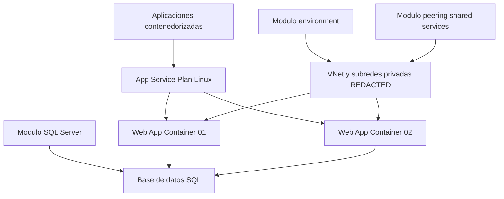
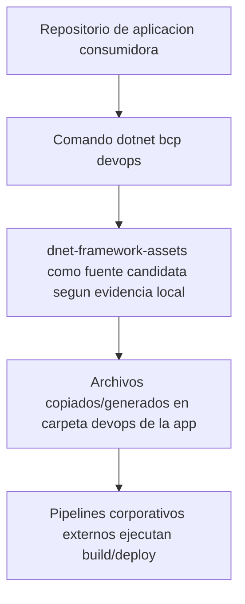

# Reverse Engineering Tecnico - dnet-framework-assets

Fecha de analisis: 2026-09-30
Repositorio analizado: dnet-framework-assets
Alcance: solo este repositorio

## 0. Alcance, reglas y ejecucion segura

- Se realizo inspeccion de estructura, contenido y metadata Git.
- No se ejecutaron pipelines.
- No se ejecutaron despliegues.
- No se ejecuto terraform apply.
- No se realizaron acciones de login externo.
- Terraform no esta instalado localmente en el entorno de analisis, por lo que no fue posible ejecutar terraform fmt -check ni terraform validate.
- Se aplico redaccion de informacion potencialmente sensible usando [REDACTED].

## 1. Baseline Git

Comandos ejecutados:
- git fetch origin
- git branch --show-current
- git rev-parse HEAD
- git rev-parse origin/develop
- git status -sb
- git branch -r
- git show -s --format=%ci HEAD
- git show -s --format=%ci origin/develop

Resultado:

| Item | Valor |
|---|---|
| Branch actual | develop |
| HEAD | 63406f8c827290dc5dc7d26679faec4446ca6c1a |
| origin/develop | 63406f8c827290dc5dc7d26679faec4446ca6c1a |
| HEAD coincide con origin/develop | Si |
| Fecha commit HEAD | 2026-07-23 16:16:55 -0500 |
| Estado local | ## develop...origin/develop |
| Ramas remotas relevantes | origin/develop, origin/master, origin/feature/8.0.0, origin/feature/otel-assets |

Clasificacion de evidencia:
- HECHO VERIFICADO EN CODIGO/ARTEFACTO: baseline Git capturado por comandos.

## 2. Mapa tecnico completo del repositorio

Estructura real observada (top-level):
- .vscode/
- devops/
- docs/
- nuget/
- skills/
- snippets/
- terraform/
- utils/
- README.md

Tabla de areas:

| Area | Tipo de activo | Consumidor | Finalidad | Vigencia aparente |
|---|---|---|---|---|
| README.md | DOCUMENTACION | Dev, DevOps, Arquitectura | Presentacion del repositorio y promesas de alcance | Mixta (actual + drift documental) |
| .vscode/ | UTILITARIO | Desarrollo local | Configuracion auxiliar (Checkmarx ignore) | Baja intensidad / minima |
| devops/actions/ | ACTIVO CORPORATIVO REUTILIZABLE | Equipos app Web/API + pipelines externos | Activos de contenedor y variables deployment | Alta para Web/API; parcial para AKS |
| docs/ | DOCUMENTACION | Lectura humana | Banner imagen | Neutra |
| nuget/ | PLANTILLA | Equipos .NET | Configuracion de feeds NuGet corporativos | Alta |
| skills/ | SKILL IA | Copilot/Agentes y equipos de desarrollo | Instrucciones de generacion y convenciones | Alta |
| snippets/ | SNIPPET | Developers en VS Code | Snippets UI Blazor BCP | Media (backend vacio) |
| terraform/ | INFRAESTRUCTURA COMO CODIGO | Cloud/DevOps | Arquitectura de referencia IaC (App Service + red + SQL) | Parcial / posiblemente de referencia |
| utils/ | UTILITARIO | Developers | Scripts de soporte CSP/interop y sample de seguridad | Mixta (util + ejemplo) |

Clasificacion de evidencia:
- HECHO VERIFICADO EN CODIGO/ARTEFACTO: estas carpetas existen con ese contenido.
- DOCUMENTADO PERO NO VERIFICADO: afirmacion de README sobre cobertura integral CI/CD y algunos destinos.

## 3. Inventario y clasificacion macro de activos

Categorias detectadas:

| Categoria solicitada | Activos encontrados | Comentario |
|---|---|---|
| ACTIVO CORPORATIVO REUTILIZABLE | devops/actions/blazorbcp/web/*, devops/actions/webapibcp/web/*, devops/actions/webapibcp/aks/devops/deploy/*.yaml | Reutilizables por copia/generacion en apps consumidoras |
| EJEMPLO | utils/webapibcp/Program.SecuritySample.cs | Sample explicito de seguridad |
| SNIPPET | snippets/blazorbcp/.vscode/*.code-snippets | Snippets editor para UI BCP |
| PLANTILLA | nuget/NuGet.Config | Plantilla de configuracion corporativa |
| UTILITARIO | utils/blazorbcp/csp-handler.js, utils/blazorbcp/utilsJsInteropWithFunction.cs.js | Soporte tecnico puntual |
| INFRAESTRUCTURA COMO CODIGO | terraform/ARQ_REF_025/main.tf | IaC de referencia, no completo standalone |
| DOCUMENTACION | README.md, devops/actions/README.md, nuget/README.md, skills/**/references/* | Documentacion y guias |
| LEGACY / POSIBLEMENTE OBSOLETO | desalineaciones entre README de devops y estructura real; ausencia de iis0; claims de lineas nginx no exactos | Drift documental claro |
| NO DETERMINADO | Mecanismo exacto de distribucion automatica desde este repo a apps | Falta evidencia directa de publishing/sync |

## 4. DevOps / actions (seccion critica)

### 4.1 Artefactos y acciones

| Artefacto | Tipo | Aplicacion objetivo | Accion realizada | Inputs | Outputs |
|---|---|---|---|---|---|
| devops/actions/blazorbcp/web/Dockerfile | ACTIVO CORPORATIVO REUTILIZABLE | Frontend Blazor WASM | Construye imagen runtime NGINX Alpine; copia /publish/wwwroot; usa usuario no root | Bundle publicado en /publish/wwwroot, nginx.conf, entrypoint.sh | Imagen web lista para servir SPA |
| devops/actions/blazorbcp/web/entrypoint.sh | UTILITARIO de despliegue | Frontend Blazor WASM | Valida env vars, aplica envsubst en nginx.conf, reemplaza placeholders en appsettings.Production.json e inicia nginx | WEB_BCP_URL, API_BCP_URL, AD_CLIENT_ID, API_SCOPE, WEBSITE_DNS_SERVER y appsettings existente | nginx default.conf y appsettings parcheado; proceso nginx iniciado |
| devops/actions/blazorbcp/web/nginx.conf | ACTIVO CORPORATIVO REUTILIZABLE | Frontend Blazor WASM | Define servidor SPA, headers seguridad, CSP, cache, compresion, proxies, fallback index.html | Variables WEB_BCP_URL y API_BCP_URL (y opcionales comentadas para UX/Auth) | Comportamiento runtime HTTP del frontend |
| devops/actions/webapibcp/web/Dockerfile | ACTIVO CORPORATIVO REUTILIZABLE | API/Microservice ASP.NET Core | Construye imagen runtime .NET 10 Alpine, crea usuario no root, configura ICU, copia publish y entrypoint | Carpeta publish + APP_NAME + ARTIFACT_DIRECTORY | Imagen API ejecutable |
| devops/actions/webapibcp/web/entrypoint.sh | UTILITARIO de despliegue | API/Microservice ASP.NET Core | Ejecuta dotnet sobre DLL construida desde env vars | APP_NAME, ARTIFACT_DIRECTORY | Proceso dotnet iniciado |
| devops/actions/webapibcp/aks/devops/deploy/dev-vars.yaml | PLANTILLA | API/Microservice en AKS | Define parametros de probes, HPA, ingress, recursos, vault/secrets por ambiente dev | Variables del equipo/app | Valores de despliegue para motor externo |
| devops/actions/webapibcp/aks/devops/deploy/cert-vars.yaml | PLANTILLA | API/Microservice en AKS | Igual a dev para cert, con ajustes de include_hpa y secretos | Variables del equipo/app | Valores cert para despliegue |
| devops/actions/webapibcp/aks/devops/deploy/prod-vars.yaml | PLANTILLA | API/Microservice en AKS | Igual a dev/cert para prod, replicas min distintas y swagger desactivado | Variables del equipo/app | Valores prod para despliegue |
| devops/actions/README.md | DOCUMENTACION | DevOps/arquitectura | Describe targets y estructura esperada de assets | N/A | Guia humana |

### 4.2 Cobertura de pipeline CI/CD

Hallazgos:
- No existen Jenkinsfiles.
- No existen workflows de GitHub Actions.
- No existen scripts explicitos de restore/build/test/publish de CI.
- No existen stages declarativos de promotion/rollback.

Clasificacion de evidencia:
- HECHO VERIFICADO EN CODIGO/ARTEFACTO: ausencia de archivos de pipeline en el repo.
- DOCUMENTADO PERO NO VERIFICADO: README menciona CI/CD completo con Vault.
- INFERENCIA TECNICA: el repo aporta assets runtime y valores deployment, pero la orquestacion de pipeline vive fuera.

## 5. Docker (matriz solicitada)

| Activo | Workload | Build image | Runtime image | Version .NET | Destino esperado |
|---|---|---|---|---|---|
| devops/actions/blazorbcp/web/Dockerfile | Web SPA Blazor WASM | No define build stage (espera artefacto publish externo) | alpine:3.24.1 + nginx + headers-more | No aplica runtime .NET (sirve estaticos) | Azure Web App for Containers o contenedor generico |
| devops/actions/webapibcp/web/Dockerfile | API/Microservice ASP.NET Core | No define build stage (espera publish externo) | mcr.microsoft.com/dotnet/aspnet:10.0-alpine | .NET 10 runtime | Azure Web App for Containers y potencialmente AKS |

Notas:
- HECHO VERIFICADO EN CODIGO/ARTEFACTO: ambos Dockerfile son runtime-only; build/publish se externaliza.
- HECHO VERIFICADO EN CODIGO/ARTEFACTO: no aparece referencia a .NET 8 en estos activos.

## 6. NGINX / frontend

Activo principal:
- devops/actions/blazorbcp/web/nginx.conf (653 lineas observadas)

Capacidades verificadas:
- SPA fallback a index.html con try_files.
- Proxy /api hacia API_BCP_URL.
- Bloqueo de archivos sensibles.
- Headers de seguridad (HSTS, X-Frame-Options, X-XSS-Protection, X-Content-Type-Options, Referrer-Policy, CSP, etc.).
- Reglas y optimizaciones para recursos Blazor WASM (_framework, wasm, js, dll, json).
- Compresion gzip y politicas cache.
- Proxies hacia servicios Microsoft externos.

Destino probable por evidencia:
- HECHO VERIFICADO EN CODIGO/ARTEFACTO: contenedor HTTP en puerto 80.
- DOCUMENTADO PERO NO VERIFICADO: README lo posiciona para Azure Web App for Containers.
- INFERENCIA TECNICA: tambien podria correr en AKS u otro runtime container, pero sin archivos de deployment directos en esta carpeta.

## 7. Azure App Service

| Capacidad | Evidencia | Estado |
|---|---|---|
| Frontend contenedorizado para Web App for Containers | devops/actions/blazorbcp/web/Dockerfile + entrypoint + nginx.conf y README devops | IMPLEMENTADO EN ASSET |
| API contenedorizada para Web App for Containers | devops/actions/webapibcp/web/Dockerfile + entrypoint y README devops | IMPLEMENTADO EN ASSET |
| Provision de App Service Plan Linux | terraform/ARQ_REF_025/main.tf modulo service-plan | IMPLEMENTADO EN ASSET |
| Provision de Web Apps Linux de contenedor | terraform/ARQ_REF_025/main.tf modulos webapp (2 instancias declaradas) | IMPLEMENTADO EN ASSET |
| Configuracion completa de app settings por ambiente | No hay archivo dedicado de appsettings/env para App Service fuera de entrypoints | DEPENDE DE PIPELINE EXTERNO |
| Pipeline de despliegue App Service (build/push/deploy slots) | No hay Jenkins/GitHub Actions en repo | DEPENDE DE PIPELINE EXTERNO |

## 8. AKS / Kubernetes

Activos encontrados:
- devops/actions/webapibcp/aks/devops/deploy/dev-vars.yaml
- devops/actions/webapibcp/aks/devops/deploy/cert-vars.yaml
- devops/actions/webapibcp/aks/devops/deploy/prod-vars.yaml

Contenido funcional de esas plantillas:
- health_probes readiness/liveness.
- include_hpa.
- ingress_map y anotaciones nginx ingress.
- recursos CPU/memoria y replicas.
- toggles de hashicorp_vault_enable y azure_keyvault.
- extra_secrets y seccion comentada extra_configmaps.

Lo que NO existe en repo:
- manifests Kubernetes (Deployment/Service/Ingress) concretos.
- Helm charts concretos.
- secretos k8s reales.
- pipelines de despliegue AKS.

Cadena aplicacion -> imagen -> assets k8s -> AKS:
- HECHO VERIFICADO EN CODIGO/ARTEFACTO: existen solo valores de despliegue por ambiente.
- INFERENCIA TECNICA: render/manifiestos y aplicacion al cluster ocurre fuera de este repo (pipeline corporativo o tooling externo).

Grado de automatizacion real:
- ASSET PARCIAL (fuerte en parametros, ausente en orquestacion ejecutable end-to-end).

## 9. Terraform

Ubicacion:
- terraform/ARQ_REF_025/main.tf

### 9.1 Hallazgos tecnicos de IaC

Elementos presentes:
- variable app_globals.
- Modulos privados de Terraform Enterprise (app.terraform.io/BCP-CLOUD/*): azlogin, environment, subnet, peering, service-plan, webapp, sql-server.
- Foco arquitectonico orientado a App Service + red + SQL.

Elementos ausentes o parciales:
- No hay providers declarados en este archivo (usa aliases que no estan definidos aqui).
- No hay backend config.
- No hay outputs.
- No hay archivo variables tfvars en repo.
- No hay modulo AKS en este archivo.
- No hay modulo explicito de Key Vault.
- Existen dos bloques module con el mismo nombre webapp_frontend (probable inconsistencia para ejecucion directa).

Clasificacion de evidencia:
- HECHO VERIFICADO EN CODIGO/ARTEFACTO: contenido del main.tf.
- ALTERNATIVA / EJEMPLO: por su forma parcial y dependencias externas, parece arquitectura de referencia mas que stack listo standalone.
- NO DETERMINADO: estado operativo real en Terraform Enterprise sin contexto externo.

### 9.2 Validacion terraform segura

- terraform command not found en el entorno analizado.
- No se ejecuto terraform fmt -check ni terraform validate.

### 9.3 Diagrama logico reconstruido (solo con evidencia existente)

Notas:
- HECHO VERIFICADO EN CODIGO/ARTEFACTO: service-plan, webapp x2, subnet, peering, sql-server.
- NO DETERMINADO: topologia exacta de flujos app->sql en runtime, por falta de codigo de aplicacion y settings concretos.

## 10. NuGet

Activos:
- nuget/NuGet.Config
- nuget/README.md

Hallazgos:
- Se definen dos packageSources corporativos internos [REDACTED] para ecosistema general y DNET.
- Se usa packageSourceMapping para enviar BCP.* al feed DNET y * al feed general.
- README explica ubicaciones por ambito (solucion, usuario, maquina).

Respuesta a la pregunta de distribucion oficial de paquetes DNET:
- DEMOSTRADO: hay feed corporativo DNET en NuGet.Config.
- PARCIAL: no hay pipeline/publicacion/versionado de paquetes dentro de este repo.
- NO DETERMINADO: flujo completo de release de paquetes (promocion snapshot/release) fuera de este repositorio.

## 11. Snippets

Activos:
- snippets/blazorbcp/.vscode/bcp-components-csharp.code-snippets
- snippets/blazorbcp/.vscode/bcp-components-razor.code-snippets
- snippets/webapibcp/.gitkeep

Clasificacion por finalidad:
- Frontend: si (componentes BCP para Blazor).
- Backend: no (webapibcp vacio en snippets).
- Auth/HTTP/logging/database/DevOps/testing/configuracion: no como snippets directos.

Interpretacion:
- SNIPPET para onboarding/productividad de UI.
- No generan infraestructura ni pipeline.
- No parecen fuente canonica de arquitectura; son aceleradores de codigo.

## 12. Skills

Definicion de skill en este repo:
- Archivos SKILL.md para agentes/IA con instrucciones de generacion de codigo, convenciones y comandos CLI DNET.

Cantidad:
- Total SKILL.md: 24
- blazorbcp: 18
- webapibcp: 6

Clasificacion:
- SKILL DE DESARROLLO: casi todos (componentes Blazor, auth/http/vault API).
- SKILL IA: si, estructura .agents/skills y lenguaje orientado a agentes.
- DOCUMENTACION: si, incluyen guias y referencias extensas.
- AUTOMATIZACION: parcial via instrucciones de comando (ej. dotnet bcp devops, dotnet bcp openapi-generator), pero no ejecutan por si mismas.

Hallazgos clave:
- api-devops SKILL instruye uso de dotnet bcp devops con opciones deploy iis|web|aks.
- api-openapi-creator incluye corpus de referencia muy grande (OpenAPI spec, spectral, ejemplos).
- Las skills de webapi no siempre declaran compatibilidad en frontmatter de forma uniforme.

## 13. Utils

Activos:
- utils/blazorbcp/csp-handler.js
- utils/blazorbcp/utilsJsInteropWithFunction.cs.js
- utils/webapibcp/Program.SecuritySample.cs

Evaluacion:
- csp-handler.js: UTILITARIO para obtener hashes CSP en desarrollo y luego aplicarlos en nginx.conf.
- utilsJsInteropWithFunction.cs.js: UTILITARIO para convertir strings en funciones JS para columnDefs en componente de tabla.
- Program.SecuritySample.cs: EJEMPLO de middleware CSP en Razor Pages server-side.

Impacto en deployment:
- No despliegan por si mismos.
- Soportan seguridad/configuracion de runtime y desarrollo.

## 14. VS Code / developer experience

Contenido .vscode:
- .vscode/.checkmarxIgnored con contenido vacio ({}).

No se encontraron:
- launch.json
- tasks.json
- settings.json
- extensions.json

Interpretacion:
- Hay indicio de integracion con escaneo seguridad (Checkmarx), pero sin reglas activas en este repo.

## 15. Modelo de consumo de assets (seccion critica)

Evidencias de mecanismo de adquisicion:
- Skill api-devops: dotnet bcp devops [--type ...] [--deploy ...] y afirma que crea carpeta devops.
- Estructura de este repo contiene justamente activos devops parametrizables para web/api/aks.

Modelo conceptual reconstruido:

Respuesta a preguntas de consumo:
- Los assets quedan copiados/forkeados dentro de cada aplicacion?: INFERENCIA TECNICA: probablemente si, porque el skill habla de generar carpeta devops local.
- Permanecen vinculados al repositorio?: NO DETERMINADO; no hay mecanismo de sync bidireccional visible aqui.
- Como se actualizan posteriormente?: NO DETERMINADO; no hay versionado/distribucion automatica visible en este repo.

## 16. Relacion con dotnet bcp devops

Evidencia directa:
- skills/webapibcp/.agents/skills/api-devops/SKILL.md contiene comando dotnet bcp devops con despliegues iis|web|aks.

Inferencia controlada:
- INFERENCIA TECNICA: este repositorio parece repositorio-fuente de assets que el comando podria materializar en apps.
- NO DETERMINADO: contrato exacto CLI->fuente (API, package, zip, git raw, etc.) no esta en este repo.

## 17. IIS (busqueda explicita)

Busquedas y hallazgos:
- IIS/IIS Express/web.config/ASP.NET Core Module/Hosting Bundle/Windows Server.
- Solo aparecen menciones textuales en:
  - skills webapi devops (opcion deploy iis)
  - README de devops (estructura menciona iis0 onpremise)
- No existen artefactos IIS concretos:
  - no web.config
  - no scripts IIS
  - no perfiles hosting bundle

Clasificacion por evidencia:
- desarrollo local IIS Express: NO DETERMINADO (sin evidencia).
- deployment productivo IIS on-premise: DOCUMENTADO PERO NO VERIFICADO (mencion textual, sin activos ejecutables).

Conclusion IIS para escenario Windows Server + IIS + Blazor WASM + API:
- NO CUBIERTO por activos concretos en este repositorio.

## 18. Matriz de destinos de deployment

| Destino | Web SPA | API | Microservice | Assets disponibles | Nivel de evidencia |
|---|---|---|---|---|---|
| IIS on-premise | No assets concretos | No assets concretos | Mencionado en skill/readme | DOCUMENTADO | NO CUBIERTO |
| Azure App Service | Docker + nginx + entrypoint | Docker + entrypoint | Docker API reutilizable | ASSET PARCIAL | HECHO VERIFICADO EN CODIGO/ARTEFACTO |
| Azure Web App Container | Si (frontend) | Si (API) | Si (container API) | ASSET COMPLETO (runtime assets) | HECHO VERIFICADO EN CODIGO/ARTEFACTO |
| AKS/Kubernetes | No manifiestos web dedicados | Vars YAML para API | Vars YAML por ambiente | ASSET PARCIAL | HECHO VERIFICADO EN CODIGO/ARTEFACTO |

## 19. Portabilidad IIS -> App Service -> AKS (solo con evidencia disponible)

| Dimension | IIS on-premise | App Service container | AKS |
|---|---|---|---|
| Codigo aplicacion | NO DETERMINADO | Similar (contenedor) | Similar (contenedor) |
| Docker | No evidencias IIS | Si (web/api Dockerfile) | Si (imagenes contenedor reutilizables) |
| Configuracion | Sin web.config/assets IIS | entrypoint + env vars + nginx | vars YAML por ambiente + pipeline externo |
| Secretos | No activos IIS | via env vars/pipeline externo | toggles vault/keyvault + extra_secrets en vars |
| Logging | No pipeline IIS | runtime por contenedor | runtime y plantillas con OTel flags |
| Observabilidad | No evidencia IIS | parcial en assets | OTel flags en vars AKS |
| Pipeline | No assets | externo | externo |
| Terraform | No modulo IIS | si (App Service en ARQ_REF_025) | no modulo AKS en ARQ_REF_025 |
| Networking | NO DETERMINADO | VNet/subnet/peering en Terraform | ingress y anotaciones en vars AKS |

Clasificacion de evidencia:
- HECHO VERIFICADO EN CODIGO/ARTEFACTO: App Service y AKS parcial.
- NO DETERMINADO: portabilidad transparente extremo a extremo.

## 20. Seguridad en DevOps

| Elemento seguridad | Evidencia | Tipo |
|---|---|---|
| Sonar/SAST/Xray | badges en README | DOCUMENTADO PERO NO VERIFICADO |
| Checkmarx | .vscode/.checkmarxIgnored vacio | DOCUMENTADO/PARCIAL |
| Hardening HTTP frontend | nginx.conf (headers, CSP, bloqueo archivos, proxy rules) | HECHO VERIFICADO EN CODIGO/ARTEFACTO |
| Vault/KeyVault toggles AKS | vars YAML (hashicorp_vault_enable, azure_keyvault*) | HECHO VERIFICADO EN CODIGO/ARTEFACTO |
| Secret handling AKS | extra_secrets en vars YAML | HECHO VERIFICADO EN CODIGO/ARTEFACTO |
| Secret scanning/SCA/container scanning en pipeline | no scripts/pipelines presentes | NO DETERMINADO |

## 21. Drift de versiones y coherencia

Hallazgos:
- No se encontraron referencias net8/NET_8/.NET 8 en assets relevantes.
- Si se encontraron referencias .NET 10 y runtime 10.0-alpine.
- Skills API usan paquetes preview 10.0.0-preview.1.

Drift adicional (documentacion vs artefacto):
- devops/actions/README describe estructura con carpetas wapc/aksv/iis0, pero estructura real usa web/aks y no incluye iis0.
- devops/actions/README indica nginx.conf de 624 lineas; archivo real tiene 653 lineas.
- README menciona CI/CD completo, pero no hay pipelines en el repo.

Clasificacion:
- HECHO VERIFICADO EN CODIGO/ARTEFACTO: referencias .NET 10.
- LEGACY / POSIBLEMENTE OBSOLETO: discrepancias documentales.

## 22. Source of truth por tipo de activo

| Tipo de activo | Evaluacion de source of truth |
|---|---|
| Docker (web/api) | NO DETERMINADO (alto indicio de FUENTE CANONICA operativa para runtime assets) |
| Nginx frontend | NO DETERMINADO (alto indicio de FUENTE CANONICA para frontend container hardening) |
| Jenkins | NO DETERMINADO (sin archivos) |
| Terraform ARQ_REF_025 | ALTERNATIVA / EJEMPLO (arquitectura de referencia parcial) |
| Snippets | NO DETERMINADO como fuente canonica; este repo contiene la referencia local observada de snippets de editor, no de arquitectura |
| NuGet config | NO DETERMINADO como fuente canonica; contiene una configuracion corporativa reutilizable de feeds y packageSourceMapping |
| Skills | NO DETERMINADO como fuente canonica; este repo contiene instrucciones internas para agentes/IA en el contexto DNET |
| Security config pipeline | NO DETERMINADO (sin pipeline files) |

## 23. Relacion con reference applications (segun baseline provisto)

| Artefacto comparado | Clasificacion |
|---|---|
| Dockerfile frontend observado en reference frontend vs Dockerfile blazorbcp/web | SIMILAR |
| nginx.conf frontend reference vs nginx blazorbcp/web | SIMILAR |
| entrypoint frontend reference vs blazorbcp/web/entrypoint.sh | SIMILAR |
| Dockerfile API reference vs webapibcp/web/Dockerfile | SIMILAR |
| Variables dev/cert/prod en APIs UX/BS reference vs aks/devops/deploy/*.yaml | SIMILAR (misma idea y estructura por ambiente; sin trazabilidad directa demostrada) |
| Jenkinsfiles/security stages vistos en reference apps vs este repo | NO RELACIONADO (no existen Jenkinsfiles aqui) |
| Claims iis/aks/web del skill devops vs referencia previa | NO DETERMINADO (falta evidencia de trazabilidad archivo-a-archivo) |

Nota metodologica:
- No se afirma MISMO ACTIVO / COPIA sin diff directo entre repositorios.

## 24. Comparacion con templates y references (matriz solicitada)

| Activo | Template | Reference App | Assets repo | Relacion |
|---|---|---|---|---|
| Dockerfile frontend | No generado directamente (baseline previo) | Si (baseline previo) | Si | SIMILAR |
| nginx frontend | No generado directamente | Si | Si | SIMILAR |
| entrypoint frontend | No generado directamente | Si | Si | SIMILAR |
| Dockerfile API | No generado directamente | Si | Si | SIMILAR |
| deploy vars AKS | No generado directamente | Si (UX/BS) | Si | SIMILAR; no se demostro derivacion directa |
| Kubernetes manifests | No generado directamente | No concluyente en baseline | No | NO DETERMINADO |
| Jenkins pipeline | No generado directamente | Si en references | No | NO RELACIONADO |
| Terraform | No generado directamente | No concluyente en baseline | Si (ARQ_REF_025) | NO DETERMINADO |
| NuGet config corporativo | No parte del template base | No concluyente | Si | COMPLEMENTARIO |
| Security scanning stages | No generado directamente | Si (baseline previo) | Solo menciones/documentacion | NO DETERMINADO |

## 25. Que resuelve este repositorio (matriz solicitada)

| Tema | Framework | Templates | Reference Apps | Assets |
|---|---|---|---|---|
| Codigo cross-cutting | Si (baseline previo) | Parcial (scaffold) | Uso aplicado | No (excepto samples/utils) |
| Scaffolding app | No | Si | N/A | No (excepto skills/snippets de apoyo) |
| Deployment runtime assets | No | No directo | Si (ya embebidos) | Si (docker/nginx/entrypoint/vars) |
| Infraestructura IaC | No | No | Parcial en references (segun baseline) | Si (ARQ_REF_025 referencial) |
| CI/CD pipelines | No | No | Si en references (baseline) | No (solo menciones) |
| Security gates pipeline | No | No | Si en references (baseline) | Documentado, no implementado en pipeline files |
| Developer tooling | Parcial | Parcial | Parcial | Si (skills/snippets/nuget/utils) |
| Cloud targeting | No impuesto | No directo | Si en ejemplos | Si (App Service/AKS parcial + Terraform referencial) |

## 26. Que sigue sin resolverse (para Confluence/equipo DNET)

Preguntas prioritarias para habilitar fase TO-BE/migracion, sin diseñarla aun:

1. Cual es el mecanismo oficial de distribucion/versionado de assets devops (CLI, paquete, sync, release cadence)?
2. Como se actualizan apps consumidoras cuando cambian assets (merge manual, regeneracion, tooling diff)?
3. Donde estan los pipelines canonicos (Jenkins/GitHub Actions) y sus security gates ejecutables?
4. El soporte IIS on-premise es real/activo o solo legado documental? Donde estan los artefactos IIS vigentes?
5. Cual es la relacion exacta entre devops/actions y dotnet bcp devops (source mapping/version pinning)?
6. ARQ_REF_025 es blueprint productivo vigente o ejemplo historico? Cual es su repositorio IaC operativo canonico?
7. Para AKS, donde viven charts/manifests reales y contratos de variables consumidas por dev/cert/prod?
8. Cual es la politica oficial App Service vs AKS por tipo de workload (Web SPA, API UX, API BS, microservicios)?
9. Cual es la politica oficial de seguridad de pipeline (SAST/SCA/Xray/secret scan/container scan) y en que repos se implementa?
10. Cual es el baseline definitivo de versionado (.NET 10 GA vs preview packages 10.0.0-preview.1) para assets y dependencias?

## 27. Conclusion final (14 puntos solicitados)

1. Que es realmente dnet-framework-assets:
   - Repositorio de activos tecnicos complementarios al framework/template, centrado en deployment assets, configuracion y aceleradores de desarrollo.

2. Que activos contiene:
   - Docker/entrypoint/nginx para Web/API, vars AKS por ambiente, NuGet config corporativo, skills IA, snippets Blazor, utils de seguridad/interop, Terraform referencial.

3. Que activos parecen reutilizables y cuya canonicidad queda por confirmar:
   - `devops/actions` y `nuget/NuGet.Config` muestran reutilizacion clara; `skills` y `snippets` funcionan como referencias internas de productividad. La condicion de fuente canonica debe confirmarse fuera de este repositorio.

4. Relacion con templates:
   - Complementa carencias de templates en DevOps/deployment (coherente con baseline de templates).

5. Relacion con reference applications:
   - Alta similitud tipologica de artefactos (Docker/Nginx/entrypoint/vars), sin prueba directa de copia archivo-a-archivo.

6. Que proporciona para Web:
   - Contenedor NGINX endurecido para SPA Blazor, entrypoint con sustitucion de variables y proxy API.

7. Que proporciona para API/Microservice:
   - Contenedor .NET 10 runtime y plantillas de variables AKS (probes, HPA, ingress, vault, recursos).

8. Que proporciona para App Service:
   - Assets de contenedor web/api y Terraform referencial con App Service Plan + WebApps Linux.

9. Que proporciona para AKS:
   - Variables por ambiente para despliegue; no incluye manifests/charts/pipeline ejecutable.

10. Que proporciona para IIS on-premise:
    - Solo menciones documentales/skill; no activos tecnicos concretos para IIS productivo.

11. Como se consumen/actualizan los assets:
    - Evidencia de consumo via dotnet bcp devops (skills); mecanismo exacto de sincronizacion/actualizacion posterior no determinado.

12. Que decisiones de deployment quedan fuera del repo:
    - Pipeline CI/CD completo, promotion/rollback, manifests/charts reales, secretos reales, governance operacional de entornos.

13. Que contradicciones/version drift permanecen:
    - Drift documental en estructura devops (wapc/aksv/iis0 vs web/aks real), claims de CI/CD completo sin pipelines, y metadata de lineas nginx no coincide.

14. Que falta obtener de Confluence antes de cerrar definitivamente el analisis DNET:
    - Source-of-truth de pipeline, soporte real IIS, contrato operativo de dotnet bcp devops, estrategia App Service vs AKS, IaC canonica productiva y politica de seguridad ejecutable.

## 28. Validacion final obligatoria

### 28.1 Re-enumeracion de carpetas relevantes
- .vscode
- devops/actions
- docs
- nuget
- skills
- snippets
- terraform
- utils

### 28.2 Busquedas obligatorias ejecutadas
Terminos revisados:
- IIS, IIS Express, web.config
- App Service, Web App, azurewebsites
- AKS, Kubernetes
- Docker, Nginx
- Jenkins
- Terraform
- Vault
- ConfigMap, Secret
- Sonar, SAST, Xray
- NuGet
- dotnet bcp
- devops
- NET_8, NET_10, net8, net10
- TODO, FIXME

Resultado resumido:
- IIS/IIS Express/web.config: sin artefactos de implementacion (solo menciones textuales).
- App Service/Web App: evidencias en README devops, docker assets y Terraform ARQ_REF_025.
- AKS/Kubernetes: evidencias en vars YAML por ambiente; sin manifests/charts.
- Docker/Nginx: presentes y sustantivos.
- Jenkins/GitHub Actions: no presentes como archivos de pipeline.
- Terraform: presente solo ARQ_REF_025/main.tf.
- Vault/Secret/ConfigMap: toggles y estructuras en vars AKS + skills.
- Sonar/SAST/Xray: badges y texto; no stages ejecutables en este repo.
- NET_8/net8: no hallado en activos relevantes.
- NET_10/.NET 10: hallado en docker/skills/readme.
- TODO/FIXME: sin marcadores tecnicos de deuda claros (coincidencias por lenguaje natural en docs).

### 28.3 Comprobaciones metodologicas
- No se confundio IIS Express con IIS productivo.
- No se confundio snippet con politica corporativa.
- No se trato Terraform como infraestructura desplegada.
- No se afirmo origen de archivos en reference apps sin evidencia directa.
- No se ejecutaron acciones de infraestructura.

---
Fin del documento tecnico.