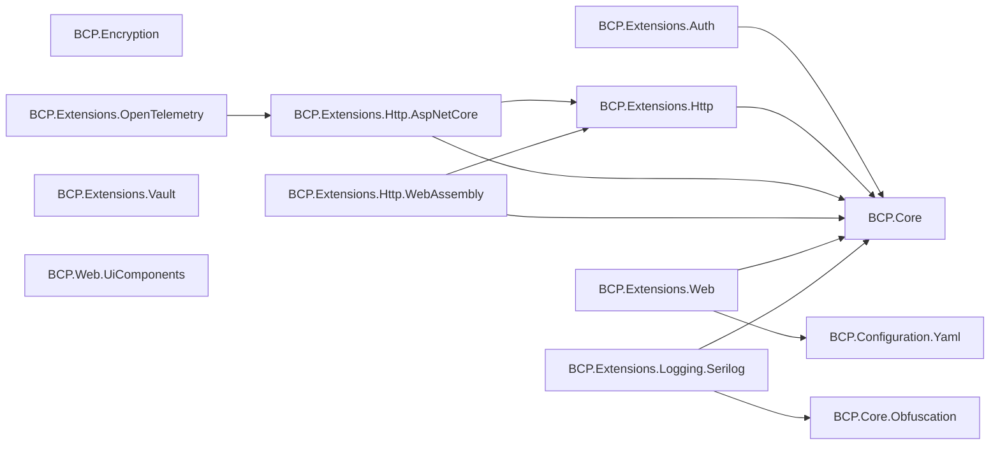
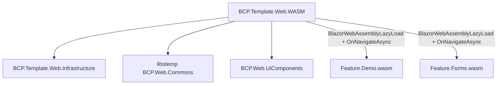
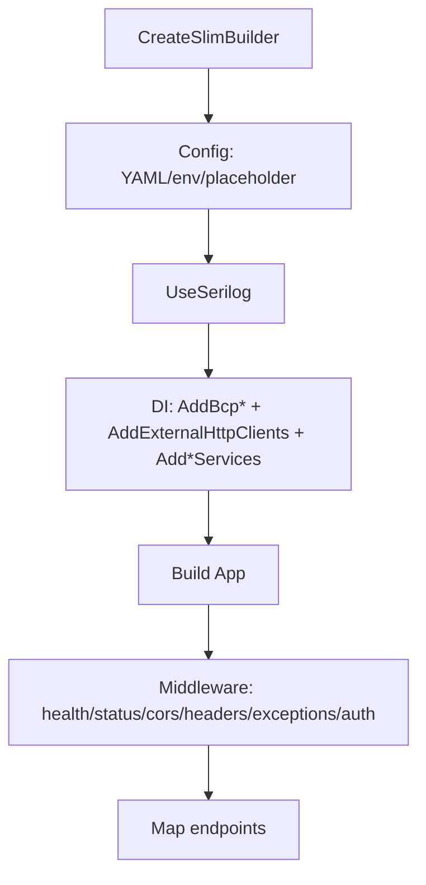

# DNET Framework Technical Reference

## Metadatos de verificacion

* Repositorio analizado: dnet-framework
* Rama: develop
* Commit: 215cbdbd4f3f84f7648e9ad327cf788c6f2464f0
* Fecha commit: 2026-03-17T01:43:03-05:00
* SO de analisis: Windows
* SDK usado en validacion: .NET SDK 10.0.401 (instalados: 10.0.301 y 10.0.401)
* Archivo global de version SDK: GLOBAL_JSON_MISSING
* Baseline Git (ultima pasada 2026-09-30): HEAD=215cbdbd4f3f84f7648e9ad327cf788c6f2464f0, origin/develop=215cbdbd4f3f84f7648e9ad327cf788c6f2464f0, COINCIDE=SI
* Estado local (git status -sb): ## develop...origin/develop / AM DNET_FRAMEWORK_TECHNICAL_REFERENCE.md / ?? DNET_FRAMEWORK_TECHNICAL_REFERENCE-v1.md

## Leyenda de clasificacion

* HECHO VERIFICADO EN CÓDIGO: hallazgo sustentado por inspeccion de codigo/proyectos/soluciones y/o ejecucion CLI.
* DOCUMENTADO PERO NO VERIFICADO: hallazgo declarado en README/docs pero no validado directamente por ejecucion o por evidencia suficiente en codigo.
* INFERENCIA TÉCNICA: conclusion deducida de la estructura y patrones observados, sin declaracion explicita unica.
* NO DETERMINADO: no existe evidencia suficiente en el repositorio analizado para concluir.

---

## A) Alcance y metodo

| Estado | Hallazgo | Evidencia |
| --- | --- | --- |
| HECHO VERIFICADO EN CÓDIGO | El analisis cubre solucion principal, librerias en src, pruebas en tests y templates en samples. | BCP.Extensions.slnx, src/, tests/, samples/ |
| HECHO VERIFICADO EN CÓDIGO | El entregable se limita a documentacion tecnica; no se modificaron archivos fuente del framework. | Estado git limpio antes de crear este archivo |
| HECHO VERIFICADO EN CÓDIGO | Se incluyo validacion por ejecucion: pruebas framework, pruebas sample API y build sample Web. | dotnet test BCP.Extensions.slnx; dotnet test samples/BCP.Template.Api/BCP.Template.Api.slnx; dotnet build samples/BCP.Template.Web/BCP.Template.Web.slnx |
| INFERENCIA TÉCNICA | El framework esta orientado a consumo por extensiones DI Add*/Use* y contratos de excepciones/resultados para APIS. | Presencia sistematica de extension methods y handlers en BCP.Extensions.* |

## B) Baseline tecnico (.NET, build, paquetes, feeds)

| Estado | Hallazgo | Evidencia |
| --- | --- | --- |
| HECHO VERIFICADO EN CÓDIGO | Baseline de compilacion de framework: net10.0. | Directory.Build.props: TargetFramework=net10.0 |
| HECHO VERIFICADO EN CÓDIGO | Version de framework declarada: 10.0.0. | Directory.Build.props: VersionPrefix=10.0.0 |
| HECHO VERIFICADO EN CÓDIGO | Gestion central de versiones de paquetes habilitada en raiz. | Directory.Packages.props: ManagePackageVersionsCentrally=true |
| HECHO VERIFICADO EN CÓDIGO | Salida de paquetes configurada centralmente en PackagesOutput y metadata de paquete/repositorio definida. | Directory.Build.props: PackageOutputPath, PackageProjectUrl, RepositoryUrl |
| HECHO VERIFICADO EN CÓDIGO | Feed raiz restringido a public-nuget corporativo. | nuget.config (raiz) |
| HECHO VERIFICADO EN CÓDIGO | Sample Web agrega feed adicional dnet-nuget y packageSourceMapping para BCP.*. | samples/BCP.Template.Web/nuget.config |
| HECHO VERIFICADO EN CÓDIGO | No existe pin de SDK por global.json. | GLOBAL_JSON_MISSING |
| HECHO VERIFICADO EN CÓDIGO | Se observan paquetes mayormente 10.x, con desviaciones puntuales. | Directory.Packages.props |

## C) Inventario de soluciones y proyectos

### Solucion principal

| Estado | Hallazgo | Evidencia |
| --- | --- | --- |
| HECHO VERIFICADO EN CÓDIGO | BCP.Extensions.slnx contiene 12 proyectos de src y 11 proyectos de tests. | BCP.Extensions.slnx |
| HECHO VERIFICADO EN CÓDIGO | BCP.Web.UiComponents existe en src pero no esta incluido en BCP.Extensions.slnx. | src/BCP.Web.UiComponents/BCP.Web.UiComponents.csproj y BCP.Extensions.slnx |

### Soluciones de muestras

| Estado | Hallazgo | Evidencia |
| --- | --- | --- |
| HECHO VERIFICADO EN CÓDIGO | samples/BCP.Template.Api.slnx referencia librerias del framework por ProjectReference y contiene 3 proyectos de pruebas. | samples/BCP.Template.Api/BCP.Template.Api.slnx |
| HECHO VERIFICADO EN CÓDIGO | samples/BCP.Template.Web.slnx incluye BCP.Web.UiComponents y BCP.Web.Commons, con app WASM y feature assemblies lazy-load. | samples/BCP.Template.Web/BCP.Template.Web.slnx, src/BCP.Template.Web.WASM/BCP.Template.Web.csproj |
| HECHO VERIFICADO EN CÓDIGO | No se encontraron proyectos de prueba en sample Web. | NO_TEST_PROJECTS_FOUND |

## D) Grafo de dependencias internas de librerias

| Estado | Hallazgo | Evidencia |
| --- | --- | --- |
| HECHO VERIFICADO EN CÓDIGO | El nucleo transversal se concentra en BCP.Core y BCP.Extensions.Http para composicion de otras librerias. | ProjectReference en csproj de src |
| INFERENCIA TÉCNICA | La dependencia OTel -> Http.AspNetCore sugiere reutilizacion de utilidades TLS/certificados para exporter OTLP. | BCP.Extensions.OpenTelemetry.csproj + OtlpExporterHelperExtensions.cs |

## E) BCP.Core: contratos base, errores y resultados

| Estado | Hallazgo | Evidencia |
| --- | --- | --- |
| HECHO VERIFICADO EN CÓDIGO | ErrorCategory define categorias canonicas (invalid-request, unauthorized, forbidden, conflict, etc.). | src/BCP.Core/Constants/ErrorCategory.cs |
| HECHO VERIFICADO EN CÓDIGO | ApiException soporta builder/mutacion, headers, properties, details y causa encadenada. | src/BCP.Core/Exceptions/ApiException.cs, ApiExceptionBuilder.cs |
| HECHO VERIFICADO EN CÓDIGO | Result encapsula exito/error con validaciones para acceso a Value y factories tipadas. | src/BCP.Core/Models/Result.cs |
| HECHO VERIFICADO EN CÓDIGO | Se exponen cabeceras canonicas HTTP para Request-ID, app-code, caller-name y errores. | src/BCP.Core/Header/HttpHeaderProperties.cs |
| HECHO VERIFICADO EN CÓDIGO | Existe cobertura de pruebas para categorias, excepciones, Result y headers. | tests/BCP.Core.Tests/* |

## F) BCP.Configuration.Yaml: provider YAML para IConfiguration

| Estado | Hallazgo | Evidencia |
| --- | --- | --- |
| HECHO VERIFICADO EN CÓDIGO | Se implementa AddYamlFile con sobrecargas equivalentes a proveedores nativos de archivos. | src/BCP.Configuration.Yaml/YamlConfigurationExtensions.cs |
| HECHO VERIFICADO EN CÓDIGO | El parser aplana mappings/sequences a claves jerarquicas con separador de configuracion (:). | src/BCP.Configuration.Yaml/YamlConfigurationStreamParser.cs |
| HECHO VERIFICADO EN CÓDIGO | Se detectan claves duplicadas y se lanzan errores de formato. | YamlConfigurationStreamParser.cs (duplicate key check) |
| HECHO VERIFICADO EN CÓDIGO | Se manejan null semanticos YAML (~, null, Null, NULL). | YamlConfigurationStreamParser.cs |
| HECHO VERIFICADO EN CÓDIGO | Existe bateria de pruebas para secuencias, nested sequences, BOM, nulls, optional file y escenarios invalidos. | tests/BCP.Configuration.Yaml.Tests/YamlConfigurationTest.cs, SequenceTests.cs |

## G) BCP.Encryption: cifrado AES-GCM

| Estado | Hallazgo | Evidencia |
| --- | --- | --- |
| HECHO VERIFICADO EN CÓDIGO | IEncryptionService define Encrypt/Decrypt. | src/BCP.Encryption/IEncryptionService.cs |
| HECHO VERIFICADO EN CÓDIGO | AesCryptoService usa AES-GCM con IV aleatorio por mensaje y tag de autenticacion. | src/BCP.Encryption/Services/AesCryptoService.cs |
| HECHO VERIFICADO EN CÓDIGO | Parametros de AES-GCM: IV 12 bytes y tag 16 bytes. | src/BCP.Encryption/Constants/AesGcmConstants.cs |
| HECHO VERIFICADO EN CÓDIGO | La salida cifrada concatena IV + ciphertext + tag y se serializa en Base64. | AesCryptoService.cs |
| HECHO VERIFICADO EN CÓDIGO | Pruebas validan roundtrip de cifrado y utilidades hex. | tests/BCP.Encryption.Tests/* |

## H) BCP.Extensions.Auth: autenticacion/autorizacion

| Estado | Hallazgo | Evidencia |
| --- | --- | --- |
| HECHO VERIFICADO EN CÓDIGO | AddBcpAuthenticationPlatform habilita esquema de policy y seleccion de issuer por claim iss del JWT. | src/BCP.Extensions.Auth/DependencyInjection.cs |
| HECHO VERIFICADO EN CÓDIGO | Se soportan emisores con PublicKey y emisores OIDC (Authority). | DependencyInjection.cs (ConfigureJwtBearerScheme / ConfigureJwtBearerOidcScheme) |
| HECHO VERIFICADO EN CÓDIGO | AddBcpAuthorization exige AllowedScopes y configura default policy por claim scope. | DependencyInjection.cs |
| HECHO VERIFICADO EN CÓDIGO | AddPermissionAuthorization registra policy provider dinamico y handler por permisos URN. | DependencyInjection.cs, PermissionAuthorizationPolicyProvider.cs, PermissionAuthorizationHandler.cs |
| HECHO VERIFICADO EN CÓDIGO | Eventos JWT convierten fallas de auth/challenge/forbidden a ApiException categorizadas. | DependencyInjection.cs (BuildJwtBearerEvents) |
| HECHO VERIFICADO EN CÓDIGO | Cobertura de pruebas para configuracion DI y flujo de provider/handler de permisos. | tests/BCP.Extensions.Auth.Tests/* |

## I) BCP.Extensions.Http (core + AspNetCore + WebAssembly)

### I.1 Core HTTP

| Estado | Hallazgo | Evidencia |
| --- | --- | --- |
| HECHO VERIFICADO EN CÓDIGO | Se proveen extensiones InvokeEndpoint y ExecuteRemoteCall para JSON y manejo de NoContent. | src/BCP.Extensions.Http/Extensions/HttpClientExtensions.cs |
| HECHO VERIFICADO EN CÓDIGO | Se provee configuracion de resiliencia con retry, circuit-breaker y timeout basada en Microsoft.Extensions.Http.Resilience. | src/BCP.Extensions.Http/Extensions/ResilienceHttpClientBuilderExtensions.cs |
| HECHO VERIFICADO EN CÓDIGO | QueryStringExtensions serializa pares simples y listas repetidas. | src/BCP.Extensions.Http/Extensions/QueryStringExtensions.cs |
| HECHO VERIFICADO EN CÓDIGO | Cobertura en este modulo es puntual (QueryString); no hay pruebas directas para todos los paths de resiliencia. | tests/BCP.Extensions.Http.Tests/* |

### I.2 AspNetCore HTTP

| Estado | Hallazgo | Evidencia |
| --- | --- | --- |
| HECHO VERIFICADO EN CÓDIGO | AddExternalHttpClients crea clientes desde configuracion Http:Clients e inyecta handlers de headers, token, excepciones, resiliencia y certificados. | src/BCP.Extensions.Http.AspNetCore/DependencyInjection.cs |
| HECHO VERIFICADO EN CÓDIGO | ApiExceptionHttpMessageHandler traduce errores HTTP/remotos a ApiException con categoria por status code. | src/BCP.Extensions.Http.AspNetCore/Handlers/ApiExceptionHttpMessageHandler.cs |
| HECHO VERIFICADO EN CÓDIGO | TokenValidationHttpClientHandler valida patron JWT y rechaza caracteres de control. | src/BCP.Extensions.Http.AspNetCore/Handlers/TokenValidationHttpClientHandler.cs |
| HECHO VERIFICADO EN CÓDIGO | ClientHttpHeadersHandler copia headers permitidos y bloquea headers reservados en request saliente. | src/BCP.Extensions.Http.AspNetCore/Handlers/ClientHttpHeadersHandler.cs |
| HECHO VERIFICADO EN CÓDIGO | SslClientExtensions crea SslClientAuthenticationOptions con trust store custom (root/intermediate). | src/BCP.Extensions.Http.AspNetCore/Extensions/SslClientExtensions.cs |
| HECHO VERIFICADO EN CÓDIGO | Existe soporte de invocacion SOAP (contenido + deserializacion). | src/BCP.Extensions.Http.AspNetCore/Extensions/SoapClientExtensions.cs |
| HECHO VERIFICADO EN CÓDIGO | Cobertura de pruebas amplia en AspNetCore HTTP (handlers, SOAP, SSL, options). | tests/BCP.Extensions.Http.AspNetCore.Tests/* |

### I.3 WebAssembly HTTP

| Estado | Hallazgo | Evidencia |
| --- | --- | --- |
| HECHO VERIFICADO EN CÓDIGO | AddExternalHttpClientBuilders retorna diccionario de IHttpClientBuilder para composicion posterior por capas consumidoras. | src/BCP.Extensions.Http.WebAssembly/DependencyInjection.cs |
| HECHO VERIFICADO EN CÓDIGO | Configuracion ClientHttp en WASM permite Scopes ademas de base HTTP. | src/BCP.Extensions.Http.WebAssembly/Options/HttpClientsOptions.cs |
| HECHO VERIFICADO EN CÓDIGO | No se identificaron pruebas dedicadas para BCP.Extensions.Http.WebAssembly. | tests/ (sin proyecto especifico WebAssembly) |

## J) BCP.Extensions.Web: pipeline de API, excepciones y resultados

| Estado | Hallazgo | Evidencia |
| --- | --- | --- |
| HECHO VERIFICADO EN CÓDIGO | AddApiBehaviorOptions reemplaza InvalidModelStateResponseFactory para devolver ApiException consistente. | src/BCP.Extensions.Web/DependencyInjection.cs, Helper/InvalidModelStateResponseFactoryHelper.cs |
| HECHO VERIFICADO EN CÓDIGO | AddExceptionServices registra handlers por tipo (BadRequest, FluentValidation, HttpRequest, ApiException, AnyException). | src/BCP.Extensions.Web/DependencyInjection.cs |
| HECHO VERIFICADO EN CÓDIGO | UseBcpHeaderValidation valida requeridos + regex/longitud de headers y responde ApiException en 400. | src/BCP.Extensions.Web/Middlewares/HeaderValidationMiddleware.cs |
| HECHO VERIFICADO EN CÓDIGO | UseBcpHeaderCopier propaga Request-ID y request-date al response. | src/BCP.Extensions.Web/Middlewares/HeaderCopierMiddleware.cs |
| HECHO VERIFICADO EN CÓDIGO | UseBcpStatusCodePages transforma 404 a payload ApiException tipado. | src/BCP.Extensions.Web/Extensions/MiddlewareExtensions.cs |
| HECHO VERIFICADO EN CÓDIGO | ResultExtensions y TypedResultsBcp proveen puente entre Result y respuesta HTTP estandarizada de ApiException. | src/BCP.Extensions.Web/Extensions/ResultExtensions.cs, Results/TypedResultsBcp.cs |
| HECHO VERIFICADO EN CÓDIGO | AddBcpConfigSources carga json/yml desde Bcp:Config y AddLoggingConfigFile usa LOGGING_CONFIG. | src/BCP.Extensions.Web/Extensions/ConfigurationExtensions.cs |
| HECHO VERIFICADO EN CÓDIGO | Existe cobertura de pruebas en middlewares, handlers, resolveres, resultados y extensiones. | tests/BCP.Extensions.Web.Tests/* |

## K) BCP.Extensions.Logging.Serilog: enriquecimiento, ofuscacion y sink TCP

| Estado | Hallazgo | Evidencia |
| --- | --- | --- |
| HECHO VERIFICADO EN CÓDIGO | Se exponen extensiones para enriquecer contexto (headers, activity ids, info de proyecto) y ofuscar campos sensibles. | src/BCP.Extensions.Logging.Serilog/DependencyInjection.cs, Enrichers/* |
| HECHO VERIFICADO EN CÓDIGO | ObfuscationDataEnricher aplica conversion por EventId y por RequestPath usando reglas configuradas. | src/BCP.Extensions.Logging.Serilog/Enrichers/ObfuscationDataEnricher.cs |
| HECHO VERIFICADO EN CÓDIGO | AddEmptySerilog crea logger base de consola y excluye SourceContext con Sensitive. | src/BCP.Extensions.Logging.Serilog/Extensions/SerilogLoggingBuilderExtensions.cs |
| HECHO VERIFICADO EN CÓDIGO | TCPSink/TcpSocketWriter implementan cola acotada, reconexion exponencial y soporte TLS. | src/BCP.Extensions.Logging.Serilog/Sinks/TCPSink.cs, Sinks/TCP/* |
| HECHO VERIFICADO EN CÓDIGO | Cobertura de pruebas incluye enrichers, converteres y socket writer. | tests/BCP.Extensions.Logging.Serilog.Tests/* |

## L) BCP.Extensions.OpenTelemetry: traces/metrics/logs + exporter helper

| Estado | Hallazgo | Evidencia |
| --- | --- | --- |
| HECHO VERIFICADO EN CÓDIGO | AddBcpOpenTelemetry configura tracing y metrics para ASP.NET Core/HttpClient/EF/SqlClient con filtros de rutas internas. | src/BCP.Extensions.OpenTelemetry/OpenTelemetryExtensions.cs |
| HECHO VERIFICADO EN CÓDIGO | Opcionalmente configura logging OpenTelemetry con processor custom (mascara atributo password). | OpenTelemetryExtensions.cs (CustomLogProcessor) |
| HECHO VERIFICADO EN CÓDIGO | OtlpExporterHelperExtensions habilita HttpClientFactory custom con certificados para App Service Linux via variables OTEL_EXPORTER_OTLP_*. | src/BCP.Extensions.OpenTelemetry/OtlpExporterHelperExtensions.cs |
| HECHO VERIFICADO EN CÓDIGO | El proyecto de pruebas OpenTelemetry es placeholder (UnitTest1) y no referencia al proyecto de produccion. | tests/BCP.Extensions.OpenTelemetry.Tests/UnitTest1.cs, BCP.Extensions.OpenTelemetry.Tests.csproj |

## M) BCP.Extensions.Vault: proveedor de configuracion HashiCorp

| Estado | Hallazgo | Evidencia |
| --- | --- | --- |
| HECHO VERIFICADO EN CÓDIGO | AddBcpHashicorpVault registra provider solo si Kv.Enabled=true y selecciona auth Token o Kubernetes. | src/BCP.Extensions.Vault/DependencyInjection.cs |
| HECHO VERIFICADO EN CÓDIGO | VaultConfigurationProvider lee contextos default + application, aplana JSON a claves de configuracion y soporta KeyPrefix. | src/BCP.Extensions.Vault/VaultConfigurationProvider.cs |
| HECHO VERIFICADO EN CÓDIGO | Maneja cache de version de secretos para reload incremental por path hash. | VaultConfigurationProvider.cs |
| HECHO VERIFICADO EN CÓDIGO | Soporta reemplazo de caracteres adicionales (por defecto '.') por ':' en claves finales. | VaultConfigurationProvider.cs, VaultOptions.cs |
| HECHO VERIFICADO EN CÓDIGO | Cobertura de pruebas valida carga de secretos, JSON, errores de parseo, reload y prefijos. | tests/BCP.Extensions.Vault.Tests/VaultConfigurationTest.cs |

## N) Validacion de ejecucion, drift, riesgos y checklist

### N.1 Evidencia de ejecucion (CLI)

| Estado | Hallazgo | Evidencia |
| --- | --- | --- |
| HECHO VERIFICADO EN CÓDIGO | Suite principal framework: 263/263 pruebas correctas. | dotnet test BCP.Extensions.slnx -c Release -v minimal |
| HECHO VERIFICADO EN CÓDIGO | Sample API: 5/5 pruebas correctas. | dotnet test samples/BCP.Template.Api/BCP.Template.Api.slnx -c Release -v minimal |
| HECHO VERIFICADO EN CÓDIGO | Sample Web: build correcto con 2 advertencias NU1510 (referencia redundante a System.Text.Json en BCP.Web.Commons). | dotnet build samples/BCP.Template.Web/BCP.Template.Web.slnx -c Release -v minimal |
| HECHO VERIFICADO EN CÓDIGO | No hay evidencia de tests automatizados para sample Web. | NO_TEST_PROJECTS_FOUND |

### N.2 Contradicciones y drift tecnico-documental

| Estado | Hallazgo | Evidencia | Impacto |
| --- | --- | --- | --- |
| HECHO VERIFICADO EN CÓDIGO | README del sample Web declara .NET 8, pero el codigo compila en net10.0. | samples/BCP.Template.Web/README.md vs samples/BCP.Template.Web/Directory.Build.props | Riesgo de onboarding con instrucciones desactualizadas |
| HECHO VERIFICADO EN CÓDIGO | logger.yml y logger-legacy.yml del sample API publican framework-version 8.0.0, mientras la extension fija 10.0.0. | samples/BCP.Template.Api/src/BCP.Template.Api/logger.yml, logger-legacy.yml, src/BCP.Extensions.Logging.Serilog/DependencyInjection.cs | Telemetria/log metadata inconsistente |
| HECHO VERIFICADO EN CÓDIGO | src/README.md lista BCP.Extensions.WebUI, mientras el proyecto real es BCP.Web.UiComponents. | src/README.md, src/BCP.Web.UiComponents/BCP.Web.UiComponents.csproj | Nomenclatura/documentacion inconsistente |
| HECHO VERIFICADO EN CÓDIGO | docs/README.md esta vacio. | docs/README.md | Vacio documental interno |
| HECHO VERIFICADO EN CÓDIGO | tests BCP.Core.Obfuscation.Tests y BCP.Extensions.OpenTelemetry.Tests son placeholders y sin ProjectReference al modulo productivo. | tests/BCP.Core.Obfuscation.Tests/*, tests/BCP.Extensions.OpenTelemetry.Tests/* | Cobertura funcional real limitada en esos modulos |
| HECHO VERIFICADO EN CÓDIGO | En baseline net10 existen dependencias puntuales no alineadas de major: AspNetCore.HealthChecks.SqlServer 9.0.0 y Microsoft.AspNetCore.Http.Abstractions 2.3.9 (test). | Directory.Packages.props, src/BCP.Extensions.Web/BCP.Extensions.Web.csproj, tests/BCP.Extensions.Web.Tests/BCP.Extensions.Web.Tests.csproj | Riesgo de deuda tecnica/compatibilidad futura |

### N.3 Redaccion de valores sensibles en esta referencia

| Estado | Hallazgo | Evidencia |
| --- | --- | --- |
| HECHO VERIFICADO EN CÓDIGO | Los samples contienen valores que pueden considerarse sensibles o corporativos (subscription keys, ids de cliente, authority URIs, public keys, endpoints internos). | samples/BCP.Template.Api/src/BCP.Template.Api/appsettings*.yml, logger*.yml; samples/BCP.Template.Web/src/BCP.Template.Web.WASM/wwwroot/appsettings.json |
| HECHO VERIFICADO EN CÓDIGO | En esta referencia se reportan esos datos solo como [REDACTED] cuando aplica. | Criterio aplicado en este documento |

Ejemplos de campos tratados como sensibles en esta referencia:

* Http:Clients:*:Headers:ocp-apim-subscription-key -> [REDACTED]
* Authentication:Issuers:*:PublicKey -> [REDACTED]
* AzureAd:ClientId / Authority (sample) -> [REDACTED]
* UserSecretsId (sample API csproj) -> [REDACTED]

### N.4 Hallazgos no concluyentes

| Estado | Hallazgo | Evidencia |
| --- | --- | --- |
| NO DETERMINADO | Politicas de publicacion de paquetes (cuando/donde se ejecuta dotnet pack/push en CI). | No hay pipeline CI principal evaluado en este alcance |
| NO DETERMINADO | SLO/SLA operativos y umbrales de observabilidad productivos. | No existe especificacion operativa formal en codigo revisado |
| NO DETERMINADO | Matriz de compatibilidad retroactiva por version de consumidor. | No se encontro contrato de compatibilidad versionado en este alcance |

### N.5 Checklist A-N de completitud

| Letra | Tema | Estado |
| --- | --- | --- |
| A | Alcance y metodo | COMPLETADO |
| B | Baseline tecnico | COMPLETADO |
| C | Inventario de soluciones/proyectos | COMPLETADO |
| D | Grafo de dependencias | COMPLETADO |
| E | Analisis BCP.Core | COMPLETADO |
| F | Analisis BCP.Configuration.Yaml | COMPLETADO |
| G | Analisis BCP.Encryption | COMPLETADO |
| H | Analisis BCP.Extensions.Auth | COMPLETADO |
| I | Analisis familia BCP.Extensions.Http | COMPLETADO |
| J | Analisis BCP.Extensions.Web | COMPLETADO |
| K | Analisis BCP.Extensions.Logging.Serilog | COMPLETADO |
| L | Analisis BCP.Extensions.OpenTelemetry | COMPLETADO |
| M | Analisis BCP.Extensions.Vault | COMPLETADO |
| N | Ejecucion, drift, riesgos y cierre | COMPLETADO |

## Cierre tecnico

* HECHO VERIFICADO EN CÓDIGO: El framework en develop compila sobre net10.0 y supera la suite principal ejecutada (263/263) y las pruebas del sample API (5/5).
* HECHO VERIFICADO EN CÓDIGO: Existen gaps de cobertura y madurez principalmente en BCP.Core.Obfuscation y BCP.Extensions.OpenTelemetry (proyectos de prueba placeholder), y ausencia de tests en sample Web.
* HECHO VERIFICADO EN CÓDIGO: Hay drift documental/configurable puntual (menciones a .NET 8 y metadata de logging 8.0.0) que conviene alinear para evitar ambiguedad operativa.
* HECHO VERIFICADO EN CÓDIGO: La evidencia validada en este alcance confirma compilacion net10, ejecucion de pruebas/build y disponibilidad de capacidades por extensiones; no se valida aqui adopcion productiva ni certificacion operativa multientorno.

## O) Distribucion del framework (modelo de entrega real)

| Estado | Hallazgo | Evidencia |
| --- | --- | --- |
| HECHO VERIFICADO EN CÓDIGO | El modelo de consumo dominante dentro del repo es por codigo fuente (ProjectReference), no por PackageReference a paquetes BCP.* publicados. | samples/BCP.Template.Api/src/BCP.Template.Api/BCP.Template.Api.csproj, samples/BCP.Template.Web/src/BCP.Template.Web.WASM/BCP.Template.Web.csproj |
| HECHO VERIFICADO EN CÓDIGO | Las librerias de src definen PackageId/metadata de NuGet, por lo que son empaquetables. | src/BCP.*/*.csproj |
| HECHO VERIFICADO EN CÓDIGO | La salida de empaquetado esta centralizada en PackagesOutput y con metadata SourceLink/repositorio. | Directory.Build.props |
| HECHO VERIFICADO EN CÓDIGO | No se identifico en este alcance un pipeline de pack/push que pruebe publicacion automatizada del framework. | Repositorio analizado sin pipeline CI principal para pack/push en alcance actual |
| HECHO VERIFICADO EN CÓDIGO | BCP.Web.UiComponents tiene version propia 4.21.2, distinta de la linea 10.0.0 del resto de extensiones. | src/BCP.Web.UiComponents/BCP.Web.UiComponents.csproj, Directory.Build.props |

Matriz de distribucion observada:

| Modo | Estado en repo | Implicancia tecnica |
| --- | --- | --- |
| Consumo por ProjectReference (monorepo) | ACTIVO | Cambios de framework impactan al consumidor en tiempo de build, sin frontera binaria de version publicada. |
| Consumo por PackageReference BCP.* | PREPARADO PERO NO EVIDENCIADO EN SAMPLES ACTUALES | Requiere pipeline de empaquetado/publicacion fuera del alcance del repo analizado. |

## P) Inventario arquitectónico de src (rol arquitectonico)

| Proyecto src | Side | Incluido en BCP.Extensions.slnx | Tests dedicados | Observacion de madurez |
| --- | --- | --- | --- | --- |
| BCP.Configuration.Yaml | backend | SI | SI | Provider con cobertura amplia. |
| BCP.Core | backend | SI | SI | Contratos base (Result, ApiException, headers) bien cubiertos. |
| BCP.Core.Obfuscation | backend | SI | PARCIAL | Test project placeholder; cobertura real baja. |
| BCP.Encryption | backend | SI | SI | AES-GCM y utilidades con pruebas. |
| BCP.Extensions.Auth | backend | SI | SI | JWT multi-issuer (PublicKey/OIDC) y permisos dinamicos. |
| BCP.Extensions.Http | backend | SI | SI (puntual) | Resiliencia y extensiones HTTP, cobertura no uniforme. |
| BCP.Extensions.Http.AspNetCore | backend | SI | SI | Familia de handlers/mensajeria con cobertura amplia. |
| BCP.Extensions.Http.WebAssembly | frontend | SI | NO DEDICADO | Enfocado en registro de builders HTTP para WASM. |
| BCP.Extensions.Logging.Serilog | backend | SI | SI | Enrichers + sink TCP + ofuscacion. |
| BCP.Extensions.OpenTelemetry | backend | SI | PARCIAL | Test project placeholder sin referencia al modulo productivo. |
| BCP.Extensions.Vault | backend | SI | SI | Provider de configuracion con token/kubernetes. |
| BCP.Extensions.Web | backend | SI | SI | Pipeline de API, errores, middlewares y config sources. |
| BCP.Web.UiComponents | frontend | NO | NO | Empaquetado de assets UI/NPM; no hay codigo fuente de componentes Razor en src local. |

## Q) Frontend y modularidad (WASM + feature assemblies)

| Estado | Hallazgo | Evidencia |
| --- | --- | --- |
| HECHO VERIFICADO EN CÓDIGO | El frontend de referencia usa Blazor WebAssembly standalone con raiz en BCP.Template.Web.WASM. | samples/BCP.Template.Web/src/BCP.Template.Web.WASM/BCP.Template.Web.csproj, Program.cs |
| HECHO VERIFICADO EN CÓDIGO | Existe modularidad por ensamblados lazy-load (`Feature.Demo`, `Feature.Forms`) cargados en OnNavigateAsync por prefijo de ruta. | samples/BCP.Template.Web/src/BCP.Template.Web.WASM/App.razor |
| HECHO VERIFICADO EN CÓDIGO | Las rutas `/demo*` y `/forms*` estan fisicamente en proyectos separados. | samples/BCP.Template.Web/src/BCP.Template.Web.Feature.Demo/Pages/*.razor, samples/BCP.Template.Web/src/BCP.Template.Web.Feature.Forms/Pages/*.razor |
| HECHO VERIFICADO EN CÓDIGO | La seguridad de UI combina `CascadingAuthenticationState`, `AuthorizeRouteView` y pagina con `[Authorize]`. | samples/BCP.Template.Web/src/BCP.Template.Web.WASM/App.razor, Pages/Weather.razor |
| HECHO VERIFICADO EN CÓDIGO | BCP.Web.Commons vive dentro del sample (`libstemp`) y concentra login MSAL/Graph, utilidades y servicios de UI. | samples/BCP.Template.Web/libstemp/BCP.Web.Commons/* |
| HECHO VERIFICADO EN CÓDIGO | BCP.Web.UiComponents en src funciona como paquete/contenedor de assets NPM, sin componentes Razor fuente en este repo. | src/BCP.Web.UiComponents/package.json, BCP.Web.UiComponents.targets |

Precision de segunda pasada:

* INFERENCIA TÉCNICA: La modularidad frontend actual es valida para particionar rutas/ensamblados, pero aun no evidencia politicas de versionado independiente por modulo ni boundaries de dominio estrictos entre feature assemblies.

## R) Bootstrap y DI (backend y frontend)

### R.1 Backend (sample API)

| Estado | Hallazgo | Evidencia |
| --- | --- | --- |
| HECHO VERIFICADO EN CÓDIGO | El arranque usa `WebApplication.CreateSlimBuilder`, Kestrel con TLS 1.2/1.3 y `AddServerHeader=false`. | samples/BCP.Template.Api/src/BCP.Template.Api/Program.cs |
| HECHO VERIFICADO EN CÓDIGO | La ruta activa de configuracion carga YAML (appsettings + logger + appsettings.{Environment}) y luego env vars + placeholder resolver. | Program.cs |
| HECHO VERIFICADO EN CÓDIGO | El pipeline DI se compone por extensiones del framework: Auth, Web, Http, Exceptions, HealthChecks, Logging/Serilog y Encryption. | Program.cs + extensiones en src/BCP.Extensions.* |
| HECHO VERIFICADO EN CÓDIGO | No existe un unico `AddDnetFramework(...)`; la composicion es explicita por capacidad. | Program.cs |

Flujo bootstrap backend observado:

### R.2 Frontend (sample Web)

| Estado | Hallazgo | Evidencia |
| --- | --- | --- |
| HECHO VERIFICADO EN CÓDIGO | El bootstrap frontend registra HttpClientServices (infra) y BlazorServices (MSAL/Graph desde commons). | samples/BCP.Template.Web/src/BCP.Template.Web.WASM/Program.cs |
| HECHO VERIFICADO EN CÓDIGO | La DI frontend queda dividida en capa WASM (host), infra HTTP y commons de autenticacion/Graph. | Program.cs, src/BCP.Template.Web.Infrastructure/DependencyInjection.cs, libstemp/BCP.Web.Commons/DependencyInjection.cs |

## S) Persistencia: cierre solicitado (clasificacion explicita)

| Punto solicitado | Clasificacion | Evidencia |
|---|---|---|
| multiples connection strings | POSIBLE, DNET NO INTERVIENE | samples/BCP.Template.Api/src/BCP.Template.Api/appsettings.Development.yml y appsettings.Production.yml definen `DefaultConnection` y `DefaultEncryptConnection`. |
| multiples SqlConnection | POSIBLE, DNET NO INTERVIENE | samples/BCP.Template.Api/src/BCP.Template.Infrastructure/Persistence/DbContext.cs construye `SqlConnection` a partir del string configurado; no existe restriccion de cantidad en DNET. |
| multiples bases SQL Server desde una API | POSIBLE, DNET NO INTERVIENE | El framework no define capa de persistencia obligatoria; la composicion queda en el consumidor (samples/BCP.Template.Api/src/BCP.Template.Infrastructure/DependencyInjection.cs). |
| Dapper | POSIBLE, DNET NO INTERVIENE | samples/BCP.Template.Api/src/BCP.Template.Infrastructure/BCP.Template.Infrastructure.csproj referencia Dapper y `SqlHelper` usa `QueryAsync/ExecuteAsync`. |
| ADO.NET | POSIBLE, DNET NO INTERVIENE | Uso directo de `IDbConnection`/`SqlConnection` en DbContext y SqlHelper. |
| EF Core | POSIBLE, DNET NO INTERVIENE | src/BCP.Extensions.OpenTelemetry/OpenTelemetryExtensions.cs incluye `AddEntityFrameworkCoreInstrumentation`; no hay repositorio/ORM impuesto por DNET. |
| Stored Procedures | POSIBLE, DNET NO INTERVIENE | `SqlHelper` recibe `CommandType`, habilitando `CommandType.StoredProcedure` en llamadas Dapper. |

Nota de cierre de persistencia:
* HECHO VERIFICADO EN CÓDIGO: no se observan restricciones de DNET que bloqueen estos escenarios; la implementacion concreta recae en el repositorio consumidor.

## T) Hosting y runtime: matriz de evidencia (IIS, App Service, AKS)

| Escenario | Evidencia en codigo | Estado de soporte observado | Observacion tecnica |
| --- | --- | --- | --- |
| Kestrel (self-host) | `CreateSlimBuilder` + `ConfigureKestrel` TLS12/13 | ACTIVO | Ruta principal de ejecucion en sample API. |
| IIS Express (dev frontend) | `launchSettings.json` de WASM con perfil `IIS Express` | ACTIVO (sample Web) | Perfil local de desarrollo; no implica topologia productiva por si solo. |
| IIS / Azure App Service (API) | Comentario explicito en Program.cs: "Add Configuration Settings for IIS and Azure App Services" + carga YAML | DOCUMENTADO EN CODIGO, NO PROBADO EN ESTE ALCANCE | Hay intencion y ruta de configuracion, pero no despliegue validado aqui. |
| Azure App Service Linux + OTLP custom TLS | `OtlpExporterHelperExtensions` con `IsAppServiceLinux()` y variables `OTEL_EXPORTER_OTLP_*` | SOPORTADO EN CODIGO | Adapta HttpClientFactory del exporter solo en Linux + env var habilitada. |
| AKS + Vault Kubernetes auth | Bloque comentado en Program.cs + vars `BCP_VAULT__KUBERNETES__*` + auth kubernetes en BCP.Extensions.Vault | PREPARADO / DESACTIVADO POR DEFECTO EN SAMPLE | El wiring existe, pero la activacion en sample esta comentada. |

## U) Configuraciones alternativas comentadas (samples)

Criterio de conteo aplicado en esta segunda pasada:

* Se cuentan solo alternativas tecnicas accionables (toggle/config/ruta de integracion) expresadas en codigo comentado.
* No se cuentan comentarios descriptivos sin accion tecnica.

Resultado: 20 configuraciones alternativas comentadas identificadas.

| Archivo | Tipo de alternativa | Cantidad |
| --- | --- | --- |
| samples/BCP.Template.Api/src/BCP.Template.Api/Program.cs | Alternativas de bootstrap/configuracion/observabilidad/autorizacion | 13 |
| samples/BCP.Template.Api/logger.yml | Alternativas de formato/sink Serilog (Console JSON, Async Logstash TCP) | 2 |
| samples/BCP.Template.Web/src/BCP.Template.Web.WASM/Pages/Weather.razor | Alternativas de invocacion HTTP demo | 4 |
| samples/BCP.Template.Api/src/BCP.Template.Api/Properties/launchSettings.json | Alternativas de variables Vault en comentarios inline | 1 |

Detalle representativo (no exhaustivo por linea):

* AKS: `AddLoggingConfigFile`, `AddBcpConfigSources`, `AddBcpHashicorpVault` (comentados).
* Serilog: multiples formatters/sinks alternativos comentados en Program.cs y logger.yml.
* Seguridad: `AddPermissionAuthorization(...)` comentado como switch funcional.
* Frontend demo: llamadas HTTP comentadas para CAS/APIMBS/todos.

## V) Capacidades modulares: cierre solicitado (clasificacion explicita)

| Capacidad solicitada | Clasificacion | Evidencia concreta |
|---|---|---|
| SPA con multiples modulos | POSIBLE, DNET NO INTERVIENE | samples/BCP.Template.Web/BCP.Template.Web.slnx separa WASM, Infrastructure y Feature assemblies. |
| feature assemblies | POSIBLE, DNET NO INTERVIENE | samples/BCP.Template.Web/src/BCP.Template.Web.WASM/BCP.Template.Web.csproj referencia `Feature.Demo` y `Feature.Forms`. |
| lazy loading | POSIBLE, DNET NO INTERVIENE | `BlazorWebAssemblyLazyLoad` + `LazyAssemblyLoader` en BCP.Template.Web.WASM/App.razor. |
| routing por modulo | POSIBLE, DNET NO INTERVIENE | Rutas `/demo/*` y `/forms/*` viven en proyectos feature separados. |
| autorizacion por modulo | POSIBLE, DNET PROVEE LOS MECANISMOS DE AUTORIZACIÓN PERO NO UNA ABSTRACCIÓN DE MÓDULO | BCP.Extensions.Auth provee `AddBcpAuthorization`/`AddPermissionAuthorization`; en sample hay `[Authorize]` y `RequireAuthorization(...)`. |
| menu dinamico por permisos | NO DETERMINADO | Existe `PolicyName` en `MenuItem`, pero no se evidencia filtrado dinamico por claims en NavMenu actual. |
| SPA consumiendo multiples APIs | SOPORTADO EXPLÍCITAMENTE | src/BCP.Extensions.Http.WebAssembly/DependencyInjection.cs registra multiples clientes por configuracion; sample infra registra `api/cas/apimbs/apimux/graph/apijson`. |
| API con multiples modulos | POSIBLE, DNET NO LO RESTRINGE | Program.cs mapea multiples endpoints por modulo y DI separa Application/Infrastructure. |
| API consumiendo multiples bases | POSIBLE, DNET NO INTERVIENE | No hay restriccion en DNET; persistencia queda en consumidor con su DI y cadenas de conexion. |
| varios modulos usando la misma base fisica | POSIBLE, DNET NO INTERVIENE | DNET no impone frontera de almacenamiento; repositorios y conexiones son definidos por el consumidor. |
| modulos con infraestructura independiente | POSIBLE, DNET NO INTERVIENE | Separacion de proyectos `BCP.Template.Application`, `BCP.Template.Infrastructure`, `BCP.Template.Domain`. |
| extraccion futura de un modulo hacia servicio independiente | POSIBLE, DNET NO INTERVIENE | Composicion por proyectos y extension methods facilita aislar modulos, sin mecanica automatica de extraccion en DNET. |

## W) Acoplamiento de infraestructura (matriz solicitada)

| Tecnologia | Framework conoce directamente | Solo sample | Infraestructura externa | Evidencia |
|---|---|---|---|---|
| IIS | NO | SI | SI | samples/BCP.Template.Api/src/BCP.Template.Api/Program.cs (comentario IIS/App Service) y samples/BCP.Template.Web/src/BCP.Template.Web.WASM/Properties/launchSettings.json (IIS Express). |
| Windows | SI | NO | SI | src/BCP.Extensions.OpenTelemetry/OtlpExporterHelperExtensions.cs usa `OperatingSystem.IsWindows()`. |
| Azure App Service | SI | NO | SI | `OTEL_EXPORTER_OTLP_APPSERVICE_ENABLE` en OtlpExporterHelperExtensions + comentario de Program.cs en sample API. |
| Linux | SI | NO | SI | `IsAppServiceLinux()` en OtlpExporterHelperExtensions valida no-Windows para ruta OTLP. |
| AKS | NO | SI | SI | Comentario de activacion AKS en Program.cs y variables `BCP__VAULT__KUBERNETES__*` en launchSettings del sample API. |
| Kubernetes | SI | NO | SI | src/BCP.Extensions.Vault/DependencyInjection.cs implementa auth `KubernetesAuthMethodInfo`. |
| Docker | NO | SI | SI | samples/BCP.Template.Web/devops/jenkins/Jenkinsfile-delivery-dev-pipeline.groovy usa `setDockerBuildEnvironmentVariables` y despliegue WebApp Container. |
| Vault | SI | NO | SI | Modulo dedicado src/BCP.Extensions.Vault/* y consumo en sample API via configuracion/ProjectReference. |

## X) Convenciones y controles de ingenieria (estado explicito)
| Item solicitado | Estado explicito | Evidencia |
|---|---|---|
| nullable | HECHO VERIFICADO EN CÓDIGO (habilitado) | `src/*/*.csproj` y `samples/*/Directory.Build.props` contienen `<Nullable>enable</Nullable>`. |
| analyzers | NO DETERMINADO | No se encontro configuracion explicita de `<EnableNETAnalyzers>`, `<AnalysisLevel>` o paquetes de analyzers dedicados en este alcance. |
| warnings-as-errors | NO DETERMINADO | No se encontro `<TreatWarningsAsErrors>` / `<WarningsAsErrors>` en props/csproj evaluados. |
| Sonar | DOCUMENTADO PERO NO VERIFICADO | README/src/README muestran badge SonarQube; no se validaron pipelines/gates de Sonar en este alcance. |
| SAST | DOCUMENTADO PERO NO VERIFICADO | README muestra badge SAST; Jenkins sample Web declara stage `SAST Analisys`. |
| dependency vulnerability scanning | DOCUMENTADO PERO NO VERIFICADO | README muestra badge JFrog Xray; Jenkins sample Web declara stage `Xray Scan`. |
| CODEOWNERS | HECHO VERIFICADO EN CÓDIGO (configurado) | Archivo CODEOWNERS define responsables globales del repo. |

## Y) Capacidades observadas y obligatoriedad demostrada

| Tema | Framework provee | Sample usa/demuestra | Obligatoriedad demostrada en este repo | Evidencia / alcance |
|---|---|---|---|---|
| frontend | SI | SI | NO DETERMINADA | `BCP.Extensions.Http.WebAssembly`, `BCP.Web.UiComponents` y sample Web; el repositorio no establece una arquitectura frontend obligatoria. |
| backend | SI | SI | NO DETERMINADA | Extensiones `AddBcp*`/`UseBcp*` y su composicion explicita en `Program.cs` del sample API. |
| persistencia | NO COMO CAPA DNET | SI, CON DAPPER/ADO.NET | NO APLICA / NO DETERMINADA | No existe modulo de persistencia obligatorio en `src/BCP.*`; el consumidor define su infraestructura. |
| autenticacion | SI | SI | NO DETERMINADA | `BCP.Extensions.Auth` provee autenticacion JWT multi-issuer; el sample la consume. |
| autorizacion | SI | SI | NO DETERMINADA | `AddBcpAuthorization` y `AddPermissionAuthorization`; no se encontro en este repo una regla de gobierno que obligue su uso. |
| HTTP | SI | SI | NO DETERMINADA | `BCP.Extensions.Http*` provee clientes, handlers y resiliencia configurables. |
| errores | SI | SI | NO DETERMINADA | `ApiException`, `Result<T>`, `AddApiBehaviorOptions`, `AddExceptionServices` y `ResultExtensions` definen un contrato disponible; la obligatoriedad organizacional requiere otra fuente. |
| logging | SI | SI | NO DETERMINADA | `BCP.Extensions.Logging.Serilog` y configuraciones de sample. |
| observabilidad | SI | SI/PARCIAL | NO DETERMINADA | `BCP.Extensions.OpenTelemetry`; algunas rutas/configuraciones dependen del entorno. |
| secretos | SI | ALTERNATIVA COMENTADA/CONFIGURABLE | NO DETERMINADA | `BCP.Extensions.Vault` y wiring AKS/Vault comentado en sample API. |
| modularidad | NO COMO RUNTIME PROPIO | SI, MEDIANTE BLAZOR/.NET | NO APLICA | El sample demuestra feature assemblies/lazy loading; DNET no introduce un runtime propio de plugins/modulos. |
| deployment | NO COMO RECETA UNICA | SI, EN SAMPLES/DEVOPS | NO DETERMINADA | Las variantes IIS/App Service/AKS aparecen en comentarios/configuracion/devops; la politica oficial debe validarse fuera de este repo. |

## Z) Fuentes pendientes y preguntas a resolver fuera de este repo
| Fuente pendiente | Pregunta concreta a resolver | Resultado esperado |
|---|---|---|
| dnet-framework-templates | Que version de runtime/base y que convenciones (auth, config, observabilidad, deployment) quedan fijadas por plantilla? | Matriz de plantillas por tipo de aplicacion y convenciones obligatorias/opcionales. |
| dnet-sample-reference-applications | Que escenarios end-to-end estan realmente validados en referencia (modularidad, hosting, seguridad, performance)? | Evidencia operativa de patrones recomendados y anti-patrones. |
| dnet-framework-cli | Que automatizaciones crea/modifica el CLI sobre proyectos consumidores y con que compatibilidad de versiones? | Contrato de comandos, efectos y estrategia de upgrade/migracion. |
| dnet-framework-assets | Cual es la fuente canonica de snippets/configs y su control de versiones/publicacion? | Trazabilidad de assets por version y politica de consumo segura. |
| infraestructura/DevOps | Cuales son los pipelines oficiales para pack/publish/deploy y gates reales (quality, security, rollback)? | Flujo certificable de release con evidencias de Sonar/SAST/SCA y promotion. |
| Confluence | Cual es la politica oficial de soporte, compatibilidad retroactiva y certificacion por entorno (IIS/App Service/AKS/Kubernetes)? | Criterios formales de adopcion y matriz de soporte publicada. |

## Checklist O-Z de completitud

| Letra | Tema | Estado |
| --- | --- | --- |
| O | Distribucion del framework | COMPLETADO |
| P | Inventario src completo | COMPLETADO |
| Q | Frontend y modularidad | COMPLETADO |
| R | Bootstrap y DI | COMPLETADO |
| S | Persistencia | COMPLETADO |
| T | Matriz hosting/runtime | COMPLETADO |
| U | Alternativas comentadas | COMPLETADO |
| V | Capacidades modulares futuras | COMPLETADO |
| W | Acoplamiento de infraestructura | COMPLETADO |
| X | Convenciones de ingenieria | COMPLETADO |
| Y | Capacidades y obligatoriedad observada | COMPLETADO |
| Z | Preguntas pendientes (otros repos) | COMPLETADO |