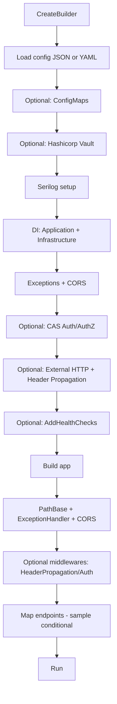

# DNET Framework Templates - Technical Reference

Fecha de análisis: 2026-09-30
Repositorio: dnet-framework-templates
Rama analizada: develop
Commit analizado: 179ab350ac87feae1dfc404e1e6a33b57a148f2b

## Alcance y reglas aplicadas
- Se analizó exclusivamente este repositorio.
- No se modificó ningún archivo fuente existente.
- No se realizaron commit/push/merge/reset/pull.
- Se ejecutaron comandos de inspección, restore, build y test.
- La instanciación de templates se hizo en entorno temporal aislado (`dotnet new --debug:custom-hive`) y luego se eliminó.
- Se evitó exponer datos sensibles. Donde aplica: [REDACTED].

## Leyenda de clasificación de evidencia
- HECHO VERIFICADO EN CÓDIGO
- DOCUMENTADO PERO NO VERIFICADO
- ALTERNATIVA COMENTADA / GUÍA
- INFERENCIA TÉCNICA
- NO DETERMINADO

---

## A. Baseline Git y versionado

### A.1 Estado Git de la rama analizada
- HECHO VERIFICADO EN CÓDIGO: `git fetch origin` ejecutado sin cambio de rama.
- HECHO VERIFICADO EN CÓDIGO: rama actual = `develop`.
- HECHO VERIFICADO EN CÓDIGO: `HEAD` = `179ab350ac87feae1dfc404e1e6a33b57a148f2b`.
- HECHO VERIFICADO EN CÓDIGO: `origin/develop` = `179ab350ac87feae1dfc404e1e6a33b57a148f2b`.
- HECHO VERIFICADO EN CÓDIGO: `HEAD` coincide con `origin/develop`.
- HECHO VERIFICADO EN CÓDIGO: fecha commit HEAD/origin-develop = `2026-07-19 20:16:44 -0500`.
- HECHO VERIFICADO EN CÓDIGO: estado local = `## develop...origin/develop` (sin cambios versionados).
- HECHO VERIFICADO EN CÓDIGO: branches remotas visibles relevantes:
  - `origin/develop`
  - `origin/master`
  - `origin/feature/automated-testing-bdd`
- HECHO VERIFICADO EN CÓDIGO: `develop` existe y está alineada con su upstream.

### A.2 Versionado técnico del repositorio/template
- HECHO VERIFICADO EN CÓDIGO: no existe `global.json` en el repositorio.
- HECHO VERIFICADO EN CÓDIGO: baseline TFM del repo y templates: `net10.0`.
  - `Directory.Build.props` (raíz): `TargetFramework=net10.0`.
  - `BCP.Template.Microservice/Directory.Build.props`: `TargetFramework=net10.0`.
  - `BCP.Template.Web/Directory.Build.props`: `TargetFramework=net10.0`.
- HECHO VERIFICADO EN CÓDIGO: SDK local detectado:
  - `dotnet --version`: `10.0.401`
  - instalados: `10.0.301`, `10.0.401`
- HECHO VERIFICADO EN CÓDIGO: template packaging:
  - `BCP.Templates.csproj`: `PackageType=Template`, `PackageId=BCP.Templates`.
  - Incluye `Microsoft.TemplateEngine.Tasks`.
  - Empaqueta contenido de `BCP.Template.Microservice/**` y `BCP.Template.Web/**`.
- HECHO VERIFICADO EN CÓDIGO: versionado detectado con potencial drift:
  - `Directory.Build.props` (raíz): `VersionPrefix=10.0.1`
  - `README.md` raíz: muestra `Version-10.0.0` y ejemplo de instalación `BCP.Templates::10.0.0`.
- HECHO VERIFICADO EN CÓDIGO: gestión de paquetes centralizada por template:
  - `BCP.Template.Microservice/Directory.Packages.props`
  - `BCP.Template.Web/Directory.Packages.props`
- HECHO VERIFICADO EN CÓDIGO: `nuget.config` en Web y Microservice mapea `BCP.*` a feed corporativo (`dnet-nuget`) y resto a `public-nuget`.

---

## B. Inventario real de templates

### B.1 Templates encontrados

| Template técnico | Nombre visible `dotnet new` | shortName | identity | type/tag | language | clasificaciones | source folder |
|---|---|---|---|---|---|---|---|
| BCP.Template.Microservice | Framework .NET - API Solution | webapibcp | BCP.Template.Microservice | solution | C# | API, Microservice, BCP | BCP.Template.Microservice |
| BCP.Template.Web | Framework .NET - Web Solution | blazorbcp | BCP.Template.Web | solution | C# | SPA, Blazor, WebAssembly, BCP | BCP.Template.Web |

Evidencia principal:
- `BCP.Template.Microservice/.template.config/template.json`
- `BCP.Template.Web/.template.config/template.json`
- `dotnet new list --debug:custom-hive [temporal]` (templates corporativos visibles: solo `webapibcp`, `blazorbcp`).

### B.2 Metadatos por template

#### Template: BCP.Template.Microservice
- HECHO VERIFICADO EN CÓDIGO:
  - `sourceName`: `BCP.Template.Microservice`
  - `defaultName`: `NewProject`
  - `symbols`:
    - `nameKebab` (derived)
    - `configformat` (`json|yml`, default `json`)
    - `includeSample` (bool, default `true`)
    - `includeCas` (bool, default `false`)
    - `includeConfigMaps` (bool, default `false`)
    - `includeSql` (bool, default `false`)
    - `includeExternalApis` (bool, default `false`)
    - `includeHealthCheck` (bool, default `false`)
    - `includeHashicorp` (bool, default `false`)
    - `UseJsonConfig` / `UseYmlConfig` (computed)
  - `modifiers` condicionales eliminan archivos según símbolos.
  - `postActions`: solo instrucciones manuales (no script ejecutado automáticamente).
  - `primaryOutputs`: `.slnx`, proyectos `Api/Application/Domain/Infrastructure` y tests.

#### Template: BCP.Template.Web
- HECHO VERIFICADO EN CÓDIGO:
  - `sourceName`: `BCP.Template.Web`
  - `defaultName`: `NewProject`
  - `symbols`:
    - `nameKebab` (derived, reemplaza `bcp-template-web`)
  - `modifiers`: reemplazo de `<NAME>` por `{{name}}`.
  - `postActions`: solo instrucciones manuales.
  - `primaryOutputs`: `.slnx`, proyecto Web, librería `BCP.Web.Commons`, tests.

### B.3 Búsqueda explícita de otros tipos de template

| Tipo buscado | Resultado en esta rama |
|---|---|
| API independiente | No encontrado |
| Web API independiente | No encontrado |
| Backend API independiente | No encontrado |
| SPA | Sí (`blazorbcp`) |
| BFF | No encontrado |
| Worker | No encontrado como template corporativo |
| Function | No encontrado |
| Library | No encontrado como template corporativo |
| Microservice | Sí (`webapibcp`) |

- HECHO VERIFICADO EN ESTA RAMA: solo existen dos templates corporativos reales (`webapibcp`, `blazorbcp`) en el paquete local instalado en hive temporal.

---

## C. Mecanismo de generación

### C.1 Tecnología de templates
- HECHO VERIFICADO EN CÓDIGO: se usa engine de `dotnet new` con esquema `template.json`.
- HECHO VERIFICADO EN CÓDIGO: `BCP.Templates.csproj` usa `Microsoft.TemplateEngine.Tasks` y `PackageType=Template`.
- HECHO VERIFICADO EN CÓDIGO: distribución esperada como paquete NuGet de templates (`BCP.Templates`).

### C.2 Operación conceptual por template

#### Microservice (`webapibcp`)
Template source
↓ (sourceName replacement + nameKebab transform)
↓ (evaluación symbols y modifiers: includeSample/includeSql/includeCas/etc.)
↓ (copiado/omisión de archivos condicionales)
↓ (postAction informativa)
↓ (solución generada con proyectos `Api/Application/Domain/Infrastructure` + tests)

#### Web (`blazorbcp`)
Template source
↓ (sourceName replacement + nameKebab transform)
↓ (copiado de estructura Web + Commons + tests)
↓ (postAction informativa)
↓ (solución generada Blazor WASM + librería compartida)

### C.3 ¿Scripts externos / post-actions ejecutables?
- HECHO VERIFICADO EN CÓDIGO: no hay `postActions` de script ejecutable; solo texto/manual instructions.
- HECHO VERIFICADO EN CÓDIGO: no hay scripts de scaffolding DevOps incluidos.

---

## D. Qué se copia vs qué se consume

### D.1 Matriz de composición

| Aspecto | Template Web | Template Microservice |
|---|---|---|
| Código fuente copiado | Sí. Todo `libs/`, `src/`, `tests/`, configs (según excludes) | Sí. Todo `src/`, `tests/`, configs (según excludes y modifiers) |
| PackageReference | Sí (`BCP.Extensions.Http.WebAssembly`, `BCP.Web.UiComponents`, `Microsoft.*`) | Sí (`BCP.Extensions.Web`, `BCP.Extensions.Logging.Serilog`, opcionales `BCP.Extensions.Auth`, `BCP.Extensions.Vault`, `Dapper`, `SqlClient`, `BCP.Extensions.Http*`) |
| ProjectReference | Sí (Web -> `libs/BCP.Web.Commons`) | Sí (API->Application/Infrastructure, Application->Domain, etc.) |
| NPM | Sí (`jest`, `babel-jest`, `jsdom`, etc.) | No |
| Condicional por symbols | Muy bajo (principalmente naming) | Alto (`configformat`, `includeSample`, `includeSql`, `includeCas`, etc.) |
| Dependencia de assets externos | NuGet feeds + paquetes UI estáticos | NuGet feeds + paquetes BCP opcionales por símbolo |

### D.2 Respuestas críticas
- HECHO VERIFICADO EN CÓDIGO: una aplicación generada queda desacoplada del repositorio de templates (no hay referencias al repo original).
- HECHO VERIFICADO EN CÓDIGO: sí puede actualizar capacidades DNET vía actualización de paquetes (`Directory.Packages.props`) cuando la capacidad se consume por `PackageReference`.
- HECHO VERIFICADO EN CÓDIGO: quedan congelados como código copiado:
  - Web: `BCP.Web.Commons` (ProjectReference local), páginas/layout/modelos/sample UI.
  - Microservice: estructura de capas, handlers/sample endpoints, pruebas y wiring base.

---

## E. Template Web

### E.1 Arquitectura generada real
- HECHO VERIFICADO EN CÓDIGO: solución generada contiene:
  - `src/<Nombre>.Web` (Blazor WebAssembly standalone)
  - `libs/BCP.Web.Commons` (librería reusable local)
  - `tests/<Nombre>.Web.Tests`
  - `tests/BCP.Web.Commons.Tests`
- HECHO VERIFICADO EN CÓDIGO: host WASM en `Program.cs` usa:
  - configuración por ambiente (`wwwroot/appsettings*.json`)
  - `AddWebDependencies`, `AddGraphHttpClientServices`, `AddBlazorServices`, `AddAuthentication`.
- HECHO VERIFICADO EN CÓDIGO: componentes UI y layout en:
  - `Layout/MainLayout.razor`, `Layout/NavMenu.razor`, `Layout/Welcome.razor`, `Layout/Unauthorized.razor`.
- HECHO VERIFICADO EN CÓDIGO: páginas incluidas por defecto:
  - `Home`
  - `Playground` (demo amplia de componentes, formularios, tabla, modales, etc.).
- HECHO VERIFICADO EN CÓDIGO: autenticación integrada con MSAL/Graph y componentes de login en `BCP.Web.Commons`.

### E.2 Configuración relevante
- HECHO VERIFICADO EN CÓDIGO: `launchSettings.json` incluye perfiles `http`, `https`, `IIS Express`.
- HECHO VERIFICADO EN CÓDIGO: `wwwroot/appsettings.Development.json` define `AzureAd`, `Graph`, `Http:Clients`.
- HECHO VERIFICADO EN CÓDIGO: `wwwroot/appsettings.Production.json` usa placeholders (`AD_CLIENT_ID`, `API_SCOPE`) como guía.

---

## F. Modularidad del template Web

### F.1 Evaluación pedida (feature assemblies / lazy loading)
- HECHO VERIFICADO EN CÓDIGO: no se encontró `BlazorWebAssemblyLazyLoad`.
- HECHO VERIFICADO EN CÓDIGO: no se encontró `LazyAssemblyLoader`.
- HECHO VERIFICADO EN CÓDIGO: no se encontró `AdditionalAssemblies` en Router.
- HECHO VERIFICADO EN CÓDIGO: `App.razor` define `OnNavigateAsync`, pero está vacío (`Task.CompletedTask`).

### F.2 Clasificación
- PROPORCIONADO POR EL TEMPLATE:
  - Router base con `AuthorizeRouteView`.
  - Estructura de páginas/layout/shared (`BCP.Web.Commons`).
- POSIBLE GRACIAS A BLAZOR/.NET PERO NO GENERADO POR EL TEMPLATE:
  - Feature assemblies separados.
  - Lazy loading por ensamblado.
  - Descubrimiento dinámico de módulos.

### F.3 Respuestas directas
- ¿Agregar un nuevo feature requiere nuevo proyecto/assembly + registro manual?
  - HECHO VERIFICADO EN CÓDIGO: sí, requiere wiring manual (solución, routing, menú, DI/config según necesidad).
- ¿Hay acoplamiento manual con shell?
  - HECHO VERIFICADO EN CÓDIGO: sí (`NavMenu` está hardcodeado con `Home`/`Playground`, Router usa `AppAssembly` único).
- ¿Existe discovery automático?
  - HECHO VERIFICADO EN CÓDIGO: no.
- ¿Plantilla ayuda a crear módulos nuevos o trae demo?
  - HECHO VERIFICADO EN CÓDIGO: trae estructura y demo (`Playground`), no scaffolding de módulos adicionales.

---

## G. Autenticación / autorización del template Web

### G.1 Qué genera realmente
- HECHO VERIFICADO EN CÓDIGO:
  - `AddMsalAuthentication<RemoteAuthenticationState, BcpUserAccount>`.
  - `GraphUserAccountFactory` para claims/foto/perfil Graph.
  - `CascadingAuthenticationState` y `AuthorizeRouteView` en `App.razor`.
  - Página protegida por atributo: `Playground` con `[Authorize]`.
  - Login/logout por `RemoteAuthenticatorView` (`Layout/Authentication.razor`).
- HECHO VERIFICADO EN CÓDIGO:
  - Scopes Graph por config; fallback `User.Read`.
  - `MenuItem.PolicyName` existe en modelo pero no se aplica en runtime del menú.

### G.2 Obligatorio vs ejemplo vs opcional
- GENERADO INCONDICIONALMENTE POR EL TEMPLATE:
  - Esqueleto MSAL/Graph está presente siempre en la plantilla Web.
- EJEMPLO:
  - Valores concretos de `AzureAd`/`Graph` en appsettings son de muestra ([REDACTED]).
- CONFIGURACIÓN OPCIONAL:
  - Ajuste de scopes/clientes en `appsettings.*`.

### G.3 Relación real con librerías
- HECHO VERIFICADO EN CÓDIGO:
  - `BCP.Web.Commons`: provee `AddGraphHttpClientServices`, `AddBlazorServices`, `GraphUserAccountFactory`, componentes login/UI.
  - `BCP.Extensions.Http.WebAssembly`: usado para builders HTTP externos.
- HECHO VERIFICADO EN CÓDIGO:
  - `BCP.Extensions.Auth` no es dependencia directa del template Web.

---

## H. HTTP del frontend

### H.1 Modelo de consumo esperado
- HECHO VERIFICADO EN CÓDIGO:
  - Registro automático por configuración `Http:Clients` (`AddExternalHttpClientBuilders`).
  - Clientes nombrados de ejemplo: `backend`, `apijson`.
  - `PlaygroundApiService` consume `apijson` (JSONPlaceholder) como sample.
  - `WebApiAuthorizationMessageHandler` está preparado para scopes del cliente `backend`.

### H.2 Multiplicidad de APIs
- HECHO VERIFICADO EN CÓDIGO: técnicamente permite SPA -> una API.
- HECHO VERIFICADO EN CÓDIGO: técnicamente permite SPA -> múltiples APIS (múltiples entradas en `Http:Clients`).
- INFERENCIA TÉCNICA: para APIs protegidas se debe configurar scopes por cliente y asociar handlers según estrategia de `BCP.Extensions.Http*`.

### H.3 CORS/topología
- HECHO VERIFICADO EN CÓDIGO: la plantilla frontend no configura CORS (propio de backend).
- ALTERNATIVA COMENTADA / GUÍA: URLs de ejemplo en appsettings (`localhost`, `azurewebsites`) no prueban topología productiva final.

---

## I. Template Microservice

### I.1 Árbol arquitectónico real generado
- HECHO VERIFICADO EN CÓDIGO
  - `src/<Nombre>.Api`
  - `src/<Nombre>.Application`
  - `src/<Nombre>.Domain`
  - `src/<Nombre>.Infrastructure`
  - `tests/*` por capa

### I.2 Patrones: verificación real

| Patrón/elemento | Verificación |
|---|---|
| Clean Architecture (capas separadas) | HECHO VERIFICADO EN CÓDIGO (estructura y referencias entre proyectos) |
| Vertical Slicing | HECHO VERIFICADO EN CÓDIGO (feature `Todos/ListTodos`) |
| DDD fuerte | INFERENCIA TÉCNICA: Parcial/mínimo (dominio reducido a records de ejemplo) |
| CQRS formal | HECHO VERIFICADO EN CÓDIGO: no hay MediatR ni separación Command/Query formal |
| Handlers | HECHO VERIFICADO EN CÓDIGO (`ListTodosHandler`) |
| Controllers MVC | HECHO VERIFICADO EN CÓDIGO: no, usa Minimal APIs |
| Domain events | HECHO VERIFICADO EN CÓDIGO: no encontrados |
| Validators dedicados (FluentValidation/etc.) | HECHO VERIFICADO EN CÓDIGO: no encontrados |
| Mapping | HECHO VERIFICADO EN CÓDIGO (`ListTodosMapping`) |
| Integraciones externas | HECHO VERIFICADO EN CÓDIGO: opcional (`includeExternalApis`) |

---

## J. Bootstrap del microservicio

### J.1 Flujo conceptual de Program.cs
- HECHO VERIFICADO EN CÓDIGO:
  - `WebApplication.CreateBuilder(args)` (no `CreateSlimBuilder`).
  - Configuración JSON o YAML según `configformat`.
  - Extensiones opcionales: ConfigMaps, Hashicorp Vault.
  - Serilog vía `UseSerilog` + `logger.*`.
  - DI de Application/Infrastructure.
  - Manejo de excepciones (`AddExceptionServices` + `UseExceptionHandler`).
  - CORS default policy con `WithOrigins("")` placeholder.
  - Auth/AuthZ opcional por `includeCas`.
  - External HTTP opcional por `includeExternalApis`.
  - Health checks opcional por `includeHealthCheck` (solo servicio registrado).
  - Endpoint sample `MapTodosEndpoint` condicionado por `includeSample` y `includeCas`.

### J.2 Hallazgo de implementación
- HECHO VERIFICADO EN CÓDIGO: si `includeHealthCheck=true`, no se encontró `MapHealthChecks(...)` en pipeline (solo `AddHealthChecks()`).

---

## K. Persistencia del microservicio

| Tema | Estado |
|---|---|
| EF Core / DbContext EF | HECHO VERIFICADO EN CÓDIGO: no generado |
| Dapper | HECHO VERIFICADO EN CÓDIGO: disponible solo con `includeSql=true` |
| ADO.NET SqlConnection | HECHO VERIFICADO EN CÓDIGO: sí (`DBContext` crea `SqlConnection`) |
| SQL Server | HECHO VERIFICADO EN CÓDIGO: sí, vía `Microsoft.Data.SqlClient` condicional |
| Stored Procedures | HECHO VERIFICADO EN CÓDIGO: no se encontraron ejemplos de SP |
| Repository | HECHO VERIFICADO EN CÓDIGO: sí, sample (`ITodosRepository`/`TodosRepository`) |
| UnitOfWork | HECHO VERIFICADO EN CÓDIGO: no |
| Manejo de transacciones | HECHO VERIFICADO EN CÓDIGO: no explícito |

Clasificación solicitada:
- DECISIÓN IMPUESTA POR TEMPLATE:
  - No se impone persistencia por defecto (`includeSql` default `false`).
- PATRÓN DE EJEMPLO:
  - Dapper + `DBContext` + `TodosRepository` (cuando `includeSql=true`).
- NO DEFINIDO:
  - EF Core, UnitOfWork, estrategia multi-DB/multi-connection-string avanzada.

Hallazgo adicional:
- HECHO VERIFICADO EN CÓDIGO: `ITodosRepository` no está integrado en el flujo principal del handler sample (usa `ITodosHttpService`).

---

## L. Seguridad del microservicio

| Tema | Evidencia |
|---|---|
| Autenticación backend (`includeCas`) | HECHO VERIFICADO EN CÓDIGO: el flag activa `AddBcpAuthenticationPlatform` y `AddBcpAuthorization`; la implementación utiliza JWT con emisores PublicKey/OIDC según configuración. |
| Scopes/permisos | HECHO VERIFICADO EN CÓDIGO: `AllowedScopes` en config (valores de ejemplo) |
| Entra ID | HECHO VERIFICADO EN CÓDIGO: aparecen issuers OIDC de ejemplo ([REDACTED]) |
| Secrets | HECHO VERIFICADO EN CÓDIGO: placeholders/env vars + `AddPlaceholderResolver` |
| Certificados | ALTERNATIVA COMENTADA / GUÍA: rutas de CA cert en `Http.Clients` de ejemplo |
| Vault | HECHO VERIFICADO EN CÓDIGO: opción `includeHashicorp` + `BCP.Extensions.Vault` + `AddBcpHashicorpVault` |

Nota de seguridad:
- HECHO VERIFICADO EN CÓDIGO: configuraciones incluyen datos de issuer/public key de ejemplo; en esta referencia se reportan como [REDACTED].

---

## M. IIS / App Service / AKS / Docker

| Aspecto | IIS | App Service | AKS |
|---|---|---|---|
| Perfil de ejecución local | HECHO VERIFICADO EN CÓDIGO: Web incluye `IIS Express` en `launchSettings` | NO DETERMINADO (no perfil específico local) | NO DETERMINADO |
| Configuración en código | HECHO VERIFICADO EN CÓDIGO: sin ramas específicas IIS en runtime | HECHO VERIFICADO EN CÓDIGO: URLs de ejemplo `azurewebsites` en configs/docs | DOCUMENTADO PERO NO VERIFICADO (mención en docs/historial) |
| Secrets/variables | HECHO VERIFICADO EN CÓDIGO: placeholders/env vars | HECHO VERIFICADO EN CÓDIGO: variables documentadas en README | DOCUMENTADO PERO NO VERIFICADO |
| Logging/telemetría | HECHO VERIFICADO EN CÓDIGO: Serilog base | HECHO VERIFICADO EN CÓDIGO: mismo código, sin branch específico | HECHO VERIFICADO EN CÓDIGO: mismo código, sin branch específico |
| Vault | HECHO VERIFICADO EN CÓDIGO: opcional `includeHashicorp` | Igual | Igual |
| Artefactos deployment en template | HECHO VERIFICADO EN CÓDIGO: no hay Dockerfile/Jenkins/manifests | HECHO VERIFICADO EN CÓDIGO: no incluidos | HECHO VERIFICADO EN CÓDIGO: no incluidos |
| Cambios de código por plataforma | INFERENCIA TÉCNICA: bajos, depende más de configuración externa | INFERENCIA TÉCNICA | INFERENCIA TÉCNICA |

Resumen:
- ACTIVO: perfiles locales (`IIS Express` solo en Web), runtime ASP.NET/Blazor base.
- ALTERNATIVA COMENTADA / GUÍA: múltiples referencias de despliegue en README y postActions.
- DOCUMENTADO: CI/CD, contenedorización, App Service.
- NO DETERMINADO: topología productiva final obligatoria por template.

---

## N. DevOps generado por templates

### N.1 Artefactos incluidos en el código generado
- HECHO VERIFICADO EN CÓDIGO: no se copian en esta rama:
  - `Jenkinsfile`
  - `Dockerfile`
  - manifests Kubernetes
  - Helm
  - Terraform
  - pipeline YAML CI/CD
  - Sonar/SAST/Xray config de pipeline

### N.2 Evidencia complementaria
- HECHO VERIFICADO EN CÓDIGO: `template.json` de Microservice excluye `devops/**/*`.
- ALTERNATIVA COMENTADA / GUÍA: postActions recomiendan `dotnet bcp devops` (descarga externa de deployment assets).

Conclusión de N:
- HECHO VERIFICADO EN CÓDIGO: la app recién generada no trae artefactos DevOps listos en esta rama.

---

## O. Diferencias Web vs Microservice

| Tema | Web | Microservice |
|---|---|---|
| Runtime | Blazor WebAssembly (cliente) | ASP.NET Core server (Minimal API) |
| Arquitectura | `src` + `libs` + tests | `Api/Application/Domain/Infrastructure` + tests |
| Proyectos base | Web + `BCP.Web.Commons` | 4 capas + test por capa |
| Auth | MSAL/Graph siempre scaffolded | CAS/Auth opcional por símbolo |
| Authorization | `AuthorizeRouteView` + `[Authorize]` sample | Opcional con `includeCas`; endpoint sample puede requerir auth |
| HTTP | `Http:Clients` + named clients frontend | `includeExternalApis` agrega rest clients/hdr propagation |
| Persistencia | No aplica backend en template | Opcional (`includeSql`) con Dapper/SqlClient |
| Logging | Logging client-side básico | Serilog + obfuscation rules config |
| Observabilidad | No OpenTelemetry scaffolded | No OpenTelemetry scaffolded |
| Vault | No integración directa en Web template | Opcional (`includeHashicorp`) |
| Modularidad | No lazy loading scaffolded; menú estático | Capas separadas; slices de ejemplo |
| Deployment artifacts | No incluidos | No incluidos |
| Testing | xUnit para Web y Commons, Jest configurado | xUnit por capa |
| Paquetes DNET | `BCP.Extensions.Http.WebAssembly`, `BCP.Web.UiComponents` | `BCP.Extensions.Web`, `BCP.Extensions.Logging.Serilog`, opcionales Auth/Http/Vault |

---

## P. Ausencia de template API independiente

### P.1 Hechos en esta rama
- HECHO VERIFICADO EN ESTA RAMA: solo hay 2 `template.json` actuales:
  - `BCP.Template.Microservice/.template.config/template.json`
  - `BCP.Template.Web/.template.config/template.json`
- HECHO VERIFICADO EN ESTA RAMA: `dotnet new list` (hive temporal) muestra únicamente templates corporativos:
  - `webapibcp`
  - `blazorbcp`
- HECHO VERIFICADO EN ESTA RAMA: `BCP.Templates.csproj` empaqueta contenido solo de `BCP.Template.Microservice/**` y `BCP.Template.Web/**`.

### P.2 Evidencia histórica local (sin checkout)
- HECHO VERIFICADO EN CÓDIGO: `git log -- **/.template.config/template.json` muestra que existieron rutas históricas:
  - `Template_Api/.template.config/template.json`
  - `Template_Api_Lite/.template.config/template.json`
  - `Template_Blazor/.template.config/template.json`
- HECHO VERIFICADO EN CÓDIGO: commits de reestructuración/refactor de templates (`#124`, renombres de carpetas, consolidación de estructura).

### P.3 ¿Por qué no existe hoy un template API independiente?
- NO DETERMINADO: la razón oficial exacta no está explícita en código/documentación de esta rama.
- INFERENCIA TÉCNICA: hubo consolidación/reorganización hacia `BCP.Template.Microservice` como oferta API actual.

### P.4 Fuente recomendada para responder la causa oficial
- Confluence / ADR internos del equipo DNET.
- Historial Git con PR description completa (no solo mensaje de commit).
- Equipo DNET (maintainers).
- Validación complementaria en `dnet-sample-reference-applications` (alineación práctica).

---

## Q. Capacidades para futura aplicación modular (evaluación solo de lo generado)

| Capacidad | Clasificación | Evidencia resumida |
|---|---|---|
| SPA con múltiples módulos | SOPORTADO PERO NO GENERADO | Router/menú actuales son simples; requiere expansión manual |
| Nuevos feature assemblies | SOPORTADO PERO NO GENERADO | No hay scaffolding ni discovery automático |
| Lazy loading | SOPORTADO PERO NO GENERADO | Sin `LazyAssemblyLoader`/`AdditionalAssemblies` |
| Navegación por módulo | SOPORTADO PERO NO GENERADO | `NavMenu` hardcoded |
| Autorización por módulo | SOPORTADO PERO NO GENERADO | Claims de roles existen; no policies de módulo pre-wired |
| Menú por permisos | NO SOPORTADO / REQUIERE ADAPTACIÓN | `PolicyName` existe en modelo pero no se aplica |
| Shared UI | GENERADO POR TEMPLATE | `libs/BCP.Web.Commons` |
| Múltiples APIs desde SPA | GENERADO/SOPORTADO | `Http:Clients` admite varios clientes |
| Backend modular (capas) | GENERADO POR TEMPLATE | Api/Application/Domain/Infrastructure |
| Módulos App/Domain/Infra separados | GENERADO POR TEMPLATE | Estructura y referencias de proyecto |
| Múltiples bases / connection strings | SOPORTADO PERO NO GENERADO | Solo `DefaultConnection` scaffolded |
| Stored Procedures | SOPORTADO PERO NO GENERADO | No hay SP sample; requeriría adaptación |
| Extraer módulo a microservicio futuro | SOPORTADO PERO NO GENERADO | Separación por capas/slices ayuda, no automatizado |
| IIS Express (desarrollo local Web) | GENERADO POR TEMPLATE | `launchSettings.json` del template Web incluye perfil `IIS Express`; esto solo evidencia ejecución local de desarrollo. |
| IIS productivo / on-premise | NO DETERMINADO EN ESTE REPOSITORIO | El template no genera configuración ni artefactos específicos de despliegue productivo en IIS; su soporte/receta oficial debe validarse en Confluence, DevOps o aplicaciones de referencia. |
| Migración posterior App Service | SOPORTADO PERO NO GENERADO | Docs/config placeholders |
| Migración posterior AKS | DOCUMENTADO PERO NO VERIFICADO | No manifests/scripts en esta rama |

---

## R. Qué impone el template (sin inferir obligatoriedad corporativa)

| Tema | Template lo genera | Removible / opcional | Dependencia DNET | Evidencia |
|---|---|---|---|---|
| Frontend base Blazor | Sí (Web) | Removible con refactor | Sí (`Microsoft.*`, `BCP.Web.UiComponents`) | `BCP.Template.Web/src/*` |
| Backend base API | Sí (Microservice) | Removible con refactor | Sí (`BCP.Extensions.Web`) | `BCP.Template.Microservice/src/*` |
| Arquitectura en capas backend | Sí | Ajustable | Parcial | `.slnx` + project refs |
| Auth frontend (MSAL/Graph) | Sí en Web | Reconfigurable | Sí (`Microsoft.Authentication.WebAssembly.Msal`) | `Program.cs`, `DependencyInjection.cs` Web |
| Auth backend CAS | Opcional por símbolo | Sí | Sí (`BCP.Extensions.Auth`) | `includeCas` |
| HTTP frontend multi-client | Sí | Configurable | Sí (`BCP.Extensions.Http.WebAssembly`) | `AddExternalHttpClientBuilders` |
| HTTP backend externo | Opcional por símbolo | Sí | Sí (`BCP.Extensions.Http*`) | `includeExternalApis` |
| Persistencia | No por defecto | Opcional (`includeSql`) | Sí (Dapper/SqlClient opcional) | `template.json` modifiers |
| Errores backend | Sí | Configurable | Sí (`AddExceptionsServices`) | `Program.cs` Microservice |
| Logging backend | Sí | Configurable | Sí (`BCP.Extensions.Logging.Serilog`) | `Program.cs` + `logger.*` |
| Observabilidad (OpenTelemetry) | No | N/A | No en template | Sin `BCP.Extensions.OpenTelemetry` |
| Vault | Opcional por símbolo | Sí | Sí (`BCP.Extensions.Vault`) | `includeHashicorp` |
| Modularidad | No lazy loading scaffolded; no | Requiere implementación manual | No scaffold | Sin `LazyAssemblyLoader` |
| DevOps artifacts | No | N/A | Externo | Sin Dockerfile/Jenkins/manifests |
| Deployment topology fija | No | N/A | Externo | Solo docs/guía |

Conclusión de R:
- HECHO VERIFICADO EN CÓDIGO: el template materializa una base técnica concreta, pero no demuestra obligatoriedad corporativa de todas las capacidades DNET solo por presencia en código.

---

## S. Validación por ejecución

### S.1 Build/test sobre templates fuente (repositorio)
- HECHO VERIFICADO EN CÓDIGO: Microservice restore/build/test ejecutados.
  - Build: OK.
  - Warnings: `NU1504` por `PackageReference` duplicado (`Microsoft.Extensions.Configuration.Abstractions`) en Infrastructure.
  - Tests: OK (10 passing), con warning de proyecto de tests API sin tests ejecutables en esa compilación.
- HECHO VERIFICADO EN CÓDIGO: Web restore/build/test ejecutados.
  - Build: OK.
  - Warnings: `BL0007` en varios componentes de `BCP.Web.Commons`.
  - Tests: OK (249 passing).

### S.2 Instanciación en entorno temporal aislado
- HECHO VERIFICADO EN CÓDIGO:
  - Instalación template local con `dotnet new install . --debug:custom-hive [temp]`.
  - Templates instalados en hive temporal: `webapibcp`, `blazorbcp`.
  - Instancias creadas:
    - `GeneratedWeb` (default)
    - `GeneratedMicroDefault` (default)
    - `GeneratedMicroAll` (all options enabled)
    - `GeneratedMicroNoSample` (`--includesample false`)
  - Entorno temporal eliminado al finalizar.

### S.3 Resultados sobre instancias generadas
- HECHO VERIFICADO EN CÓDIGO: `GeneratedWeb` restore/build/test OK (249 tests OK, warnings BL0007).
- HECHO VERIFICADO EN CÓDIGO: `GeneratedMicroDefault` restore/build/test OK.
- HECHO VERIFICADO EN CÓDIGO: `GeneratedMicroAll` con fallas:
  - Build error en tests de Infrastructure por namespace inválido:
    - `...Application.HttpServices.Dto` no existe.
  - Test API falla por `Unauthorized` cuando `includeCas=true` (test esperaba `200 OK`).
- HECHO VERIFICADO EN CÓDIGO: `GeneratedMicroNoSample` con falla de compilación:
  - `Infrastructure/GlobalUsings.cs` referencia `Application.HttpServices` aunque `includeSample=false` elimina ese folder.

### S.4 Incompatibilidades detectadas
1. HECHO VERIFICADO EN CÓDIGO: combinación `includeSample=false` rompe compilación por global usings no condicionales.
2. HECHO VERIFICADO EN CÓDIGO: combinación `includeExternalApis=true` expone namespace incorrecto en test (`HttpServices.Dto`).
3. HECHO VERIFICADO EN CÓDIGO: combinación `includeCas=true` hace que test de endpoint sample requiera token/autorización; test no está adaptado.
4. HECHO VERIFICADO EN CÓDIGO: `includeHealthCheck=true` registra health checks pero no mapea endpoint.

---

## T. Drift y contradicciones

| Tema | Documentación | Implementación | Estado | Impacto |
|---|---|---|---|---|
| Versión template package | README muestra `10.0.0` | `Directory.Build.props` raíz usa `VersionPrefix=10.0.1` | Contradicción leve | Confusión de versión publicada |
| Web README y Jest config | README menciona `jest.config.js` | Archivo real: `jest.config.mjs` | Contradicción | Fricción en onboarding/comandos |
| CI/CD/Docker incluidos | README describe pipeline y contenerización | No hay Dockerfile/Jenkins/manifests/scripts en template | Documentado pero no materializado | Equipos esperan artefactos que no se generan |
| API/Microservice "completo" | README sugiere base completa | `includeSample=false` genera skeleton sin endpoints y con error de build | Contradicción técnica | Riesgo al usar modo minimal |
| Opción `includeHealthCheck` | "Incluye integración de Health Check" | Solo `AddHealthChecks()`, no `MapHealthChecks()` | Implementación parcial | Salud no expuesta por endpoint |
| Validación de opciones | Repositorio build/test en rama pasa | Variantes generadas (`all-options`, `no-sample`) fallan | Contradicción de cobertura | Defectos de template condicional ocultos |
| Lazy loading web modular | Baseline de `dnet-framework` mostró lazy-loading en sample web | Este template no lo scaffolded | Precisión/alcance | No confundir capacidad framework con código generado |

---

## U. Preguntas para `dnet-sample-reference-applications`

Prioridad alta (pendientes que este repo no cierra):
1. ¿Cómo luce un frontend real (no playground) con módulos de negocio y navegación por permisos?
2. ¿Hay implementación real de feature assemblies + lazy loading en aplicaciones de referencia?
3. ¿Cómo se consume `BCP.Extensions.Http*` en escenarios multi-API productivos (tokens/scopes/handlers)?
4. ¿Qué patrón real de auth end-to-end usan (MSAL + backend CAS/OIDC) y cómo se validan roles/permisos?
5. ¿Se usa `BCP.Extensions.Auth` como obligatorio o como opción según contexto?
6. ¿Cómo se resuelve autorización por módulo/menú dinámico en práctica?
7. ¿Cuál es la estrategia real de persistencia (Dapper/SP/EF/híbrido) en referencias?
8. ¿Se usa multi-base/multi-connection-string de forma real y cómo se estructura?
9. ¿Cómo modelan modularidad backend más allá de `Todos` sample?
10. ¿Qué artefactos de deployment reales acompañan las referencias (Docker/K8s/App Service pipelines)?
11. ¿Qué diferencias concretas existen entre template base y referencia productiva?
12. ¿Cómo se gobierna upgrade de paquetes DNET en consumidores (cadencia, compatibilidad, breaking changes)?
13. ¿Se usa OpenTelemetry en referencias aunque no aparezca en templates?
14. ¿Qué subset de capacidades DNET es realmente "mínimo corporativo" en práctica?
15. ¿Existe guideline oficial para pasar de monolito modular (web) a microservicios extraídos?

---

## V. Conclusión

1. Qué es un template DNET en este repo
   - HECHO VERIFICADO EN CÓDIGO: un paquete NuGet de templates (`BCP.Templates`) para `dotnet new`, con dos plantillas oficiales actuales (`webapibcp`, `blazorbcp`).

2. Qué código genera
   - HECHO VERIFICADO EN CÓDIGO: genera soluciones completas copiando código fuente base (no solo wrappers): proyectos, pruebas, config y documentación interna.

3. Qué decisiones arquitectónicas materializa
   - Web: Blazor WASM + librería local compartida (`BCP.Web.Commons`) + auth MSAL/Graph scaffolded.
   - Microservice: 4 capas (Api/Application/Domain/Infrastructure), Minimal APIs, wiring base de logging/excepciones/CORS y opciones condicionales.

4. Qué capacidades DNET utiliza
   - Web: `BCP.Extensions.Http.WebAssembly`, `BCP.Web.UiComponents`, MSAL/Graph.
   - Microservice: `BCP.Extensions.Web`, `BCP.Extensions.Logging.Serilog`, y opcionales `BCP.Extensions.Auth`, `BCP.Extensions.Http*`, `BCP.Extensions.Vault`, `Dapper`.

5. Qué deja abierto al equipo consumidor
   - Topología final de despliegue, artefactos DevOps, estrategia de persistencia real, modularidad avanzada (lazy loading/discovery), políticas de autorización por módulo, multi-DB real.

6. Diferencias fundamentales Web vs Microservice
   - Web prioriza shell SPA y UX/componentes; Microservice prioriza separación backend por capas y opciones de infraestructura.

7. Qué no sabemos todavía
   - NO DETERMINADO: razón oficial de desaparición de template API independiente; obligatoriedad corporativa real de cada capability; blueprint productivo final de deployment.

8. Qué validar en reference applications
   - Implementación real de modularidad, auth end-to-end, multi-API, persistencia productiva, y despliegue CI/CD/K8s/App Service con prácticas efectivas (no solo demos).

---

## Validación final obligatoria (checklist ejecutado)
- Re-enumeración de templates: completada (2 templates reales).
- Revisión de todos los `template.json`: completada.
- Revisión de `csproj`: completada.
- Revisión de `Program.cs`: completada.
- Revisión de código comentado relevante (`#if`, `//#if`, YAML/JSON condicional): completada.
- Búsqueda IIS/App Service/AKS/Kubernetes/Docker/Vault/MSAL/Graph/CAS/Entra/Dapper/EF/SqlConnection/StoredProcedure/Feature/LazyLoad/TODO/FIXME: completada.
- Comparación README vs implementación: completada.
- Verificación de no confundir sample con template: completada (separado en hallazgos).
- Verificación de no inferir obligatoriedad corporativa por mera presencia de código: completada.