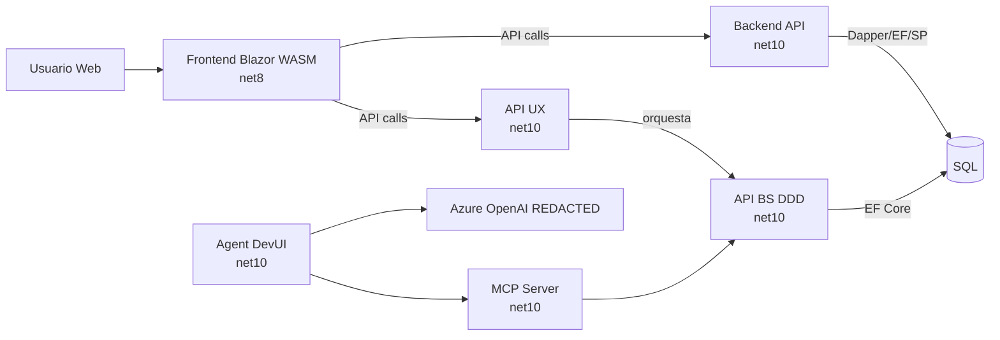
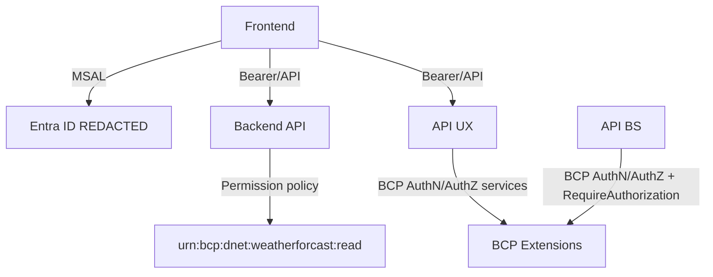
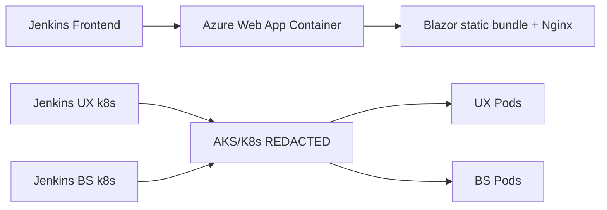

# DNET Reference Applications - Technical Reference

## 1. Executive Summary
Este documento consolida el reverse engineering tecnico exhaustivo del superrepositorio `dnet-sample-reference-applications`, tomando como fuente el codigo efectivamente versionado en el commit analizado, los submodulos fijados por SHA y la ejecucion real de `restore/build/test`.

Hallazgos centrales:
- El superrepo esta en `develop`, limpio y sincronizado con `origin/develop`.
- La suite mezcla workloads `net10.0` (backend/ux/bs/mcp/agent) con `net8.0` (frontend).
- Hay divergencia entre lo declarado en `.gitmodules` (branch `develop`) y los SHAs fijados en submodulos (provenientes de ramas feature/develop segun repo).
- El frontend implementa MSAL + Graph, pero no implementa modularidad por lazy loading ni filtrado de menu por policy.
- Backend usa persistencia hibrida (Dapper + EF Core + SP) y solo protege con permiso explicito un endpoint (`/weatherforecast`), dejando el resto en `AllowAnonymous`.
- UX contiene un endpoint extenso (`AccountRecoveryEndpoint`) no registrado en `Program.cs` (codigo existente, superficie no expuesta).
- BS/DDD muestra modelado de dominio real, pero con señales de codigo generado para pruebas y una posible operacion de reemplazo sin persistencia explicita.
- MCP y Agent estan funcionalmente orientados a demo/PoC; ambos registran servicios de auth/authz, pero no llaman explicitamente `UseAuthentication()/UseAuthorization()`. La ausencia de esas llamadas explicitas, por si sola, no permite concluir que el middleware de autenticacion/autorizacion este ausente en runtime.
- En ejecucion tecnica, frontend compila con advertencias; los demas repos fallan restore/build por `NU1605` (downgrade de `Microsoft.Extensions.*`), y frontend tests abortan por runtime `net8` no instalado localmente.

## 2. Scope, Constraints and Non-Goals
### Scope
- Repositorio raiz y submodulos:
  - `dnet-sample-frontend-web`
  - `dnet-sample-backend-api`
  - `dnet-sample-api-ux`
  - `dnet-sample-api-bs-ddd`
  - `dnet-sample-mcp`
  - `dnet-sample-agent`

### Constraints Aplicadas
- Sin cambios de codigo fuente de aplicaciones.
- Sin upgrades de paquetes/versiones.
- Sin correccion de defectos.
- Sin operaciones Git destructivas.
- Redaccion de datos sensibles como `[REDACTED]`.

### Non-Goals
- No se propone arquitectura objetivo.
- No se ejecuta migracion de legacy.
- No se realizan recomendaciones de refactor implementables en esta iteracion.

## 3. Metodologia y Criterio de Evidencia
### Metodologia
1. Baseline Git (rama, commit, estado, submodulos).
2. Inventario estructural (soluciones, proyectos, entrypoints, config, devops).
3. Analisis estatico de codigo en entrypoints, endpoints, DI, persistencia, auth, UI.
4. Validacion ejecutable por solucion: `dotnet restore`, `dotnet build --no-restore`, `dotnet test --no-build`.
5. Consolidacion en matrices y clasificaciones.

### Criterio de evidencia
- **Demostrado**: visible y activo en runtime (`Program.cs`, endpoints mapeados, pipeline ejecutable).
- **Soportado**: el codigo/base lo permite, pero depende de config o wiring adicional.
- **Adaptacion requerida**: existe parcial o inconsistente, requiere ajuste para operar como capacidad completa.
- **No determinado**: no hay evidencia suficiente en codigo/artefactos analizados.

## 4. Baseline Git del Superrepositorio
- Branch raiz: `develop`
- HEAD raiz: `44ea7b7b8acd4b75a80a936abf2b57df1ed0c7a0`
- Estado: limpio (`## develop...origin/develop`)

Archivo de evidencia:
- `README.md`
- `.gitmodules`

## 5. Estado de Submodulos y Proveniencia
| Submodulo | SHA fijado | Estado local | Ramas que contienen el SHA (evidencia local) |
|---|---|---|---|
| `dnet-sample-agent` | `306fd2c7991e253aaa1236d60e63634f2da7c504` | detached HEAD | `origin/feature/10.0.0` |
| `dnet-sample-api-bs-ddd` | `a807b7087744fbb20df8a1bbd29ebb3ff1d8924a` | detached HEAD | `origin/feature/10.0.0`, `origin/feature/10.0.0-aca` |
| `dnet-sample-api-ux` | `35dad9edc42d0135c3b0d25ee6a166991260b9af` | detached HEAD | `origin/feature/10.0.0` |
| `dnet-sample-backend-api` | `3edced1098f4ae2c66205d410198e098df6065d7` | detached HEAD | `origin/develop`, `origin/feature/10.0.0` |
| `dnet-sample-frontend-web` | `f5cea6ae0e19c1214debd9b8853bad4c1bb89186` | detached HEAD | `origin/develop`, `origin/feature/10.0.0-clean`, `origin/feature/8.0.0` |
| `dnet-sample-mcp` | `e300fe3a2ebdd7c9e64117b935ef7d103c77b358` | detached HEAD | `origin/feature/10.0.0` |

Observacion:
- `.gitmodules` declara branch `develop` para casi todos, pero la fotografia real fijada en SHAs incluye ramas feature.

## 6. Mapa Estructural Consolidado
- Frontend monolitico web: `dnet-sample-frontend-web`
- Backend API de referencia: `dnet-sample-backend-api`
- API UX (experience layer): `dnet-sample-api-ux`
- API BS con DDD: `dnet-sample-api-bs-ddd`
- MCP server PoC: `dnet-sample-mcp`
- Agent/DevUI PoC: `dnet-sample-agent`

Patron transversal:
- Estructura por capas `Api/Application/Domain/Infrastructure` (salvo frontend, orientado a UI + libs).
- Soluciones separadas por producto, no monorepo con single solution global.

## 7. Matriz de Soluciones y Target Frameworks
| Repositorio | Solucion | TargetFramework predominante |
|---|---|---|
| `dnet-sample-frontend-web` | `BCP.Backoffice.Web.sln` | `net8.0` |
| `dnet-sample-backend-api` | `BCP.AccountRecovery.sln` | `net10.0` |
| `dnet-sample-api-ux` | `BCP.Channel.AccountRecovery.sln` | `net10.0` |
| `dnet-sample-api-bs-ddd` | `BCP.Business.AccountRecovery.sln` | `net10.0` |
| `dnet-sample-mcp` | `BCP.Tool.Sample.sln` | `net10.0` |
| `dnet-sample-agent` | `BCP.Agent.Sample.sln` | `net10.0` |

Evidencia principal:
- `*/Directory.Build.props`

## 8. Gestion de Dependencias y Paquetes
Patrones observados:
- `ManagePackageVersionsCentrally=true` en todos los subrepos.
- Uso intensivo de paquetes `BCP.*` + `Microsoft.Extensions.*` + stack especifico por tipo de app.
- En `backend/ux/bs/mcp/agent`, versiones centrales `10.0.3` para varios `Microsoft.Extensions.*` conviven con transitivas `10.0.4/10.0.5`, gatillando `NU1605` en restore/build.

Evidencia:
- `dnet-sample-backend-api/Directory.Packages.props`
- `dnet-sample-api-ux/Directory.Packages.props`
- `dnet-sample-api-bs-ddd/Directory.Packages.props`
- `dnet-sample-mcp/Directory.Packages.props`
- `dnet-sample-agent/Directory.Packages.props`

## 9. Capacidades Transversales del Framework DNET (Evidencia Real)
Capacidades identificadas en runtime/config:
- Configuracion avanzada por YAML + placeholders.
- Logging con Serilog.
- Header propagation + validation.
- Auth/AuthZ corporativa (`AddBcpAuthenticationPlatform`, `AddBcpAuthorization`) en UX/BS/MCP/Agent.
- Integracion Entra ID (`AddMicrosoftIdentityWebApi`) en backend.
- Health checks estandarizados.
- Registro de Http clients externos con resiliencia/config.

Evidencia principal:
- `dnet-sample-backend-api/src/BCP.AccountRecovery.Api/Program.cs`
- `dnet-sample-api-ux/src/BCP.Channel.AccountRecovery.Api/Program.cs`
- `dnet-sample-api-bs-ddd/src/BCP.Business.AccountRecovery.Api/Program.cs`
- `dnet-sample-mcp/src/BCP.Tool.Sample.McpServer/Program.cs`
- `dnet-sample-agent/src/BCP.Agent.Sample.DevUi/Program.cs`

## 10. Frontend (`dnet-sample-frontend-web`) - Arquitectura Tecnica
Stack principal:
- Blazor WebAssembly (`net8.0`)
- MSAL para autenticacion
- Microsoft Graph para claims/profile enrichment
- HttpClientFactory para consumo API interno y servicios externos de ejemplo

Composicion:
- Bootstrap en `Program.cs`.
- Router y autorizacion de rutas en `App.razor`.
- Shell/layout con sidebar en `Layout/MainLayout.razor` y `Layout/NavMenu.razor`.
- Libreria comun en `libs/BCP.Web.Commons` (componentes, auth helpers, modelos).

## 11. Modularidad Frontend y Enrutamiento
Evidencia de modularidad:
- Router unico en `App.razor` (`Router AppAssembly=`typeof(App).Assembly`).
- `OnNavigateAsync` vacio.
- No se hallo uso en codigo fuente de:
  - `LazyAssemblyLoader`
  - `BlazorWebAssemblyLazyLoad`
  - `AdditionalAssemblies`

Clasificacion:
- Modularidad por ensamblados lazy: **No demostrada**.
- Modularidad por componentes/paginas internas: **Demostrada** (nivel UI, no por carga diferida).

## 12. Frontend Auth/AuthZ
Evidencia:
- `AddMsalAuthentication` + scopes Graph (`Program.cs`).
- `AuthorizeRouteView` en `App.razor`.
- `GraphUserAccountFactory` agrega claims/roles/foto desde Graph.

Hallazgo puntual:
- En `libs/BCP.Web.Commons/Components/Login/LoginDisplay.razor`, `BeginLogin` invoca `NavigateToLogout("authentication/login")` en lugar de flujo de login explicito.

Observacion de menu y permisos:
- `MenuItem` incluye `PolicyName` (`libs/BCP.Web.Commons/Models/MenuModel.cs`).
- `NavMenu.razor` usa menu estatico codificado y no filtra por policy/claim.

## 13. Backend (`dnet-sample-backend-api`) - Arquitectura Tecnica
Patron:
- Minimal APIs + capas Application/Domain/Infrastructure.
- OpenAPI + Scalar en desarrollo.
- Excepciones globales y health checks.

Auth/AuthZ:
- `AddMicrosoftIdentityWebApi` activo.
- `AddPermissionAuthorization` activo.
- Endpoints mayoritariamente registrados con `AllowAnonymous`, salvo `weatherforecast` con permiso `urn:bcp:dnet:weatherforcast:read`.

## 14. Backend Persistencia (Hibrida)
Evidencia de coexistencia:
- Dapper context (`DapperDbContext`) para SQL directo.
- EF Core context (`NegotiationContext`) con entidades agregadas.
- Stored Procedure en `PeriodoRepository` (`MDC_LISTAR_PERIODOS_PARA_PRODUCTO`).

Riesgo tecnico observado:
- `PersonRepository.GetAllPagedAsync` concatena `FirstName` en SQL interpolado dentro de `LIKE`, con potencial de inyeccion o comportamiento no esperado si no hay saneamiento adicional upstream.

## 15. UX API (`dnet-sample-api-ux`) - Arquitectura y Runtime
Patron:
- API de experiencia, fan-out a servicios BS/APIM.
- BCP auth/authz, header propagation/validation, excepciones globales.

Hallazgo clave:
- Existe `AccountRecoveryEndpoint.cs` (superficie extensa CRUD/relations/comments), pero `Program.cs` no ejecuta `MapAccountRecoveryEndpoint()`.
- Resultado: capacidad presente en codigo, no expuesta por routing runtime actual.

## 16. BS DDD API (`dnet-sample-api-bs-ddd`) - Arquitectura y Dominio
Patron:
- DDD explicito (aggregate `AccountRecovery`, estados, historial, comentarios, relacionados).
- Endpoints de procedimiento/comentario/relacion protegidos con `RequireAuthorization`.

Hallazgos relevantes:
- En dominio hay comentarios de "solo para pruebas unitarias" en constructores/fabricas del agregado.
- En infraestructura, `ReplaceAccountRecovery` del repositorio ejecuta `FirstOrDefault` sin update/persistencia explicita en el metodo.

## 17. MCP (`dnet-sample-mcp`) - Arquitectura
Capacidades observadas:
- Server MCP con transporte HTTP stateless (`MapMcp("/mcp")`).
- OpenAPI transformado (`McpDocumentTransformer`).
- Carga de prompts/resources/tools por reflection del assembly.

Observacion:
- Se registran servicios de auth/authz, pero no se observan llamadas explicitas a `UseAuthentication()` / `UseAuthorization()` en el pipeline. El estado efectivo del middleware en runtime queda NO DETERMINADO solo con esta evidencia.

## 18. Agent (`dnet-sample-agent`) - Arquitectura
Capacidades observadas:
- DevUI de agentes con Azure OpenAI client.
- Registro de `ChatClient`, responses y conversations.
- Integracion de herramientas MCP via `McpClient.CreateAsync(...)`.
- Dos agentes demo: "Weather Guy" y "To-do Assistant".

Observacion:
- Igual que MCP, registra servicios de auth/authz, pero no muestra llamadas explicitas a `UseAuthentication()` / `UseAuthorization()` en el pipeline visible. El estado efectivo del middleware en runtime queda NO DETERMINADO solo con esta evidencia.

## 19. Inventario de Endpoints - Backend
PathBase observado en desarrollo: `/api/v1`

| Grupo | Metodo | Ruta relativa |
|---|---|---|
| configuration | GET | `/configuration/all` |
| employee | GET | `/employee/` |
| employee | GET | `/employee/ex` |
| files | GET | `/files/download/{fileName}` |
| files | POST | `/files/upload` |
| files | POST | `/files/upload2` |
| logging | GET | `/logging/persons/45656652` |
| negotiations | POST | `/negotiations/initiate` |
| orders | POST | `/orders/initiate` |
| person | GET | `/person/{personId:int}` |
| person | GET | `/person/` |
| person | POST | `/person/` |
| person | PUT | `/person/` |
| person | DELETE | `/person/{personId:int}` |
| reports | GET | `/reports/download/xlsx` |
| reports | GET | `/reports/download/pdf` |
| todos | GET | `/todos/` |
| root | GET | `/weatherforecast` (requiere permiso) |

Estado auth runtime en `Program.cs`:
- 17 endpoints con `AllowAnonymous`.
- 1 endpoint con `RequireAuthorization` (`weatherforecast`).

## 20. Inventario de Endpoints - UX
PathBase observado en desarrollo: `/channel/dnet/v1/account-recovery`

### Endpoints mapeados en runtime (Program.cs)
| Grupo | Metodo | Ruta relativa |
|---|---|---|
| todos | GET | `/todos/` |
| employee | GET | `/employee/` |
| employee | GET | `/employee/ex` |
| person | GET | `/person/` |
| product | GET | `/product/` |
| negotiations | POST | `/negotiations/initiate` |

Todos los anteriores quedan en `AllowAnonymous` por mapping actual.

### Endpoints declarados en codigo pero NO mapeados
Archivo `Endpoints/AccountRecoveryEndpoint.cs` declara 11 rutas (list/initiate/replace/update/relations/comments), pero `Program.cs` no llama `MapAccountRecoveryEndpoint()`.

## 21. Inventario de Endpoints - BS/DDD
PathBase observado en desarrollo: `/business-sd-account-recovery/v1`

| Grupo | Metodo | Ruta relativa |
|---|---|---|
| account-recoveries (procedure) | GET | `/account-recoveries/retrieve` |
| account-recoveries (procedure) | GET | `/account-recoveries/{AccountRecoveryId}/retrieve` |
| account-recoveries (procedure) | PUT | `/account-recoveries/{AccountRecoveryId}/update` |
| account-recoveries (comment) | GET | `/account-recoveries/{AccountRecoveryId}/comments/retrieve` |
| account-recoveries (comment) | GET | `/account-recoveries/{AccountRecoveryId}/comments/{CommentId}/retrieve` |
| account-recoveries (relationship) | GET | `/account-recoveries/{AccountRecoveryId}/relationships/{RelationshipId}/retrieve` |
| account-recoveries (relationship) | GET | `/account-recoveries/{AccountRecoveryId}/relationships/retrieve` |
| logging | GET | `/logging/persons/45656652` |

Auth runtime:
- Procedure/Comment/Relationship: `RequireAuthorization`.
- Logging: `AllowAnonymous`.

## 22. Patrones de Autenticacion y Autorizacion (Comparativo)
| App | AuthN principal | AuthZ principal | Estado |
|---|---|---|---|
| Frontend | MSAL (Entra) | `AuthorizeRouteView` + claims | Demostrado |
| Backend | `AddMicrosoftIdentityWebApi` (Entra JWT) | `AddPermissionAuthorization` + policy por permiso | Demostrado (parcial en endpoints) |
| UX | `AddBcpAuthenticationPlatform` | `AddBcpAuthorization` | Demostrado en infraestructura, pero rutas mapeadas quedan anonimas |
| BS | `AddBcpAuthenticationPlatform` | `AddBcpAuthorization` | Demostrado y aplicado en endpoints de dominio |
| MCP | `AddBcpAuthenticationPlatform` registrado | `AddBcpAuthorization` registrado | NO DETERMINADO: no hay llamadas explicitas `UseAuthentication`/`UseAuthorization`; se requiere validar comportamiento runtime y metadata de endpoints |
| Agent | `AddBcpAuthenticationPlatform` registrado | `AddBcpAuthorization` registrado | NO DETERMINADO: no hay llamadas explicitas `UseAuthentication`/`UseAuthorization`; se requiere validar comportamiento runtime y metadata de endpoints |

## 23. Artefactos de Deployment y Operacion
### Matriz
| App | Artefactos locales | Destino inferido | Evidencia |
|---|---|---|---|
| Frontend | `Dockerfile`, `entrypoint.sh`, `nginx.conf`, Jenkins delivery dev | Azure Web App for Containers | `devops/jenkins/Jenkinsfile-delivery-dev-pipeline.groovy` |
| Backend | `Dockerfile`, `entrypoint.sh` | Contenedor (sin pipeline local en repo) | `Dockerfile` |
| UX | Jenkins k8s + deploy vars (dev/cert/prod) | AKS/Kubernetes (GitOps flow) | `devops/jenkins/Jenkins-delivery-dev-k8s-pipeline.groovy`, `devops/deploy/dev-vars.yaml` |
| BS | Jenkins k8s + deploy vars (dev/cert/prod) | AKS/Kubernetes (GitOps flow) | `devops/jenkins/Jenkins-delivery-dev-k8s-pipeline.groovy`, `devops/deploy/dev-vars.yaml` |
| MCP | Sin carpeta devops local | No determinado por repo | estructura actual |
| Agent | Sin carpeta devops local | No determinado por repo | estructura actual |

Observacion importante:
- Jenkins de UX/BS declara `netVersion = NET_8`, mientras los proyectos estan en `net10.0`.

## 24. Gestion de Configuracion y Datos Sensibles
Se identificaron en archivos de configuracion de desarrollo:
- URLs internas/APIM/identidad.
- IDs de tenant/client.
- claves de suscripcion/APIM.
- connection strings y referencias a secretos.

En este documento:
- Todo dato sensible se representa como `[REDACTED]`.
- No se replican valores operativos, dominios internos ni credenciales.

## 25. Inventario de Testing por Repositorio
| Repositorio | Archivos `.cs` en `tests` | Caracterizacion |
|---|---|---|
| `dnet-sample-backend-api` | 6 | unit + integration + DI tests |
| `dnet-sample-api-ux` | 23 | application/infrastructure/api con cobertura funcional |
| `dnet-sample-api-bs-ddd` | 48 | dominio/application/infrastructure/api con mayor amplitud |
| `dnet-sample-mcp` | 7 | mayormente placeholders `UnitTest.TestMethod1` |
| `dnet-sample-agent` | 7 | mayormente placeholders `UnitTest.TestMethod1` |

## 26. Evidencia de Restore/Build/Test Ejecutado
Comandos aplicados por solucion:
- `dotnet restore <sln>`
- `dotnet build <sln> --no-restore`
- `dotnet test <sln> --no-build`

### Resultado consolidado
| Solucion | Restore | Build | Test | Observaciones clave |
|---|---|---|---|---|
| `BCP.Backoffice.Web.sln` | OK (warnings NU1507) | OK (165 warnings) | ERROR | aborta por runtime `Microsoft.NETCore.App 8.0.0` no disponible localmente |
| `BCP.AccountRecovery.sln` | ERROR | ERROR | ERROR | `NU1605` (downgrade `Microsoft.Extensions.*` 10.0.4/10.0.5 -> 10.0.3); test DLLs faltantes por build fallido |
| `BCP.Channel.AccountRecovery.sln` | ERROR | ERROR | ERROR | `NU1605` equivalente; test DLLs faltantes |
| `BCP.Business.AccountRecovery.sln` | ERROR | ERROR | PARCIAL | `Domain.Tests` ejecuta (12 OK), resto falla por DLL no generada |
| `BCP.Tool.Sample.sln` | ERROR | ERROR | PARCIAL | `Application.Tests` y `Domain.Tests` OK; `Infrastructure/McpServer` fallan por DLL no generada |
| `BCP.Agent.Sample.sln` | ERROR | ERROR | PARCIAL | `Application.Tests` y `Domain.Tests` OK; `DevUi/Infrastructure` fallan por DLL no generada |

### Estado del runtime local
- Runtimes instalados: solo `10.0.12`.
- SDKs instalados: `10.0.301`, `10.0.401`.
- Impacto: imposibilidad de ejecutar testhost `net8.0` del frontend en esta maquina sin instalar runtime 8.x.

## 27. Contradicciones y Drift Relevantes
1. `.gitmodules` apunta a `develop`, pero SHAs fijados pertenecen a ramas feature en varios submodulos.
2. Frontend permanece en `net8.0` mientras el resto de samples migro a `net10.0`.
3. UX contiene `AccountRecoveryEndpoint` extenso no mapeado en runtime.
4. Frontend `LoginDisplay` usa `NavigateToLogout` para iniciar login.
5. Backend/UX exponen gran parte de endpoints en `AllowAnonymous` pese a infraestructura auth habilitada.
6. Jenkins UX/BS usa `NET_8` pese a TFM `net10.0` en codigo.
7. MCP/Agent registran servicios de auth/authz pero no llaman explicitamente `UseAuthentication`/`UseAuthorization`; esta ausencia no basta para determinar por si sola el comportamiento efectivo de autenticacion/autorizacion en runtime.

## 28. Matrices de Referencia (Template vs Implementacion)
### 28.1 Web Reference Matrix (`dnet-sample-frontend-web`)
| Capacidad | Estado | Evidencia |
|---|---|---|
| Blazor WASM base | Demostrado | `src/BCP.Backoffice.Web/Program.cs` |
| MSAL login + Graph claims | Demostrado | `Program.cs`, `GraphUserAccountFactory.cs` |
| Router con autorizacion | Demostrado | `App.razor` |
| Menu por policy/claims | Adaptacion requerida | `MenuModel.PolicyName` existe, `NavMenu.razor` no filtra |
| Modularidad por lazy assembly | No determinado/no demostrado | ausencia en `.csproj/.razor/.cs` |
| Multi-API via HttpClientFactory | Demostrado | `DependencyInjection.cs` |

### 28.2 Microservice Reference Matrix (`backend/ux/bs`)
| Capacidad | Backend | UX | BS |
|---|---|---|---|
| YAML + PlaceholderResolver | Demostrado | Demostrado | Demostrado |
| Serilog bootstrap | Demostrado | Demostrado | Demostrado |
| Header propagation/validation | Demostrado | Demostrado | Demostrado |
| Auth corporativa BCP | Adaptacion (Entra activo) | Demostrado | Demostrado |
| Entra ID WebApi | Demostrado | No determinado | No determinado |
| Endpoints protegidos efectivamente | Parcial (1 endpoint) | Parcial (mapeados anonimos) | Demostrado |
| Persistencia DDD/EF | Parcial (hibrido Dapper+EF) | No aplica directo | Demostrado |
| CI/CD k8s en repo | No demostrado local | Demostrado | Demostrado |

### 28.3 Matriz de Modularidad (Demostrado/Soportado/Adaptacion/No determinado)
| Categoria | Frontend | Backend APIs |
|---|---|---|
| Separacion por capas/proyectos | Demostrado | Demostrado |
| Modularidad por carga dinamica | No determinado | No aplica |
| Modulos funcionales desacoplados por endpoint group | Soportado | Demostrado |
| Control de acceso por modulo | Adaptacion requerida | Parcial |

## 29. Preguntas Abiertas y Activos Faltantes
1. Cual es la version objetivo oficial para pipeline (NET_8 vs `net10.0`) en UX/BS?
2. `AccountRecoveryEndpoint` en UX esta deshabilitado intencionalmente o es drift de wiring?
3. Existe guia oficial de hardening para evitar rutas anonimas en referencia backend/ux?
4. Debe mantenerse frontend en `net8.0` por compatibilidad de componentes, o hay plan de convergencia a `net10.0`?
5. Se dispone de activos corporativos adicionales (CLI templates internos, assets de arquitectura, Confluence tecnico detallado) para resolver contradicciones template vs implementacion?

## 30. Conclusiones Tecnicas Finales
1. El superrepositorio funciona como catalogo de referencias heterogeneas y no como baseline homogeneo de release.
2. La evidencia muestra implementacion amplia de capas y cross-cutting concerns, junto con drift operativo (branches fijadas, versionado runtime y wiring incompleto).
3. UX y frontend concentran los principales gaps de exposicion funcional (endpoint no mapeado, auth/menu inconsistentes).
4. El backend demuestra coexistencia de Dapper+EF+SP, EventHub y Entra, con observaciones puntuales de autorizacion y construccion de consultas SQL.
5. MCP/Agent estan claramente en modo PoC/ejemplo y no en hardening productivo.
6. El estado ejecutable actual esta bloqueado principalmente por versionado de dependencias (`NU1605`) y runtime local faltante para `net8` tests.

---

## Anexo A - Diagrama Macro de Arquitectura (As-Is)

## Anexo B - Patrones de Auth (As-Is)

## Anexo C - Topologia de Deployment (As-Is)
