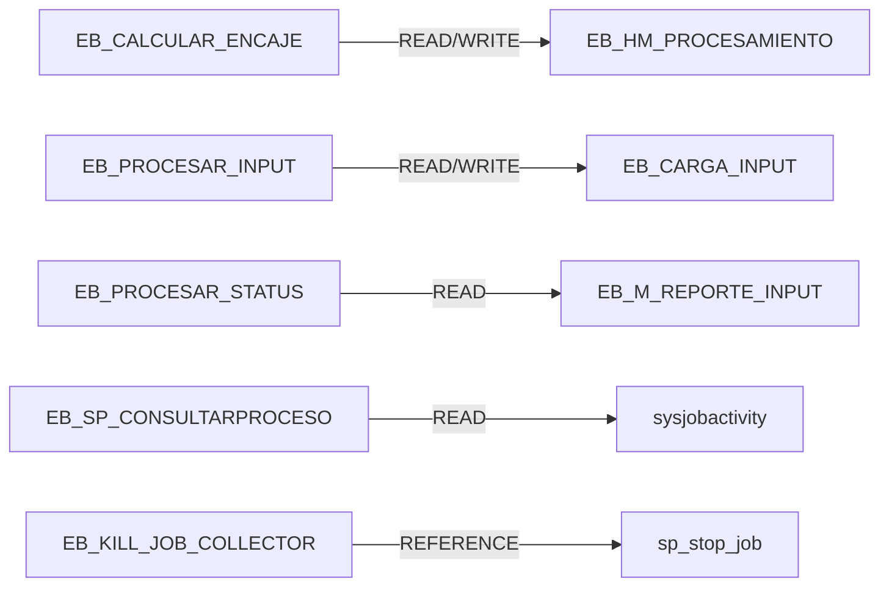
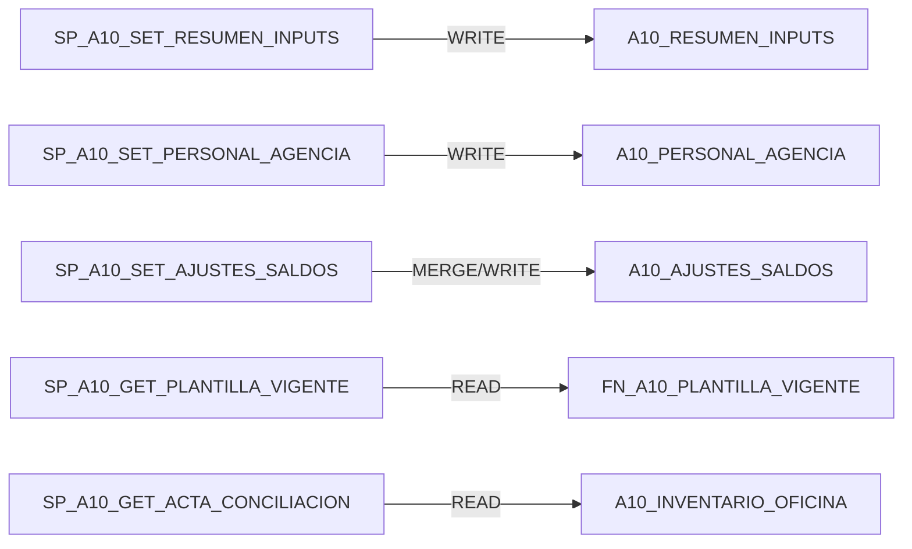
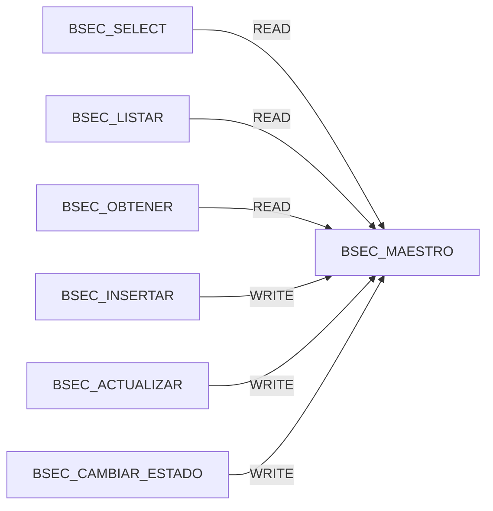
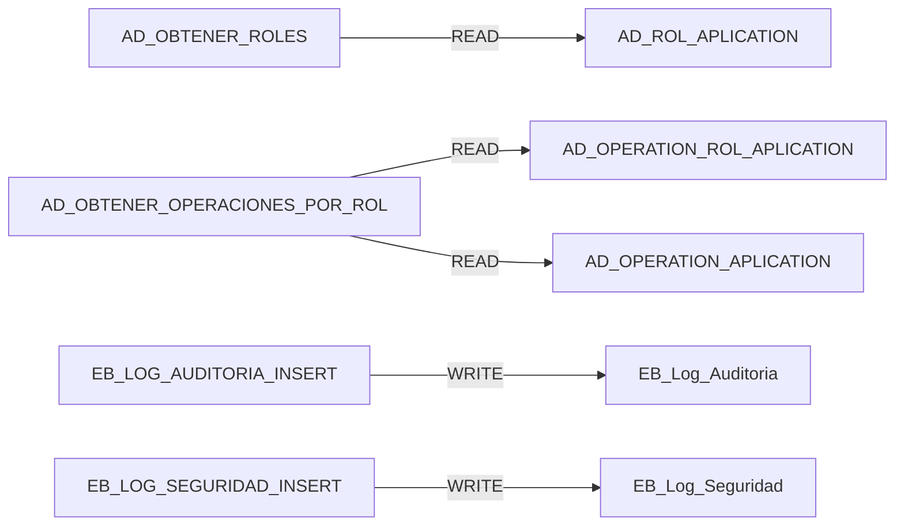

# E444 Database Technical Reference

## 1. Alcance y metodologia
- Ejecucion enfocada exclusivamente en DB0 (baseline fisico) y DB1 (objetos semilla y mapa inicial de dependencias).
- Fuente primaria: metadata SQL read-only en la BD DEV configurada en Web.config (sin ejecucion de SP funcionales para negocio).
- Se trabajo con evidencia clasificada como HECHO VERIFICADO, DOCUMENTADO PERO NO VERIFICADO, INFERENCIA TECNICA y NO DETERMINADO.

## 2. Fuentes analizadas
- `E444_REPOSITORY_TECHNICAL_REFERENCE.md` (baseline aplicativo).
- `E444.WEB/Web.config` (conexion activa).
- Consultas read-only de metadata en `sys.*` y `OBJECT_DEFINITION()`.

## 3. Baseline fisico de la base
| Campo | Valor | Clasificacion |
|---|---|---|
| Servidor | [REDACTED] | HECHO VERIFICADO |
| Base logica | BCP_BD_E444 | HECHO VERIFICADO |
| Motor | SQL Server 16.0.4295.3 (Standard Edition (64-bit)) | HECHO VERIFICADO |
| ProductLevel | RTM | HECHO VERIFICADO |
| Compatibility level | 110 | HECHO VERIFICADO |
| Collation | SQL_Latin1_General_CP1_CI_AS | HECHO VERIFICADO |
| Referencias linked server en dependencias SQL | 0 | HECHO VERIFICADO |
| Synonyms | 0 | HECHO VERIFICADO |
| CLR assemblies/modules | 0/0 | HECHO VERIFICADO |

## 4. Schemas y convenciones
### 4.1 Schemas relevantes
| Schema | Tables | Views | SP | Functions | Observacion |
|---|---|---|---|---|---|
| BSEC | 1 | 0 | 7 | 0 | Schema funcional BSEC con tabla y SP propios |
| dbo | 186 | 1 | 282 | 61 | Schema principal transversal (Encaje/A10/Auth/Logging) |

### 4.2 Convenciones observadas
| Patron | Cantidad aproximada | Uso aparente | Clasificacion |
|---|---|---|---|
| `EB_*` | 385 | Encaje + reporteria + procesos | INFERENCIA TECNICA |
| OTHER | 114 | Otros objetos legacy/transversales | INFERENCIA TECNICA |
| `SP_A10_*` | 26 | Anexo 10 | INFERENCIA TECNICA |
| `BSEC.SP_*` | 7 | Maestro BSEC | INFERENCIA TECNICA |
| `AD_*` | 6 | Autorizacion | INFERENCIA TECNICA |

## 5. Inventario cuantitativo relevante
| Metrica | Valor |
|---|---|
| Tables | 187 |
| Views | 1 |
| Stored Procedures | 289 |
| Functions (FN/IF/TF/FS/FT) | 61 |
| User-defined table types | 11 |
| Triggers | 0 |
| Synonyms | 0 |
| CLR assemblies/modules | 0/0 |

## 6. Objetos semilla
| Dominio | Semillas esperadas | Semillas localizadas | Estado |
|---|---|---|---|
| Encaje | 10 | 10 | CUMPLIDO |
| A10 | 23 | 23 | CUMPLIDO |
| BSEC | 7 | 7 | CUMPLIDO |
| Auth + Logging | 6 | 6 | CUMPLIDO |
| Total | 46 | 46 | CUMPLIDO |

### 6.1 Ficha consolidada por semilla
- HECHO VERIFICADO: 46/46 semillas localizadas en BD con firma de parametros y perfil de dependencias directas (READ/WRITE).

### Encaje
| Nombre completo | Consumidor C# | Parametros (IN/OUT) | READ | WRITE | SQL dinamico | Dep. externa msdb/job |
|---|---|---|---|---|---|---|
| `dbo.EB_CALCULAR_ENCAJE` | `DACarga.Procesar` | `@TIPO_REPORTE sys.int`; `@FECHA sys.varchar` | 15 | 13 | No | Si |
| `dbo.EB_KILL_JOB_COLLECTOR` | `DAMatrizCuenta.EjecutarKillJob` | `@JOB_NAME sys.sysname`; `@usuario sys.varchar`; `@msj sys.varchar OUT` | 7 | 0 | Si | Si |
| `dbo.EB_PROCESAR_INPUT` | `DACarga.ProcesarInput` | `@TIPO_REPORTE sys.int`; `@FECHA sys.varchar` | 39 | 9 | No | Si |
| `dbo.EB_PROCESAR_STATUS` | `DACarga.ListaProcesarStatus` | `@TIPO_REPORTE sys.int`; `@FECHA sys.varchar` | 27 | 0 | No | Si |
| `dbo.EB_SP_CERRARPROCESO` | `DACarga.CerrarProceso` | `@ID sys.int` | 1 | 2 | No | No |
| `dbo.EB_SP_CONSULTARPROCESO` | `DACarga.ConsultarProceso` | `@ID sys.int` | 7 | 0 | No | Si |
| `dbo.EB_SP_DETENERPROCESO` | `DACarga.ProcesarDetener` | (sin parametros) | 8 | 2 | Si | Si |
| `dbo.EB_SP_PROCESA_MAESTRO` | `DACarga.ProcesarMaestro` | (sin parametros) | 18 | 5 | Si | No |
| `dbo.EB_VALIDAR_ESTADO` | `DACarga.ValidarEstado` | (sin parametros) | 12 | 0 | No | Si |
| `dbo.EB_VALIDAR_ESTADO_INPUT` | `DACarga.ValidarEstadoInput` | (sin parametros) | 11 | 0 | No | Si |

### A10
| Nombre completo | Consumidor C# | Parametros (IN/OUT) | READ | WRITE | SQL dinamico | Dep. externa msdb/job |
|---|---|---|---|---|---|---|
| `dbo.SP_A10_DEL_AJUSTES_SALDOS` | `DAAnexo10.Delete_Ajustes_Saldos` | `@CODIGO_SBS sys.smallint`; `@PRODUCTO sys.varchar`; `@MONEDA sys.char`; `@CODIGO_MES sys.int` | 4 | 1 | No | No |
| `dbo.SP_A10_DEL_CIERRE_DEF` | `DAAnexo10.EliminarCierreDefinitivo` | `@ID sys.int` | 5 | 3 | No | No |
| `dbo.SP_A10_DEL_CIERRE_TMP` | `DAAnexo10.EliminarCierreTemporal` | `@ID sys.int` | 1 | 1 | No | No |
| `dbo.SP_A10_GET_ACTA_CONCILIACION` | `DAAnexo10.GetSLima/GetSProv/GetReporteFinal` | `@CODIGO_MES sys.int`; `@TIPO sys.varchar` | 25 | 0 | No | No |
| `dbo.SP_A10_GET_AJUSTES_SALDOS` | `DAAnexo10.Get_Ajustes_Saldos` | `@CODIGO_MES sys.int` | 12 | 0 | No | No |
| `dbo.SP_A10_GET_CIERRE_DEF_VIGENTE` | `DAAnexo10.GetCierresDefinitivosVigentes` | (sin parametros) | 10 | 0 | No | No |
| `dbo.SP_A10_GET_CIERRE_TMP_VIGENTE` | `DAAnexo10.GetCierresTemporalesVigentes` | `@CODIGO_MES sys.int` | 11 | 0 | No | No |
| `dbo.SP_A10_GET_PERSONAL_SUCURSAL_EXTERIOR` | `DAAnexo10.GetPersonalSucursalExterior` | `@CODIGO_MES sys.int` | 5 | 0 | No | No |
| `dbo.SP_A10_GET_PLANTILLA_HISTORICO` | `DAAnexo10.GetPlantillaHistorico` | `@CODIGO_SBS sys.int` | 22 | 0 | No | No |
| `dbo.SP_A10_GET_PLANTILLA_VIGENTE` | `DAAnexo10.GetPlantillaVigente` | `@CODIGO_MES sys.int` | 22 | 0 | No | No |
| `dbo.SP_A10_GET_RESUMEN_INPUTS_POR_MES` | `DAAnexo10.GetResumenInputsPorMes` | `@CODIGO_MES sys.int` | 6 | 0 | No | No |
| `dbo.SP_A10_GET_RESUMEN_SUCURSAL_EXTERIOR` | `DAAnexo10.GetSaldosSucursalExterior` | `@CODIGO_MES sys.int` | 5 | 0 | No | No |
| `dbo.SP_A10_GET_TIPO_CAMBIO` | `DAAnexo10.GetTipoCambio` | `@CODIGO_MES sys.int` | 7 | 0 | No | No |
| `dbo.SP_A10_GET_TIPOS_OFICINA` | `DAAnexo10.GetTiposOficina` | `@CODIGO_TIPO_EXCLUIDO sys.int` | 3 | 0 | No | No |
| `dbo.SP_A10_SET_AJUSTES_SALDOS` | `DAAnexo10.Set_Ajustes_Saldos` | `@CODIGO_SBS sys.smallint`; `@PRODUCTO sys.varchar`; `@MONEDA sys.char`; `@CODIGO_MES sys.int`; `@OPERACION sys.char`; `@MONTO_ABS sys.decimal`; `@USUARIO sys.varchar` | 10 | 5 | No | No |
| `dbo.SP_A10_SET_CIERRE_DEF` | `DAAnexo10.InsertCierreDefinitivo` | `@AGENCIA_ORIGEN sys.smallint`; `@AGENCIA_DESTINO sys.smallint`; `@FECHA_CIERRE sys.date`; `@USUARIO_REGISTRO sys.varchar`; `@NEW_ID sys.int OUT` | 3 | 5 | No | No |
| `dbo.SP_A10_SET_CIERRE_TMP` | `DAAnexo10.InsertCierreTemporal` | `@AGENCIA_ORIGEN sys.smallint`; `@AGENCIA_DESTINO sys.smallint`; `@FECHA_INICIO sys.date`; `@FECHA_FIN sys.date`; `@USUARIO_REGISTRO sys.varchar`; `@NEW_ID sys.int OUT` | 3 | 6 | No | No |
| `dbo.SP_A10_SET_PERSONAL_AGENCIA` | `DAAnexo10.InsertPersonalAgencias` | `@DATOS dbo.A10_PERSONAL_AGENCIA_TYPE`; `@CODIGO_MES sys.int`; `@USUARIO_REGISTRO sys.varchar` | 0 | 6 | No | No |
| `dbo.SP_A10_SET_PERSONAL_SUCURSAL_EXTERIOR` | `DAAnexo10.InsertPersonalAgenciasExterior` | `@DATOS dbo.A10_PERSONAL_AGENCIA_TYPE`; `@CODIGO_MES sys.int`; `@USUARIO_REGISTRO sys.varchar` | 0 | 6 | No | No |
| `dbo.SP_A10_SET_RESUMEN_INPUTS` | `DAAnexo10.InsertResumenInputs` | `@DATOS dbo.A10_RESUMEN_INPUTS_TYPE`; `@CODIGO_MES sys.int`; `@USUARIO_REGISTRO sys.varchar` | 0 | 7 | No | No |
| `dbo.SP_A10_SET_RESUMEN_SUCURSAL_EXTERIOR` | `DAAnexo10.InsertSaldosAgenciasExterior` | `@DATOS dbo.A10_RESUMEN_INPUTS_TYPE`; `@CODIGO_MES sys.int`; `@USUARIO_REGISTRO sys.varchar` | 0 | 7 | No | No |
| `dbo.SP_A10_SET_TIPO_CAMBIO` | `DAAnexo10.SetTipoCambio` | `@CODIGO_MES sys.int`; `@TIPO_CAMBIO sys.decimal`; `@USUARIO sys.varchar` | 0 | 7 | No | No |
| `dbo.SP_A10_SET_TIPO_OFICINA_HISTORICO` | `DAAnexo10.Set_Tipo_Oficina_Historico` | `@CODIGO_SBS sys.int`; `@NUEVO_CODIGO_TIPO sys.int`; `@CODIGO_MES sys.int`; `@USUARIO sys.varchar` | 0 | 11 | Si | No |

### BSEC
| Nombre completo | Consumidor C# | Parametros (IN/OUT) | READ | WRITE | SQL dinamico | Dep. externa msdb/job |
|---|---|---|---|---|---|---|
| `BSEC.SP_MAESTRO_CLASIFICACION_ACTUALIZAR` | `DABSEC.UpdateMaestro` | `@ID_CLASIFICACION sys.bigint`; `@CODIGO_INTERNO_COMPUTACIONAL sys.nvarchar`; `@CODIGO_DOCUMENTO sys.nvarchar`; `@RAZON_SOCIAL sys.nvarchar`; `@CODIGO_BSEC sys.nvarchar`; `@DESCRIPCION_BSEC sys.nvarchar`; `@CODIGO_BCR sys.nvarchar`; `@TIPO_PRODUCTO sys.nvarchar`; `@FECHA_DIA sys.nvarchar`; `@NOTA sys.nvarchar`; `@USUARIO sys.nvarchar` | 1 | 12 | No | No |
| `BSEC.SP_MAESTRO_CLASIFICACION_CAMBIAR_ESTADO` | `DABSEC.CambiarEstadoMaestro` | `@ID_CLASIFICACION sys.bigint`; `@ESTADO sys.bit`; `@USUARIO sys.nvarchar` | 1 | 6 | No | No |
| `BSEC.SP_MAESTRO_CLASIFICACION_EXISTE_ACTIVO` | `DABSEC.ExisteMaestroActivo` | `@CODIGO_INTERNO_COMPUTACIONAL sys.nvarchar`; `@TIPO_PRODUCTO sys.nvarchar`; `@CODIGO_BCR sys.nvarchar`; `@ESTADO sys.bit`; `@ID_EXCLUIR sys.bigint` | 5 | 0 | No | No |
| `BSEC.SP_MAESTRO_CLASIFICACION_INSERTAR` | `DABSEC.InsertMaestro` | `@CODIGO_INTERNO_COMPUTACIONAL sys.nvarchar`; `@CODIGO_DOCUMENTO sys.nvarchar`; `@RAZON_SOCIAL sys.nvarchar`; `@CODIGO_BSEC sys.nvarchar`; `@DESCRIPCION_BSEC sys.nvarchar`; `@CODIGO_BCR sys.nvarchar`; `@TIPO_PRODUCTO sys.nvarchar`; `@FECHA_DIA sys.nvarchar`; `@NOTA sys.nvarchar`; `@USUARIO sys.nvarchar`; `@NEW_ID sys.bigint OUT` | 0 | 13 | No | No |
| `BSEC.SP_MAESTRO_CLASIFICACION_LISTAR` | `DABSEC.GetMaestro` | `@CODIGO_INTERNO_COMPUTACIONAL sys.nvarchar`; `@RAZON_SOCIAL sys.nvarchar`; `@TIPO_PRODUCTO sys.nvarchar`; `@CODIGO_BCR sys.nvarchar`; `@ESTADO sys.bit` | 18 | 0 | Si | No |
| `BSEC.SP_MAESTRO_CLASIFICACION_OBTENER` | `DABSEC.GetMaestroPorId` | `@ID_CLASIFICACION sys.bigint` | 18 | 0 | No | No |
| `BSEC.SP_MAESTRO_CLASIFICACION_SELECT` | `DABSEC.GetMaestroClasificacion` | (sin parametros) | 12 | 0 | No | No |

### Auth
| Nombre completo | Consumidor C# | Parametros (IN/OUT) | READ | WRITE | SQL dinamico | Dep. externa msdb/job |
|---|---|---|---|---|---|---|
| `dbo.AD_OBTENER_OPERACIONES_POR_ROL` | `DAActDirectory.ListarOperacionesPorRol` | `@ROL sys.int` | 8 | 0 | No | No |
| `dbo.AD_OBTENER_ROLES` | `DAActDirectory.ListarRoles` | (sin parametros) | 5 | 0 | No | No |

### Logging
| Nombre completo | Consumidor C# | Parametros (IN/OUT) | READ | WRITE | SQL dinamico | Dep. externa msdb/job |
|---|---|---|---|---|---|---|
| `dbo.EB_LOG_AUDITORIA_INSERT` | `LogUtilDA` | `@vch_MENSAJE sys.varchar`; `@vch_DETALLE sys.varchar`; `@vch_USUARIO sys.varchar`; `@vch_IPEQUIPO sys.varchar`; `@vch_NOMBRE sys.varchar` | 0 | 7 | No | No |
| `dbo.EB_LOG_AUDITORIA_UPDATE` | `LogUtilDA` | `@vch_USUARIO sys.varchar` | 2 | 2 | No | No |
| `dbo.EB_LOG_SEGURIDAD_INSERT` | `LogUtilDA` | `@vch_MENSAJE sys.varchar`; `@vch_DETALLE sys.varchar`; `@vch_USUARIO sys.varchar`; `@vch_IPEQUIPO sys.varchar`; `@vch_NOMBRE sys.varchar` | 0 | 7 | No | No |
| `dbo.EB_VALIDA_REPORTE` | `LogUtilDA.Validar_Reportes` | `@CODMES sys.varchar`; `@REPORTE sys.int` | 12 | 0 | No | No |

## 7. Encaje - mapa inicial SQL

### Top dependencias Encaje
| Objeto referenciado | Relacion | Ocurrencias |
|---|---|---|
| `dbo.sysjobactivity` | READ | 35 |
| `dbo.sysjobs_view` | READ | 21 |
| `dbo.EB_HM_PROCESAMIENTO` | READ | 16 |
| `dbo.EB_HM_PROCESAMIENTO` | WRITE | 14 |
| `dbo.EB_M_REPORTE` | READ | 10 |
| `dbo.EB_CARGA_INPUT` | READ | 9 |
| `dbo.EB_M_REPORTE_INPUT` | READ | 7 |
| `dbo.EB_CARGA_INPUT` | WRITE | 7 |
| `dbo.sp_stop_job` | REFERENCE | 7 |
| `dbo.EB_M_INPUT` | READ | 6 |

## 8. Anexo 10 - mapa inicial SQL

### Top dependencias A10
| Objeto referenciado | Relacion | Ocurrencias |
|---|---|---|
| `dbo.A10_INVENTARIO_OFICINA` | READ | 25 |
| `dbo.A10_AJUSTES_SALDOS` | READ | 20 |
| `dbo.A10_OFICINA_CODIGO_HISTORICO` | READ | 20 |
| `dbo.A10_CIERRE_DEFINITIVO` | READ | 18 |
| `dbo.A10_CIERRE_TEMPORAL` | READ | 17 |
| `dbo.A10_RESUMEN_INPUTS` | READ | 11 |
| `dbo.A10_PERSONAL_AGENCIA` | READ | 10 |
| `dbo.A10_OFICINA_CODIGO_HISTORICO` | READ_WRITE | 10 |
| `dbo.A10_RESUMEN_INPUTS` | WRITE | 10 |
| `dbo.FN_A10_PLANTILLA_VIGENTE` | READ | 9 |

### Hallazgos A10 clave (DB1)
- HECHO VERIFICADO: `SP_A10_SET_RESUMEN_INPUTS` implementa DELETE por CODIGO_MES (excepto agencias 334/336) + INSERT desde TVP.
- HECHO VERIFICADO: `SP_A10_SET_PERSONAL_AGENCIA` implementa DELETE por CODIGO_MES (excepto agencias 334/336) + INSERT UNION ALL desde TVP por tipo de cargo.
- HECHO VERIFICADO: `SP_A10_SET_AJUSTES_SALDOS` usa MERGE (UPDATE/INSERT).
- HECHO VERIFICADO: no se observaron BEGIN TRAN/COMMIT/ROLLBACK explicitos en semillas A10 inspeccionadas.

## 9. BSEC - mapa inicial SQL

### Top dependencias BSEC
| Objeto referenciado | Relacion | Ocurrencias |
|---|---|---|
| `BSEC.MAESTRO_CLASIFICACION_SECTORIAL` | READ | 55 |
| `BSEC.MAESTRO_CLASIFICACION_SECTORIAL` | WRITE | 25 |
| `BSEC.MAESTRO_CLASIFICACION_SECTORIAL` | READ_WRITE | 6 |

### Hallazgos BSEC clave (DB1)
- HECHO VERIFICADO: `BSEC.SP_MAESTRO_CLASIFICACION_SELECT` filtra `WHERE ESTADO = 1` (inactivos excluidos del SELECT).
- HECHO VERIFICADO: `BSEC.SP_MAESTRO_CLASIFICACION_EXISTE_ACTIVO` es validacion EXISTS (sin lock hints ni transaccion explicita).
- HECHO VERIFICADO: INSERTAR/ACTUALIZAR/CAMBIAR_ESTADO usan `SET XACT_ABORT ON` y `THROW` para validaciones.

## 10. Autorizacion y logging - mapa inicial SQL

### Top dependencias Auth
| Objeto referenciado | Relacion | Ocurrencias |
|---|---|---|
| `dbo.AD_ROL_APLICATION` | READ | 5 |
| `dbo.AD_OPERATION_APLICATION` | READ | 4 |
| `dbo.AD_OPERATION_ROL_APLICATION` | READ | 4 |

### Top dependencias Logging
| Objeto referenciado | Relacion | Ocurrencias |
|---|---|---|
| `dbo.EB_Log_Auditoria` | WRITE | 8 |
| `dbo.EB_Log_Seguridad` | WRITE | 7 |
| `dbo.EB_R_REPORTE05` | READ | 2 |
| `dbo.EB_R_REPORTE02` | READ | 2 |
| `dbo.EB_R_ENCAJEDIARIO_MN` | READ | 2 |
| `dbo.EB_R_REPORTE01_MN` | READ | 2 |
| `dbo.EB_Log_Auditoria` | READ | 2 |
| `dbo.EB_R_REPORTE04` | READ | 2 |
| `dbo.EB_R_REPORTE03` | READ | 2 |
| `dbo.EB_Log_Auditoria` | READ_WRITE | 1 |

## 11. User-defined types / TVP
| Tipo | Consumidores | Columnas estructurales | Observacion |
|---|---|---|---|
| `dbo.A10_RESUMEN_INPUTS_TYPE` | `SP_A10_SET_RESUMEN_INPUTS`; `SP_A10_SET_RESUMEN_SUCURSAL_EXTERIOR` | AGENCIA(int), PRODUCTO(varchar), MONEDA_NACIONAL(decimal), MONEDA_EXTRANJERA(decimal) | HECHO VERIFICADO |
| `dbo.A10_PERSONAL_AGENCIA_TYPE` | `SP_A10_SET_PERSONAL_AGENCIA`; `SP_A10_SET_PERSONAL_SUCURSAL_EXTERIOR` | AGENCIA(int), GERENTE(int), FUNCIONARIO(int), EMPLEADO(int), OTROS(int), TOTAL(int) | HECHO VERIFICADO |
| `dbo.IdList` | `EB_DELETEAJUSTESMASIVO` | Id(int) | HECHO VERIFICADO |
| Otros UDTT de Encaje | `EB_*` de carga masiva/tipo cambio | NO DETERMINADO en esta pasada de semillas | HECHO VERIFICADO (existencia) |

## 12. Dependencias directas
- Total aristas de dependencias directas registradas sobre semillas: 542.
- Distribucion global: READ=381, WRITE=103, READ_WRITE=40, REFERENCE=18.
- HECHO VERIFICADO: no hubo objetos con DomainCount > 1 en la matriz de consumidores de alcance DB1 semilla (comparticion directa no observada en esta frontera).

## 13. Lecturas y escrituras
| Dominio | Perfil observado | Clasificacion |
|---|---|---|
| Encaje | Mezcla READ + WRITE sobre tablas `EB_*` y uso de objetos msdb/sysjob* en semillas de proceso/control | HECHO VERIFICADO |
| A10 | Seeds GET mayormente READ; seeds SET/DEL con WRITE; presencia de MERGE en `SP_A10_SET_AJUSTES_SALDOS` | HECHO VERIFICADO |
| BSEC | SELECT/LISTAR/OBTENER/EXISTE_ACTIVO son READ; INSERTAR/ACTUALIZAR/CAMBIAR_ESTADO son WRITE | HECHO VERIFICADO |
| Auth/Logging | `AD_*` solo READ; `EB_LOG_*` con WRITE en tablas de bitacora | HECHO VERIFICADO |

## 14. Tablas fisicas relevantes
| Tabla | PK | UQ | FK | CHECK | DEFAULT | INDEX | TRIGGER | Observacion |
|---|---|---|---|---|---|---|---|---|
| `BSEC.MAESTRO_CLASIFICACION_SECTORIAL` | 1 | 0 | 0 | 0 | 0 | 2 | 0 | Nodo central BSEC |
| `dbo.A10_RESUMEN_INPUTS` | 1 | 1 | 0 | 0 | 0 | 1 | 0 | Persistencia resumen inputs |
| `dbo.A10_PERSONAL_AGENCIA` | 1 | 0 | 0 | 0 | 0 | 1 | 0 | Persistencia personal por agencia |
| `dbo.A10_CIERRE_TEMPORAL` | 1 | 0 | 2 | 1 | 1 | 1 | 0 | FK a `dbo.A10_INVENTARIO_OFICINA` (origen/destino) |
| `dbo.A10_CIERRE_DEFINITIVO` | 1 | 0 | 2 | 1 | 1 | 1 | 0 | FK a `dbo.A10_INVENTARIO_OFICINA` (origen/destino) |
| `dbo.A10_OFICINA_CODIGO_HISTORICO` | 1 | 0 | 1 | 2 | 2 | 1 | 0 | FK a `dbo.A10_INVENTARIO_OFICINA` |
| `dbo.A10_AJUSTES_SALDOS` | 1 | 0 | 0 | 2 | 2 | 1 | 0 | Mantiene ajustes por mes/producto/moneda |
| `dbo.A10_TIPO_CAMBIO` | 1 | 0 | 0 | 0 | 2 | 1 | 0 | Tipo de cambio A10 |
| `dbo.AD_ROL_APLICATION` | 1 | 0 | 0 | 0 | 1 | 1 | 0 | Catalogo roles auth |
| `dbo.AD_OPERATION_APLICATION` | 1 | 0 | 0 | 0 | 1 | 1 | 0 | Catalogo operaciones auth |
| `dbo.AD_OPERATION_ROL_APLICATION` | 1 | 0 | 2 | 0 | 1 | 1 | 0 | Vinculo rol-operacion |
| `dbo.EB_CARGA_INPUT` | 1 | 0 | 0 | 0 | 0 | 1 | 0 | Nodo principal carga Encaje |
| `dbo.EB_HM_PROCESAMIENTO` | 0 | 0 | 0 | 0 | 0 | 0 | 0 | Tabla de estado sin PK visible |
| `dbo.EB_Log_Auditoria` | 1 | 0 | 0 | 0 | 1 | 1 | 0 | Tabla log auditoria |
| `dbo.EB_Log_Seguridad` | 1 | 0 | 0 | 0 | 1 | 1 | 0 | Tabla log seguridad |

## 15. Views y Functions relevantes
| Objeto | Tipo | Clasificacion logica | Dependencia observada |
|---|---|---|---|
| `dbo.FN_A10_MATRIZ_SALDOS_AGREGADOS` | SQL_INLINE_TABLE_VALUED_FUNCTION | aggregation | A10 |
| `dbo.FN_A10_PLANTILLA_VIGENTE` | SQL_INLINE_TABLE_VALUED_FUNCTION | simple projection | A10 |

## 16. Transacciones y atomicidad preliminar
- HECHO VERIFICADO: en semillas analizadas no se observaron BEGIN TRAN/COMMIT/ROLLBACK explicitos.
- HECHO VERIFICADO: `BSEC.SP_MAESTRO_CLASIFICACION_INSERTAR`/ACTUALIZAR/CAMBIAR_ESTADO usan SET XACT_ABORT ON y THROW.
- HECHO VERIFICADO: A10 SET_RESUMEN_INPUTS y SET_PERSONAL_AGENCIA se ejecutan como SP separados; no evidencia de atomicidad multi-SP en SQL de estas dos operaciones.
- INFERENCIA TECNICA: la atomicidad entre llamadas secuenciales desde C# permanece en capa aplicativo, no transaccion compartida observable en SQL de semillas.

## 17. SQL dinamico
| Objeto | SQL dinamico | Nota |
|---|---|---|
| `BSEC.SP_MAESTRO_CLASIFICACION_LISTAR` | Si | DEPENDENCIA DINAMICA - REQUIERE ANALISIS ESPECIFICO |
| `dbo.EB_KILL_JOB_COLLECTOR` | Si | DEPENDENCIA DINAMICA - REQUIERE ANALISIS ESPECIFICO |
| `dbo.EB_SP_DETENERPROCESO` | Si | DEPENDENCIA DINAMICA - REQUIERE ANALISIS ESPECIFICO |
| `dbo.EB_SP_PROCESA_MAESTRO` | Si | DEPENDENCIA DINAMICA - REQUIERE ANALISIS ESPECIFICO |
| `dbo.SP_A10_SET_TIPO_OFICINA_HISTORICO` | Si | DEPENDENCIA DINAMICA - REQUIERE ANALISIS ESPECIFICO |

## 18. Triggers y dependencias ocultas
- HECHO VERIFICADO: conteo global de triggers de usuario = 0.
- HECHO VERIFICADO: en tablas nodales de DB1 no se detectaron triggers (trigger_count=0).

## 19. Relaciones fisicas y logicas
### 19.1 Relaciones fisicas (FK verificadas)
| Tabla origen | FK | Tabla destino |
|---|---|---|
| `dbo.A10_CIERRE_DEFINITIVO` | FK_A10_CDEF_DESTINO | `dbo.A10_INVENTARIO_OFICINA` |
| `dbo.A10_CIERRE_DEFINITIVO` | FK_A10_CDEF_ORIGEN | `dbo.A10_INVENTARIO_OFICINA` |
| `dbo.A10_CIERRE_TEMPORAL` | FK_A10_CTMP_DESTINO | `dbo.A10_INVENTARIO_OFICINA` |
| `dbo.A10_CIERRE_TEMPORAL` | FK_A10_CTMP_ORIGEN | `dbo.A10_INVENTARIO_OFICINA` |
| `dbo.A10_OFICINA_CODIGO_HISTORICO` | FK_A10_OCH_IO | `dbo.A10_INVENTARIO_OFICINA` |
| `dbo.AD_OPERATION_ROL_APLICATION` | FK_OPERATION | `dbo.AD_OPERATION_APLICATION` |
| `dbo.AD_OPERATION_ROL_APLICATION` | FK_ROL | `dbo.AD_ROL_APLICATION` |

### 19.2 Relaciones logicas sin FK observable
- A10_RESUMEN_INPUTS y A10_PERSONAL_AGENCIA reciben reposicion mensual desde TVP via DELETE+INSERT.
- EB_HM_PROCESAMIENTO participa en control de proceso Encaje sin PK/FK visible en esta pasada.
- BSEC.MAESTRO_CLASIFICACION_SECTORIAL concentra estado/vigencia por reglas de SP, sin FK fisica a otros dominios.

## 20. Matriz inicial de consumidores
| Objeto fisico | Encaje | A10 | BSEC | Auth/Transversal | Evidencia |
|---|---|---|---|---|---|
| `dbo.EB_HM_PROCESAMIENTO` | 1 | 0 | 0 | 0 | Dependencias de `EB_*` |
| `dbo.EB_CARGA_INPUT` | 1 | 0 | 0 | 0 | Dependencias de `EB_*` |
| `dbo.A10_RESUMEN_INPUTS` | 0 | 1 | 0 | 0 | Dependencias de `SP_A10_*` |
| `dbo.A10_PERSONAL_AGENCIA` | 0 | 1 | 0 | 0 | Dependencias de `SP_A10_*` |
| `BSEC.MAESTRO_CLASIFICACION_SECTORIAL` | 0 | 0 | 1 | 0 | Dependencias de `BSEC.SP_*` |
| `dbo.AD_ROL_APLICATION` | 0 | 0 | 0 | 1 | `AD_OBTENER_ROLES` |
| `dbo.AD_OPERATION_APLICATION` | 0 | 0 | 0 | 1 | `AD_OBTENER_OPERACIONES_POR_ROL` |
| `dbo.EB_Log_Auditoria` | 0 | 0 | 0 | 1 | `EB_LOG_AUDITORIA_*` |
| `dbo.EB_Log_Seguridad` | 0 | 0 | 0 | 1 | `EB_LOG_SEGURIDAD_INSERT` |

Nota: en esta frontera DB1 semilla no se observaron objetos fisicos directos con consumo multi-superficie (DomainCount>1).

## 21. Senales preliminares de ownership
| Objeto/Conjunto | Senal preliminar | Tipo de evidencia |
|---|---|---|
| `SP_A10_*` + tablas `A10_*` | APARENTEMENTE PROPIA DE A10 | INFERENCIA TECNICA sustentada por READ/WRITE directos |
| `BSEC.SP_*` + `BSEC.MAESTRO_CLASIFICACION_SECTORIAL` | APARENTEMENTE PROPIA DE BSEC | INFERENCIA TECNICA sustentada por dependencia 1-tabla central |
| `EB_*` semillas proceso/control | APARENTEMENTE PROPIA DE ENCAJE | INFERENCIA TECNICA |
| `AD_*` y `EB_LOG_*` | TRANSVERSAL | INFERENCIA TECNICA con evidencia de uso auth/logging |
| Objetos de msdb/sysjob* | INFRAESTRUCTURA EXTERNA | HECHO VERIFICADO |

## 22. Dependencias externas detectadas
- HECHO VERIFICADO: se detectaron 19 objetos con senales de msdb/sp_start_job/openquery/openrowset/opendatasource.
- Objetos semilla con senal externa: EB_CALCULAR_ENCAJE, EB_PROCESAR_INPUT, EB_PROCESAR_STATUS, EB_VALIDAR_ESTADO, EB_VALIDAR_ESTADO_INPUT, EB_SP_CONSULTARPROCESO, EB_SP_DETENERPROCESO, EB_KILL_JOB_COLLECTOR.
- Clasificacion: DEPENDENCIA EXTERNA DETECTADA (frontera SQL Agent/SSIS mantenida; no se profundizo en jobs/SSIS).

## 23. Contradicciones aplicacion <-> BD
| Hallazgo | Evidencia SQL | Clasificacion | Impacto |
|---|---|---|---|
| Nombre documentado AD_OPERACION_ROL_APLICATION vs objeto real AD_OPERATION_ROL_APLICATION | Tabla y FK existentes: AD_OPERATION_ROL_APLICATION | HECHO VERIFICADO | Ajustar nomenclatura para trazabilidad y automatizaciones |
| `SP_A10_DEL_CIERRE_DEF` no solo elimina: tambien reactiva inventario (UPDATE A10_INVENTARIO_OFICINA) antes de DELETE | OBJECT_DEFINITION de `SP_A10_DEL_CIERRE_DEF` | HECHO VERIFICADO | Contrato funcional es delete + side effect de estado |
| `SP_A10_SET_RESUMEN_INPUTS` y `SP_A10_SET_PERSONAL_AGENCIA` implementan reemplazo mensual por DELETE+INSERT | OBJECT_DEFINITION de ambos SP | HECHO VERIFICADO | Confirma semantica de reproceso mensual y riesgo de atomicidad multi-SP |

## 24. Preguntas heredadas
| ID | Estado en DB0-DB1 | Resumen |
|---|---|---|
| A10-BD-01 | PARCIALMENTE RESUELTA | Se verifico DELETE+INSERT en ambos SP; pendiente evaluar atomicidad extremo-a-extremo y manejo de falla inter-SP. |
| A10-BD-02 | NO RESUELTA | Se identificaron objetos de cierres; falta analisis profundo del algoritmo de solapamiento temporal. |
| A10-BD-03 | PARCIALMENTE RESUELTA | Grafo inicial construido (inputs/cierres/plantilla/acta); pendiente lineage completo al .110. |
| BSEC-BD-01 | PARCIALMENTE RESUELTA | `SP_SELECT` consume `BSEC.MAESTRO_CLASIFICACION_SECTORIAL` con `ESTADO=1`. |
| BSEC-BD-02 | PARCIALMENTE RESUELTA | `EXISTS_ACTIVO` es validacion previa; no prueba de garantia fuerte de concurrencia por si sola. |
| BSEC-BD-03 | PARCIALMENTE RESUELTA | En semillas BSEC no se observaron cruces funcionales a A10/Encaje; requiere expansion posterior. |
| BSEC-BD-04 | PARCIALMENTE RESUELTA | Se observaron campos de auditoria/modificacion/inactivacion en UPDATE/CAMBIAR_ESTADO. |
| BSEC-BD-05 | RESUELTA | SELECT filtra ESTADO=1, por lo que inactivos no participan en dataset de clasificacion. |
| BSEC-BD-06 | NO RESUELTA | Sin evidencia en esta frontera de persistencia de resultado de Procesamiento.aspx mas alla del maestro. |
| BSEC-BD-07 | PARCIALMENTE RESUELTA | Validaciones en INSERT/UPDATE sobre claves y obligatoriedad; falta profundizar FECHA_DIA/CODIGO_BCR semantica total. |

## 25. Preguntas nuevas
| ID | Pregunta | Por que importa | Evidencia | Fuente siguiente |
|---|---|---|---|---|
| DB1-NQ-01 | Existe constraint unico fisico para respaldar unicidad activa en BSEC (codigo interno + tipo producto + estado)? | Afecta concurrencia en altas paralelas | EXISTS_ACTIVO sin lock hints | Indices/constraints de BSEC + pruebas de concurrencia controlada |
| DB1-NQ-02 | Cuales objetos no semilla actualizan `EB_HM_PROCESAMIENTO` y como se sincroniza con control de jobs? | Critico para contrato de monitoreo Encaje | `EB_HM_PROCESAMIENTO` central en semillas | Expansion Encaje nivel 2-3 |
| DB1-NQ-03 | `FN_A10_MATRIZ_SALDOS_AGREGADOS` y `FN_A10_PLANTILLA_VIGENTE` tienen dependencias cruzadas fuera de `A10_*`? | Relevante para ownership y boundaries futuros | Funciones centrales A10 detectadas | Expansion de dependencias de functions/views |

## 26. Areas candidatas para siguiente pasada
1. Encaje profundo: cadena completa `EB_CALCULAR_ENCAJE` / `EB_PROCESAR_*` y estados de proceso con objetos msdb relacionados.
2. A10 profundo: lineage completo hacia `SP_A10_GET_ACTA_CONCILIACION` y Reporte Final .110.
3. BSEC profundo: concurrencia/constraints reales para `EXISTE_ACTIVO` + `INSERTAR`/`ACTUALIZAR`.
4. Expansion de dependencias nivel 2-3 en funciones A10 y objetos EB de reporteria.

## 27. Gates DB0-DB1
| Gate | Estado |
|---|---|
| Identidad fisica de BD conocida | CUMPLIDO |
| Schemas relevantes identificados | CUMPLIDO |
| Convenciones de objetos identificadas | CUMPLIDO |
| Objetos semilla localizados | CUMPLIDO |
| Parametros de semillas documentados | CUMPLIDO |
| Dependencias directas documentadas | CUMPLIDO |
| READ/WRITE diferenciados | CUMPLIDO |
| TVP relevantes identificados | CUMPLIDO |
| Tablas fisicas iniciales identificadas | CUMPLIDO |
| Views/functions iniciales identificadas | CUMPLIDO |
| Transacciones visibles documentadas | CUMPLIDO |
| SQL dinamico delimitado | CUMPLIDO |
| Triggers relevantes detectados | CUMPLIDO |
| Relaciones fisicas iniciales documentadas | CUMPLIDO |
| Consumidores iniciales mapeados | CUMPLIDO |
| Senales preliminares de ownership registradas | CUMPLIDO |
| Backlogs A10/BSEC preservados | CUMPLIDO |
| Frontera SQL Agent/SSIS respetada | CUMPLIDO |
| Proximas pasadas pueden disenarse con evidencia | CUMPLIDO |

## 28. Conclusiones DB0-DB1
- DB0 y DB1 quedan cerrados con evidencia SQL directa en DEV: baseline fisico, semillas localizadas (46/46), parametros y mapa inicial de dependencias.
- Se confirmo coexistencia fisica en una BD con segmentacion funcional observable en semillas: Encaje, A10, BSEC y transversal auth/logging.
- La frontera de SQL Agent/SSIS se mantuvo: solo se registraron senales de dependencia externa, sin ejecutar jobs ni SSIS.

Confirmaciones operativas:
- No se modificaron objetos SQL.
- No se ejecutaron Stored Procedures de negocio para observar resultados funcionales.
- No se ejecutaron jobs ni SSIS.
- No se consultaron filas de negocio.
- No se diseno arquitectura TO-BE.
- No se tomaron decisiones de boundaries.