# E444 Repository Technical Reference

## 1. Alcance de esta pasada

- Ejecucion limitada a PASADA 0 (baseline tecnico) y PASADA 1 (mapa estructural).
- Analisis AS-IS del repositorio local E444, sin diseno TO-BE.
- No se realizo reverse engineering profundo de BD ni analisis funcional end-to-end.
- Se analizo el snapshot actual del workspace (incluye working tree con cambios locales no committeados).

## 2. Metodologia y clasificacion de evidencia

| Clasificacion | Definicion operativa |
| --- | --- |
| HECHO VERIFICADO | Evidencia directa en codigo, archivos, estructura, comandos CLI o build. |
| DOCUMENTADO PERO NO VERIFICADO | Declarado en documentacion/comentarios/nombres, sin validacion ejecutable concluyente. |
| INFERENCIA TECNICA | Conclusion razonable derivada de evidencia observada, no demostracion directa. |
| NO DETERMINADO | Sin evidencia suficiente en esta pasada. |

Fuentes usadas:

- Inspeccion de `*.sln`, `*.csproj`, `*.config`, codigo C# y estructura de carpetas.
- Comandos Git y .NET CLI de solo lectura o validacion de build/test.
- Sin cambios funcionales en el codigo.

## 3. Baseline Git

| Clasificacion | Hallazgo | Evidencia | Impacto / observacion |
| --- | --- | --- | --- |
| HECHO VERIFICADO | Repositorio local analizado: `E444_EncajeBancario` | `git rev-parse --show-toplevel` | Define el alcance fisico del analisis. |
| HECHO VERIFICADO | Rama actual: `feature/NIIFRRCC-18028-migracion-e079` | `git branch --show-current` | Baseline asociado a una rama feature. |
| HECHO VERIFICADO | HEAD: `7fd39d7596c80c3afaf92c1348484c1aa3275d41` | `git rev-parse HEAD` | Identificador exacto del commit base. |
| HECHO VERIFICADO | Fecha HEAD: `2026-09-26 14:19:46 -0500` | `git show -s --format=%ci HEAD` | Trazabilidad temporal del baseline. |
| HECHO VERIFICADO | Upstream: `origin/feature/NIIFRRCC-18028-migracion-e079` | `git rev-parse --abbrev-ref --symbolic-full-name @{u}` | Rama local con tracking configurado. |
| HECHO VERIFICADO | `HEAD` local coincide con `origin/<rama>` (referencia local remota) | `git rev-parse HEAD` y `git rev-parse origin/<rama>` | No divergencia segun referencias locales disponibles. |
| HECHO VERIFICADO | Remote `origin` configurado a GitHub corporativo | `git remote -v` | Repositorio remoto identificado. |
| HECHO VERIFICADO | Working tree NO limpio antes del analisis | `git status --porcelain -b` | El snapshot analizado incluye cambios no committeados. |
| HECHO VERIFICADO | Tags en repo local: 0 | `git tag --list` | Sin tags para versionado en el estado local observado. |
| HECHO VERIFICADO | Submodulos: no evidencia | `git submodule status` + ausencia `.gitmodules` | No dependencia via submodulos. |
| HECHO VERIFICADO | `git fetch origin` NO ejecutado | Registro de comandos ejecutados | No se valido frescura contra remoto en esta corrida. |

Archivos modificados/no trackeados detectados antes de generar este informe:
Modificados:

- `E444.BL/LBSEC.cs`
- `E444.DA/DABSEC.cs`
- `E444.WEB/E444.WEB.csproj`
- `E444.WEB/SiteBSEC.Master`
- `E444.WEB/SiteBSEC.Master.cs`
- `E444.WEB/SiteBSEC.Master.designer.cs`
- `E444.WEB/Styles/SiteBSEC.css`
- `E444.WEB/Views/BSEC/Procesamiento.aspx`
- `E444.WEB/Web.config`
  No trackeados:
- `E444.WEB/Views/BSEC/Maestro.aspx`
- `E444.WEB/Views/BSEC/Maestro.aspx.cs`
- `E444.WEB/Views/BSEC/Maestro.aspx.designer.cs`

## 4. Baseline tecnologico

| Clasificacion | Hallazgo | Evidencia | Impacto / observacion |
| --- | --- | --- | --- |
| HECHO VERIFICADO | 1 solucion Visual Studio + 5 proyectos C# | `E444_EncajeBancario.sln`, `*.csproj` | Monorepo/solucion unica para Web + librerias. |
| HECHO VERIFICADO | Todos los proyectos apuntan a `.NET Framework v4.8` | `TargetFrameworkVersion` en los 5 `*.csproj` | Stack legacy .NET Framework, no TFM moderno (`net6+`). |
| HECHO VERIFICADO | Proyectos en formato no SDK-style (MSBuild clasico) | `ToolsVersion="12.0"` en `*.csproj` | Build depende de toolchain clasico de VS/MSBuild. |
| HECHO VERIFICADO | `E444.WEB` es ASP.NET Web Application (Web Forms) | `ProjectTypeGuids` + archivos `.aspx/.master/.asax` | Front/back acoplados en Web Forms. |
| HECHO VERIFICADO | Gestion de paquetes via `packages.config` + carpeta `packages/` | `E444.WEB/packages.config`, `E444.DA/packages.config`, `packages/` (102 directorios) | Modelo NuGet legacy; no `PackageReference`. |
| HECHO VERIFICADO | Sin `PackageReference` en `*.csproj` | Busqueda sobre `*.csproj` | Dependencias definidas por `HintPath` y `packages.config`. |
| HECHO VERIFICADO | Dependencias binarias locales versionadas | `DocumentFormat.OpenXml.dll`, `E444.Lib/EPPlus.dll` | Riesgo de dependencia sin trazabilidad de origen via NuGet. |
| HECHO VERIFICADO | Librerias frontend relevantes: jQuery, Bootstrap, bootstrap-select, InputMask | `E444.WEB/packages.config` + `E444.WEB/Scripts` | Frontend basado en librerias clasicas JS. |
| HECHO VERIFICADO | Librerias de Excel/reporting: EPPlus, NPOI, OpenXML | `E444.WEB.csproj`, `E444.Helper.csproj`, code behind de reportes | Fuerte orientacion a generacion/procesamiento de Excel. |
| HECHO VERIFICADO | Referencia a `EntityFramework 5.0.0` en Web | `E444.WEB.csproj`, `E444.WEB/packages.config` | EF presente en baseline de dependencias. |
| HECHO VERIFICADO | Uso dominante de ADO.NET en DA | `SqlConnection/SqlCommand/...` en `E444.DA/*.cs` | Persistencia centrada en SP/SQL via ADO.NET. |
| INFERENCIA TECNICA | EF parece no ser mecanismo principal de persistencia | No se encontro `DbContext`/mapeos EF en codigo fuente | Mantener como inferencia; uso puntual no descartado al 100%. |
| HECHO VERIFICADO | Sin proyectos VB | Busqueda `*.vbproj` sin resultados | Codigo observado en C#. |

## 5. Soluciones y proyectos

| Proyecto | Tipo | Framework | Rol aparente | Referencias internas | Dependencias externas relevantes | Entry point | Evidencia |
| --- | --- | --- | --- | --- | --- | --- | --- |
| E444.WEB | ASP.NET Web Application (Web Forms) | .NET Framework 4.8 | UI Web + code-behind + orquestacion de carga/reportes | E444.BE, E444.BL, E444.Helper | ASP.NET WebForms, log4net, NPOI, EPPlus, OpenXML, Newtonsoft.Json, libs Microsoft.AspNet\* | `Global.asax` + defaultDocument en `Web.config` | `E444.WEB/E444.WEB.csproj`, `E444.WEB/Global.asax`, `E444.WEB/Web.config` |
| E444.BE | Class Library | .NET Framework 4.8 | Entidades/DTOs y tipos compartidos | (none) | BCL (`System.*`) | N/A | `E444.BE/E444.BE.csproj` |
| E444.BL | Class Library | .NET Framework 4.8 | Logica de negocio/aplicacion | E444.BE, E444.DA | BCL (`System.*`) | N/A | `E444.BL/E444.BL.csproj` |
| E444.DA | Class Library | .NET Framework 4.8 | Acceso a datos (SP/ADO.NET) | E444.BE, E444.Helper | ADO.NET, `System.Web.Configuration`, paquetes EnterpriseLibrary declarados | N/A | `E444.DA/E444.DA.csproj`, `E444.DA/packages.config` |
| E444.Helper | Class Library | .NET Framework 4.8 | Utilitarios transversales (Excel, validaciones, flash) | E444.BE | EPPlus local (`E444.Lib/EPPlus.dll`) | N/A | `E444.Helper/E444.Helper.csproj` |

## 6. Grafo de dependencias

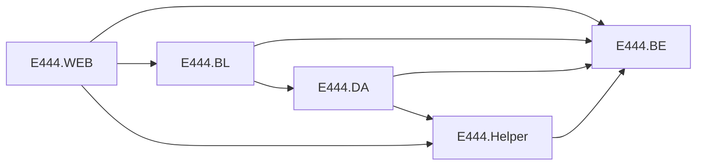

## 7. Estructura del repositorio

| Clasificacion | Hallazgo | Evidencia | Impacto / observacion |
| --- | --- | --- | --- |
| HECHO VERIFICADO | Directorios top-level principales: `.github`, `.vscode`, `E444.BE`, `E444.BL`, `E444.DA`, `E444.Helper`, `E444.Lib`, `E444.WEB`, `packages`, `PFX` | Listado de carpetas raiz | Solucion unica con capas por convencion de nombres. |
| HECHO VERIFICADO | `E444.Lib` es carpeta de librerias local, no proyecto .NET | `E444.Lib/EPPlus.dll` + ausencia de `.csproj` asociado | Contiene binario local (`EPPlus.dll`) y no participa como proyecto en la solucion. |
| HECHO VERIFICADO | `.github/workflows` vacio | Estructura de carpeta | No se observo pipeline CI/CD en repo (al menos en este snapshot). |
| HECHO VERIFICADO | `PFX` contiene artefactos de certificados y archivos operativos asociados | Estructura `PFX/...` | Señal de artefactos de infraestructura dentro de codigo fuente. |

## 8. Estructura de la aplicacion Web

| Clasificacion | Hallazgo | Evidencia | Impacto / observacion |
| --- | --- | --- | --- |
| HECHO VERIFICADO | Estructura Web detectada: `App_Start`, `Content`, `css`, `files`, `General`, `Handlers`, `Scripts`, `Service References`, `ServiceExtensions`, `Styles`, `Views` | `E444.WEB/` | Estructura tipica Web Forms extendida con areas funcionales. |
| HECHO VERIFICADO | `Global.asax` presente | `E444.WEB/Global.asax` | Entry point del ciclo de vida de aplicacion. |
| HECHO VERIFICADO | Master Pages: `Site.Master`, `SiteAnexo10.Master`, `SiteBSEC.Master` | Archivos `*.Master` | Navegacion/plantillas diferenciadas dentro de una sola aplicacion Web. |
| HECHO VERIFICADO | Handler HTTP custom: `UpFileHandler.ashx` | `E444.WEB/Handlers/UpFileHandler.ashx` | Punto tecnico para carga/validacion de archivos. |
| HECHO VERIFICADO | Sin User Controls `.ascx` | Inventario extensiones | No se observaron controles webForms reutilizables tipo `.ascx`. |
| HECHO VERIFICADO | No hay `RouteConfig` / `MapRoute` | Busqueda en `E444.WEB/**/*.*` | Navegacion basada en rutas fisicas `.aspx`. |
| HECHO VERIFICADO | `App_Data` declarado como carpeta de proyecto | `E444.WEB.csproj` | Presencia estructural; uso funcional no determinado en esta pasada. |

## 9. Inventario cuantitativo inicial

(Conteos sobre codigo fuente, excluyendo `bin/obj/packages`)

| Metrica | Valor aproximado | Evidencia/metodo |
| --- | --- | --- |
| Numero de proyectos | 5 | Inventario de proyectos |
| WebForms `.aspx` | 35 | Conteo en `E444.WEB` |
| User Controls `.ascx` | 0 | Conteo en `E444.WEB` |
| Master Pages `.master` | 3 | Conteo en `E444.WEB` |
| Archivos C# `.cs` | 228 | Conteo repo |
| Archivos JavaScript `.js` | 94 | Conteo repo |
| Archivos de configuracion (`*.config`, `*.json`, `*.xml`, `*.yml`) | 4 | Conteo repo |
| Paginas de reportes (`Views/Reportes/*.aspx`) | 9 | Conteo por area |
| Templates/reportes Excel (`E444.WEB/files/*.xlsx`) | 20 | Conteo en carpeta `files` |
| Archivos SQL versionados (`*.sql`) | 0 | Conteo repo |
| Proyectos de test | 0 | Busqueda por nombre/patron |
| SP referenciados por literales (aprox.) | 148 unicos (164 referencias) | Extraccion de literales en invocaciones DA |

Distribucion de paginas `.aspx` por area:

- Root: 7
- Views/Configuracion: 8
- Views/Procesos: 2
- Views/Reportes: 9
- Views/Anexo10: 7
- Views/BSEC: 2

## 10. Superficie funcional preliminar

| Termino | Ruta/archivo | Tipo de evidencia | Observacion |
| --- | --- | --- | --- |
| E444 | Nombres de solucion/proyectos/namespace (`E444.*`) | HECHO VERIFICADO | Identificador transversal del sistema en todas las capas. |
| Encaje Bancario | `Principal.aspx`, `Site.Master`, `Views/Reportes/*`, `Views/Configuracion/*`, `Views/Procesos/*` | HECHO VERIFICADO | Superficie funcional amplia dentro del mismo `E444.WEB`. |
| Anexo 10 | `Views/Anexo10/*`, `SiteAnexo10.Master`, `IAnexo10`, `DAAnexo10`, SP `SP_A10_*` | HECHO VERIFICADO | Agrupacion funcional visible en UI, BL, DA y SP naming. |
| Balance Sectorial / BSEC | `Views/BSEC/*`, `SiteBSEC.Master`, `LBSEC`, `DABSEC`, SP `BSEC.SP_*` | HECHO VERIFICADO | Agrupacion funcional visible en UI, BL, DA y SP naming. |
| Seleccion de aplicaciones | `SeleccionAplicacion.aspx` (botones Encaje/Anexo10/BSEC) | HECHO VERIFICADO | Entry UI que separa navegacion por opcion funcional. |
| Independencia tecnica (deploy/BD/servicio) de E444 vs Anexo10 vs BSEC | N/A | NO DETERMINADO | Esta pasada no demuestra boundaries de despliegue o infraestructura independiente. |
| Posible modularidad funcional interna (no fisica) | Combinacion de carpetas/views/master/BL/DA por nombre | INFERENCIA TECNICA | Hay separacion por convencion y menus, sin prueba de independencia operativa. |

## 11. Configuracion

| Clasificacion | Hallazgo | Evidencia | Impacto / observacion |
| --- | --- | --- | --- |
| HECHO VERIFICADO | Archivos de config presentes: `Web.config`, `Web_CERT.config`, `Web_PROD.config`, `Bundle.config`, `packages.config` (WEB/DA) | Inventario de archivos | `Web_CERT.config` y `Web_PROD.config` existen en repo como artefactos legacy. |
| DOCUMENTADO PERO NO VERIFICADO (fuente operativa) | Configuracion efectiva vigente por ambiente: `Web.config` | Aclaracion operativa del responsable | El uso operativo declarado no elimina la coexistencia de archivos legacy en repositorio. |
| HECHO VERIFICADO | `connectionStrings` definidos por nombre logico | `Web*.config` | Nombres detectados: `cnn_Encaje`, `cnn_EncajeAE`, `cnn_Excel87`, `cnn_Excel03` (segun archivo). Valores redacted. |
| HECHO VERIFICADO | `appSettings` incluye rutas de archivos/logs/maestros/inputs | `Web*.config` | Existen rutas locales/UNC con hostnames internos. Valores completos no se exponen: `[REDACTED]`. |
| HECHO VERIFICADO | Configuracion de autenticacion/sesion en `system.web` | `Web*.config` | `authentication mode="Windows"`, `sessionState mode="InProc"`, cookies con `requireSSL=true`. |
| HECHO VERIFICADO | Encabezados y hardening HTTP definidos | `Web*.config` | Se configuran cabeceras de seguridad en `system.webServer/httpProtocol`. |
| HECHO VERIFICADO | Configuracion WCF en `system.serviceModel` | `Web*.config` + `Service References/AuthorizationServices/*` | Bindings y metadatos de servicio SOAP/WCF presentes. |
| DOCUMENTADO PERO NO VERIFICADO | Endpoints concretos de autorizacion por host interno | `Authorization.wsdl`, `Reference.svcmap`, comentarios de `Web*.config` | Direcciones existentes en metadata/comentarios; no validado en ejecucion. |
| HECHO VERIFICADO | Se encontraron cadenas/valores sensibles operativos en config | `Web*.config` | En este informe se omiten: `connectionString=[REDACTED]`, rutas/hosts `[REDACTED]`. |

## 12. Entry points y lifecycle

| Clasificacion | Hallazgo | Evidencia | Impacto / observacion |
| --- | --- | --- | --- |
| HECHO VERIFICADO | Entry point ASP.NET via `Global.asax`/`Global.asax.cs` | `E444.WEB/Global.asax` | Punto de inicio del ciclo de vida Web Forms. |
| HECHO VERIFICADO | `Application_Start` existe pero vacio | `Global.asax.cs` | No inicializacion explicita registrada en este metodo. |
| HECHO VERIFICADO | `Session_Start` captura `LOGON_USER` y carga usuario/permisos en sesion | `Global.asax.cs`, `General/ActDirectory.cs` | Mecanismo central de identidad/permisos por sesion. |
| HECHO VERIFICADO | `Application_AcquireRequestState` aplica guardas de navegacion por `Session["Permisos"]` | `Global.asax.cs` | Redireccion a `NoAutorizado.aspx` o `Principal.aspx` segun reglas. |
| HECHO VERIFICADO | `Application_Error` registra y redirige a `ErrorPagina.aspx` | `Global.asax.cs` | Manejo global de errores implementado. |
| HECHO VERIFICADO | Diferencia de `defaultDocument` entre archivos de configuracion versionados | `Web.config`, `Web_CERT.config`, `Web_PROD.config` | En archivos legacy se observa `Principal.aspx`; en `Web.config`, `SeleccionAplicacion.aspx`. |
| DOCUMENTADO PERO NO VERIFICADO (fuente operativa) | El comportamiento vigente debe regirse por `Web.config` | Aclaracion operativa del responsable | `Web_CERT.config` y `Web_PROD.config` se tratan como artefactos deprecados para caracterizacion AS-IS vigente. |
| HECHO VERIFICADO | Seleccion de navegacion Encaje/Anexo10/BSEC en una sola pagina | `SeleccionAplicacion.aspx(.cs)` | Segmentacion funcional en UI, no prueba de separacion tecnica independiente. |
| HECHO VERIFICADO | Handler tecnico de carga de archivos: `Handlers/UpFileHandler.ashx` | `UpFileHandler.ashx(.cs)` | Entry point tecnico adicional (upload/procesamiento). |
| NO DETERMINADO | Modulos/handlers IIS adicionales fuera de repo | N/A | No hay `applicationHost.config` ni IaC de IIS en repo para confirmar mas detalle. |

## 13. Persistencia - vista preliminar

| Clasificacion | Hallazgo | Evidencia | Impacto / observacion |
| --- | --- | --- | --- |
| HECHO VERIFICADO | Acceso a datos mayormente por ADO.NET (`SqlConnection`, `SqlCommand`, `SqlDataReader`, `SqlBulkCopy`) | `E444.DA/*.cs`, `E444.Helper/Helper.cs` | Patron de acceso SQL directo, no ORM dominante. |
| HECHO VERIFICADO | Uso intensivo de `DataTable`/`DataSet` | Conteo de tokens en C# clases DA | Modelo tabular transversal en BL/DA/Web. |
| HECHO VERIFICADO | Invocaciones masivas a SP por nombre literal | Extraccion de literales (~148 unicos) | Alto acoplamiento a base/SP legacy. |
| HECHO VERIFICADO | Clase central helper para ejecutar SP/consultas y TVP | `E444.Helper/Helper.cs` | Centraliza patrones `EjecutarConsulta`, `EjecutaComando`, TVP. |
| HECHO VERIFICADO | DA usa `cnn_Encaje` y en casos `cnn_EncajeAE` | `E444.DA/DAInputs.cs` y otros DA | Multiples conexiones logicas en capa DA. |
| HECHO VERIFICADO | Hay SQL inline (no solo SP), p.e. `DELETE FROM ...` y `EXEC sp_start_job` | `DAInputs.cs`, `DAParametro.cs`, `DAReporte1.cs`, `DAReporte5.cs` | Persistencia mixta SP + SQL textual puntual. |
| HECHO VERIFICADO | `cnn_EncajeAE` habilita acceso a columnas cifradas mediante `Column Encryption Setting = Enabled;` | `E444.WEB/Web.config` + `E444.DA/DAInputs.cs` | Uso especializado y focalizado en operaciones de `DAInputs`; no se asume uso general en toda la aplicacion. |
| NO DETERMINADO | Modelo de datos completo, cardinalidades y ownership por dominio | N/A | Fuera de alcance de esta pasada. |

## 14. Integraciones - vista preliminar

| Clasificacion | Hallazgo | Evidencia | Impacto / observacion |
| --- | --- | --- | --- |
| HECHO VERIFICADO | Integracion con Active Directory (`System.DirectoryServices`) | `General/ActDirectory.cs`, `General/UtilAzman.cs`, `Global.asax.cs` | Identidad/grupos AD forman parte de autenticacion/autorizacion. |
| HECHO VERIFICADO | Artefactos AzMan/WCF de autorizacion permanecen versionados | `Service References/AuthorizationServices/*`, `UtilAzman.cs`, `Web.config` (`FlgAzman`) | Se conservan como huella tecnica legacy en el repositorio. |
| HECHO VERIFICADO | Flujo activo visible en codigo para permisos: AD + BD + `Session["Permisos"]` + `OP_*` | `Global.asax.cs`, `General/ActDirectory.cs`, `Site*.Master.cs`, `Views/**/*.aspx.cs` | Es el mecanismo observable de control de acceso en AS-IS actual. |
| DOCUMENTADO PERO NO VERIFICADO (fuente operativa) | AzMan ya no seria el mecanismo vigente en operacion | Aclaracion operativa del responsable | Se trata AzMan/WCF como artefacto residual, sin eliminar codigo en esta caracterizacion. |
| HECHO VERIFICADO | Comportamiento custom WCF para header de correlacion | `ServiceExtensions/*` | Se agrega `AzActivityId` a mensajes salientes. |
| HECHO VERIFICADO | Uso de file shares/rutas de red en appSettings | `Web*.config` (`ArchivoPath`, `RutaLog`, etc.) | Dependencia de infraestructura de archivos externa (`[REDACTED]`). |
| HECHO VERIFICADO | Procesamiento de Excel/carga de archivos con EPPlus/NPOI/OleDb | `Handlers/UpFileHandler.ashx.cs`, `Views/*` de carga/reportes | Integracion fuerte con formatos Office. |
| HECHO VERIFICADO | Evidencia de interaccion con SQL Agent Jobs | `DAReporte1.cs`, `DAReporte5.cs`, `DAMatrizCuenta.cs` | Se lanzan/matan jobs via SQL (`sp_start_job`, `EB_KILL_JOB_COLLECTOR`). |
| HECHO VERIFICADO | No se encontro implementacion C# de SMTP/SFTP/REST HttpClient | Busquedas en `**/*.cs` | Superficie de integracion observada se concentra en AD/WCF/SQL/archivos. |
| DOCUMENTADO PERO NO VERIFICADO | Endpoint hostnames internos en WSDL/SVCMAP | `Authorization.wsdl`, `Reference.svcmap` | Solo metadata; no validado reachability/runtime. |

## 15. Autenticacion / autorizacion / sesion - vista preliminar

| Clasificacion | Hallazgo | Evidencia | Impacto / observacion |
| --- | --- | --- | --- |
| HECHO VERIFICADO | `authentication mode="Windows"` en configs web | `Web.config`, `Web_CERT.config`, `Web_PROD.config` | Modo de autenticacion de plataforma definido. |
| HECHO VERIFICADO | `authorization` global permite `users="*"` | `Web.config` | Restriccion principal se mueve a autorizacion custom en codigo. |
| HECHO VERIFICADO | Sesion en `InProc` y uso extensivo de `Session["Permisos"]` | `Web*.config`, `Global.asax.cs`, Masters y paginas | Alto acoplamiento de autorizacion a estado de sesion. |
| HECHO VERIFICADO | Validacion de permisos por operaciones (`OP_*`) en menu/paginas | `Site*.Master.cs`, `Views/**/*.aspx.cs`, `ActDirectory.FindContentPermisos` | Autorizacion de UI y paginas por permisos de negocio. |
| HECHO VERIFICADO | Flujo AD + BD para permisos/roles (SP `AD_OBTENER_*`) | `ActDirectory.cs`, `LActDirectory.cs`, `DAActDirectory.cs` | Mecanismo dual AD (grupos) + BD (operaciones por rol). |
| HECHO VERIFICADO | `FlgAzman` existe y vale `S` en config versionado | `Web.config` | Flag legacy presente en repositorio, sin invalidar el flujo activo AD+BD+Sesion observado. |
| HECHO VERIFICADO | Artefactos AzMan/WCF permanecen en codigo | `General/UtilAzman.cs`, `Service References/AuthorizationServices/*` | Se clasifican como deuda legacy residual en AS-IS. |
| DOCUMENTADO PERO NO VERIFICADO (fuente operativa) | AzMan esta deprecado y no constituye el mecanismo vigente | Aclaracion operativa del responsable | No se elimina codigo; se conserva trazabilidad de coexistencia legacy. |
| HECHO VERIFICADO (conciliacion posterior DB0-DB1, fuente SQL DEV) | Modelo fisico de autorizacion: `dbo.AD_ROL_APLICATION`, `dbo.AD_OPERATION_APLICATION`, `dbo.AD_OPERATION_ROL_APLICATION`. El nombre historico `AD_OPERACION_ROL_APLICATION` era un error de transcripcion. | `E444_DATABASE_TECHNICAL_REFERENCE.md`, secciones 10, 19 y 23 (objetos y FKs verificados). | Los nombres y relaciones se confirmaron posteriormente; en la pasada original de repositorio la evidencia era operativa, no SQL. |
| DOCUMENTADO PERO NO VERIFICADO (fuente operativa) | Roles conocidos: `E444_Administrador_PROD`, `E444_Analista_PROD`, `E444_Consultor_PROD` | Aclaracion operativa del responsable | Se mantienen como referencia funcional sujeta a verificacion posterior. |
| DOCUMENTADO PERO NO VERIFICADO (fuente operativa) | Un usuario puede pertenecer a uno o mas roles | Aclaracion operativa del responsable | Regla de combinacion efectiva de operaciones queda pendiente de verificacion tecnica. |
| NO DETERMINADO | Regla efectiva multirol para calcular operaciones (`union`, precedencia u otra) | No visible directamente en codigo analizado | Pregunta tecnica abierta para fase posterior de seguridad funcional. |
| NO DETERMINADO | Politicas reales IIS de Anonymous/Windows en ambiente productivo | N/A | No hay configuracion IIS de servidor final dentro del repo. |

## 16. Deployment e infraestructura visible

| Clasificacion | Hallazgo | Evidencia | Impacto / observacion |
| --- | --- | --- | --- | --- |
| HECHO VERIFICADO | Proyecto Web depende de `Microsoft.WebApplication.targets` | `E444.WEB.csproj` (Import) | Build requiere toolchain de WebApplication targets (VS/MSBuild clasico). |
| HECHO VERIFICADO | `UseIISExpress=true` y metadatos de IIS local | `E444.WEB.csproj` | Señal de desarrollo orientado a Visual Studio/IIS Express. |
| HECHO VERIFICADO | Publish profiles existentes son de tipo FileSystem | `E444.WEB/Properties/PublishProfiles/FolderProfile*.pubxml` | Publicacion local a carpeta (no evidencia de pipeline automatizado). |
| HECHO VERIFICADO | Existen archivos de config por ambiente | `Web_CERT.config`, `Web_PROD.config` | `E444.WEB/` | Variantes por ambiente en repo. |
| HECHO VERIFICADO | Carpeta `PFX` con artefactos de certificados/operacion | `PFX/...` | Evidencia de artefactos operativos en codigo fuente. |
| HECHO VERIFICADO | No se encontraron workflows CI/CD versionados | `.github/workflows` vacio | Deploy pipeline no visible en este repo. |
| DOCUMENTADO PERO NO VERIFICADO | Rutas UNC, hosts y recursos de infraestructura en appSettings | `Web*.config` | Config sugiere dependencias de red internas (`[REDACTED]`). |
| NO DETERMINADO | Topologia IIS final (AppPool, Virtual Directory, bindings, DNS) | N/A | Requiere evidencia fuera del repo. |

## 17. Testing y validacion ejecutable

### 17.1 Comandos ejecutados y resultados

| Comando | Resultado | Warnings / errores principales |
| --- | --- | --- |
| `dotnet --info` / `--list-sdks` / `--list-runtimes` | Exitoso | SDKs detectados: 10.0.301 y 10.0.401; runtimes .NET 10. |
| `dotnet restore E444_EncajeBancario.sln` | Exitoso | Restore completo. |
| `dotnet build E444_EncajeBancario.sln -c Debug --no-restore` | Fallido parcial | Error `MSB4019`: Falta `Microsoft.WebApplication.targets` para `E444.WEB`. |
| `dotnet build E444.BE/E444.BE.csproj -c Debug --no-restore` | Exitoso | Sin errores. |
| `dotnet build E444.Helper/E444.Helper.csproj -c Debug --no-restore` | Exitoso | Sin errores. |
| `dotnet build E444.DA/E444.DA.csproj -c Debug --no-restore` | Exitoso | Sin errores. |
| `dotnet build E444.BL/E444.BL.csproj -c Debug --no-restore` | Exitoso | Sin errores. |
| `dotnet build E444.WEB/E444.WEB.csproj -c Debug --no-restore` | Fallido | Mismo `MSB4019` por target WebApplication faltante. |
| `dotnet test E444_EncajeBancario.sln -c Debug --no-build` | Fallido | Falla por build de `E444.WEB` (`MSB4019`). |

### 17.2 Inventario de testing

| Clasificacion | Hallazgo | Evidencia | Impacto / observacion |
| --- | --- | --- | --- |
| HECHO VERIFICADO | No se encontraron proyectos de test dedicados | Busqueda `*test*.csproj` sin resultados | Cobertura automatizada no visible en estructura. |
| HECHO VERIFICADO | No se detectaron referencias tipicas de frameworks de testing | Busqueda `xunit/nunit/mstest/Microsoft.NET.Test.Sdk` | Refuerza ausencia de test suites en repo. |
| INFERENCIA TECNICA | Validacion automatica actual parece depender mas de build/manual que de tests | Evidencia de ausencia de proyectos/frameworks de test | Riesgo de regresiones en migracion. |

## 18. Deuda tecnica estructural relevante

| Clasificacion | Hallazgo | Evidencia | Impacto / observacion |
| --- | --- | --- | --- |
| HECHO VERIFICADO | Build de solucion no reproducible con `dotnet build` puro para Web | Error `MSB4019` en `E444.WEB.csproj` | Dependencia de toolchain clasico de VS para proyecto web. |
| HECHO VERIFICADO | Referencias en csproj a archivos ausentes | `Web.Debug.config`, `Web.Release.config`, `Encaje.pubxml`, `encajecerti.pubxml`, `nuevecito.pubxml` en `E444.WEB.csproj` | Posible desalineacion entre archivo de proyecto y contenido real versionado. |
| HECHO VERIFICADO | Acoplamiento de capas (Web referencia directamente BE y BL; BL depende de DA) | Grafo de project references | Frontera de capas no estricta. |
| HECHO VERIFICADO | Alta dependencia de SP/SQL (148 SP unicos aprox.; 164 referencias) | Extraccion de literales SP y DA | Riesgo de migracion por acoplamiento a BD legacy. |
| HECHO VERIFICADO | Dependencias binarias locales versionadas (`.dll`) | `DocumentFormat.OpenXml.dll`, `E444.Lib/EPPlus.dll` | Riesgo de trazabilidad/actualizacion de librerias. |
| HECHO VERIFICADO | Ausencia de suite de pruebas automatizadas visible | Inventario testing | Menor red de seguridad para cambios. |
| HECHO VERIFICADO | Configuracion por ambiente con diferencias semanticas (defaultDocument, connectionStrings) | `Web.config` vs `Web_CERT.config` vs `Web_PROD.config` | Complejidad operativa y riesgo de comportamientos distintos por ambiente. |
| HECHO VERIFICADO | Working tree sucio al iniciar analisis | `git status --porcelain -b` | Baseline operativo no corresponde a arbol limpio de commit. |
| HECHO VERIFICADO + DOCUMENTADO PERO NO VERIFICADO | Coexisten artefactos AzMan/WCF legacy con flujo activo AD+BD+Sesion; operativamente AzMan se reporta deprecado | `UtilAzman.cs`, `Service References/*`, `Web.config`, `Global.asax.cs`, `ActDirectory.cs` + aclaracion operativa | Deuda tecnica/funcional de transicion: artefacto residual que no bloquea la caracterizacion AS-IS. |

## 19. Senales E444 / Anexo 10 / Balance Sectorial

| Clasificacion | Hallazgo | Evidencia | Impacto / observacion |
| --- | --- | --- | --- |
| HECHO VERIFICADO | En una sola aplicacion Web existen superficies UI para Encaje, Anexo 10 y BSEC | `SeleccionAplicacion.aspx`, `Principal*.aspx`, `Site*.Master` | Coexistencia funcional en el mismo proyecto Web. |
| HECHO VERIFICADO | Anexo 10 tiene paginas, master, BL (`LAnexo10`) y DA (`DAAnexo10`) | `Views/Anexo10/*`, `E444.BL/LAnexo10.cs`, `E444.DA/DAAnexo10.cs` | Evidencia de agrupacion funcional multi-capa por naming. |
| HECHO VERIFICADO | Balance Sectorial (BSEC) tiene paginas, master, BL (`LBSEC`) y DA (`DABSEC`) | `Views/BSEC/*`, `E444.BL/LBSEC.cs`, `E444.DA/DABSEC.cs` | Evidencia de agrupacion funcional multi-capa por naming. |
| HECHO VERIFICADO | Encaje/BCRP mantiene superficie principal de configuracion/procesos/reportes | `Views/Configuracion/*`, `Views/Procesos/*`, `Views/Reportes/*` | Base funcional principal dentro de `Site.Master`. |
| INFERENCIA TECNICA | Hay separacion funcional interna, no necesariamente separacion tecnica de despliegue | Coexistencia en un solo `E444.WEB`, una sola solucion y mismas libs base | Debe validarse en pasadas posteriores (boundaries reales). |
| HECHO VERIFICADO (C# y SQL DEV DB0-DB1) | E444, Anexo 10 y BSEC coexisten en una aplicacion Web y una base fisica. `dbo` contiene 186 tablas y 282 SP; `BSEC` contiene 1 tabla y 7 SP segun metadata DEV. | Repositorio `E444.WEB` + `E444_DATABASE_TECHNICAL_REFERENCE.md`, secciones 3-5. | Segmentacion fisica observada; el ownership logico y los boundaries definitivos siguen NO DETERMINADOS. |
| NO DETERMINADO | Ownership logico y ownership operativo definitivo de datos por dominio (Encaje/A10/BSEC) | N/A | Requiere analisis posterior de BD y responsabilidades por dominio; no bloquea el cierre de Pasada 2A. |

## 20. Contradicciones detectadas (estado actualizado)

| Item | Hallazgo historico | Estado actualizado | Evidencia |
| --- | --- | --- | --- |
| C-01 | `E444.WEB.csproj` referencia archivos no presentes en snapshot (`Web.Debug.config`, `Web.Release.config`, `Encaje.pubxml`, `encajecerti.pubxml`, `nuevecito.pubxml`) | CONTRADICCION TECNICA VIGENTE | `E444.WEB.csproj` vs contenido real de `E444.WEB/Properties/PublishProfiles/*` y `Web*.config`. |
| C-02 | Diferencia de `defaultDocument` entre `Web.config` y `Web_CERT/PROD` | RESUELTA PARA CARACTERIZACION AS-IS VIGENTE (artefactos legacy de configuracion) | `Web.config`, `Web_CERT.config`, `Web_PROD.config` + aclaracion operativa. |
| C-03 | Referencia a `ConnectionStrings["BD"]` sin definicion en `Web.config` | RESUELTA COMO CODIGO RESIDUAL CONOCIDO | `Views/Configuracion/ParametrosVariables.aspx.cs`, `Web.config` + aclaracion operativa. |
| C-04 | Convivencia AzMan/WCF y flujo activo AD+BD+Sesion | RESUELTA COMO DEUDA LEGACY / ARTEFACTO RESIDUAL | `UtilAzman.cs`, `Service References/*`, `Global.asax.cs`, `ActDirectory.cs` + aclaracion operativa. |

## 21. Estado actualizado de preguntas Q1-Q10 (ubicacion original)

| ID | Pregunta original | Estado vigente | Respuesta actual | Tipo de evidencia | Evidencia actual |
| --- | --- | --- | --- | --- | --- |
| Q1 | El AS-IS oficial debe incluir los cambios no committeados actuales (especialmente BSEC)? | CERRADA | El AS-IS incluye `HEAD + cambios locales` del workspace analizado. | HECHO VERIFICADO + DOCUMENTADO PERO NO VERIFICADO | `git status` + aclaracion operativa. |
| Q2 | Cual es el mecanismo oficial de build/publicacion para `E444.WEB` en ambientes reales? | CERRADA | Operacion legacy manual (publish + copia a carpeta IIS), sin CI/CD vigente. | HECHO VERIFICADO + DOCUMENTADO PERO NO VERIFICADO | `.github/workflows` vacio + aclaracion operativa. |
| Q3 | Que archivo de configuracion es fuente de verdad por ambiente (`Web.config` vs `Web_CERT` / `Web_PROD`)? | CERRADA | Para AS-IS vigente se toma `Web.config`; los otros archivos permanecen como artefactos legacy. | HECHO VERIFICADO + DOCUMENTADO PERO NO VERIFICADO | `Web.config`, `Web_CERT.config`, `Web_PROD.config` + aclaracion operativa. |
| Q4 | `ConnectionStrings["BD"]` es deuda, codigo muerto o dependencia externa no versionada? | CERRADA | Se clasifica como codigo residual/deuda en el estado actual. | HECHO VERIFICADO + DOCUMENTADO PERO NO VERIFICADO | `ParametrosVariables.aspx.cs`, `Web.config` + aclaracion operativa. |
| Q5 | El flujo AzMan/WCF sigue vigente operativamente o quedo obsoleto? | CERRADA PARA CARACTERIZACION AS-IS | Flujo activo visible: AD + BD + `Session["Permisos"]` + `OP_*`; AzMan/WCF queda como artefacto legacy residual. | HECHO VERIFICADO + DOCUMENTADO PERO NO VERIFICADO | `Global.asax.cs`, `ActDirectory.cs`, `Site*.Master.cs`, `UtilAzman.cs`, `Service References/*`, aclaracion operativa. |
| Q6 | Los SP prefijados `BSEC_*` y `SP_A10_*` comparten misma BD/esquema operativo que Encaje? | CERRADA PARA LOCALIZACION FISICA / OWNERSHIP PENDIENTE | Metadata SQL DEV confirma base fisica compartida, `dbo` (186 tablas/282 SP) y `BSEC` (1 tabla/7 SP); no determina ownership logico definitivo. | HECHO VERIFICADO (DB0-DB1) | `E444_DATABASE_TECHNICAL_REFERENCE.md`, secciones 3-5; llamadas C# previamente verificadas. |
| Q7 | Los artefactos en `PFX/` deben estar en repositorio fuente? | CERRADA | Se registra como deuda de higiene conocida del repositorio. | HECHO VERIFICADO + DOCUMENTADO PERO NO VERIFICADO | Estructura repo + aclaracion operativa. |
| Q8 | Existen procesos batch externos adicionales no visibles en codigo (scheduler/ETL)? | PARCIALMENTE RESUELTA | Existen señales de ETL/procesamiento externo; la trazabilidad E2E completa permanece pendiente. | HECHO VERIFICADO + DOCUMENTADO PERO NO VERIFICADO | `DACarga.cs`, `DAReporte1.cs`, `DAReporte5.cs`, flujos de estado + aclaracion operativa. |
| Q9 | La falta de tests es total o hay pruebas en otro repositorio/pipeline? | CERRADA | No hay evidencia de proyectos de pruebas en el repo y no se reporta repositorio externo conocido. | HECHO VERIFICADO + DOCUMENTADO PERO NO VERIFICADO | Busquedas de tests + aclaracion operativa. |
| Q10 | El uso real de `cnn_EncajeAE` en produccion es parcial o generalizado? | CERRADA | Uso focalizado; diferencia tecnica confirmada por parametro de cifrado en la cadena AE. | HECHO VERIFICADO + DOCUMENTADO PERO NO VERIFICADO | `Web.config`, `DAInputs.cs` + aclaracion operativa. |

## 22. Areas candidatas para siguiente pasada

| Area candidata | Archivos/rutas relevantes | Motivo |
| --- | --- | --- |
| Navegacion y control de acceso | `E444.WEB/Global.asax.cs`, `E444.WEB/Site*.Master.cs`, `E444.WEB/SeleccionAplicacion.aspx*` | Concentran lifecycle, session y reglas de autorizacion por operaciones. |
| Flujo funcional Encaje (base) | `E444.WEB/Views/Configuracion/*`, `E444.WEB/Views/Procesos/*`, `E444.WEB/Views/Reportes/*` | Mayor superficie funcional y acoplamiento con DA/archivos. |
| Flujo funcional Anexo 10 | `E444.WEB/Views/Anexo10/*`, `E444.BL/LAnexo10.cs`, `E444.DA/DAAnexo10.cs` | Agrupacion funcional clara con SP `SP_A10_*`. |
| Flujo funcional Balance Sectorial | `E444.WEB/Views/BSEC/*`, `E444.BL/LBSEC.cs`, `E444.DA/DABSEC.cs` | Agrupacion funcional clara con SP `BSEC.SP_*`. |
| Persistencia y contratos SQL | `E444.DA/*.cs`, `E444.Helper/Helper.cs` | Alta densidad de SP/SQL inline; clave para caracterizacion AS-IS profunda. |
| Carga de archivos y generacion Excel | `E444.WEB/Handlers/UpFileHandler.ashx.cs`, `E444.Helper/Excel*`, `Views` de reportes/cargas | Zona critica de integracion con formatos Office y rutas externas. |
| Integracion AD/WCF | `E444.WEB/General/ActDirectory.cs`, `UtilAzman.cs`, `Service References/AuthorizationServices/*` | Necesario validar mecanismo real de identidad/autorizacion. |
| Configuracion por ambiente | `E444.WEB/Web*.config`, `E444.WEB/Properties/PublishProfiles/*` | Diferencias por ambiente y contradicciones de archivos referenciados/ausentes. |
| Operacion batch SQL Agent | `E444.DA/DAReporte1.cs`, `E444.DA/DAReporte5.cs`, `E444.DA/DAMatrizCuenta.cs` | Senales de dependencia a jobs externos y procesos asincronos. |

## 23. Conclusiones de las pasadas 0-1

1. El baseline Git quedo identificado con commit exacto (`7fd39d...`) y rama (`feature/NIIFRRCC-18028-migracion-e079`), con working tree sucio previo al analisis.
2. La solucion contiene 5 proyectos .NET Framework 4.8 (1 Web Forms + 4 class libraries) en formato MSBuild clasico.
3. La aplicacion Web unica (`E444.WEB`) concentra superficies Encaje, Anexo 10 y Balance Sectorial dentro del mismo deployment de codigo (a nivel repositorio).
4. Existen agrupaciones funcionales claras por naming/rutas/capas (Anexo10 y BSEC), pero la independencia tecnica/operativa NO queda demostrada en esta pasada.
5. Persistencia fuertemente acoplada a SQL Server con ADO.NET y gran volumen de SP referenciados literalmente.
6. Se observan integraciones con Active Directory, WCF de autorizacion (al menos en artefactos), file shares y procesamiento extensivo de Excel.
7. La reproducibilidad de build de solucion completa por CLI moderna es parcial: librerias compilan, proyecto Web falla sin WebApplication targets.
8. No hay evidencia de proyectos de test automatizados dentro del repo.
9. Se detectaron contradicciones estructurales (archivos referenciados ausentes, configuraciones divergentes, string de conexion `BD` no definida).
10. Preguntas de alta prioridad quedaron explicadas en pasadas iniciales y reconciliadas con estado vigente en secciones 21 y 25.

### Estado frente al criterio de completitud (pasadas 0-1)

| Pregunta de control | Estado |
| --- | --- |
| 1. Repositorio y commit exactos analizados? | RESPONDIDO (HECHO VERIFICADO) |
| 2. Soluciones y proyectos contenidos? | RESPONDIDO (HECHO VERIFICADO) |
| 3. Tecnologias/frameworks usados? | RESPONDIDO (HECHO VERIFICADO) |
| 4. Dependencias estructurales entre proyectos? | RESPONDIDO (HECHO VERIFICADO) |
| 5. Estructura principal de la aplicacion? | RESPONDIDO (HECHO VERIFICADO) |
| 6. Superficie Web aproximada? | RESPONDIDO (HECHO VERIFICADO) |
| 7. Mecanismos de persistencia visibles? | RESPONDIDO (HECHO VERIFICADO) |
| 8. Categorias de configuracion? | RESPONDIDO (HECHO VERIFICADO) |
| 9. Seguridad/sesion preliminar? | RESPONDIDO (HECHO VERIFICADO + INFERENCIAS acotadas) |
| 10. Integraciones/dependencias externas visibles? | RESPONDIDO (HECHO VERIFICADO) |
| 11. Evidencia sobre E444/Anexo10/Balance Sectorial? | RESPONDIDO (HECHO VERIFICADO + NO DETERMINADO en boundaries) |
| 12. Contradicciones detectadas? | RESPONDIDO |
| 13. Preguntas abiertas pendientes? | RESPONDIDO |
| 14. Areas/archivos a priorizar en siguiente pasada? | RESPONDIDO |

---

Notas de confidencialidad aplicadas en este documento:

- Se evita exponer secretos/credenciales o valores completos sensibles.
- Donde aplica: `ConnectionString=[REDACTED]`, `Host=[REDACTED]`, `Path=[REDACTED]`.

# PASADA 2A - MAPA FUNCIONAL GLOBAL Y NAVEGACION

## 24. Aclaraciones posteriores a pasadas 0-1

| ID | Aclaracion operativa recibida | Ajuste aplicado en este documento | Tipo de evidencia | Evidencia / fuente |
| --- | --- | --- | --- | --- |
| Q01 | El AS-IS debe incluir cambios locales/no committeados (especialmente BSEC). | Se mantiene el baseline como `HEAD + cambios locales existentes al momento del analisis`; BSEC local se considera dentro del alcance funcional. | HECHO VERIFICADO + DOCUMENTADO PERO NO VERIFICADO | `git status` previo (seccion 3) + aclaracion operativa del responsable. |
| Q02 | No existe CI/CD; la publicacion es manual (publish + copia a carpeta IIS). | Se actualiza interpretacion de despliegue legacy/on-premise: sin pipeline observado y con operacion manual declarada. | HECHO VERIFICADO + DOCUMENTADO PERO NO VERIFICADO | `.github/workflows` vacio (seccion 7/16) + aclaracion operativa del responsable. |
| Q03 | Configuracion efectiva actual: `Web.config`; `Web_CERT.config` y `Web_PROD.config` deprecados. | En esta pasada se toma `Web.config` como fuente efectiva; los otros archivos se mantienen solo como artefactos legacy. | HECHO VERIFICADO + DOCUMENTADO PERO NO VERIFICADO | `E444.WEB/Web.config` + presencia de `Web_CERT.config` / `Web_PROD.config` + aclaracion operativa del responsable. |
| Q04 | `ConnectionStrings["BD"]` debe tratarse como codigo muerto/residual. | Se reclasifica como residual; no se modifica codigo. | HECHO VERIFICADO + DOCUMENTADO PERO NO VERIFICADO | Referencia en `E444.WEB/Views/Configuracion/ParametrosVariables.aspx.cs` y ausencia de `BD` en `Web.config` + aclaracion operativa del responsable. |
| Q05 | AzMan/WCF de autorizacion esta deprecado. | Flujo vigente analizado: AD + BD + `Session["Permisos"]` + `OP_*`; artefactos AzMan/WCF se marcan como legacy/residual. | HECHO VERIFICADO + DOCUMENTADO PERO NO VERIFICADO | `Global.asax.cs`, `General/ActDirectory.cs`, `Site*.Master.cs` (bloques `UtilAzman` comentados), `Service References/AuthorizationServices/*`, aclaracion operativa del responsable. |
| Q06 | Encaje/A10/BSEC comparten base fisica; BSEC usa schema propio y A10 prefijos `SP_A10_*`. | Se actualiza conclusion: cohabitan en la misma aplicacion/infra de datos visible, sin concluir boundaries logicos definitivos. | HECHO VERIFICADO + DOCUMENTADO PERO NO VERIFICADO | `E444.Helper/Helper.cs` (conexion base `cnn_Encaje`), `E444.DA/DABSEC.cs` (`BSEC.SP_*`), `E444.DA/DAAnexo10.cs` (`SP_A10_*`), aclaracion operativa del responsable. |
| Q07 | `PFX/` no deberia estar versionado; se limpiara en otro frente. | Se registra como deuda de higiene de repositorio; sin cambios sobre artefactos. | HECHO VERIFICADO + DOCUMENTADO PERO NO VERIFICADO | Carpeta `PFX/` en estructura + aclaracion operativa del responsable. |
| Q08 | Existe flujo actual con SP + ETL y un proceso de desvinculacion progresiva. | Se caracteriza el flujo visible hasta el limite de codigo (pantalla -> BL/DA -> SP/job/estado). La invocacion ETL posterior queda documentada como operativa, no verificada en esta pasada. | HECHO VERIFICADO + DOCUMENTADO PERO NO VERIFICADO | `Views/Configuracion/CargaInputs.aspx.cs`, `E444.DA/DACarga.cs`, `E444.DA/DAInputs.cs`, `E444.DA/DAReporte1.cs`, `E444.DA/DAReporte5.cs`, aclaracion operativa del responsable. |
| Q09 | No existen pruebas unitarias en este repo ni repo externo conocido de pruebas unitarias de E444. | Pregunta cerrada; riesgo de regresion se mantiene como conclusion tecnica. | HECHO VERIFICADO + DOCUMENTADO PERO NO VERIFICADO | Busquedas previas de proyectos/frameworks de test (seccion 17) + aclaracion operativa del responsable. |
| Q10 | `cnn_EncajeAE` difiere por `Column Encryption Setting = Enabled;` y se usa focalmente (principalmente `DAInputs.cs`). | Diferencia confirmada sin exponer cadenas completas; uso localizado validado en `DAInputs`. No se asume uso general de toda la aplicacion. | HECHO VERIFICADO + DOCUMENTADO PERO NO VERIFICADO | `E444.WEB/Web.config` (parametro diferencial), `E444.DA/DAInputs.cs` (consumo `_stringConnectionAE`), aclaracion operativa del responsable. |

Aclaracion adicional solicitada sobre `E444.Lib`:

- `E444.Lib` se verifica como carpeta (no proyecto), con `EPPlus.dll` versionado localmente.
- Evidencia: estructura de raiz y ausencia de `.csproj` asociado a `E444.Lib`.

### 25.1 Evolucion paralela conocida - fuera del baseline AS-IS actual

Registro de contexto operativo (sin inspeccion de rama en esta ejecucion):

- DOCUMENTADO PERO NO VERIFICADO: existe la rama alternativa `feature/NIIFRRCC-18032-actualizacion-contingencia`.
- DOCUMENTADO PERO NO VERIFICADO: en esa rama ya se trabajo sobre limpieza de `PFX`, actualizacion/remocion de NuGets sin uso, desacople ETL para carga de inputs, mantenimiento ETL para calculo Encaje, BSEC aun pendiente de integrar y posibles refactors adicionales (incluyendo AzMan).
- DOCUMENTADO PERO NO VERIFICADO: en `feature/NIIFRRCC-18032-actualizacion-contingencia` ya no existe la carpeta `E444.Lib`; este dato pertenece a la evolucion paralela y NO modifica el baseline AS-IS actual, donde `E444.Lib/EPPlus.dll` si esta presente.
- HECHO VERIFICADO EN ESTA EJECUCION: no se cambio de rama ni se mezclaron artefactos externos al baseline analizado.

Implicancia para siguientes etapas:

- Requiere una **PASADA DIFERENCIAL DE EVOLUCION** antes de cualquier diseno TO-BE, para evitar duplicar trabajo ya realizado fuera del baseline actual.

## 26. Metodologia Pasada 2A

- Universo funcional: 35 paginas `.aspx`, 3 master pages y `Global.asax.cs`.
- Enfoque: caracterizacion AS-IS de navegacion y capacidades visibles por pantalla.
- Profundidad aplicada:
  - `Web -> BL -> DA -> SP/Integracion` solo hasta nivel de referencia.
  - Sin reverse engineering interno de SP ni modelo relacional.
- Evidencia principal utilizada:
  - `E444.WEB/Site.Master*`, `E444.WEB/SiteAnexo10.Master*`, `E444.WEB/SiteBSEC.Master*`.
  - `E444.WEB/Global.asax.cs`, `E444.WEB/SeleccionAplicacion.aspx*`.
  - `E444.WEB/Views/**/*.aspx(.cs)`.
  - `E444.BL/*.cs`, `E444.DA/*.cs`, `E444.Helper/Helper.cs`, `E444.WEB/Web.config`.
  - Artefactos de trazabilidad generados: `__tmp_pass2a_pages.csv`, `__tmp_page_state.csv`, `__tmp_page_bl_calls.csv`, `__tmp_bl_da_calls.csv`, `__tmp_da_sps.csv`, `__tmp_page_refs.csv`.

## 27. Mapa funcional jerarquico

Resumen cuantitativo de superficies:

- Encaje Bancario: 20 paginas.
- Anexo 10: 7 paginas.
- Balance Sectorial (BSEC): 2 paginas.
- Transversales: 6 paginas.

Arbol funcional observado:

```text
E444
|
|-- Funciones transversales (6)
| |-- Seleccion de aplicacion
| |-- Portales principales por superficie
| |-- Autenticacion/autorizacion de sesion
| `-- Error / No autorizado / Sesion expirada
|
|-- Encaje Bancario (20)
| |-- Inicio Encaje
| |-- Configuracion (8)
| |-- Procesos (2)
| `-- Reportes (9)
|
|-- Anexo 10 (7)
| |-- Configuracion de inputs
| |-- Ajustes
| `-- Reportes
|
`-- Balance Sectorial - BSEC (2)
 |-- Procesamiento
  `-- Maestro de clasificacion
```

Estado estructural de las 35 paginas:

- `ALCANZABLE DESDE NAVEGACION`: 29
- `TECNICA / SOPORTE`: 3
- `TECNICA / NO ORIENTADA A USUARIO FINAL - VIGENCIA INTERNA POR DETERMINAR`: 2
- `ACTIVO REPORTADO / NO ENLAZADO EN NAVEGACION OBSERVADA`: 1

## 28. Navegacion global

Flujo global observado:

1. Entrada por autenticacion Windows + inicializacion de sesion (`Session_Start`).
2. Carga de usuario y permisos (`Session["Usuario"]`, `Session["Permisos"]`).
3. Gating global en `Application_AcquireRequestState`.
4. Seleccion de superficie (`SeleccionAplicacion.aspx`) o redireccion a `Principal.aspx` segun regla global.
5. Cada superficie usa su Master Page para menu y permisos.
6. Paginas funcionales ejecutan acciones (consultar/cargar/procesar/exportar).

Clasificacion explicita del comportamiento de entrada:

- AS-IS VERIFICADO: `Global.asax.cs` condiciona la regla de selector con `OP_Anexo10`.
- GAP FUNCIONAL CONOCIDO / PENDIENTE DE CORRECCION: regla de entrada rezagada tras incorporar BSEC.
- DOCUMENTADO PERO NO VERIFICADO (comportamiento esperado declarado):
  - si el usuario posee acceso solo a una superficie, deberia ingresar directo a esa superficie;
  - si posee acceso a dos o mas superficies (Encaje/A10/BSEC), deberia mostrarse el selector.

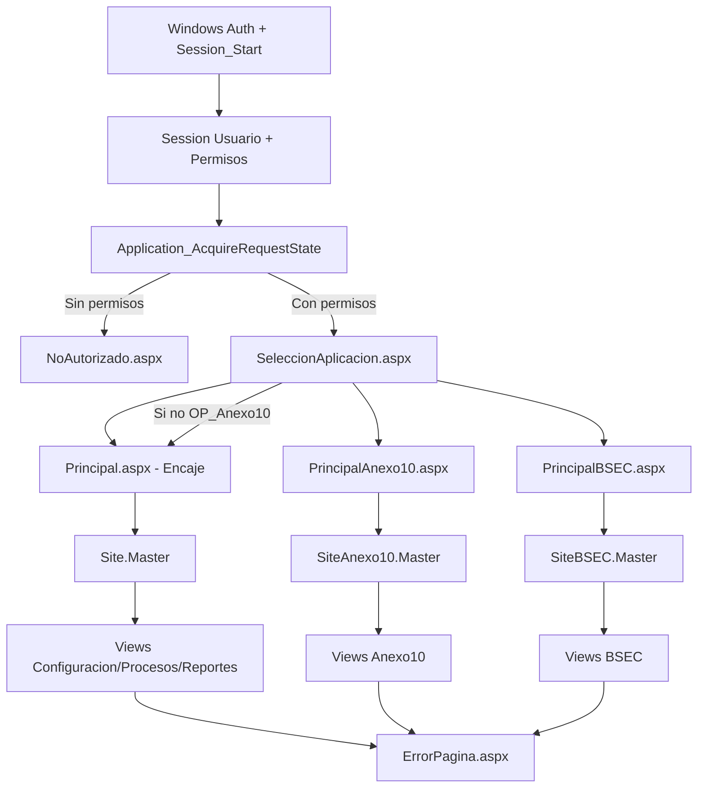

## 29. Inventario funcional de pantallas

### 29.1 Transversal (6)

| Area | Pagina | Nombre funcional observado | Permiso / regla | BL / DA principal | Inputs / acciones clave | Outputs / integraciones | Estado |
| --- | --- | --- | --- | --- | --- | --- | --- |
| Transversal | `SeleccionAplicacion.aspx` | Selector de superficie | Regla global en `Global.asax.cs` | N/A | Botones Encaje/A10/BSEC | Redirect a principales | ALCANZABLE DESDE NAVEGACION |
| Transversal | `PrincipalAnexo10.aspx` | Portal de entrada A10 | Permisos en sesion (sin `OP_*` explicito en pagina) | N/A | Acceso inicial + descarga log | Descarga `Log_Aplicacion_E444.txt` | ALCANZABLE DESDE NAVEGACION |
| Transversal | `PrincipalBSEC.aspx` | Portal de entrada BSEC | Permisos en sesion (sin `OP_*` explicito en pagina) | N/A | Acceso inicial + descarga log | Descarga `Log_Aplicacion_E444.txt` | ALCANZABLE DESDE NAVEGACION |
| Transversal | `ErrorPagina.aspx` | Pagina de error | Redireccion desde `Application_Error` y `customErrors` | N/A | N/A | Mensaje/error tecnico | TECNICA / SOPORTE |
| Transversal | `NoAutorizado.aspx` | Denegacion de acceso | Redirect desde multiples paginas/master/global | N/A | N/A | Mensaje de acceso denegado | TECNICA / SOPORTE |
| Transversal | `SessionExpired.aspx` | Soporte de sesion expirada | Referencias directas puntuales | N/A | N/A | Pantalla de sesion expirada | TECNICA / SOPORTE |

### 29.2 Encaje Bancario - Inicio/Configuracion/Procesos (11)

| Area | Pagina | Nombre funcional observado | Permiso / regla | BL / DA principal | Inputs / acciones clave | Outputs / integraciones | Estado |
| --- | --- | --- | --- | --- | --- | --- | --- |
| Encaje | `Principal.aspx` | Portal Encaje Bancario BCRP | Permisos en sesion | N/A | Acceso inicial + boton de log | Descarga `Log_Aplicacion_E444.txt` | ALCANZABLE DESDE NAVEGACION |
| Encaje | `Views/Configuracion/Ajustes.aspx` | Mantenimiento de ajustes | `OP_Ajustes` | `LAjuste/LColumna/LInput/LParametro` -> `DAAjuste/DAColumna/DAInput/DAParametro` | Listar, insertar, actualizar, eliminar, carga masiva y plantilla | Persistencia de ajustes + descarga Excel (`Ajustes.xlsx`) | ALCANZABLE DESDE NAVEGACION |
| Encaje | `Views/Configuracion/CargaInputs.aspx` | Carga y procesamiento de inputs | `OP_CargaInputs` | `LCarga/LInputs` -> `DACarga/DAInputs` | Upload, validacion, replicar carga, procesar input, control, consultar estado | Cargas a BD, archivos de control, mensajes, procesamiento posterior | ALCANZABLE DESDE NAVEGACION |
| Encaje | `Views/Configuracion/DataCollectors.aspx` | Pantalla tecnica sin logica funcional visible | No observado | N/A | Sin eventos funcionales de negocio en code-behind | N/A | TECNICA / NO ORIENTADA A USUARIO FINAL - VIGENCIA INTERNA POR DETERMINAR |
| Encaje | `Views/Configuracion/Maestros.aspx` | Carga de maestros | `OP_CargaMaestros` | `LCarga/LInputs` -> `DACarga/DAInputs` | Listar maestros, procesar carga, detener proceso, descargar | Persistencia + copia archivos + descarga Excel | ALCANZABLE DESDE NAVEGACION |
| Encaje | `Views/Configuracion/MatrizCuenta.aspx` | Mantenimiento de matriz de cuentas | `OP_Mantenedor_Cuentas` (en pagina) | `LInput/LMatrizCuenta/LRubro` -> `DAInput/DAMatrizCuenta/DARubro` | Listar/crear/actualizar/eliminar matriz, ejecutar kill job | Cambios matriz + control job | ALCANZABLE DESDE NAVEGACION |
| Encaje | `Views/Configuracion/ParametrosFijos.aspx` | Mantenimiento/descarga parametros fijos | `OP_ParametrosFijos` | `LParametro` -> `DAParametro` | Consulta por periodo, ajustes, generar archivo | Descarga Excel (`Parametro_Fijo.xlsx`) | ALCANZABLE DESDE NAVEGACION |
| Encaje | `Views/Configuracion/ParametrosVariables.aspx` | Mantenimiento/carga/replica de parametros variables | `OP_ParametrosVariables` (+ boton `OP_ParametrosVariablesReplicar`) | `LParametro/LPeriodo` -> `DAParametro/DAParametro_Variable/DAPeriodo` | Listar, actualizar, cargar plantilla, carga masiva, replicar periodo | Persistencia de historico + descargas Excel | ALCANZABLE DESDE NAVEGACION |
| Encaje | `Views/Configuracion/Rubros.aspx` | Mantenimiento de rubros | `OP_Mantenedor_Rubros` | `LRubro` -> `DARubro` | Listar, insertar, actualizar, activar/desactivar | Cambios de catalogo rubros | ACTIVO REPORTADO / NO ENLAZADO EN NAVEGACION OBSERVADA |
| Encaje | `Views/Procesos/Procesar.aspx` | Ejecucion del proceso de calculo | `OP_Procesar` | `LCarga/LInputs/LPeriodo` -> `DACarga/DAInputs/DAPeriodo` | Seleccion periodo/tipo, procesar, consultar/cerrar proceso | Ejecucion de proceso + estado de procesamiento | ALCANZABLE DESDE NAVEGACION |
| Encaje | `Views/Procesos/ProcesaReportes.aspx` | Consulta tecnica de cargas para reportes | No observado | `LCarga` -> `DACarga` | WebMethod `ListaCargaInputs` | Respuesta tecnica de consulta | TECNICA / NO ORIENTADA A USUARIO FINAL - VIGENCIA INTERNA POR DETERMINAR |

### 29.3 Encaje Bancario - Reportes (9)

| Area | Pagina | Nombre funcional observado | Permiso / regla | BL / DA principal | Inputs / acciones clave | Outputs / integraciones | Estado |
| --- | --- | --- | --- | --- | --- | --- | --- |
| Encaje | `Views/Reportes/EncajeBancario.aspx` | Reporte Encaje Bancario (MN/ME) | `OP_EncajeBancario` | `LEncaje_Bancario/LTraza` -> `DAEncaje_Bancario/DATraza` | Consultar por fecha, generar reportes | Descarga Excel/hojas y trazabilidad | ALCANZABLE DESDE NAVEGACION |
| Encaje | `Views/Reportes/Reporte1.aspx` | Reporte regulatorio 1 | `OP_Reporte1` | `LReporte1/LPasivosTotales/LTraza` -> `DAReporte1/DAPasivosTotales/DATraza` | Consultar/generar Excel, exportar txt MN/ME, lanzar broad | Excel + txt + disparo SQL Agent | ALCANZABLE DESDE NAVEGACION |
| Encaje | `Views/Reportes/Reporte2.aspx` | Reporte regulatorio 2 | `OP_Reporte2` | `LReporte2` -> `DAReporte2` | Consultar, generar, exportar txt | Excel + txt | ALCANZABLE DESDE NAVEGACION |
| Encaje | `Views/Reportes/Reporte3.aspx` | Reporte regulatorio 3 | `OP_Reporte3` | `LReporte3` -> `DAReporte3` | Consultar, generar, exportar txt | Excel + txt | ALCANZABLE DESDE NAVEGACION |
| Encaje | `Views/Reportes/Reporte4.aspx` | Reporte regulatorio 4 | `OP_Reporte4` | `LReporte4` -> `DAReporte4` | Consultar, generar, exportar txt | Excel + txt | ALCANZABLE DESDE NAVEGACION |
| Encaje | `Views/Reportes/Reporte5.aspx` | Reporte regulatorio 5 | `OP_Reporte5` | `LReporte5` -> `DAReporte5` | Consultar/generar Excel, exportar txt MN/ME, lanzar broad | Excel + txt + disparo SQL Agent | ALCANZABLE DESDE NAVEGACION |
| Encaje | `Views/Reportes/ReporteGerencial.aspx` | Control de reportes regulatorios | `OP_Reporte6` | `LReporte_Gerencial` -> `DAReporte_Gerencial` | Multiples cortes/consultas y generacion de plantillas de control | Descargas Excel de control, ajuste, diario y validacion TOSE | ALCANZABLE DESDE NAVEGACION |
| Encaje | `Views/Reportes/ReporteValidacion.aspx` | Integridad TOSE - Resumen | `OP_Reporte6` | `LReporte_Gerencial` -> `DAReporte_Gerencial` | Consultar resumen por periodo/tipo | Vista resumen + descarga Excel | ALCANZABLE DESDE NAVEGACION |
| Encaje | `Views/Reportes/ReporteValidacionDetalle.aspx` | Integridad TOSE - Detalle | `OP_Reporte6` | `LReporte_Gerencial` -> `DAReporte_Gerencial` | Consultar detalle por rango y tipo | Descarga Excel detalle | ALCANZABLE DESDE NAVEGACION |

### 29.4 Anexo 10 (7)

| Area | Pagina | Nombre funcional observado | Permiso / regla | BL / DA principal | Inputs / acciones clave | Outputs / integraciones | Estado |
| --- | --- | --- | --- | --- | --- | --- | --- |
| Anexo10 | `Views/Anexo10/Inputs.aspx` | Carga integral de inputs A10 | `OP_Anexo10` | `LAnexo10` -> `DAAnexo10` | Registro tipo de cambio, carga de 5 archivos, validaciones y consolidacion | Persistencia resumen + personal + descarga de resumenes Excel | ALCANZABLE DESDE NAVEGACION |
| Anexo10 | `Views/Anexo10/ActaConciliacion.aspx` | Acta de conciliacion | `OP_Anexo10` | `LAnexo10` -> `DAAnexo10` | Buscar por mes y agrupar por bloques de agencias | Grillas resumen + exportacion Excel (`sLima/sProv`) | ALCANZABLE DESDE NAVEGACION |
| Anexo10 | `Views/Anexo10/ReporteFinal.aspx` | Reporte final A10 | `OP_Anexo10` | `LAnexo10` -> `DAAnexo10` | Fecha fin de mes + codigos SBS | Descarga ZIP con archivo `.110` y Excel | ALCANZABLE DESDE NAVEGACION |
| Anexo10 | `Views/Anexo10/Ajustes/AnexoB.aspx` | Ajustes de cierres temporales/definitivos | `OP_Anexo10` | `LAnexo10` -> `DAAnexo10` | Alta/baja de cierres, fechas y agencias origen/destino | Persistencia de cierres + grillas actualizadas | ALCANZABLE DESDE NAVEGACION |
| Anexo10 | `Views/Anexo10/Ajustes/MaestroOficinas.aspx` | Mantenimiento tipo de oficina | `OP_Anexo10` | `LAnexo10` -> `DAAnexo10` | Filtros, historial, cambio de tipo de oficina por mes | Actualizacion historica y vista filtrada | ALCANZABLE DESDE NAVEGACION |
| Anexo10 | `Views/Anexo10/Ajustes/RedondeoSaldos.aspx` | Ajustes de redondeo de saldos | `OP_Anexo10` | `LAnexo10` -> `DAAnexo10` | Registrar/editar/eliminar ajuste por agencia-producto-moneda-mes | Persistencia de ajustes de saldo | ALCANZABLE DESDE NAVEGACION |
| Anexo10 | `Views/Anexo10/Ajustes/SucursalExterior.aspx` | Carga de personal y saldos sucursal exterior | `OP_Anexo10` | `LAnexo10` -> `DAAnexo10` | Captura y guardado de personal/saldos por agencia | Persistencia por mes y recarga de grillas | ALCANZABLE DESDE NAVEGACION |

### 29.5 Balance Sectorial / BSEC (2)

| Area | Pagina | Nombre funcional observado | Permiso / regla | BL / DA principal | Inputs / acciones clave | Outputs / integraciones | Estado |
| --- | --- | --- | --- | --- | --- | --- | --- |
| BSEC | `Views/BSEC/Procesamiento.aspx` | Procesamiento Balance Sectorial | Menu `OP_BSEC` (sin chequeo `OP_*` explicito en Page_Load) | `LBSEC` -> `DABSEC` | Carga de consolidado (hojas `Res_Soles` / `Res_Dolares`), clasificacion, reclasificacion y resumen | Visualizacion, observaciones y descarga de Excel consolidado | ALCANZABLE DESDE NAVEGACION |
| BSEC | `Views/BSEC/Maestro.aspx` | Maestro de clasificacion BSEC | Menu `OP_BSEC` (sin chequeo `OP_*` explicito en Page_Load) | `LBSEC` -> `DABSEC` | Buscar, crear, editar, activar/desactivar clasificaciones | Persistencia de catalogo via SP `BSEC.SP_*` | ALCANZABLE DESDE NAVEGACION |

## 30. Encaje Bancario - superficie funcional

Capacidades visibles relevantes:

- Configuracion operativa:
  - Carga de inputs (`CargaInputs.aspx`) con validacion de archivos, replicas y control.
  - Carga de maestros (`Maestros.aspx`) y procesos asociados.
  - Mantenimientos de parametros, ajustes, matriz y rubros.
- Procesamiento:
  - Ejecucion de proceso de calculo con consulta/cierre de procesos (`Procesar.aspx`).
- Reporteria:
  - Encaje Bancario + Reportes 1..5 + Control Regulatorio + Integridad TOSE.
- Integraciones visibles:
  - Excel (EPPlus/NPOI), archivos txt, SP de procesamiento, control de jobs SQL Agent.

## 31. Anexo 10 - superficie funcional

Capacidades visibles relevantes:

- Carga de inputs multiarchivo con validaciones de estructura y tipo de cambio previo.
- Ajustes funcionales por cierre temporal/definitivo, maestro de oficinas, redondeo y sucursal exterior.
- Reporteria de Acta de Conciliacion y Reporte Final (incluye `.110` + Excel en ZIP).
- Permiso uniforme de navegacion y accion: `OP_Anexo10`.
- Trazabilidad DA/SP: `LAnexo10 -> DAAnexo10 -> SP_A10_*`.

## 32. Balance Sectorial - superficie funcional

Capacidades visibles relevantes:

- Procesamiento de consolidado (MN/ME) con validaciones de hojas/columnas y reglas de clasificacion.
- Maestro de clasificacion para mantenimiento de codigos y estados.
- Trazabilidad DA/SP: `LBSEC -> DABSEC -> BSEC.SP_*`.
- Cambio local proximo a produccion incluido en AS-IS analizado (Q01).

## 33. Funciones transversales

- Identidad/autorizacion de sesion: `Global.asax.cs` + `ActDirectory` + `Session["Permisos"]`.
- Gestion de errores globales: `Application_Error` -> `ErrorPagina.aspx`.
- Gestion de acceso denegado: redirects a `NoAutorizado.aspx` desde pages/master/global.
- Seleccion de superficie funcional: `SeleccionAplicacion.aspx`.
- Descarga de log aplicativo desde portales principales (`Principal*.aspx`).
- Infraestructura comun de frontend y utilitarios (`Site.js`, `Flash`, `Util`, `Helper`).

## 34. Menus y permisos

### 34.1 Matriz - `Site.Master` (Encaje)

| Menu | Opcion | URL destino | OP en Master | Observaciones |
| --- | --- | --- | --- | --- |
| Configuracion | Carga de Inputs | `/Views/Configuracion/CargaInputs.aspx` | `OP_CargaInputs` | Chequeo en Master y Page_Load. |
| Configuracion | Carga de Maestros | `/Views/Configuracion/Maestros.aspx` | `OP_CargaMaestros` | Chequeo en Master y Page_Load. |
| Configuracion | Parametros Fijos | `/Views/Configuracion/ParametrosFijos.aspx` | `OP_ParametrosFijos` | Chequeo en Master y Page_Load. |
| Configuracion | Parametros Variables | `/Views/Configuracion/ParametrosVariables.aspx` | `OP_ParametrosVariables` | Boton de replica adicional: `OP_ParametrosVariablesReplicar`. |
| Configuracion | Ajustes | `/Views/Configuracion/Ajustes.aspx` | `OP_Ajustes` | Chequeo en Master y Page_Load. |
| Configuracion | Matriz de Cuentas | `/Views/Configuracion/MatrizCuenta.aspx` | Opcion deshabilitada en menu activo observado | Comportamiento operativo intencional; acceso directo mantiene validacion `OP_Mantenedor_Cuentas` en pagina. |
| Proceso | Procesar | `/Views/Procesos/Procesar.aspx` | `OP_Procesar` | Chequeo en Master y Page_Load. |
| Reportes / Interno | Encaje Bancario | `/Views/Reportes/EncajeBancario.aspx` | `OP_EncajeBancario` | Alineado con Page_Load. |
| Reportes / Regulatorios | Reporte 1..5 | `/Views/Reportes/Reporte1..5.aspx` | `OP_Reporte1`..`OP_Reporte5` | Alineado con Page_Load. |
| Reportes / Validacion y Control | Control de Reportes Regulatorios | `/Views/Reportes/ReporteGerencial.aspx` | `OP_Reporte6` | Alineado con Page_Load. |
| Reportes / Integridad TOSE | Resumen | `/Views/Reportes/ReporteValidacion.aspx` | `OP_Reporte7` (menu) | La pagina valida `OP_Reporte6`. |
| Reportes / Integridad TOSE | Detalle | `/Views/Reportes/ReporteValidacionDetalle.aspx` | `OP_Reporte8` (menu) | La pagina valida `OP_Reporte6`. |

Observacion de menu comentado:

- Submenu de Rubros en `Site.Master` aparece comentado; segun aclaracion operativa, Rubros continua activo aunque no este enlazado en el menu observado.

### 34.2 Matriz - `SiteAnexo10.Master`

| Menu | Opcion | URL destino | OP |
| --- | --- | --- | --- |
| Configuracion | Carga de Inputs | `/Views/Anexo10/Inputs.aspx` | `OP_Anexo10` |
| Configuracion | Maestro de Oficinas | `/Views/Anexo10/Ajustes/MaestroOficinas.aspx` | `OP_Anexo10` |
| Configuracion | Ajustes | Anexo B | `/Views/Anexo10/Ajustes/AnexoB.aspx` |
| Configuracion | Ajustes | Sucursales del Exterior | `/Views/Anexo10/Ajustes/SucursalExterior.aspx` |
| Configuracion | Ajustes | Redondeo de Saldos | `/Views/Anexo10/Ajustes/RedondeoSaldos.aspx` |
| Reportes | Acta de Conciliacion | `/Views/Anexo10/ActaConciliacion.aspx` | `OP_Anexo10` |
| Reportes | Reporte Final | `/Views/Anexo10/ReporteFinal.aspx` | `OP_Anexo10` |

### 34.3 Matriz - `SiteBSEC.Master`

| Menu | Opcion | URL destino | OP |
| --- | --- | --- | --- |
| Procesos | Procesar | `/Views/BSEC/Procesamiento.aspx` | `OP_BSEC` |
| Procesos | Maestro | `/Views/BSEC/Maestro.aspx` | `OP_BSEC` |

### 34.4 Mapa consolidado `OP_*` observado

| OP | Superficie | Pantalla/accion controlada |
| --- | --- | --- |
| `OP_CargaInputs` | Encaje | Acceso a `CargaInputs.aspx` y menu de configuracion. |
| `OP_CargaMaestros` | Encaje | Acceso a `Maestros.aspx` y menu de configuracion. |
| `OP_ParametrosFijos` | Encaje | Acceso a `ParametrosFijos.aspx`. |
| `OP_ParametrosVariables` | Encaje | Acceso a `ParametrosVariables.aspx`. |
| `OP_ParametrosVariablesReplicar` | Encaje | Visibilidad de boton `btnReplicar` en `ParametrosVariables.aspx`. |
| `OP_Ajustes` | Encaje | Acceso a `Ajustes.aspx`. |
| `OP_Mantenedor_Cuentas` | Encaje | Acceso funcional de `MatrizCuenta.aspx` (validado en Page_Load). |
| `OP_Mantenedor_Rubros` | Encaje | Acceso funcional de `Rubros.aspx` (no enlazada en menu activo). |
| `OP_Procesar` | Encaje | Menu y acceso a `Procesar.aspx`. |
| `OP_EncajeBancario` | Encaje | Menu y acceso a `EncajeBancario.aspx`. |
| `OP_Reporte1..5` | Encaje | Menus y accesos a reportes regulatorios 1..5. |
| `OP_Reporte6` | Encaje | `ReporteGerencial.aspx`, `ReporteValidacion.aspx`, `ReporteValidacionDetalle.aspx` (Page_Load). |
| `OP_Reporte7` / `OP_Reporte8` | Encaje | Visibilidad de menu Integridad TOSE (Resumen/Detalle) en Master. |
| `OP_Anexo10` | Anexo10 | Toda la navegacion y paginas A10. |
| `OP_BSEC` | BSEC | Visibilidad de menu BSEC en Master. |

## 35. Inputs y outputs

| Superficie/flujo | Inputs funcionales principales | Outputs funcionales principales |
| --- | --- | --- |
| Encaje - CargaInputs | Archivos `.xls/.xlsx` por tipo de input, periodo, tipo carga, usuario | Registro de carga en BD, control de errores, estados de procesamiento, archivo de control Excel |
| Encaje - Maestros | Archivos de maestros, periodo, usuario | Persistencia de maestros y descarga de maestro procesado |
| Encaje - Parametros Variables/Fijos | Periodo, archivo plantilla, valores por parametro | Actualizacion de parametros, historico, descargas Excel |
| Encaje - Procesar | Tipo reporte, fecha periodo | Ejecucion de proceso, estado, cierre/consulta de proceso |
| Encaje - Reportes 1..5 | Fechas/periodos, moneda, opciones de exportacion | Descargas Excel/txt, en R1 y R5 disparo de broad (job SQL) |
| Encaje - ReporteGerencial/Validacion | Rango fechas, tipo, moneda | Descargas Excel de control, ajuste, diario e integridad TOSE |
| Anexo10 - Inputs | Mes, tipo de cambio, 5 archivos requeridos | Resumenes en BD, personal/agencias, descarga de resumenes |
| Anexo10 - Ajustes | Mes, agencias, tipo oficina, saldos, personal | Altas/bajas/actualizaciones de cierres y ajustes |
| Anexo10 - Reportes | Fecha (fin de mes), codigos entidad | ZIP con `.110` + Excel y exportaciones de conciliacion |
| BSEC - Procesamiento | Archivo consolidado con hojas `Res_Soles` y `Res_Dolares` | Clasificacion/resumen, observaciones, Excel de resultado |
| BSEC - Maestro | Filtros y datos de clasificacion | CRUD de maestro clasificacion y cambio de estado |

## 36. Procesamiento de archivos

| Componente | Uso funcional | Formatos | Validaciones visibles | Continuacion de flujo |
| --- | --- | --- | --- | --- |
| `Handlers/UpFileHandler.ashx` | Upload/validacion inicial de archivos de carga | `.xls`, `.xlsx` y otros segun input | Nomenclatura esperada, hojas requeridas, extension, integridad minima | Guarda temporal en `ArchivoPath`; retorna estado para continuar proceso de pantalla |
| `Views/Configuracion/CargaInputs.aspx.cs` | Procesamiento de inputs Encaje | Excel/planos por input | Fecha/periodo, estructura por hoja, reglas por nombre de input | `LInputs/LCarga` -> `DAInputs/DACarga` -> SP |
| `Views/Configuracion/Maestros.aspx.cs` | Carga de maestros | Excel | Hoja esperada por maestro, codmes | Insercion/actualizacion + copia/backup de archivo |
| `Views/Configuracion/ParametrosVariables.aspx.cs` | Carga masiva de parametros variables | Excel plantilla | Extension, estructura de hoja y columnas esperadas | Transforma DataTable y persiste historico |
| `Views/Anexo10/Inputs.aspx.cs` | Carga de 5 archivos A10 | Excel (`.xls/.xlsx`) | Conteo exacto de archivos, tipo por nombre, columnas y reglas por archivo | Consolidacion e inserciones por TVP en SP A10 |
| `Views/BSEC/Procesamiento.aspx.cs` | Carga consolidada balance sectorial | Excel (`.xlsx/.xls`) | Hojas obligatorias, columnas obligatorias, moneda, clasificacion | Genera tablas de resultado y archivo final de descarga |
| `Views/Reportes/*` | Generacion de reportes descargables | Excel/txt/zip | Validaciones de fecha/periodo/tipo | Descarga inmediata o trigger de proceso diferido |

Rutas/configuraciones de archivo usadas en codigo:

- Claves de `appSettings`: `ArchivoPath`, `ArchivoMaestros`, `RutaLog`, `RUTACARGA_DIARIO`, `RUTACARGA_MENSUAL`, `RUTACARGA_MAESTRO`, `ruta_carga`.
- Valores concretos: `[REDACTED]`.

## 37. ETL / jobs / procesamiento diferido visible desde codigo

| Flujo | Evidencia visible en codigo | Resultado inmediato en request | Resultado posterior |
| --- | --- | --- | --- |
| Carga inputs Encaje -> procesamiento | `CargaInputs.aspx.cs` llama `LCarga.ProcesarInput` y `LInputs.ProcesarCarga*`; DA usa `EB_PROCESAR_INPUT` y SP de carga | Respuesta de inicio/control + estados | Procesamiento posterior en BD/infra (detalle interno: NO DETERMINADO) |
| Consulta de estado de cargas | `CargaInputs.aspx.cs` -> `LCarga.ValidarEstadoInput()` | Retorna estado de ejecucion | Permite monitoreo de proceso asinc/diferido |
| Proceso de maestros | `Maestros.aspx.cs` -> `LCarga.ProcesarMaestro()`, `LCarga.ProcesarDetener()` | Inicia/detiene proceso | Continuacion posterior de procesamiento (NO DETERMINADO) |
| Proceso principal Encaje | `Procesar.aspx.cs` -> `LCarga.Procesar()`, `ConsultarProceso()`, `CerrarProceso()` y `DACarga.cs` ejecuta `EB_CALCULAR_ENCAJE` | Inicio y control por id de proceso | Calculo posterior en backend; contrato E2E con monitor/job externo no visible en codigo web/bl/da analizado |
| Reporte 1 broad | `Reporte1.aspx.cs` -> `LReporte1.generaBroad()` -> `DAReporte1` con `USE msdb; EXEC sp_start_job ...` | Trigger de job | Job SQL Agent `E444_BROAD_RPT1_*` |
| Reporte 5 broad | `Reporte5.aspx.cs` -> `LReporte5.generaBroad()` -> `DAReporte5` con `USE msdb; EXEC sp_start_job ...` | Trigger de job | Job SQL Agent `E444_BROAD_RPT5_*` |
| Control de jobs | `MatrizCuenta.aspx.cs` -> `LMatrizCuenta.EjecutarKillJob()` -> `EB_KILL_JOB_COLLECTOR` | Comando de control | Impacto en ejecuciones SQL Agent |

Caracterizacion ETL (segun alcance):

- HECHO VERIFICADO: existen flujos que disparan SP/procesos y luego consultan estado, ademas de invocaciones explicitas a jobs SQL Agent.
- HECHO VERIFICADO: `DACarga.Procesar()` referencia directamente el SP `EB_CALCULAR_ENCAJE`.
- DOCUMENTADO PERO NO VERIFICADO: asociacion operativa entre `EB_CALCULAR_ENCAJE` y `JOB_E444_SSIS_CalculaEncaje_Monitor`.
- HECHO VERIFICADO: no se encontro referencia directa al nombre `JOB_E444_SSIS_CalculaEncaje_Monitor` en codigo `E444.WEB`/`E444.BL`/`E444.DA` analizado.
- NO DETERMINADO: contrato operativo E2E (parametros/datos, estados, errores, polling, criterio de finalizacion) entre SP y job monitor.

## 38. Dependencias funcionales cruzadas preliminares

| Consumidor | Dependencia | Evidencia | Tipo | Impacto potencial |
| --- | --- | --- | --- | --- |
| Encaje, A10 y BSEC | Sesion/permisos compartidos (`Session["Permisos"]`) | `Global.asax.cs`, `ActDirectory`, `Site*.Master.cs` | HECHO VERIFICADO | relevante para estudiar boundary posterior |
| Encaje, A10 y BSEC | Misma app web y ciclo de vida global | `E444.WEB` unico proyecto + 3 master pages | HECHO VERIFICADO | relevante para estudiar boundary posterior |
| A10 y BSEC | Mismo mecanismo DA base (`Helper` con `cnn_Encaje`) | `E444.Helper/Helper.cs`, `DAAnexo10.cs`, `DABSEC.cs` | HECHO VERIFICADO | relevante para estudiar boundary posterior |
| Encaje cargas especificas | Conexion alternativa `cnn_EncajeAE` | `Web.config`, `DAInputs.cs` | HECHO VERIFICADO | relevante para estudiar boundary posterior |
| Reporteria Encaje | Dependencia SQL Agent jobs | `DAReporte1.cs`, `DAReporte5.cs`, `DAMatrizCuenta.cs` | HECHO VERIFICADO | relevante para estudiar boundary posterior |
| Todas las superficies | Utilitarios y logging comunes | `Util`, `Flash`, `LogUtil`, `Principal*.aspx.cs` | HECHO VERIFICADO | relevante para estudiar boundary posterior |
| A10 y Encaje | Dependencia compartida de infraestructura de archivos | `appSettings` de rutas + pantallas de carga/exportacion | HECHO VERIFICADO | relevante para estudiar boundary posterior |
| Seguridad legacy | Artefactos AzMan/WCF coexisten con AD activo | `UtilAzman.cs` comentado + `Service References/*` + `ActDirectory` | HECHO VERIFICADO + DOCUMENTADO PERO NO VERIFICADO | relevante para estudiar boundary posterior |

## 39. Paginas y codigo potencialmente residual

| Elemento | Señal observada | Clasificacion | Evidencia |
| --- | --- | --- | --- |
| `Views/Configuracion/DataCollectors.aspx` | Sin logica funcional de negocio visible en code-behind; reportada como no orientada a usuario final | TECNICA / NO ORIENTADA A USUARIO FINAL - VIGENCIA INTERNA POR DETERMINAR | `DataCollectors.aspx.cs` + aclaracion operativa |
| `Views/Procesos/ProcesaReportes.aspx` | WebMethod de consulta tecnica sin enlace de menu observado; reportada como no orientada a usuario final | TECNICA / NO ORIENTADA A USUARIO FINAL - VIGENCIA INTERNA POR DETERMINAR | `ProcesaReportes.aspx.cs`, `Site.Master`, aclaracion operativa |
| `Views/Configuracion/Rubros.aspx` | Pagina activa con permiso, no enlazada en menu activo (submenu comentado), y uso funcional reportado | ACTIVO REPORTADO / NO ENLAZADO EN NAVEGACION OBSERVADA | `Site.Master` comentado + `Rubros.aspx.cs` + aclaracion operativa |
| Flujo AzMan | Bloques `UtilAzman` comentados en paginas/master | Candidato legacy residual | `Site.Master.cs`, multiples `*.aspx.cs` |
| `Web_CERT.config` / `Web_PROD.config` | Declarados como deprecados por operacion, presentes en repo | Candidato legacy de configuracion | Archivos `E444.WEB/Web_*.config` + aclaracion operativa |
| `ConnectionStrings["BD"]` en ParametrosVariables | Referencia sin cadena definida en `Web.config` | Codigo residual/deuda tecnica | `ParametrosVariables.aspx.cs`, `Web.config` |
| `PFX/` | Artefactos operativos versionados | Deuda de higiene del repositorio | Carpeta `PFX/` |
| `flgAzman = S` en config | Flag de mecanismo declarado deprecado | Posible incoherencia residual | `Web.config` + aclaracion operativa |

## 40. Contradicciones adicionales

| Item | AS-IS verificado | Reclasificacion vigente | Tipo de evidencia | Estado |
| --- | --- | --- | --- | --- |
| Q2A-01 | `SeleccionAplicacion.aspx` expone 3 superficies, pero `Global.asax.cs` condiciona entrada por `OP_Anexo10`. | GAP FUNCIONAL CONOCIDO / PENDIENTE DE CORRECCION | HECHO VERIFICADO + DOCUMENTADO PERO NO VERIFICADO (comportamiento esperado) | NO se mantiene como pregunta abierta. |
| Q2A-03 | Menu TOSE usa `OP_Reporte7`/`OP_Reporte8`; paginas validan `OP_Reporte6`. | DEFECTO CONOCIDO / PENDIENTE DE CORRECCION | HECHO VERIFICADO + DOCUMENTADO PERO NO VERIFICADO | NO se mantiene como pregunta abierta. |
| MatrizCuenta | Opcion no visible en menu activo; pagina mantiene validacion `OP_Mantenedor_Cuentas`. | COMPORTAMIENTO OPERATIVO INTENCIONAL / OPCION DESHABILITADA EN MENU | HECHO VERIFICADO + DOCUMENTADO PERO NO VERIFICADO | NO se clasifica como gap de seguridad con evidencia actual. |
| Q2A-02 | `SiteBSEC.Master` controla menu con `OP_BSEC`; paginas BSEC no hacen chequeo page-level equivalente. | GAP DE AUTORIZACION CONOCIDO / PENDIENTE | HECHO VERIFICADO + DOCUMENTADO PERO NO VERIFICADO | NO se mantiene como pregunta abierta. |
| AzMan | Coexisten artefactos `UtilAzman`, WCF references y `flgAzman`; flujo activo visible es AD+BD+Sesion+`OP_*`. | DEUDA LEGACY / ARTEFACTO RESIDUAL | HECHO VERIFICADO + DOCUMENTADO PERO NO VERIFICADO | NO bloquea la caracterizacion AS-IS. |

## 41. Preguntas abiertas despues de Pasada 2A

| ID | Pregunta | Prioridad | Por que importa | Evidencia faltante |
| --- | --- | --- | --- | --- |
| Q2A-04 | Cual es el contrato operativo entre `EB_CALCULAR_ENCAJE` y `JOB_E444_SSIS_CalculaEncaje_Monitor` (parametros/datos, estados, errores, polling y criterio de finalizacion)? | ALTA | Define la trazabilidad E2E del procesamiento diferido de calculo de Encaje | Profundizado en PASADA 2B (secciones 44-68). El vinculo explicito con `JOB_E444_SSIS_CalculaEncaje_Monitor` sigue `NO DETERMINADO` con evidencia de codigo Web/BL/DA. |
| Q2A-06 | Como se calcula el conjunto efectivo de operaciones cuando un usuario pertenece a multiples roles (union, precedencia u otra regla)? | ALTA | Necesario para mapa actor-permiso consistente en escenarios multirol | Regla formal de combinacion de roles/operaciones |
| Q2A-08 | Cuales son los consumidores tecnicos reales de `DataCollectors` y `ProcesaReportes` (internos/no UI) y su vigencia operativa? | MEDIA | Evita clasificacion incorrecta de componentes tecnicos como residuales o activos de usuario final | Trazabilidad tecnica/operativa adicional fuera del codigo visible |
| Q2A-09 | Cual es el ownership definitivo de datos por dominio (Encaje/A10/BSEC) sobre la base fisica compartida? | MEDIA | Clave para analisis posterior de boundaries y evolucion | Analisis de BD por dominio en fase posterior |

## 42. Conclusiones Pasada 2A

PASADA 2A: COMPLETA.

1. AS-IS VERIFICADO:

- Se completo el mapa funcional navegable (entrada -> menu -> pantallas -> acciones) para Encaje, Anexo 10, BSEC y funciones transversales.
- Se documento trazabilidad `pantalla -> BL -> DA -> SP/integracion` al nivel de referencia definido para esta pasada.
- Se consolidaron flujos de archivos/Excel y procesamiento diferido visible desde codigo.

2. GAPS / DEUDA CONOCIDOS (NO abiertos como pregunta):

  - Selector condicionado por `OP_Anexo10` frente a escenario multi-superficie (gap funcional conocido).
  - Desalineacion de permisos TOSE (`OP_Reporte7/8` vs `OP_Reporte6`) como defecto conocido.
  - Falta de chequeo page-level `OP_BSEC` en paginas BSEC como gap conocido.
  - AzMan/WCF como artefacto legacy residual.
  - Opcion de `MatrizCuenta` deshabilitada en menu como comportamiento operativo intencional.

3. PREGUNTAS PARA ANALISIS POSTERIOR:

  - Contrato E2E entre `EB_CALCULAR_ENCAJE` y `JOB_E444_SSIS_CalculaEncaje_Monitor` (profundizado en PASADA 2B, con frontera `NO DETERMINADO` para la parte SSIS/job monitor)
  - Semantica efectiva de permisos en usuarios multirol.
  - Consumidores tecnicos reales de `DataCollectors` y `ProcesaReportes`.
  - Ownership de datos por dominio sobre base fisica compartida.

## 43. Criterio de completitud

| Pregunta de control Pasada 2A | Resultado |
| --- | --- |
| Cuales son las capacidades visibles del sistema? | RESPONDIDO (mapa funcional global y por superficie). |
| Como se divide la experiencia entre Encaje/A10/BSEC? | RESPONDIDO (arbol jerarquico y conteos). |
| Como entra el usuario a cada superficie? | RESPONDIDO (navegacion global + diagrama Mermaid). |
| Que paginas forman parte de cada superficie? | RESPONDIDO (inventario completo de 35 pantallas). |
| Que hace cada pagina relevante? | RESPONDIDO (proposito/acciones por pantalla). |
| Que inputs consume? | RESPONDIDO (matriz de inputs funcionales). |
| Que outputs produce? | RESPONDIDO (descargas/procesos/actualizaciones). |
| Que permisos controlan navegacion/acciones? | RESPONDIDO (mapa `OP_*` y matrices por master). |
| Que BL/DA se activan por flujo? | RESPONDIDO (trazabilidad preliminar por pantalla). |
| Que SP/integraciones aparecen? | RESPONDIDO (referencias SP, jobs, archivos, Excel). |
| Donde aparecen Excel/files/jobs/ETL? | RESPONDIDO (secciones 36 y 37). |
| Que funcionalidades son transversales? | RESPONDIDO (seccion 33 + inventario transversal). |
| Que paginas parecen residuales/no enlazadas? | RESPONDIDO (seccion 39 + clasificacion de estado). |
| Que dependencias cruzadas podrian afectar boundaries? | RESPONDIDO (seccion 38, sin decisiones de boundary). |
| Que incertidumbres siguen bloqueando analisis posterior? | RESPONDIDO (preguntas abiertas seccion 41). |

Pendientes explicitamente marcados como `NO DETERMINADO` cuando exceden evidencia disponible:

- Contrato interno completo de ETL posterior a SP (profundizado en PASADA 2B secciones 44-68).
- Mapeo final actor de negocio -> rol AD -> `OP_*`.
- Ownership definitivo de datos por dominio en misma base fisica.

# PASADA 2B - ENCAJE BANCARIO PROFUNDO

## 44. Objetivo operativo de Pasada 2B

Pregunta rectora de esta pasada:

- Como funciona realmente Encaje Bancario de extremo a extremo (runtime), desde que un usuario dispara una accion hasta que el sistema cierra/monitorea procesos y habilita reportes.

Alcance efectivo:

- Se profundizo sobre la superficie Encaje (`Procesar`, `CargaInputs`, `Maestros`, `Reportes`) con trazabilidad `JS -> WebMethod -> BL -> DA -> SP/SQL Agent`.
- Se documento orquestacion de estados, polling, cierre y detencion.
- Se mantuvo criterio estricto de evidencia: solo codigo versionado del repositorio.

## 45. Fuentes y limites de evidencia en 2B

Fuentes primarias revisadas:

- `E444.WEB/js/Procesar.js`, `E444.WEB/js/CargaInputs.js`, `E444.WEB/js/Maestros.js`.
- `E444.WEB/Views/Procesos/Procesar.aspx(.cs)`.
- `E444.WEB/Views/Configuracion/CargaInputs.aspx(.cs)` y `E444.WEB/Handlers/UpFileHandler.ashx.cs`.
- `E444.WEB/Views/Configuracion/Maestros.aspx(.cs)`.
- `E444.BL/LCarga.cs`, `E444.DA/DACarga.cs`, `E444.BL/LInputs.cs`, `E444.DA/DAInputs.cs`.
- `E444.WEB/Views/Reportes/Reporte1.aspx(.cs)`, `Reporte5.aspx(.cs)`, `EncajeBancario.aspx.cs`, `Reporte2.aspx.cs`, `Reporte3.aspx.cs`, `Reporte4.aspx.cs`.
- `E444.DA/DAReporte1.cs`, `E444.DA/DAReporte5.cs`, `E444.DA/DAEncaje_Bancario.cs`, `E444.DA/DAReporte_Gerencial.cs`.
- `E444.WEB/General/Util.cs`, `E444.BL/LogUtilBL.cs`, `E444.DA/LogUtilDA.cs`.

Limites:

- No se ejecuto runtime ni trazas de BD en vivo.
- No se inspecciono definicion interna de SP ni paquetes SSIS.
- La semantica exacta de ciertos estados retornados por SP queda clasificada donde corresponde como `NO DETERMINADO`.

## 46. Macroflujo E2E Encaje observado

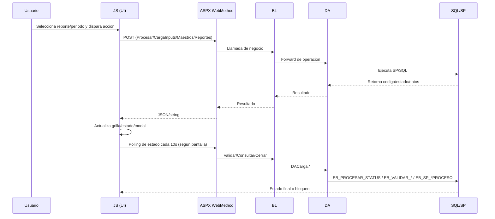

## 47. Quien orquesta que en runtime

| Capa | Responsabilidad observable | Evidencia principal |
| --- | --- | --- |
| JS (pantalla) | Valida inputs de UI, dispara endpoints, hace polling, traduce codigos a mensajes visuales | `Procesar.js`, `CargaInputs.js`, `Maestros.js` |
| WebMethod (`.aspx.cs`) | Normaliza parametros, aplica reglas de fecha/permiso, decide flujo y llama BL | `Procesar.aspx.cs`, `CargaInputs.aspx.cs`, `Maestros.aspx.cs` |
| BL | Capa de paso/canalizacion hacia DA (sin logica pesada en estos flujos) | `LCarga.cs`, `LInputs.cs` |
| DA | Contrato real con BD: SP, timeouts, TVP, SQL Agent jobs, bulk inserts | `DACarga.cs`, `DAInputs.cs`, `DAReporte1.cs`, `DAReporte5.cs` |
| SP/BD | Decide estados finales de proceso, concurrencia, cierre y calculo numerico | Invocaciones `EB_*`, `sp_start_job` desde DA |

## 48. Flujo detallado: pantalla Procesar (calculo principal)

Secuencia observable:

1. UI valida filtros (`cboReporte`, `cboTipoCarga`, fecha/mes) y formato via `Procesar.aspx/ValidarPeriodo`.
2. JS valida fecha no futura y ejecuta `Procesar.aspx/ProcesarReg`.
3. `ProcesarReg` aplica regla especial cuando `TipoReporte == "1"`: antes del dia 28, si cae sabado/domingo retorna `"100"`; en otro caso invoca `LCarga.Procesar`.
4. `LCarga.Procesar` llama `DACarga.Procesar`.
5. `DACarga.Procesar` ejecuta `EB_CALCULAR_ENCAJE` con timeout 9000 segundos.
6. JS interpreta respuesta (`"1"` inicio correcto, `"100"` fecha no permitida, otros: proceso en ejecucion).
7. Si inicia, activa flag hidden `Acivar=1` y entra al ciclo de monitoreo.

## 49. Monitoreo y cierre en Procesar

Mecanismo de polling:

- `LoadProgress()` corre cada 10 segundos.
- Si `Acivar == 1`, consulta `Procesar.aspx/ListaProcesarStatus`.
- Si `Acivar != 1`, consulta `Procesar.aspx/ConsultarProceso`.

Contrato visual en `ListaProcesarStatus`:

- Filas `ID=0/1/2`: pintan los tres medidores (`Input`, `Proceso`, `Reporte`) con imagen `<Valor><Estado>.png`.
- Filas con `ID != 0,1,2`: se interpretan como evento de fin/error operacional.

Cierre:

- Cuando llega fin de proceso, JS asigna `idproceso` y llama `Procesar.aspx/CerrarProceso`.
- `CerrarProceso` usa `EB_SP_CERRARPROCESO` y retorna `bool`.

## 50. Contrato de control de proceso (`Consultar`/`Cerrar`) en Procesar

`ConsultarProceso`:

- WebMethod retorna `false` inmediatamente si `idproceso == "0"`.
- Si no es 0, delega a `EB_SP_CONSULTARPROCESO` (retorno `RESULTADO == 1` => `true`).

`CerrarProceso`:

- Llama `EB_SP_CERRARPROCESO` con `@ID`.
- Se usa como paso explicito de liberacion/cierre desde JS luego de detectar fin.

Implicancia runtime:

- El ciclo de polling depende de un `idproceso` no nulo para consultar estado global real de un proceso ya existente.

## 51. Flujo detallado: CargaInputs (subida y registro de input)

Subflujo UI:

1. `Listar` carga grilla de inputs por reporte/tipo/periodo.
2. Click en icono `Cargar` abre modal y selecciona `_FilaSeleccion`.
3. `AjaxUpload` envia archivo a `UpFileHandler.ashx` con `CodInput`, `Hojas`, `NomArchivo`, `FlagDia`.
4. Respuesta esperada: `S|N~mensaje~extension~rutaOriginal~rutaRelativa~nombre`.
5. Si respuesta es `S`, habilita boton `Cargar` del modal y setea `NOMARCHIVOCARGADO`.
6. Al confirmar, llama `CargaInputs.aspx/ProcesarCarga` (retorna `EResultadoProcesarCargaInput`).

## 52. Validacion tecnica de archivos en `UpFileHandler`

Reglas observables:

- Nomenclatura exacta (`httpFile.FileName == NomArchivo`).
- Para `.xls`: valida hojas con NPOI.
- Para `.xlsx`: valida presencia de hoja con EPPlus.
- Excepcion codificada: para `A3PEN` y `A3USD` se marca `S` aun si no se encuentra la hoja exacta en esa verificacion inicial.
- Si resultado final es `N`, elimina temporal cargado.

Salida del handler:

- Se serializa por `~` y la UI depende de esa posicion de campos para continuar.

## 53. Validaciones de negocio en `ProcesarCarga` (legacy + nuevos casos)

`CargaInputs.aspx.cs/ProcesarCarga` centraliza validaciones por `NOMARCHIVO`:
- Casos legacy (`TCC`, `SIGA`, `SCE`, `GI03089SC`, `GI03585R`) retornan codigos historicos (2..9,100) por desalineaciones de fecha/estructura.
- `CREDITO_REACTIVA` y `CREDITOS_ME/MN` leen XLSX, validan periodo y luego persisten en tabla objetivo.
- Si `valreturn != 1`, corta flujo y retorna ese codigo.

Persistencia nominal cuando valida:

- Si no es cobertura, invoca `LInputs.ProcesarCarga` (registro de input).
- Si es cobertura, usa flujo especializado con TVP (seccion 54).

## 54. Subflujo COBERTURA (`A3USD`, `DETALLEBONOS`)

`CoberturaInputExcelReader` agrega reglas fuertes:

- Cabeceras obligatorias por tipo de archivo.
- Columna obligatoria `COBERTURA`.
- `PERIODO` de fila debe coincidir con periodo seleccionado.
- `COBERTURA` solo admite `SI`/`NO`.
- Deteccion de duplicados por llave funcional:
- `A3USD`: `OPERACIONORIGEN + ENTIDADES`.
- `DETALLEBONOS`: `NEMONICO + TIPO + TOTAL + MONEDA`.

Codigos de error de cobertura observados:

- `10`: valor de cobertura invalido.
- `11`: periodo de fila invalido/no coincide.
- `12`: campos identificadores incompletos.
- `13`: duplicado funcional.
- `15`: estructura/cabeceras invalidas.
- `16`: columna `COBERTURA` faltante.
- `17`: `COBERTURA` vacia.

## 55. Persistencia cobertura, copias y rollback

Cuando la validacion llega a estado exitoso (`valreturn == 1`):

1. Se ejecuta `CopiarConRespaldo(origen, rutas, nombreArchivo)`.
2. Se intenta registrar en BD:

- `A3USD`: `LInputs.ProcesarCargaA3USD` -> `DAInputs.ProcesarCargaA3USD`.
- `DETALLEBONOS`: `LInputs.ProcesarCargaDetalleBonos` -> `DAInputs.ProcesarCargaDetalleBonos`.

3. En DA se ejecuta transaccion SQL que incluye:

- `EB_CARGA_INPUT_Insertar`.
- SP de cobertura (`EB_SP_COBERTURA_A3USD_REGISTRAR` o `EB_SP_COBERTURA_BONO_REGISTRAR`) con TVP.

4. Si todo sale bien: `ConfirmarCopias` elimina respaldos `.bak_cobertura_*`.
5. Si falla: `RevertirCopias` restaura destinos previos y elimina copias nuevas.

Observacion:

- La UI contempla mensaje para codigo `14`, pero en el flujo actual ese codigo no se emite explicitamente desde backend; fallas de persistencia generalizan en `100` por catch superior.

## 56. Flujo `ProcesarCargaInput` (batch) y estado de carga

Separado del alta de un archivo individual:

- `CargaInputs.aspx/ProcesarCargaInput` invoca `LCarga.ProcesarInput`.
- `DACarga.ProcesarInput` ejecuta `EB_PROCESAR_INPUT` (timeout 360 seg).

Monitoreo batch de input:

- JS (`LoadProgress`) llama `CargaInputs.aspx/ValidarEstado` cada 10s cuando `Activar=1`.
- `ValidarEstado` usa `EB_VALIDAR_ESTADO_INPUT`.
- Convencion observable en UI:
- `ID == 1`: proceso concluido, limpia flag y llama cierre.
- `ID == 2`: timeout/error de espera, muestra alerta y llama cierre.

## 57. Flujo Maestros: carga, proceso y detencion

Subflujo de carga de archivo maestro:

- `Maestros.aspx/ProcesarCarga` lee Excel segun tipo, registra cabecera de carga y persiste en tablas maestras.
- Operaciones por tabla:
- `EB_M_BANCO` y `EB_M_MONEDA` por `cnn_Encaje`.
- `EB_M_GRANDESACREEDEDORES` y `EB_M_RESIDENTESYNORES` por `cnn_EncajeAE`.

- Se aplica patron delete por periodo + `SqlBulkCopy` dentro de transaccion.

Subflujo de proceso maestro:

- Boton `Procesar` (UI) llama `Maestros.aspx/ProcesarMaestro`.
- Backend deriva a `EB_SP_PROCESA_MAESTRO`.

Detencion:

- Boton `Detener` llama `Maestros.aspx/Detener` -> `EB_SP_DETENERPROCESO`.

Estado/polling:

- Existe `ValidarEstado` (`EB_VALIDAR_ESTADO`), pero en JS `LoadProgress()` esta comentado; por defecto no se activa ciclo automatico de polling en esta pantalla.

## 58. Diferencias de orquestacion entre `Procesar`, `CargaInputs` y `Maestros`

| Aspecto | `Procesar` | `CargaInputs` | `Maestros` |
| --- | --- | --- | --- |
| Disparo principal | `EB_CALCULAR_ENCAJE` | `EB_PROCESAR_INPUT` (batch) + registro por input | `EB_SP_PROCESA_MAESTRO` |
| Polling activo por defecto | Si (`LoadProgress`) | Solo cuando `Activar=1` tras batch | No (comentado) |
| Estado consultado | `EB_PROCESAR_STATUS` y `EB_SP_CONSULTARPROCESO` | `EB_VALIDAR_ESTADO_INPUT` y `EB_SP_CONSULTARPROCESO` | `EB_VALIDAR_ESTADO` (si se activara polling) |
| Cierre explicito | `EB_SP_CERRARPROCESO` | `EB_SP_CERRARPROCESO` (via `../Procesos/Procesar.aspx`) | `EB_SP_CERRARPROCESO` (via `../Procesos/Procesar.aspx`) |
| Detencion manual | No expuesto en UI | No expuesto en UI | Si (`EB_SP_DETENERPROCESO`) |

## 59. Punto de concentracion del control de proceso

Aunque hay multiples pantallas, la gobernanza de cierre/consulta converge en endpoints de `Procesar.aspx`:

- `ConsultarProceso`.
- `CerrarProceso`.

Esto convierte a `Procesar.aspx` en hub de control de ciclo de vida del proceso para modulos que no son estrictamente `Procesar` (por ejemplo `CargaInputs` y `Maestros`).

## 60. Reportes 1 y 5: disparo de broad y SQL Agent

Flujo observable:

1. Usuario genera TXT MN/ME.
2. Si checkbox `Generar Broad` esta activo, se llama `generabroad(...)`.
3. DA ejecuta:

- `E444_ACTUALIZA_PARAMETRO_FECHA`.
- `USE msdb; EXEC sp_start_job ...`.

Jobs disparados:

- Reporte 1: `E444_BROAD_RPT1_MN`, `E444_BROAD_RPT1_ME`.
- Reporte 5: `E444_BROAD_RPT5_MN`, `E444_BROAD_RPT5_ME`.

Observacion:

- El flujo web solo dispara job; no implementa polling de exito/fallo del SQL Agent en la misma pantalla.

## 61. Reportes 2, 3 y 4: acoplamientos relevantes

Hallazgos runtime:

- `Reporte2.aspx.cs` depende de `Session["dtCabecera_*"]`, `Session["dtSwitfOpe_*"]`, `Session["dtReporteInf_*"]` para construir salida Excel.
- `Reporte3.js` y `Reporte4.js` consumen endpoints de `Reporte1.aspx` (`ValidarPeriodo`, `ListarMN`, `ListarME`) para poblar grillas de UI.
- La generacion oficial de archivos de R3/R4 se hace en sus propios code-behind (`Reporte3.aspx.cs`, `Reporte4.aspx.cs`).

Implicancia:

- Existe acoplamiento funcional entre pantallas de reportes, especialmente a nivel de consumo AJAX de datos de R1 para UI en R3/R4.

## 62. EncajeBancario: consulta, recalculo y versionado

`EncajeBancario.aspx.cs` expone WebMethods para:

- Recalculo diario MN: `CalcularDiarioMN` -> `EB_SP_RECALCULARDIARIO`.
- Recalculo EA/ME: `CalcularEA` -> `EB_SP_RECALCULARDIARIO_ME`.
- Consulta de cabeceras/superior/inferior MN/ME por fecha.

Generacion de archivo:

- Versionado por `Count_Reporte_Version` / `Insertar_Reporte_Version` (reporte codigo 1).
- Plantilla `Encaje.xlsx` con dos hojas (MN/ME) y carga de data por SP de cabecera/superior/inferior.

## 63. Controles transversales de datos procesados

Validacion previa de reportes:

- `Util.Validar_Reportes(codmes, reporte)` -> `LogUtilBL` -> `LogUtilDA` -> `EB_VALIDA_REPORTE`.
- Se usa para impedir generacion cuando no hay datos procesados del periodo.

Detalle de Pasivos Totales ME:

- `LPasivosTotales` consume `DAPasivosTotales.ConsultarDetallePasivosTotalesME`.
- SP: `EB_SP_EXPORTAR_DETALLE_PASIVOS_TOTALES_ME` con 3 result sets:

1. Estado de calculo/exportabilidad.
2. Detalle diario.
3. Detalle de coberturas.

- BL valida consistencia (dias esperados, duplicados, subtotales) antes de exportar.

## 64. Matriz endpoint -> BL -> DA -> SP/SQL

| Endpoint Web | BL | DA | SP / SQL ejecutado |
| --- | --- | --- | --- |
| `Procesar.aspx/ProcesarReg` | `LCarga.Procesar` | `DACarga.Procesar` | `EB_CALCULAR_ENCAJE` |
| `Procesar.aspx/ListaProcesarStatus` | `LCarga.ListaProcesarStatus` | `DACarga.ListaProcesarStatus` | `EB_PROCESAR_STATUS` |
| `Procesar.aspx/ConsultarProceso` | `LCarga.ConsultarProceso` | `DACarga.ConsultarProceso` | `EB_SP_CONSULTARPROCESO` |
| `Procesar.aspx/CerrarProceso` | `LCarga.CerrarProceso` | `DACarga.CerrarProceso` | `EB_SP_CERRARPROCESO` |
| `CargaInputs.aspx/ProcesarCargaInput` | `LCarga.ProcesarInput` | `DACarga.ProcesarInput` | `EB_PROCESAR_INPUT` |
| `CargaInputs.aspx/ValidarEstado` | `LCarga.ValidarEstadoInput` | `DACarga.ValidarEstadoInput` | `EB_VALIDAR_ESTADO_INPUT` |
| `CargaInputs.aspx/ProcesarCarga` (cobertura A3USD) | `LInputs.ProcesarCargaA3USD` | `DAInputs.ProcesarCargaA3USD` | `EB_CARGA_INPUT_Insertar` + `EB_SP_COBERTURA_A3USD_REGISTRAR` |
| `CargaInputs.aspx/ProcesarCarga` (cobertura bonos) | `LInputs.ProcesarCargaDetalleBonos` | `DAInputs.ProcesarCargaDetalleBonos` | `EB_CARGA_INPUT_Insertar` + `EB_SP_COBERTURA_BONO_REGISTRAR` |
| `Maestros.aspx/ProcesarMaestro` | `LCarga.ProcesarMaestro` | `DACarga.ProcesarMaestro` | `EB_SP_PROCESA_MAESTRO` |
| `Maestros.aspx/Detener` | `LCarga.ProcesarDetener` | `DACarga.ProcesarDetener` | `EB_SP_DETENERPROCESO` |
| `Maestros.aspx/ValidarEstado` | `LCarga.ValidarEstado` | `DACarga.ValidarEstado` | `EB_VALIDAR_ESTADO` |
| `Reporte1.aspx` broad | `LReporte1.generaBroad` | `DAReporte1.generaBroad` | `E444_ACTUALIZA_PARAMETRO_FECHA` + `sp_start_job` |
| `Reporte5.aspx` broad | `LReporte5.generaBroad` | `DAReporte5.generaBroad` | `E444_ACTUALIZA_PARAMETRO_FECHA` + `sp_start_job` |
| `MatrizCuenta.aspx/EjecutarKillJob` | `LMatrizCuenta.EjecutarKillJob` | `DAMatrizCuenta.EjecutarKillJob` | `EB_KILL_JOB_COLLECTOR` |
| `Util.Validar_Reportes` | `LogUtilBL.Validar_Reportes` | `LogUtilDA.Validar_Reportes` | `EB_VALIDA_REPORTE` |

## 65. Matriz de estados y transiciones observables

| Contexto | Señal/estado en UI | Fuente tecnica | Efecto observable |
| --- | --- | --- | --- |
| Carga de input individual | `NO CARGADO` / `PENDIENTE` / otros textos de estado | `EB_CARGA_INPUT_Listar` via `DAInputs.Listar` | Habilita/bloquea acciones y mensajes de carga |
| Proceso principal | Medidores `RepProg01/02/03` | `EB_PROCESAR_STATUS` (`ID`, `Valor`, `Estado`) | Avance visual por etapa Input/Proceso/Reporte |
| Batch de inputs | `ID=1` (fin), `ID=2` (timeout) | `EB_VALIDAR_ESTADO_INPUT` | Muestra alerta final y ejecuta cierre |
| Maestros | `ID=1` (fin), `ID=2` (timeout) | `EB_VALIDAR_ESTADO` | Si polling activo, libera boton y cierra |
| Proceso global activo | `true/false` en consulta | `EB_SP_CONSULTARPROCESO` | Mensaje de proceso en ejecucion o concluido |

Nota:

- La semantica interna completa de cada codigo/estado en SP no esta en C#; la UI solo interpreta subconjuntos fijos.

## 66. Riesgos y anomalias confirmadas en 2B

1. Control inicial de concurrencia debilitado por `idproceso=0`:

- `ConsultarProceso` retorna `false` inmediato si `idproceso == "0"`; en carga inicial de pagina ese es el valor por defecto.
- Impacto: el chequeo preventivo de proceso activo puede no reflejar ejecuciones existentes hasta tener un id valido.

2. Polling de Maestros deshabilitado por defecto:

- `LoadProgress()` esta comentado en `Maestros.js`.
- Impacto: dependencia de refresco/manualidad para visibilidad de avance.

3. Inconsistencia de clave de sesion (`Usuario` vs `usuario`):

- Conviven ambos accesos en Web.
- Impacto: riesgo de `null` y comportamientos no deterministas en algunos flujos.

4. Transacciones locales en BL no abarcan realmente operaciones DA en algunos caminos:

- `LInputs.ProcesarCargaInput(BE, dt, strConn)` y `LInputs.ProcesarCargaCreditos(...)` crean `SqlTransaction`, pero los metodos DA invocados abren conexiones propias.
- Impacto: falsa sensacion de atomicidad cross-operacion en esos flujos.

5. Desalineacion contrato UI-backend para codigo `14` en CargaInputs:

- UI tiene mensaje dedicado a `14`, backend actual no lo retorna explicitamente.
- Impacto: ruido operativo al diagnosticar fallas de registro.

6. Validacion inicial flexible para `A3PEN`/`A3USD` en handler de upload:

- Se acepta `S` sin comprobacion estricta de hoja en esa etapa inicial.
- Impacto: errores se desplazan a validaciones posteriores de negocio.

7. Acoplamiento cruzado de UI en reportes:

- `Reporte3.js` y `Reporte4.js` consumen endpoints de `Reporte1.aspx` para listar datos.
- Impacto: cambio en contrato de R1 afecta pantallas R3/R4.

## 67. Fronteras de incertidumbre (`NO DETERMINADO`)

Permanece `NO DETERMINADO` con evidencia disponible:

- Contrato interno exacto de `EB_CALCULAR_ENCAJE` (reglas de negocio internas, estados completos, errores exhaustivos).
- Relacion operacional exacta entre `EB_CALCULAR_ENCAJE` y `JOB_E444_SSIS_CalculaEncaje_Monitor` (nombre de job, handshake, criterios de finalizacion).
- Semantica completa de codigos retornados por `EB_VALIDAR_ESTADO`, `EB_VALIDAR_ESTADO_INPUT`, `EB_PROCESAR_STATUS`, `EB_SP_CONSULTARPROCESO` y `EB_SP_CERRARPROCESO` mas alla de lo que UI interpreta.
- Estado real de ejecucion de jobs SQL Agent de broad posterior a `sp_start_job` (la app no monitorea finalizacion en estas pantallas).
- Consumidores tecnicos en produccion de `DataCollectors` y `ProcesaReportes` fuera de navegacion UI.

## 68. Conclusiones parciales de Pasada 2B (nucleo E2E)

Respuesta sintetica a la pregunta "como funciona realmente Encaje E2E":

1. La orquestacion visible esta en JavaScript y WebMethods de Web Forms: ahi se decide cuando disparar, cuando monitorear y cuando cerrar.
2. La logica BL en estos flujos es mayormente de paso; el contrato operativo real vive en DA + SP.
3. El procesamiento principal de Encaje se dispara por `EB_CALCULAR_ENCAJE`; el monitoreo usa `EB_PROCESAR_STATUS`/`EB_VALIDAR_*`; el cierre usa `EB_SP_CERRARPROCESO`.
4. CargaInputs combina validacion tecnica de archivo, validacion funcional (incluida cobertura SI/NO), copias con respaldo y registro transaccional en SP especializados.
5. Maestros tiene flujo propio de carga y un proceso aparte (`EB_SP_PROCESA_MAESTRO`), con detencion explicita (`EB_SP_DETENERPROCESO`) y polling actualmente no activado por defecto en JS.
6. Reportes R1/R5 pueden detonar jobs SQL Agent de broad; R2-R4 muestran acoplamientos intermodulo relevantes para mantenimiento.
7. El punto que sigue abierto por limite de evidencia C# es la parte SSIS/job monitor posterior a SP: clasificado como `NO DETERMINADO`.

Nota de estado:

- Este bloque no cierra la PASADA 2B completa; constituye la base E2E previa al slice de configuracion/mantenimientos.

## 69. Objetivo operativo de Pasada 2B.1 (Configuracion y Mantenimientos)

Objetivo de este slice:

- Reconstruir, en modo AS-IS, los casos de uso de mantenimiento para `ParametrosFijos`, `ParametrosVariables`, `Ajustes`, `MatrizCuenta` y `Rubros`.
- Documentar contratos visibles endpoint -> BL -> DA -> SP/SQL, incluyendo operaciones de lectura, escritura, importacion, exportacion, proceso y disparo externo.
- Registrar precondiciones operativas, estado web/sesion, atomicidad/transacciones y reglas funcionales visibles en UI y C#.

Fuera de alcance explicito en 2B.1:

- Re-analisis profundo de `Procesar`, `CargaInputs` y `Maestros` (ya cubiertos en secciones 44-68).
- Inferencia interna de logica SQL dentro de SP (se preserva frontera `NO DETERMINADO`).

## 70. Casos de uso funcionales por area

| Area | Casos de uso funcionales observados |
| --- | --- |
| Parametros Fijos | Consultar catalogo por nombre, editar valor/descripcion/fecha de vigencia, exportar listado a Excel |
| Parametros Variables | Consultar catalogo variable, editar descripcion, editar valores diarios por periodo, carga masiva por plantilla, descarga de plantilla, replicacion de periodo previo |
| Ajustes | Consultar ajustes, alta individual, edicion, eliminacion individual, eliminacion masiva, descarga de plantilla, carga masiva |
| Matriz de Cuenta | Consultar por mes/sujeto/raiz, alta, edicion, eliminacion, carga dinamica Input->Rubro, ejecucion de kill job tecnico |
| Rubros | Consultar por filtro/input, alta/edicion (mismo backend), activacion/desactivacion, carga de combo de inputs |

## 71. Matriz endpoint -> BL -> DA -> SP/SQL (slice 2B.1)

| Endpoint / evento WEB | BL | DA | SP / SQL visible |
| --- | --- | --- | --- |
| `ParametrosFijos.aspx/ListaParametros` | `LParametro.ListaParametros` | `DAParametro.ListaParametros` | `EB_OBTIENEPARAMETROS` |
| `ParametrosFijos.aspx/ActualizaParametro` | `LParametro.ActualizaParametro` | `DAParametro.ActualizaParametro` | `EB_ACTUALIZAPARFIJO` |
| `ParametrosFijos.btnGenerar_Click` | `LParametro.Parametro_Fijo_Lista` | `DAParametro.Parametro_Fijo_Lista` (`helper`) | `EB_OBTIENEPARAMETROS` |
| `ParametrosVariables.aspx/ListaParmVarPeriodo` | `LParametro.ListaParmVarPeriodo` | `DAParametro.ListaParmVarPeriodo` | `EB_LISTAPARAMETROXDIA` |
| `ParametrosVariables.aspx/ActualizaHistParVar` | `LParametro.ActualizaHistParVar` | `DAParametro.ActualizaHistParVar` | `EB_ACTUALIZAHISPARVARIABLE` |
| `ParametrosVariables.aspx/ActualizaHistParVar108` | `LParametro.ActualizaHistParVar108` | `DAParametro.ActualizaHistParVar108` | `EB_ACTUALIZAHISPARVARIABLE108` |
| `ParametrosVariables.aspx/ActualizaParametro` | `LParametro.ActualizaParametroDes` | `DAParametro.ActualizaParametroDes` | `EB_M_PARAMETRO_UPDATE` |
| `ParametrosVariables.aspx` (listado inicial UI) | `LParametro.ListaParametros` | `DAParametro.ListaParametros` | `EB_OBTIENEPARAMETROS` (llamado cruzado a endpoint de ParametrosFijos) |
| `ParametrosVariables.btnDescargarPlantilla_Click` | `LParametro.Descarga_Plantilla_Mes` | `DAParametro_Variable.ListarParametrosVariables` | `EB_PARAMETRO_VARIABLE_PLANTILLA` |
| `ParametrosVariables.btnCargar_Click` | `LParametro.Insertar_Carga_Masiva_Nueva` | `DAParametro.Insertar_Carga_Masiva_Nueva` | `DELETE EB_HM_PARAMETRO (anio/mes)` + `SqlBulkCopy EB_HM_PARAMETRO` |
| `ParametrosVariables.btnReplicar_Click` | `LParametro.PreparaParametros` | `DAParametro.PreparaParametros` | `EB_PARAMETRO_VARIABLE_PREPARAR` |
| `Ajustes.aspx/ListaInputs` | `LInput.ListaInputs` | `DAInput.ListaInputs` | `EB_LISTAINPUTS` |
| `Ajustes.aspx/ListaColumnas` | `LColumna.ListaColumnas` | `DAColumna.ListaColumnas` | `EB_LISTACOLUMNAS` |
| `Ajustes.aspx/ListaMonedas` | `LInput.ListaMonedas` | `DAInput.ListaMonedas` | `EB_LISTAMONEDA` |
| `Ajustes.aspx/ListaTipo` | `LInput.ListaTipo` | `DAInput.ListaTipo` | `EB_LISTATIPO` |
| `Ajustes.aspx/ListaRubro` | `LInput.ListaRubro` | `DAInput.ListaRubro` | `EB_LISTARUBRO` |
| `Ajustes.aspx/ListaAjustes` | `LAjuste.ListaAjustes` | `DAAjuste.ListaAjustes` | `EB_LISTAAJUSTES` |
| `Ajustes.aspx/InsertaAjustes` | `LAjuste.InsertaAjustes` | `DAAjuste.InsertaAjustes` | `EB_INSERTAAJUSTES` |
| `Ajustes.aspx/ActualizaAjuste` | `LAjuste.ActualizaAjuste` | `DAAjuste.ActualizaAjuste` | `EB_SP_AJUSTE_UPDATE` |
| `Ajustes.aspx/Eliminar` | `LAjuste.EliminarAjuste` | `DAAjuste.EliminarAjuste` | `EB_DELETEAJUSTES` |
| `Ajustes.aspx/EliminarMasivo` | `LAjuste.EliminarAjusteMasivo` | `DAAjuste.EliminarAjusteMasivo` | `EB_DELETEAJUSTESMASIVO` (TVP `dbo.IdList`) |
| `Ajustes.btnDescargarPlantilla_Click` | N/A | N/A | Plantilla local `Ajustes.xlsx` (sin SP de datos) |
| `Ajustes.btnCargar_Click` | `LAjuste.Insertar_Carga_Masiva` | `DAAjuste.Insertar_Carga_Masiva` | `EB_AJUSTE_MASIVO_INSERT` (TVP `@TABLA`) |
| `MatrizCuenta.aspx/Listar` | `LMatrizCuenta.Listar` | `DAMatrizCuenta.Listar` | `EB_SP_MATRIZCTAINTEGRIDAD_LISTAR_RAIZ` |
| `MatrizCuenta.aspx/Crear` | `LMatrizCuenta.ActualizaMatrizCuenta` | `DAMatrizCuenta.Actualizar` | `EB_SP_MATRIZCTA_UPD` |
| `MatrizCuenta.aspx/Actualiza` | `LMatrizCuenta.ActualizaMatrizCuenta` | `DAMatrizCuenta.Actualizar` | `EB_SP_MATRIZCTA_UPD` |
| `MatrizCuenta.aspx/Eliminar` | `LMatrizCuenta.EliminarMatrizCuenta` | `DAMatrizCuenta.Eliminar` | `EB_SP_MATRIZCTA_DEL` |
| `MatrizCuenta.aspx/ListarRubros` | `LRubro.ListarCMB` | `DARubro.ListarCombo` | `EB_SP_RUBRO_LISTAR_CMB` |
| `MatrizCuenta.aspx/ListarInputCMB` | `LRubro.ListarInputCMB` | `DARubro.ListarInputCombo` | `EB_SP_INPUT_CMB` |
| `MatrizCuenta.aspx/ListaMonedas` | `LInput.ListaMonedas` | `DAInput.ListaMonedas` | `EB_LISTAMONEDA` |
| `MatrizCuenta.aspx/EjecutarKillJob` | `LMatrizCuenta.EjecutarKillJob` | `DAMatrizCuenta.EjecutarKillJob` | `EB_KILL_JOB_COLLECTOR` |
| `Rubros.aspx/ListarRubros` | `LRubro.Listar(filtro,input)` | `DARubro.Listar(?)` | `NO DETERMINADO` (inconsistencia visible: metodo `Listar` comentado en BL/DA leido) |
| `Rubros.aspx/ListarInputCMB` | `LRubro.ListarInputCMB` | `DARubro.ListarInputCombo` | `EB_SP_INPUT_CMB` |
| `Rubros.aspx/InsertarRubro` | `LRubro.Actualiza` | `DARubro.ActualizarRubro` | `EB_SP_RUBRO_ACTUALIZAR` |
| `Rubros.aspx/ActualizarRubro` | `LRubro.Actualiza` | `DARubro.ActualizarRubro` | `EB_SP_RUBRO_ACTUALIZAR` |
| `Rubros.aspx/CambiarEstadoRubro` | `LRubro.Activar` | `DARubro.ActivarRubro` | `EB_SP_RUBRO_ACTIVAR` |

## 72. Clasificacion operativa (READ/WRITE/IMPORT/EXPORT/PROCESS/EXTERNAL TRIGGER)

| Caso de uso | Clasificacion |
| --- | --- |
| Listados de parametros, ajustes, matriz, rubros, combos de apoyo | `READ` |
| Edicion de parametro fijo/variable, ajuste, matriz, rubro, activacion de rubro | `WRITE` |
| Carga masiva Parametros Variables y Ajustes | `IMPORT` + `WRITE` |
| Descarga de listados/plantillas Excel | `EXPORT` |
| Replicacion mensual de parametros variables | `PROCESS` |
| `EjecutarKillJob` en MatrizCuenta | `EXTERNAL TRIGGER` + `PROCESS` |

## 73. Sincronia de ejecucion (request/response)

| Flujo | Modo observable |
| --- | --- |
| WebMethods AJAX de mantenimiento (listar/editar/eliminar/insertar) | Sincrono HTTP (respuesta inmediata por request) |
| Descargas Excel (`btnGenerar`, `btnDescargarPlantilla`) | Sincrono HTTP con streaming de archivo |
| Cargas masivas (`btnCargar`) | Sincrono HTTP; procesamiento completo dentro del request (sin polling en UI) |
| Replicacion (`btnReplicar`) | Sincrono HTTP; retorno por codigo (`-2,-1,0,1`) |
| Kill job (`EjecutarKillJob`) | Sincrono HTTP que dispara accion en SQL Server |

Observacion:

- En este slice no se evidencia cola asincrona/polling propio de configuracion; cualquier asincronia interna queda encapsulada dentro de SP (`NO DETERMINADO`).

## 74. Precondiciones funcionales y de calculo

| Caso | Precondiciones visibles |
| --- | --- |
| Parametro fijo - editar | Valor, descripcion y fecha obligatorios en modal |
| Parametro variable - editar historico | Periodo `yyyy-mm` obligatorio, al menos un dia con valor para confirmar guardado |
| Parametro variable - replicar | Periodo valido en `hiddenTxtMes` + permiso `OP_ParametrosVariablesReplicar` |
| Parametro variable - carga masiva | Archivo `.xls/.xlsx`, estructura esperada (hoja/columnas), periodo parseable desde columna `PERIODO` |
| Ajuste - alta individual | Input, tipo ajuste, moneda, operacion, monto, fecha inicio/fin validas, observacion |
| Ajuste - eliminacion masiva | Seleccionar al menos un `CODAJUSTE` |
| Ajuste - carga masiva | Archivo `.xls/.xlsx`, hoja `AJUSTES`, formato de columnas por dia |
| Matriz - alta/edicion | Cuenta, descripcion, mes inicio, mes fin y regla `mesFin >= mesInicio` |
| Rubro - alta/edicion | Descripcion obligatoria; codificacion de rubro controlada por formulario |

Precondicion de efecto en calculo de Encaje:

- Los mantenimientos de este slice no recalculan Encaje por si mismos; su efecto material sobre resultados se observa cuando se ejecutan procesos de calculo/reporteria en flujos ya documentados en secciones 44-68.

## 75. Estado web y sesion involucrados

| Artefacto de estado | Uso observable |
| --- | --- |
| `Session["Permisos"]` | Gate de acceso por pagina (`OP_ParametrosFijos`, `OP_ParametrosVariables`, `OP_Ajustes`, `OP_Mantenedor_Cuentas`, `OP_Mantenedor_Rubros`) |
| `Session["Usuario"]` / `Session["usuario"]` | Auditoria de usuario en inserciones/actualizaciones/cargas (matricula) |
| `Session["PeriodoReplica"]` | Persistencia del periodo elegido en replicacion de parametros variables |
| `Session["fupArchivo"]` | Bandera temporal en cargas masivas |
| `hiddenTxtMes` | Paso cliente->servidor del periodo de replica |
| `paramFec` (hidden) | Periodo para descarga de plantilla en parametros variables |

Nota:

- Se mantiene inconsistencia de clave de sesion (`Usuario` vs `usuario`) dentro del mismo slice.

## 76. Atomicidad y transacciones observables

| Flujo | Cobertura transaccional visible |
| --- | --- |
| Ediciones individuales (parametros, ajustes, matriz, rubros) | Un solo SP por request; sin transaccion explicita en C# |
| Parametros Variables - carga masiva (`Insertar_Carga_Masiva_Nueva`) | `SqlTransaction` explicita en C#: `DELETE` por anio/mes + `SqlBulkCopy`; `Commit/Rollback` |
| Parametros Variables - carga masiva legacy (`Insertar_Carga_Masiva`) | `SqlTransaction` explicita en C# (ruta BL disponible, no usada en `btnCargar_Click` actual) |
| Ajustes - carga masiva (`EB_AJUSTE_MASIVO_INSERT`) | Sin transaccion explicita en C#; atomicidad delegada al SP |
| Eliminacion masiva de ajustes | Un solo SP con TVP `dbo.IdList`; atomicidad delegada al SP |

## 77. Catalogo de reglas y validaciones visibles

Reglas de UI/cliente:

- Parametros fijos/variables restringen entrada numerica con validacion de decimales y caracteres.
- Ajustes valida fechas en formato `dd/MM/yyyy`, obligatorios funcionales y seleccion de combos.
- Matriz cuenta valida obligatoriedad de campos clave y orden cronologico de meses.
- Rubros valida descripcion no vacia.

Reglas de backend inmediato:

- Autorizacion por permiso `OP_*` en `Page_Load` con redireccion a `NoAutorizado.aspx`.
- Cargas masivas validan extension de archivo antes de procesar (`.xls/.xlsx`).
- Replica de parametros variables retorna codigos de control (`-2,-1,0,1`) para escenarios de error, duplicidad, falla o exito.

Reglas de formato/transformacion:

- Parametros Variables convierte plantilla diaria a historico con `FECHAINI` por dia y `FECHAFIN` fijo `2222-02-22`.
- MatrizCuenta transforma `NSE` (`SI -> X`, `NO -> NSE`) antes de persistir.

## 78. Exportaciones (Excel) en 2B.1

| Pantalla | Tipo de salida | Fuente de datos |
| --- | --- | --- |
| Parametros Fijos | Listado `Parametro_Fijo.xlsx` | `EB_OBTIENEPARAMETROS` (`TIPOPARAMETRO=FIJO`) |
| Parametros Variables | Plantilla `Parametros_Variables.xlsx` con datos por mes | `EB_PARAMETRO_VARIABLE_PLANTILLA` |
| Ajustes | Plantilla `Ajustes.xlsx` base | Archivo local de plantilla (sin query de datos transaccionales) |

## 79. Importaciones / carga masiva en 2B.1

| Pantalla | Entrada | Persistencia visible |
| --- | --- | --- |
| Parametros Variables | Excel de plantilla por dias/parametro | `DELETE` por periodo + `SqlBulkCopy` sobre `EB_HM_PARAMETRO` |
| Ajustes | Excel hoja `AJUSTES` (dias 01..31 + metadatos) | SP `EB_AJUSTE_MASIVO_INSERT` con TVP |

## 80. Procesos y disparadores externos del slice

| Caso | Naturaleza | Contrato visible |
| --- | --- | --- |
| Replica de Parametros Variables | Proceso de preparacion de historico mensual | `EB_PARAMETRO_VARIABLE_PREPARAR` |
| Kill Job desde MatrizCuenta | Disparo tecnico externo sobre SQL Agent/collector | `EB_KILL_JOB_COLLECTOR` |

## 81. Dependencias cruzadas relevantes

1. `ParametrosVariables.js` consulta el listado maestro via `ParametrosFijos.aspx/ListaParametros` usando `Categoria='Variable'`.
2. Ajustes y Matriz dependen de catalogos transversales (`INPUT`, `TIPO`, `MONEDA`, `RUBRO`) servidos por SP comunes (`EB_LISTA*`, `EB_SP_INPUT_CMB`, `EB_SP_RUBRO_LISTAR_CMB`).
3. Persistencias de mantenimiento se concentran en `cnn_Encaje`; no se observa uso de `cnn_EncajeAE` en este slice.

## 82. Riesgos y anomalias confirmadas en 2B.1

1. Inconsistencia de sesion (`Usuario` vs `usuario`) en modulos del mismo dominio de mantenimiento.
2. Inconsistencia estructural en Rubros: `Rubros.aspx.cs` invoca `LRubro.Listar(filtro,input)` pero en BL/DA leidos el metodo aparece comentado/no visible.
3. `ParametrosVariables.js` ejecuta multiples `ActualizaHistParVar` por dia y luego `ActualizaParametro` sin coordinacion de completitud de todas las llamadas AJAX.
4. En `ParametrosVariables.CargarExcel`, el bucle `for (int j = 3; j < totalRows; j++)` no procesa la ultima fila de la hoja.
5. En `Ajustes.js`, la construccion del combo de moneda (`i + "001"`) puede desacoplarse de codigos reales si el SP cambia formato.
6. `MatrizCuenta.js` envia parametro `usuario` en `Eliminar`, pero el WebMethod expone firma sin dicho parametro.
7. En `MatrizCuenta.js`, selector `#btnCrearMatriz Cuenta` (con espacio) en `complete` de edicion sugiere bug de re-habilitacion visual del boton.
8. En Rubros, la decision cliente `CODRUBRO ? "ActualizarRubro" : "InsertarRubro"` no se basa en `IDRUBRO`, lo que puede volver ambiguo el alta vs edicion.

## 83. Fronteras de incertidumbre 2B.1 (`NO DETERMINADO`)

Se mantiene `NO DETERMINADO` en:

- Logica interna de SP de mantenimiento (`EB_SP_MATRIZCTA_UPD`, `EB_SP_RUBRO_ACTUALIZAR`, `EB_INSERTAAJUSTES`, etc.) respecto a validaciones, locks y transacciones internas.
- Contrato exacto de `Rubros.aspx/ListarRubros` en runtime dado el desalineamiento BL/DA visible en codigo fuente leido.
- Semantica operacional completa del kill job (`EB_KILL_JOB_COLLECTOR`) sobre procesos externos activos.
- Alcance real de impacto temporal de replica de parametros variables en periodos historicos fuera del mes objetivo.

## 84. Estado de avance de Pasada 2B tras 2B.1

Estado de este slice:

- `PASADA 2B.1 - Configuracion y Mantenimientos`: COMPLETADA a nivel documental AS-IS con trazabilidad endpoint->BL->DA->SP/SQL, clasificacion operativa, sincronia, precondiciones, estado web, transacciones, reglas, riesgos y preguntas abiertas.

Estado global de 2B:

- `PASADA 2B`: EN CURSO (no cerrada en este documento); se conserva abierta para slices adicionales fuera de configuracion/mantenimientos.

## 85. Objetivo operativo de Pasada 2B.2 (reporteria avanzada y cierre integral)

Objetivo de este slice:

- Completar el mapa tecnico AS-IS de reporteria regulatoria avanzada (`R2`, `R3`, `R4`, `Gerencial`, `Integridad TOSE Resumen/Detalle`) y consolidarlo contra baseline `R1`/`R5`.
- Clasificar componentes tecnicos transversales (`DataCollectors`, `ProcesaReportes`) con evidencia de consumidores.
- Cerrar semantica observable de multirol AD/DB (Q2A-06) y clasificacion de `ListaCargaInputs`/pantalla tecnica (Q2A-08).
- Emitir gates formales de cierre y estado final de `PASADA 2B`.

Restricciones aplicadas en 2B.2:

- Analisis estatico C#/ASPX/JS (modo AS-IS).
- Sin ingenieria inversa de internos SQL/SSIS.
- Sin cambios de codigo aplicativo en este slice.

## 86. Alcance efectivo y fuentes de evidencia 2B.2

Cobertura analizada en este slice:

- Reportes regulatorios: `Reporte1`, `Reporte2`, `Reporte3`, `Reporte4`, `Reporte5`.
- Validacion/control: `ReporteGerencial`, `ReporteValidacion`, `ReporteValidacionDetalle`.
- Componentes tecnicos: `DataCollectors`, `ProcesaReportes`.
- Cadena de permisos/multirol: `Global.asax`, `ActDirectory`, `LActDirectory`, `DAActDirectory`, `Site.Master`.

Fuentes tecnicas trazadas:

- Capa WEB (`.aspx`, `.aspx.cs`, `.js`).
- Capa BL/DA asociada.
- Contratos visibles de SP/SQL invocados desde DA.

## 87. Reportes R2-R4: descomposicion tecnica consolidada

| Reporte | Permiso | Estado server-side relevante | Excel/versionado | TXT | Contratos SP visibles |
| --- | --- | --- | --- | --- | --- |
| R2 | `OP_Reporte2` | Session intensiva: `dtCabecera_0/1`, `dtSwitfOpe_0/1`, `dtReporteInf_0/1`, `dtNombGrupo_0/1` | Plantilla `Reporte_2.xlsx`; versionado `Count_Reporte_Version(9)` + `Insertar_Reporte_Version(9)` | `EB_REPORTE2_txt` | `EB_SP_REPORTE2_SELECT_CAB_WEB`, `EB_SP_REPORTE2_SELECT_SWITF_OPERACION_WEB`, `EB_SP_REPORTE2_SELECT_WEB`, `EB_SP_REPORTE2_SELECT_INPUT_ME`, `EB_SP_REPORTE2_SELECT_INPUT_MN` |
| R3 | `OP_Reporte3` | Session: `dtCabecera3_0/1`, `dtReporteInf3_0/1` | Plantilla `Reporte3.xlsx`; versionado codigo `5` | `EB_REPORTE3_txt` | (DA/BL de R3) + validacion previa `Util.Validar_Reportes(codmes,2)` |
| R4 | `OP_Reporte4` | Session: `dtCabecera4_0/1`, `dtOpe4_0/1`, `dtReporteInf4_0/1` | Plantilla `Reporte4.xlsx`; versionado codigo `7` | `EB_REPORTE4_txt` | `EB_SP_REPORTE4_SELECT`, `EB_SP_REPORTE4_SELECT_WEB`, `EB_SP_REPORTE4_MN_SELECT`, `EB_SP_REPORTE4_ME_SELECT` |

Hallazgos tecnicos transversales R2-R4:

1. Los tres reportes dependen de precondicion de datos procesados (`Util.Validar_Reportes(...,2)`) en su camino de generacion.
2. `R3.js` y `R4.js` consumen endpoints AJAX de `Reporte1.aspx` (`ValidarPeriodo`, `ListarMN`, `ListarME`) para poblar UI.
3. En `Reporte4.aspx.cs`, los WebMethods `ListarMN/ListarME` exponen llamadas hardcodeadas (`Select_Reporte4_MN/ME(1,1,1)`), desacopladas de parametros de usuario.

## 88. Matriz comparativa R1-R5 (arquitectura observable)

| Dimension | R1 | R2 | R3 | R4 | R5 |
| --- | --- | --- | --- | --- | --- |
| Permiso pagina | `OP_Reporte1` | `OP_Reporte2` | `OP_Reporte3` | `OP_Reporte4` | `OP_Reporte5` |
| Patrón UI | AJAX + trazabilidad + botones server | Hibrido (Session + server events + JS) | Hibrido (Session + JS) | Hibrido (Session + JS) | AJAX + botones server |
| Dependencia de Session de reporte | Baja | Alta | Alta | Alta | Baja |
| Validacion de datos procesados (`Util.Validar_Reportes`) | No visible en `btnGenerar` | Si | Si | Si | No visible en `btnGenerar` |
| Plantilla Excel | `Reporte1.xlsx` | `Reporte_2.xlsx` | `Reporte3.xlsx` | `Reporte4.xlsx` | `Reporte5.xlsx` |
| Versionado | Codigo `3` | Codigo `9` | Codigo `5` | Codigo `7` | No visible |
| TXT | `EB_REPORTE1_txt` | `EB_REPORTE2_txt` | `EB_REPORTE3_txt` | `EB_REPORTE4_txt` | `EB_REPORTE5_txt` |
| Broad SQL Agent | Si (`RPT1MN/ME`) | No visible | No visible | No visible | Si (`RPT5MN/ME`) |

## 89. Patron comun de reporteria y acoplamiento efectivo

Patron tecnico predominante:

1. Validacion de fecha/periodo en JS/WebMethod.
2. Consulta via BL/DA contra SP.
3. Persistencia temporal en `Session` (segun reporte) o render directo a grilla.
4. Exportacion con EPPlus desde plantilla.
5. (Opcional) salida TXT y disparo externo de broad.

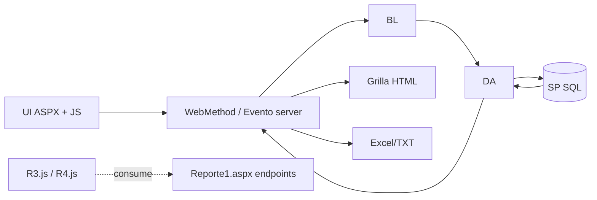

## 90. ReporteGerencial: descomposicion de capacidades

`ReporteGerencial` (permiso `OP_Reporte6`) agrupa 6 capacidades en una sola pantalla:

| Capacidad | Entrada funcional | Contrato de datos | Salida | Versionado visible |
| --- | --- | --- | --- | --- |
| Resumen Reporte 5 | Rango fecha `desde/hasta` | `EB_SP_REPORTE_DIARIO_SELECT` (`TIPO='Resumen_Reporte5'`, MN/ME) | Grilla + Excel `Plantilla_DDD.xlsx` | `tipo_rep=101` |
| Resumen Reporte 1 | Rango fecha | `EB_SP_REPORTE_DIARIO_SELECT` (`TIPO='Resumen_Reporte1'`) | Grilla + Excel `Plantilla_DDD.xlsx` | `tipo_rep=103` |
| Comparativo R1-R5 | Rango fecha | `EB_SP_REPORTE_DIARIO_SELECT` (`TIPO='Comparativo_Reporte_1_5'`) | Grilla + Excel `Plantilla_DDD.xlsx` | `tipo_rep=102` |
| Reporte de Saldos | Rango fecha | `EB_SP_REPORTE_INTEGRIDAD_TOSE_SELECT` | Excel `Plantilla_Integridad_del_TOSE.xlsx` | `tipo_rep=104` |
| Reporte de Inputs | Rango fecha | `EB_SP_REPORTE_CONTROLD_SELECT` / `EB_SP_REPORTE_CONTROLM_SELECT` | Excel `Plantilla_Control.xlsx` | `tipo_rep=107` (diario), `106` (mes) |
| Reporte de Ajustes | Rango fecha | `EB_SP_REPORTE_AJUSTE_SELECT` | Excel `Plantilla_Ajuste.xlsx` | No visible |

Notas AS-IS relevantes:

1. `ListarReporteDiarioDiferDefin` retorna inmediatamente y deja codigo posterior inalcanzable (dead code residual).
2. En `Descargar_Diario_Difer_D`, la lectura de usuario usa `Session["usuario"]` (minuscula), distinta al patron dominante `Session["Usuario"]`.
3. En `btnGenerarIntegridad_Click`, `usuario` se fija en vacio para versionado (`Count_Reporte_Version(104, usuario)`).

## 91. Integridad del TOSE: Resumen y Detalle (cadena funcional)

| Pantalla | Permiso en Page_Load | Parametros | BL/DA | SP visible | Salida |
| --- | --- | --- | --- | --- | --- |
| `ReporteValidacion` (Resumen) | `OP_Reporte6` | `Fecha` + `Tipo(D/M)` | `LReporte_Gerencial.MostrarValidacion` | `EB_SP_REPORTE_VC_TOSE_DIA` / `EB_SP_REPORTE_VC_TOSE_MES` | Render en labels + Excel `ReporteResumen.xlsx` |
| `ReporteValidacionDetalle` (Detalle) | `OP_Reporte6` | `FechaDesde` + `FechaHasta` + `Tipo(D/M)` + moneda interna (`0001`,`1001`) | `LReporte_Gerencial.MostrarValidacionDetalle` | `EB_SP_REPORTE_VC_TOSE_DIA_DETALLE` / `EB_SP_REPORTE_VC_TOSE_MES_DETALLE` | Excel `Reporte_Detalle.xlsx` |

Dependencia adicional en Resumen TOSE:

- El drilldown de trazabilidad usa `EncajeBancario.aspx/ObtenerTrazabilidad` (acoplamiento cruzado fuera de la pantalla TOSE).

## 92. Defecto de autorizacion observable en TOSE (menu vs pagina)

Desalineacion detectada:

1. Navegacion (`Site.Master.cs`) controla visibilidad:

- `opReporte7` con `OP_Reporte7`.
- `opReporte8` con `OP_Reporte8`.

2. Las paginas reales `ReporteValidacion` y `ReporteValidacionDetalle` validan `OP_Reporte6` en `Page_Load`.

Impacto AS-IS:

- Un usuario con `OP_Reporte7/8` pero sin `OP_Reporte6` puede ver opcion de menu y terminar en denegacion al entrar.
- Un usuario con `OP_Reporte6` y sin `OP_Reporte7/8` podria no ver menu, pero si conoce URL directa pasaria el gate de pagina.

## 93. Componentes tecnicos: DataCollectors y ProcesaReportes (Q2A-08)

| Componente | Evidencia funcional | Consumidores visibles | Clasificacion |
| --- | --- | --- | --- |
| `DataCollectors.aspx` | UI minima con `txtJob` + boton `ejecutarKillJob()`; incluye `MatrizCuenta.js` | No aparece en menu principal ni en llamadas AJAX externas; la accion termina invocando `MatrizCuenta.aspx/EjecutarKillJob` | Pantalla tecnica auxiliar (no end-user), vigencia operativa no demostrada |
| `ProcesaReportes.aspx` | Pagina vacia con include `Procesar.js`; WebMethod `ListaCargaInputs()` con parametros vacios | No hay referencias de navegacion ni llamadas a `ProcesaReportes.aspx/ListaCargaInputs`; `Procesar.js` usa `Procesar.aspx/ListaCargaInputs` | Stub/artefacto residual sin consumidor observable |

Estado Q2A-08:

- `CERRADO` a nivel AS-IS documental: ambos componentes quedan clasificados como tecnicos/no funcionales para flujo usuario final, con evidencia de no-consumo observable en codigo web.

## 94. Semantica multirol AD/DB (Q2A-06)

Cadena observada:

1. `Session_Start` carga `Session["Usuario"] = ActDirectory.ObtenerUser(LOGON_USER)` y `Session["Permisos"] = OperacionesPermitidas`.
2. `ActDirectory.ObtenerUser` cruza:

- Roles desde AD (`memberOf` filtrado por `CodigoApp`, excluye `INC`).
- Roles desde BD (`AD_OBTENER_ROLES`).

3. Por cada rol AD mapeado a rol BD, obtiene operaciones (`AD_OBTENER_OPERACIONES_POR_ROL`) y arma union en `Dictionary<int,string>`.

Semantica resultante (observable):

- Modelo: **union aditiva de permisos** por rol.
- Deduplicacion: por clave `COD_OPERATION` (si ya existe no vuelve a insertar).
- Precedencia/denegacion explicita: no visible (no hay regla deny/override).
- Evaluacion final en paginas/menu: `FindContentPermises` valida presencia de al menos una operacion requerida.

Riesgo puntual en multirol:

- `userLogon.Administrador` se sobreescribe por iteracion (`Contains(appNombre + "_Administrador")` del rol actual), por lo que depende del ultimo rol procesado.

Estado Q2A-06:

- `CERRADO` para semantica de union/dedup/autorizacion observable en C#.

## 95. Matriz de estado web/sesion en reporteria avanzada

| Superficie | Estado en cliente | Estado en servidor | Observacion operativa |
| --- | --- | --- | --- |
| R1 | Fecha + tablas + modal traza | Sin `Session` de dataset (si `Permisos`/`Usuario`) | Consulta AJAX directa + export server-side |
| R2 | Fecha/tab MN-ME | `Session[dtCabecera_*/dtSwitfOpe_*/dtReporteInf_*/dtNombGrupo_*]` | Reuso de ession para generacion Excel |
| R3 | Fecha/tab MN-ME | `Session[dtCabecera3_*/dtReporteInf3_*]` | UI acoplada a endpoints de R1 |
| R4 | Fecha/tab MN-ME | `Session[dtCabecera4_*/dtOpe4_*/dtReporteInf4_*]` | WebMethods de listado hardcodeados |
| R5 | Fecha/tab MN-ME | Sin `Session` de dataset dedicada | Flujo simple lista/exporta |
| Gerencial | Rango fechas + tabs funcionales | Hidden fields + consultas por request | Carga secuencial de 6 bloques de reporte |
| TOSE Resumen | Fecha + tipo D/M + labels | Sin cache session especifica de dataset | Drilldown via trazabilidad de Encaje |
| TOSE Detalle | Fecha desde/hasta + tipo | Sin cache session de dataset | Solo exporta Excel (sin grilla previa) |

## 96. Matriz de versionado, plantillas y salidas

| Modulo | Plantilla(s) | Versionado visible | Salidas |
| --- | --- | --- | --- |
| Reporte1 | `Reporte1.xlsx` | Si (`cod 3`) | Excel + TXT + broad opcional |
| Reporte2 | `Reporte_2.xlsx` | Si (`cod 9`) | Excel + TXT |
| Reporte3 | `Reporte3.xlsx` | Si (`cod 5`) | Excel + TXT |
| Reporte4 | `Reporte4.xlsx` | Si (`cod 7`) | Excel + TXT |
| Reporte5 | `Reporte5.xlsx` | No visible | Excel + TXT + broad opcional |
| ReporteGerencial (Res/Comp) | `Plantilla_DDD.xlsx` | Si (`101`, `102`, `103`) | Excel |
| ReporteGerencial (Saldos) | `Plantilla_Integridad_del_TOSE.xlsx` | Si (`104`) | Excel |
| ReporteGerencial (Inputs) | `Plantilla_Control.xlsx` | Si (`106`, `107`) | Excel |
| ReporteGerencial (Ajustes) | `Plantilla_Ajuste.xlsx` | No visible | Excel |
| TOSE Resumen | `ReporteResumen.xlsx` | No visible | Excel |
| TOSE Detalle | `Reporte_Detalle.xlsx` | No visible | Excel |

## 97. Matriz consolidada endpoint -> BL -> DA -> SP (reporteria avanzada)

| Endpoint / evento | BL | DA | SP / SQL visible |
| --- | --- | --- | --- |
| `ReporteGerencial.aspx/ListarReporteDiarioDiferDefin` | `LReporte_Gerencial.Listar_Reporte_Diario_Difer_Defin` | `DAReporte_Gerencial.Listar_Reporte_Diario_Difer_Defin` | `EB_SP_REPORTE_DIARIO_SELECT` |
| `ReporteGerencial.aspx/ListarReporteIntegTOSE` | `LReporte_Gerencial.Listar_Reporte_Integridad_del_TOSE` | `DAReporte_Gerencial.Listar_Reporte_Integridad_del_TOSE` | `EB_SP_REPORTE_INTEGRIDAD_TOSE_SELECT` |
| `ReporteGerencial.aspx/ListarReporteCuentas` | `LReporte_Gerencial.Listar_Reporte_Cuentas` | `DAReporte_Gerencial.Listar_Reporte_Cuentas` | `EB_SP_REPORTE_CUENTAS_SELECT_TODO` |
| `ReporteGerencial.btnGenerar*` (DDD) | `Select_Reporte_Diario_Diferenciado_D` + versionado | `DAReporte_Gerencial.Select_Reporte_Diario_Diferenciado_D` | `EB_SP_REPORTE_DIARIO_SELECT` + `EB_SP_REPORTE_VERSION_LISTA/INSERT` |
| `ReporteGerencial.btnGenerarIntegridad_Click` | `Select_Reporte_Integridad_del_TOSE` + versionado | `DAReporte_Gerencial.Select_Reporte_Integridad_del_TOSE` | `EB_SP_REPORTE_INTEGRIDAD_TOSE_SELECT` + `EB_SP_REPORTE_VERSION_LISTA/INSERT` |
| `ReporteGerencial.btnGeneralControlDiario_Click` | `Select_Reporte_ControlD` + versionado | `DAReporte_Gerencial.Select_Reporte_ControlD` | `EB_SP_REPORTE_CONTROLD_SELECT` + versionado |
| `ReporteGerencial.btnGenerlControlMes_Click` | `Select_Reporte_ControlM` + versionado | `DAReporte_Gerencial.Select_Reporte_ControlM` | `EB_SP_REPORTE_CONTROLM_SELECT` + versionado |
| `ReporteGerencial.btnAjustes_Click` | `Select_Reporte_Ajuste` | `DAReporte_Gerencial.Select_Reporte_Ajuste` | `EB_SP_REPORTE_AJUSTE_SELECT` |
| `ReporteValidacion.aspx/ReporteMostrar` | `LReporte_Gerencial.MostrarValidacion` | `DAReporte_Gerencial.MostrarValidacion` | `EB_SP_REPORTE_VC_TOSE_DIA` / `EB_SP_REPORTE_VC_TOSE_MES` |
| `ReporteValidacionDetalle.btnGenerar_Click` | `LReporte_Gerencial.MostrarValidacionDetalle` | `DAReporte_Gerencial.MostrarValidacionDetalle` | `EB_SP_REPORTE_VC_TOSE_DIA_DETALLE` / `EB_SP_REPORTE_VC_TOSE_MES_DETALLE` |
| `DataCollectors -> ejecutarKillJob()` | `LMatrizCuenta.EjecutarKillJob` (via endpoint MatrizCuenta) | `DAMatrizCuenta.EjecutarKillJob` | `EB_KILL_JOB_COLLECTOR` |
| `Procesar.aspx/ListaCargaInputs` | `LCarga.ListaCargaInputs` | `DACarga.ListaCargaInputs` | `EB_LISTAINPUTSPROCESAR` |

## 98. Dependencias cruzadas consolidadas

Dependencias fuertes confirmadas:

1. `R3.js` / `R4.js` dependen de `Reporte1.aspx` para validacion y listas base de UI.
2. `ReporteValidacion.js` depende de `EncajeBancario.aspx/ObtenerTrazabilidad` para drilldown de campos TOSE.
3. `DataCollectors.aspx` no expone backend propio y depende funcionalmente de `MatrizCuenta.aspx/EjecutarKillJob`.
4. `ProcesaReportes.aspx` duplica nominalmente `ListaCargaInputs`, pero el consumidor real (`Procesar.js`) utiliza `Procesar.aspx`.

Chequeo literal solicitado (`rom_Encaje` / `rom_EncajeHF`):

- No se hallaron ocurrencias en el codigo/documento analizado en esta pasada.

## 99. Riesgos y deuda tecnica confirmados en 2B.2

1. Desalineacion de permisos en TOSE (`OP_Reporte7/8` en menu vs `OP_Reporte6` en `Page_Load`).
2. Inconsistencia recurrente de sesion (`Usuario` vs `usuario`) en flujos de reporteria.
3. `ReporteGerencial.ListarReporteDiarioDiferDefin` contiene bloque inalcanzable por `return` temprano.
4. `ReporteGerencial` mezcla bloques con y sin versionado, y en saldos usa `usuario=""` para conteo de version.
5. `Reporte4` mantiene WebMethods de listado con parametros hardcodeados (`1,1,1`).
6. `DataCollectors` y `ProcesaReportes` no tienen gate de permiso especifico en `Page_Load` ni ruteo de menu visible.
7. Ausencia de monitoreo de resultado final para disparos externos (`sp_start_job` en R1/R5).

## 100. Fronteras de incertidumbre 2B.2 (`NO DETERMINADO`)

Se mantiene `NO DETERMINADO` en:

- Logica interna de calculo y validacion de SP de reporteria (`EB_SP_REPORTE_DIARIO_SELECT`, `EB_SP_REPORTE_VC_TOSE_*`, etc.).
- Existencia/configuracion efectiva de operaciones `OP_Reporte7`/`OP_Reporte8` en catalogo de roles productivo (no visible en este codigo).
- Uso operacional real en produccion de `DataCollectors`/`ProcesaReportes` fuera de rutas web observables.
- Semantica interna de jobs SQL Agent lanzados por broad y su SLA de finalizacion.

## 101. Gates formales de cierre de PASADA 2B

| Gate | Criterio | Estado | Evidencia documental |
| --- | --- | --- | --- |
| G-01 | Cobertura comparativa completa R1-R5 | CUMPLIDO | Secciones 87-89 |
| G-02 | Cobertura de reporteria avanzada (`Gerencial`, `TOSE Resumen`, `TOSE Detalle`) | CUMPLIDO | Secciones 90-92 |
| G-03 | Clasificacion de componentes tecnicos (`DataCollectors`, `ProcesaReportes`) con consumidores | CUMPLIDO | Seccion 93 |
| G-04 | Semantica multirol AD/DB (union/dedup/evaluacion) explicitada | CUMPLIDO | Seccion 94 |
| G-05 | Matrices consolidadas de estado, versionado, contratos y dependencias | CUMPLIDO | Secciones 95-98 |
| G-06 | Registro de riesgos/deuda y fronteras `NO DETERMINADO` | CUMPLIDO | Secciones 99-100 |
| G-07 | Restricciones de analisis AS-IS respetadas (sin internals DB/SSIS, sin cambios de codigo) | CUMPLIDO | Secciones 85-86 |

Resultado formal de gates:

- No existen estados `NO CUMPLIDO`.

## 102. Cierre integral de PASADA 2B

Conclusion ejecutiva:

- `PASADA 2B - COMPLETA`.

Alcance final cubierto en 2B:

1. Nucleo E2E de proceso/calculo/carga (secciones 44-68).
2. Configuracion y mantenimientos (2B.1: secciones 69-84).
3. Reporteria avanzada, componentes tecnicos, multirol y gates de cierre (2B.2: secciones 85-102).

Estado posterior recomendado para siguientes pasadas:

- Mantener pendientes unicamente las fronteras `NO DETERMINADO` que dependen de evidencia fuera de C# (internos de SP/SSIS y operacion productiva).

# PASADA 2C - ANEXO 10 PROFUNDO

## 103. Objetivo y alcance 2C

Pregunta rectora de esta pasada:

- Como funciona realmente Anexo 10 de extremo a extremo dentro de la aplicacion legacy (flujos, reglas visibles, persistencia observable y trazabilidad E2E desde codigo).

Alcance efectivo de 2C:

- 7 paginas funcionales de Anexo 10:

1. `Views/Anexo10/Inputs.aspx`
2. `Views/Anexo10/Ajustes/AnexoB.aspx`
3. `Views/Anexo10/Ajustes/MaestroOficinas.aspx`
4. `Views/Anexo10/Ajustes/RedondeoSaldos.aspx`
5. `Views/Anexo10/Ajustes/SucursalExterior.aspx`
6. `Views/Anexo10/ActaConciliacion.aspx`
7. `Views/Anexo10/ReporteFinal.aspx`

- Componentes transversales usados por esos flujos: `SiteAnexo10.Master(.cs)`, `LAnexo10`, `DAAnexo10`, `helper`, `Flash`, `ValidacionException`, `UsuarioAD`.

Fuera de alcance en esta pasada:

- Reverse engineering interno de SP.
- Consulta directa a BD.
- Decision de boundaries definitivos.
- Diseno TO-BE / comparacion legacy -> DNET.
- Profundizacion BSEC.

Baseline operativo mantenido:

- Rama de trabajo: `feature/NIIFRRCC-18028-migracion-e079`.
- Sin cambio de rama ni inspeccion de rama alternativa.
- Sin cambios de codigo aplicativo; solo actualizacion documental.

## 104. Macroflujo funcional Anexo 10

Casos de uso troncales identificados:

- `F2C-01`: Gestion de tipo de cambio mensual.
- `F2C-02`: Carga multiarchivo de Inputs y consolidacion.
- `F2C-03`: Ajustes Anexo B (cierres temporales/definitivos).
- `F2C-04`: Maestro de Oficinas (filtro, cambio tipo, historico).
- `F2C-05`: Redondeo de Saldos (alta/edicion/eliminacion).
- `F2C-06`: Sucursal Exterior (personal y saldos).
- `F2C-07`: Acta de Conciliacion (consulta y exportacion).
- `F2C-08`: Reporte Final (`.110` + Excel + ZIP).

Clasificacion de relaciones de flujo:

- Obligatorio observado por codigo: `F2C-01` y `F2C-02` para la carga mensual completa de Inputs.
- Opcional observado por codigo: `F2C-03`..`F2C-06` (no hay gate tecnico que fuerce su ejecucion previa).
- Dependencia inferida por datos (no gate explicito): `F2C-02` alimenta resultados usados en `F2C-07` y potencialmente en `F2C-08` via SP.

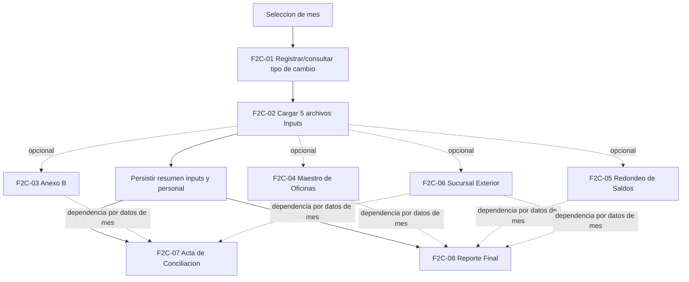

## 105. Inputs - flujo global

Ficha estandar del flujo principal:

| Campo | Contenido |
| --- | --- |
| ID | `F2C-02` |
| Nombre | Carga mensual de Inputs Anexo 10 |
| Proposito | Validar 5 archivos obligatorios, transformar datos a `DataTable`, consolidar montos/personal y persistir por `CODIGO_MES`. |
| Actor/permisos | `Usuario` con `OP_Anexo10` (gate en `Page_Load` y menu). |
| Pantalla | `Views/Anexo10/Inputs.aspx` |
| Precondiciones | Mes valido `yyyy-MM`; tipo de cambio registrado en el mes (`ViewState["TIPO_CAMBIO"]` no nulo); 5 archivos presentes. |
| Inputs | `txtFecha`, `txtTipoCambio`, `fuArchivos` (`AllowMultiple=true`).|
| Validaciones | Conteo exacto de archivos, extension Excel, tipos de archivo requeridos por nombre, estructura (hoja/columnas), consistencias de periodo/valor. |
| Pasos | 1. Validar fecha. 2. Validar tipo de cambio. 3. Validar archivos requeridos. 4. Validar estructura por archivo. 5. Transformar a `DataTable` por origen. 6. Consolidar a `dtResumenInputs`. 7. Persistir TVP resumen + TVP personal. 8. Guardar resumenes en Session y habilitar descarga. |
| BL | `Select_Producto_Cuenta_Raiz`, `GetTipoCambio`, `SetTipoCambio`, `Insert_Resumen_Inputs`, `Insert_Personal_Agencias`. |
| DA | `GetProductosCuentaRaiz`, `GetTipoCambio`, `SetTipoCambio`, `InsertResumenInputs`, `InsertPersonalAgencias`. |
| SP | `SP_A10_PRODUCTO_CUENTA_RAIZ_SELECT`, `SP_A10_GET_TIPO_CAMBIO`, `SP_A10_SET_TIPO_CAMBIO`, `SP_A10_SET_RESUMEN_INPUTS`, `SP_A10_SET_PERSONAL_AGENCIA`. |
| Operacion | `IMPORT` + `PROCESS` + `WRITE` (+ `EXPORT` de resumen en accion separada). |
| Estado Web | `Session` (`dyProductoCuentaRaiz`, `dtResumen*`, `Usuario`), `ViewState` (`TIPO_CAMBIO`, `CODIGO_MES`, `dtValoresColoc`, `Agencia515`), `QueryString` (`Mes`, `Descargar`). |
| Archivos | Entradas: 5 Excel de usuario. Salida: `Resumenes-{CODIGO_MES}.xlsx`.|
| Output | Mensaje flash de exito y habilitacion de boton descargar (`Descargar=1`). |
| Error | `ValidacionException` -> warning y redirect; `Exception` -> log + flash error + redirect. |
| Dependencias | Acta y Reporte Final consultan informacion mensual por SP (dependencia por datos, no por llamada directa entre paginas). |
| Evidencia | `btnCargarArchivos_Click`, `ValidarArchivosRequeridos`, `ProcesarArchivos`, `GenerarResumenInputs`, `NotificarResultado`. |
| Incertidumbre | CONCILIADO DB0-DB1 (HECHO VERIFICADO SQL): ambos SP hacen `DELETE` por `CODIGO_MES` con excepcion de agencias 334/336 y luego `INSERT` desde TVP (Personal usa `UNION ALL` por cargo). No se observaron transacciones SQL explicitas en semillas A10 revisadas; atomicidad conjunta de ambas llamadas y razon/efecto de las excepciones siguen NO DETERMINADOS. |

Secuencia funcional observable:

1. `btnCargarArchivos_Click` valida fecha (`ValidarFechaInput`) y tipo de cambio (`ValidarTipoCambio`).
2. `ValidarArchivosRequeridos` exige exactamente 5 archivos y nombre-logico requerido.
3. `ProcesarArchivos` valida estructura, luego transforma cada archivo en `DataTable` intermedio.
4. `GenerarResumenInputs` unifica fuentes por `AGENCIA` + `PRODUCTO` y suma MN/ME.
5. Persistencia secuencial: `Insert_Resumen_Inputs` y luego `Insert_Personal_Agencias`.
6. Se guardan `dtResumen*` en Session para descarga inmediata del consolidado de control.

## 106. Tipo de cambio

Flujo especifico `F2C-01`:

| Campo | Contenido |
| --- | --- |
| ID | `F2C-01` |
| Nombre | Registrar/consultar tipo de cambio mensual |
| Proposito | Guardar y reutilizar tipo de cambio del mes para transformaciones de Inputs. |
| Actor/permisos | `OP_Anexo10` |
| Pantalla | `Views/Anexo10/Inputs.aspx` |
| Precondiciones | Mes valido (`yyyy-MM`). |
| Inputs | `txtFecha`, `txtTipoCambio` (mascara decimal 3 decimales, max 9.999). |
| Validaciones | No vacio, decimal valido, mayor a cero; parseo `InvariantCulture`. |
| Pasos | `CargarTipoCambio` al entrar/cambiar mes; `btnRegistrarTipoCambio_Click` persiste y refresca valor. |
| BL/DA/SP | `LAnexo10.SetTipoCambio` -> `DAAnexo10.SetTipoCambio` -> `SP_A10_SET_TIPO_CAMBIO`; consulta por `SP_A10_GET_TIPO_CAMBIO`. |
| Operacion | `READ` + `WRITE` |
| Estado Web | `ViewState["TIPO_CAMBIO"]` se establece solo si existe valor valido en consulta. |
| Output | Exito: "Tipo de cambio registrado/actualizado correctamente." |
| Error | Warning por validacion; error log + mensaje para excepciones. |
| Incertidumbre | Si existe registro previo del mes, el comportamiento de conflicto/merge esta delegado al SP. |

Regla de precondicion critica:

- Si `ViewState["TIPO_CAMBIO"]` es nulo/vacio, la carga de archivos se bloquea con `ValidacionException`.

## 107. Archivos de entrada y validaciones

### 107.1 Matriz de los cinco archivos

| Archivo logico | Nombre esperado (contiene) | Hoja | Validaciones principales | Destino logico visible |
| --- | --- | --- | --- | --- |
| Leasing | `leasing` | Cualquier hoja que contenga columnas requeridas | Columnas `Cuenta`, `Sucursal`, `Oficina`, `Importe`; cuenta numerica; conversion por moneda de cuenta | Resumen por sucursal `PEN`/`USD` |
| Cubo | `cubo` | Cualquier hoja que contenga columnas requeridas | Columnas `Sucursal`, `SALDO_MES_PEN`, `SALDO_MES_USD`; normalizacion de sucursal especial | Resumen por sucursal + prorrateo |
| AG 515 | `ag 515` | Cualquier hoja que contenga columnas requeridas | Columnas `CODMES`, `CODSUC`, `SALDO`; filtro por `CODMES` seleccionado | Resumen por sucursal (vista PEN) |
| Reporte SBS | `reporte sbs` | Cualquier hoja que contenga columnas requeridas | Columnas `Codigo SBS`, `Clasificacion SBS`; mapeo a categorias normalizadas observadas en codigo (`Gerente`, `Funcionario`, `Empleado`, `Otros`) | Resumen de personal por agencia |
| Balance de comprobacion | `balance` | Hojas obligatorias `100`, `101`, `102`, `109` | Columnas por hoja: `Sociedad`, `Division`, `Centro de beneficio`, `Cuenta Regulatoria`, `Moneda del documento`, `Impte sal. final ML` | Resumen por agencia/producto/moneda |

Reglas de orquestacion de carga:

- Conteo obligatorio: exactamente 5 archivos.
- No hay carga parcial: si una validacion falla, se aborta toda la accion `btnCargarArchivos_Click`.
- Orden interno de validacion/procesamiento: `ag 515` -> `balance` -> `cubo` -> `leasing` -> `reporte sbs`.

### 107.2 Catalogo consolidado de validaciones

| ID | Archivo/flujo | Regla | Tipo | Ubicacion | Evidencia |
| --- | --- | --- | --- | --- | --- |
| A10-VAL-001 | Inputs global | Deben existir exactamente 5 archivos | VALIDACION TECNICA | `ValidarArchivosRequeridos` | `fuArchivos.PostedFiles.Count != 5` |
| A10-VAL-002 | Inputs global | Solo extensiones `.xls/.xlsx` | VALIDACION TECNICA | `ValidarArchivosRequeridos` | Filtrado `Path.GetExtension` |
| A10-VAL-003 | Inputs global | Deben existir 5 tipos requeridos por nombre logico | VALIDACION FUNCIONAL | `ValidarArchivosRequeridos` | `tiposRequeridos` + `Contains` |
| A10-VAL-004 | Tipo de cambio | Carga bloqueada si no existe tipo de cambio del mes | REGLA DE NEGOCIO (VISIBLE) | `ValidarTipoCambio` | `ViewState["TIPO_CAMBIO"]` obligatorio |
| A10-VAL-005 | Leasing | Cuenta debe ser numerica para continuar lectura | VALIDACION FUNCIONAL | `LeerDatosLeasingConMoneda` | `!cuenta.All(char.IsDigit)` -> corte |
| A10-VAL-006 | AG 515 | Solo filas con `CODMES` igual al mes seleccionado | VALIDACION FUNCIONAL | `LeerDatosSaldosConMoneda` | Comparacion con `ViewState["CODIGO_MES"]` |
| A10-VAL-007 | Balance | Hojas 100/101/102/109 obligatorias | VALIDACION TECNICA | `ValidarArchivoPorHojasYColumnas` | `hojasFaltantes.Any()` |
| A10-VAL-008 | Balance | Columnas obligatorias por hoja | VALIDACION TECNICA | `ValidarArchivoPorHojasYColumnas` | Busqueda indices por cabecera |
| A10-VAL-009 | Reporte SBS | Clasificaciones se normalizan a "Gerente/Funcionario/Empleado/Otros" | TRANSFORMACION | `LeerDatosReporteSBS` | `switch (clasificacion)` |
| A10-VAL-010 | Cubo/Leasing/AG515 | Sucursales bajo umbral o especiales se reasignan | TRANSFORMACION | `LeerDatos*` | reasignaciones a `000` |
| A10-VAL-011 | Balance | Agencia 790/792->104, 219->255 | TRANSFORMACION | `LeerDatosBalanceComprobacion` | reglas hardcodeadas |
| A10-VAL-012 | Balance | Producto se deriva por prefijo de `Cuenta Regulatoria` | TRANSFORMACION | `LeerDatosBalanceComprobacion` | `dyProductoCuentaRaiz` |
| A10-VAL-013 | Inputs global | Consolidacion final suma por (`AGENCIA`, `PRODUCTO`) | TRANSFORMACION | `GenerarResumenInputs` | `GroupBy` + `Sum` |
| A10-VAL-014 | Persistencia | Reglas de integridad final en DB no visibles desde C# | DELEGADA A BD | `Insert_Resumen_Inputs` / `Insert_Personal_Agencias` | `NO DETERMINADO` interno SP |

## 108. Consolidacion / persistencia de Inputs

### 108.1 Punto de consolidacion

La carga se considera completa en la capa C# cuando, en una misma accion, se ejecutan sin excepcion:

1. `LAnexo10.Insert_Resumen_Inputs(dtResumenInputs, codigoMes, usuario)`.
2. `LAnexo10.Insert_Personal_Agencias(dtResumenReporteSBS, codigoMes, usuario)`.

No existe boton separado de "consolidar"; la consolidacion ocurre dentro de `btnCargarArchivos_Click`.

### 108.2 TVP y operaciones masivas visibles

| TVP / parametro | Caso de uso | Contenido observable | SP consumidor |
| --- | --- | --- | --- |
| `@DATOS` (`dbo.A10_RESUMEN_INPUTS_TYPE`) | Persistir resumen de saldos por agencia/producto/moneda | `AGENCIA`, `PRODUCTO`, `MONEDA_NACIONAL`, `MONEDA_EXTRANJERA` | `dbo.SP_A10_SET_RESUMEN_INPUTS` |
| `@DATOS` (`dbo.A10_PERSONAL_AGENCIA_TYPE`) | Persistir personal por agencia | `Agencia`, `Gerente`, `Funcionario`, `Empleado`, `Otros`, `Total` | `dbo.SP_A10_SET_PERSONAL_AGENCIA` |

### 108.3 Comportamiento ante error parcial y reproceso

- Si falla cualquier validacion previa, no se ejecuta persistencia.
- Si falla la segunda persistencia (`SP_A10_SET_PERSONAL_AGENCIA`) despues de la primera, no hay rollback visible en C# de la primera llamada.
- Reproceso (CONCILIADO DB0-DB1 — HECHO VERIFICADO SQL): `SP_A10_SET_RESUMEN_INPUTS` y `SP_A10_SET_PERSONAL_AGENCIA` ejecutan `DELETE` por `CODIGO_MES`, **exceptuando agencias 334/336**, e `INSERT` desde TVP. No es correcto afirmar un borrado incondicional de todas las agencias del periodo. En DB1 no se observaron `BEGIN TRAN/COMMIT/ROLLBACK` explicitos en estas semillas; la atomicidad de las dos llamadas desde C# no esta garantizada por una transaccion visible y los escenarios de fallo inter-SP permanecen pendientes.

### 108.4 Secuencia E2E de Inputs

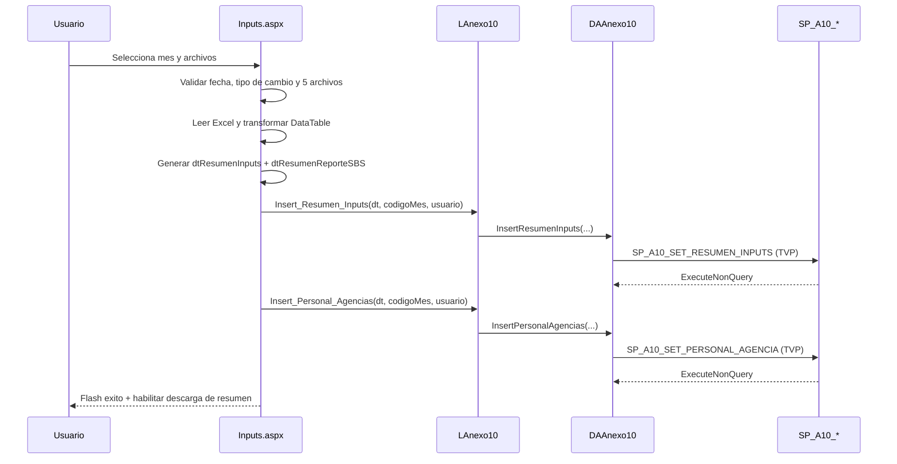

## 109. Resumenes posteriores a carga

Resumenes generados localmente y guardados en Session:

- `dtResumenLeasing`
- `dtResumenCubo`
- `dtResumenSaldos`
- `dtResumenReporteSBS`
- `dtResumenBalanceComprobacion`

Generacion y consumo:

- Productor: `btnCargarArchivos_Click` (`GuardarResumenesEnSession`).
- Consumidor: `btnDescargar_Click` (arma `Resumenes-{CODIGO_MES}.xlsx`).

Distincion funcional requerida:

| Categoria | Evidencia | Objetivo |
| --- | --- | --- |
| Control posterior a carga | `dtResumen*` en Session + descarga de resumen | Verificar y auditar lo cargado en la misma sesion |
| Reporte regulatorio final | `ReporteFinal.aspx` (`.110` + Excel + ZIP) | Salida final del ciclo de reporte |

SP asociados a resumenes posteriores:

- La descarga inmediata de resumenes en `Inputs.aspx` no consulta SP adicional (usa Session).
- Para conciliacion mensual posterior, `ActaConciliacion` usa `SP_A10_GET_RESUMEN_INPUTS_POR_MES`.

## 110. Anexo B

Ficha del flujo `F2C-03`:

| Campo | Contenido |
| --- | --- |
| ID | `F2C-03` |
| Nombre | Gestion de cierres temporales y definitivos |
| Proposito | Mantener cierres entre agencia origen/destino con vigencia por fecha. |
| Actor/permisos | `OP_Anexo10` |
| Pantalla | `Views/Anexo10/Ajustes/AnexoB.aspx` |
| Precondiciones | Mes valido `yyyy-MM`; agencias disponibles en plantilla vigente del mes. |
| Inputs | Agencia origen/destino, fecha inicio/fin (temporal), fecha cierre opcional (definitivo). |
| Validaciones | Origen != destino, fechas obligatorias/parseables en temporal, inicio <= fin; fecha cierre opcional en definitivo. |
| Pasos | Consultar grillas por mes, abrir modal, registrar cierre temporal/definitivo, eliminar por confirmacion. |
| BL/DA/SP | `GetCierresTemporalesVigentes` / `SP_A10_GET_CIERRE_TMP_VIGENTE`; `GetCierresDefinitivosVigentes` / `SP_A10_GET_CIERRE_DEF_VIGENTE`; `InsertCierreTemporal` / `SP_A10_SET_CIERRE_TMP`; `InsertCierreDefinitivo` / `SP_A10_SET_CIERRE_DEF`; deletes `SP_A10_DEL_CIERRE_TMP/DEF`. |
| Operacion | `READ` + `WRITE` + `DELETE` |
| Estado Web | `QueryString[qsMes]`, `HiddenField hfidEliminar/hfTipoEliminar`, `Session[Usuario]`. |
| Output | Grillas actualizadas y mensajes flash. |
| Error | Warning en validacion, warning SQL, error generico con log. |
| Dependencias | Usa `SP_A10_GET_PLANTILLA_VIGENTE` para poblar combos de agencias. |
| Incertidumbre | DOCUMENTADO PERO NO VERIFICADO: la regla funcional evita que existan dos cierres incompatibles para una misma agencia y que sus periodos se solapen. Permanece NO DETERMINADO el algoritmo SQL exacto, los bordes de fecha y la interaccion entre cierres TMP/DEF. |

CRUD observable:

- Alta: temporal y definitivo.
- Consulta: grillas de temporales y definitivos.
- Edicion: no visible en UI/codigo.
- Baja: si, por id y tipo de cierre.
- CONCILIACION DB0-DB1 — HECHO VERIFICADO SQL: `SP_A10_DEL_CIERRE_DEF` ejecuta `UPDATE` sobre `A10_INVENTARIO_OFICINA` (reactivacion) antes del `DELETE` del cierre definitivo. El endpoint C# solo expone la baja; el efecto colateral pertenece a la logica SQL.

## 111. Maestro de Oficinas

Ficha del flujo `F2C-04`:

| Campo | Contenido |
| --- | --- |
| ID | `F2C-04` |
| Nombre | Maestro de Oficinas y tipo historico |
| Proposito | Consultar oficinas del mes, filtrar y actualizar tipo de oficina con trazabilidad historica. |
| Actor/permisos | `OP_Anexo10` |
| Pantalla | `Views/Anexo10/Ajustes/MaestroOficinas.aspx` |
| Precondiciones | Mes valido; datos vigentes del mes disponibles en plantilla A10. |
| Inputs | Filtros (`Codigo SBS`, `Nombre`, `Tipo`), seleccion de oficina y nuevo tipo. |
| Validaciones | Filtro SBS numerico max 3; nombre alfabetico mayusculas max 25; nuevo tipo obligatorio en guardado. |
| Pasos | Cargar plantilla vigente del mes, filtrar en memoria (`DataView.RowFilter`), abrir modal de actualizacion, guardar tipo, consultar historico por SBS. |
| BL/DA/SP | `GetPlantillaVigente` / `SP_A10_GET_PLANTILLA_VIGENTE`; `GetTiposOficina` / `SP_A10_GET_TIPOS_OFICINA`; `Set_Tipo_Oficina_Historico` / `SP_A10_SET_TIPO_OFICINA_HISTORICO`; `GetPlantillaHistorico` / `SP_A10_GET_PLANTILLA_HISTORICO`. |
| Operacion | `READ` + `WRITE` |
| Estado Web | `Session[dtOficinas]`, `ViewState[RowFilterOficinas]`, `HiddenField hdSbsSel/hdMesSel`, `QueryString[qsMes]`. |
| Output | Grilla paginada filtrable, modal de historico, mensaje de exito en actualizacion. |
| Error | Flash warning/error + redirect. |
| Dependencias | `CODIGO_MES` del mes seleccionado para vigencia de cambios. |
| Incertidumbre | Regla de cierre/apertura de vigencia (`CODIGO_MES_FIN`) interna al SP: `NO DETERMINADO`. |

Modelo historico observable desde UI:

- `Oficina (SBS)` -> `nuevo tipo` -> `vigencia por mes` (inicio/fin visibles en grilla historico).

## 112. Redondeo de saldos

Ficha del flujo `F2C-05`:

| Campo | Contenido |
| --- | --- |
| ID | `F2C-05` |
| Nombre | Ajustes de redondeo de saldos |
| Proposito | Registrar/editar/eliminar ajuste por (`CODIGO SBS`, `PRODUCTO`, `MONEDA`, `CODIGO_MES`). |
| Actor/permisos | `OP_Anexo10` |
| Pantalla | `Views/Anexo10/Ajustes/RedondeoSaldos.aspx` |
| Precondiciones | Mes de trabajo seleccionado; agencia vigente disponible en combo. |
| Inputs | Codigo SBS, producto, moneda, operacion (`+` / `-`), monto absoluto, mes. |
| Validaciones | Campos obligatorios; monto > 0 y <= 999999999.99; formato de mes valido; operacion obligatoria. |
| Pasos | Consultar ajustes por mes, abrir modal registrar/editar, guardar por upsert, eliminar por clave compuesta. |
| BL/DA/SP | `Get_Ajustes_Saldos` / `SP_A10_GET_AJUSTES_SALDOS`; `Set_Ajustes_Saldos` / `SP_A10_SET_AJUSTES_SALDOS`; `Delete_Ajustes_Saldos` / `SP_A10_DEL_AJUSTES_SALDOS`; combo de agencias desde `SP_A10_GET_PLANTILLA_VIGENTE`. |
| Operacion | `READ` + `WRITE` + `DELETE` |
| Estado Web | `HiddenField hdModo`, `hfCodigoSbsEliminar`, `hfProductoEliminar`, `hfMonedaEliminar`, `hfCodigoMesEliminar`; `QueryString[qsMes]`. |
| Output | Grilla paginada de ajustes y mensajes de operacion exitosa. |
| Error | Validacion -> warning; excepcion -> error con log. |
| Dependencias | Puede impactar saldos consumidos por reportes por mes (dependencia por datos, no llamada directa entre paginas). |
| Incertidumbre | Regla de duplicidad/conflicto de clave e impacto numerico exacto en calculos internos: `NO DETERMINADO` (SP). |

## 113. Sucursal Exterior

La pantalla contiene dos subflujos separados con guardado independiente.

Aclaracion operativa:

- DOCUMENTADO PERO NO VERIFICADO: esta funcionalidad registra informacion de agencias del exterior, especificamente Miami y Panama.
- El codigo analizado verifica los subflujos de personal y saldos; la correspondencia operativa con esas sedes proviene del conocimiento del responsable del aplicativo.

### 113.1 subflujo personal (`F2C-06A`)

| Campo | Contenido |
| --- | --- |
| ID | `F2C-06A` |
| Nombre | Registro de personal por agencia exterior |
| Proposito | Guardar cantidades de `Gerente/Funcionario/Empleado/Otros` y total por agencia. |
| Actor/permisos | `OP_Anexo10` |
| Pantalla | `Views/Anexo10/Ajustes/SucursalExterior.aspx` |
| Inputs | Mes + 4 campos numericos por fila. |
| Validaciones | Mes `yyyy-MM`; inputs numericos enteros max 3 digitos en JS; total calculado por suma. |
| BL/DA/SP | `Insert_Personal_Agencias_Exterior` -> `InsertPersonalAgenciasExterior` -> `SP_A10_SET_PERSONAL_SUCURSAL_EXTERIOR` (TVP `A10_PERSONAL_AGENCIA_TYPE`). |
| Operacion | `READ` + `WRITE` |
| Estado Web | `ViewState[dtPersonal]`, `Session[Usuario]`, `QueryString[qsMes]`. |
| Output | Grilla recargada con datos del mes y mensaje de exito. |
| Incertidumbre | Politica de reemplazo por mes/agencia en SP: `NO DETERMINADO`. |

### 113.2 subflujo saldos (`F2C-06B`)

| Campo | Contenido |
| --- | --- |
| ID | `F2C-06B` |
| Nombre | Registro de saldos por producto en sucursal exterior |
| Proposito | Guardar por agencia valores de `VISTA/AHORRO/PLAZO/COLOC` en moneda extranjera. |
| Actor/permisos | `OP_Anexo10` |
| Pantalla | `Views/Anexo10/Ajustes/SucursalExterior.aspx` |
| Inputs | Mes + 4 montos por fila (mascara decimal en JS). |
| Validaciones | Mes valido; formato monetario 2 decimales; saneamiento de entrada en cliente. |
| BL/DA/SP | `Insert_Saldos_Agencias_Exterior` -> `InsertSaldosAgenciasExterior` -> `SP_A10_SET_RESUMEN_SUCURSAL_EXTERIOR` (TVP `A10_RESUMEN_INPUTS_TYPE`). |
| Operacion | `READ` + `WRITE` |
| Estado Web | `ViewState[dtSaldos]`, `Session[Usuario]`, `QueryString[qsMes]`. |
| Output | Recarga de grilla y mensaje de exito. |
| Incertidumbre | Regla de merge/reemplazo y uso posterior exacto en reportes: `NO DETERMINADO` (interno SP). |

Relacion personal vs saldos:

- Se manejan en subflujos distintos, con botones `Guardar` separados y SP distintos.
- No hay validacion cruzada visible en C# entre ambas grillas.

## 114. Mapa consolidado de ajustes

| Ajuste | Entidad funcional observada | Periodo | CRUD | Impacto posterior visible |
| --- | --- | --- | --- | --- |
| Anexo B | Cierre temporal/definitivo entre agencias | Si (`CODIGO_MES` + fechas) | C,R,D (sin U explicita) | Dependencia por datos de conciliacion/calculo delegada a BD |
| Maestro Oficinas | Tipo de oficina historico por SBS | Si (`CODIGO_MES`) | R,U (+ historico) | Puede influir en salidas por clasificacion de oficina (delegada a BD) |
| Redondeo Saldos | Ajuste por agencia/producto/moneda/mes | Si (`CODIGO_MES`) | C,R,U,D | Puede alterar montos de salidas del mes (delegado a BD) |
| Sucursal Exterior | Personal y saldos exteriores | Si (`CODIGO_MES`) | R,U (carga por lote) | Datos usados por consultas de mes en Acta/Reporte (via SP) |

Dependencias verificadas/inferidas entre ajustes y salidas:

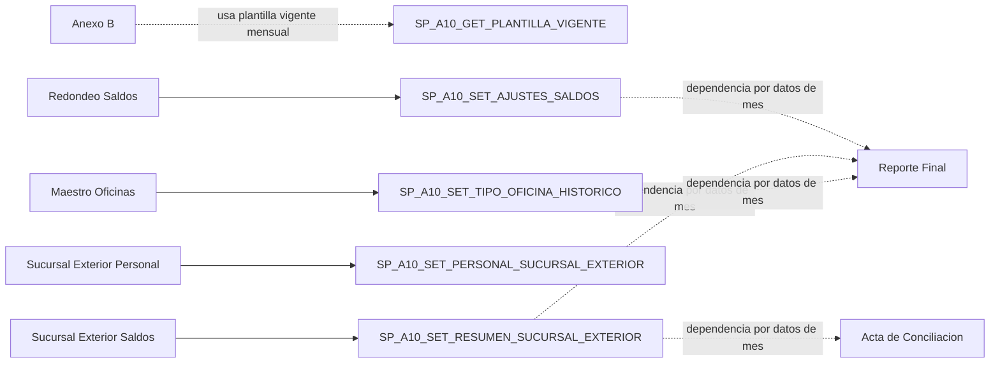

### 114.1 Aclaracion funcional operativa de los ajustes

Las siguientes aclaraciones provienen del responsable del aplicativo y se clasifican como `DOCUMENTADO PERO NO VERIFICADO` mientras no sean corroboradas por BD/runtime:

- **Anexo B:** declara agencias que tuvieron un cierre temporal o definitivo y la agencia destino hacia la que se redirigen sus saldos.
- **Redondeo de Saldos:** permite realizar ajustes sobre saldos a nivel de moneda, agencia y producto.
- **Sucursal Exterior:** registra saldos y personal de agencias del exterior (Miami y Panama).
- **Maestro de Oficinas:** mantiene el tipo de oficina con vigencia historica por periodo.

Estas aclaraciones describen el proposito funcional; el lineage fisico y las reglas SQL mediante las cuales afectan el dataset final permanecen para fase BD.

## 115. Acta de Conciliacion

Ficha del flujo `F2C-07`:

| Campo | Contenido |
| --- | --- |
| ID | `F2C-07` |
| Nombre | Consulta de Acta de Conciliacion Anexo 10 |
| Proposito | Mostrar consolidado mensual por agencia y bloques geograficos; exportar `sLima/sProv`. |
| Actor/permisos | `OP_Anexo10` |
| Pantalla | `Views/Anexo10/ActaConciliacion.aspx` |
| Precondiciones | Fecha valida `yyyy-MM` para habilitar busqueda y exportacion. |
| Inputs | `txtFecha`, accion `Buscar`, accion `Exportar`. |
| Validaciones | Regex de periodo; exportar exige busqueda previa (`ViewState["CODIGO_MES"]`). |
| Pasos | Consultar resumen mensual, particionar en grupos hardcodeados (Lima y Provincias), bind de multiples grillas, totalizar en footer, habilitar tabs. |
| BL/DA/SP | Consulta principal: `GetResumenInputsPorMes` -> `SP_A10_GET_RESUMEN_INPUTS_POR_MES`. Exportacion: `GetSLima` / `GetSProv` -> `SP_A10_GET_ACTA_CONCILIACION` con `@TIPO=SLIMA/SPROV`. |
| Operacion | `READ` + `EXPORT` |
| Estado Web | `ViewState["CODIGO_MES"]`, variable JS `busquedaRealizada`. |
| Output | Grillas Callao/Miraflores/San Isidro/Lima OP y bloques de Provincias; Excel `sLima-sProv-{CODIGO_MES}.xlsx`. |
| Error | Warning por validacion, error generico con log/flash. |
| Dependencias | Consume resumen mensual previamente persistido; no depende tecnicamente de ejecutar Reporte Final. |
| Incertidumbre | Reglas semanticas internas de `SP_A10_GET_ACTA_CONCILIACION` (armado final de `sLima/sProv`): `NO DETERMINADO`. |

Distincion Lima/Provincias:

- Existe efectivamente en UI (tabs) y en exportacion (hojas `Lima` y `Provincias`).
- Los bloques por ciudad/cluster se determinan en C# por `HashSet<int>` hardcodeados.

Semantica funcional de `@TIPO`:

- DOCUMENTADO PERO NO VERIFICADO: `@TIPO` es opcional y su valor por defecto es `NULL`.
- `SLIMA` restringe el resultado a agencias de Lima.
- `SPROV` restringe el resultado a agencias de Provincias.
- Cuando `@TIPO` es `NULL`/no se envia, no se aplica ese filtro territorial; este es el escenario utilizado funcionalmente por Reporte Final.
- La implementacion SQL exacta de esta seleccion queda fuera del alcance de 2C.

## 116. Reporte Final

Ficha del flujo `F2C-08`:

| Campo | Contenido |
| --- | --- |
| ID | `F2C-08` |
| Nombre | Generacion de Reporte Final Anexo 10 |
| Proposito | Construir salida final en ZIP que contiene archivo `.110` y Excel de impresion. |
| Actor/permisos | `OP_Anexo10` |
| Pantalla | `Views/Anexo10/ReporteFinal.aspx` |
| Precondiciones | Fecha valida `yyyy-MM-dd` y debe ser ultimo dia del mes. |
| Inputs | `txtFecha`, `txtCodigoEntidad` (readonly), `txtCodigoExpMontos` (readonly), boton `Generar`. |
| Validaciones | Parseo estricto `TryParseExact`; regla `fecha.Day == DaysInMonth`. |
| Pasos | Obtener `codigoMes`, consultar dataset, generar `.110`, generar Excel, empaquetar ZIP en memoria, retornar descarga HTTP. |
| BL/DA/SP | `GetReporteFinal` -> `DAAnexo10.GetReporteFinal` -> `SP_A10_GET_ACTA_CONCILIACION` (`@CODIGO_MES`). |
| Operacion | `READ` + `PROCESS` + `EXPORT` |
| Estado Web | `QueryString[qsFecha]` para persistir fecha tras redirect; `Session[Permisos]` para gate. |
| Output | `ReporteFinal-{CODIGO_MES}.zip` con `01{yyMMdd}.110` y `ReporteFinal-{CODIGO_MES}.xlsx`. |
| Error | `ValidacionException`/`SqlException`/`Exception` con flash + redirect. |
| Dependencias | No hay dependencia directa codificada con Acta; depende de datos retornados por SP para el mes. |
| Incertidumbre | Significado regulatorio interno de columnas y reglas de armado en SP: `NO DETERMINADO`. |

Aclaracion funcional operativa:

- DOCUMENTADO PERO NO VERIFICADO: cada fila del Reporte Final representa una agencia e incluye informacion de ubicacion/ubigeo, cantidad de personal y saldos.
- DOCUMENTADO PERO NO VERIFICADO: los saldos se presentan distribuidos en cuatro productos funcionales: `AHORRO`, `VISTA`, `COLOCACIONES` y `PLAZO`.
- La trazabilidad fisica desde Inputs/Ajustes hacia esas columnas finales permanece pendiente para la fase de BD.

## 117. Generacion `.110` / Excel / ZIP

### 117.1 Estructura observable del `.110`

| Aspecto | Evidencia visible en codigo |
| --- | --- |
| Tipo de archivo | Texto plano |
| Extension | `.110` |
| Encoding | ASCII (`Encoding.ASCII`) |
| Separador | Sin delimitadores de campo (ancho fijo) |
| Cabecera | `011001` + codigo entidad (5) + `yyyyMMdd` + codigo exp (3) + 15 ceros |
| Registros detalle | Secuencia + campos `A..E` + `SALDO01..SALDO19` con `FixString` |
| Totales | Fila final iniciada con `1000` + acumulados de 19 saldos |
| Regla de escalamiento | `SALDO01..SALDO13` multiplican por 100; `SALDO14..SALDO18` sin escala; truncado por `Floor/Ceiling` |
| Fin de archivo | Caracter `0x1A` |
| Nombre final | `01{yyMMdd}.110` |

### 117.2 Generacion de Excel y ZIP

- Excel:
- Hoja `Impresion`.
- Cabecera multi-nivel (`A1:Y3`) creada por codigo.
- Inserta fila de totales (`AgregarFilaTotales`).

- ZIP:
- En memoria (`MemoryStream` + `ZipArchive`).
- Entradas: `.110` + `.xlsx`.
- Descarga HTTP: `ReporteFinal-{CODIGO_MES}.zip`.

### 117.3 Seguridad de contenido

- No se exponen rutas locales ni datos sensibles en nombres generados.
- No se observan archivos temporales persistidos en disco para este flujo; el procesamiento es en memoria.

## 118. Precondiciones y dependencias funcionales

### 118.1 Matriz de precondiciones entre capacidades

| Flujo | Requiere | Evidencia | Clasificacion |
| --- | --- | --- | --- |
| Inputs (`F2C-02`) | Tipo de cambio mensual registrado | `ValidarTipoCambio` exige `ViewState["TIPO_CAMBIO"]` | DEPENDENCIA DIRECTA |
| ReporteFinal (`F2C-08`) | Inputs del mes cargados | No hay validacion explicita; depende de data retornada por SP | DATOS COMPARTIDOS |
| ReporteFinal (`F2C-08`) | Tipo de cambio | No hay chequeo explicito en pagina | SIN DEPENDENCIA VISIBLE |
| ReporteFinal (`F2C-08`) | Acta previa | No hay llamada ni estado compartido entre ambas paginas | SIN DEPENDENCIA VISIBLE |
| ReporteFinal (`F2C-08`) | Ajustes previos | No hay gate explicito; posible efecto por datos de mes consultados | DATOS COMPARTIDOS |
| Acta (`F2C-07`) | Carga completa de Inputs | No hay estado "carga completa" en C#; usa lo que retorne SP mensual | NO DETERMINADO |
| Ajustes (`F2C-03..06`) | Ejecutarse antes/despues de carga | No hay bloqueo cruzado visible en codigo | SIN DEPENDENCIA VISIBLE |
| Flujo A10 global | Estado formal de cierre mensual | No se observa estado de cierre transversal en C#; el responsable confirma que no existe un bloqueo operativo formal adicional del periodo | SIN BLOQUEO FORMAL CONOCIDO (DOCUMENTADO PERO NO VERIFICADO) |

### 118.2 Sincronia operativa

| Capacidad | Clasificacion | Evidencia |
| --- | --- | --- |
| Tipo de cambio | SINCRONICO HTTP | Boton server-side con redirect/flash |
| Carga Inputs | SINCRONICO HTTP | `btnCargarArchivos_Click` procesa y persiste en request |
| Descarga resumen Inputs | SINCRONICO HTTP | `Response.BinaryWrite` |
| Anexo B | SINCRONICO HTTP | Botones server-side y modales |
| Maestro Oficinas | SINCRONICO HTTP | Filtro, paginado, modal y guardado server-side |
| Redondeo de Saldos | SINCRONICO HTTP | Guardar/Eliminar en request |
| Sucursal Exterior | SINCRONICO HTTP | Dos botones de guardado independientes |
| Acta de Conciliacion | SINCRONICO HTTP | Buscar y exportar en request |
| Reporte Final | SINCRONICO HTTP | Generacion en memoria y descarga |

No se observaron en Anexo 10:

- polling,
- jobs SQL Agent visibles,
- procesamiento diferido explicitado en UI.

## 119. Autorizacion y estado web

### 119.1 Autorizacion

Regla principal verificada:

- Toda la superficie Anexo 10 (menu y paginas) usa `OP_Anexo10`.

Cobertura:

- `SiteAnexo10.Master.cs`: controla visibilidad de `Configuracion` y `Reportes` con `ActDirectory.FindContentPermisos(..., "OP_Anexo10")`.
- Cada pagina de Anexo 10 valida `OP_Anexo10` en `Page_Load`; si falla -> `NoAutorizado.aspx`.

Excepciones encontradas:

- No se observaron excepciones de permisos por accion interna en esta superficie (sin permiso adicional distinto a `OP_Anexo10`).

### 119.2 Matriz de estado web

| Artefacto | Pantalla | Contenido | Productor | Consumidor | Finalidad |
| --- | --- | --- | --- | --- | --- |
| `Session["Permisos"]` | Todas las paginas A10 + master | Diccionario de operaciones | `Session_Start` / `ActDirectory` | `Page_Load` y menu | Autorizacion |
| `Session["Usuario"]` | Inputs, Ajustes, Sucursal Exterior, Reporte Final | `UsuarioAD` (matricula y metadatos) | `Session_Start` | Metodos de guardado | Auditoria usuario |
| `Session["dyProductoCuentaRaiz"]` | Inputs | Diccionario cuenta raiz -> producto | `Page_Load` Inputs | Lectura de Balance | Transformacion |
| `Session["dtResumenLeasing/Cubo/Saldos/ReporteSBS/BalanceComprobacion"]` | Inputs | DataTables resumen post-carga | `GuardarResumenesEnSession` | `btnDescargar_Click` | Export control de carga |
| `Session["dtOficinas"]` | Maestro Oficinas | DataTable de plantilla vigente | `CargarOficinas` | Filtro/paginado grid | Performance/local filtering |
| `ViewState["TIPO_CAMBIO"]` | Inputs | Tipo de cambio vigente del mes | `CargarTipoCambio` | `ValidarTipoCambio` | Precondicion de carga |
| `ViewState["CODIGO_MES"]` | Inputs / Acta | Mes normalizado `yyyyMM` | `ValidarFechaInput` / `btnBuscar_Click` | Lecturas posteriores | Consistencia de periodo |
| `ViewState["dtValoresColoc"]` | Inputs | DataTable auxiliar de sucursales especiales | `GenerarResumenBalanceComprobacion` | `GenerarResumenSucursalMonedaCubo` | Prorrateo |
| `ViewState["Agencia515"]` | Inputs | Acumulado PEN de AG 515 | `GenerarResumenSucursalMonedaSaldos` | `GenerarResumenBalanceComprobacion` | Ajuste numerico |
| `ViewState["dtPersonal"]` / `ViewState["dtSaldos"]` | Sucursal Exterior | Copia editable de grillas | `CargarPersonal` / `CargarSaldos` | Guardado de personal/saldos | Persistencia por lote |
| `ViewState["RowFilterOficinas"]` | Maestro Oficinas | Filtro activo del DataView | `btnFiltrar_Click` | `BindGridWithFilter` | Persistencia de filtro |
| `HiddenField hfIdEliminar/hfTipoEliminar` | Anexo B | ID/tipo de registro a borrar | `RowCommand` | `btnConfirmarEliminar_Click` | Delete confirmado |
| `HiddenField hdSbsSel/hdMesSel` | Maestro Oficinas | SBS y mes seleccionados para update | `RowCommand` Actualizar | `btnGuardar_Click` | Update historico |
| `HiddenField hdModo` y `hf*Eliminar` | Redondeo | Modo REG/EDIT y clave a eliminar | UI evento/RowCommand | Guardar/Eliminar | Control modal |
| `QueryString Mes` / `Descargar` | Inputs | Mes visual y habilitacion de descarga | RedirectSelf | `Page_Load` Inputs | Persistencia UX |
| `QueryString qsMes` | AnexoB/Maestro/Redondeo/SucursalExterior | Mes visual | RedirectSelf | `Page_Load` de cada pantalla | Persistencia UX |
| `QueryString qsFecha` | Reporte Final | Fecha seleccionada | RedirectSelf | `Page_Load` ReporteFinal | Persistencia UX |
| `Session["_FLASH_"]` | Master y paginas A10 | Mensajes de retorno | `Flash.Set` | `Flash.Pop` en master | Notificacion al usuario |

## 120. Archivos y rutas

### 120.1 Mapa de manejo de archivos

```text
archivo usuario (browser)
-> HttpPostedFile (request stream)
-> lectura EPPlus en memoria
-> validacion de estructura y datos
-> transformacion a DataTable
-> persistencia via TVP a SP_A10_*
-> resumenes en Session
-> output Excel/ZIP por Response stream

```

### 120.2 Entradas/salidas observables

| Flujo | Entrada | Salida |
| --- | --- | --- |
| Inputs | 5 Excel (`leasing`, `cubo`, `ag 515`, `reporte sbs`, `balance`) | `Resumenes-{CODIGO_MES}.xlsx` |
| Acta | Mes (`yyyy-MM`) | `sLima-sProv-{CODIGO_MES}.xlsx` |
| Reporte Final | Fecha fin de mes (`yyyy-MM-dd`) | `ReporteFinal-{CODIGO_MES}.zip` (`.110` + `.xlsx`) |

### 120.3 Rutas y temporalidad

- No se observaron rutas hardcodeadas especificas de Anexo 10 para almacenar archivos de entrada en disco.
- El procesamiento visible de Inputs, Acta y Reporte Final opera en memoria/request.
- Cualquier ruta interna de infraestructura no visible desde estos flujos se mantiene como `[REDACTED]`.

## 121. Contratos SP visibles

| SP | Metodo DA | Caso de uso | Parametros visibles | Retorno visible | Tipo |
| --- | --- | --- | --- | --- | --- |
| `SP_A10_PRODUCTO_CUENTA_RAIZ_SELECT` | `GetProductosCuentaRaiz` | Inputs: mapeo cuenta/producto | Ninguno | `DataTable` | READ |
| `SP_A10_GET_TIPO_CAMBIO` | `GetTipoCambio` | Inputs: consulta tipo cambio mes | `@CODIGO_MES` | `DataTable` | READ |
| `SP_A10_SET_TIPO_CAMBIO` | `SetTipoCambio` | Inputs: guardar tipo cambio | `@CODIGO_MES`, `@TIPO_CAMBIO`, `@USUARIO` | `ExecuteNonQuery` | UPSERT |
| `SP_A10_SET_RESUMEN_INPUTS` | `InsertResumenInputs` | Inputs: persistir resumen montos | `@CODIGO_MES`, `@USUARIO_REGISTRO`, TVP `@DATOS` (`A10_RESUMEN_INPUTS_TYPE`) | `ExecuteNonQuery` | WRITE |
| `SP_A10_SET_PERSONAL_AGENCIA` | `InsertPersonalAgencias` | Inputs: persistir personal agencias | `@CODIGO_MES`, `@USUARIO_REGISTRO`, TVP `@DATOS` (`A10_PERSONAL_AGENCIA_TYPE`) | `ExecuteNonQuery` | WRITE |
| `SP_A10_GET_RESUMEN_INPUTS_POR_MES` | `GetResumenInputsPorMes` | Acta: dataset base mensual | `@CODIGO_MES` | `DataTable` | READ |
| `SP_A10_GET_ACTA_CONCILIACION` | `GetSLima` / `GetSProv` | Acta: exportar `sLima/sProv` | `@CODIGO_MES`, `@TIPO` (`SLIMA` / `SPROV`) | `DataTable` | EXPORT |
| `SP_A10_GET_ACTA_CONCILIACION` | `GetReporteFinal` | Reporte Final: dataset de impresion | `@CODIGO_MES` | `DataTable` | READ |
| `SP_A10_GET_CIERRE_TMP_VIGENTE` | `GetCierresTemporalesVigentes` | Anexo B: consulta temporales | `@CODIGO_MES` | `DataTable` | READ |
| `SP_A10_GET_CIERRE_DEF_VIGENTE` | `GetCierresDefinitivosVigentes` | Anexo B: consulta definitivos | Ninguno | `DataTable` | READ |
| `SP_A10_SET_CIERRE_TMP` | `InsertCierreTemporal` | Anexo B: alta temporal | `@AGENCIA_ORIGEN`, `@AGENCIA_DESTINO`, `@FECHA_INICIO`, `@FECHA_FIN`, `@USUARIO_REGISTRO`, `@NEW_ID OUTPUT` | `ExecuteNonQuery` + `@NEW_ID` | WRITE |
| `SP_A10_SET_CIERRE_DEF` | `InsertCierreDefinitivo` | Anexo B: alta definitivo | `@AGENCIA_ORIGEN`, `@AGENCIA_DESTINO`, `@FECHA_CIERRE`, `@USUARIO_REGISTRO`, `@NEW_ID OUTPUT` | `ExecuteNonQuery` + `@NEW_ID` | WRITE |
| `SP_A10_DEL_CIERRE_TMP` | `EliminarCierreTemporal` | Anexo B: baja temporal | `@ID` | `ExecuteNonQuery` | DELETE |
| `SP_A10_DEL_CIERRE_DEF` | `EliminarCierreDefinitivo` | Anexo B: baja definitiva + reactivacion del inventario de oficina afectado (SQL DB1) | `@ID` | `ExecuteNonQuery` | UPDATE + DELETE (HECHO VERIFICADO SQL DB0-DB1) |
| `SP_A10_GET_PLANTILLA_VIGENTE` | `GetPlantillaVigente` | Anexo B/Maestro/Redondeo: catalogo oficinas por mes | `@CODIGO_MES` | `DataTable` | READ |
| `SP_A10_GET_TIPOS_OFICINA` | `GetTiposOficina` | Maestro: combo de tipos | `@CODIGO_TIPO_EXCLUIDO` | `DataTable` | READ |
| `SP_A10_SET_TIPO_OFICINA_HISTORICO` | `Set_Tipo_Oficina_Historico` | Maestro: cambio tipo oficina | `@CODIGO_SBS`, `@NUEVO_CODIGO_TIPO`, `@CODIGO_MES`, `@USUARIO` | `ExecuteNonQuery` | UPSERT |
| `SP_A10_GET_PLANTILLA_HISTORICO` | `GetPlantillaHistorico` | Maestro: historial por SBS | `@CODIGO_SBS` | `DataTable` | READ |
| `SP_A10_GET_AJUSTES_SALDOS` | `Get_Ajustes_Saldos` | Redondeo: listado ajustes | `@CODIGO_MES` | `DataTable` | READ |
| `SP_A10_SET_AJUSTES_SALDOS` | `Set_Ajustes_Saldos` | Redondeo: alta/edicion | `@CODIGO_SBS`, `@PRODUCTO`, `@MONEDA`, `@CODIGO_MES`, `@OPERACION`, `@MONTO_ABS`, `@USUARIO` | `ExecuteNonQuery` | UPSERT |
| `SP_A10_DEL_AJUSTES_SALDOS` | `Delete_Ajustes_Saldos` | Redondeo: eliminacion | `@CODIGO_SBS`, `@PRODUCTO`, `@MONEDA`, `@CODIGO_MES` | `ExecuteNonQuery` | DELETE |
| `SP_A10_GET_PERSONAL_SUCURSAL_EXTERIOR` | `GetPersonalSucursalExterior` | Sucursal Exterior: lectura personal | `@CODIGO_MES` | `DataTable` | READ |
| `SP_A10_SET_PERSONAL_SUCURSAL_EXTERIOR` | `InsertPersonalAgenciasExterior` | Sucursal Exterior: persistir personal | `@CODIGO_MES`, `@USUARIO_REGISTRO`, TVP `@DATOS` (`A10_PERSONAL_AGENCIA_TYPE`) | `ExecuteNonQuery` | WRITE |
| `SP_A10_GET_RESUMEN_SUCURSAL_EXTERIOR` | `GetSaldosSucursalExterior` | Sucursal Exterior: lectura saldos | `@CODIGO_MES` | `DataTable` | READ |
| `SP_A10_SET_RESUMEN_SUCURSAL_EXTERIOR` | `InsertSaldosAgenciasExterior` | Sucursal Exterior: persistir saldos | `@CODIGO_MES`, `@USUARIO_REGISTRO`, TVP `@DATOS` (`A10_RESUMEN_INPUTS_TYPE`) | `ExecuteNonQuery` | WRITE |

## 122. Grupos funcionales `SP_A10_*`

| Grupo funcional | SP observados |
| --- | --- |
| Inputs / transformacion base | `SP_A10_PRODUCTO_CUENTA_RAIZ_SELECT`, `SP_A10_SET_RESUMEN_INPUTS`, `SP_A10_SET_PERSONAL_AGENCIA` |
| Tipo de cambio | `SP_A10_GET_TIPO_CAMBIO`, `SP_A10_SET_TIPO_CAMBIO` |
| Acta / Reportes de conciliacion | `SP_A10_GET_RESUMEN_INPUTS_POR_MES`, `SP_A10_GET_ACTA_CONCILIACION` |
| Anexo B (cierres) | `SP_A10_GET_CIERRE_TMP_VIGENTE`, `SP_A10_GET_CIERRE_DEF_VIGENTE`, `SP_A10_SET_CIERRE_TMP`, `SP_A10_SET_CIERRE_DEF`, `SP_A10_DEL_CIERRE_TMP`, `SP_A10_DEL_CIERRE_DEF` |
| Maestro de Oficinas | `SP_A10_GET_PLANTILLA_VIGENTE`, `SP_A10_GET_TIPOS_OFICINA`, `SP_A10_SET_TIPO_OFICINA_HISTORICO`, `SP_A10_GET_PLANTILLA_HISTORICO` |
| Redondeo de Saldos | `SP_A10_GET_AJUSTES_SALDOS`, `SP_A10_SET_AJUSTES_SALDOS`, `SP_A10_DEL_AJUSTES_SALDOS` |
| Sucursal Exterior | `SP_A10_GET_PERSONAL_SUCURSAL_EXTERIOR`, `SP_A10_SET_PERSONAL_SUCURSAL_EXTERIOR`, `SP_A10_GET_RESUMEN_SUCURSAL_EXTERIOR`, `SP_A10_SET_RESUMEN_SUCURSAL_EXTERIOR` |

## 123. Entidades conceptuales y senales de ownership

### 123.1 Inventario conceptual observado

| Entidad conceptual | Flujos que la usan | Evidencia |
| --- | --- | --- |
| Periodo (`CODIGO_MES`) | Inputs, AnexoB, Maestro, Redondeo, Sucursal Exterior, Acta, Reporte Final | Parseo `yyyy-MM` / `yyyyMM` en code-behind |
| Tipo de cambio | Inputs | `txtTipoCambio`, `SP_A10_GET/SET_TIPO_CAMBIO` |
| Agencia/Oficina SBS | Inputs, AnexoB, Maestro, Redondeo, Sucursal Exterior, Acta | Combos y grillas con `CODIGO_SBS`/`AGENCIA` |
| Producto (`COLOC/VISTA/AHORRO/PLAZO`) | Inputs, Redondeo, Sucursal Exterior, Acta | DataTables y combos de producto |
| Moneda (`MN/ME`, `PEN/USD`) | Inputs, Redondeo, Acta | Columnas y dropdown de moneda |
| Resumen de Inputs | Inputs, Acta | `dtResumenInputs`, `SP_A10_GET_RESUMEN_INPUTS_POR_MES` |
| Personal por agencia | Inputs, Sucursal Exterior | `SP_A10_SET_PERSONAL_AGENCIA`, `SP_A10_SET_PERSONAL_SUCURSAL_EXTERIOR` |
| Cierre temporal/definitivo | Anexo B | SP de cierres `TMP/DEF` |
| Tipo de oficina historico | Maestro | `SP_A10_SET_TIPO_OFICINA_HISTORICO`, historico |
| Ajuste de saldos | Redondeo | `SP_A10_SET/GET/DEL_AJUSTES_SALDOS` |
| Conciliacion Lima/Provincias | Acta | `GetSLima/GetSProv` |
| Registro final de impresion | Reporte Final | `.110` + Excel + ZIP |

### 123.2 Senales preliminares de ownership

| Entidad conceptual | Clasificacion preliminar | Tipo de evidencia |
| --- | --- | --- |
| Tipo de cambio A10 | APARENTEMENTE PROPIA DE A10 | INFERENCIA TECNICA sustentada en evidencia verificada |
| Cierres Anexo B | APARENTEMENTE PROPIA DE A10 | INFERENCIA TECNICA sustentada en evidencia verificada |
| Ajustes de redondeo | APARENTEMENTE PROPIA DE A10 | INFERENCIA TECNICA sustentada en evidencia verificada |
| Plantilla/historico de oficinas A10 | APARENTEMENTE PROPIA DE A10 | INFERENCIA TECNICA sustentada en evidencia verificada |
| Agencia/Oficina SBS | TRANSVERSAL | INFERENCIA TECNICA |
| Producto/Moneda | TRANSVERSAL | INFERENCIA TECNICA |
| Resumen mensual para conciliacion | NO DETERMINADO (ownership fisico) | INFERENCIA TECNICA |
| Datos finales de reporte `.110` | NO DETERMINADO (origen fisico interno) | INFERENCIA TECNICA |

Nota:

- Esta clasificacion es conceptual y no implica tabla fisica ni decision de dominio definitiva.

## 124. Dependencias con Encaje/BSEC

### 124.1 Dependencias visibles con Encaje

| Dependencia buscada | Resultado observable | Clasificacion |
| --- | --- | --- |
| Uso de BL Encaje (`LReporte*`, `LEncaje*`, etc.) | No encontrado en paginas Anexo 10 | SIN DEPENDENCIA FUNCIONAL VISIBLE |
| Uso de DA Encaje (`DAReporte*`, `DAInput*`, etc.) | No encontrado en flujo Anexo 10 | SIN DEPENDENCIA FUNCIONAL VISIBLE |
| SP `EB_*` | No encontrado en `DAAnexo10` | SIN DEPENDENCIA FUNCIONAL VISIBLE |
| Reuso de infraestructura comun (`helper`, `Flash`, `ActDirectory`) | Si | REUSO DE INFRAESTRUCTURA |
| Conexion logica compartida (`cnn_Encaje`) | Si, via `helper` | TRANSVERSAL TECNICA |

### 124.2 Dependencias visibles con BSEC

| Dependencia buscada | Resultado observable | Clasificacion |
| --- | --- | --- |
| Uso de `LBSEC` / `DABSEC` | No encontrado en flujo Anexo 10 | SIN DEPENDENCIA FUNCIONAL VISIBLE |
| SP `BSEC_*` | No encontrado en `DAAnexo10` | SIN DEPENDENCIA FUNCIONAL VISIBLE |
| Reuso de auth/session/infra comun | Si (mecanismo global de app) | REUSO DE INFRAESTRUCTURA |

Conclusion de dependencia cruzada:

- Anexo 10 muestra independencia funcional a nivel BL/DA/SP visibles.
- La coexistencia en la misma app y misma conexion logica corresponde a infraestructura compartida, no a llamada funcional directa Encaje/BSEC desde los casos de uso A10 analizados.

## 125. Catalogo de reglas

### 125.1 Catalogo consolidado

| ID | Flujo | Regla | Tipo | Capa | Evidencia |
| --- | --- | --- | --- | --- | --- |
| A10-R-001 | Inputs | Mes debe tener formato `yyyy-MM` | UI + validacion funcional | WEB | `ValidarFechaInput` |
| A10-R-002 | Inputs | Tipo de cambio obligatorio antes de cargar | negocio visible | WEB | `ValidarTipoCambio` |
| A10-R-003 | Inputs | Carga exacta de 5 archivos requeridos | archivo | WEB | `ValidarArchivosRequeridos` |
| A10-R-004 | Inputs | Solo Excel `.xls/.xlsx` | archivo | WEB | `ValidarArchivosRequeridos` |
| A10-R-005 | Inputs | Orden interno de procesamiento fijo | orquestacion | WEB | `ordenTipos` |
| A10-R-006 | Inputs | `AG 515` filtra solo `CODMES` seleccionado | validacion funcional | WEB | `LeerDatosSaldosConMoneda` |
| A10-R-007 | Inputs | Normalizacion de clasificacion SBS a 5 grupos | transformacion | WEB | `LeerDatosReporteSBS` |
| A10-R-008 | Inputs | Consolidacion final por (`AGENCIA`, `PRODUCTO`) | transformacion | WEB | `GenerarResumenInputs` |
| A10-R-009 | Inputs | Reglas de integridad final de persistencia | delegada a BD | DA/SP | `SP_A10_SET_*` |
| A10-R-010 | Anexo B | Origen y destino no pueden ser iguales | validacion funcional | WEB | `btnRegistrarTemporal/Definitivo_Click` |
| A10-R-011 | Anexo B | En temporal, `FechaInicio <= FechaFin` | validacion funcional | WEB | `btnRegistrarTemporal_Click` |
| A10-R-012 | Anexo B | Evitar cierres incompatibles/solapados para una misma agencia (regla funcional documentada); algoritmo exacto delegado a BD | negocio conocido + implementacion delegada a BD | SP | DOCUMENTADO PERO NO VERIFICADO + `NO DETERMINADO` interno SP |
| A10-R-013 | Maestro Oficinas | Filtro en memoria por codigo/nombre/tipo | UI | WEB | `DataView.RowFilter` |
| A10-R-014 | Maestro Oficinas | Cambio de tipo persiste historico por mes | negocio visible | WEB->SP | `SP_A10_SET_TIPO_OFICINA_HISTORICO` |
| A10-R-015 | Redondeo | Monto absoluto > 0 y max 999999999.99 | validacion funcional | WEB | `btnGuardar_Click` |
| A10-R-016 | Redondeo | Duplicidad de clave compuesta | delegada a BD | SP | `NO DETERMINADO` interno SP |
| A10-R-017 | Sucursal Exterior | Personal y saldos son subflujos independientes | orquestacion | WEB | dos botones `Guardar` |
| A10-R-018 | Acta | Exportar requiere busqueda previa del mes | UI | WEB | `ViewState["CODIGO_MES"]` |
| A10-R-019 | Acta | Agrupacion Lima/Provincias por listas hardcodeadas | presentacion/orquestacion | WEB | `HashSet<int>` por bloque |
| A10-R-020 | Reporte Final | Fecha debe ser ultimo dia del mes | validacion funcional | WEB | `DaysInMonth` |
| A10-R-021 | Reporte Final | `.110` de ancho fijo ASCII + EOF `0x1A` | presentacion/export | WEB | `GenerarArchivo110` |
| A10-R-022 | Autorizacion | `OP_Anexo10` para menu y paginas A10 | autorizacion | WEB | `SiteAnexo10.Master.cs` + `Page_Load` |

### 125.2 Clasificacion READ/WRITE/IMPORT/EXPORT/PROCESS/EXTERNAL

| Capacidad | READ | WRITE | IMPORT | EXPORT | PROCESS | EXTERNAL |
| --- | --- | --- | --- | --- | --- | --- |
| Tipo de cambio | X | X | | | | |
| Inputs (carga) | X | X | X | | X | |
| Inputs (descarga resumen) | X | | | X | | |
| Anexo B | X | X | | | X | |
| Maestro Oficinas | X | X | | | X | |
| Redondeo Saldos | X | X | | | X | |
| Sucursal Exterior - Personal | X | X | | | X | |
| Sucursal Exterior - Saldos | X | X | | | X | |
| Acta de Conciliacion | X | | | X | X | |
| Reporte Final | X | | | X | X | |

## 126. Atomicidad y manejo de errores

### 126.1 Atomicidad observable

| Flujo | Operaciones | Atomicidad observable | Riesgo/observacion |
| --- | --- | --- | --- |
| Inputs | Validaciones -> transformaciones -> `SP_A10_SET_RESUMEN_INPUTS` -> `SP_A10_SET_PERSONAL_AGENCIA` | No hay transaccion C# que abarque ambos SP | Posible persistencia parcial si falla segunda llamada |
| Anexo B alta/baja | Una llamada SP por accion | Delegada a SP | Reglas de solapamiento no visibles |
| Maestro guardar tipo | Una llamada SP | Delegada a SP | Cierre de vigencia interno no visible |
| Redondeo guardar/eliminar | Una llamada SP por accion | Delegada a SP | Duplicidad/conflicto interno no visible |
| Sucursal Exterior personal | Una llamada SP TVP | Delegada a SP | Sin atomicidad conjunta con saldos |
| Sucursal Exterior saldos | Una llamada SP TVP | Delegada a SP | Sin atomicidad conjunta con personal |
| Acta | Lectura + export | N/A (read/export) | Sin escritura |
| Reporte Final | Lectura + construccion en memoria + ZIP | N/A (read/export) | Si dataset inesperado falla en runtime de formato |

### 126.2 Manejo de errores visible

| Flujo | Validacion cliente | Validacion server | Catch/retorno | Mensaje UI | Logging |
| --- | --- | --- | --- | --- | --- |
| Inputs | mascara fecha/tipo cambio + drag&drop + extensiones | fecha, tipo cambio, 5 archivos, estructura | `ValidacionException` y `Exception` | Flash warning/error | `Util.pintaLog` en excepcion |
| Anexo B | datepicker/selectpicker | origen/destino, fechas, orden temporal | `ValidacionException`, `SqlException`, `Exception` | Flash warning/error | `Util.pintaLog` |
| Maestro | filtros de UI | tipo obligatorio en guardado | `ValidacionException` / `Exception` | Flash warning/error | `Util.pintaLog` |
| Redondeo | mascara monetaria y controles de UI | campos obligatorios, monto, mes | `ValidacionException` / `Exception` | Flash warning/error | `Util.pintaLog` |
| Sucursal Exterior | mascaras entero/moneda | formato mes | `ValidacionException` / `Exception` | Flash warning/error | `Util.pintaLog` |
| Acta | tabs deshabilitados hasta buscar | formato mes y estado de busqueda para export | `ValidacionException` / `Exception` | Flash warning/error | `Util.pintaLog` |
| Reporte Final | datepicker diario | fecha valida + fin de mes | `ValidacionException` / `SqlException` / `Exception` | Flash warning/error | `Util.pintaLog` |

Inconsistencias o riesgos UI/backend observables:

1. En Inputs, errores de parseo de origen pueden terminar como excepcion generica si un `DataTable` intermedio queda nulo y se usa sin validacion posterior.
2. En Sucursal Exterior, gran parte de validacion numerica ocurre en JS; controles adicionales de rango/consistencia quedan delegados a SP.

## 127. Deuda tecnica relevante para migracion

Deuda tecnica observada y directamente relacionada con esfuerzo de migracion:

1. Alta concentracion de logica critica en code-behind (`Inputs.aspx.cs`, `ReporteFinal.aspx.cs`, `ActaConciliacion.aspx.cs`).
2. `DAAnexo10` monolitica con multiples casos de uso heterogeneos en una sola clase.
3. Contrato funcional fuertemente acoplado a nombres de archivo, nombres de columna y hojas Excel.
4. Dependencia significativa de `Session`/`ViewState` para flujo de datos temporal.
5. Hardcode de agrupaciones de agencias en Acta (mantenimiento costoso ante cambios de negocio).
6. Persistencia Inputs en dos SP secuenciales sin transaccion de aplicacion que abarque ambos.
7. Formato `.110` construido manualmente en C# (riesgo de mantenimiento regulatorio).
8. Permiso unico `OP_Anexo10` para toda la superficie (baja granularidad de control funcional interno).

## 128. Estado de preguntas 2C y pendientes reales para fases posteriores

Las preguntas generadas inicialmente en 2C fueron revisadas con conocimiento operativo del responsable del aplicativo.

### 128.1 Estado de Q2C-01..Q2C-05

| ID | Estado | Respuesta consolidada | Clasificacion | Pendiente real |
| --- | --- | --- | --- | --- |
| Q2C-01 | CERRADA FUNCIONALMENTE / PARCIALMENTE RESUELTA EN SQL | DB1 confirma `DELETE` por `CODIGO_MES` con excepcion 334/336 + `INSERT` desde TVP en ambos SP. La aclaracion inicial de reemplazo mensual no era universal para todas las agencias. | HECHO VERIFICADO (SQL DEV DB0-DB1) | Determinar alcance real de excepciones 334/336, escenarios de falla y atomicidad extremo-a-extremo entre ambas llamadas (`A10-BD-01`). |
| Q2C-02 | PARCIALMENTE RESUELTA | La regla funcional evita que una misma agencia tenga cierres incompatibles que se solapen temporalmente. | DOCUMENTADO PERO NO VERIFICADO | Verificar algoritmo SQL exacto, bordes inclusivos/exclusivos y relacion entre cierres temporales/definitivos. |
| Q2C-03 | CERRADA FUNCIONALMENTE | `@TIPO` es opcional (`NULL` por defecto). `SLIMA` filtra Lima, `SPROV` filtra Provincias y `NULL` no aplica ese filtro territorial. Reporte Final usa el escenario sin `@TIPO`. | DOCUMENTADO PERO NO VERIFICADO + evidencia de consumo C# | Solo queda validar implementacion interna SQL cuando se inspeccione el SP. |
| Q2C-04 | REFORMULADA | El proposito funcional de los ajustes ya esta entendido: Anexo B redirige saldos por cierres; Redondeo ajusta saldos por agencia/producto/moneda; Sucursal Exterior registra saldos y personal de agencias exteriores. | DOCUMENTADO PERO NO VERIFICADO | Trazar lineage fisico desde Inputs/Ajustes/Maestro/Sucursal Exterior hasta el dataset final del `.110`. |
| Q2C-05 | CERRADA | No existe un bloqueo/cierre operativo formal adicional del periodo conocido fuera de lo observado en C#. | DOCUMENTADO PERO NO VERIFICADO | Sin pendiente funcional; conservar solo si aparece nueva evidencia operativa. |

### 128.2 Pendientes reales para fase de Base de Datos

Estos pendientes sustituyen a las preguntas genericas anteriores:

| ID | Pregunta tecnica pendiente | Prioridad | Fuente necesaria | Fase |
| --- | --- | --- | --- | --- |
| A10-BD-01 | PARCIALMENTE RESUELTA: comprobado `DELETE` por `CODIGO_MES` excepto agencias 334/336 + `INSERT` por TVP. Pendiente: comportamiento de excepciones, atomicidad y recuperacion ante falla entre ambos SP. | ALTA | DB0-DB1 confirma DML; se requiere analisis SQL/runtime dirigido de fallo y transaccion multi-SP. | Fase BD posterior |
| A10-BD-02 | Cual es el algoritmo exacto de deteccion de solapamientos/conflictos de Anexo B, incluyendo bordes de fecha y convivencia TMP/DEF? | ALTA | Definicion SP y objetos asociados | Fase BD |
| A10-BD-03 | PARCIALMENTE RESUELTA: existe grafo inicial de Inputs/Cierres/Plantilla/Acta en DB1. Falta lineage completo hasta el dataset que utiliza Reporte Final `.110`. | ALTA | Metadata inicial SQL DEV + expansion de SP/funciones en fase BD posterior. | Fase BD posterior |

No permanecen preguntas funcionales ALTA abiertas en 2C que requieran seguir inspeccionando el repositorio C#.

## 129. Gates de completitud

| Gate | Estado |
| --- | --- |
| Inputs multiarchivo caracterizados | CUMPLIDO |
| Tipo de cambio caracterizado | CUMPLIDO |
| Consolidacion de inputs entendida | CUMPLIDO CON NO DETERMINADO EXTERNO |
| Anexo B entendido | CUMPLIDO CON NO DETERMINADO EXTERNO |
| Maestro Oficinas entendido | CUMPLIDO CON NO DETERMINADO EXTERNO |
| Redondeo Saldos entendido | CUMPLIDO CON NO DETERMINADO EXTERNO |
| Sucursal Exterior entendida | CUMPLIDO CON NO DETERMINADO EXTERNO |
| Acta Conciliacion entendida | CUMPLIDO CON NO DETERMINADO EXTERNO |
| Reporte Final entendido | CUMPLIDO CON NO DETERMINADO EXTERNO |
| `.110` caracterizado a nivel de codigo | CUMPLIDO |
| Archivos/templates/ZIP documentados | CUMPLIDO |
| Precondiciones entre capacidades documentadas | CUMPLIDO CON NO DETERMINADO EXTERNO |
| Permisos documentados | CUMPLIDO |
| Estado Web documentado | CUMPLIDO |
| Contratos SP visibles documentados | CUMPLIDO |
| READ/WRITE/IMPORT/EXPORT clasificado | CUMPLIDO |
| Dependencias Encaje/A10 visibles documentadas | CUMPLIDO |
| Entidades conceptuales identificadas | CUMPLIDO |
| Incertidumbres de BD correctamente delimitadas | CUMPLIDO |

Resultado de gates 2C:

- No existen gates en estado `NO CUMPLIDO`.
- Los `NO DETERMINADO` restantes corresponden a implementacion/lineage SQL y quedaron trasladados a `A10-BD-01..03`; no requieren un nuevo slice de repositorio para cerrar 2C.

## 130. Conclusion Pasada 2C

Conclusion ejecutiva:

- `PASADA 2C - COMPLETA`.

Alcance efectivamente cubierto:

1. Flujo E2E principal de Inputs (tipo de cambio, 5 archivos, validaciones, transformaciones, consolidacion y persistencia visible).
2. Caracterizacion profunda de los cuatro mantenimientos de ajustes (`Anexo B`, `Maestro Oficinas`, `Redondeo`, `Sucursal Exterior`).
3. Trazabilidad funcional de `ActaConciliacion` y `ReporteFinal`, incluyendo estructura observable de `.110`, Excel y ZIP.
4. Matrices consolidadas requeridas: estado web, contratos SP, grupos `SP_A10_*`, reglas, operaciones y gates.
5. Delimitacion explicita de pendientes tecnicos para fase BD; las preguntas funcionales Q2C-01..Q2C-05 quedaron cerradas, parcialmente resueltas o reformuladas con trazabilidad.

Correcciones historicas (2A/2B):

- No se detectaron contradicciones tecnicas nuevas que requieran corregir secciones previas fuera de esta incorporacion 2C.

Constancias metodologicas de esta pasada:

- No se realizo reverse engineering interno de Stored Procedures.
- No se consulto la base de datos.
- No se cambio de rama.
- No se inspecciono la rama alternativa.
- No se modifico codigo aplicativo.

# PASADA 2D - BALANCE SECTORIAL / BSEC PROFUNDO

## 131. Objetivo y alcance 2D

Pregunta rectora:

- Como funciona realmente Balance Sectorial de extremo a extremo dentro de E444, desde la carga del consolidado hasta clasificacion, reclasificacion, observaciones, resumen y archivo de salida.

Subpregunta clave:

- Que papel cumple `Maestro.aspx` dentro del procesamiento y que tipo de dependencia existe entre ambos.

Alcance efectivo 2D:

1. `Views/BSEC/Procesamiento.aspx` y `Views/BSEC/Procesamiento.aspx.cs`.
2. `Views/BSEC/Maestro.aspx` y `Views/BSEC/Maestro.aspx.cs`.
3. Modelos `Views/BSEC/Models/*`.
4. `LBSEC`, `DABSEC` y contratos `BSEC.SP_*` visibles desde C#.
5. Transversal minimo necesario: `SiteBSEC.Master(.cs)`, `PrincipalBSEC.aspx(.cs)`, `Global.asax.cs`, `helper.cs`.

Fuera de alcance (mantenido):

- Reverse engineering interno de SP.
- Analisis definitivo de boundaries.
- Comparacion Legacy -> DNET.
- Diseno TO-BE.
- Fase BD interna.

Baseline operativo de esta pasada:

- `HEAD` + working tree actual aceptado como AS-IS (incluyendo cambios locales BSEC, tracked y untracked).

## 132. Macroflujo funcional BSEC

Casos de uso funcionales observados:

- `F2D-01`: Cargar y procesar consolidado BSEC.
- `F2D-02`: Descargar Excel resultado de procesamiento.
- `F2D-03`: Consultar/filtrar Maestro BSEC.
- `F2D-04`: Crear registro de Maestro BSEC.
- `F2D-05`: Editar registro de Maestro BSEC.
- `F2D-06`: Activar/Desactivar registro de Maestro BSEC.

Diagrama E2E real (BSEC):

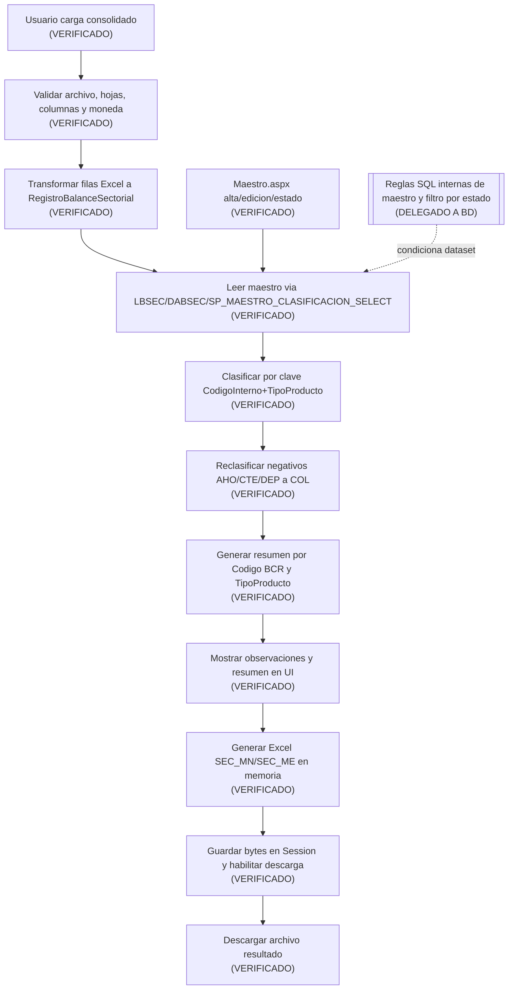

Lectura macro:

- El procesamiento BSEC es principalmente `IMPORT + PROCESS + EXPORT` en C#.
- La persistencia de negocio observada en BSEC esta en `Maestro.aspx` (no en `Procesamiento.aspx`).

## 133. Archivo consolidado de entrada

### 133.1 Estructura esperada

| Aspecto | Evidencia visible | Clasificacion |
| --- | --- | --- |
| Tipo de entrada | Un solo archivo consolidado | HECHO VERIFICADO |
| Extensiones permitidas | `.xls` o `.xlsx` | HECHO VERIFICADO |
| Tamano maximo | 50 MB | HECHO VERIFICADO |
| Hojas obligatorias | `Res_Soles` y `Res_Dolares` | HECHO VERIFICADO |
| Hojas opcionales | No observadas como parte del flujo | HECHO VERIFICADO |
| Columnas obligatorias por hoja | `ENTIDAD`, `CODINTERNOCOMPUTACIONAL`, `CODDOC`, `TIPDOC`, `RAZONSOCIAL`, `TIPPRODUCTO`, `FECDIA`, `MONEDA`, `MTOSALDOCTA` | HECHO VERIFICADO |
| Orden de columnas | No obligatorio (mapeo por nombre) | HECHO VERIFICADO |
| Duplicado de nombres de columna | Bloquea procesamiento | HECHO VERIFICADO |
| Moneda esperada por hoja | 'SOLES' en 'Res_Soles'; 'DOLARES' en 'Res_Dolares' | HECHO VERIFICADO |
| Filas vacias | Se omiten si todas las columnas obligatorias estan vacias | HECHO VERIFICADO |
| Duplicados de filas de datos | No hay deduplicacion explicita en C# | HECHO VERIFICADO |
| Periodo de procesamiento | No existe selector de periodo en UI BSEC; `FECDIA` se trata como dato por fila | HECHO VERIFICADO |

### 133.2 Compatibilidad interna del formato

Compatibilidad visible en codigo:

1. XLS binario OLE2.
2. XLSX (ZIP).
3. SpreadsheetML 2003 (XML) convertido a `XSSFWorkbook`.

Nota:

- Aunque la extension permitida en UI/servidor es `.xls/.xlsx`, el detector interno acepta XML SpreadsheetML si su contenido cumple firma y estructura.

## 134. Validaciones del consolidado

| ID | Regla | Tipo | Hoja/flujo | Ubicacion | Efecto |
| --- | --- | --- | --- | --- | --- |
| BSEC-VAL-001 | Debe existir archivo seleccionado | VALIDACION TECNICA | Entrada | `ValidarArchivoSeleccionado` | Bloquea procesamiento |
| BSEC-VAL-002 | Extension valida `.xls/.xlsx` | VALIDACION TECNICA | Entrada | `ValidarArchivoSeleccionado` + `accept` + JS visual | Bloquea procesamiento |
| BSEC-VAL-003 | Tamano > 0 y <= 50MB | VALIDACION TECNICA | Entrada | `ValidarArchivoSeleccionado` | Bloquea procesamiento |
| BSEC-VAL-004 | Formato interno compatible (XLS/XLSX/XML2003) | VALIDACION TECNICA | Lectura workbook | `DetectarTipoArchivo`/`AbrirWorkbookNpoi` | Bloquea procesamiento |
| BSEC-VAL-005 | Deben existir hojas `Res_Soles` y `Res_Dolares` | VALIDACION FUNCIONAL | Workbook | `ObtenerHojaObligatoria` | Bloquea procesamiento |
| BSEC-VAL-006 | Hoja debe tener fila de encabezados | VALIDACION TECNICA | Por hoja | `ObtenerMapaColumnas` | Bloquea procesamiento |
| BSEC-VAL-007 | No se permiten columnas duplicadas por nombre | VALIDACION TECNICA | Por hoja | `ObtenerMapaColumnas` | Bloquea procesamiento |
| BSEC-VAL-008 | Deben existir todas las columnas obligatorias | VALIDACION TECNICA | Por hoja | `ObtenerMapaColumnas` | Bloquea procesamiento |
| BSEC-VAL-009 | Moneda de cada fila debe corresponder a la hoja | VALIDACION FUNCIONAL | Por fila | `ValidarMoneda` | Bloquea procesamiento |
| BSEC-VAL-010 | `MTOSALDOCTA` obligatorio y decimal parseable | VALIDACION FUNCIONAL | Por fila | `ObtenerMontoSaldo` | Bloquea procesamiento |
| BSEC-VAL-011 | `CODINTERNOCOMPUTACIONAL` vacio se marca observacion | VALIDACION FUNCIONAL | Por fila | `ValidarRegistroLeido` | Continua con observacion |
| BSEC-VAL-012 | `TIPPRODUCTO` vacio se marca observacion | VALIDACION FUNCIONAL | Por fila | `ValidarRegistroLeido` | Continua con observacion |
| BSEC-VAL-013 | `RAZONSOCIAL` vacio se marca observacion | VALIDACION FUNCIONAL | Por fila | `ValidarRegistroLeido` | Continua con observacion |
| BSEC-VAL-014 | Sin clasificacion en maestro -> estado `SIN CLASIFICACION` | CLASIFICACION | Clasificacion | `ClasificarRegistro` | Continua con observacion |
| BSEC-VAL-015 | Clasificacion con `CODIGO_BCR` vacio -> estado `CODIGO_BCR_VACIO` | CLASIFICACION | Clasificacion | `ClasificarRegistro` | Continua con observacion |
| BSEC-VAL-016 | Multiples clasificaciones distintas para misma clave -> `CLASIFICACION_AMBIGUA` | CLASIFICACION | Clasificacion | `ClasificarRegistro` | Continua con observacion |
| BSEC-VAL-017 | Multiples filas funcionalmente equivalentes en maestro -> `DUPLICADO_EQUIVALENTE` | CLASIFICACION | Clasificacion | `ClasificarRegistro` | Continua con observacion |
| BSEC-VAL-018 | AHO/CTE/DEP con monto negativo se reclasifican a COL con monto absoluto | REGLA DE NEGOCIO | Reclasificacion | `AplicarReglaColocaciones` | Continua, altera resultado |
| BSEC-VAL-019 | Reglas internas de vigencia/estado maestro y consistencia SQL | DELEGADA A BD | Dataset maestro | `BSEC.SP_MAESTRO_CLASIFICACION_SELECT` | NO DETERMINADO en C# |

## 135. Transformaciones Excel -> modelo aplicativo

| Dato de origen | Transformacion visible | Resultado |
| --- | --- | --- |
| Fila de `Res_Soles` | Se mapea a `RegistroBalanceSectorial` y se agrega a `RegistrosMN` | Lista MN en memoria |
| Fila de `Res_Dolares` | Se mapea a `RegistroBalanceSectorial` y se agrega a `RegistrosME` | Lista ME en memoria |
| `CODINTERNOCOMPUTACIONAL` + `TIPPRODUCTO` | `Trim().ToUpperInvariant()` y combinacion logica de ambos valores (`codigo` + separador + `tipo`) |
| `FECDIA` texto | Parseo formatos `dd/MM/yyyy`, `d/M/yyyy`, `yyyy-MM-dd` (fallback `TryParse` es-PE) | `FechaDia` nullable + `FechaDiaTexto` original |
| `MTOSALDOCTA` | Parseo numerico (celda numerica o texto con `InvariantCulture`/es-PE) | `MontoSaldoCuenta` decimal |
| Dataset maestro | `GroupBy` por clave -> diccionario `clave -> lista coincidencias` | Indice para clasificacion |
| Coincidencia unica maestro | Copia `CodigoBsec`, `DescripcionBsec`, `CodigoBcr` al registro | Estado `CLASIFICADO` o `CODIGO_BCR_VACIO` |
| Coincidencias equivalentes duplicadas | Distinct por `CodigoBsec`/`CodigoBcr` queda 1 clasificacion funcional | Estado `DUPLICADO_EQUIVALENTE` |
| Coincidencias multiples distintas | Se marca ambiguedad y observacion | Estado `CLASIFICACION_AMBIGUA` |
| Regla de reclasificacion | Si tipo AHO/CTE/DEP y monto negativo: `TipoProducto='COL'`, `MontoSaldoCuenta=Abs(monto)` | Ajuste funcional para resumen/export |
| Lista final por moneda | Agrupacion por `CODIGO_BCR` y pivote por `TIPO_PRODUCTO` | `DataTable` resumen con `TOTAL_GENERAL` |

## 136. Procesamiento y persistencia

### 136.1 Ficha de flujo `F2D-01`

| Campo | Contenido |
| --- | --- |
| ID | `F2D-01` |
| Nombre | Cargar y procesar consolidado BSEC |
| Proposito | Leer consolidado, clasificar registros, aplicar reclasificacion funcional, mostrar resumen/observaciones y generar Excel descargable.|
| Actor/permisos | Navegacion condicionada por `OP_BSEC` en `SiteBSEC.Master`; pagina sin chequeo `OP_*` propio en `Page_Load`. |
| Pantalla | `Views/BSEC/Procesamiento.aspx` |
| Precondiciones | Archivo valido (`.xls/.xlsx`, <=50MB), hojas y columnas obligatorias, moneda consistente por hoja. |
| Inputs | `fuConsolidado` (un archivo).|
| Validaciones | Tecnicas/funcionales de archivo, estructura, moneda, monto, clasificacion y regla de reclasificacion. |
| Pasos | 1) Limpia Session de archivo previo. 2) Valida archivo. 3) Abre workbook. 4) Lee hojas obligatorias. 5) Mapea columnas. 6) Valida moneda por hoja. 7) Convierte filas a modelos MN/ME. 8) Lee maestro clasificacion. 9) Clasifica cada registro. 10) Aplica regla de reclasificacion a colocaciones. 11) Genera resumen por CODIGO_BCR. 12) Muestra resultados y observaciones. 13) Genera Excel en memoria y lo guarda en Session. |
| BL | `LBSEC.GetMaestroClasificacion()` |
| DA | `DABSEC.GetMaestroClasificacion()` |
| SP | `BSEC.SP_MAESTRO_CLASIFICACION_SELECT` |
| Operacion | `IMPORT` + `PROCESS` + `CLASSIFY` + `EXPORT` |
| Estado Web | `Session["BSEC_ARCHIVO_RESULTADO"]`, `Session["BSEC_NOMBRE_ARCHIVO"]`; paneles/labels/grids server-side. |
| Output | Grillas MN/ME, grilla de observaciones, resumen de conteos y habilitacion de descarga Excel. |
| Error | `catch(Exception)` general con alerta warning; sin rollback requerido en C# (no write de negocio en este flujo). |
| Dependencias | Dependencia directa de datos de maestro de clasificacion (via SP). |
| Evidencia | `btnProcesar_Click`, `LeerRegistros`, `ClasificarRegistros`, `AplicarReglaColocaciones`, `GenerarExcelResultado`. |
| Incertidumbre | Criterios SQL internos del SP de maestro (filtro por estado/vigencia/conflictos). |

### 136.2 Persistencia visible asociada al procesamiento

| Operacion funcional | BL | DA | SP | Parametros visibles | Tipo |
| --- | --- | --- | --- | --- | --- |
| Leer maestro para clasificar | `GetMaestroClasificacion` | `GetMaestroClasificacion` | `BSEC.SP_MAESTRO_CLASIFICACION_SELECT` | Sin parametros visibles | READ/CLASSIFY |
| Guardar resultado para descarga | N/A | N/A | N/A | `Session["BSEC_ARCHIVO_RESULTADO"]`, `Session["BSEC_NOMBRE_ARCHIVO"]` | PROCESS (estado web) |

Hallazgo clave:

- En `Procesamiento.aspx.cs` no se observa escritura a BD (`INSERT/UPDATE/DELETE/PROCESS`) del resultado procesado.

### 136.3 Reproceso / segunda carga

Estado AS-IS:

- Se puede volver a procesar inmediatamente cargando otro archivo.
- En cada nuevo `btnProcesar_Click` se limpian las Session del archivo anterior y se reemplaza el resultado en memoria.
- No hay confirmacion de reproceso ni versionado en C#.
- No hay borrado previo en BD visible porque el flujo no escribe en BD.

## 137. Clasificacion

### 137.1 Mecanismo observable

Entidad clasificada:

- Cada `RegistroBalanceSectorial`.

Clave de clasificacion:

- `CODINTERNOCOMPUTACIONAL` + `TIPPRODUCTO` (normalizados con `Trim().ToUpperInvariant()`).

Datos devueltos por clasificacion:

- `CODIGO_BSEC`
- `DESCRIPCION_BSEC`
- `CODIGO_BCR`

Estados de clasificacion observables:

- `CLASIFICADO`
- `SIN_CLASIFICACION`
- `CODIGO_BCR_VACIO`
- `DUPLICADO_EQUIVALENTE`
- `CLASIFICACION_AMBIGUA`

### 137.2 Trazabilidad WEB -> BL -> DA -> SP

Cadena observable:

1. `Procesamiento.aspx.cs` llama `LBSEC.GetMaestroClasificacion()`.
2. `LBSEC` delega a `DABSEC.GetMaestroClasificacion()`.
3. `DABSEC` ejecuta `BSEC.SP_MAESTRO_CLASIFICACION_SELECT`.
4. La logica de match final se ejecuta en C# (`ClasificarRegistro`) usando diccionario en memoria.

Clasificacion del mecanismo:

- HECHO VERIFICADO: la decision de estado (`CLASIFICADO`, `SIN_CLASIFICACION`, etc.) se toma en C#.
- CONCILIADO DB0-DB1 — HECHO VERIFICADO SQL: `BSEC.SP_MAESTRO_CLASIFICACION_SELECT` consulta `BSEC.MAESTRO_CLASIFICACION_SECTORIAL` con filtro `WHERE ESTADO = 1`; el procesamiento C# solo recibe clasificaciones activas de ese SELECT. Otras reglas SQL de vigencia/calidad de datos siguen pendientes cuando exceden esa evidencia.

## 138. Registros no clasificados / excepciones

Conceptos explicitos observados:

- `SIN_CLASIFICACION`.
- `CODIGO_BCR_VACIO`.
- `CLASIFICACION_AMBIGUA`.

Comportamiento:

| Aspecto | Resultado observable |
| --- | --- |
| Identificacion | Se setea `EstadoClasificacion` en cada registro. |
| Visualizacion | Se agrega fila a `gvObservaciones` con tipo y detalle. |
| Bloqueo de procesamiento | No bloquea si el archivo ya paso validaciones estructurales. |
| Bloqueo de descarga | No bloquea; igual se genera y habilita descarga. |
| Continuidad | El flujo continua y el resumen incluye grupos `(en blanco)` cuando no hay `CODIGO_BCR`. |
| Resolucion de usuario en la misma pantalla | No hay accion de correccion en `Procesamiento.aspx`. |

## 139. Reclasificacion

Mecanismo observado:

- Reclasificacion automatica en C# por regla fija.

Regla:

- Si `TIPPRODUCTO` es `AHO`, `CTE` o `DEP` y `MTOSALDOCTA < 0`, entonces:

1. `TipoProducto` pasa a `COL`.
2. `MontoSaldoCuenta` pasa a valor absoluto.
3. `ReclasificadoComoColocacion = true`.

Caracterizacion:

| Aspecto | Resultado observable |
| --- | --- |
| Tipo de reclasificacion | Automatica, no interactiva |
| Accion UI del usuario | No existe boton manual de reclasificacion |
| Persistencia en BD | No se observa write en este flujo |
| Impacto en Maestro | No modifica maestro |
| Impacto en salida | Afecta `TipoProd` y montos en grillas y Excel final |
| Motivo/observacion de reclasificacion | No se pide ni registra texto de motivo |

## 140. Observaciones

Funcion observable:

- Registrar incidencias de calidad/clasificacion durante el procesamiento y mostrarlas en UI.

Caracterizacion:

| Aspecto | Resultado observable |
| --- | --- |
| Origen | Generadas automaticamente en C# |
| Registro objetivo | `RegistroBalanceSectorial` (fila de entrada procesada) |
| Campos mostrados | Moneda, Fila, CodigoInterno, TipoProducto, RazonSocial, Tipo, Detalle |
| Obligatoriedad | No aplica ingreso manual del usuario |
| Texto libre | No (mensajes definidos por codigo) |
| Usuario/timestamp | No visible en `ObservacionBalanceSectorial` |
| Persistencia DB | No observada |
| Inclusion en Excel final | No observada |
| Efecto en proceso | Informativo; no bloquea descarga |

## 141. Resumen / resultado

Salida en pantalla despues de procesar:

1. Resumen superior:

- `Registros MN`
- `Registros ME`
- `Observaciones`

2. Dos grillas de resultado (`gvResultadoMN`, `gvResultadoME`) por moneda.
3. Una grilla de observaciones (`gvObservaciones`).

Nivel de agregacion del resumen por grilla MN/ME:

- Agrupa por `CODIGO_BCR`.
- Columna por `TIPO_PRODUCTO` (base: `AHO`, `COL`, `CTE`, `DEP` + tipos adicionales detectados).
- Columna `TOTAL_GENERAL`.
- Fila final `Total general`.

Donde se calcula:

| Elemento | Lugar |
| --- | --- |
| Conteos resumen superior | C# (`MostrarResumen`) |
| Pivot por `CODIGO_BCR` / `TIPO_PRODUCTO` | C# (`GenerarResumenCodigoBcr`) |
| Formato numerico de grillas | C# (`gvResultado_RowDataBound`) |
| Totales de detalle/resumen Excel | C# |
| Reglas SQL internas no visibles | NO DETERMINADO |

Nota de trazabilidad:

- Variables calculadas `clasificados`, `sinClasificacion`, `codigoBcrVacio`, `ambiguos`, `montoPendienteMN/ME` no se exponen en UI ni se exportan en una hoja separada.

## 142. Archivo de salida

### 142.1 Ficha de flujo `F2D-02`

| Campo | Contenido |
| --- | --- |
| ID | `F2D-02` |
| Nombre | Descargar resultado BSEC |
| Proposito | Entregar al usuario el Excel generado en memoria tras `F2D-01`. |
| Actor/permisos | Mismo contexto de acceso a BSEC; boton habilitado tras procesamiento exitoso. |
| Pantalla | `Views/BSEC/Procesamiento.aspx` |
| Precondiciones | `Session["BSEC_ARCHIVO_RESULTADO"]` con bytes y nombre de archivo en Session. |
| Inputs | Click en `btnDescargar`. |
| Validaciones | Verifica existencia de bytes en Session. |
| Pasos | 1) Lee bytes y nombre de Session. 2) Configura respuesta HTTP XLSX. 3) `BinaryWrite`. 4) `CompleteRequest`. |
| BL | N/A |
| DA | N/A |
| SP | N/A |
| Operacion | `EXPORT` |
| Estado Web | Consume `Session["BSEC_ARCHIVO_RESULTADO"]` y `Session["BSEC_NOMBRE_ARCHIVO"]`. |
| Output | Descarga `Balance_Sectorial_yyyyMMdd_HHmmss.xlsx`. |
| Error | Si no hay bytes en Session muestra alerta warning. |
| Dependencias | Requiere ejecucion previa de `F2D-01`. |
| Evidencia | `btnDescargar_Click`. |
| Incertidumbre | Ninguna adicional en C#; no hay write a BD en este flujo. |

### 142.2 Estructura del archivo generado

| Aspecto | Evidencia observable |
| --- | --- |
| Libreria | NPOI (`XSSFWorkbook`) |
| Plantilla | No usa template externo |
| Hojas | `SEC_MN`, `SEC_ME` |
| Seccion detalle | Columnas `Entidad`, `CodInterComp`, `CodDoc`, `RazonSocial`, `TipoProd`, `FecDia`, `Moneda`, `BSEC`, `CodBCR`, `MtoSaldocta` |
| Seccion resumen en la misma hoja | Desde columna `N`, con `CodBCR`, tipos de producto y `Total general` |
| Moneda | Separada por hoja (MN y ME) |
| Observaciones | No se exportan en hoja separada |
| Generacion | En memoria (`MemoryStream`) |
| Descarga | HTTP response, sin persistencia en disco |

## 143. Maestro BSEC

### 143.1 Ficha de flujo `F2D-03` (consultar/filtrar)

| Campo | Contenido |
| --- | --- |
| ID | `F2D-03` |
| Nombre | Consultar y filtrar maestro de clasificacion |
| Proposito | Listar registros de clasificacion con filtros funcionales. |
| Actor/permisos | Navegacion via `OP_BSEC` en master; pagina sin chequeo `OP_*` propio. |
| Pantalla | `Views/BSEC/Maestro.aspx` |
| Precondiciones | Sesion activa con `Session["Permisos"]`; datos de maestro en BD. |
| Inputs | Filtros: codigo interno, razon social, tipo producto, codigo BCR, estado. |
| Validaciones | `estado` se traduce a `bool?` (`1`, `0`, `null`); normaliza blancos a null. |
| Pasos | 1) `Page_Load` inicial carga grilla. 2) `Buscar`/`Limpiar` aplica filtros y recarga. 3) Paginacion recarga con filtros vigentes en controles. |
| BL | `GetMaestro` |
| DA | `GetMaestro` |
| SP | `BSEC.SP_MAESTRO_CLASIFICACION_LISTAR` |
| Operacion | `READ` |
| Estado Web | Estado en controles de filtro + `gvMaestro.PageIndex`. |
| Output | Grilla paginada con columnas de clasificacion y estado. |
| Error | No hay catch especifico en carga/filtro; propagacion de excepcion de framework si aplica. |
| Dependencias | Dependencia de dataset maestro en BD. |
| Evidencia | `CargarMaestro`, `btnBuscar_Click`, `btnLimpiar_Click`, `gvMaestro_PageIndexChanging`. |
| Incertidumbre | Semantica exacta de filtros en SQL interna del SP. |

### 143.2 Ficha de flujo `F2D-04` (crear)

| Campo | Contenido |
| --- | --- |
| ID | `F2D-04` |
| Nombre | Crear registro de maestro |
| Proposito | Insertar clasificacion para clave codigo interno + tipo producto. |
| Actor/permisos | Contexto BSEC; usa `Session["Usuario"].Matricula` para auditoria. |
| Pantalla | `Views/BSEC/Maestro.aspx` (modal `modalMaestro`) |
| Precondiciones | Campos obligatorios completos; clave activa no duplicada. |
| Inputs | Codigo interno, codigo documento, razon social, codigo BSEC, descripcion BSEC, codigo BCR, tipo producto, fecha, nota. |
| Validaciones | Obligatorios: codigo interno, tipo producto, codigo BCR; validacion de duplicado activo via `ExisteMaestroActivo`. |
| Pasos | 1) Valida formulario. 2) Valida duplicidad activa. 3) Ejecuta insert. 4) Muestra mensaje exito. 5) Limpia formulario y recarga grilla. |
| BL | `ExisteMaestroActivo`, `InsertMaestro` |
| DA | `ExisteMaestroActivo`, `InsertMaestro` |
| SP | `BSEC.SP_MAESTRO_CLASIFICACION_EXISTE_ACTIVO`, `BSEC.SP_MAESTRO_CLASIFICACION_INSERTAR` |
| Operacion | `VALIDATE` + `WRITE` |
| Estado Web | `hfIdClasificacion` vacio en modo nuevo, `Session["Usuario"]`. |
| Output | Nuevo registro y alerta success. |
| Error | `ApplicationException` muestra detalle en modal; excepcion general muestra mensaje generico. |
| Dependencias | Dataset maestro y reglas SQL de unicidad/estado. |
| Evidencia | `btnNuevo_Click` + `btnGuardar_Click` en modo nuevo/alta (`hfIdClasificacion` vacio). |
| Incertidumbre | Validacion final de unicidad y transaccionalidad interna del SP. |

### 143.3 Ficha de flujo `F2D-05` (editar)

| Campo | Contenido |
| --- | --- |
| ID | `F2D-05` |
| Nombre | Editar registro de maestro |
| Proposito | Actualizar datos de clasificacion existente. |
| Actor/permisos | Contexto BSEC; `Session["Usuario"]` para auditoria. |
| Pantalla | `Views/BSEC/Maestro.aspx` |
| Precondiciones | Registro existente; si cambia clave, no debe colisionar con otro activo. |
| Inputs | Id + campos del modal de edicion. |
| Validaciones | `GetMaestroPorId` para carga; validacion obligatorios; chequeo `CambioClaveMaestro` + `ExisteMaestroActivo` si cambia clave. |
| Pasos | 1) Usuario pulsa `Editar` en grilla activa. 2) Carga datos y auditoria en modal. 3) Guarda cambios. 4) Recarga grilla. |
| BL | `GetMaestroPorId`, `ExisteMaestroActivo`, `UpdateMaestro` |
| DA | `GetMaestroPorId`, `ExisteMaestroActivo`, `UpdateMaestro` |
| SP | `BSEC.SP_MAESTRO_CLASIFICACION_OBTENER`, `BSEC.SP_MAESTRO_CLASIFICACION_EXISTE_ACTIVO`, `BSEC.SP_MAESTRO_CLASIFICACION_ACTUALIZAR` |
| Operacion | `READ` + `VALIDATE` + `UPDATE` |
| Estado Web | `hfIdClasificacion` y campos modal; panel auditoria visible en edicion. |
| Output | Registro actualizado y alerta success. |
| Error | Si no existe, alerta warning; en guardado, errores mostrados en modal. |
| Dependencias | SP de obtencion, validacion y actualizacion de maestro. |
| Evidencia | `gvMaestro_RowCommand`, `CargarRegistroEdicion`, `btnGuardar_Click` rama edicion. |
| Incertidumbre | Reglas SQL internas de update y auditoria interna. |

### 143.4 Ficha de flujo `F2D-06` (activar/desactivar)

| Campo | Contenido |
| --- | --- |
| ID | `F2D-06` |
| Nombre | Cambiar estado activo/inactivo de registro maestro |
| Proposito | Habilitar o deshabilitar uso de registro en futuros procesamientos. |
| Actor/permisos | Contexto BSEC; usuario de sesion como auditor de cambio. |
| Pantalla | `Views/BSEC/Maestro.aspx` (modal `modalConfirmarEstado`) |
| Precondiciones | Registro identificado por `ID_CLASIFICACION` y `ESTADO` actual. |
| Inputs | `ID_CLASIFICACION`, estado actual, confirmacion usuario. |
| Validaciones | Valida/parsea el identificador y estado actual recibidos por el comando antes de preparar/confirmar el cambio de estado. |
| Pasos | 1) `CambiarEstado` prepara modal. 2) Usuario confirma. 3) Ejecuta cambio en BL/DA/SP. 4) Recarga grilla. |
| BL | `CambiarEstadoMaestro` |
| DA | `CambiarEstadoMaestro` |
| SP | `BSEC.SP_MAESTRO_CLASIFICACION_CAMBIAR_ESTADO` |
| Operacion | `STATUS` |
| Estado Web | `hfIdCambioEstado`, `hfEstadoActual`. |
| Output | Mensaje de desactivacion/reactivacion y recarga de grilla. |
| Error | Mensaje warning en falla de parseo o excepcion. |
| Dependencias | Semantica SQL de estado y uso en procesamiento. |
| Evidencia | `PrepararCambioEstado`, `btnConfirmarEstado_Click`. |
| Incertidumbre | CONCILIADO DB0-DB1: `SP_MAESTRO_CLASIFICACION_SELECT` filtra `ESTADO = 1` (HECHO VERIFICADO SQL); otras reglas de vigencia/auditoria y concurrencia permanecen parcialmente pendientes. |

## 144. Modelo conceptual del Maestro

| Atributo conceptual | Uso observable | Evidencia |
| --- | --- | --- |
| `ID_CLASIFICACION` | Identificador para editar/cambiar estado | `DataKeyNames`, hidden fields, `GetMaestroPorId` |
| `CODIGO INTERNO COMPUTACIONAL` | Clave de clasificacion + filtro | Formulario, filtros, clave de procesamiento |
| `TIPO PRODUCTO` | Clave de clasificacion + filtro | Dropdown en maestro y clave en procesamiento |
| `CODIGO_BCR` | Codigo de salida para resumen/export | Campo obligatorio en maestro, usado en procesamiento |
| `CODIGO_BSEC` | Etiqueta/atributo de clasificacion | Campo maestro y salida de detalle |
| `DESCRIPCION_BSEC` | Descripcion asociada | Campo maestro y salida de detalle |
| `CODIGO_DOCUMENTO` | Dato complementario | Campo editable en maestro |
| `RAZON SOCIAL` | Dato complementario/filtro | Campo editable y filtro |
| `FECHA_DIA` | Dato complementario | Campo editable (`txtFechaDia`) |
| `NOTA` | Observacion de catalogo | Campo editable (`txtNota`) |
| `ESTADO` | Activo/inactivo | Filtro y accion cambiar estado |
| `USUARIO`/`FECHA` registro/modificacion | Trazabilidad de auditoria visual | Panel auditoria en modal edicion |

## 145. Relacion Maestro > Procesamiento

| Evidencia | Relacion observada | Clasificacion |
| --- | --- | --- |
| `Procesamiento.ObtenerMaestroClasificacion -> LBSEC.GetMaestroClasificacion -> DABSEC.GetMaestroClasificacion -> BSEC.SP_MAESTRO_CLASIFICACION_SELECT` | El procesamiento invoca explicitamente maestro para clasificar | DEPENDENCIA DIRECTA |
| Clasificacion en C# usa clave `CodigoInterno+TipoProducto` y copia `CodigoBsec/CodigoBcr` del maestro | El procesamiento depende de datos de maestro para resultado funcional | DEPENDENCIA POR DATOS |
| No hay llamada desde procesamiento a `Insert/Update/CambiarEstado` del maestro | Procesamiento no mantiene maestro | HECHO VERIFICADO |
| No hay evidencia de `SP` de proceso BSEC adicionales en `DABSEC` | Clasificacion no se delega a un SP de calculo dedicado visible en repo | HECHO VERIFICADO |
| Efecto de estado sobre dataset de clasificacion | `BSEC.SP_MAESTRO_CLASIFICACION_SELECT` aplica `WHERE ESTADO = 1` sobre `BSEC.MAESTRO_CLASIFICACION_SECTORIAL` | HECHO VERIFICADO (SQL DEV DB0-DB1); resto de vigencia NO DETERMINADO |

Respuesta estructurada requerida:

1. Procesamiento invoca explicitamente Maestro: SI.
2. Comparten datos persistidos: SI.
3. Clasificacion ocurre totalmente en SP: NO (se decide en C# con dataset del SP).
4. Aspectos no determinables desde repositorio: SI, reglas SQL internas del dataset maestro.

## 146. Autorizacion y estado Web

### 146.1 Autorizacion AS-IS

Hechos verificados:

- `SiteBSEC.Master` controla visibilidad de menu/opciones con `OP_BSEC`.
- `Views/BSEC/Procesamiento.aspx.cs`, `Views/BSEC/Maestro.aspx.cs` y `PrincipalBSEC.aspx.cs` no validan `OP_BSEC` en `Page_Load`.
- `Global.Application_AcquireRequestState` valida existencia de `Session["Permisos"]`, pero no valida `OP_BSEC` por URL.

Impacto de acceso directo (sin remediacion):

- INFERENCIA TECNICA sustentada: con sesion valida y `Session["Permisos"]` no nula, el acceso directo por URL a paginas BSEC no muestra bloqueo page-level especifico `OP_BSEC` en C#.

WebMethods:

- No se observaron `[WebMethod]` en `Views/BSEC/*`.

### 146.2 Matriz de estado Web BSEC

| Artefacto | Pantalla | Contenido | Productor | Consumidor | Proposito |
| --- | --- | --- | --- | --- | --- |
| `Session["Permisos"]` | Master BSEC / Global | Diccionario de operaciones permitidas | `Session_Start` | `SiteBSEC.Master`, `Global` | Visibilidad de menu y control base de sesion |
| `Session["Usuario"]` | Maestro / PrincipalBSEC | `UsuarioAD` (matricula) | `Session_Start` | `Maestro.aspx.cs`, `PrincipalBSEC.aspx.cs` | Auditoria de cambios y trazabilidad |
| `Session["BSEC_ARCHIVO_RESULTADO"]` | Procesamiento | `byte[]` del Excel generado | `btnProcesar_Click` | `btnDescargar_Click` | Transferencia interna para descarga |
| `Session["BSEC_NOMBRE_ARCHIVO"]` | Procesamiento | Nombre del archivo de salida | `btnProcesar_Click` | `btnDescargar_Click` | Nombre de descarga HTTP |
| `hfIdClasificacion` | Maestro | Id de registro en edicion | `CargarRegistroEdicion`/`btnNuevo_Click` | `btnGuardar_Click` | Diferenciar alta vs edicion |
| `hfIdCambioEstado` | Maestro | Id para cambiar estado | `PrepararCambioEstado` | `btnConfirmarEstado_Click` | Confirmacion de cambio estado |
| `hfEstadoActual` | Maestro | Estado booleano actual | `PrepararCambioEstado` | `btnConfirmarEstado_Click` | Calcular nuevo estado |
| Controles Filtro (`txt*`, `ddl*`) | Maestro | Criterios de busqueda | Usuario UI | `CargarMaestro` | Filtrado de grilla |
| Grids/labels (`gv*`, `lbl*`) | Procesamiento/Maestro | Resultado visual | Code-behind | Usuario UI | Presentacion |

## 147. Sincronia y operaciones funcionales

### 147.1 Sincronia

| Flujo | Clasificacion |
| --- | --- |
| `F2D-01` Procesar consolidado | SINCRONICO HTTP |
| `F2D-02` Descargar resultado | SINCRONICO HTTP |
| `F2D-03` Consultar/filtrar maestro | SINCRONICO HTTP |
| `F2D-04` Crear maestro | SINCRONICO HTTP |
| `F2D-05` Editar maestro | SINCRONICO HTTP |
| `F2D-06` Cambiar estado maestro | SINCRONICO HTTP |

No se observaron en BSEC:

- POLLING,
- DIFERIDO,
- JOB,
- AJAX.

### 147.2 Operaciones funcionales

| Capacidad | READ | WRITE | IMPORT | EXPORT | PROCESS | EXTERNAL |
| --- | --- | --- | --- | --- | --- | --- |
| Carga consolidado |  |  | X |  | X |  |
| Validacion consolidado |  |  |  |  | X |  |
| Clasificacion | X |  |  |  | X |  |
| Reclasificacion automatica |  |  |  |  | X |  |
| Observaciones (generar/mostrar) |  |  |  |  | X |  |
| Resumen por BCR |  |  |  |  | X |  |
| Descarga Excel resultado |  |  |  | X |  |  |
| Maestro listar/filtrar | X |  |  |  |  |  |
| Maestro crear | X | X |  |  |  |  |
| Maestro editar | X | X |  |  |  |  |
| Maestro activar/desactivar |  | X |  |  |  |  |

## 148. Contratos `BSEC.SP_*`

| SP | Metodo DA | Caso de uso | Parametros visibles | Retorno visible | Tipo |
| --- | --- | --- | --- | --- | --- |
| `BSEC.SP_MAESTRO_CLASIFICACION_SELECT` | `GetMaestroClasificacion` | Cargar dataset maestro para clasificacion en procesamiento | Sin parametros | `DataTable` | READ/CLASSIFY |
| `BSEC.SP_MAESTRO_CLASIFICACION_LISTAR` | `GetMaestro` | Listar maestro con filtros | `@CODIGO_INTERNO_COMPUTACIONAL`, `@RAZON_SOCIAL`, `@TIPO_PRODUCTO`, `@CODIGO_BCR`, `@ESTADO` | `DataTable` | READ |
| `BSEC.SP_MAESTRO_CLASIFICACION_OBTENER` | `GetMaestroPorId` | Obtener registro para edicion | `@ID_CLASIFICACION` | `DataTable` | READ |
| `BSEC.SP_MAESTRO_CLASIFICACION_INSERTAR` | `InsertMaestro` | Crear registro maestro | `@CODIGO_INTERNO_COMPUTACIONAL`, `@CODIGO_DOCUMENTO`, `@RAZON_SOCIAL`, `@CODIGO_BSEC`, `@DESCRIPCION_BSEC`, `@CODIGO_BCR`, `@TIPO_PRODUCTO`, `@FECHA_DIA`, `@NOTA`, `@USUARIO`, `@NEW_ID OUTPUT` | `ExecuteNonQuery` + `@NEW_ID` | WRITE |
| `BSEC.SP_MAESTRO_CLASIFICACION_ACTUALIZAR` | `UpdateMaestro` | Editar registro maestro | `@ID_CLASIFICACION`, campos maestro, `@USUARIO` | `ExecuteNonQuery` | UPDATE |
| `BSEC.SP_MAESTRO_CLASIFICACION_CAMBIAR_ESTADO` | `CambiarEstadoMaestro` | Activar/desactivar | `@ID_CLASIFICACION`, `@ESTADO`, `@USUARIO` | `ExecuteNonQuery` | STATUS |
| `BSEC.SP_MAESTRO_CLASIFICACION_EXISTE_ACTIVO` | `ExisteMaestroActivo` | Validar duplicidad activa por clave | `@CODIGO_INTERNO_COMPUTACIONAL`, `@TIPO_PRODUCTO`, `@ID_EXCLUIR` | `DataTable` con columna `EXISTE` bool | VALIDATE |

Concentracion de schema observada:

- Todos los contratos SP visibles en `DABSEC` usan schema/prefijo `BSEC.SP_*`.
- No se observaron contratos `BSEC.SP_*` fuera de `DABSEC` en el repositorio revisado.
- Dependencias internas de esos SP a objetos `dbo` u otros schemas: NO DETERMINADO - requiere fase BD.

## 149. Entidades conceptuales

| Entidad conceptual | Flujos que la utilizan | Evidencia |
| --- | --- | --- |
| Consolidado BSEC (archivo) | `F2D-01` | `fuConsolidado`, validaciones de extension/tamano/hojas |
| Hoja monetaria (`Res_Soles`/`Res_Dolares`) | `F2D-01` | Constantes `HOJA_SOLES`/`HOJA_DOLARES` |
| Registro balance sectorial | `F2D-01`, salida Excel | Modelo `RegistroBalanceSectorial` |
| Clasificacion maestro | `F2D-01`, `F2D-03..06` | `MaestroClasificacionBsec`, SP de maestro |
| Estado de clasificacion | `F2D-01` | Constantes `CLASIFICADO`, `SIN_CLASIFICACION`, etc. |
| Observacion de procesamiento | `F2D-01` | Modelo `ObservacionBalanceSectorial`, `gvObservaciones` |
| Reclasificacion de colocaciones | `F2D-01` | `ResumenReclasificacionColocaciones`, `AplicarReglaColocaciones` |
| Resumen por `CODIGO_BCR` | `F2D-01`, `F2D-02` | `GenerarResumenCodigoBcr`, grillas MN/ME |
| Archivo resultado | `F2D-02` | `Session["BSEC_ARCHIVO_RESULTADO"]`, `btnDescargar_Click` |
| Estado maestro activo/inactivo | `F2D-03..06` | Campo `ESTADO`, filtro y cambio estado |

## 150. Senales preliminares de ownership

| Entidad conceptual | Clasificacion preliminar | Tipo de evidencia |
| --- | --- | --- |
| Maestro de clasificacion BSEC | APARENTEMENTE PROPIA DE BSEC | INFERENCIA TECNICA sustentada en contratos `BSEC.SP_MAESTRO_CLASIFICACION_*` |
| Estados de clasificacion de procesamiento | APARENTEMENTE PROPIA DE BSEC | INFERENCIA TECNICA sustentada en constantes y logica C# de `Procesamiento.aspx.cs` |
| Regla de reclasificacion AHO/CTE/DEP negativo -> COL | APARENTEMENTE PROPIA DE BSEC | INFERENCIA TECNICA sustentada en `AplicarReglaColocaciones` |
| Sesion de autenticacion/permisos | TRANSVERSAL | HECHO VERIFICADO |
| Conexion logica `cnn_Encaje` | INFRAESTRUCTURA COMPARTIDA | HECHO VERIFICADO |
| Ownership fisico de objetos SQL consumidos por SP BSEC | NO DETERMINADO | Limite de fase BD |

## 151. Dependencias con Encaje / Anexo 10

### 151.1 Con Encaje

| Dependencia | Evidencia | Clasificacion |
| --- | --- | --- |
| Llamadas BL Encaje desde `Views/BSEC/*` | No observadas (`LBSEC` es la unica BL de negocio invocada) | SIN DEPENDENCIA VISIBLE |
| Llamadas DA Encaje desde `Views/BSEC/*` | No observadas (`DABSEC` es la DA de negocio invocada) | SIN DEPENDENCIA VISIBLE |
| SP `EB_*` en flujo BSEC profundo analizado | No observados en `DABSEC` ni code-behind BSEC | SIN DEPENDENCIA VISIBLE |
| Conexion `cnn_Encaje` via `helper` | `DABSEC` usa `helper.EjecutarConsulta`/`EjecutarComando` con `cnn_Encaje` | INFRAESTRUCTURA COMPARTIDA |
| `Session[permisos/usuario]` desde `Global.asax` | `SiteBSEC.Master`, `Global.asax.cs` | INFRAESTRUCTURA COMPARTIDA |

### 151.2 Con Anexo 10

| Dependencia | Evidencia | Clasificacion |
| --- | --- | --- |
| Referencias a `LAnexo10` / `DAAnexo10` en `Views/BSEC/*` | No observadas | SIN DEPENDENCIA VISIBLE |
| Referencias a `SP_A10_*` en `DABSEC`/`BSEC` | No observadas | SIN DEPENDENCIA VISIBLE |
| Reuso de infraestructura comun (`helper`, session, master model) | Si | INFRAESTRUCTURA COMPARTIDA |

### 151.3 Dependencias transversales efectivas

| Uso transversal | Evidencia | Clasificacion |
| --- | --- | --- |
| Logging (`Util.pintaLog`) | `SiteBSEC.Master`, `PrincipalBSEC` | REUSO TECNICO |
| Alertas comunes JS modal | `MostrarAlerta` en master + `ScriptManager.RegisterStartupScript` | REUSO TECNICO |
| Libreria Excel NPOI | `Procesamiento.aspx.cs` | REUSO TECNICO |

## 152. Atomicidad y manejo de errores

### 152.1 Atomicidad / transacciones visibles

| Flujo | Operaciones | Atomicidad visible | Riesgo/observacion |
| --- | --- | --- | --- |
| `F2D-01` Procesar consolidado | Validar -> transformar -> clasificar -> reclasificar -> resumir -> generar excel session | Sin transacciones DB de negocio (no write a BD observado) | Riesgo operativo principal es fallo en memoria/request, no inconsistencia DB de procesamiento |
| `F2D-04` Crear maestro | Validar duplicado (`READ`) + insertar (`WRITE`) | No hay `SqlTransaction` en C# entre validacion e insercion | Potencial carrera entre check de duplicado y write (resolucion final delegada a SP/BD) |
| `F2D-05` Editar maestro | Obtener -> validar cambio clave -> validar duplicado -> update | Sin transaccion visible entre consultas previas y update | Potencial carrera en concurrencia |
| `F2D-06` Cambiar estado | Un `UPDATE` via SP | Operacion unitaria visible por request | Semantica final de estado depende del SP |

### 152.2 Manejo de errores

| Flujo | Validacion cliente | Validacion server | Catch observable | Logging | Resultado UI |
| --- | --- | --- | --- | --- | --- |
| Procesamiento | JS visual de extension/drag-drop | Validaciones completas en C# | `catch(Exception)` | Comentario de logging pendiente (no llamada activa en catch) | `MostrarAlerta(..., warning)` |
| Descarga resultado | N/A | Verifica bytes en Session | Sin excepcion especifica; control preventivo | No log en metodo | Warning si no hay resultado |
| Maestro guardar | Sin validacion JS explicita | Validaciones de obligatorios + duplicidad + ID | `catch(ApplicationException)` y `catch(Exception)` | Comentario `//Util.pintaLog(...)` en generico | Error en modal + reabre modal |
| Maestro cambiar estado | N/A | Parseo command argument y hidden fields | `catch(Exception)` | Comentario de log en `btnConfirmarEstado_Click` | warning/success |
| Master/Principal | N/A | Controles de sesion/permisos basicos | catch generico | `Util.pintaLog` activo | redirect/flash segun caso |

## 153. Catalogo de reglas

| ID | Flujo | Regla | Tipo | Capa | Evidencia |
| --- | --- | --- | --- | --- | --- |
| BSEC-R-001 | Procesamiento | Solo se procesa un consolidado por request | ui/archivo | ASPX+WEB | JS `DataTransfer` toma primer archivo |
| BSEC-R-002 | Procesamiento | Archivo debe ser `.xls` o `.xlsx` | archivo | WEB | `ValidarArchivoSeleccionado` |
| BSEC-R-003 | Procesamiento | Maximo 50MB | archivo | WEB | `TAMANIO_MAXIMO_ARCHIVO` |
| BSEC-R-004 | Procesamiento | Hojas obligatorias `Res_Soles` y `Res_Dolares` | validacion funcional | WEB | `ObtenerHojaObligatoria` |
| BSEC-R-005 | Procesamiento | Columnas obligatorias por nombre | validacion funcional | WEB | `COLUMNAS_OBLIGATORIAS` + `ObtenerMapaColumnas` |
| BSEC-R-006 | Procesamiento | Moneda de fila debe coincidir con hoja | validacion funcional | WEB | `ValidarMoneda` |
| BSEC-R-007 | Procesamiento | `MTOSALDOCTA` debe ser decimal valido | validacion funcional | WEB | `ObtenerMontoSaldo` |
| BSEC-R-008 | Procesamiento | Clave de clasificacion = CodigoInterno + TipoProducto normalizados | clasificacion | WEB | `CrearClaveClasificacion` |
| BSEC-R-009 | Procesamiento | Sin match en maestro -> `SIN_CLASIFICACION` | clasificacion | WEB | `ClasificarRegistro` |
| BSEC-R-010 | Procesamiento | Match con BCR vacio -> `CODIGO_BCR_VACIO` | clasificacion | WEB | `ClasificarRegistro` |
| BSEC-R-011 | Procesamiento | Multiples clasificaciones distintas -> `CLASIFICACION_AMBIGUA` | clasificacion | WEB | `ClasificarRegistro` |
| BSEC-R-012 | Procesamiento | Duplicado equivalente se acepta como clasificacion valida | clasificacion | WEB | `ESTADO_DUPLICADO_EQUIVALENTE` |
| BSEC-R-013 | Procesamiento | AHO/CTE/DEP negativos se reclasifican a COL positivos | negocio | WEB | `AplicarReglaColocaciones` |
| BSEC-R-014 | Maestro | Para crear/editar: codigo interno, tipo producto y codigo BCR son obligatorios | UI/validacion funcional | WEB | `ValidarFormularioMaestro` |
| BSEC-R-015 | Maestro | No se permite duplicidad activa por clave | negocio | WEB->BD | `ExisteMaestroActivo` |
| BSEC-R-016 | Maestro | Solo registros activos muestran accion `Editar` en grilla | presentacion | ASPX | `Visible='<%# Convert.ToBoolean(Eval("ESTADO")) %>'` |
| BSEC-R-017 | Maestro | Cambio de estado requiere confirmacion modal | UI/orquestacion | ASPX+WEB | `PrepararCambioEstado` -> `btnConfirmarEstado_Click` |
| BSEC-R-018 | Autorizacion | Menu BSEC visible con `OP_BSEC` | autorizacion | Master | `SiteBSEC.Master.CargarMenu` |
| BSEC-R-019 | Autorizacion por URL en paginas BSEC | No existe chequeo page-level `OP_BSEC` en `Page_Load` | autorizacion | WEB | `Procesamiento.aspx.cs`, `Maestro.aspx.cs`, `PrincipalBSEC.aspx.cs` |
| BSEC-R-020 | Reglas SQL de filtro/estado/consistencia maestro | Delegadas al SP | delegada a BD | SP | NO DETERMINADO en C# |

## 154. Deuda tecnica relevante

1. Logica critica concentrada en code-behind extenso (`Procesamiento.aspx.cs`).
2. Ausencia de chequeo page-level `OP_BSEC` en paginas BSEC (GAP DE AUTORIZACION CONOCIDO / PENDIENTE DE IMPLEMENTACION). Comportamiento esperado documentado: solo usuarios con `OP_BSEC` deben poder acceder a las URLs BSEC.
3. Procesamiento y clasificacion operan dentro del request HTTP con carga completa en memoria.
4. `catch(Exception)` general en procesamiento sin logging activo en ese punto.
5. Variables calculadas no consumidas (`clasificados`, `ambiguos`, `montoPendiente*`, etc.), senal de deuda/residuo.
6. Metodo `ContarRegistros` sin uso observable.
7. Doble ruta para cambio de estado en maestro (`CambiarEstadoRegistro` y flujo modal actual), posible residuo.
8. Validacion de duplicidad separada del write; DB0-DB1 verifico que `SP_MAESTRO_CLASIFICACION_EXISTE_ACTIVO` usa `EXISTS` sin lock hints ni transaccion explicita. No demuestra por si solo una garantia de unicidad bajo concurrencia; indices/constraints reales siguen pendientes (`BSEC-BD-02`, `DB1-NQ-01`).
9. No existe persistencia ni historial del resultado procesado BSEC en el AS-IS observado; el resultado vive en Session y finaliza en descarga del Excel.
10. DOCUMENTADO PERO NO VERIFICADO — necesidad futura reportada: conservar historico de procesamientos para permitir descargar periodos anteriores sin reprocesar. Esto se registra como requerimiento futuro, NO como decision de arquitectura TO-BE.

## 155. Preguntas BSEC para fase BD

Las preguntas cuya respuesta depende de SQL se consolidan en un unico backlog para evitar duplicaciones con preguntas generales.

| ID | Pregunta para fase BD | Prioridad | Evidencia actual | Fuente necesaria |
| --- | --- | --- | --- | --- |
| BSEC-BD-01 | PARCIALMENTE RESUELTA: DB1 verifico lectura de `BSEC.SP_MAESTRO_CLASIFICACION_SELECT` con `ESTADO = 1`; resto de criterios de vigencia y origen historico por verificar. | ALTA | HECHO VERIFICADO SQL DEV DB0-DB1 | Expansion SQL dirigida, si aplica |
| BSEC-BD-02 | PARCIALMENTE RESUELTA: `EXISTE_ACTIVO` usa `EXISTS`, sin lock hints ni transaccion explicita; falta comprobar constraints/indices y proteccion efectiva de concurrencia. | ALTA | HECHO VERIFICADO SQL DEV DB0-DB1 | Constraints/indices y analisis especifico, sin ejecutarse pruebas destructivas |
| BSEC-BD-03 | PARCIALMENTE RESUELTA: en las siete semillas BSEC de DB1 no se observaron cruces funcionales directos hacia Encaje/A10; se requiere expansion antes de concluir independencia. | ALTA | Grafo SQL de semillas DB0-DB1 | Expansion SQL posterior |
| BSEC-BD-04 | PARCIALMENTE RESUELTA: SQL DB1 observo campos de auditoria/modificacion/inactivacion en operaciones del Maestro; falta semantica historica integral. | MEDIA | Definiciones de semillas DB0-DB1 | Profundizacion en tabla y reglas SQL |
| BSEC-BD-05 | RESUELTA: `BSEC.SP_MAESTRO_CLASIFICACION_SELECT` devuelve filas con `ESTADO = 1`; las inactivas quedan fuera del dataset de clasificacion de este flujo. | CERRADA | HECHO VERIFICADO SQL DEV DB0-DB1 | Ninguna para este filtro (otras reglas siguen BSEC-BD-01) |
| BSEC-BD-06 | Existe algun objeto/proceso de BD que persista o audite el resultado de `Procesamiento.aspx` fuera del flujo Web? | BAJA | AS-IS C# solo conserva bytes en Session y permite descarga; aclaracion operativa indica que actualmente no existe persistencia/historial | Inventario BD/procesos para confirmacion tecnica |
| BSEC-BD-07 | PARCIALMENTE RESUELTA: DB1 observo validaciones SQL de claves y obligatoriedad en INSERT/UPDATE; siguen pendientes semanticas completas de `FECHA_DIA`, `CODIGO_BCR` y consistencia. | MEDIA | Evidencia parcial de DB0-DB1 | Analisis SQL dirigido posterior |

Aclaracion operativa para `BSEC-BD-06`:

- DOCUMENTADO PERO NO VERIFICADO: actualmente no existe proceso que persista o audite el resultado BSEC; el usuario descarga el Excel y el procesamiento termina.
- Existe una necesidad futura reportada de conservar historico para descargar procesamientos de periodos anteriores sin reprocesar.
- Esa necesidad se registra para trazabilidad futura y NO constituye aun una decision de arquitectura TO-BE.

## 156. Estado de preguntas QSEC y gaps conocidos

Las preguntas generadas al cierre de 2D fueron revisadas con conocimiento operativo del responsable del aplicativo.

| ID | Estado | Respuesta consolidada | Clasificacion | Pendiente real |
| --- | --- | --- | --- | --- |
| QSEC-Q-01 | CERRADA COMO GAP CONOCIDO | Solo usuarios con `OP_BSEC` deberian poder acceder a URLs BSEC. El AS-IS actual no implementa chequeo page-level `OP_BSEC`; el control esta pendiente. | HECHO VERIFICADO en codigo + DOCUMENTADO PERO NO VERIFICADO para comportamiento esperado | Implementar y probar posteriormente el control de autorizacion; no requiere mas reverse engineering C# para cerrar AS-IS. |
| QSEC-Q-02 | RESUELTA EN ESTADO ACTIVO / RESTO PARCIAL | DB0-DB1 comprobo que `SELECT` filtra `ESTADO = 1`; no se infiere vigencia adicional. | HECHO VERIFICADO SQL DEV DB0-DB1 | `BSEC-BD-05` cerrada; vigencia general permanece en `BSEC-BD-01`. |
| QSEC-Q-03 | PARCIALMENTE RESUELTA EN SQL | DB1 identifico validaciones de claves y obligatoriedad; semantica completa de `FECHA_DIA`, `CODIGO_BCR` y consistencia permanece por determinar. | HECHO VERIFICADO SQL PARCIAL + NO DETERMINADO | Cubierta por `BSEC-BD-07`. |
| QSEC-Q-04 | CERRADA PARA AS-IS | Actualmente no existe proceso externo que persista o audite el resultado BSEC; el resultado permanece en Session hasta la descarga y ahi finaliza el procesamiento. | DOCUMENTADO PERO NO VERIFICADO, consistente con evidencia C# | Confirmacion tecnica opcional en BD (`BSEC-BD-06`). Requerimiento futuro de historial registrado por separado. |

### 156.1 Deuda y necesidad futura registradas

- **GAP DE AUTORIZACION CONOCIDO:** falta implementar validacion page-level `OP_BSEC` en las paginas BSEC.
- **LIMITACION AS-IS:** el resultado de procesamiento no posee persistencia/historial funcional conocido; para recuperar un periodo anterior actualmente debe volver a procesarse el archivo.
- **NECESIDAD FUTURA REPORTADA — NO ES DECISION TO-BE:** se desea que en el futuro exista historial de procesamientos y que un usuario pueda descargar resultados de periodos anteriores sin reprocesarlos.

No permanecen preguntas ALTA de 2D que puedan resolverse mediante lectura adicional del repositorio C#.

## 157. Gates de completitud

| Gate | Estado |
| --- | --- |
| Archivo de entrada caracterizado | CUMPLIDO |
| Hojas/columnas/validaciones caracterizadas | CUMPLIDO |
| Transformaciones C# identificadas | CUMPLIDO |
| Flujo de procesamiento entendido | CUMPLIDO |
| Clasificacion entendida hasta frontera DB | CUMPLIDO CON NO DETERMINADO EXTERNO |
| Registros no clasificados caracterizados | CUMPLIDO |
| Reclasificacion caracterizada | CUMPLIDO |
| Observaciones caracterizadas | CUMPLIDO |
| Resultado/resumen entendido | CUMPLIDO |
| Archivo de salida entendido | CUMPLIDO |
| Maestro BSEC entendido | CUMPLIDO |
| Relacion Maestro -> Procesamiento documentada | CUMPLIDO |
| Autorizacion AS-IS documentada | CUMPLIDO |
| Estado Web documentado | CUMPLIDO |
| Sincronia documentada | CUMPLIDO |
| Contratos `BSEC.SP_*` documentados | CUMPLIDO |
| Operaciones READ/WRITE/IMPORT/EXPORT documentadas | CUMPLIDO |
| Dependencias Encaje/A10 verificadas | CUMPLIDO |
| Entidades conceptuales identificadas | CUMPLIDO |
| Senales preliminares de ownership registradas | CUMPLIDO |
| Incertidumbres SQL correctamente delimitadas | CUMPLIDO |

Resultado de gates 2D:

- No existen gates en estado `NO CUMPLIDO`.
- Las preguntas SQL fueron consolidadas en `BSEC-BD-01..07`; QSEC-Q-01 y QSEC-Q-04 quedaron cerradas para caracterizacion AS-IS y no requieren un nuevo slice 2D.

## 158. Conclusion PASADA 2D

Conclusion ejecutiva:

- `PASADA 2D - COMPLETA`.

Sintesis de hallazgos centrales:

1. El procesamiento BSEC actual es un flujo web sin persistencia de resultado en BD visible desde C#; clasifica y reclasifica en memoria, muestra observaciones y genera Excel descargable.
2. La clasificacion depende directamente del dataset de maestro (`BSEC.SP_MAESTRO_CLASIFICACION_SELECT`) pero la decision de estados de clasificacion se ejecuta en C#.
3. El Maestro BSEC concentra la persistencia real de esta superficie (listar, obtener, insertar, actualizar, cambiar estado, validar duplicidad).
4. La relacion Maestro -> Procesamiento es directa y por datos.
5. Las fronteras SQL no determinables quedaron consolidadas para fase BD; los gaps de autorizacion y ausencia de historial quedaron separados del AS-IS como deuda/necesidad futura, sin convertirlos en decisiones TO-BE.

Correcciones sobre secciones previas:

- No se detectaron contradicciones tecnicas que obliguen correccion in-place de 2A/2B/2C; 2D profundiza y precisa el detalle de BSEC sin invalidar los hallazgos previos.

Constancias metodologicas de esta pasada:

- No se realizo reverse engineering interno de Stored Procedures.
- No se consulto la base de datos.
- No se cambio de rama.
- No se inspecciono la rama alternativa.
- No se modifico codigo aplicativo.
- No se comparo contra DNET.
- No se diseno arquitectura TO-BE.
- No se tomaron decisiones de boundaries.

# PASADA 2E - TRANSVERSALES, INTEGRACIONES, OPERACION E INFRAESTRUCTURA

## 159. Objetivo y alcance 2E

Pregunta rectora:

- Que mecanismos transversales, dependencias externas y condiciones operativas permiten que E444 funcione hoy como una unica aplicacion legacy.

Baseline de esta pasada:

- `HEAD` + working tree actual aceptado sobre `feature/NIIFRRCC-18028-migracion-e079`.

Evolucion paralela conocida (fuera de inspeccion en esta pasada):

- `feature/NIIFRRCC-18032-actualizacion-contingencia`.

Regla de evidencia aplicada en toda 2E:

- HECHO VERIFICADO: evidencia directa en codigo/configuracion/repositorio.
- DOCUMENTADO PERO NO VERIFICADO: informacion operativa no demostrada completamente en repo.
- INFERENCIA TECNICA: conclusion razonable derivada de evidencia.
- NO DETERMINADO: no hay evidencia suficiente.

Delimitacion metodologica:

- No se reabre el detalle funcional E2E de Encaje/A10/BSEC ya cubierto en 2A/2B/2C/2D.
- Se documentan componentes compartidos: auth, session, config, integraciones, logging, jobs/ETL, deployment e infraestructura visible.

## 160. Lifecycle global ASP.NET

### 160.1 Eventos globales observados

| Evento | Comportamiento AS IS | Clasificacion |
| --- | --- | --- |
| `Application_Start` | Metodo presente sin logica funcional observable. | HECHO VERIFICADO |
| `Session_Start` | Obtiene `LOGON_USER`, construye `Session["Usuario"]` via `ActDirectory.ObtenerUser`, construye `Session["Permisos"]` desde `OperacionesPermitidas`. | HECHO VERIFICADO |
| `Application_AcquireRequestState` | Si `Session["Permisos"]` es `null`, redirige a `NoAutorizado.aspx`; ademas, para `SeleccionAplicacion.aspx`, si no existe `OP_Anexo10`, redirige a `Principal.aspx`. | HECHO VERIFICADO |
| `Application_Error` | Log global por `Util.pintaLog(3,...)`, limpia error y redirige a `ErrorPagina.aspx`. | HECHO VERIFICADO |
| `Session_End` | Metodo presente sin logica funcional observable. | HECHO VERIFICADO |

### 160.2 Flujo global request -> auth -> session -> pagina

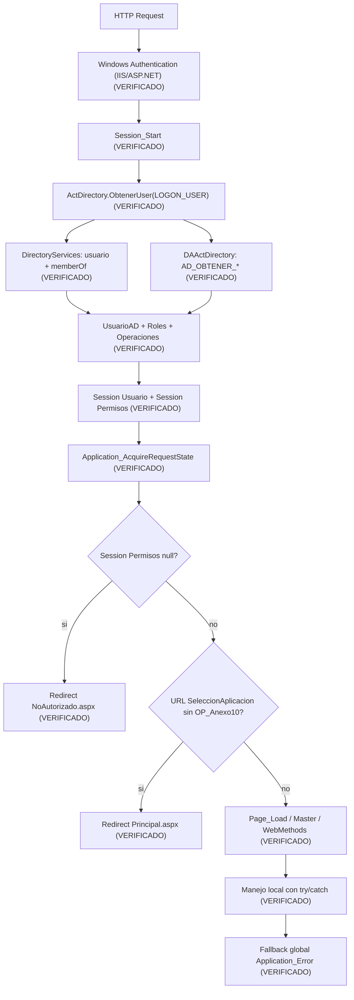

## 161. Modelo de identidad y Active Directory

### 161.1 Modelo consolidado AD -> roles -> operaciones

| Etapa | Implementacion observable | Clasificacion |
| --- | --- | --- |
| Identidad Windows | `Request.ServerVariables["LOGON_USER"]` en `Session_Start`. | HECHO VERIFICADO |
| Resolucion de usuario AD | `DirectorySearcher` en Global Catalog, filtro por `objectSid`; extrae `samaccountname`, `mail`, `name`. | HECHO VERIFICADO |
| Resolucion de grupos AD | `memberOf` de AD, filtro `grupo.Contains(codigoApp)` y exclusion de `INC`. | HECHO VERIFICADO |
| Mapeo a roles de aplicativo | `LActDirectory.ListarRoles()` -> `DAActDirectory` -> SP `AD_OBTENER_ROLES`; match por `DomainAplication`. | HECHO VERIFICADO |
| Mapeo a operaciones | `ListarOperacionesPorRol` -> SP `AD_OBTENER_OPERACIONES_POR_ROL`; union por diccionario con deduplicacion por clave. | HECHO VERIFICADO |
| Persistencia de contexto | `Session["Usuario"]` y `Session["Permisos"]`. | HECHO VERIFICADO |

### 161.2 Contratos visibles (sin inspeccion interna SQL)

| Capa | Componente | Contrato visible |
| --- | --- | --- |
| WEB | `ActDirectory` | `ObtenerUser`, `RolUsuarioAD`, `FindContentPermises` |
| BL | `LActDirectory` | `ListarRoles`, `ListarOperacionesPorRol` |
| DA | `DAActDirectory` | `AD_OBTENER_ROLES`, `AD_OBTENER_OPERACIONES_POR_ROL` |

### 161.3 Comportamiento ante error/no datos

| Escenario | Comportamiento |
| --- | --- |
| Falla en AD/mapper durante `Session_Start` | `catch` con logging de error AD; puede dejar Session incompleta. |
| `Session["Permisos"]` nulo en request | Redireccion global a `NoAutorizado.aspx`. |
| Grupo AD no mapeado a rol BD | Se omite (`continue`) en la union de roles. |

## 162. Roles, operaciones y autorizacion

### 162.1 Modelo consolidado de autorizacion

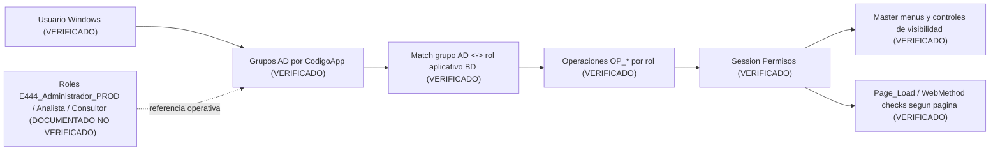

### 162.2 Semantica de roles/operaciones

| Regla | Estado |
| --- | --- |
| Un usuario puede pertenecer a multiples grupos/roles. | HECHO VERIFICADO |
| Operaciones finales son union de operaciones por rol. | HECHO VERIFICADO |
| Existe deduplicacion por clave de operacion en diccionario. | HECHO VERIFICADO |
| No se observa precedencia formal entre roles. | HECHO VERIFICADO |
| Nombres `dbo.AD_ROL_APLICATION`, `dbo.AD_OPERATION_APLICATION`, `dbo.AD_OPERATION_ROL_APLICATION` y dos FKs en tabla intermedia. | HECHO VERIFICADO (SQL DEV, DB0-DB1; evidencia incorporada posteriormente) |

### 162.3 Uso transversal de operaciones OP_*

| Superficie | Mecanismo | Estado |
| --- | --- | --- |
| Menus `Site.Master` (Encaje/reportes) | Visibilidad por `ActDirectory.FindContentPermises` con `OP_*`. | HECHO VERIFICADO |
| Menu `SiteAnexo10.Master` | Visibilidad por `OP_Anexo10`. | HECHO VERIFICADO |
| Menu `SiteBSEC.Master` | Visibilidad por `OP_BSEC`. | HECHO VERIFICADO |
| Varias paginas Encaje/A10/reportes | Validacion page-level en `Page_Load` + redirect `NoAutorizado`. | HECHO VERIFICADO |

## 163. Gaps conocidos de autorizacion

### 163.1 BSEC

- HECHO VERIFICADO:
- `OP_BSEC` controla visibilidad de menu en `SiteBSEC.Master`.
- `Views/BSEC/Procesamiento.aspx.cs` y `Views/BSEC/Maestro.aspx.cs` no realizan chequeo page-level de `OP_BSEC` en `Page_Load`.

- DOCUMENTADO PERO NO VERIFICADO:
- El comportamiento esperado reportado es restringir acceso directo URL a usuarios con `OP_BSEC`.

- Estado: `GAP DE AUTORIZACION CONOCIDO / PENDIENTE`.

### 163.2 Selector de aplicaciones

- HECHO VERIFICADO:
- `Application_AcquireRequestState` mantiene una condicion especial sobre `SeleccionAplicacion.aspx` basada en `OP_Anexo10`.

- DOCUMENTADO PERO NO VERIFICADO:
- Regla deseada: ingreso directo si tiene una sola superficie y selector si tiene 2 o mas (Encaje/A10/BSEC).

- Estado: `GAP FUNCIONAL CONOCIDO / PENDIENTE`.

### 163.3 TOSE

- HECHO VERIFICADO:
- `ReporteValidacion.aspx` y `ReporteValidacionDetalle.aspx` validan `OP_Reporte6`.
- `Site.Master` usa `OP_Reporte7` y `OP_Reporte8` para visibilidad de los menus TOSE.

- Estado: `DEFECTO DE AUTORIZACION CONOCIDO / PENDIENTE`.

## 164. AzMan / WCF residual

### 164.1 Artefactos presentes

| Artefacto | Evidencia | Clasificacion |
| --- | --- | --- |
| `UtilAzman.cs` | Clase completa con `AuthorizationClient`, `GetRoles`, `AccessCheck`. | HECHO VERIFICADO |
| Service reference `AuthorizationServices` | `Reference.cs`, `.svcmap`, `.xsd`, `WCFMetadata`. | HECHO VERIFICADO |
| Extensions WCF | `ServiceExtensions/*` con `MessageInspector`. | HECHO VERIFICADO |
| `serviceModel` bindings `AuthorizationEndpoint` | Definidos en `Web.config`. | HECHO VERIFICADO |

### 164.2 Flujo activo vs residual

| Punto | Estado |
| --- | --- |
| Uso activo de `UtilAzman` en autorizacion de pagina/menu | Residual/comentado en multiples paginas y master. HECHO VERIFICADO. |
| Endpoint cliente WCF activo en `Web.config` | El bloque `<client>` para `AuthorizationEndpointNet` esta comentado. HECHO VERIFICADO. |
| Flag `FlgAzman` | `Web.config` define `FlgAzman = S`; en `UtilAzman.ObtenerUser` el consumo de `GetRoles` ocurre solo si `FlgAzman != S`. HECHO VERIFICADO. |

Conclusion 164:

- `AzMan/WCF` se clasifica como `DEUDA LEGACY / ARTEFACTO RESIDUAL`.
- No hay evidencia suficiente de flujo runtime activo actual basado en AzMan desde el camino principal de autenticacion/autorizacion.

## 165. Session State y estado transversal

### 165.1 Configuracion Session State efectiva

| Parametro | Valor observado | Clasificacion |
| --- | --- | --- |
| `mode` | `InProc` | HECHO VERIFICADO |
| `cookieless` | `false` | HECHO VERIFICADO |
| `timeout` | No declarado explicitamente en `sessionState` de `Web.config`; aplica default de framework. | HECHO VERIFICADO + INFERENCIA TECNICA |

INFERENCIA TECNICA operativa:

- `InProc` implica dependencia de memoria del worker process; perdida de estado ante recycle/restart.

### 165.2 Variables Session nucleares (arranque global)

| Variable Session | Productor | Contenido | Dependencia | Consumidores |
| --- | --- | --- | --- | --- |
| `Session["Usuario"]` | `Global.Session_Start` | `UsuarioAD` (matricula, nombre, correo, roles, admin, operaciones) | Windows Auth + AD + mapper roles/ops | Masters, paginas y logging |
| `Session["Permisos"]` | `Global.Session_Start` | `Dictionary<int,string>` de `OP_*` | AD + BD roles/ops | `ActDirectory.FindContentPermises`, autorizacion de menus/paginas |

### 165.3 Inventario transversal de Session por categoria

| Categoria | Ejemplos | Dominios consumidores | Impacto |
| --- | --- | --- | --- |
| Identidad y autorizacion | `Usuario`, `Permisos` | Encaje, A10, BSEC, reportes, maestros | Critico para navegacion y seguridad funcional |
| Caches de reporte (DataTable) | `dtCabecera_*`, `dtSwiftOpe_*`, `dtReporteInf_*`, `dtCabecera3_*`, `dtReporteInf3_*`, `dtCabecera4_*`, `dtOpe4_*` | Reportes Encaje/TOSE | Consumo de memoria y acoplamiento por pantalla |
| A10 resumenes intermedios | `dtResumenLeasing`, `dtResumenCubo`, `dtResumenSaldos`, `dtResumenReporteSBS`, `dtResumenBalanceComprobacion`, `dyProductoCuentaRaiz` | Anexo10 | Objetos potencialmente grandes en memoria |
| BSEC output | `BSEC_ARCHIVO_RESULTADO` (`byte[]`), `BSEC_NOMBRE_ARCHIVO` | BSEC | Archivo en memoria por request/session |
| Estado UI/operacion | `fupArchivo`, `PeriodoReplica`, `dtOficinas` | Configuracion/Maestros | Estado transitorio por usuario |

### 165.4 Riesgos AS-IS de Session

| Riesgo | Evidencia | Clasificacion |
| --- | --- | --- |
| Perdida de estado al reciclar proceso | `InProc` + uso intensivo de Session para datos/bytes. | INFERENCIA TECNICA |
| Presion de memoria | Multiples `DataTable` y `byte[]` en Session por usuario. | HECHO VERIFICADO |
| Inconsistencia de naming | Uso mixto de `Session["Usuario"]` y `Session["usuario"]`. | HECHO VERIFICADO |
| Dependencia de Session para descargas | Reportes y BSEC dependen de estado previo en Session. | HECHO VERIFICADO |

## 166. Configuracion efectiva

Fuente vigente para esta caracterizacion:

- `Web.config`.

Estado de `Web_CERT.config` y `Web_PROD.config`:

- DOCUMENTADO PERO NO VERIFICADO como historicos/deprecados para runtime actual.

### 166.1 Configuracion transversal consolidada

| Bloque | Hallazgo principal | Clasificacion |
| --- | --- | --- |
| `authentication` | `Windows`. | HECHO VERIFICADO |
| `authorization` | `allow users="*"` (control fino ocurre en aplicacion via `Session["Permisos"]`). | HECHO VERIFICADO |
| `sessionState` | `InProc`, `cookieless=false`. | HECHO VERIFICADO |
| `customErrors` | `RemoteOnly` con redirect a `ErrorPagina.aspx`. | HECHO VERIFICADO |
| `appSettings` | Flags y rutas: `FlgAzman`, `CodigoApp`, `getlogger`, `ArchivoPath`, `Rutalog`, `RUTACARGA_*`, etc. | HECHO VERIFICADO |
| `connectionStrings` | `cnn_Encaje`, `cnn_EncajeAE`. | HECHO VERIFICADO |
| `system.serviceModel` | Bindings de `AuthorizationEndpoint*`; client endpoint comentado. | HECHO VERIFICADO |
| `system.webServer` | Headers de seguridad, `requestFiltering`, default document. | HECHO VERIFICADO |

### 166.2 Rutas y ubicaciones sensibles

Rutas UNC y hosts internos se redactan como `[REDACTED]` en este documento.

## 167. Connection strings y Always Encrypted

### 167.1 Matriz de connection strings observadas

| Nombre logico | Consumidores | Particularidad | Estado |
| --- | --- | --- | --- |
| `cnn_Encaje` | DA transversal (`DAActDirectory`, `DACarga`, reportes, parametros, helper, etc.) | Conexion principal compartida de la aplicacion. | HECHO VERIFICADO |
| `cnn_EncajeAE` | `DAInputs` (operaciones focalizadas de carga) | Incluye `Column Encryption Setting = Enabled;`. | HECHO VERIFICADO |
| `ConnectionStrings["BD"]` | `ParametrosVariables.aspx.cs` (referencia legacy observada) | No aparece definida en `Web.config` vigente y no surgio nueva evidencia de ejecucion real. | CODIGO RESIDUAL CONOCIDO / no reabrir salvo nueva evidencia |

### 167.2 Uso focal de `cnn_EncajeAE`

| Operacion visible | Implementacion | Dependencia |
| --- | --- | --- |
| Carga de acreedores | `DAInputs.ProcesarCargaAcreedores` con `SqlBulkCopy` y transaccion a `EB_M_GRANDESACREEDORES`. | `cnn_EncajeAE` |
| Carga residentes/no residentes | `DAInputs.ProcesarCargaResNoRes` con `SqlBulkCopy` y transaccion a `EB_M_RESIDENTESYNORES`. | `cnn_EncajeAE` |

Conclusion 167:

- Dependencia de columnas cifradas queda delimitada al uso focal de `cnn_EncajeAE` visible en cargas de inputs especificas.
- No se investigo criptografia SQL ni definicion interna de columnas.
- La referencia `ConnectionStrings["BD"]` se mantiene como codigo residual conocido, segun aclaracion operativa previa; no constituye una pregunta runtime activa mientras no aparezca nueva evidencia.

## 168. Infraestructura de archivos

### 168.1 Mapa transversal de patrones

| Patron | Dominio | Tipo | Persistencia | Infraestructura externa |
| --- | --- | --- | --- | --- |
| Upload HTTP | Configuracion Inputs (`UpFileHandler`, `CargaInputs`) | Entrada de archivo | Temporal en filesystem + validacion | Share/ruta configurada `[REDACTED]` |
| Copia a rutas de proceso | Carga Inputs/Maestros | Movimiento/copia | Archivo fisico | File shares `[REDACTED]` |
| Archivos en memoria Session | BSEC (`byte[]`), varios reportes | Estado temporal | Session InProc | No directa |
| Generacion XLSX | Encaje/A10/BSEC/reportes | Output documental | Temp path + descarga HTTP | Puede depender de templates compartidos |
| Generacion TXT | Reportes Encaje | Output documental | Stream/memoria + descarga HTTP | Puede disparar broad externo |
| Generacion `.110` + ZIP | Anexo10 ReporteFinal | Output regulatorio | ZIP en memoria/descarga | Dependencia de formato legacy |
| Descarga de logs | Principales (`Principal*`) | Archivo texto | Copia local temporal + descarga | Ruta de logs `[REDACTED]` |

### 168.2 File shares (redactado)

| Uso | Lectura/Escritura | Estado | Observaciones |
| --- | --- | --- | --- |
| `ArchivoPath` | Lectura/escritura | ACTIVA | Upload/lectura de archivos de entrada. Ruta redactada `[REDACTED]`. |
| `ArchivoMaestros` | Escritura/lectura | ACTIVA | Outputs de maestros. Ruta redactada `[REDACTED]`. |
| `RUTACARGA_DIARIO/MENSUAL/MAESTRO` | Escritura/lectura | ACTIVA | Cargas de inputs/maestros. Rutas redactadas `[REDACTED]`. |
| `Rutalog` / `ArchivoPathlog` / `Archivolog` | Lectura/escritura | ACTIVA/RESIDUAL mixto | Uso para descarga y rastreo de logs; coexisten nombres historicos. |

Disponibilidad/autenticacion:

- HECHO VERIFICADO: usa via IO de .NET (`File.Copy`, `File.ReadAllBytes`, `Path.Combine`).
- NO DETERMINADO: permisos exactos en share, identidad de proceso IIS y SLA de disponibilidad.

## 169. Librerias Excel/documentos

| Libreria | Flujos | Tipo de uso | Fuente |
| --- | --- | --- | --- |
| EPPlus | Reportes, A10, Configuracion (export/import), parte de validaciones | Lectura/escritura XLSX, plantillas y descarga | DLL local (`E444.Lib/EPPlus.dll`) + referencia en csproj |
| NPOI | BSEC, `CargaInputs`, `UpFileHandler` | Lectura XLS/XLSX, evaluacion de hojas/celdas, generacion workbook | NuGet (`NPOI`) |
| OpenXML (`DocumentFormat.OpenXml`) | Referenciada en proyecto | Soporte documental potencial | DLL local en raiz repo |
| OleDb | `CargaInputs` (`GetDataTableFromCsv`) | Lectura de texto/estructura tabular legacy | `System.Data.OleDb` |

Solapamiento tecnologico observable:

- HECHO VERIFICADO: coexisten EPPlus y NPOI para manejo de Excel en distintos flujos.
- HECHO VERIFICADO: conviven dependencias NuGet y DLL local para componentes documentales.

## 170. Logging

### 170.1 Modelo transversal de logging

| Componente | Funcion |
| --- | --- |
| `Util.pintaLog(level, msg, detalle)` | Punto central WEB para auditoria, seguridad y error tecnico. |
| `LogUtilBL` -> `LogUtilDA` | Persistencia de auditoria/seguridad en BD via SP (`EB_LOG_AUDITORIA_INSERT`, `EB_LOG_AUDITORIA_UPDATE`, `EB_LOG_SEGURIDAD_INSERT`). |
| `log4net` (`Util.log`) | Registro de errores (`level=3`) a archivo configurado. |

Semantica por nivel:

- `1`: auditoria (BD).
- `2`: seguridad/acceso (BD).
- `3`: error tecnico (log4net).
- `4`: update de auditoria (BD).

### 170.2 Cobertura de logging por area

| Area | Logging activo | Logging comentado/ausente | Evidencia |
| --- | --- | --- | --- |
| Global | `Application_Error` registra errores globales. | N/A | HECHO VERIFICADO |
| Encaje | Accesos, procesos y errores en multiples paginas de procesos/reportes. | Algunos bloques legacy comentados `NetLogger`. | HECHO VERIFICADO |
| Anexo10 | Accesos y errores en paginas clave. | N/A | HECHO VERIFICADO |
| BSEC | `PrincipalBSEC` y `SiteBSEC` con logs de acceso/errores. | `Procesamiento.aspx.cs` mantiene comentario de logging pendiente en `catch`; `Maestro` tiene comentarios de log en excepciones. | HECHO VERIFICADO |
| Integracion/jobs | Eventos de disparo broad/kill/procesos con `Util.pintaLog`. | No trazabilidad completa del job externo desde app para todos los casos. | HECHO VERIFICADO + NO DETERMINADO externo |

### 170.3 Hallazgos transversales

- HECHO VERIFICADO: existe logging funcional amplio, pero no uniforme al 100% en todos los catches.
- HECHO VERIFICADO: coexisten logging BD y archivo.
- INFERENCIA TECNICA: la observabilidad end-to-end de procesos externos depende de fuentes fuera de la app (SQL Agent/SSIS/IIS/log central).

## 171. Manejo global de errores

### 171.1 Manejo global vs local

| Nivel | Comportamiento |
| --- | --- |
| Local | Gran parte de paginas/webmethods envuelve logica en `try/catch`, registra por `Util.pintaLog` y retorna mensajes/redirect segun caso. |
| Global | `Application_Error` captura no manejadas, registra y redirige a `ErrorPagina.aspx`. |
| No autorizado | `Application_AcquireRequestState` y muchos `Page_Load` redirigen a `NoAutorizado.aspx` cuando falta permiso. |

### 171.2 Flujo consolidado de excepciones

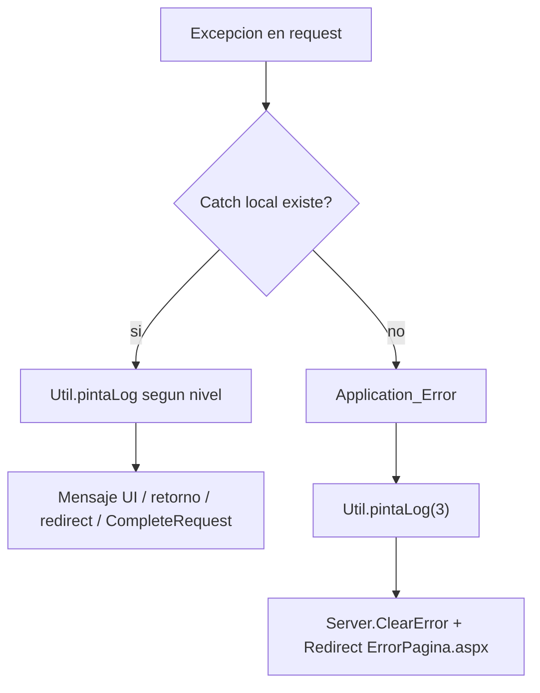

## 172. Integraciones externas

| Integracion | Consumidor | Direccion | Uso | Estado |
| --- | --- | --- | --- | --- |
| Active Directory | `ActDirectory`, `UtilAzman` | E444 -> AD | Identidad de usuario y grupos (`memberOf`). | ACTIVA |
| SQL Server aplicacion | DA transversal | E444 <-> SQL | SP, consultas y persistencia de negocio/log. | ACTIVA |
| File shares `[REDACTED]` | Configuracion/reportes/principales | E444 <-> Share | Carga, lectura, outputs, logs. | ACTIVA |
| SQL Agent (via SQL) | `DAReporte1`, `DAReporte5`, `DAMatrizCuenta`, `DACarga` | E444 -> SQL/MSDB/SP | Start job, kill/cancel y monitoreo de procesos expuestos por SP. | ACTIVA |
| WCF AuthorizationServices/AzMan | `UtilAzman`, service references | E444 -> WCF | Artefacto legacy de autorizacion externa. | RESIDUAL |
| SMTP/otros servicios HTTP REST | No encontrado en codigo revisado | N/A | N/A | NO DETERMINADO / no evidencia |

## 173. SQL Agent

### 173.1 Invocaciones visibles desde C#

| Flujo | Accion C# | Job visible | Monitoreo | Resultado conocido |
| --- | --- | --- | --- | --- |
| Reporte1 broad MN/ME | `EXEC sp_start_job` en `DAReporte1.generalBroad` | `E444_BROAD_RPT1_MN`, `E444_BROAD_RPT1_ME` | No polling posterior en esa ruta; solo try/catch local de disparo. | Trigger externo ejecutado o excepcion local |
| Reporte5 broad MN/ME | `EXEC sp_start_job` en `DAReporte5.generalBroad` | `E444_BROAD_RPT5_MN`, `E444_BROAD_RPT5_ME` | No polling posterior en esa ruta; solo try/catch local de disparo. | Trigger externo ejecutado o excepcion local |
| MatrizCuenta kill | `EB_KILL_JOB_COLLECTOR(@JOB_NAME,@usuario)` | Nombre de job recibido por parametro | Respuesta por mensaje de salida SP | Estado textual devuelto |
| Proceso Encaje (control) | `EB_SP_CONSULTARPROCESO`, `EB_SP_CERRARPROCESO`, `EB_SP_DETENERPROCESO`, `EB_PROCESAR_STATUS` | Job interno no nombrado explicitamente desde C# | Si existe consulta/cierre por id/estado via SP | Seguimiento indirecto visible via SP |

### 173.2 Casos de trigger externo sin monitoreo aplicativo

| Caso | Clasificacion |
| --- | --- |
| `sp_start_job` broad en reportes 1/5 sin tracking posterior app-level en el mismo flujo de descarga | `EXTERNAL TRIGGER WITHOUT APPLICATION-LEVEL MONITORING` (HECHO VERIFICADO) |

## 174. ETL / SSIS

### 174.1 ETL de carga de inputs

| Hallazgo | Clasificacion |
| --- | --- |
| `LCarga.ProcesarInput` -> `DACarga.EB_PROCESAR_INPUT` para procesamiento de inputs. | HECHO VERIFICADO |
| Existen cargas directas con `SqlBulkCopy` y TVP en `DAInputs` para ciertos datasets/coberturas. | HECHO VERIFICADO |
| Que porcentaje del pipeline depende internamente de SSIS no es visible desde C# sin abrir SP/jobs/paquetes. | NO DETERMINADO externo |

### 174.2 ETL de calculo Encaje

| Hallazgo | Clasificacion |
| --- | --- |
| `LCarga.Procesar` -> `DACarga.EB_CALCULAR_ENCAJE` (timeout alto) como trigger principal de calculo. | HECHO VERIFICADO |
| Existen operaciones de estado/control (`EB_VALIDAR_ESTADO`, `EB_PROCESAR_STATUS`, `EB_SP_CONSULTARPROCESO`, `EB_SP_CERRARPROCESO`, `EB_SP_DETENERPROCESO`). | HECHO VERIFICADO |
| Nombre operativo reportado del job: `JOB_E444_SSIS_CalculaEncaje_Monitor`. | DOCUMENTADO PERO NO VERIFICADO — fuente: conocimiento operativo del responsable. |
| El literal `JOB_E444_SSIS_CalculaEncaje_Monitor` no aparece en el C# revisado del baseline actual. | HECHO VERIFICADO |
| Relacion exacta SP -> SQL Agent -> paquete SSIS interno no determinable desde repo C# sin inspeccion externa. | NO DETERMINADO externo |

## 175. AS-IS vs evolucion paralela

### 175.1 AS-IS baseline actual

- Cargas de inputs y calculo Encaje dependen de contratos SP visibles desde C# y, en partes, de procesos externos no observables internamente.
- Se observan triggers SQL Agent visibles para broad reportes y control de procesos.

### 175.2 Evolucion paralela conocida (sin inspeccion)

- DOCUMENTADO PERO NO VERIFICADO - EVOLUCION PARALELA:
- desacople de parte del ETL de carga de inputs;
- permanencia de ETL para calculo de Encaje.

Regla aplicada:

- No se mezclaron hallazgos de la rama paralela con el AS-IS del baseline actual.

## 176. Deployment y publicacion

| Evidencia repo | Hallazgo | Clasificacion |
| --- | --- | --- |
| `Properties/PublishProfiles/FolderProfile*.pubxml` | Publicacion FileSystem a carpeta local (`PublishUrl`), configuracion Release/AnyCPU. | HECHO VERIFICADO |
| Ausencia de pipelines (`.github/workflows`, `azure-pipelines`, `Jenkinsfile`, `.gitlab-ci.yml`) | No evidencia de CI/CD en repo. | HECHO VERIFICADO |
| Mecanismo operativo de copiar a carpeta fisica IIS despues de publish | Flujo manual reportado previamente. | DOCUMENTADO PERO NO VERIFICADO |

## 177. Build / tooling

| Aspecto | Hallazgo |
| --- | --- |
| Plataforma | ASP.NET Web Forms sobre .NET Framework 4.8 (`E444.WEB.csproj`). |
| Tooling base | `Microsoft.CSharp.targets` + `Microsoft.WebApplication.targets` (MSBuild/Visual Studio clasico). |
| Dependencias | Mixto NuGet + DLL locales (`E444.Lib/EPPlus.dll`, `DocumentFormat.OpenXml.dll`). |
| Service references | WCF metadata/references incluidos en proyecto. |

Clasificacion:

- HECHO VERIFICADO en estructura de proyecto.
- INFERENCIA TECNICA: tooling operativo esperado en Visual Studio/MSBuild clasico.

## 178. IIS e infraestructura visible

| Punto | Estado |
| --- | --- |
| App web ASP.NET clasica | HECHO VERIFICADO |
| Windows Authentication en app | HECHO VERIFICADO |
| `sessionState InProc` | HECHO VERIFICADO |
| `defaultDocument` en `Web.config` (SeleccionAplicacion.aspx) | HECHO VERIFICADO |
| Security headers / request filtering configurados en `system.webServer` | HECHO VERIFICADO |
| AppPool exacto, identity de AppPool, bindings, recycle policy, pipeline mode real de IIS productivo | NO DETERMINADO |

## 179. Ambientes

Modelo operativo vigente documentado:

- En DEV, CERT y PROD la fuente efectiva de configuracion es `Web.config`.
- Los valores dentro de `Web.config` se ajustan por ambiente.
- `Web_CERT.config` y `Web_PROD.config` existen en el repositorio, pero estan deprecados y NO representan la fuente de runtime actual.

| Aspecto | DEV | CERT | PROD | Clasificacion |
| --- | --- | --- | --- | --- |
| Fuente efectiva de configuracion | `Web.config` con valores DEV | `Web.config` con valores CERT | `Web.config` con valores PROD | DOCUMENTADO PERO NO VERIFICADO operativamente + `Web.config` HECHO VERIFICADO en repo |
| `Web_CERT.config` / `Web_PROD.config` | No aplican como runtime vigente | Artefacto deprecado | Artefacto deprecado | DOCUMENTADO PERO NO VERIFICADO |
| Connection principal | `cnn_Encaje` con valores del ambiente | `cnn_Encaje` con valores del ambiente | `cnn_Encaje` con valores del ambiente | DOCUMENTADO PERO NO VERIFICADO para valores efectivos de cada runtime |
| Shares/rutas | Valores propios del ambiente en `Web.config` | Valores propios del ambiente en `Web.config` | Valores propios del ambiente en `Web.config` | DOCUMENTADO PERO NO VERIFICADO operativamente |
| Publicacion | Publish FileSystem + copia manual reportada | Publish FileSystem + copia manual reportada | Publish FileSystem + copia manual reportada | HECHO VERIFICADO para perfil FileSystem + DOCUMENTADO PERO NO VERIFICADO para operacion runtime |

No se reproducen hosts, credenciales, connection strings completas ni rutas internas.

## 180. Operabilidad

| Proceso | Deteccion fallo | Reintento | Cancelacion | Observabilidad |
| --- | --- | --- | --- | --- |
| Calculo Encaje (`EB_CALCULAR_ENCAJE`) | Estado/resultado via SP (`EB_PROCESAR_STATUS`, validaciones de estado) + logs de app. | Manual (nuevo disparo de proceso). | `EB_SP_DETENERPROCESO` y `EB_SP_CERRARPROCESO` expuestos. | Media: app ve estado sintetico via SP; detalle interno externo no visible |
| Procesamiento Inputs (`EB_PROCESAR_INPUT` y cargas) | Mensajes de retorno + logs + archivos de error. | Manual por usuario. | Parcial via `Detener` de maestros/proceso segun flujo. | Media |
| Broad reportes 1/5 (`sp_start_job`) | Error local de disparo en app. | Manual relanzando accion. | No se observa cancelacion en mismo flujo broad. | Baja en app; depende de monitoreo externo |
| BSEC procesamiento | Excepcion local + alerta UI + opcion de reproceso. | Manual (reprocesar archivo). | N/A (sin asincronia externa visible). | Alta dentro de request; sin trazabilidad externa |

## 181. Dependencias binarias

| Categoria | Ejemplo | Estado |
| --- | --- | --- |
| DLL local en repo | `E444.Lib/EPPlus.dll`, `DocumentFormat.OpenXml.dll` | HECHO VERIFICADO |
| NuGet clasico (`packages.config`) | `NPOI`, `log4net`, `Newtonsoft.Json`, `System.*`, `Microsoft.Extensions.*`, etc. | HECHO VERIFICADO |
| Assemblies framework | `System.Web`, `System.ServiceModel`, `System.DirectoryServices` | HECHO VERIFICADO |
| WCF generated proxies | `Service References/AuthorizationServices/Reference.cs` | HECHO VERIFICADO |

Dependencias con impacto de migracion/build:

- coexistencia NuGet + DLL local;
- dependencia de targets de WebApplication;
- arrastre de artefactos WCF/AzMan legacy.

## 182. Artefactos legacy/residuales

| Artefacto | Estado AS-IS | Evidencia | Accion conocida futura |
| --- | --- | --- | --- |
| AzMan/WCF (`UtilAzman`, service references, endpoint cliente comentado) | RESIDUAL | Codigo y config presentes; consumo principal comentado/no activo en flujo observado | NO DETERMINADO |
| `Web_CERT.config` y `Web_PROD.config` | RESIDUAL/DEPRECADO | Archivos presentes; no son fuente vigente de runtime | DOCUMENTADO PERO NO VERIFICADO: deben retirarse/limpiarse posteriormente, sin hacerlo durante esta caracterizacion |
| `ConnectionStrings["BD"]` en `ParametrosVariables.aspx.cs` | RESIDUAL | Referencia en codigo sin definicion visible en `Web.config` vigente; aclaracion operativa previa la clasifica como codigo muerto/residual | Mantener como residual salvo nueva evidencia de ejecucion |
| Carpeta `PFX` con certificados y archivos asociados | RESIDUAL SENSIBLE | Archivos `.cer`, `.csr`, `.txt` y zip versionados en repo | DOCUMENTADO PERO NO VERIFICADO: no deberia estar versionada; limpieza ya realizada en la evolucion paralela `feature/NIIFRRCC-18032-actualizacion-contingencia` |
| `E444.Lib` (carpeta, no proyecto) con `EPPlus.dll` | ACTIVA en baseline actual | Referencia directa en csproj | DOCUMENTADO PERO NO VERIFICADO - EVOLUCION PARALELA indica retiro en rama 18032 |
| Referencias csproj a publish profiles no presentes (`Encaje.pubxml`, `encajecerti.pubxml`, `nuevecito.pubxml`) | RESIDUAL | csproj lista perfiles distintos a los observados en carpeta actual (`FolderProfile*`) | NO DETERMINADO |

## 183. Comparativa transversal Encaje/A10/BSEC

| Aspecto | Encaje | Anexo 10 | BSEC |
| --- | --- | --- | --- |
| Autorizacion | Menu + chequeo page-level en varias paginas (`OP_*`). | Menu + chequeo page-level (`OP_Anexo10`). | Menu por `OP_BSEC`; sin chequeo page-level en `Procesamiento`/`Maestro`. |
| Session | Uso intensivo (`Usuario`, `Permisos`, DataTables reportes). | Uso intensivo (`Usuario`, `Permisos`, DataTables resumen/ajustes). | Uso de `Usuario`/`Permisos` + `byte[]` resultado BSEC. |
| Persistencia | Fuerte uso DB/SP para calculos/reportes/control. | Uso DB/SP en inputs/ajustes/reportes. | Maestro BSEC en DB; resultado de procesamiento en Session/descarga. |
| Procesamiento archivos | TXT/XLSX/descargas/reportes. | Inputs y output regulatorio `.110`/ZIP. | Consolidado Excel + output Excel. |
| Excel/documentos | EPPlus + NPOI segun flujo. | EPPlus + NPOI segun flujo. | NPOI (lectura/generacion) en procesamiento. |
| Procesamiento diferido | Presente (calculo, estados, broad). | Menor evidencia de asincronia externa visible. | No evidencia de asincronia externa en procesamiento principal. |
| Jobs/ETL | Trigger/monitoreo indirecto visible via SP + `sp_start_job` en broad. | No evidencia directa de `sp_start_job` en rutas A10 revisadas. | Sin `sp_start_job` visible en BSEC. |
| Outputs | Reportes xlsx/txt, descargas varias. | Reportes xlsx + `.110`/ZIP. | XLSX de Balance Sectorial en descarga. |
| Infraestructura compartida | AD, Session InProc, `cnn_Encaje`, logging, file shares | AD, Session InProc, `cnn_Encaje`, logging, file shares | AD, Session InProc, `cnn_Encaje`, logging, file shares |

## 184. Grafo de dependencias compartidas

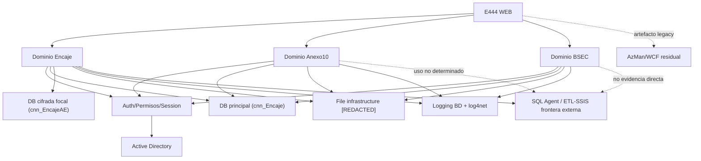

Nota metodologica obligatoria:

- Compartir Web app, auth, Session, helper, connection strings o base fisica NO demuestra por si solo que Encaje, A10 y BSEC deban pertenecer al mismo boundary futuro.
- La ausencia de llamadas BL/DA cruzadas tampoco demuestra por si sola que deban desplegarse separados.

## 185. Deuda tecnica transversal

| Categoria | Evidencia AS-IS | Superficie afectada | Impacto en migracion |
| --- | --- | --- | --- |
| Seguridad/autorizacion | GAP BSEC page-level; inconsistencia TOSE (`OP_Reporte6` vs `OP_Reporte7/8`). | BSEC y TOSE | Riesgo de acceso indebido o reglas inconsistentes |
| Session/estado | `InProc`, objetos grandes en Session, naming mixto `Usuario/usuario`. | Toda la app | Fragilidad operativa y consumo de memoria |
| Configuracion | Config deprecada coexistente + referencia `BD` residual sin definicion en config vigente. | Configuracion/reportes | Riesgo de drift de ambientes y confusion por artefactos legacy |
| Integraciones | AzMan/WCF residual + frontera externa SQL Agent/SSIS sin observabilidad total en app. | Auth legacy + procesos diferidos | Complejidad de estabilizacion |
| ETL/jobs | Triggers externos sin monitoreo app-level completo (broad). | Reportes Encaje | Riesgo operativo y troubleshooting |
| Archivos | Dependencia de shares y rutas externas; sensibilidad de permisos/I/O. | Inputs/reportes/logs | Riesgo de fallas por infraestructura |
| Logging/observabilidad | Cobertura amplia pero no uniforme en todos los catches. | Varias areas (incluye BSEC) | Diagnostico incompleto en ciertos fallos |
| Deployment | Publish FileSystem + despliegue manual reportado; ausencia CI/CD en repo. | Operacion release | Riesgo humano y variabilidad |
| Dependencias binarias | Mezcla NuGet + DLL local + artefactos legacy versionados. | Build/deploy | Deuda de mantenibilidad |
| Testing | Sin proyectos unitarios/integracion visibles en repo. | Todo E444 | Alta dependencia de prueba manual |

## 186. Backlog externo SQL Agent / ETL

| ID | Pregunta | Sistema externo |
| --- | --- | --- |
| E444-EXT-001 | Confirmar tecnicamente el encadenamiento `EB_CALCULAR_ENCAJE` -> `JOB_E444_SSIS_CalculaEncaje_Monitor` -> paquete SSIS y su contrato de parametros/estado. | SQL Agent / SSIS |
| E444-EXT-002 | Como mapea `EB_PROCESAR_INPUT` a procesos ETL internos por tipo de input? | SQL Agent / SSIS |
| E444-EXT-003 | Cual es la semantica exacta de estados de `EB_PROCESAR_STATUS` y `EB_VALIDAR_ESTADO`? | SQL / SQL Agent |
| E444-EXT-004 | Que politicas de reintento/timeout/concurrencia tienen los jobs broad (`E444_BROAD_RPT1_*`, `E444_BROAD_RPT5_*`)? | SQL Agent |
| E444-EXT-005 | Que dependencias de file share/staging usa cada job ETL critico? | SQL Agent / SSIS / Infra |
| E444-EXT-006 | Que alertas/telemetria externa existen para fallos de jobs disparados por E444? | SQL Agent / Monitoreo |

## 187. Backlog infraestructura / IIS

| ID | Pregunta | Sistema externo |
| --- | --- | --- |
| E444-INFRA-001 | Cual es el App Pool real (nombre, identity, pipeline mode) del sitio productivo? | IIS |
| E444-INFRA-002 | Cuales son politicas reales de recycle y su impacto en Session InProc? | IIS |
| E444-INFRA-003 | Que permisos efectivos tiene la identidad IIS sobre shares `[REDACTED]`? | IIS / File Server |
| E444-INFRA-004 | Cual es el procedimiento operativo de publish/copy/rollback actualmente usado? | Operacion / IIS |
| E444-INFRA-005 | Que bindings/TLS/certificados estan activos en runtime y como se gestionan? | IIS / Seguridad |
| E444-INFRA-006 | Existe balanceo y, de existir, como se garantiza afinidad de sesion para InProc? | Infraestructura |

## 188. Estado de preguntas 2E y pendientes externos

La referencia `ConnectionStrings["BD"]` NO se mantiene como pregunta abierta: fue clasificada previamente como codigo residual conocido y no aparecio nueva evidencia que justifique reabrirla.

### 188.1 Preguntas activas que requieren fuentes externas

| ID | Pregunta | Prioridad | Evidencia actual | Fuente necesaria | Fase |
| --- | --- | --- | --- | --- | --- |
| Q2E-002 | Mapeo exacto SP de proceso -> job/paquete ETL | ALTA | Se observan triggers SP y algunos `sp_start_job`, pero no el mapping interno completo | SQL Agent + SSIS | Externa ETL |
| Q2E-003 | Politicas reales de AppPool/recycle y su impacto sobre Session InProc | ALTA | No visible en repo | IIS operativo | Infra |
| Q2E-004 | Permisos efectivos y disponibilidad/SLA de shares criticos `[REDACTED]` | ALTA | Uso en codigo visible; permisos/SLA no visibles | File Server + seguridad | Infra |
| Q2E-005 | Monitoreo externo para jobs broad y procesos de calculo | MEDIA | App no muestra tracking completo de broad | SQL Agent/observabilidad | Externa ETL |

### 188.2 Pregunta cerrada durante saneamiento

| ID | Estado | Resolucion |
| --- | --- | --- |
| Q2E-001 | CERRADA / NO REABRIR SIN NUEVA EVIDENCIA | `ConnectionStrings["BD"]` se mantiene como codigo residual/muerto conocido; su referencia en `ParametrosVariables.aspx.cs` ya era conocida y no existe definicion en `Web.config` vigente. |

Las preguntas activas de esta seccion son externas al repositorio y no requieren continuar leyendo C# para cerrar 2E.

Resultado del saneamiento documental:

- Baseline corregido a `feature/NIIFRRCC-18028-migracion-e079`.
- `ConnectionStrings["BD"]` permanece residual y Q2E-001 queda cerrada.
- Modelo de configuracion por ambiente reconciliado: `Web.config` es la fuente efectiva en DEV/CERT/PROD; transforms historicos estan deprecados.
- Nombre operativo del job de calculo preservado como `JOB_E444_SSIS_CalculaEncaje_Monitor` y separado de la evidencia C#.
- Estado futuro conocido de `PFX` y configs deprecadas registrado como DOCUMENTADO PERO NO VERIFICADO.

## 189. Gates de completitud

| Gate | Estado |
| --- | --- |
| Lifecycle global entendido | CUMPLIDO |
| Autenticacion entendida | CUMPLIDO |
| AD y modelo de identidad entendidos | CUMPLIDO |
| Roles/operaciones consolidados | CUMPLIDO |
| Autorizacion transversal documentada | CUMPLIDO |
| Gaps conocidos separados del AS-IS | CUMPLIDO |
| Session State caracterizado | CUMPLIDO |
| Configuracion efectiva identificada | CUMPLIDO |
| Connection strings clasificadas | CUMPLIDO |
| Infraestructura de archivos caracterizada | CUMPLIDO |
| Logging caracterizado | CUMPLIDO |
| Manejo de errores caracterizado | CUMPLIDO |
| Integraciones externas catalogadas | CUMPLIDO |
| AzMan correctamente clasificado | CUMPLIDO |
| SQL Agent visible caracterizado | CUMPLIDO |
| ETL/SSIS visible caracterizado hasta frontera externa | CUMPLIDO CON NO DETERMINADO EXTERNO |
| AS IS vs evolucion paralela separados | CUMPLIDO |
| Deployment actual documentado | CUMPLIDO |
| IIS visible documentado | CUMPLIDO CON NO DETERMINADO EXTERNO |
| Ambientes delimitados | CUMPLIDO CON NO DETERMINADO EXTERNO |
| Dependencias binarias relevantes documentadas | CUMPLIDO |
| Operabilidad caracterizada | CUMPLIDO |
| Dependencias compartidas por dominios consolidadas | CUMPLIDO |
| Preguntas externas delimitadas | CUMPLIDO |

Resultado gates 2E:

- No existen gates en estado `NO CUMPLIDO`.
- Estado formal: `PASADA 2E - COMPLETA`.

Evaluacion de salida de caracterizacion del repositorio:

- Pregunta: Existe todavia alguna pregunta critica del AS IS de E444 que pueda responderse exclusivamente leyendo mas codigo/configuracion de este repositorio?
- Respuesta: NO.

Declaracion de readiness:

- `CARACTERIZACION AS-IS DEL REPOSITORIO E444 - SUFICIENTEMENTE COMPLETA PARA INICIAR FASE DE BASE DE DATOS`.

## 190. Conclusion PASADA 2E

Conclusion ejecutiva:

1. E444 funciona como una aplicacion monolitica legacy con controles transversales compartidos de autenticacion Windows, sesion InProc, autorizacion por operaciones `OP_*`, logging central y fuerte dependencia de SQL + filesystem.
2. El modelo de identidad es hibrido AD+BD (grupos AD + mapeo de roles/operaciones en SQL), materializado en `Session["Permisos"]`.
3. Los dominios Encaje, A10 y BSEC comparten infraestructura y mecanismos tecnicos, pero esa convergencia tecnica no decide boundaries futuros.
4. Las mayores incertidumbres remanentes ya no estan en codigo C#: se concentran en SQL Agent/SSIS, infraestructura IIS y permisos/disponibilidad de shares.
5. Se separo explicitamente AS IS del baseline frente a evolucion paralela conocida, sin mezclar evidencia de rama alterna.

Constancias metodologicas de esta pasada:

- No se realizo reverse engineering interno de Stored Procedures.
- No se consulto la base de datos.
- No se inspecciono SQL Agent.
- No se inspecciono SSIS.
- No se conecto a Active Directory ni IIS.
- No se cambio de rama.
- No se inspecciono la rama alternativa.
- No se modifico codigo.
- No se comparo contra DNET.
- No se diseno arquitectura TO-BE.
- No se tomaron decisiones de boundaries.

## 191. Conciliacion incremental Repository ↔ Database (DB0-DB1, posterior a PASADAS 0-2E)

**Alcance y procedencia.** Esta seccion refleja hallazgos obtenidos *posteriormente* desde metadata y definiciones SQL de la BD DEV (`E444_DATABASE_TECHNICAL_REFERENCE.md`, DB0-DB1). **No reescribe la historia de las pasadas 0-2E:** las afirmaciones originales como «no se consulto la BD» siguen siendo ciertas para esas ejecuciones. La autoridad para detalles fisicos y SQL internos permanece en Database Technical Reference; aqui solo se reconcilian interpretaciones y preguntas que afectan el AS-IS del aplicativo.

| Tema | Evidencia nueva y efecto de conciliacion | Estado / frontera |
| --- | --- | --- |
| Seguridad AD+BD | Tabla intermedia real `dbo.AD_OPERATION_ROL_APLICATION` (no `AD_OPERACION_ROL_APLICATION`) con FKs a `AD_ROL_APLICATION` y `AD_OPERATION_APLICATION`. | HECHO VERIFICADO SQL; nomenclatura corregida en §15 y §162. |
| Base fisica/schemas | Una base DEV compartida; `dbo`: 186 tablas/282 SP, `BSEC`: 1 tabla/7 SP. | HECHO VERIFICADO SQL DEV; **no** determina ownership ni boundaries. |
| A10 Inputs mensuales | Dos SP de persistencia realizan `DELETE` por `CODIGO_MES` exceptuando agencias 334/336, seguido de `INSERT` desde TVP. Sin `BEGIN TRAN/COMMIT/ROLLBACK` explicitos en semillas A10 revisadas. | HECHO VERIFICADO SQL; A10-BD-01 PARCIALMENTE RESUELTA: falta atomicidad conjunta, fallos inter-SP y sentido de excepciones. |
| A10 Anexo B | `SP_A10_DEL_CIERRE_DEF` reactiva inventario de oficina por `UPDATE` previo a `DELETE`. | HECHO VERIFICADO SQL; efecto no observable desde el contrato C# de baja. |
| BSEC Maestro/Procesamiento | `BSEC.SP_MAESTRO_CLASIFICACION_SELECT` lee `BSEC.MAESTRO_CLASIFICACION_SECTORIAL` y filtra `ESTADO = 1`. | HECHO VERIFICADO SQL; BSEC-BD-05 RESUELTA; BSEC-BD-01 PARCIAL. |
| BSEC concurrencia | `BSEC.SP_MAESTRO_CLASIFICACION_EXISTE_ACTIVO` valida mediante `EXISTS` sin lock hints ni transaccion explicita. | HECHO VERIFICADO SQL sobre el SP; unicidad atomica por constraints/indices sigue NO DETERMINADA (BSEC-BD-02 / DB1-NQ-01). |
| Plataforma SQL | Motor SQL Server `16.0.4295.3` (**familia SQL Server 2022**) y `compatibility_level = 110` (**nivel SQL Server 2012**). | HECHO VERIFICADO para valores SQL; INFERENCIA TECNICA: deuda de compatibilidad/modernizacion que merece evaluacion. NO DETERMINADO: relacion causal con incidentes historicos de CTE/compilacion o diferencia entre herramientas de despliegue. |

**Estado incremental:** Repository AS-IS PASADAS 0-2E permanece CERRADO. DB0-DB1 permanece COMPLETO. Las preguntas SQL no agotadas (Encaje/SQL Agent-SSIS, A10-BD-01..03, BSEC-BD-01..04/06..07) se mantienen en el documento de BD para su siguiente slice; no se selecciona TO-BE ni se definen boundaries.
