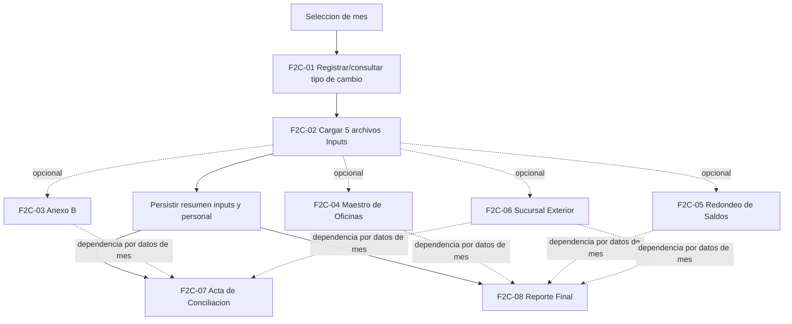
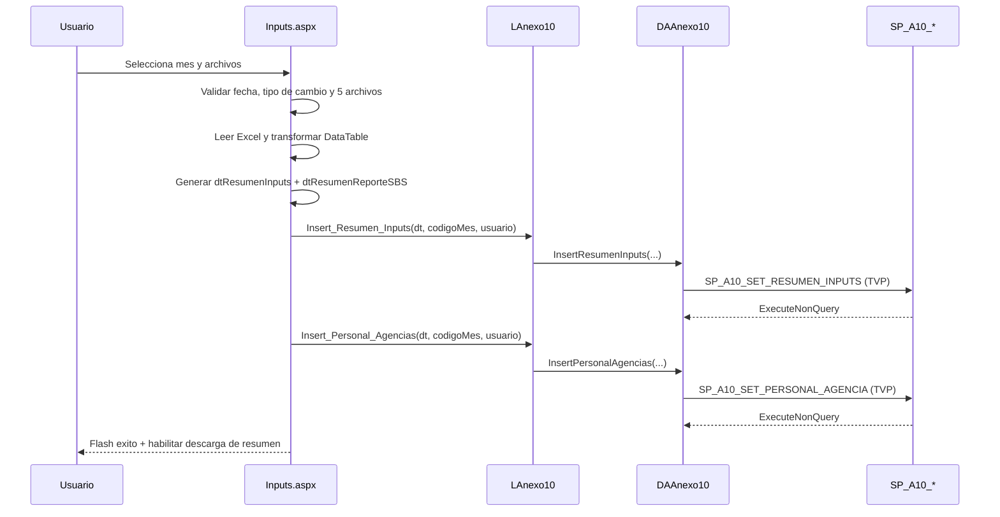
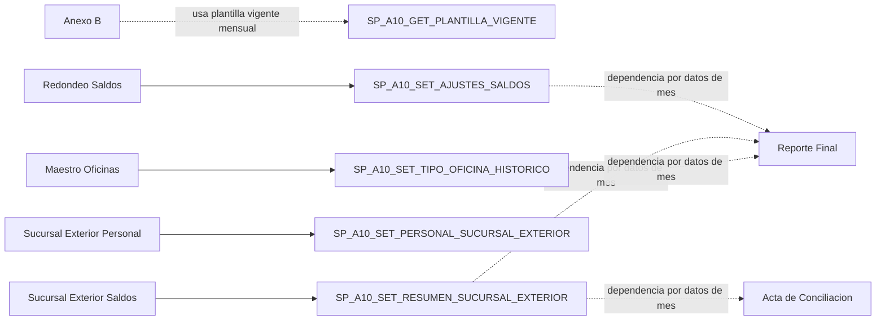

# PASADA 2C - ANEXO 10 PROFUNDO
## 103. Objetivo y alcance 2C
Pregunta rectora de esta pasada:
- Como funciona realmente Anexo 10 de extremo a extremo dentro de la aplicacion legacy (flujos, reglas visibles, persistencia observable y trazabilidad E2E desde codigo).

Alcance efectivo de 2C:
- 7 paginas funcionales de Anexo 10:
1. `Views/Anexo10/Inputs.aspx`
2. `Views/Anexo10/Ajustes/AnexoB.aspx`
3. `Views/Anexo10/Ajustes/MaestroOficinas.aspx`
4. `Views/Anexo10/Ajustes/RedondeoSaldos.aspx`
5. `Views/Anexo10/Ajustes/SucursalExterior.aspx`
6. `Views/Anexo10/ActaConciliacion.aspx`
7. `Views/Anexo10/ReporteFinal.aspx`
- Componentes transversales usados por esos flujos: `SiteAnexo10.Master(.cs)`, `LAnexo10`, `DAAnexo10`, `helper`, `Flash`, `ValidacionException`, `UsuarioAD`.

Fuera de alcance en esta pasada:
- Reverse engineering interno de SP.
- Consulta directa a BD.
- Decision de boundaries definitivos.
- Diseno TO-BE / comparacion legacy -> DNET.
- Profundizacion BSEC.

Baseline operativo mantenido:
- Rama de trabajo: `feature/NIIFRRCC-18028-migracion-e079`.
- Sin cambio de rama ni inspeccion de rama alternativa.
- Sin cambios de codigo aplicativo; solo actualizacion documental.

## 104. Macroflujo funcional Anexo 10
Casos de uso troncales identificados:
- `F2C-01`: Gestion de tipo de cambio mensual.
- `F2C-02`: Carga multiarchivo de Inputs y consolidacion.
- `F2C-03`: Ajustes Anexo B (cierres temporales/definitivos).
- `F2C-04`: Maestro de Oficinas (filtro, cambio tipo, historico).
- `F2C-05`: Redondeo de Saldos (alta/edicion/eliminacion).
- `F2C-06`: Sucursal Exterior (personal y saldos).
- `F2C-07`: Acta de Conciliacion (consulta y exportacion).
- `F2C-08`: Reporte Final (`.110` + Excel + ZIP).

Clasificacion de relaciones de flujo:
- Obligatorio observado por codigo: `F2C-01` y `F2C-02` para la carga mensual completa de Inputs.
- Opcional observado por codigo: `F2C-03`..`F2C-06` (no hay gate tecnico que fuerce su ejecucion previa).
- Dependencia inferida por datos (no gate explicito): `F2C-02` alimenta resultados usados en `F2C-07` y potencialmente en `F2C-08` via SP.



## 105. Inputs - flujo global

Ficha estandar del flujo principal:

| Campo | Contenido |
| --- | --- |
| ID | `F2C-02` |
| Nombre | Carga mensual de Inputs Anexo 10 |
| Proposito | Validar 5 archivos obligatorios, transformar datos a `DataTable`, consolidar montos/personal y persistir por `CODIGO_MES`. |
| Actor/permisos | `Usuario` con `OP_Anexo10` (gate en `Page_Load` y menu). |
| Pantalla | `Views/Anexo10/Inputs.aspx` |
| Precondiciones | Mes valido `yyyy-MM`; tipo de cambio registrado en el mes (`ViewState["TIPO_CAMBIO"]` no nulo); 5 archivos presentes. |
| Inputs | `txtFecha`, `txtTipoCambio`, `fuArchivos` (`AllowMultiple=true`). |
| Validaciones | Conteo exacto de archivos, extension Excel, tipos de archivo requeridos por nombre, estructura (hoja/columnas), consistencias de periodo/valor. |
| Pasos | 1. Validar fecha. 2. Validar tipo de cambio. 3. Validar archivos requeridos. 4. Validar estructura por archivo. 5. Transformar a `DataTable` por origen. 6. Consolidar a `dtResumenInputs`. 7. Persistir TVP resumen + TVP personal. 8. Guardar resumenes en Session y habilitar descarga. |
| BL | `Select_Producto_Cuenta_Raiz`, `GetTipoCambio`, `SetTipoCambio`, `Insert_Resumen_Inputs`, `Insert_Personal_Agencias`. |
| DA | `GetProductosCuentaRaiz`, `GetTipoCambio`, `SetTipoCambio`, `InsertResumenInputs`, `InsertPersonalAgencias`. |
| SP | `SP_A10_PRODUCTO_CUENTA_RAIZ_SELECT`, `SP_A10_GET_TIPO_CAMBIO`, `SP_A10_SET_TIPO_CAMBIO`, `SP_A10_SET_RESUMEN_INPUTS`, `SP_A10_SET_PERSONAL_AGENCIA`. |
| Operacion | `IMPORT` + `PROCESS` + `WRITE` (+ `EXPORT` de resumen en accion separada). |
| Estado Web | `Session` (`dyProductoCuentaRaiz`, `dtResumen*`, `Usuario`), `ViewState` (`TIPO_CAMBIO`, `CODIGO_MES`, `dtValoresColoc`, `Agencia515`), `QueryString` (`Mes`, `Descargar`). |
| Archivos | Entradas: 5 Excel de usuario. Salida: `Resumenes-{CODIGO_MES}.xlsx`. |
| Output | Mensaje flash de exito y habilitacion de boton descargar (`Descargar=1`). |
| Error | `ValidacionException` -> warning y redirect; `Exception` -> log + flash error + redirect. |
| Dependencias | Acta y Reporte Final consultan informacion mensual por SP (dependencia por datos, no por llamada directa entre paginas). |
| Evidencia | `btnCargarArchivos_Click`, `ValidarArchivosRequeridos`, `ProcesarArchivos`, `GenerarResumenInputs`, `NotificarResultado`. |
| Incertidumbre | DOCUMENTADO PERO NO VERIFICADO: para el mismo periodo, las persistencias reemplazan la data del mes (eliminan lo existente e insertan lo procesado). La implementacion exacta y atomicidad interna SQL permanecen NO DETERMINADAS para fase BD. |

Secuencia funcional observable:

1. `btnCargarArchivos_Click` valida fecha (`ValidarFechaInput`) y tipo de cambio (`ValidarTipoCambio`).
2. `ValidarArchivosRequeridos` exige exactamente 5 archivos y nombre-logico requerido.
3. `ProcesarArchivos` valida estructura, luego transforma cada archivo en `DataTable` intermedio.
4. `GenerarResumenInputs` unifica fuentes por `AGENCIA` + `PRODUCTO` y suma MN/ME.
5. Persistencia secuencial: `Insert_Resumen_Inputs` y luego `Insert_Personal_Agencias`.
6. Se guardan `dtResumen*` en Session para descarga inmediata del consolidado de control.

## 106. Tipo de cambio

Flujo especifico `F2C-01`:

| Campo | Contenido |
| --- | --- |
| ID | `F2C-01` |
| Nombre | Registrar/consultar tipo de cambio mensual |
| Proposito | Guardar y reutilizar tipo de cambio del mes para transformaciones de Inputs. |
| Actor/permisos | `OP_Anexo10` |
| Pantalla | `Views/Anexo10/Inputs.aspx` |
| Precondiciones | Mes valido (`yyyy-MM`). |
| Inputs | `txtFecha`, `txtTipoCambio` (mascara decimal 3 decimales, max 9.999). |
| Validaciones | No vacio, decimal valido, mayor a cero; parseo `InvariantCulture`. |
| Pasos | `CargarTipoCambio` al entrar/cambiar mes; `btnRegistrarTipoCambio_Click` persiste y refresca valor. |
| BL/DA/SP | `LAnexo10.SetTipoCambio` -> `DAAnexo10.SetTipoCambio` -> `SP_A10_SET_TIPO_CAMBIO`; consulta por `SP_A10_GET_TIPO_CAMBIO`. |
| Operacion | `READ` + `WRITE` |
| Estado Web | `ViewState["TIPO_CAMBIO"]` se establece solo si existe valor valido en consulta. |
| Output | Exito: "Tipo de cambio registrado/actualizado correctamente." |
| Error | Warning por validacion; error log + mensaje para excepciones. |
| Incertidumbre | Si existe registro previo del mes, el comportamiento de conflicto/merge esta delegado al SP. |

Regla de precondicion critica:

* Si `ViewState["TIPO_CAMBIO"]` es nulo/vacio, la carga de archivos se bloquea con `ValidacionException`.

## 107. Archivos de entrada y validaciones

### 107.1 Matriz de los cinco archivos

| Archivo logico | Nombre esperado (contiene) | Hoja | Validaciones principales | Destino logico visible |
| --- | --- | --- | --- | --- |
| Leasing | `leasing` | Cualquier hoja que contenga columnas requeridas | Columnas `Cuenta`, `Sucursal`, `Oficina`, `Importe`; cuenta numerica; conversion por moneda de cuenta | Resumen por sucursal `PEN`/`USD` |
| Cubo | `cubo` | Cualquier hoja que contenga columnas requeridas | Columnas `Sucursal`, `SALDO_MES_PEN`, `SALDO_MES_USD`; normalizacion de sucursal especial | Resumen por sucursal + prorrateo |
| AG 515 | `ag 515` | Cualquier hoja que contenga columnas requeridas | Columnas `CODMES`, `CODSUC`, `SALDO`; filtro por `CODMES` seleccionado | Resumen por sucursal (vista PEN) |
| Reporte SBS | `reporte sbs` | Cualquier hoja que contenga columnas requeridas | Columnas `Codigo SBS`, `Clasificacion SBS`; mapeo a categorias normalizadas observadas en codigo (`Gerente`, `Funcionario`, `Empleado`, `Otros`) | Resumen de personal por agencia |
| Balance de comprobacion | `balance` | Hojas obligatorias `100`, `101`, `102`, `109` | Columnas por hoja: `Sociedad`, `Division`, `Centro de beneficio`, `Cuenta Regulatoria`, `Moneda del documento`, `Impte sal. final ML` | Resumen por agencia/producto/moneda |

Reglas de orquestacion de carga:

* Conteo obligatorio: exactamente 5 archivos.
* No hay carga parcial: si una validacion falla, se aborta toda la accion `btnCargarArchivos_Click`.
* Orden interno de validacion/procesamiento: `ag 515` -> `balance` -> `cubo` -> `leasing` -> `reporte sbs`.

### 107.2 Catalogo consolidado de validaciones

| ID | Archivo/flujo | Regla | Tipo | Ubicacion | Evidencia |
| --- | --- | --- | --- | --- | --- |
| A10-VAL-001 | Inputs global | Deben existir exactamente 5 archivos | VALIDACION TECNICA | `ValidarArchivosRequeridos` | `fuArchivos.PostedFiles.Count != 5` |
| A10-VAL-002 | Inputs global | Solo extensiones `.xls/.xlsx` | VALIDACION TECNICA | `ValidarArchivosRequeridos` | Filtrado `Path.GetExtension` |
| A10-VAL-003 | Inputs global | Deben existir 5 tipos requeridos por nombre logico | VALIDACION FUNCIONAL | `ValidarArchivosRequeridos` | `tiposRequeridos` + `Contains` |
| A10-VAL-004 | Tipo de cambio | Carga bloqueada si no existe tipo de cambio del mes | REGLA DE NEGOCIO (VISIBLE) | `ValidarTipoCambio` | `ViewState["TIPO_CAMBIO"]` obligatorio |
| A10-VAL-005 | Leasing | Cuenta debe ser numerica para continuar lectura | VALIDACION FUNCIONAL | `LeerDatosLeasingConMoneda` | `!cuenta.All(char.IsDigit)` -> corte |
| A10-VAL-006 | AG 515 | Solo filas con `CODMES` igual al mes seleccionado | VALIDACION FUNCIONAL | `LeerDatosSaldosConMoneda` | Comparacion con `ViewState["CODIGO_MES"]` |
| A10-VAL-007 | Balance | Hojas 100/101/102/109 obligatorias | VALIDACION TECNICA | `ValidarArchivoPorHojasYColumnas` | `hojasFaltantes.Any()` |
| A10-VAL-008 | Balance | Columnas obligatorias por hoja | VALIDACION TECNICA | `ValidarArchivoPorHojasYColumnas` | Busqueda indices por cabecera |
| A10-VAL-009 | Reporte SBS | Clasificaciones se normalizan a "Gerente/Funcionario/Empleado/Otros" | TRANSFORMACION | `LeerDatosReporteSBS` | `switch (clasificacion)` |
| A10-VAL-010 | Cubo/Leasing/AG515 | Sucursales bajo umbral o especiales se reasignan | TRANSFORMACION | `LeerDatos*` | reasignaciones a `000` |
| A10-VAL-011 | Balance | Agencia 790/792->104, 219->255 | TRANSFORMACION | `LeerDatosBalanceComprobacion` | reglas hardcodeadas |
| A10-VAL-012 | Balance | Producto se deriva por prefijo de `Cuenta Regulatoria` | TRANSFORMACION | `LeerDatosBalanceComprobacion` | `dyProductoCuentaRaiz` |
| A10-VAL-013 | Inputs global | Consolidacion final suma por (`AGENCIA`, `PRODUCTO`) | TRANSFORMACION | `GenerarResumenInputs` | `GroupBy` + `Sum` |
| A10-VAL-014 | Persistencia | Reglas de integridad final en DB no visibles desde C# | DELEGADA A BD | `Insert_Resumen_Inputs` / `Insert_Personal_Agencias` | `NO DETERMINADO` interno SP |

## 108. Consolidacion / persistencia de Inputs

### 108.1 Punto de consolidacion

La carga se considera completa en la capa C# cuando, en una misma accion, se ejecutan sin excepcion:

1. `LAnexo10.Insert_Resumen_Inputs(dtResumenInputs, codigoMes, usuario)`.
2. `LAnexo10.Insert_Personal_Agencias(dtResumenReporteSBS, codigoMes, usuario)`.

No existe boton separado de "consolidar"; la consolidacion ocurre dentro de `btnCargarArchivos_Click`.

### 108.2 TVP y operaciones masivas visibles

| TVP / parametro | Caso de uso | Contenido observable | SP consumidor |
| --- | --- | --- | --- |
| `@DATOS` (`dbo.A10_RESUMEN_INPUTS_TYPE`) | Persistir resumen de saldos por agencia/producto/moneda | `AGENCIA`, `PRODUCTO`, `MONEDA_NACIONAL`, `MONEDA_EXTRANJERA` | `dbo.SP_A10_SET_RESUMEN_INPUTS` |
| `@DATOS` (`dbo.A10_PERSONAL_AGENCIA_TYPE`) | Persistir personal por agencia | `Agencia`, `Gerente`, `Funcionario`, `Empleado`, `Otros`, `Total` | `dbo.SP_A10_SET_PERSONAL_AGENCIA` |

### 108.3 Comportamiento ante error parcial y reproceso

* Si falla cualquier validacion previa, no se ejecuta persistencia.
* Si falla la segunda persistencia (`SP_A10_SET_PERSONAL_AGENCIA`) despues de la primera, no hay rollback visible en C# de la primera llamada.
* Reproceso: DOCUMENTADO PERO NO VERIFICADO por conocimiento operativo: al volver a procesar el mismo mes, `SP_A10_SET_RESUMEN_INPUTS` y `SP_A10_SET_PERSONAL_AGENCIA` eliminan la data existente del periodo y la reemplazan con la procesada. La implementacion exacta y atomicidad interna de ese reemplazo quedan pendientes para fase BD.

### 108.4 Secuencia E2E de Inputs



## 109. Resumenes posteriores a carga

Resumenes generados localmente y guardados en Session:

* `dtResumenLeasing`
* `dtResumenCubo`
* `dtResumenSaldos`
* `dtResumenReporteSBS`
* `dtResumenBalanceComprobacion`

Generacion y consumo:

* Productor: `btnCargarArchivos_Click` (`GuardarResumenesEnSession`).
* Consumidor: `btnDescargar_Click` (arma `Resumenes-{CODIGO_MES}.xlsx`).

Distincion funcional requerida:

| Categoria | Evidencia | Objetivo |
| --- | --- | --- |
| Control posterior a carga | `dtResumen*` en Session + descarga de resumen | Verificar y auditar lo cargado en la misma sesion |
| Reporte regulatorio final | `ReporteFinal.aspx` (`.110` + Excel + ZIP) | Salida final del ciclo de reporte |

SP asociados a resumenes posteriores:

* La descarga inmediata de resumenes en `Inputs.aspx` no consulta SP adicional (usa Session).
* Para conciliacion mensual posterior, `ActaConciliacion` usa `SP_A10_GET_RESUMEN_INPUTS_POR_MES`.

## 110. Anexo B

Ficha del flujo `F2C-03`:

| Campo | Contenido |
| --- | --- |
| ID | `F2C-03` |
| Nombre | Gestion de cierres temporales y definitivos |
| Proposito | Mantener cierres entre agencia origen/destino con vigencia por fecha. |
| Actor/permisos | `OP_Anexo10` |
| Pantalla | `Views/Anexo10/Ajustes/AnexoB.aspx` |
| Precondiciones | Mes valido `yyyy-MM`; agencias disponibles en plantilla vigente del mes. |
| Inputs | Agencia origen/destino, fecha inicio/fin (temporal), fecha cierre opcional (definitivo). |
| Validaciones | Origen != destino, fechas obligatorias/parseables en temporal, inicio <= fin; fecha cierre opcional en definitivo. |
| Pasos | Consultar grillas por mes, abrir modal, registrar cierre temporal/definitivo, eliminar por confirmacion. |
| BL/DA/SP | `GetCierresTemporalesVigentes` / `SP_A10_GET_CIERRE_TMP_VIGENTE`; `GetCierresDefinitivosVigentes` / `SP_A10_GET_CIERRE_DEF_VIGENTE`; `InsertCierreTemporal` / `SP_A10_SET_CIERRE_TMP`; `InsertCierreDefinitivo` / `SP_A10_SET_CIERRE_DEF`; deletes `SP_A10_DEL_CIERRE_TMP/DEF`. |
| Operacion | `READ` + `WRITE` + `DELETE` |
| Estado Web | `QueryString[qsMes]`, `HiddenField hfidEliminar/hfTipoEliminar`, `Session[Usuario]`. |
| Output | Grillas actualizadas y mensajes flash. |
| Error | Warning en validacion, warning SQL, error generico con log. |
| Dependencias | Usa `SP_A10_GET_PLANTILLA_VIGENTE` para poblar combos de agencias. |
| Incertidumbre | DOCUMENTADO PERO NO VERIFICADO: la regla funcional evita que existan dos cierres incompatibles para una misma agencia y que sus periodos se solapen. Permanece NO DETERMINADO el algoritmo SQL exacto, los bordes de fecha y la interaccion entre cierres TMP/DEF. |

CRUD observable:

* Alta: temporal y definitivo.
* Consulta: grillas de temporales y definitivos.
* Edicion: no visible en UI/codigo.
* Baja: si, por id y tipo de cierre.

## 111. Maestro de Oficinas

Ficha del flujo `F2C-04`:

| Campo | Contenido |
| --- | --- |
| ID | `F2C-04` |
| Nombre | Maestro de Oficinas y tipo historico |
| Proposito | Consultar oficinas del mes, filtrar y actualizar tipo de oficina con trazabilidad historica. |
| Actor/permisos | `OP_Anexo10` |
| Pantalla | `Views/Anexo10/Ajustes/MaestroOficinas.aspx` |
| Precondiciones | Mes valido; datos vigentes del mes disponibles en plantilla A10. |
| Inputs | Filtros (`Codigo SBS`, `Nombre`, `Tipo`), seleccion de oficina y nuevo tipo. |
| Validaciones | Filtro SBS numerico max 3; nombre alfabetico mayusculas max 25; nuevo tipo obligatorio en guardado. |
| Pasos | Cargar plantilla vigente del mes, filtrar en memoria (`DataView.RowFilter`), abrir modal de actualizacion, guardar tipo, consultar historico por SBS. |
| BL/DA/SP | `GetPlantillaVigente` / `SP_A10_GET_PLANTILLA_VIGENTE`; `GetTiposOficina` / `SP_A10_GET_TIPOS_OFICINA`; `Set_Tipo_Oficina_Historico` / `SP_A10_SET_TIPO_OFICINA_HISTORICO`; `GetPlantillaHistorico` / `SP_A10_GET_PLANTILLA_HISTORICO`. |
| Operacion | `READ` + `WRITE` |
| Estado Web | `Session[dtOficinas]`, `ViewState[RowFilterOficinas]`, `HiddenField hdSbsSel/hdMesSel`, `QueryString[qsMes]`. |
| Output | Grilla paginada filtrable, modal de historico, mensaje de exito en actualizacion. |
| Error | Flash warning/error + redirect. |
| Dependencias | `CODIGO_MES` del mes seleccionado para vigencia de cambios. |
| Incertidumbre | Regla de cierre/apertura de vigencia (`CODIGO_MES_FIN`) interna al SP: `NO DETERMINADO`. |

Modelo historico observable desde UI:

* `Oficina (SBS)` -> `nuevo tipo` -> `vigencia por mes` (inicio/fin visibles en grilla historico).

## 112. Redondeo de saldos

Ficha del flujo `F2C-05`:

| Campo | Contenido |
| --- | --- |
| ID | `F2C-05` |
| Nombre | Ajustes de redondeo de saldos |
| Proposito | Registrar/editar/eliminar ajuste por (`CODIGO SBS`, `PRODUCTO`, `MONEDA`, `CODIGO_MES`). |
| Actor/permisos | `OP_Anexo10` |
| Pantalla | `Views/Anexo10/Ajustes/RedondeoSaldos.aspx` |
| Precondiciones | Mes de trabajo seleccionado; agencia vigente disponible en combo. |
| Inputs | Codigo SBS, producto, moneda, operacion (`+` / `-`), monto absoluto, mes. |
| Validaciones | Campos obligatorios; monto > 0 y <= 999999999.99; formato de mes valido; operacion obligatoria. |
| Pasos | Consultar ajustes por mes, abrir modal registrar/editar, guardar por upsert, eliminar por clave compuesta. |
| BL/DA/SP | `Get_Ajustes_Saldos` / `SP_A10_GET_AJUSTES_SALDOS`; `Set_Ajustes_Saldos` / `SP_A10_SET_AJUSTES_SALDOS`; `Delete_Ajustes_Saldos` / `SP_A10_DEL_AJUSTES_SALDOS`; combo de agencias desde `SP_A10_GET_PLANTILLA_VIGENTE`. |
| Operacion | `READ` + `WRITE` + `DELETE` |
| Estado Web | `HiddenField hdModo`, `hfCodigoSbsEliminar`, `hfProductoEliminar`, `hfMonedaEliminar`, `hfCodigoMesEliminar`; `QueryString[qsMes]`. |
| Output | Grilla paginada de ajustes y mensajes de operacion exitosa. |
| Error | Validacion -> warning; excepcion -> error con log. |
| Dependencias | Puede impactar saldos consumidos por reportes por mes (dependencia por datos, no llamada directa entre paginas). |
| Incertidumbre | Regla de duplicidad/conflicto de clave e impacto numerico exacto en calculos internos: `NO DETERMINADO` (SP). |

## 113. Sucursal Exterior

La pantalla contiene dos subflujos separados con guardado independiente.

Aclaracion operativa:
- DOCUMENTADO PERO NO VERIFICADO: esta funcionalidad registra informacion de agencias del exterior, especificamente Miami y Panama.
- El codigo analizado verifica los subflujos de personal y saldos; la correspondencia operativa con esas sedes proviene del conocimiento del responsable del aplicativo.

### 113.1 subflujo personal (`F2C-06A`)

| Campo | Contenido |
| --- | --- |
| ID | `F2C-06A` |
| Nombre | Registro de personal por agencia exterior |
| Proposito | Guardar cantidades de `Gerente/Funcionario/Empleado/Otros` y total por agencia. |
| Actor/permisos | `OP_Anexo10` |
| Pantalla | `Views/Anexo10/Ajustes/SucursalExterior.aspx` |
| Inputs | Mes + 4 campos numericos por fila. |
| Validaciones | Mes `yyyy-MM`; inputs numericos enteros max 3 digitos en JS; total calculado por suma. |
| BL/DA/SP | `Insert_Personal_Agencias_Exterior` -> `InsertPersonalAgenciasExterior` -> `SP_A10_SET_PERSONAL_SUCURSAL_EXTERIOR` (TVP `A10_PERSONAL_AGENCIA_TYPE`). |
| Operacion | `READ` + `WRITE` |
| Estado Web | `ViewState[dtPersonal]`, `Session[Usuario]`, `QueryString[qsMes]`. |
| Output | Grilla recargada con datos del mes y mensaje de exito. |
| Incertidumbre | Politica de reemplazo por mes/agencia en SP: `NO DETERMINADO`. |

### 113.2 subflujo saldos (`F2C-06B`)

| Campo | Contenido |
| --- | --- |
| ID | `F2C-06B` |
| Nombre | Registro de saldos por producto en sucursal exterior |
| Proposito | Guardar por agencia valores de `VISTA/AHORRO/PLAZO/COLOC` en moneda extranjera. |
| Actor/permisos | `OP_Anexo10` |
| Pantalla | `Views/Anexo10/Ajustes/SucursalExterior.aspx` |
| Inputs | Mes + 4 montos por fila (mascara decimal en JS). |
| Validaciones | Mes valido; formato monetario 2 decimales; saneamiento de entrada en cliente. |
| BL/DA/SP | `Insert_Saldos_Agencias_Exterior` -> `InsertSaldosAgenciasExterior` -> `SP_A10_SET_RESUMEN_SUCURSAL_EXTERIOR` (TVP `A10_RESUMEN_INPUTS_TYPE`). |
| Operacion | `READ` + `WRITE` |
| Estado Web | `ViewState[dtSaldos]`, `Session[Usuario]`, `QueryString[qsMes]`. |
| Output | Recarga de grilla y mensaje de exito. |
| Incertidumbre | Regla de merge/reemplazo y uso posterior exacto en reportes: `NO DETERMINADO` (interno SP). |

Relacion personal vs saldos:

* Se manejan en subflujos distintos, con botones `Guardar` separados y SP distintos.
* No hay validacion cruzada visible en C# entre ambas grillas.

## 114. Mapa consolidado de ajustes

| Ajuste | Entidad funcional observada | Periodo | CRUD | Impacto posterior visible |
| --- | --- | --- | --- | --- |
| Anexo B | Cierre temporal/definitivo entre agencias | Si (`CODIGO_MES` + fechas) | C,R,D (sin U explicita) | Dependencia por datos de conciliacion/calculo delegada a BD |
| Maestro Oficinas | Tipo de oficina historico por SBS | Si (`CODIGO_MES`) | R,U (+ historico) | Puede influir en salidas por clasificacion de oficina (delegada a BD) |
| Redondeo Saldos | Ajuste por agencia/producto/moneda/mes | Si (`CODIGO_MES`) | C,R,U,D | Puede alterar montos de salidas del mes (delegado a BD) |
| Sucursal Exterior | Personal y saldos exteriores | Si (`CODIGO_MES`) | R,U (carga por lote) | Datos usados por consultas de mes en Acta/Reporte (via SP) |

Dependencias verificadas/inferidas entre ajustes y salidas:



### 114.1 Aclaracion funcional operativa de los ajustes

Las siguientes aclaraciones provienen del responsable del aplicativo y se clasifican como `DOCUMENTADO PERO NO VERIFICADO` mientras no sean corroboradas por BD/runtime:

- **Anexo B:** declara agencias que tuvieron un cierre temporal o definitivo y la agencia destino hacia la que se redirigen sus saldos.
- **Redondeo de Saldos:** permite realizar ajustes sobre saldos a nivel de moneda, agencia y producto.
- **Sucursal Exterior:** registra saldos y personal de agencias del exterior (Miami y Panama).
- **Maestro de Oficinas:** mantiene el tipo de oficina con vigencia historica por periodo.

Estas aclaraciones describen el proposito funcional; el lineage fisico y las reglas SQL mediante las cuales afectan el dataset final permanecen para fase BD.

## 115. Acta de Conciliacion

Ficha del flujo `F2C-07`:

| Campo | Contenido |
| --- | --- |
| ID | `F2C-07` |
| Nombre | Consulta de Acta de Conciliacion Anexo 10 |
| Proposito | Mostrar consolidado mensual por agencia y bloques geograficos; exportar `sLima/sProv`. |
| Actor/permisos | `OP_Anexo10` |
| Pantalla | `Views/Anexo10/ActaConciliacion.aspx` |
| Precondiciones | Fecha valida `yyyy-MM` para habilitar busqueda y exportacion. |
| Inputs | `txtFecha`, accion `Buscar`, accion `Exportar`. |
| Validaciones | Regex de periodo; exportar exige busqueda previa (`ViewState["CODIGO_MES"]`). |
| Pasos | Consultar resumen mensual, particionar en grupos hardcodeados (Lima y Provincias), bind de multiples grillas, totalizar en footer, habilitar tabs. |
| BL/DA/SP | Consulta principal: `GetResumenInputsPorMes` -> `SP_A10_GET_RESUMEN_INPUTS_POR_MES`. Exportacion: `GetSLima` / `GetSProv` -> `SP_A10_GET_ACTA_CONCILIACION` con `@TIPO=SLIMA/SPROV`. |
| Operacion | `READ` + `EXPORT` |
| Estado Web | `ViewState["CODIGO_MES"]`, variable JS `busquedaRealizada`. |
| Output | Grillas Callao/Miraflores/San Isidro/Lima OP y bloques de Provincias; Excel `sLima-sProv-{CODIGO_MES}.xlsx`. |
| Error | Warning por validacion, error generico con log/flash. |
| Dependencias | Consume resumen mensual previamente persistido; no depende tecnicamente de ejecutar Reporte Final. |
| Incertidumbre | Reglas semanticas internas de `SP_A10_GET_ACTA_CONCILIACION` (armado final de `sLima/sProv`): `NO DETERMINADO`. |

Distincion Lima/Provincias:

* Existe efectivamente en UI (tabs) y en exportacion (hojas `Lima` y `Provincias`).
* Los bloques por ciudad/cluster se determinan en C# por `HashSet<int>` hardcodeados.

Semantica funcional de `@TIPO`:
- DOCUMENTADO PERO NO VERIFICADO: `@TIPO` es opcional y su valor por defecto es `NULL`.
- `SLIMA` restringe el resultado a agencias de Lima.
- `SPROV` restringe el resultado a agencias de Provincias.
- Cuando `@TIPO` es `NULL`/no se envia, no se aplica ese filtro territorial; este es el escenario utilizado funcionalmente por Reporte Final.
- La implementacion SQL exacta de esta seleccion queda fuera del alcance de 2C.

## 116. Reporte Final

Ficha del flujo `F2C-08`:

| Campo | Contenido |
| --- | --- |
| ID | `F2C-08` |
| Nombre | Generacion de Reporte Final Anexo 10 |
| Proposito | Construir salida final en ZIP que contiene archivo `.110` y Excel de impresion. |
| Actor/permisos | `OP_Anexo10` |
| Pantalla | `Views/Anexo10/ReporteFinal.aspx` |
| Precondiciones | Fecha valida `yyyy-MM-dd` y debe ser ultimo dia del mes. |
| Inputs | `txtFecha`, `txtCodigoEntidad` (readonly), `txtCodigoExpMontos` (readonly), boton `Generar`. |
| Validaciones | Parseo estricto `TryParseExact`; regla `fecha.Day == DaysInMonth`. |
| Pasos | Obtener `codigoMes`, consultar dataset, generar `.110`, generar Excel, empaquetar ZIP en memoria, retornar descarga HTTP. |
| BL/DA/SP | `GetReporteFinal` -> `DAAnexo10.GetReporteFinal` -> `SP_A10_GET_ACTA_CONCILIACION` (`@CODIGO_MES`). |
| Operacion | `READ` + `PROCESS` + `EXPORT` |
| Estado Web | `QueryString[qsFecha]` para persistir fecha tras redirect; `Session[Permisos]` para gate. |
| Output | `ReporteFinal-{CODIGO_MES}.zip` con `01{yyMMdd}.110` y `ReporteFinal-{CODIGO_MES}.xlsx`. |
| Error | `ValidacionException`/`SqlException`/`Exception` con flash + redirect. |
| Dependencias | No hay dependencia directa codificada con Acta; depende de datos retornados por SP para el mes. |
| Incertidumbre | Significado regulatorio interno de columnas y reglas de armado en SP: `NO DETERMINADO`. |

Aclaracion funcional operativa:
- DOCUMENTADO PERO NO VERIFICADO: cada fila del Reporte Final representa una agencia e incluye informacion de ubicacion/ubigeo, cantidad de personal y saldos.
- DOCUMENTADO PERO NO VERIFICADO: los saldos se presentan distribuidos en cuatro productos funcionales: `AHORRO`, `VISTA`, `COLOCACIONES` y `PLAZO`.
- La trazabilidad fisica desde Inputs/Ajustes hacia esas columnas finales permanece pendiente para la fase de BD.

## 117. Generacion `.110` / Excel / ZIP

### 117.1 Estructura observable del `.110`

| Aspecto | Evidencia visible en codigo |
| --- | --- |
| Tipo de archivo | Texto plano |
| Extension | `.110` |
| Encoding | ASCII (`Encoding.ASCII`) |
| Separador | Sin delimitadores de campo (ancho fijo) |
| Cabecera | `011001` + codigo entidad (5) + `yyyyMMdd` + codigo exp (3) + 15 ceros |
| Registros detalle | Secuencia + campos `A..E` + `SALDO01..SALDO19` con `FixString` |
| Totales | Fila final iniciada con `1000` + acumulados de 19 saldos |
| Regla de escalamiento | `SALDO01..SALDO13` multiplican por 100; `SALDO14..SALDO18` sin escala; truncado por `Floor/Ceiling` |
| Fin de archivo | Caracter `0x1A` |
| Nombre final | `01{yyMMdd}.110` |

### 117.2 Generacion de Excel y ZIP

* Excel:
* Hoja `Impresion`.
* Cabecera multi-nivel (`A1:Y3`) creada por codigo.
* Inserta fila de totales (`AgregarFilaTotales`).


* ZIP:
* En memoria (`MemoryStream` + `ZipArchive`).
* Entradas: `.110` + `.xlsx`.
* Descarga HTTP: `ReporteFinal-{CODIGO_MES}.zip`.


### 117.3 Seguridad de contenido

* No se exponen rutas locales ni datos sensibles en nombres generados.
* No se observan archivos temporales persistidos en disco para este flujo; el procesamiento es en memoria.

## 118. Precondiciones y dependencias funcionales

### 118.1 Matriz de precondiciones entre capacidades

| Flujo | Requiere | Evidencia | Clasificacion |
| --- | --- | --- | --- |
| Inputs (`F2C-02`) | Tipo de cambio mensual registrado | `ValidarTipoCambio` exige `ViewState["TIPO_CAMBIO"]` | DEPENDENCIA DIRECTA |
| ReporteFinal (`F2C-08`) | Inputs del mes cargados | No hay validacion explicita; depende de data retornada por SP | DATOS COMPARTIDOS |
| ReporteFinal (`F2C-08`) | Tipo de cambio | No hay chequeo explicito en pagina | SIN DEPENDENCIA VISIBLE |
| ReporteFinal (`F2C-08`) | Acta previa | No hay llamada ni estado compartido entre ambas paginas | SIN DEPENDENCIA VISIBLE |
| ReporteFinal (`F2C-08`) | Ajustes previos | No hay gate explicito; posible efecto por datos de mes consultados | DATOS COMPARTIDOS |
| Acta (`F2C-07`) | Carga completa de Inputs | No hay estado "carga completa" en C#; usa lo que retorne SP mensual | NO DETERMINADO |
| Ajustes (`F2C-03..06`) | Ejecutarse antes/despues de carga | No hay bloqueo cruzado visible en codigo | SIN DEPENDENCIA VISIBLE |
| Flujo A10 global | Estado formal de cierre mensual | No se observa estado de cierre transversal en C#; el responsable confirma que no existe un bloqueo operativo formal adicional del periodo | SIN BLOQUEO FORMAL CONOCIDO (DOCUMENTADO PERO NO VERIFICADO) |

### 118.2 Sincronia operativa

| Capacidad | Clasificacion | Evidencia |
| --- | --- | --- |
| Tipo de cambio | SINCRONICO HTTP | Boton server-side con redirect/flash |
| Carga Inputs | SINCRONICO HTTP | `btnCargarArchivos_Click` procesa y persiste en request |
| Descarga resumen Inputs | SINCRONICO HTTP | `Response.BinaryWrite` |
| Anexo B | SINCRONICO HTTP | Botones server-side y modales |
| Maestro Oficinas | SINCRONICO HTTP | Filtro, paginado, modal y guardado server-side |
| Redondeo de Saldos | SINCRONICO HTTP | Guardar/Eliminar en request |
| Sucursal Exterior | SINCRONICO HTTP | Dos botones de guardado independientes |
| Acta de Conciliacion | SINCRONICO HTTP | Buscar y exportar en request |
| Reporte Final | SINCRONICO HTTP | Generacion en memoria y descarga |

No se observaron en Anexo 10:

* polling,
* jobs SQL Agent visibles,
* procesamiento diferido explicitado en UI.

## 119. Autorizacion y estado web

### 119.1 Autorizacion

Regla principal verificada:

* Toda la superficie Anexo 10 (menu y paginas) usa `OP_Anexo10`.

Cobertura:

* `SiteAnexo10.Master.cs`: controla visibilidad de `Configuracion` y `Reportes` con `ActDirectory.FindContentPermisos(..., "OP_Anexo10")`.
* Cada pagina de Anexo 10 valida `OP_Anexo10` en `Page_Load`; si falla -> `NoAutorizado.aspx`.

Excepciones encontradas:

* No se observaron excepciones de permisos por accion interna en esta superficie (sin permiso adicional distinto a `OP_Anexo10`).

### 119.2 Matriz de estado web

| Artefacto | Pantalla | Contenido | Productor | Consumidor | Finalidad |
| --- | --- | --- | --- | --- | --- |
| `Session["Permisos"]` | Todas las paginas A10 + master | Diccionario de operaciones | `Session_Start` / `ActDirectory` | `Page_Load` y menu | Autorizacion |
| `Session["Usuario"]` | Inputs, Ajustes, Sucursal Exterior, Reporte Final | `UsuarioAD` (matricula y metadatos) | `Session_Start` | Metodos de guardado | Auditoria usuario |
| `Session["dyProductoCuentaRaiz"]` | Inputs | Diccionario cuenta raiz -> producto | `Page_Load` Inputs | Lectura de Balance | Transformacion |
| `Session["dtResumenLeasing/Cubo/Saldos/ReporteSBS/BalanceComprobacion"]` | Inputs | DataTables resumen post-carga | `GuardarResumenesEnSession` | `btnDescargar_Click` | Export control de carga |
| `Session["dtOficinas"]` | Maestro Oficinas | DataTable de plantilla vigente | `CargarOficinas` | Filtro/paginado grid | Performance/local filtering |
| `ViewState["TIPO_CAMBIO"]` | Inputs | Tipo de cambio vigente del mes | `CargarTipoCambio` | `ValidarTipoCambio` | Precondicion de carga |
| `ViewState["CODIGO_MES"]` | Inputs / Acta | Mes normalizado `yyyyMM` | `ValidarFechaInput` / `btnBuscar_Click` | Lecturas posteriores | Consistencia de periodo |
| `ViewState["dtValoresColoc"]` | Inputs | DataTable auxiliar de sucursales especiales | `GenerarResumenBalanceComprobacion` | `GenerarResumenSucursalMonedaCubo` | Prorrateo |
| `ViewState["Agencia515"]` | Inputs | Acumulado PEN de AG 515 | `GenerarResumenSucursalMonedaSaldos` | `GenerarResumenBalanceComprobacion` | Ajuste numerico |
| `ViewState["dtPersonal"]` / `ViewState["dtSaldos"]` | Sucursal Exterior | Copia editable de grillas | `CargarPersonal` / `CargarSaldos` | Guardado de personal/saldos | Persistencia por lote |
| `ViewState["RowFilterOficinas"]` | Maestro Oficinas | Filtro activo del DataView | `btnFiltrar_Click` | `BindGridWithFilter` | Persistencia de filtro |
| `HiddenField hfIdEliminar/hfTipoEliminar` | Anexo B | ID/tipo de registro a borrar | `RowCommand` | `btnConfirmarEliminar_Click` | Delete confirmado |
| `HiddenField hdSbsSel/hdMesSel` | Maestro Oficinas | SBS y mes seleccionados para update | `RowCommand` Actualizar | `btnGuardar_Click` | Update historico |
| `HiddenField hdModo` y `hf*Eliminar` | Redondeo | Modo REG/EDIT y clave a eliminar | UI evento/RowCommand | Guardar/Eliminar | Control modal |
| `QueryString Mes` / `Descargar` | Inputs | Mes visual y habilitacion de descarga | RedirectSelf | `Page_Load` Inputs | Persistencia UX |
| `QueryString qsMes` | AnexoB/Maestro/Redondeo/SucursalExterior | Mes visual | RedirectSelf | `Page_Load` de cada pantalla | Persistencia UX |
| `QueryString qsFecha` | Reporte Final | Fecha seleccionada | RedirectSelf | `Page_Load` ReporteFinal | Persistencia UX |
| `Session["_FLASH_"]` | Master y paginas A10 | Mensajes de retorno | `Flash.Set` | `Flash.Pop` en master | Notificacion al usuario |

## 120. Archivos y rutas

### 120.1 Mapa de manejo de archivos

```text
archivo usuario (browser)
-> HttpPostedFile (request stream)
-> lectura EPPlus en memoria
-> validacion de estructura y datos
-> transformacion a DataTable
-> persistencia via TVP a SP_A10_*
-> resumenes en Session
-> output Excel/ZIP por Response stream

```

### 120.2 Entradas/salidas observables

| Flujo | Entrada | Salida |
| --- | --- | --- |
| Inputs | 5 Excel (`leasing`, `cubo`, `ag 515`, `reporte sbs`, `balance`) | `Resumenes-{CODIGO_MES}.xlsx` |
| Acta | Mes (`yyyy-MM`) | `sLima-sProv-{CODIGO_MES}.xlsx` |
| Reporte Final | Fecha fin de mes (`yyyy-MM-dd`) | `ReporteFinal-{CODIGO_MES}.zip` (`.110` + `.xlsx`) |

### 120.3 Rutas y temporalidad

* No se observaron rutas hardcodeadas especificas de Anexo 10 para almacenar archivos de entrada en disco.
* El procesamiento visible de Inputs, Acta y Reporte Final opera en memoria/request.
* Cualquier ruta interna de infraestructura no visible desde estos flujos se mantiene como `[REDACTED]`.

## 121. Contratos SP visibles

| SP | Metodo DA | Caso de uso | Parametros visibles | Retorno visible | Tipo |
| --- | --- | --- | --- | --- | --- |
| `SP_A10_PRODUCTO_CUENTA_RAIZ_SELECT` | `GetProductosCuentaRaiz` | Inputs: mapeo cuenta/producto | Ninguno | `DataTable` | READ |
| `SP_A10_GET_TIPO_CAMBIO` | `GetTipoCambio` | Inputs: consulta tipo cambio mes | `@CODIGO_MES` | `DataTable` | READ |
| `SP_A10_SET_TIPO_CAMBIO` | `SetTipoCambio` | Inputs: guardar tipo cambio | `@CODIGO_MES`, `@TIPO_CAMBIO`, `@USUARIO` | `ExecuteNonQuery` | UPSERT |
| `SP_A10_SET_RESUMEN_INPUTS` | `InsertResumenInputs` | Inputs: persistir resumen montos | `@CODIGO_MES`, `@USUARIO_REGISTRO`, TVP `@DATOS` (`A10_RESUMEN_INPUTS_TYPE`) | `ExecuteNonQuery` | WRITE |
| `SP_A10_SET_PERSONAL_AGENCIA` | `InsertPersonalAgencias` | Inputs: persistir personal agencias | `@CODIGO_MES`, `@USUARIO_REGISTRO`, TVP `@DATOS` (`A10_PERSONAL_AGENCIA_TYPE`) | `ExecuteNonQuery` | WRITE |
| `SP_A10_GET_RESUMEN_INPUTS_POR_MES` | `GetResumenInputsPorMes` | Acta: dataset base mensual | `@CODIGO_MES` | `DataTable` | READ |
| `SP_A10_GET_ACTA_CONCILIACION` | `GetSLima` / `GetSProv` | Acta: exportar `sLima/sProv` | `@CODIGO_MES`, `@TIPO` (`SLIMA` / `SPROV`) | `DataTable` | EXPORT |
| `SP_A10_GET_ACTA_CONCILIACION` | `GetReporteFinal` | Reporte Final: dataset de impresion | `@CODIGO_MES` | `DataTable` | READ |
| `SP_A10_GET_CIERRE_TMP_VIGENTE` | `GetCierresTemporalesVigentes` | Anexo B: consulta temporales | `@CODIGO_MES` | `DataTable` | READ |
| `SP_A10_GET_CIERRE_DEF_VIGENTE` | `GetCierresDefinitivosVigentes` | Anexo B: consulta definitivos | Ninguno | `DataTable` | READ |
| `SP_A10_SET_CIERRE_TMP` | `InsertCierreTemporal` | Anexo B: alta temporal | `@AGENCIA_ORIGEN`, `@AGENCIA_DESTINO`, `@FECHA_INICIO`, `@FECHA_FIN`, `@USUARIO_REGISTRO`, `@NEW_ID OUTPUT` | `ExecuteNonQuery` + `@NEW_ID` | WRITE |
| `SP_A10_SET_CIERRE_DEF` | `InsertCierreDefinitivo` | Anexo B: alta definitivo | `@AGENCIA_ORIGEN`, `@AGENCIA_DESTINO`, `@FECHA_CIERRE`, `@USUARIO_REGISTRO`, `@NEW_ID OUTPUT` | `ExecuteNonQuery` + `@NEW_ID` | WRITE |
| `SP_A10_DEL_CIERRE_TMP` | `EliminarCierreTemporal` | Anexo B: baja temporal | `@ID` | `ExecuteNonQuery` | DELETE |
| `SP_A10_DEL_CIERRE_DEF` | `EliminarCierreDefinitivo` | Anexo B: baja definitivo | `@ID` | `ExecuteNonQuery` | DELETE |
| `SP_A10_GET_PLANTILLA_VIGENTE` | `GetPlantillaVigente` | Anexo B/Maestro/Redondeo: catalogo oficinas por mes | `@CODIGO_MES` | `DataTable` | READ |
| `SP_A10_GET_TIPOS_OFICINA` | `GetTiposOficina` | Maestro: combo de tipos | `@CODIGO_TIPO_EXCLUIDO` | `DataTable` | READ |
| `SP_A10_SET_TIPO_OFICINA_HISTORICO` | `Set_Tipo_Oficina_Historico` | Maestro: cambio tipo oficina | `@CODIGO_SBS`, `@NUEVO_CODIGO_TIPO`, `@CODIGO_MES`, `@USUARIO` | `ExecuteNonQuery` | UPSERT |
| `SP_A10_GET_PLANTILLA_HISTORICO` | `GetPlantillaHistorico` | Maestro: historial por SBS | `@CODIGO_SBS` | `DataTable` | READ |
| `SP_A10_GET_AJUSTES_SALDOS` | `Get_Ajustes_Saldos` | Redondeo: listado ajustes | `@CODIGO_MES` | `DataTable` | READ |
| `SP_A10_SET_AJUSTES_SALDOS` | `Set_Ajustes_Saldos` | Redondeo: alta/edicion | `@CODIGO_SBS`, `@PRODUCTO`, `@MONEDA`, `@CODIGO_MES`, `@OPERACION`, `@MONTO_ABS`, `@USUARIO` | `ExecuteNonQuery` | UPSERT |
| `SP_A10_DEL_AJUSTES_SALDOS` | `Delete_Ajustes_Saldos` | Redondeo: eliminacion | `@CODIGO_SBS`, `@PRODUCTO`, `@MONEDA`, `@CODIGO_MES` | `ExecuteNonQuery` | DELETE |
| `SP_A10_GET_PERSONAL_SUCURSAL_EXTERIOR` | `GetPersonalSucursalExterior` | Sucursal Exterior: lectura personal | `@CODIGO_MES` | `DataTable` | READ |
| `SP_A10_SET_PERSONAL_SUCURSAL_EXTERIOR` | `InsertPersonalAgenciasExterior` | Sucursal Exterior: persistir personal | `@CODIGO_MES`, `@USUARIO_REGISTRO`, TVP `@DATOS` (`A10_PERSONAL_AGENCIA_TYPE`) | `ExecuteNonQuery` | WRITE |
| `SP_A10_GET_RESUMEN_SUCURSAL_EXTERIOR` | `GetSaldosSucursalExterior` | Sucursal Exterior: lectura saldos | `@CODIGO_MES` | `DataTable` | READ |
| `SP_A10_SET_RESUMEN_SUCURSAL_EXTERIOR` | `InsertSaldosAgenciasExterior` | Sucursal Exterior: persistir saldos | `@CODIGO_MES`, `@USUARIO_REGISTRO`, TVP `@DATOS` (`A10_RESUMEN_INPUTS_TYPE`) | `ExecuteNonQuery` | WRITE |

## 122. Grupos funcionales `SP_A10_*`

| Grupo funcional | SP observados |
| --- | --- |
| Inputs / transformacion base | `SP_A10_PRODUCTO_CUENTA_RAIZ_SELECT`, `SP_A10_SET_RESUMEN_INPUTS`, `SP_A10_SET_PERSONAL_AGENCIA` |
| Tipo de cambio | `SP_A10_GET_TIPO_CAMBIO`, `SP_A10_SET_TIPO_CAMBIO` |
| Acta / Reportes de conciliacion | `SP_A10_GET_RESUMEN_INPUTS_POR_MES`, `SP_A10_GET_ACTA_CONCILIACION` |
| Anexo B (cierres) | `SP_A10_GET_CIERRE_TMP_VIGENTE`, `SP_A10_GET_CIERRE_DEF_VIGENTE`, `SP_A10_SET_CIERRE_TMP`, `SP_A10_SET_CIERRE_DEF`, `SP_A10_DEL_CIERRE_TMP`, `SP_A10_DEL_CIERRE_DEF` |
| Maestro de Oficinas | `SP_A10_GET_PLANTILLA_VIGENTE`, `SP_A10_GET_TIPOS_OFICINA`, `SP_A10_SET_TIPO_OFICINA_HISTORICO`, `SP_A10_GET_PLANTILLA_HISTORICO` |
| Redondeo de Saldos | `SP_A10_GET_AJUSTES_SALDOS`, `SP_A10_SET_AJUSTES_SALDOS`, `SP_A10_DEL_AJUSTES_SALDOS` |
| Sucursal Exterior | `SP_A10_GET_PERSONAL_SUCURSAL_EXTERIOR`, `SP_A10_SET_PERSONAL_SUCURSAL_EXTERIOR`, `SP_A10_GET_RESUMEN_SUCURSAL_EXTERIOR`, `SP_A10_SET_RESUMEN_SUCURSAL_EXTERIOR` |

## 123. Entidades conceptuales y senales de ownership

### 123.1 Inventario conceptual observado

| Entidad conceptual | Flujos que la usan | Evidencia |
| --- | --- | --- |
| Periodo (`CODIGO_MES`) | Inputs, AnexoB, Maestro, Redondeo, Sucursal Exterior, Acta, Reporte Final | Parseo `yyyy-MM` / `yyyyMM` en code-behind |
| Tipo de cambio | Inputs | `txtTipoCambio`, `SP_A10_GET/SET_TIPO_CAMBIO` |
| Agencia/Oficina SBS | Inputs, AnexoB, Maestro, Redondeo, Sucursal Exterior, Acta | Combos y grillas con `CODIGO_SBS`/`AGENCIA` |
| Producto (`COLOC/VISTA/AHORRO/PLAZO`) | Inputs, Redondeo, Sucursal Exterior, Acta | DataTables y combos de producto |
| Moneda (`MN/ME`, `PEN/USD`) | Inputs, Redondeo, Acta | Columnas y dropdown de moneda |
| Resumen de Inputs | Inputs, Acta | `dtResumenInputs`, `SP_A10_GET_RESUMEN_INPUTS_POR_MES` |
| Personal por agencia | Inputs, Sucursal Exterior | `SP_A10_SET_PERSONAL_AGENCIA`, `SP_A10_SET_PERSONAL_SUCURSAL_EXTERIOR` |
| Cierre temporal/definitivo | Anexo B | SP de cierres `TMP/DEF` |
| Tipo de oficina historico | Maestro | `SP_A10_SET_TIPO_OFICINA_HISTORICO`, historico |
| Ajuste de saldos | Redondeo | `SP_A10_SET/GET/DEL_AJUSTES_SALDOS` |
| Conciliacion Lima/Provincias | Acta | `GetSLima/GetSProv` |
| Registro final de impresion | Reporte Final | `.110` + Excel + ZIP |

### 123.2 Senales preliminares de ownership

| Entidad conceptual | Clasificacion preliminar | Tipo de evidencia |
| --- | --- | --- |
| Tipo de cambio A10 | APARENTEMENTE PROPIA DE A10 | INFERENCIA TECNICA sustentada en evidencia verificada |
| Cierres Anexo B | APARENTEMENTE PROPIA DE A10 | INFERENCIA TECNICA sustentada en evidencia verificada |
| Ajustes de redondeo | APARENTEMENTE PROPIA DE A10 | INFERENCIA TECNICA sustentada en evidencia verificada |
| Plantilla/historico de oficinas A10 | APARENTEMENTE PROPIA DE A10 | INFERENCIA TECNICA sustentada en evidencia verificada |
| Agencia/Oficina SBS | TRANSVERSAL | INFERENCIA TECNICA |
| Producto/Moneda | TRANSVERSAL | INFERENCIA TECNICA |
| Resumen mensual para conciliacion | NO DETERMINADO (ownership fisico) | INFERENCIA TECNICA |
| Datos finales de reporte `.110` | NO DETERMINADO (origen fisico interno) | INFERENCIA TECNICA |

Nota:

* Esta clasificacion es conceptual y no implica tabla fisica ni decision de dominio definitiva.

## 124. Dependencias con Encaje/BSEC

### 124.1 Dependencias visibles con Encaje

| Dependencia buscada | Resultado observable | Clasificacion |
| --- | --- | --- |
| Uso de BL Encaje (`LReporte*`, `LEncaje*`, etc.) | No encontrado en paginas Anexo 10 | SIN DEPENDENCIA FUNCIONAL VISIBLE |
| Uso de DA Encaje (`DAReporte*`, `DAInput*`, etc.) | No encontrado en flujo Anexo 10 | SIN DEPENDENCIA FUNCIONAL VISIBLE |
| SP `EB_*` | No encontrado en `DAAnexo10` | SIN DEPENDENCIA FUNCIONAL VISIBLE |
| Reuso de infraestructura comun (`helper`, `Flash`, `ActDirectory`) | Si | REUSO DE INFRAESTRUCTURA |
| Conexion logica compartida (`cnn_Encaje`) | Si, via `helper` | TRANSVERSAL TECNICA |

### 124.2 Dependencias visibles con BSEC

| Dependencia buscada | Resultado observable | Clasificacion |
| --- | --- | --- |
| Uso de `LBSEC` / `DABSEC` | No encontrado en flujo Anexo 10 | SIN DEPENDENCIA FUNCIONAL VISIBLE |
| SP `BSEC_*` | No encontrado en `DAAnexo10` | SIN DEPENDENCIA FUNCIONAL VISIBLE |
| Reuso de auth/session/infra comun | Si (mecanismo global de app) | REUSO DE INFRAESTRUCTURA |

Conclusion de dependencia cruzada:

* Anexo 10 muestra independencia funcional a nivel BL/DA/SP visibles.
* La coexistencia en la misma app y misma conexion logica corresponde a infraestructura compartida, no a llamada funcional directa Encaje/BSEC desde los casos de uso A10 analizados.

## 125. Catalogo de reglas

### 125.1 Catalogo consolidado

| ID | Flujo | Regla | Tipo | Capa | Evidencia |
| --- | --- | --- | --- | --- | --- |
| A10-R-001 | Inputs | Mes debe tener formato `yyyy-MM` | UI + validacion funcional | WEB | `ValidarFechaInput` |
| A10-R-002 | Inputs | Tipo de cambio obligatorio antes de cargar | negocio visible | WEB | `ValidarTipoCambio` |
| A10-R-003 | Inputs | Carga exacta de 5 archivos requeridos | archivo | WEB | `ValidarArchivosRequeridos` |
| A10-R-004 | Inputs | Solo Excel `.xls/.xlsx` | archivo | WEB | `ValidarArchivosRequeridos` |
| A10-R-005 | Inputs | Orden interno de procesamiento fijo | orquestacion | WEB | `ordenTipos` |
| A10-R-006 | Inputs | `AG 515` filtra solo `CODMES` seleccionado | validacion funcional | WEB | `LeerDatosSaldosConMoneda` |
| A10-R-007 | Inputs | Normalizacion de clasificacion SBS a 5 grupos | transformacion | WEB | `LeerDatosReporteSBS` |
| A10-R-008 | Inputs | Consolidacion final por (`AGENCIA`, `PRODUCTO`) | transformacion | WEB | `GenerarResumenInputs` |
| A10-R-009 | Inputs | Reglas de integridad final de persistencia | delegada a BD | DA/SP | `SP_A10_SET_*` |
| A10-R-010 | Anexo B | Origen y destino no pueden ser iguales | validacion funcional | WEB | `btnRegistrarTemporal/Definitivo_Click` |
| A10-R-011 | Anexo B | En temporal, `FechaInicio <= FechaFin` | validacion funcional | WEB | `btnRegistrarTemporal_Click` |
| A10-R-012 | Anexo B | Evitar cierres incompatibles/solapados para una misma agencia (regla funcional documentada); algoritmo exacto delegado a BD | negocio conocido + implementacion delegada a BD | SP | DOCUMENTADO PERO NO VERIFICADO + `NO DETERMINADO` interno SP |
| A10-R-013 | Maestro Oficinas | Filtro en memoria por codigo/nombre/tipo | UI | WEB | `DataView.RowFilter` |
| A10-R-014 | Maestro Oficinas | Cambio de tipo persiste historico por mes | negocio visible | WEB->SP | `SP_A10_SET_TIPO_OFICINA_HISTORICO` |
| A10-R-015 | Redondeo | Monto absoluto > 0 y max 999999999.99 | validacion funcional | WEB | `btnGuardar_Click` |
| A10-R-016 | Redondeo | Duplicidad de clave compuesta | delegada a BD | SP | `NO DETERMINADO` interno SP |
| A10-R-017 | Sucursal Exterior | Personal y saldos son subflujos independientes | orquestacion | WEB | dos botones `Guardar` |
| A10-R-018 | Acta | Exportar requiere busqueda previa del mes | UI | WEB | `ViewState["CODIGO_MES"]` |
| A10-R-019 | Acta | Agrupacion Lima/Provincias por listas hardcodeadas | presentacion/orquestacion | WEB | `HashSet<int>` por bloque |
| A10-R-020 | Reporte Final | Fecha debe ser ultimo dia del mes | validacion funcional | WEB | `DaysInMonth` |
| A10-R-021 | Reporte Final | `.110` de ancho fijo ASCII + EOF `0x1A` | presentacion/export | WEB | `GenerarArchivo110` |
| A10-R-022 | Autorizacion | `OP_Anexo10` para menu y paginas A10 | autorizacion | WEB | `SiteAnexo10.Master.cs` + `Page_Load` |

### 125.2 Clasificacion READ/WRITE/IMPORT/EXPORT/PROCESS/EXTERNAL
| Capacidad | READ | WRITE | IMPORT | EXPORT | PROCESS | EXTERNAL |
| --- | --- | --- | --- | --- | --- | --- |
| Tipo de cambio | X | X | | | | |
| Inputs (carga) | X | X | X | | X | |
| Inputs (descarga resumen) | X | | | X | | |
| Anexo B | X | X | | | X | |
| Maestro Oficinas | X | X | | | X | |
| Redondeo Saldos | X | X | | | X | |
| Sucursal Exterior - Personal | X | X | | | X | |
| Sucursal Exterior - Saldos | X | X | | | X | |
| Acta de Conciliacion | X | | | X | X | |
| Reporte Final | X | | | X | X | |

## 126. Atomicidad y manejo de errores
### 126.1 Atomicidad observable
| Flujo | Operaciones | Atomicidad observable | Riesgo/observacion |
| --- | --- | --- | --- |
| Inputs | Validaciones -> transformaciones -> `SP_A10_SET_RESUMEN_INPUTS` -> `SP_A10_SET_PERSONAL_AGENCIA` | No hay transaccion C# que abarque ambos SP | Posible persistencia parcial si falla segunda llamada |
| Anexo B alta/baja | Una llamada SP por accion | Delegada a SP | Reglas de solapamiento no visibles |
| Maestro guardar tipo | Una llamada SP | Delegada a SP | Cierre de vigencia interno no visible |
| Redondeo guardar/eliminar | Una llamada SP por accion | Delegada a SP | Duplicidad/conflicto interno no visible |
| Sucursal Exterior personal | Una llamada SP TVP | Delegada a SP | Sin atomicidad conjunta con saldos |
| Sucursal Exterior saldos | Una llamada SP TVP | Delegada a SP | Sin atomicidad conjunta con personal |
| Acta | Lectura + export | N/A (read/export) | Sin escritura |
| Reporte Final | Lectura + construccion en memoria + ZIP | N/A (read/export) | Si dataset inesperado falla en runtime de formato |

### 126.2 Manejo de errores visible
| Flujo | Validacion cliente | Validacion server | Catch/retorno | Mensaje UI | Logging |
| --- | --- | --- | --- | --- | --- |
| Inputs | mascara fecha/tipo cambio + drag&drop + extensiones | fecha, tipo cambio, 5 archivos, estructura | `ValidacionException` y `Exception` | Flash warning/error | `Util.pintaLog` en excepcion |
| Anexo B | datepicker/selectpicker | origen/destino, fechas, orden temporal | `ValidacionException`, `SqlException`, `Exception` | Flash warning/error | `Util.pintaLog` |
| Maestro | filtros de UI | tipo obligatorio en guardado | `ValidacionException` / `Exception` | Flash warning/error | `Util.pintaLog` |
| Redondeo | mascara monetaria y controles de UI | campos obligatorios, monto, mes | `ValidacionException` / `Exception` | Flash warning/error | `Util.pintaLog` |
| Sucursal Exterior | mascaras entero/moneda | formato mes | `ValidacionException` / `Exception` | Flash warning/error | `Util.pintaLog` |
| Acta | tabs deshabilitados hasta buscar | formato mes y estado de busqueda para export | `ValidacionException` / `Exception` | Flash warning/error | `Util.pintaLog` |
| Reporte Final | datepicker diario | fecha valida + fin de mes | `ValidacionException` / `SqlException` / `Exception` | Flash warning/error | `Util.pintaLog` |

Inconsistencias o riesgos UI/backend observables:
1. En Inputs, errores de parseo de origen pueden terminar como excepcion generica si un `DataTable` intermedio queda nulo y se usa sin validacion posterior.
2. En Sucursal Exterior, gran parte de validacion numerica ocurre en JS; controles adicionales de rango/consistencia quedan delegados a SP.

## 127. Deuda tecnica relevante para migracion
Deuda tecnica observada y directamente relacionada con esfuerzo de migracion:
1. Alta concentracion de logica critica en code-behind (`Inputs.aspx.cs`, `ReporteFinal.aspx.cs`, `ActaConciliacion.aspx.cs`).
2. `DAAnexo10` monolitica con multiples casos de uso heterogeneos en una sola clase.
3. Contrato funcional fuertemente acoplado a nombres de archivo, nombres de columna y hojas Excel.
4. Dependencia significativa de `Session`/`ViewState` para flujo de datos temporal.
5. Hardcode de agrupaciones de agencias en Acta (mantenimiento costoso ante cambios de negocio).
6. Persistencia Inputs en dos SP secuenciales sin transaccion de aplicacion que abarque ambos.
7. Formato `.110` construido manualmente en C# (riesgo de mantenimiento regulatorio).
8. Permiso unico `OP_Anexo10` para toda la superficie (baja granularidad de control funcional interno).

## 128. Estado de preguntas 2C y pendientes reales para fases posteriores

Las preguntas generadas inicialmente en 2C fueron revisadas con conocimiento operativo del responsable del aplicativo.

### 128.1 Estado de Q2C-01..Q2C-05

| ID | Estado | Respuesta consolidada | Clasificacion | Pendiente real |
| --- | --- | --- | --- | --- |
| Q2C-01 | CERRADA FUNCIONALMENTE | Para el mismo periodo, `SP_A10_SET_RESUMEN_INPUTS` y `SP_A10_SET_PERSONAL_AGENCIA` reemplazan la informacion del mes: eliminan la data existente e insertan la procesada. | DOCUMENTADO PERO NO VERIFICADO | Verificar implementacion SQL, transaccionalidad y atomicidad entre ambas persistencias. |
| Q2C-02 | PARCIALMENTE RESUELTA | La regla funcional evita que una misma agencia tenga cierres incompatibles que se solapen temporalmente. | DOCUMENTADO PERO NO VERIFICADO | Verificar algoritmo SQL exacto, bordes inclusivos/exclusivos y relacion entre cierres temporales/definitivos. |
| Q2C-03 | CERRADA FUNCIONALMENTE | `@TIPO` es opcional (`NULL` por defecto). `SLIMA` filtra Lima, `SPROV` filtra Provincias y `NULL` no aplica ese filtro territorial. Reporte Final usa el escenario sin `@TIPO`. | DOCUMENTADO PERO NO VERIFICADO + evidencia de consumo C# | Solo queda validar implementacion interna SQL cuando se inspeccione el SP. |
| Q2C-04 | REFORMULADA | El proposito funcional de los ajustes ya esta entendido: Anexo B redirige saldos por cierres; Redondeo ajusta saldos por agencia/producto/moneda; Sucursal Exterior registra saldos y personal de agencias exteriores. | DOCUMENTADO PERO NO VERIFICADO | Trazar lineage fisico desde Inputs/Ajustes/Maestro/Sucursal Exterior hasta el dataset final del `.110`. |
| Q2C-05 | CERRADA | No existe un bloqueo/cierre operativo formal adicional del periodo conocido fuera de lo observado en C#. | DOCUMENTADO PERO NO VERIFICADO | Sin pendiente funcional; conservar solo si aparece nueva evidencia operativa. |

### 128.2 Pendientes reales para fase de Base de Datos

Estos pendientes sustituyen a las preguntas genericas anteriores:

| ID | Pregunta tecnica pendiente | Prioridad | Fuente necesaria | Fase |
| --- | --- | --- | --- | --- |
| A10-BD-01 | Como implementan `SP_A10_SET_RESUMEN_INPUTS` y `SP_A10_SET_PERSONAL_AGENCIA` el reemplazo mensual y que atomicidad existe dentro de cada SP y entre ambas operaciones? | ALTA | Definicion SP, tipos TVP y transacciones SQL | Fase BD |
| A10-BD-02 | Cual es el algoritmo exacto de deteccion de solapamientos/conflictos de Anexo B, incluyendo bordes de fecha y convivencia TMP/DEF? | ALTA | Definicion SP y objetos asociados | Fase BD |
| A10-BD-03 | Cual es el lineage fisico desde Inputs, Anexo B, Maestro Oficinas, Redondeo y Sucursal Exterior hasta el dataset retornado por `SP_A10_GET_ACTA_CONCILIACION` y utilizado para construir el `.110`? | ALTA | SP, tablas/vistas/funciones y dependencias SQL | Fase BD |

No permanecen preguntas funcionales ALTA abiertas en 2C que requieran seguir inspeccionando el repositorio C#.
## 129. Gates de completitud
| Gate | Estado |
| --- | --- |
| Inputs multiarchivo caracterizados | CUMPLIDO |
| Tipo de cambio caracterizado | CUMPLIDO |
| Consolidacion de inputs entendida | CUMPLIDO CON NO DETERMINADO EXTERNO |
| Anexo B entendido | CUMPLIDO CON NO DETERMINADO EXTERNO |
| Maestro Oficinas entendido | CUMPLIDO CON NO DETERMINADO EXTERNO |
| Redondeo Saldos entendido | CUMPLIDO CON NO DETERMINADO EXTERNO |
| Sucursal Exterior entendida | CUMPLIDO CON NO DETERMINADO EXTERNO |
| Acta Conciliacion entendida | CUMPLIDO CON NO DETERMINADO EXTERNO |
| Reporte Final entendido | CUMPLIDO CON NO DETERMINADO EXTERNO |
| `.110` caracterizado a nivel de codigo | CUMPLIDO |
| Archivos/templates/ZIP documentados | CUMPLIDO |
| Precondiciones entre capacidades documentadas | CUMPLIDO CON NO DETERMINADO EXTERNO |
| Permisos documentados | CUMPLIDO |
| Estado Web documentado | CUMPLIDO |
| Contratos SP visibles documentados | CUMPLIDO |
| READ/WRITE/IMPORT/EXPORT clasificado | CUMPLIDO |
| Dependencias Encaje/A10 visibles documentadas | CUMPLIDO |
| Entidades conceptuales identificadas | CUMPLIDO |
| Incertidumbres de BD correctamente delimitadas | CUMPLIDO |

Resultado de gates 2C:
- No existen gates en estado `NO CUMPLIDO`.
- Los `NO DETERMINADO` restantes corresponden a implementacion/lineage SQL y quedaron trasladados a `A10-BD-01..03`; no requieren un nuevo slice de repositorio para cerrar 2C.

## 130. Conclusion Pasada 2C
Conclusion ejecutiva:
- `PASADA 2C - COMPLETA`.

Alcance efectivamente cubierto:
1. Flujo E2E principal de Inputs (tipo de cambio, 5 archivos, validaciones, transformaciones, consolidacion y persistencia visible).
2. Caracterizacion profunda de los cuatro mantenimientos de ajustes (`Anexo B`, `Maestro Oficinas`, `Redondeo`, `Sucursal Exterior`).
3. Trazabilidad funcional de `ActaConciliacion` y `ReporteFinal`, incluyendo estructura observable de `.110`, Excel y ZIP.
4. Matrices consolidadas requeridas: estado web, contratos SP, grupos `SP_A10_*`, reglas, operaciones y gates.
5. Delimitacion explicita de pendientes tecnicos para fase BD; las preguntas funcionales Q2C-01..Q2C-05 quedaron cerradas, parcialmente resueltas o reformuladas con trazabilidad.

Correcciones historicas (2A/2B):
- No se detectaron contradicciones tecnicas nuevas que requieran corregir secciones previas fuera de esta incorporacion 2C.

Constancias metodologicas de esta pasada:
- No se realizo reverse engineering interno de Stored Procedures.
- No se consulto la base de datos.
- No se cambio de rama.
- No se inspecciono la rama alternativa.
- No se modifico codigo aplicativo.
