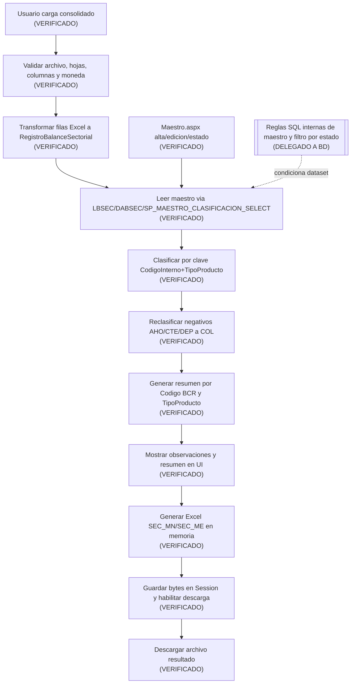

# PASADA 2D - BALANCE SECTORIAL / BSEC PROFUNDO
## 131. Objetivo y alcance 2D
Pregunta rectora:
- Como funciona realmente Balance Sectorial de extremo a extremo dentro de E444, desde la carga del consolidado hasta clasificacion, reclasificacion, observaciones, resumen y archivo de salida.

Subpregunta clave:
- Que papel cumple `Maestro.aspx` dentro del procesamiento y que tipo de dependencia existe entre ambos.

Alcance efectivo 2D:
1. `Views/BSEC/Procesamiento.aspx` y `Views/BSEC/Procesamiento.aspx.cs`.
2. `Views/BSEC/Maestro.aspx` y `Views/BSEC/Maestro.aspx.cs`.
3. Modelos `Views/BSEC/Models/*`.
4. `LBSEC`, `DABSEC` y contratos `BSEC.SP_*` visibles desde C#.
5. Transversal minimo necesario: `SiteBSEC.Master(.cs)`, `PrincipalBSEC.aspx(.cs)`, `Global.asax.cs`, `helper.cs`.

Fuera de alcance (mantenido):
- Reverse engineering interno de SP.
- Analisis definitivo de boundaries.
- Comparacion Legacy -> DNET.
- Diseno TO-BE.
- Fase BD interna.

Baseline operativo de esta pasada:
- `HEAD` + working tree actual aceptado como AS-IS (incluyendo cambios locales BSEC, tracked y untracked).

## 132. Macroflujo funcional BSEC
Casos de uso funcionales observados:
- `F2D-01`: Cargar y procesar consolidado BSEC.
- `F2D-02`: Descargar Excel resultado de procesamiento.
- `F2D-03`: Consultar/filtrar Maestro BSEC.
- `F2D-04`: Crear registro de Maestro BSEC.
- `F2D-05`: Editar registro de Maestro BSEC.
- `F2D-06`: Activar/Desactivar registro de Maestro BSEC.

Diagrama E2E real (BSEC):

Lectura macro:

* El procesamiento BSEC es principalmente `IMPORT + PROCESS + EXPORT` en C#.
* La persistencia de negocio observada en BSEC esta en `Maestro.aspx` (no en `Procesamiento.aspx`).

## 133. Archivo consolidado de entrada

### 133.1 Estructura esperada

| Aspecto | Evidencia visible | Clasificacion |
| --- | --- | --- |
| Tipo de entrada | Un solo archivo consolidado | HECHO VERIFICADO |
| Extensiones permitidas | `.xls` o `.xlsx` | HECHO VERIFICADO |
| Tamano maximo | 50 MB | HECHO VERIFICADO |
| Hojas obligatorias | `Res_Soles` y `Res_Dolares` | HECHO VERIFICADO |
| Hojas opcionales | No observadas como parte del flujo | HECHO VERIFICADO |
| Columnas obligatorias por hoja | `ENTIDAD`, `CODINTERNOCOMPUTACIONAL`, `CODDOC`, `TIPDOC`, `RAZONSOCIAL`, `TIPPRODUCTO`, `FECDIA`, `MONEDA`, `MTOSALDOCTA` | HECHO VERIFICADO |
| Orden de columnas | No obligatorio (mapeo por nombre) | HECHO VERIFICADO |
| Duplicado de nombres de columna | Bloquea procesamiento | HECHO VERIFICADO |
| Moneda esperada por hoja | 'SOLES' en 'Res_Soles'; 'DOLARES' en 'Res_Dolares' | HECHO VERIFICADO |
| Filas vacias | Se omiten si todas las columnas obligatorias estan vacias | HECHO VERIFICADO |
| Duplicados de filas de datos | No hay deduplicacion explicita en C# | HECHO VERIFICADO |
| Periodo de procesamiento | No existe selector de periodo en UI BSEC; `FECDIA` se trata como dato por fila | HECHO VERIFICADO |

### 133.2 Compatibilidad interna del formato

Compatibilidad visible en codigo:

1. XLS binario OLE2.
2. XLSX (ZIP).
3. SpreadsheetML 2003 (XML) convertido a `XSSFWorkbook`.

Nota:

* Aunque la extension permitida en UI/servidor es `.xls/.xlsx`, el detector interno acepta XML SpreadsheetML si su contenido cumple firma y estructura.

## 134. Validaciones del consolidado

| ID | Regla | Tipo | Hoja/flujo | Ubicacion | Efecto |
| --- | --- | --- | --- | --- | --- |
| BSEC-VAL-001 | Debe existir archivo seleccionado | VALIDACION TECNICA | Entrada | `ValidarArchivoSeleccionado` | Bloquea procesamiento |
| BSEC-VAL-002 | Extension valida `.xls/.xlsx` | VALIDACION TECNICA | Entrada | `ValidarArchivoSeleccionado` + `accept` + JS visual | Bloquea procesamiento |
| BSEC-VAL-003 | Tamano > 0 y <= 50MB | VALIDACION TECNICA | Entrada | `ValidarArchivoSeleccionado` | Bloquea procesamiento |
| BSEC-VAL-004 | Formato interno compatible (XLS/XLSX/XML2003) | VALIDACION TECNICA | Lectura workbook | `DetectarTipoArchivo`/`AbrirWorkbookNpoi` | Bloquea procesamiento |
| BSEC-VAL-005 | Deben existir hojas `Res_Soles` y `Res_Dolares` | VALIDACION FUNCIONAL | Workbook | `ObtenerHojaObligatoria` | Bloquea procesamiento |
| BSEC-VAL-006 | Hoja debe tener fila de encabezados | VALIDACION TECNICA | Por hoja | `ObtenerMapaColumnas` | Bloquea procesamiento |
| BSEC-VAL-007 | No se permiten columnas duplicadas por nombre | VALIDACION TECNICA | Por hoja | `ObtenerMapaColumnas` | Bloquea procesamiento |
| BSEC-VAL-008 | Deben existir todas las columnas obligatorias | VALIDACION TECNICA | Por hoja | `ObtenerMapaColumnas` | Bloquea procesamiento |
| BSEC-VAL-009 | Moneda de cada fila debe corresponder a la hoja | VALIDACION FUNCIONAL | Por fila | `ValidarMoneda` | Bloquea procesamiento |
| BSEC-VAL-010 | `MTOSALDOCTA` obligatorio y decimal parseable | VALIDACION FUNCIONAL | Por fila | `ObtenerMontoSaldo` | Bloquea procesamiento |
| BSEC-VAL-011 | `CODINTERNOCOMPUTACIONAL` vacio se marca observacion | VALIDACION FUNCIONAL | Por fila | `ValidarRegistroLeido` | Continua con observacion |
| BSEC-VAL-012 | `TIPPRODUCTO` vacio se marca observacion | VALIDACION FUNCIONAL | Por fila | `ValidarRegistroLeido` | Continua con observacion |
| BSEC-VAL-013 | `RAZONSOCIAL` vacio se marca observacion | VALIDACION FUNCIONAL | Por fila | `ValidarRegistroLeido` | Continua con observacion |
| BSEC-VAL-014 | Sin clasificacion en maestro -> estado `SIN CLASIFICACION` | CLASIFICACION | Clasificacion | `ClasificarRegistro` | Continua con observacion |
| BSEC-VAL-015 | Clasificacion con `CODIGO_BCR` vacio -> estado `CODIGO_BCR_VACIO` | CLASIFICACION | Clasificacion | `ClasificarRegistro` | Continua con observacion |
| BSEC-VAL-016 | Multiples clasificaciones distintas para misma clave -> `CLASIFICACION_AMBIGUA` | CLASIFICACION | Clasificacion | `ClasificarRegistro` | Continua con observacion |
| BSEC-VAL-017 | Multiples filas funcionalmente equivalentes en maestro -> `DUPLICADO_EQUIVALENTE` | CLASIFICACION | Clasificacion | `ClasificarRegistro` | Continua con observacion |
| BSEC-VAL-018 | AHO/CTE/DEP con monto negativo se reclasifican a COL con monto absoluto | REGLA DE NEGOCIO | Reclasificacion | `AplicarReglaColocaciones` | Continua, altera resultado |
| BSEC-VAL-019 | Reglas internas de vigencia/estado maestro y consistencia SQL | DELEGADA A BD | Dataset maestro | `BSEC.SP_MAESTRO_CLASIFICACION_SELECT` | NO DETERMINADO en C# |

## 135. Transformaciones Excel -> modelo aplicativo

| Dato de origen | Transformacion visible | Resultado |
| --- | --- | --- |
| Fila de `Res_Soles` | Se mapea a `RegistroBalanceSectorial` y se agrega a `RegistrosMN` | Lista MN en memoria |
| Fila de `Res_Dolares` | Se mapea a `RegistroBalanceSectorial` y se agrega a `RegistrosME` | Lista ME en memoria |
| `CODINTERNOCOMPUTACIONAL` + `TIPPRODUCTO` | `Trim().ToUpperInvariant()` y combinacion logica de ambos valores (`codigo` + separador + `tipo`) |
| `FECDIA` texto | Parseo formatos `dd/MM/yyyy`, `d/M/yyyy`, `yyyy-MM-dd` (fallback `TryParse` es-PE) | `FechaDia` nullable + `FechaDiaTexto` original |
| `MTOSALDOCTA` | Parseo numerico (celda numerica o texto con `InvariantCulture`/es-PE) | `MontoSaldoCuenta` decimal |
| Dataset maestro | `GroupBy` por clave -> diccionario `clave -> lista coincidencias` | Indice para clasificacion |
| Coincidencia unica maestro | Copia `CodigoBsec`, `DescripcionBsec`, `CodigoBcr` al registro | Estado `CLASIFICADO` o `CODIGO_BCR_VACIO` |
| Coincidencias equivalentes duplicadas | Distinct por `CodigoBsec`/`CodigoBcr` queda 1 clasificacion funcional | Estado `DUPLICADO_EQUIVALENTE` |
| Coincidencias multiples distintas | Se marca ambiguedad y observacion | Estado `CLASIFICACION_AMBIGUA` |
| Regla de reclasificacion | Si tipo AHO/CTE/DEP y monto negativo: `TipoProducto='COL'`, `MontoSaldoCuenta=Abs(monto)` | Ajuste funcional para resumen/export |
| Lista final por moneda | Agrupacion por `CODIGO_BCR` y pivote por `TIPO_PRODUCTO` | `DataTable` resumen con `TOTAL_GENERAL` |

## 136. Procesamiento y persistencia

### 136.1 Ficha de flujo `F2D-01`

| Campo | Contenido |
| --- | --- |
| ID | `F2D-01` |
| Nombre | Cargar y procesar consolidado BSEC |
| Proposito | Leer consolidado, clasificar registros, aplicar reclasificacion funcional, mostrar resumen/observaciones y generar Excel descargable. |
| Actor/permisos | Navegacion condicionada por `OP_BSEC` en `SiteBSEC.Master`; pagina sin chequeo `OP_*` propio en `Page_Load`. |
| Pantalla | `Views/BSEC/Procesamiento.aspx` |
| Precondiciones | Archivo valido (`.xls/.xlsx`, <=50MB), hojas y columnas obligatorias, moneda consistente por hoja. |
| Inputs | `fuConsolidado` (un archivo). |
| Validaciones | Tecnicas/funcionales de archivo, estructura, moneda, monto, clasificacion y regla de reclasificacion. |
| Pasos | 1) Limpia Session de archivo previo. 2) Valida archivo. 3) Abre workbook. 4) Lee hojas obligatorias. 5) Mapea columnas. 6) Valida moneda por hoja. 7) Convierte filas a modelos MN/ME. 8) Lee maestro clasificacion. 9) Clasifica cada registro. 10) Aplica regla de reclasificacion a colocaciones. 11) Genera resumen por CODIGO_BCR. 12) Muestra resultados y observaciones. 13) Genera Excel en memoria y lo guarda en Session. |
| BL | `LBSEC.GetMaestroClasificacion()` |
| DA | `DABSEC.GetMaestroClasificacion()` |
| SP | `BSEC.SP_MAESTRO_CLASIFICACION_SELECT` |
| Operacion | `IMPORT` + `PROCESS` + `CLASSIFY` + `EXPORT` |
| Estado Web | `Session["BSEC_ARCHIVO_RESULTADO"]`, `Session["BSEC_NOMBRE_ARCHIVO"]`; paneles/labels/grids server-side. |
| Output | Grillas MN/ME, grilla de observaciones, resumen de conteos y habilitacion de descarga Excel. |
| Error | `catch(Exception)` general con alerta warning; sin rollback requerido en C# (no write de negocio en este flujo). |
| Dependencias | Dependencia directa de datos de maestro de clasificacion (via SP). |
| Evidencia | `btnProcesar_Click`, `LeerRegistros`, `ClasificarRegistros`, `AplicarReglaColocaciones`, `GenerarExcelResultado`. |
| Incertidumbre | Criterios SQL internos del SP de maestro (filtro por estado/vigencia/conflictos). |

### 136.2 Persistencia visible asociada al procesamiento

| Operacion funcional | BL | DA | SP | Parametros visibles | Tipo |
| --- | --- | --- | --- | --- | --- |
| Leer maestro para clasificar | `GetMaestroClasificacion` | `GetMaestroClasificacion` | `BSEC.SP_MAESTRO_CLASIFICACION_SELECT` | Sin parametros visibles | READ/CLASSIFY |
| Guardar resultado para descarga | N/A | N/A | N/A | `Session["BSEC_ARCHIVO_RESULTADO"]`, `Session["BSEC_NOMBRE_ARCHIVO"]` | PROCESS (estado web) |

Hallazgo clave:

* En `Procesamiento.aspx.cs` no se observa escritura a BD (`INSERT/UPDATE/DELETE/PROCESS`) del resultado procesado.

### 136.3 Reproceso / segunda carga

Estado AS-IS:

* Se puede volver a procesar inmediatamente cargando otro archivo.
* En cada nuevo `btnProcesar_Click` se limpian las Session del archivo anterior y se reemplaza el resultado en memoria.
* No hay confirmacion de reproceso ni versionado en C#.
* No hay borrado previo en BD visible porque el flujo no escribe en BD.

## 137. Clasificacion

### 137.1 Mecanismo observable

Entidad clasificada:

* Cada `RegistroBalanceSectorial`.

Clave de clasificacion:

* `CODINTERNOCOMPUTACIONAL` + `TIPPRODUCTO` (normalizados con `Trim().ToUpperInvariant()`).

Datos devueltos por clasificacion:

* `CODIGO_BSEC`
* `DESCRIPCION_BSEC`
* `CODIGO_BCR`

Estados de clasificacion observables:

* `CLASIFICADO`
* `SIN_CLASIFICACION`
* `CODIGO_BCR_VACIO`
* `DUPLICADO_EQUIVALENTE`
* `CLASIFICACION_AMBIGUA`

### 137.2 Trazabilidad WEB -> BL -> DA -> SP

Cadena observable:

1. `Procesamiento.aspx.cs` llama `LBSEC.GetMaestroClasificacion()`.
2. `LBSEC` delega a `DABSEC.GetMaestroClasificacion()`.
3. `DABSEC` ejecuta `BSEC.SP_MAESTRO_CLASIFICACION_SELECT`.
4. La logica de match final se ejecuta en C# (`ClasificarRegistro`) usando diccionario en memoria.

Clasificacion del mecanismo:

* HECHO VERIFICADO: la decision de estado (`CLASIFICADO`, `SIN_CLASIFICACION`, etc.) se toma en C#.
* NO DETERMINADO: reglas SQL internas con las que el SP decide que dataset de maestro retorna.

## 138. Registros no clasificados / excepciones

Conceptos explicitos observados:

* `SIN_CLASIFICACION`.
* `CODIGO_BCR_VACIO`.
* `CLASIFICACION_AMBIGUA`.

Comportamiento:

| Aspecto | Resultado observable |
| --- | --- |
| Identificacion | Se setea `EstadoClasificacion` en cada registro. |
| Visualizacion | Se agrega fila a `gvObservaciones` con tipo y detalle. |
| Bloqueo de procesamiento | No bloquea si el archivo ya paso validaciones estructurales. |
| Bloqueo de descarga | No bloquea; igual se genera y habilita descarga. |
| Continuidad | El flujo continua y el resumen incluye grupos `(en blanco)` cuando no hay `CODIGO_BCR`. |
| Resolucion de usuario en la misma pantalla | No hay accion de correccion en `Procesamiento.aspx`. |

## 139. Reclasificacion

Mecanismo observado:

* Reclasificacion automatica en C# por regla fija.

Regla:

* Si `TIPPRODUCTO` es `AHO`, `CTE` o `DEP` y `MTOSALDOCTA < 0`, entonces:
1. `TipoProducto` pasa a `COL`.
2. `MontoSaldoCuenta` pasa a valor absoluto.
3. `ReclasificadoComoColocacion = true`.

Caracterizacion:

| Aspecto | Resultado observable |
| --- | --- |
| Tipo de reclasificacion | Automatica, no interactiva |
| Accion UI del usuario | No existe boton manual de reclasificacion |
| Persistencia en BD | No se observa write en este flujo |
| Impacto en Maestro | No modifica maestro |
| Impacto en salida | Afecta `TipoProd` y montos en grillas y Excel final |
| Motivo/observacion de reclasificacion | No se pide ni registra texto de motivo |

## 140. Observaciones

Funcion observable:

* Registrar incidencias de calidad/clasificacion durante el procesamiento y mostrarlas en UI.

Caracterizacion:

| Aspecto | Resultado observable |
| --- | --- |
| Origen | Generadas automaticamente en C# |
| Registro objetivo | `RegistroBalanceSectorial` (fila de entrada procesada) |
| Campos mostrados | Moneda, Fila, CodigoInterno, TipoProducto, RazonSocial, Tipo, Detalle |
| Obligatoriedad | No aplica ingreso manual del usuario |
| Texto libre | No (mensajes definidos por codigo) |
| Usuario/timestamp | No visible en `ObservacionBalanceSectorial` |
| Persistencia DB | No observada |
| Inclusion en Excel final | No observada |
| Efecto en proceso | Informativo; no bloquea descarga |

## 141. Resumen / resultado

Salida en pantalla despues de procesar:

1. Resumen superior:
* `Registros MN`
* `Registros ME`
* `Observaciones`

2. Dos grillas de resultado (`gvResultadoMN`, `gvResultadoME`) por moneda.
3. Una grilla de observaciones (`gvObservaciones`).

Nivel de agregacion del resumen por grilla MN/ME:

* Agrupa por `CODIGO_BCR`.
* Columna por `TIPO_PRODUCTO` (base: `AHO`, `COL`, `CTE`, `DEP` + tipos adicionales detectados).
* Columna `TOTAL_GENERAL`.
* Fila final `Total general`.

Donde se calcula:

| Elemento | Lugar |
| --- | --- |
| Conteos resumen superior | C# (`MostrarResumen`) |
| Pivot por `CODIGO_BCR` / `TIPO_PRODUCTO` | C# (`GenerarResumenCodigoBcr`) |
| Formato numerico de grillas | C# (`gvResultado_RowDataBound`) |
| Totales de detalle/resumen Excel | C# |
| Reglas SQL internas no visibles | NO DETERMINADO |

Nota de trazabilidad:

* Variables calculadas `clasificados`, `sinClasificacion`, `codigoBcrVacio`, `ambiguos`, `montoPendienteMN/ME` no se exponen en UI ni se exportan en una hoja separada.

## 142. Archivo de salida

### 142.1 Ficha de flujo `F2D-02`

| Campo | Contenido |
| --- | --- |
| ID | `F2D-02` |
| Nombre | Descargar resultado BSEC |
| Proposito | Entregar al usuario el Excel generado en memoria tras `F2D-01`. |
| Actor/permisos | Mismo contexto de acceso a BSEC; boton habilitado tras procesamiento exitoso. |
| Pantalla | `Views/BSEC/Procesamiento.aspx` |
| Precondiciones | `Session["BSEC_ARCHIVO_RESULTADO"]` con bytes y nombre de archivo en Session. |
| Inputs | Click en `btnDescargar`. |
| Validaciones | Verifica existencia de bytes en Session. |
| Pasos | 1) Lee bytes y nombre de Session. 2) Configura respuesta HTTP XLSX. 3) `BinaryWrite`. 4) `CompleteRequest`. |
| BL | N/A |
| DA | N/A |
| SP | N/A |
| Operacion | `EXPORT` |
| Estado Web | Consume `Session["BSEC_ARCHIVO_RESULTADO"]` y `Session["BSEC_NOMBRE_ARCHIVO"]`. |
| Output | Descarga `Balance_Sectorial_yyyyMMdd_HHmmss.xlsx`. |
| Error | Si no hay bytes en Session muestra alerta warning. |
| Dependencias | Requiere ejecucion previa de `F2D-01`. |
| Evidencia | `btnDescargar_Click`. |
| Incertidumbre | Ninguna adicional en C#; no hay write a BD en este flujo. |

### 142.2 Estructura del archivo generado

| Aspecto | Evidencia observable |
| --- | --- |
| Libreria | NPOI (`XSSFWorkbook`) |
| Plantilla | No usa template externo |
| Hojas | `SEC_MN`, `SEC_ME` |
| Seccion detalle | Columnas `Entidad`, `CodInterComp`, `CodDoc`, `RazonSocial`, `TipoProd`, `FecDia`, `Moneda`, `BSEC`, `CodBCR`, `MtoSaldocta` |
| Seccion resumen en la misma hoja | Desde columna `N`, con `CodBCR`, tipos de producto y `Total general` |
| Moneda | Separada por hoja (MN y ME) |
| Observaciones | No se exportan en hoja separada |
| Generacion | En memoria (`MemoryStream`) |
| Descarga | HTTP response, sin persistencia en disco |

## 143. Maestro BSEC

### 143.1 Ficha de flujo `F2D-03` (consultar/filtrar)

| Campo | Contenido |
| --- | --- |
| ID | `F2D-03` |
| Nombre | Consultar y filtrar maestro de clasificacion |
| Proposito | Listar registros de clasificacion con filtros funcionales. |
| Actor/permisos | Navegacion via `OP_BSEC` en master; pagina sin chequeo `OP_*` propio. |
| Pantalla | `Views/BSEC/Maestro.aspx` |
| Precondiciones | Sesion activa con `Session["Permisos"]`; datos de maestro en BD. |
| Inputs | Filtros: codigo interno, razon social, tipo producto, codigo BCR, estado. |
| Validaciones | `estado` se traduce a `bool?` (`1`, `0`, `null`); normaliza blancos a null. |
| Pasos | 1) `Page_Load` inicial carga grilla. 2) `Buscar`/`Limpiar` aplica filtros y recarga. 3) Paginacion recarga con filtros vigentes en controles. |
| BL | `GetMaestro` |
| DA | `GetMaestro` |
| SP | `BSEC.SP_MAESTRO_CLASIFICACION_LISTAR` |
| Operacion | `READ` |
| Estado Web | Estado en controles de filtro + `gvMaestro.PageIndex`. |
| Output | Grilla paginada con columnas de clasificacion y estado. |
| Error | No hay catch especifico en carga/filtro; propagacion de excepcion de framework si aplica. |
| Dependencias | Dependencia de dataset maestro en BD. |
| Evidencia | `CargarMaestro`, `btnBuscar_Click`, `btnLimpiar_Click`, `gvMaestro_PageIndexChanging`. |
| Incertidumbre | Semantica exacta de filtros en SQL interna del SP. |

### 143.2 Ficha de flujo `F2D-04` (crear)

| Campo | Contenido |
| --- | --- |
| ID | `F2D-04` |
| Nombre | Crear registro de maestro |
| Proposito | Insertar clasificacion para clave codigo interno + tipo producto. |
| Actor/permisos | Contexto BSEC; usa `Session["Usuario"].Matricula` para auditoria. |
| Pantalla | `Views/BSEC/Maestro.aspx` (modal `modalMaestro`) |
| Precondiciones | Campos obligatorios completos; clave activa no duplicada. |
| Inputs | Codigo interno, codigo documento, razon social, codigo BSEC, descripcion BSEC, codigo BCR, tipo producto, fecha, nota. |
| Validaciones | Obligatorios: codigo interno, tipo producto, codigo BCR; validacion de duplicado activo via `ExisteMaestroActivo`. |
| Pasos | 1) Valida formulario. 2) Valida duplicidad activa. 3) Ejecuta insert. 4) Muestra mensaje exito. 5) Limpia formulario y recarga grilla. |
| BL | `ExisteMaestroActivo`, `InsertMaestro` |
| DA | `ExisteMaestroActivo`, `InsertMaestro` |
| SP | `BSEC.SP_MAESTRO_CLASIFICACION_EXISTE_ACTIVO`, `BSEC.SP_MAESTRO_CLASIFICACION_INSERTAR` |
| Operacion | `VALIDATE` + `WRITE` |
| Estado Web | `hfIdClasificacion` vacio en modo nuevo, `Session["Usuario"]`. |
| Output | Nuevo registro y alerta success. |
| Error | `ApplicationException` muestra detalle en modal; excepcion general muestra mensaje generico. |
| Dependencias | Dataset maestro y reglas SQL de unicidad/estado. |
| Evidencia | `btnNuevo_Click` + `btnGuardar_Click` en modo nuevo/alta (`hfIdClasificacion` vacio). |
| Incertidumbre | Validacion final de unicidad y transaccionalidad interna del SP. |

### 143.3 Ficha de flujo `F2D-05` (editar)

| Campo | Contenido |
| --- | --- |
| ID | `F2D-05` |
| Nombre | Editar registro de maestro |
| Proposito | Actualizar datos de clasificacion existente. |
| Actor/permisos | Contexto BSEC; `Session["Usuario"]` para auditoria. |
| Pantalla | `Views/BSEC/Maestro.aspx` |
| Precondiciones | Registro existente; si cambia clave, no debe colisionar con otro activo. |
| Inputs | Id + campos del modal de edicion. |
| Validaciones | `GetMaestroPorId` para carga; validacion obligatorios; chequeo `CambioClaveMaestro` + `ExisteMaestroActivo` si cambia clave. |
| Pasos | 1) Usuario pulsa `Editar` en grilla activa. 2) Carga datos y auditoria en modal. 3) Guarda cambios. 4) Recarga grilla. |
| BL | `GetMaestroPorId`, `ExisteMaestroActivo`, `UpdateMaestro` |
| DA | `GetMaestroPorId`, `ExisteMaestroActivo`, `UpdateMaestro` |
| SP | `BSEC.SP_MAESTRO_CLASIFICACION_OBTENER`, `BSEC.SP_MAESTRO_CLASIFICACION_EXISTE_ACTIVO`, `BSEC.SP_MAESTRO_CLASIFICACION_ACTUALIZAR` |
| Operacion | `READ` + `VALIDATE` + `UPDATE` |
| Estado Web | `hfIdClasificacion` y campos modal; panel auditoria visible en edicion. |
| Output | Registro actualizado y alerta success. |
| Error | Si no existe, alerta warning; en guardado, errores mostrados en modal. |
| Dependencias | SP de obtencion, validacion y actualizacion de maestro. |
| Evidencia | `gvMaestro_RowCommand`, `CargarRegistroEdicion`, `btnGuardar_Click` rama edicion. |
| Incertidumbre | Reglas SQL internas de update y auditoria interna. |

### 143.4 Ficha de flujo `F2D-06` (activar/desactivar)

| Campo | Contenido |
| --- | --- |
| ID | `F2D-06` |
| Nombre | Cambiar estado activo/inactivo de registro maestro |
| Proposito | Habilitar o deshabilitar uso de registro en futuros procesamientos. |
| Actor/permisos | Contexto BSEC; usuario de sesion como auditor de cambio. |
| Pantalla | `Views/BSEC/Maestro.aspx` (modal `modalConfirmarEstado`) |
| Precondiciones | Registro identificado por `ID_CLASIFICACION` y `ESTADO` actual. |
| Inputs | `ID_CLASIFICACION`, estado actual, confirmacion usuario. |
| Validaciones | Valida/parsea el identificador y estado actual recibidos por el comando antes de preparar/confirmar el cambio de estado. |
| Pasos | 1) `CambiarEstado` prepara modal. 2) Usuario confirma. 3) Ejecuta cambio en BL/DA/SP. 4) Recarga grilla. |
| BL | `CambiarEstadoMaestro` |
| DA | `CambiarEstadoMaestro` |
| SP | `BSEC.SP_MAESTRO_CLASIFICACION_CAMBIAR_ESTADO` |
| Operacion | `STATUS` |
| Estado Web | `hfIdCambioEstado`, `hfEstadoActual`. |
| Output | Mensaje de desactivacion/reactivacion y recarga de grilla. |
| Error | Mensaje warning en falla de parseo o excepcion. |
| Dependencias | Semantica SQL de estado y uso en procesamiento. |
| Evidencia | `PrepararCambioEstado`, `btnConfirmarEstado_Click`. |
| Incertidumbre | Efecto exacto del estado sobre `SP_MAESTRO_CLASIFICACION_SELECT` es DELEGADO A BD. |

## 144. Modelo conceptual del Maestro

| Atributo conceptual | Uso observable | Evidencia |
| --- | --- | --- |
| `ID_CLASIFICACION` | Identificador para editar/cambiar estado | `DataKeyNames`, hidden fields, `GetMaestroPorId` |
| `CODIGO INTERNO COMPUTACIONAL` | Clave de clasificacion + filtro | Formulario, filtros, clave de procesamiento |
| `TIPO PRODUCTO` | Clave de clasificacion + filtro | Dropdown en maestro y clave en procesamiento |
| `CODIGO_BCR` | Codigo de salida para resumen/export | Campo obligatorio en maestro, usado en procesamiento |
| `CODIGO_BSEC` | Etiqueta/atributo de clasificacion | Campo maestro y salida de detalle |
| `DESCRIPCION_BSEC` | Descripcion asociada | Campo maestro y salida de detalle |
| `CODIGO_DOCUMENTO` | Dato complementario | Campo editable en maestro |
| `RAZON SOCIAL` | Dato complementario/filtro | Campo editable y filtro |
| `FECHA_DIA` | Dato complementario | Campo editable (`txtFechaDia`) |
| `NOTA` | Observacion de catalogo | Campo editable (`txtNota`) |
| `ESTADO` | Activo/inactivo | Filtro y accion cambiar estado |
| `USUARIO`/`FECHA` registro/modificacion | Trazabilidad de auditoria visual | Panel auditoria en modal edicion |

## 145. Relacion Maestro > Procesamiento

| Evidencia | Relacion observada | Clasificacion |
| --- | --- | --- |
| `Procesamiento.ObtenerMaestroClasificacion -> LBSEC.GetMaestroClasificacion -> DABSEC.GetMaestroClasificacion -> BSEC.SP_MAESTRO_CLASIFICACION_SELECT` | El procesamiento invoca explicitamente maestro para clasificar | DEPENDENCIA DIRECTA |
| Clasificacion en C# usa clave `CodigoInterno+TipoProducto` y copia `CodigoBsec/CodigoBcr` del maestro | El procesamiento depende de datos de maestro para resultado funcional | DEPENDENCIA POR DATOS |
| No hay llamada desde procesamiento a `Insert/Update/CambiarEstado` del maestro | Procesamiento no mantiene maestro | HECHO VERIFICADO |
| No hay evidencia de `SP` de proceso BSEC adicionales en `DABSEC` | Clasificacion no se delega a un SP de calculo dedicado visible en repo | HECHO VERIFICADO |
| Efecto exacto de estado activo/inactivo sobre dataset de clasificacion | Requiere conocer logica interna de `SP_MAESTRO_CLASIFICACION_SELECT` | NO DETERMINADO |

Respuesta estructurada requerida:

1. Procesamiento invoca explicitamente Maestro: SI.
2. Comparten datos persistidos: SI.
3. Clasificacion ocurre totalmente en SP: NO (se decide en C# con dataset del SP).
4. Aspectos no determinables desde repositorio: SI, reglas SQL internas del dataset maestro.

## 146. Autorizacion y estado Web

### 146.1 Autorizacion AS-IS

Hechos verificados:

* `SiteBSEC.Master` controla visibilidad de menu/opciones con `OP_BSEC`.
* `Views/BSEC/Procesamiento.aspx.cs`, `Views/BSEC/Maestro.aspx.cs` y `PrincipalBSEC.aspx.cs` no validan `OP_BSEC` en `Page_Load`.
* `Global.Application_AcquireRequestState` valida existencia de `Session["Permisos"]`, pero no valida `OP_BSEC` por URL.

Impacto de acceso directo (sin remediacion):

* INFERENCIA TECNICA sustentada: con sesion valida y `Session["Permisos"]` no nula, el acceso directo por URL a paginas BSEC no muestra bloqueo page-level especifico `OP_BSEC` en C#.

WebMethods:

* No se observaron `[WebMethod]` en `Views/BSEC/*`.

### 146.2 Matriz de estado Web BSEC

| Artefacto | Pantalla | Contenido | Productor | Consumidor | Proposito |
| --- | --- | --- | --- | --- | --- |
| `Session["Permisos"]` | Master BSEC / Global | Diccionario de operaciones permitidas | `Session_Start` | `SiteBSEC.Master`, `Global` | Visibilidad de menu y control base de sesion |
| `Session["Usuario"]` | Maestro / PrincipalBSEC | `UsuarioAD` (matricula) | `Session_Start` | `Maestro.aspx.cs`, `PrincipalBSEC.aspx.cs` | Auditoria de cambios y trazabilidad |
| `Session["BSEC_ARCHIVO_RESULTADO"]` | Procesamiento | `byte[]` del Excel generado | `btnProcesar_Click` | `btnDescargar_Click` | Transferencia interna para descarga |
| `Session["BSEC_NOMBRE_ARCHIVO"]` | Procesamiento | Nombre del archivo de salida | `btnProcesar_Click` | `btnDescargar_Click` | Nombre de descarga HTTP |
| `hfIdClasificacion` | Maestro | Id de registro en edicion | `CargarRegistroEdicion`/`btnNuevo_Click` | `btnGuardar_Click` | Diferenciar alta vs edicion |
| `hfIdCambioEstado` | Maestro | Id para cambiar estado | `PrepararCambioEstado` | `btnConfirmarEstado_Click` | Confirmacion de cambio estado |
| `hfEstadoActual` | Maestro | Estado booleano actual | `PrepararCambioEstado` | `btnConfirmarEstado_Click` | Calcular nuevo estado |
| Controles Filtro (`txt*`, `ddl*`) | Maestro | Criterios de busqueda | Usuario UI | `CargarMaestro` | Filtrado de grilla |
| Grids/labels (`gv*`, `lbl*`) | Procesamiento/Maestro | Resultado visual | Code-behind | Usuario UI | Presentacion |

## 147. Sincronia y operaciones funcionales

### 147.1 Sincronia

| Flujo | Clasificacion |
| --- | --- |
| `F2D-01` Procesar consolidado | SINCRONICO HTTP |
| `F2D-02` Descargar resultado | SINCRONICO HTTP |
| `F2D-03` Consultar/filtrar maestro | SINCRONICO HTTP |
| `F2D-04` Crear maestro | SINCRONICO HTTP |
| `F2D-05` Editar maestro | SINCRONICO HTTP |
| `F2D-06` Cambiar estado maestro | SINCRONICO HTTP |

No se observaron en BSEC:

* POLLING,
* DIFERIDO,
* JOB,
* AJAX.

### 147.2 Operaciones funcionales

| Capacidad | READ | WRITE | IMPORT | EXPORT | PROCESS | EXTERNAL |
| --- | --- | --- | --- | --- | --- | --- |
| Carga consolidado |  |  | X |  | X |  |
| Validacion consolidado |  |  |  |  | X |  |
| Clasificacion | X |  |  |  | X |  |
| Reclasificacion automatica |  |  |  |  | X |  |
| Observaciones (generar/mostrar) |  |  |  |  | X |  |
| Resumen por BCR |  |  |  |  | X |  |
| Descarga Excel resultado |  |  |  | X |  |  |
| Maestro listar/filtrar | X |  |  |  |  |  |
| Maestro crear | X | X |  |  |  |  |
| Maestro editar | X | X |  |  |  |  |
| Maestro activar/desactivar |  | X |  |  |  |  |

## 148. Contratos `BSEC.SP_*`

| SP | Metodo DA | Caso de uso | Parametros visibles | Retorno visible | Tipo |
| --- | --- | --- | --- | --- | --- |
| `BSEC.SP_MAESTRO_CLASIFICACION_SELECT` | `GetMaestroClasificacion` | Cargar dataset maestro para clasificacion en procesamiento | Sin parametros | `DataTable` | READ/CLASSIFY |
| `BSEC.SP_MAESTRO_CLASIFICACION_LISTAR` | `GetMaestro` | Listar maestro con filtros | `@CODIGO_INTERNO_COMPUTACIONAL`, `@RAZON_SOCIAL`, `@TIPO_PRODUCTO`, `@CODIGO_BCR`, `@ESTADO` | `DataTable` | READ |
| `BSEC.SP_MAESTRO_CLASIFICACION_OBTENER` | `GetMaestroPorId` | Obtener registro para edicion | `@ID_CLASIFICACION` | `DataTable` | READ |
| `BSEC.SP_MAESTRO_CLASIFICACION_INSERTAR` | `InsertMaestro` | Crear registro maestro | `@CODIGO_INTERNO_COMPUTACIONAL`, `@CODIGO_DOCUMENTO`, `@RAZON_SOCIAL`, `@CODIGO_BSEC`, `@DESCRIPCION_BSEC`, `@CODIGO_BCR`, `@TIPO_PRODUCTO`, `@FECHA_DIA`, `@NOTA`, `@USUARIO`, `@NEW_ID OUTPUT` | `ExecuteNonQuery` + `@NEW_ID` | WRITE |
| `BSEC.SP_MAESTRO_CLASIFICACION_ACTUALIZAR` | `UpdateMaestro` | Editar registro maestro | `@ID_CLASIFICACION`, campos maestro, `@USUARIO` | `ExecuteNonQuery` | UPDATE |
| `BSEC.SP_MAESTRO_CLASIFICACION_CAMBIAR_ESTADO` | `CambiarEstadoMaestro` | Activar/desactivar | `@ID_CLASIFICACION`, `@ESTADO`, `@USUARIO` | `ExecuteNonQuery` | STATUS |
| `BSEC.SP_MAESTRO_CLASIFICACION_EXISTE_ACTIVO` | `ExisteMaestroActivo` | Validar duplicidad activa por clave | `@CODIGO_INTERNO_COMPUTACIONAL`, `@TIPO_PRODUCTO`, `@ID_EXCLUIR` | `DataTable` con columna `EXISTE` bool | VALIDATE |

Concentracion de schema observada:

* Todos los contratos SP visibles en `DABSEC` usan schema/prefijo `BSEC.SP_*`.
* No se observaron contratos `BSEC.SP_*` fuera de `DABSEC` en el repositorio revisado.
* Dependencias internas de esos SP a objetos `dbo` u otros schemas: NO DETERMINADO - requiere fase BD.

## 149. Entidades conceptuales

| Entidad conceptual | Flujos que la utilizan | Evidencia |
| --- | --- | --- |
| Consolidado BSEC (archivo) | `F2D-01` | `fuConsolidado`, validaciones de extension/tamano/hojas |
| Hoja monetaria (`Res_Soles`/`Res_Dolares`) | `F2D-01` | Constantes `HOJA_SOLES`/`HOJA_DOLARES` |
| Registro balance sectorial | `F2D-01`, salida Excel | Modelo `RegistroBalanceSectorial` |
| Clasificacion maestro | `F2D-01`, `F2D-03..06` | `MaestroClasificacionBsec`, SP de maestro |
| Estado de clasificacion | `F2D-01` | Constantes `CLASIFICADO`, `SIN_CLASIFICACION`, etc. |
| Observacion de procesamiento | `F2D-01` | Modelo `ObservacionBalanceSectorial`, `gvObservaciones` |
| Reclasificacion de colocaciones | `F2D-01` | `ResumenReclasificacionColocaciones`, `AplicarReglaColocaciones` |
| Resumen por `CODIGO_BCR` | `F2D-01`, `F2D-02` | `GenerarResumenCodigoBcr`, grillas MN/ME |
| Archivo resultado | `F2D-02` | `Session["BSEC_ARCHIVO_RESULTADO"]`, `btnDescargar_Click` |
| Estado maestro activo/inactivo | `F2D-03..06` | Campo `ESTADO`, filtro y cambio estado |

## 150. Senales preliminares de ownership

| Entidad conceptual | Clasificacion preliminar | Tipo de evidencia |
| --- | --- | --- |
| Maestro de clasificacion BSEC | APARENTEMENTE PROPIA DE BSEC | INFERENCIA TECNICA sustentada en contratos `BSEC.SP_MAESTRO_CLASIFICACION_*` |
| Estados de clasificacion de procesamiento | APARENTEMENTE PROPIA DE BSEC | INFERENCIA TECNICA sustentada en constantes y logica C# de `Procesamiento.aspx.cs` |
| Regla de reclasificacion AHO/CTE/DEP negativo -> COL | APARENTEMENTE PROPIA DE BSEC | INFERENCIA TECNICA sustentada en `AplicarReglaColocaciones` |
| Sesion de autenticacion/permisos | TRANSVERSAL | HECHO VERIFICADO |
| Conexion logica `cnn_Encaje` | INFRAESTRUCTURA COMPARTIDA | HECHO VERIFICADO |
| Ownership fisico de objetos SQL consumidos por SP BSEC | NO DETERMINADO | Limite de fase BD |

## 151. Dependencias con Encaje / Anexo 10

### 151.1 Con Encaje

| Dependencia | Evidencia | Clasificacion |
| --- | --- | --- |
| Llamadas BL Encaje desde `Views/BSEC/*` | No observadas (`LBSEC` es la unica BL de negocio invocada) | SIN DEPENDENCIA VISIBLE |
| Llamadas DA Encaje desde `Views/BSEC/*` | No observadas (`DABSEC` es la DA de negocio invocada) | SIN DEPENDENCIA VISIBLE |
| SP `EB_*` en flujo BSEC profundo analizado | No observados en `DABSEC` ni code-behind BSEC | SIN DEPENDENCIA VISIBLE |
| Conexion `cnn_Encaje` via `helper` | `DABSEC` usa `helper.EjecutarConsulta`/`EjecutarComando` con `cnn_Encaje` | INFRAESTRUCTURA COMPARTIDA |
| `Session[permisos/usuario]` desde `Global.asax` | `SiteBSEC.Master`, `Global.asax.cs` | INFRAESTRUCTURA COMPARTIDA |

### 151.2 Con Anexo 10

| Dependencia | Evidencia | Clasificacion |
| --- | --- | --- |
| Referencias a `LAnexo10` / `DAAnexo10` en `Views/BSEC/*` | No observadas | SIN DEPENDENCIA VISIBLE |
| Referencias a `SP_A10_*` en `DABSEC`/`BSEC` | No observadas | SIN DEPENDENCIA VISIBLE |
| Reuso de infraestructura comun (`helper`, session, master model) | Si | INFRAESTRUCTURA COMPARTIDA |

### 151.3 Dependencias transversales efectivas

| Uso transversal | Evidencia | Clasificacion |
| --- | --- | --- |
| Logging (`Util.pintaLog`) | `SiteBSEC.Master`, `PrincipalBSEC` | REUSO TECNICO |
| Alertas comunes JS modal | `MostrarAlerta` en master + `ScriptManager.RegisterStartupScript` | REUSO TECNICO |
| Libreria Excel NPOI | `Procesamiento.aspx.cs` | REUSO TECNICO |

## 152. Atomicidad y manejo de errores

### 152.1 Atomicidad / transacciones visibles

| Flujo | Operaciones | Atomicidad visible | Riesgo/observacion |
| --- | --- | --- | --- |
| `F2D-01` Procesar consolidado | Validar -> transformar -> clasificar -> reclasificar -> resumir -> generar excel session | Sin transacciones DB de negocio (no write a BD observado) | Riesgo operativo principal es fallo en memoria/request, no inconsistencia DB de procesamiento |
| `F2D-04` Crear maestro | Validar duplicado (`READ`) + insertar (`WRITE`) | No hay `SqlTransaction` en C# entre validacion e insercion | Potencial carrera entre check de duplicado y write (resolucion final delegada a SP/BD) |
| `F2D-05` Editar maestro | Obtener -> validar cambio clave -> validar duplicado -> update | Sin transaccion visible entre consultas previas y update | Potencial carrera en concurrencia |
| `F2D-06` Cambiar estado | Un `UPDATE` via SP | Operacion unitaria visible por request | Semantica final de estado depende del SP |

### 152.2 Manejo de errores

| Flujo | Validacion cliente | Validacion server | Catch observable | Logging | Resultado UI |
| --- | --- | --- | --- | --- | --- |
| Procesamiento | JS visual de extension/drag-drop | Validaciones completas en C# | `catch(Exception)` | Comentario de logging pendiente (no llamada activa en catch) | `MostrarAlerta(..., warning)` |
| Descarga resultado | N/A | Verifica bytes en Session | Sin excepcion especifica; control preventivo | No log en metodo | Warning si no hay resultado |
| Maestro guardar | Sin validacion JS explicita | Validaciones de obligatorios + duplicidad + ID | `catch(ApplicationException)` y `catch(Exception)` | Comentario `//Util.pintaLog(...)` en generico | Error en modal + reabre modal |
| Maestro cambiar estado | N/A | Parseo command argument y hidden fields | `catch(Exception)` | Comentario de log en `btnConfirmarEstado_Click` | warning/success |
| Master/Principal | N/A | Controles de sesion/permisos basicos | catch generico | `Util.pintaLog` activo | redirect/flash segun caso |

## 153. Catalogo de reglas

| ID | Flujo | Regla | Tipo | Capa | Evidencia |
| --- | --- | --- | --- | --- | --- |
| BSEC-R-001 | Procesamiento | Solo se procesa un consolidado por request | ui/archivo | ASPX+WEB | JS `DataTransfer` toma primer archivo |
| BSEC-R-002 | Procesamiento | Archivo debe ser `.xls` o `.xlsx` | archivo | WEB | `ValidarArchivoSeleccionado` |
| BSEC-R-003 | Procesamiento | Maximo 50MB | archivo | WEB | `TAMANIO_MAXIMO_ARCHIVO` |
| BSEC-R-004 | Procesamiento | Hojas obligatorias `Res_Soles` y `Res_Dolares` | validacion funcional | WEB | `ObtenerHojaObligatoria` |
| BSEC-R-005 | Procesamiento | Columnas obligatorias por nombre | validacion funcional | WEB | `COLUMNAS_OBLIGATORIAS` + `ObtenerMapaColumnas` |
| BSEC-R-006 | Procesamiento | Moneda de fila debe coincidir con hoja | validacion funcional | WEB | `ValidarMoneda` |
| BSEC-R-007 | Procesamiento | `MTOSALDOCTA` debe ser decimal valido | validacion funcional | WEB | `ObtenerMontoSaldo` |
| BSEC-R-008 | Procesamiento | Clave de clasificacion = CodigoInterno + TipoProducto normalizados | clasificacion | WEB | `CrearClaveClasificacion` |
| BSEC-R-009 | Procesamiento | Sin match en maestro -> `SIN_CLASIFICACION` | clasificacion | WEB | `ClasificarRegistro` |
| BSEC-R-010 | Procesamiento | Match con BCR vacio -> `CODIGO_BCR_VACIO` | clasificacion | WEB | `ClasificarRegistro` |
| BSEC-R-011 | Procesamiento | Multiples clasificaciones distintas -> `CLASIFICACION_AMBIGUA` | clasificacion | WEB | `ClasificarRegistro` |
| BSEC-R-012 | Procesamiento | Duplicado equivalente se acepta como clasificacion valida | clasificacion | WEB | `ESTADO_DUPLICADO_EQUIVALENTE` |
| BSEC-R-013 | Procesamiento | AHO/CTE/DEP negativos se reclasifican a COL positivos | negocio | WEB | `AplicarReglaColocaciones` |
| BSEC-R-014 | Maestro | Para crear/editar: codigo interno, tipo producto y codigo BCR son obligatorios | UI/validacion funcional | WEB | `ValidarFormularioMaestro` |
| BSEC-R-015 | Maestro | No se permite duplicidad activa por clave | negocio | WEB->BD | `ExisteMaestroActivo` |
| BSEC-R-016 | Maestro | Solo registros activos muestran accion `Editar` en grilla | presentacion | ASPX | `Visible='<%# Convert.ToBoolean(Eval("ESTADO")) %>'` |
| BSEC-R-017 | Maestro | Cambio de estado requiere confirmacion modal | UI/orquestacion | ASPX+WEB | `PrepararCambioEstado` -> `btnConfirmarEstado_Click` |
| BSEC-R-018 | Autorizacion | Menu BSEC visible con `OP_BSEC` | autorizacion | Master | `SiteBSEC.Master.CargarMenu` |
| BSEC-R-019 | Autorizacion por URL en paginas BSEC | No existe chequeo page-level `OP_BSEC` en `Page_Load` | autorizacion | WEB | `Procesamiento.aspx.cs`, `Maestro.aspx.cs`, `PrincipalBSEC.aspx.cs` |
| BSEC-R-020 | Reglas SQL de filtro/estado/consistencia maestro | Delegadas al SP | delegada a BD | SP | NO DETERMINADO en C# |

## 154. Deuda tecnica relevante

1. Logica critica concentrada en code-behind extenso (`Procesamiento.aspx.cs`).
2. Ausencia de chequeo page-level `OP_BSEC` en paginas BSEC (GAP DE AUTORIZACION CONOCIDO / PENDIENTE DE IMPLEMENTACION). Comportamiento esperado documentado: solo usuarios con `OP_BSEC` deben poder acceder a las URLs BSEC.
3. Procesamiento y clasificacion operan dentro del request HTTP con carga completa en memoria.
4. `catch(Exception)` general en procesamiento sin logging activo en ese punto.
5. Variables calculadas no consumidas (`clasificados`, `ambiguos`, `montoPendiente*`, etc.), senal de deuda/residuo.
6. Metodo `ContarRegistros` sin uso observable.
7. Doble ruta para cambio de estado en maestro (`CambiarEstadoRegistro` y flujo modal actual), posible residuo.
8. Validacion de duplicidad en maestro separada del write (riesgo de carrera, mitigacion interna SQL no visible).
9. No existe persistencia ni historial del resultado procesado BSEC en el AS-IS observado; el resultado vive en Session y finaliza en descarga del Excel.
10. DOCUMENTADO PERO NO VERIFICADO — necesidad futura reportada: conservar historico de procesamientos para permitir descargar periodos anteriores sin reprocesar. Esto se registra como requerimiento futuro, NO como decision de arquitectura TO-BE.

## 155. Preguntas BSEC para fase BD

Las preguntas cuya respuesta depende de SQL se consolidan en un unico backlog para evitar duplicaciones con preguntas generales.

| ID | Pregunta para fase BD | Prioridad | Evidencia actual | Fuente necesaria |
| --- | --- | --- | --- | --- |
| BSEC-BD-01 | Que objetos SQL consume `BSEC.SP_MAESTRO_CLASIFICACION_SELECT` y como aplica estado/vigencia al dataset que utiliza Procesamiento? | ALTA | C# invoca el SP sin parametros y clasifica con el dataset retornado | Definicion interna SP + objetos consultados |
| BSEC-BD-02 | `BSEC.SP_MAESTRO_CLASIFICACION_EXISTE_ACTIVO` garantiza unicidad en concurrencia o solo consulta el estado actual? | ALTA | La validacion previa y el write son llamadas separadas en C# | Definicion SP + constraints/indices |
| BSEC-BD-03 | Existen dependencias internas de SP BSEC hacia `dbo` u objetos fisicos asociados a Encaje/A10 u otros dominios? | ALTA | Desde C# solo se observa schema `BSEC` en los contratos SP | Analisis de dependencias SQL |
| BSEC-BD-04 | Como implementan `INSERTAR`/`ACTUALIZAR`/`CAMBIAR_ESTADO` la auditoria, vigencia e historico real del Maestro? | MEDIA | Campos de auditoria son visibles en UI; implementacion interna no visible | Definicion SP + tablas/vistas asociadas |
| BSEC-BD-05 | Un registro inactivo queda siempre excluido de `BSEC.SP_MAESTRO_CLASIFICACION_SELECT` y, por tanto, del procesamiento futuro? | ALTA | UI maneja estado activo/inactivo; C# de Procesamiento no filtra estado | Logica interna del SP de seleccion |
| BSEC-BD-06 | Existe algun objeto/proceso de BD que persista o audite el resultado de `Procesamiento.aspx` fuera del flujo Web? | BAJA | AS-IS C# solo conserva bytes en Session y permite descarga; aclaracion operativa indica que actualmente no existe persistencia/historial | Inventario BD/procesos para confirmacion tecnica |
| BSEC-BD-07 | Existen validaciones SQL adicionales para `FECHA_DIA`, `CODIGO_BCR` o consistencia del catalogo Maestro que no sean visibles en C#? | MEDIA | C# valida parcialmente y envia valores al SP | Definicion SP + constraints |

Aclaracion operativa para `BSEC-BD-06`:

- DOCUMENTADO PERO NO VERIFICADO: actualmente no existe proceso que persista o audite el resultado BSEC; el usuario descarga el Excel y el procesamiento termina.
- Existe una necesidad futura reportada de conservar historico para descargar procesamientos de periodos anteriores sin reprocesar.
- Esa necesidad se registra para trazabilidad futura y NO constituye aun una decision de arquitectura TO-BE.
## 156. Estado de preguntas QSEC y gaps conocidos

Las preguntas generadas al cierre de 2D fueron revisadas con conocimiento operativo del responsable del aplicativo.

| ID | Estado | Respuesta consolidada | Clasificacion | Pendiente real |
| --- | --- | --- | --- | --- |
| QSEC-Q-01 | CERRADA COMO GAP CONOCIDO | Solo usuarios con `OP_BSEC` deberian poder acceder a URLs BSEC. El AS-IS actual no implementa chequeo page-level `OP_BSEC`; el control esta pendiente. | HECHO VERIFICADO en codigo + DOCUMENTADO PERO NO VERIFICADO para comportamiento esperado | Implementar y probar posteriormente el control de autorizacion; no requiere mas reverse engineering C# para cerrar AS-IS. |
| QSEC-Q-02 | TRASLADADA A BD | La semantica de activos/inactivos en el dataset de clasificacion depende de `BSEC.SP_MAESTRO_CLASIFICACION_SELECT`. | NO DETERMINADO SQL | Cubierta por `BSEC-BD-01` y `BSEC-BD-05`. |
| QSEC-Q-03 | TRASLADADA A BD | Las validaciones adicionales de `FECHA_DIA`, `CODIGO_BCR` y consistencia de catalogo no pueden determinarse desde C#. | NO DETERMINADO SQL | Cubierta por `BSEC-BD-07`. |
| QSEC-Q-04 | CERRADA PARA AS-IS | Actualmente no existe proceso externo que persista o audite el resultado BSEC; el resultado permanece en Session hasta la descarga y ahi finaliza el procesamiento. | DOCUMENTADO PERO NO VERIFICADO, consistente con evidencia C# | Confirmacion tecnica opcional en BD (`BSEC-BD-06`). Requerimiento futuro de historial registrado por separado. |

### 156.1 Deuda y necesidad futura registradas

- **GAP DE AUTORIZACION CONOCIDO:** falta implementar validacion page-level `OP_BSEC` en las paginas BSEC.
- **LIMITACION AS-IS:** el resultado de procesamiento no posee persistencia/historial funcional conocido; para recuperar un periodo anterior actualmente debe volver a procesarse el archivo.
- **NECESIDAD FUTURA REPORTADA — NO ES DECISION TO-BE:** se desea que en el futuro exista historial de procesamientos y que un usuario pueda descargar resultados de periodos anteriores sin reprocesarlos.

No permanecen preguntas ALTA de 2D que puedan resolverse mediante lectura adicional del repositorio C#.
## 157. Gates de completitud
| Gate | Estado |
| --- | --- |
| Archivo de entrada caracterizado | CUMPLIDO |
| Hojas/columnas/validaciones caracterizadas | CUMPLIDO |
| Transformaciones C# identificadas | CUMPLIDO |
| Flujo de procesamiento entendido | CUMPLIDO |
| Clasificacion entendida hasta frontera DB | CUMPLIDO CON NO DETERMINADO EXTERNO |
| Registros no clasificados caracterizados | CUMPLIDO |
| Reclasificacion caracterizada | CUMPLIDO |
| Observaciones caracterizadas | CUMPLIDO |
| Resultado/resumen entendido | CUMPLIDO |
| Archivo de salida entendido | CUMPLIDO |
| Maestro BSEC entendido | CUMPLIDO |
| Relacion Maestro -> Procesamiento documentada | CUMPLIDO |
| Autorizacion AS-IS documentada | CUMPLIDO |
| Estado Web documentado | CUMPLIDO |
| Sincronia documentada | CUMPLIDO |
| Contratos `BSEC.SP_*` documentados | CUMPLIDO |
| Operaciones READ/WRITE/IMPORT/EXPORT documentadas | CUMPLIDO |
| Dependencias Encaje/A10 verificadas | CUMPLIDO |
| Entidades conceptuales identificadas | CUMPLIDO |
| Senales preliminares de ownership registradas | CUMPLIDO |
| Incertidumbres SQL correctamente delimitadas | CUMPLIDO |

Resultado de gates 2D:
- No existen gates en estado `NO CUMPLIDO`.
- Las preguntas SQL fueron consolidadas en `BSEC-BD-01..07`; QSEC-Q-01 y QSEC-Q-04 quedaron cerradas para caracterizacion AS-IS y no requieren un nuevo slice 2D.

## 158. Conclusion PASADA 2D
Conclusion ejecutiva:
- `PASADA 2D - COMPLETA`.

Sintesis de hallazgos centrales:
1. El procesamiento BSEC actual es un flujo web sin persistencia de resultado en BD visible desde C#; clasifica y reclasifica en memoria, muestra observaciones y genera Excel descargable.
2. La clasificacion depende directamente del dataset de maestro (`BSEC.SP_MAESTRO_CLASIFICACION_SELECT`) pero la decision de estados de clasificacion se ejecuta en C#.
3. El Maestro BSEC concentra la persistencia real de esta superficie (listar, obtener, insertar, actualizar, cambiar estado, validar duplicidad).
4. La relacion Maestro -> Procesamiento es directa y por datos.
5. Las fronteras SQL no determinables quedaron consolidadas para fase BD; los gaps de autorizacion y ausencia de historial quedaron separados del AS-IS como deuda/necesidad futura, sin convertirlos en decisiones TO-BE.

Correcciones sobre secciones previas:
- No se detectaron contradicciones tecnicas que obliguen correccion in-place de 2A/2B/2C; 2D profundiza y precisa el detalle de BSEC sin invalidar los hallazgos previos.

Constancias metodologicas de esta pasada:
- No se realizo reverse engineering interno de Stored Procedures.
- No se consulto la base de datos.
- No se cambio de rama.
- No se inspecciono la rama alternativa.
- No se modifico codigo aplicativo.
- No se comparo contra DNET.
- No se diseno arquitectura TO-BE.
- No se tomaron decisiones de boundaries.