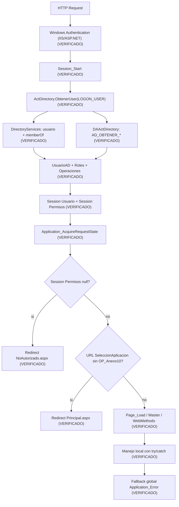
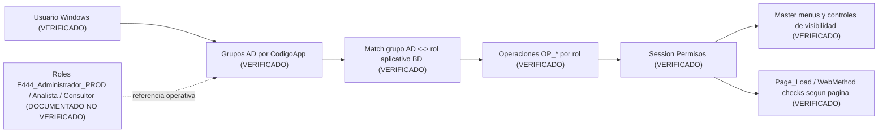
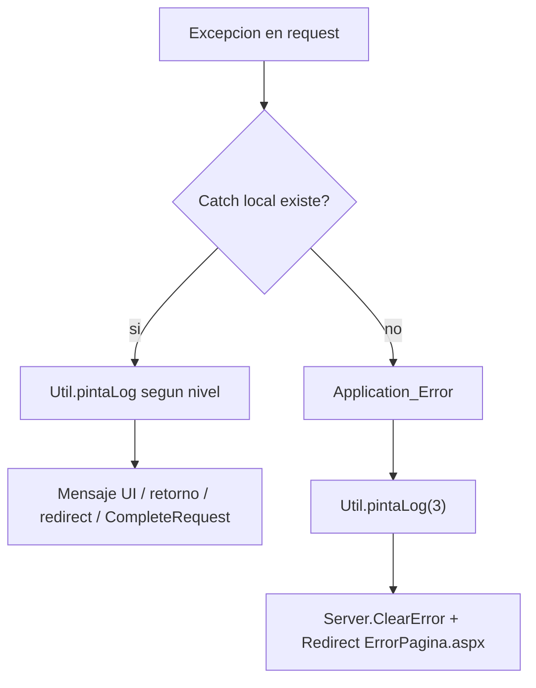
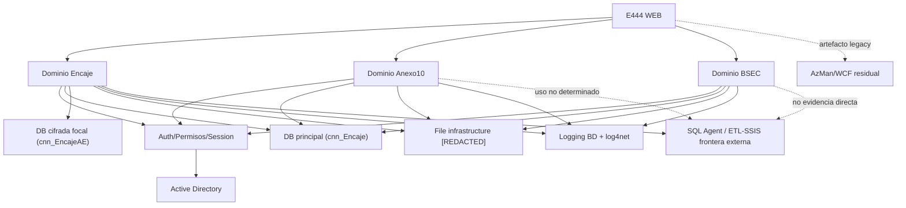

# PASADA 2E - TRANSVERSALES, INTEGRACIONES, OPERACION E INFRAESTRUCTURA
## 159. Objetivo y alcance 2E
Pregunta rectora:
- Que mecanismos transversales, dependencias externas y condiciones operativas permiten que E444 funcione hoy como una unica aplicacion legacy.

Baseline de esta pasada:
- `HEAD` + working tree actual aceptado sobre `feature/NIIFRRCC-18028-migracion-e079`.

Evolucion paralela conocida (fuera de inspeccion en esta pasada):
- `feature/NIIFRRCC-18032-actualizacion-contingencia`.

Regla de evidencia aplicada en toda 2E:
- HECHO VERIFICADO: evidencia directa en codigo/configuracion/repositorio.
- DOCUMENTADO PERO NO VERIFICADO: informacion operativa no demostrada completamente en repo.
- INFERENCIA TECNICA: conclusion razonable derivada de evidencia.
- NO DETERMINADO: no hay evidencia suficiente.

Delimitacion metodologica:
- No se reabre el detalle funcional E2E de Encaje/A10/BSEC ya cubierto en 2A/2B/2C/2D.
- Se documentan componentes compartidos: auth, session, config, integraciones, logging, jobs/ETL, deployment e infraestructura visible.

## 160. Lifecycle global ASP.NET
### 160.1 Eventos globales observados
| Evento | Comportamiento AS IS | Clasificacion |
| --- | --- | --- |
| `Application_Start` | Metodo presente sin logica funcional observable. | HECHO VERIFICADO |
| `Session_Start` | Obtiene `LOGON_USER`, construye `Session["Usuario"]` via `ActDirectory.ObtenerUser`, construye `Session["Permisos"]` desde `OperacionesPermitidas`. | HECHO VERIFICADO |
| `Application_AcquireRequestState` | Si `Session["Permisos"]` es `null`, redirige a `NoAutorizado.aspx`; ademas, para `SeleccionAplicacion.aspx`, si no existe `OP_Anexo10`, redirige a `Principal.aspx`. | HECHO VERIFICADO |
| `Application_Error` | Log global por `Util.pintaLog(3,...)`, limpia error y redirige a `ErrorPagina.aspx`. | HECHO VERIFICADO |
| `Session_End` | Metodo presente sin logica funcional observable. | HECHO VERIFICADO |

### 160.2 Flujo global request -> auth -> session -> pagina

## 161. Modelo de identidad y Active Directory

### 161.1 Modelo consolidado AD -> roles -> operaciones

| Etapa | Implementacion observable | Clasificacion |
| --- | --- | --- |
| Identidad Windows | `Request.ServerVariables["LOGON_USER"]` en `Session_Start`. | HECHO VERIFICADO |
| Resolucion de usuario AD | `DirectorySearcher` en Global Catalog, filtro por `objectSid`; extrae `samaccountname`, `mail`, `name`. | HECHO VERIFICADO |
| Resolucion de grupos AD | `memberOf` de AD, filtro `grupo.Contains(codigoApp)` y exclusion de `INC`. | HECHO VERIFICADO |
| Mapeo a roles de aplicativo | `LActDirectory.ListarRoles()` -> `DAActDirectory` -> SP `AD_OBTENER_ROLES`; match por `DomainAplication`. | HECHO VERIFICADO |
| Mapeo a operaciones | `ListarOperacionesPorRol` -> SP `AD_OBTENER_OPERACIONES_POR_ROL`; union por diccionario con deduplicacion por clave. | HECHO VERIFICADO |
| Persistencia de contexto | `Session["Usuario"]` y `Session["Permisos"]`. | HECHO VERIFICADO |

### 161.2 Contratos visibles (sin inspeccion interna SQL)

| Capa | Componente | Contrato visible |
| --- | --- | --- |
| WEB | `ActDirectory` | `ObtenerUser`, `RolUsuarioAD`, `FindContentPermises` |
| BL | `LActDirectory` | `ListarRoles`, `ListarOperacionesPorRol` |
| DA | `DAActDirectory` | `AD_OBTENER_ROLES`, `AD_OBTENER_OPERACIONES_POR_ROL` |

### 161.3 Comportamiento ante error/no datos

| Escenario | Comportamiento |
| --- | --- |
| Falla en AD/mapper durante `Session_Start` | `catch` con logging de error AD; puede dejar Session incompleta. |
| `Session["Permisos"]` nulo en request | Redireccion global a `NoAutorizado.aspx`. |
| Grupo AD no mapeado a rol BD | Se omite (`continue`) en la union de roles. |

## 162. Roles, operaciones y autorizacion

### 162.1 Modelo consolidado de autorizacion

### 162.2 Semantica de roles/operaciones

| Regla | Estado |
| --- | --- |
| Un usuario puede pertenecer a multiples grupos/roles. | HECHO VERIFICADO |
| Operaciones finales son union de operaciones por rol. | HECHO VERIFICADO |
| Existe deduplicacion por clave de operacion en diccionario. | HECHO VERIFICADO |
| No se observa precedencia formal entre roles. | HECHO VERIFICADO |
| Nombres `AD_ROL_APLICATION`, `AD_OPERATION_APLICATION`, `AD_OPERACION_ROL_APLICATION` en tablas SQL. | DOCUMENTADO PERO NO VERIFICADO |

### 162.3 Uso transversal de operaciones OP_*

| Superficie | Mecanismo | Estado |
| --- | --- | --- |
| Menus `Site.Master` (Encaje/reportes) | Visibilidad por `ActDirectory.FindContentPermises` con `OP_*`. | HECHO VERIFICADO |
| Menu `SiteAnexo10.Master` | Visibilidad por `OP_Anexo10`. | HECHO VERIFICADO |
| Menu `SiteBSEC.Master` | Visibilidad por `OP_BSEC`. | HECHO VERIFICADO |
| Varias paginas Encaje/A10/reportes | Validacion page-level en `Page_Load` + redirect `NoAutorizado`. | HECHO VERIFICADO |

## 163. Gaps conocidos de autorizacion

### 163.1 BSEC

* HECHO VERIFICADO:
* `OP_BSEC` controla visibilidad de menu en `SiteBSEC.Master`.
* `Views/BSEC/Procesamiento.aspx.cs` y `Views/BSEC/Maestro.aspx.cs` no realizan chequeo page-level de `OP_BSEC` en `Page_Load`.

* DOCUMENTADO PERO NO VERIFICADO:
* El comportamiento esperado reportado es restringir acceso directo URL a usuarios con `OP_BSEC`.

* Estado: `GAP DE AUTORIZACION CONOCIDO / PENDIENTE`.

### 163.2 Selector de aplicaciones

* HECHO VERIFICADO:
* `Application_AcquireRequestState` mantiene una condicion especial sobre `SeleccionAplicacion.aspx` basada en `OP_Anexo10`.

* DOCUMENTADO PERO NO VERIFICADO:
* Regla deseada: ingreso directo si tiene una sola superficie y selector si tiene 2 o mas (Encaje/A10/BSEC).

* Estado: `GAP FUNCIONAL CONOCIDO / PENDIENTE`.

### 163.3 TOSE

* HECHO VERIFICADO:
* `ReporteValidacion.aspx` y `ReporteValidacionDetalle.aspx` validan `OP_Reporte6`.
* `Site.Master` usa `OP_Reporte7` y `OP_Reporte8` para visibilidad de los menus TOSE.

* Estado: `DEFECTO DE AUTORIZACION CONOCIDO / PENDIENTE`.

## 164. AzMan / WCF residual

### 164.1 Artefactos presentes

| Artefacto | Evidencia | Clasificacion |
| --- | --- | --- |
| `UtilAzman.cs` | Clase completa con `AuthorizationClient`, `GetRoles`, `AccessCheck`. | HECHO VERIFICADO |
| Service reference `AuthorizationServices` | `Reference.cs`, `.svcmap`, `.xsd`, `WCFMetadata`. | HECHO VERIFICADO |
| Extensions WCF | `ServiceExtensions/*` con `MessageInspector`. | HECHO VERIFICADO |
| `serviceModel` bindings `AuthorizationEndpoint` | Definidos en `Web.config`. | HECHO VERIFICADO |

### 164.2 Flujo activo vs residual

| Punto | Estado |
| --- | --- |
| Uso activo de `UtilAzman` en autorizacion de pagina/menu | Residual/comentado en multiples paginas y master. HECHO VERIFICADO. |
| Endpoint cliente WCF activo en `Web.config` | El bloque `<client>` para `AuthorizationEndpointNet` esta comentado. HECHO VERIFICADO. |
| Flag `FlgAzman` | `Web.config` define `FlgAzman = S`; en `UtilAzman.ObtenerUser` el consumo de `GetRoles` ocurre solo si `FlgAzman != S`. HECHO VERIFICADO. |

Conclusion 164:

* `AzMan/WCF` se clasifica como `DEUDA LEGACY / ARTEFACTO RESIDUAL`.
* No hay evidencia suficiente de flujo runtime activo actual basado en AzMan desde el camino principal de autenticacion/autorizacion.

## 165. Session State y estado transversal

### 165.1 Configuracion Session State efectiva

| Parametro | Valor observado | Clasificacion |
| --- | --- | --- |
| `mode` | `InProc` | HECHO VERIFICADO |
| `cookieless` | `false` | HECHO VERIFICADO |
| `timeout` | No declarado explicitamente en `sessionState` de `Web.config`; aplica default de framework. | HECHO VERIFICADO + INFERENCIA TECNICA |

INFERENCIA TECNICA operativa:

* `InProc` implica dependencia de memoria del worker process; perdida de estado ante recycle/restart.

### 165.2 Variables Session nucleares (arranque global)

| Variable Session | Productor | Contenido | Dependencia | Consumidores |
| --- | --- | --- | --- | --- |
| `Session["Usuario"]` | `Global.Session_Start` | `UsuarioAD` (matricula, nombre, correo, roles, admin, operaciones) | Windows Auth + AD + mapper roles/ops | Masters, paginas y logging |
| `Session["Permisos"]` | `Global.Session_Start` | `Dictionary<int,string>` de `OP_*` | AD + BD roles/ops | `ActDirectory.FindContentPermises`, autorizacion de menus/paginas |

### 165.3 Inventario transversal de Session por categoria

| Categoria | Ejemplos | Dominios consumidores | Impacto |
| --- | --- | --- | --- |
| Identidad y autorizacion | `Usuario`, `Permisos` | Encaje, A10, BSEC, reportes, maestros | Critico para navegacion y seguridad funcional |
| Caches de reporte (DataTable) | `dtCabecera_*`, `dtSwiftOpe_*`, `dtReporteInf_*`, `dtCabecera3_*`, `dtReporteInf3_*`, `dtCabecera4_*`, `dtOpe4_*` | Reportes Encaje/TOSE | Consumo de memoria y acoplamiento por pantalla |
| A10 resumenes intermedios | `dtResumenLeasing`, `dtResumenCubo`, `dtResumenSaldos`, `dtResumenReporteSBS`, `dtResumenBalanceComprobacion`, `dyProductoCuentaRaiz` | Anexo10 | Objetos potencialmente grandes en memoria |
| BSEC output | `BSEC_ARCHIVO_RESULTADO` (`byte[]`), `BSEC_NOMBRE_ARCHIVO` | BSEC | Archivo en memoria por request/session |
| Estado UI/operacion | `fupArchivo`, `PeriodoReplica`, `dtOficinas` | Configuracion/Maestros | Estado transitorio por usuario |

### 165.4 Riesgos AS-IS de Session

| Riesgo | Evidencia | Clasificacion |
| --- | --- | --- |
| Perdida de estado al reciclar proceso | `InProc` + uso intensivo de Session para datos/bytes. | INFERENCIA TECNICA |
| Presion de memoria | Multiples `DataTable` y `byte[]` en Session por usuario. | HECHO VERIFICADO |
| Inconsistencia de naming | Uso mixto de `Session["Usuario"]` y `Session["usuario"]`. | HECHO VERIFICADO |
| Dependencia de Session para descargas | Reportes y BSEC dependen de estado previo en Session. | HECHO VERIFICADO |

## 166. Configuracion efectiva

Fuente vigente para esta caracterizacion:

* `Web.config`.

Estado de `Web_CERT.config` y `Web_PROD.config`:

* DOCUMENTADO PERO NO VERIFICADO como historicos/deprecados para runtime actual.

### 166.1 Configuracion transversal consolidada

| Bloque | Hallazgo principal | Clasificacion |
| --- | --- | --- |
| `authentication` | `Windows`. | HECHO VERIFICADO |
| `authorization` | `allow users="*"` (control fino ocurre en aplicacion via `Session["Permisos"]`). | HECHO VERIFICADO |
| `sessionState` | `InProc`, `cookieless=false`. | HECHO VERIFICADO |
| `customErrors` | `RemoteOnly` con redirect a `ErrorPagina.aspx`. | HECHO VERIFICADO |
| `appSettings` | Flags y rutas: `FlgAzman`, `CodigoApp`, `getlogger`, `ArchivoPath`, `Rutalog`, `RUTACARGA_*`, etc. | HECHO VERIFICADO |
| `connectionStrings` | `cnn_Encaje`, `cnn_EncajeAE`. | HECHO VERIFICADO |
| `system.serviceModel` | Bindings de `AuthorizationEndpoint*`; client endpoint comentado. | HECHO VERIFICADO |
| `system.webServer` | Headers de seguridad, `requestFiltering`, default document. | HECHO VERIFICADO |

### 166.2 Rutas y ubicaciones sensibles

Rutas UNC y hosts internos se redactan como `[REDACTED]` en este documento.

## 167. Connection strings y Always Encrypted

### 167.1 Matriz de connection strings observadas

| Nombre logico | Consumidores | Particularidad | Estado |
| --- | --- | --- | --- |
| `cnn_Encaje` | DA transversal (`DAActDirectory`, `DACarga`, reportes, parametros, helper, etc.) | Conexion principal compartida de la aplicacion. | HECHO VERIFICADO |
| `cnn_EncajeAE` | `DAInputs` (operaciones focalizadas de carga) | Incluye `Column Encryption Setting = Enabled;`. | HECHO VERIFICADO |
| `ConnectionStrings["BD"]` | `ParametrosVariables.aspx.cs` (referencia legacy observada) | No aparece definida en `Web.config` vigente y no surgio nueva evidencia de ejecucion real. | CODIGO RESIDUAL CONOCIDO / no reabrir salvo nueva evidencia |

### 167.2 Uso focal de `cnn_EncajeAE`

| Operacion visible | Implementacion | Dependencia |
| --- | --- | --- |
| Carga de acreedores | `DAInputs.ProcesarCargaAcreedores` con `SqlBulkCopy` y transaccion a `EB_M_GRANDESACREEDORES`. | `cnn_EncajeAE` |
| Carga residentes/no residentes | `DAInputs.ProcesarCargaResNoRes` con `SqlBulkCopy` y transaccion a `EB_M_RESIDENTESYNORES`. | `cnn_EncajeAE` |

Conclusion 167:

* Dependencia de columnas cifradas queda delimitada al uso focal de `cnn_EncajeAE` visible en cargas de inputs especificas.
* No se investigo criptografia SQL ni definicion interna de columnas.
* La referencia `ConnectionStrings["BD"]` se mantiene como codigo residual conocido, segun aclaracion operativa previa; no constituye una pregunta runtime activa mientras no aparezca nueva evidencia.

## 168. Infraestructura de archivos

### 168.1 Mapa transversal de patrones

| Patron | Dominio | Tipo | Persistencia | Infraestructura externa |
| --- | --- | --- | --- | --- |
| Upload HTTP | Configuracion Inputs (`UpFileHandler`, `CargaInputs`) | Entrada de archivo | Temporal en filesystem + validacion | Share/ruta configurada `[REDACTED]` |
| Copia a rutas de proceso | Carga Inputs/Maestros | Movimiento/copia | Archivo fisico | File shares `[REDACTED]` |
| Archivos en memoria Session | BSEC (`byte[]`), varios reportes | Estado temporal | Session InProc | No directa |
| Generacion XLSX | Encaje/A10/BSEC/reportes | Output documental | Temp path + descarga HTTP | Puede depender de templates compartidos |
| Generacion TXT | Reportes Encaje | Output documental | Stream/memoria + descarga HTTP | Puede disparar broad externo |
| Generacion `.110` + ZIP | Anexo10 ReporteFinal | Output regulatorio | ZIP en memoria/descarga | Dependencia de formato legacy |
| Descarga de logs | Principales (`Principal*`) | Archivo texto | Copia local temporal + descarga | Ruta de logs `[REDACTED]` |

### 168.2 File shares (redactado)

| Uso | Lectura/Escritura | Estado | Observaciones |
| --- | --- | --- | --- |
| `ArchivoPath` | Lectura/escritura | ACTIVA | Upload/lectura de archivos de entrada. Ruta redactada `[REDACTED]`. |
| `ArchivoMaestros` | Escritura/lectura | ACTIVA | Outputs de maestros. Ruta redactada `[REDACTED]`. |
| `RUTACARGA_DIARIO/MENSUAL/MAESTRO` | Escritura/lectura | ACTIVA | Cargas de inputs/maestros. Rutas redactadas `[REDACTED]`. |
| `Rutalog` / `ArchivoPathlog` / `Archivolog` | Lectura/escritura | ACTIVA/RESIDUAL mixto | Uso para descarga y rastreo de logs; coexisten nombres historicos. |

Disponibilidad/autenticacion:

* HECHO VERIFICADO: usa via IO de .NET (`File.Copy`, `File.ReadAllBytes`, `Path.Combine`).
* NO DETERMINADO: permisos exactos en share, identidad de proceso IIS y SLA de disponibilidad.

## 169. Librerias Excel/documentos

| Libreria | Flujos | Tipo de uso | Fuente |
| --- | --- | --- | --- |
| EPPlus | Reportes, A10, Configuracion (export/import), parte de validaciones | Lectura/escritura XLSX, plantillas y descarga | DLL local (`E444.Lib/EPPlus.dll`) + referencia en csproj |
| NPOI | BSEC, `CargaInputs`, `UpFileHandler` | Lectura XLS/XLSX, evaluacion de hojas/celdas, generacion workbook | NuGet (`NPOI`) |
| OpenXML (`DocumentFormat.OpenXml`) | Referenciada en proyecto | Soporte documental potencial | DLL local en raiz repo |
| OleDb | `CargaInputs` (`GetDataTableFromCsv`) | Lectura de texto/estructura tabular legacy | `System.Data.OleDb` |

Solapamiento tecnologico observable:

* HECHO VERIFICADO: coexisten EPPlus y NPOI para manejo de Excel en distintos flujos.
* HECHO VERIFICADO: conviven dependencias NuGet y DLL local para componentes documentales.

## 170. Logging

### 170.1 Modelo transversal de logging

| Componente | Funcion |
| --- | --- |
| `Util.pintaLog(level, msg, detalle)` | Punto central WEB para auditoria, seguridad y error tecnico. |
| `LogUtilBL` -> `LogUtilDA` | Persistencia de auditoria/seguridad en BD via SP (`EB_LOG_AUDITORIA_INSERT`, `EB_LOG_AUDITORIA_UPDATE`, `EB_LOG_SEGURIDAD_INSERT`). |
| `log4net` (`Util.log`) | Registro de errores (`level=3`) a archivo configurado. |

Semantica por nivel:

* `1`: auditoria (BD).
* `2`: seguridad/acceso (BD).
* `3`: error tecnico (log4net).
* `4`: update de auditoria (BD).

### 170.2 Cobertura de logging por area

| Area | Logging activo | Logging comentado/ausente | Evidencia |
| --- | --- | --- | --- |
| Global | `Application_Error` registra errores globales. | N/A | HECHO VERIFICADO |
| Encaje | Accesos, procesos y errores en multiples paginas de procesos/reportes. | Algunos bloques legacy comentados `NetLogger`. | HECHO VERIFICADO |
| Anexo10 | Accesos y errores en paginas clave. | N/A | HECHO VERIFICADO |
| BSEC | `PrincipalBSEC` y `SiteBSEC` con logs de acceso/errores. | `Procesamiento.aspx.cs` mantiene comentario de logging pendiente en `catch`; `Maestro` tiene comentarios de log en excepciones. | HECHO VERIFICADO |
| Integracion/jobs | Eventos de disparo broad/kill/procesos con `Util.pintaLog`. | No trazabilidad completa del job externo desde app para todos los casos. | HECHO VERIFICADO + NO DETERMINADO externo |

### 170.3 Hallazgos transversales

* HECHO VERIFICADO: existe logging funcional amplio, pero no uniforme al 100% en todos los catches.
* HECHO VERIFICADO: coexisten logging BD y archivo.
* INFERENCIA TECNICA: la observabilidad end-to-end de procesos externos depende de fuentes fuera de la app (SQL Agent/SSIS/IIS/log central).

## 171. Manejo global de errores

### 171.1 Manejo global vs local

| Nivel | Comportamiento |
| --- | --- |
| Local | Gran parte de paginas/webmethods envuelve logica en `try/catch`, registra por `Util.pintaLog` y retorna mensajes/redirect segun caso. |
| Global | `Application_Error` captura no manejadas, registra y redirige a `ErrorPagina.aspx`. |
| No autorizado | `Application_AcquireRequestState` y muchos `Page_Load` redirigen a `NoAutorizado.aspx` cuando falta permiso. |

### 171.2 Flujo consolidado de excepciones

## 172. Integraciones externas

| Integracion | Consumidor | Direccion | Uso | Estado |
| --- | --- | --- | --- | --- |
| Active Directory | `ActDirectory`, `UtilAzman` | E444 -> AD | Identidad de usuario y grupos (`memberOf`). | ACTIVA |
| SQL Server aplicacion | DA transversal | E444 <-> SQL | SP, consultas y persistencia de negocio/log. | ACTIVA |
| File shares `[REDACTED]` | Configuracion/reportes/principales | E444 <-> Share | Carga, lectura, outputs, logs. | ACTIVA |
| SQL Agent (via SQL) | `DAReporte1`, `DAReporte5`, `DAMatrizCuenta`, `DACarga` | E444 -> SQL/MSDB/SP | Start job, kill/cancel y monitoreo de procesos expuestos por SP. | ACTIVA |
| WCF AuthorizationServices/AzMan | `UtilAzman`, service references | E444 -> WCF | Artefacto legacy de autorizacion externa. | RESIDUAL |
| SMTP/otros servicios HTTP REST | No encontrado en codigo revisado | N/A | N/A | NO DETERMINADO / no evidencia |

## 173. SQL Agent

### 173.1 Invocaciones visibles desde C#

| Flujo | Accion C# | Job visible | Monitoreo | Resultado conocido |
| --- | --- | --- | --- | --- |
| Reporte1 broad MN/ME | `EXEC sp_start_job` en `DAReporte1.generalBroad` | `E444_BROAD_RPT1_MN`, `E444_BROAD_RPT1_ME` | No polling posterior en esa ruta; solo try/catch local de disparo. | Trigger externo ejecutado o excepcion local |
| Reporte5 broad MN/ME | `EXEC sp_start_job` en `DAReporte5.generalBroad` | `E444_BROAD_RPT5_MN`, `E444_BROAD_RPT5_ME` | No polling posterior en esa ruta; solo try/catch local de disparo. | Trigger externo ejecutado o excepcion local |
| MatrizCuenta kill | `EB_KILL_JOB_COLLECTOR(@JOB_NAME,@usuario)` | Nombre de job recibido por parametro | Respuesta por mensaje de salida SP | Estado textual devuelto |
| Proceso Encaje (control) | `EB_SP_CONSULTARPROCESO`, `EB_SP_CERRARPROCESO`, `EB_SP_DETENERPROCESO`, `EB_PROCESAR_STATUS` | Job interno no nombrado explicitamente desde C# | Si existe consulta/cierre por id/estado via SP | Seguimiento indirecto visible via SP |

### 173.2 Casos de trigger externo sin monitoreo aplicativo

| Caso | Clasificacion |
| --- | --- |
| `sp_start_job` broad en reportes 1/5 sin tracking posterior app-level en el mismo flujo de descarga | `EXTERNAL TRIGGER WITHOUT APPLICATION-LEVEL MONITORING` (HECHO VERIFICADO) |

## 174. ETL / SSIS

### 174.1 ETL de carga de inputs

| Hallazgo | Clasificacion |
| --- | --- |
| `LCarga.ProcesarInput` -> `DACarga.EB_PROCESAR_INPUT` para procesamiento de inputs. | HECHO VERIFICADO |
| Existen cargas directas con `SqlBulkCopy` y TVP en `DAInputs` para ciertos datasets/coberturas. | HECHO VERIFICADO |
| Que porcentaje del pipeline depende internamente de SSIS no es visible desde C# sin abrir SP/jobs/paquetes. | NO DETERMINADO externo |

### 174.2 ETL de calculo Encaje

| Hallazgo | Clasificacion |
| --- | --- |
| `LCarga.Procesar` -> `DACarga.EB_CALCULAR_ENCAJE` (timeout alto) como trigger principal de calculo. | HECHO VERIFICADO |
| Existen operaciones de estado/control (`EB_VALIDAR_ESTADO`, `EB_PROCESAR_STATUS`, `EB_SP_CONSULTARPROCESO`, `EB_SP_CERRARPROCESO`, `EB_SP_DETENERPROCESO`). | HECHO VERIFICADO |
| Nombre operativo reportado del job: `JOB_E444_SSIS_CalculaEncaje_Monitor`. | DOCUMENTADO PERO NO VERIFICADO — fuente: conocimiento operativo del responsable. |
| El literal `JOB_E444_SSIS_CalculaEncaje_Monitor` no aparece en el C# revisado del baseline actual. | HECHO VERIFICADO |
| Relacion exacta SP -> SQL Agent -> paquete SSIS interno no determinable desde repo C# sin inspeccion externa. | NO DETERMINADO externo |

## 175. AS-IS vs evolucion paralela

### 175.1 AS-IS baseline actual

* Cargas de inputs y calculo Encaje dependen de contratos SP visibles desde C# y, en partes, de procesos externos no observables internamente.
* Se observan triggers SQL Agent visibles para broad reportes y control de procesos.

### 175.2 Evolucion paralela conocida (sin inspeccion)

* DOCUMENTADO PERO NO VERIFICADO - EVOLUCION PARALELA:
* desacople de parte del ETL de carga de inputs;
* permanencia de ETL para calculo de Encaje.

Regla aplicada:

* No se mezclaron hallazgos de la rama paralela con el AS-IS del baseline actual.

## 176. Deployment y publicacion

| Evidencia repo | Hallazgo | Clasificacion |
| --- | --- | --- |
| `Properties/PublishProfiles/FolderProfile*.pubxml` | Publicacion FileSystem a carpeta local (`PublishUrl`), configuracion Release/AnyCPU. | HECHO VERIFICADO |
| Ausencia de pipelines (`.github/workflows`, `azure-pipelines`, `Jenkinsfile`, `.gitlab-ci.yml`) | No evidencia de CI/CD en repo. | HECHO VERIFICADO |
| Mecanismo operativo de copiar a carpeta fisica IIS despues de publish | Flujo manual reportado previamente. | DOCUMENTADO PERO NO VERIFICADO |

## 177. Build / tooling

| Aspecto | Hallazgo |
| --- | --- |
| Plataforma | ASP.NET Web Forms sobre .NET Framework 4.8 (`E444.WEB.csproj`). |
| Tooling base | `Microsoft.CSharp.targets` + `Microsoft.WebApplication.targets` (MSBuild/Visual Studio clasico). |
| Dependencias | Mixto NuGet + DLL locales (`E444.Lib/EPPlus.dll`, `DocumentFormat.OpenXml.dll`). |
| Service references | WCF metadata/references incluidos en proyecto. |

Clasificacion:

* HECHO VERIFICADO en estructura de proyecto.
* INFERENCIA TECNICA: tooling operativo esperado en Visual Studio/MSBuild clasico.

## 178. IIS e infraestructura visible

| Punto | Estado |
| --- | --- |
| App web ASP.NET clasica | HECHO VERIFICADO |
| Windows Authentication en app | HECHO VERIFICADO |
| `sessionState InProc` | HECHO VERIFICADO |
| `defaultDocument` en `Web.config` (SeleccionAplicacion.aspx) | HECHO VERIFICADO |
| Security headers / request filtering configurados en `system.webServer` | HECHO VERIFICADO |
| AppPool exacto, identity de AppPool, bindings, recycle policy, pipeline mode real de IIS productivo | NO DETERMINADO |

## 179. Ambientes

Modelo operativo vigente documentado:

- En DEV, CERT y PROD la fuente efectiva de configuracion es `Web.config`.
- Los valores dentro de `Web.config` se ajustan por ambiente.
- `Web_CERT.config` y `Web_PROD.config` existen en el repositorio, pero estan deprecados y NO representan la fuente de runtime actual.

| Aspecto | DEV | CERT | PROD | Clasificacion |
| --- | --- | --- | --- | --- |
| Fuente efectiva de configuracion | `Web.config` con valores DEV | `Web.config` con valores CERT | `Web.config` con valores PROD | DOCUMENTADO PERO NO VERIFICADO operativamente + `Web.config` HECHO VERIFICADO en repo |
| `Web_CERT.config` / `Web_PROD.config` | No aplican como runtime vigente | Artefacto deprecado | Artefacto deprecado | DOCUMENTADO PERO NO VERIFICADO |
| Connection principal | `cnn_Encaje` con valores del ambiente | `cnn_Encaje` con valores del ambiente | `cnn_Encaje` con valores del ambiente | DOCUMENTADO PERO NO VERIFICADO para valores efectivos de cada runtime |
| Shares/rutas | Valores propios del ambiente en `Web.config` | Valores propios del ambiente en `Web.config` | Valores propios del ambiente en `Web.config` | DOCUMENTADO PERO NO VERIFICADO operativamente |
| Publicacion | Publish FileSystem + copia manual reportada | Publish FileSystem + copia manual reportada | Publish FileSystem + copia manual reportada | HECHO VERIFICADO para perfil FileSystem + DOCUMENTADO PERO NO VERIFICADO para operacion runtime |

No se reproducen hosts, credenciales, connection strings completas ni rutas internas.
## 180. Operabilidad

| Proceso | Deteccion fallo | Reintento | Cancelacion | Observabilidad |
| --- | --- | --- | --- | --- |
| Calculo Encaje (`EB_CALCULAR_ENCAJE`) | Estado/resultado via SP (`EB_PROCESAR_STATUS`, validaciones de estado) + logs de app. | Manual (nuevo disparo de proceso). | `EB_SP_DETENERPROCESO` y `EB_SP_CERRARPROCESO` expuestos. | Media: app ve estado sintetico via SP; detalle interno externo no visible |
| Procesamiento Inputs (`EB_PROCESAR_INPUT` y cargas) | Mensajes de retorno + logs + archivos de error. | Manual por usuario. | Parcial via `Detener` de maestros/proceso segun flujo. | Media |
| Broad reportes 1/5 (`sp_start_job`) | Error local de disparo en app. | Manual relanzando accion. | No se observa cancelacion en mismo flujo broad. | Baja en app; depende de monitoreo externo |
| BSEC procesamiento | Excepcion local + alerta UI + opcion de reproceso. | Manual (reprocesar archivo). | N/A (sin asincronia externa visible). | Alta dentro de request; sin trazabilidad externa |

## 181. Dependencias binarias

| Categoria | Ejemplo | Estado |
| --- | --- | --- |
| DLL local en repo | `E444.Lib/EPPlus.dll`, `DocumentFormat.OpenXml.dll` | HECHO VERIFICADO |
| NuGet clasico (`packages.config`) | `NPOI`, `log4net`, `Newtonsoft.Json`, `System.*`, `Microsoft.Extensions.*`, etc. | HECHO VERIFICADO |
| Assemblies framework | `System.Web`, `System.ServiceModel`, `System.DirectoryServices` | HECHO VERIFICADO |
| WCF generated proxies | `Service References/AuthorizationServices/Reference.cs` | HECHO VERIFICADO |

Dependencias con impacto de migracion/build:

* coexistencia NuGet + DLL local;
* dependencia de targets de WebApplication;
* arrastre de artefactos WCF/AzMan legacy.

## 182. Artefactos legacy/residuales

| Artefacto | Estado AS-IS | Evidencia | Accion conocida futura |
| --- | --- | --- | --- |
| AzMan/WCF (`UtilAzman`, service references, endpoint cliente comentado) | RESIDUAL | Codigo y config presentes; consumo principal comentado/no activo en flujo observado | NO DETERMINADO |
| `Web_CERT.config` y `Web_PROD.config` | RESIDUAL/DEPRECADO | Archivos presentes; no son fuente vigente de runtime | DOCUMENTADO PERO NO VERIFICADO: deben retirarse/limpiarse posteriormente, sin hacerlo durante esta caracterizacion |
| `ConnectionStrings["BD"]` en `ParametrosVariables.aspx.cs` | RESIDUAL | Referencia en codigo sin definicion visible en `Web.config` vigente; aclaracion operativa previa la clasifica como codigo muerto/residual | Mantener como residual salvo nueva evidencia de ejecucion |
| Carpeta `PFX` con certificados y archivos asociados | RESIDUAL SENSIBLE | Archivos `.cer`, `.csr`, `.txt` y zip versionados en repo | DOCUMENTADO PERO NO VERIFICADO: no deberia estar versionada; limpieza ya realizada en la evolucion paralela `feature/NIIFRRCC-18032-actualizacion-contingencia` |
| `E444.Lib` (carpeta, no proyecto) con `EPPlus.dll` | ACTIVA en baseline actual | Referencia directa en csproj | DOCUMENTADO PERO NO VERIFICADO - EVOLUCION PARALELA indica retiro en rama 18032 |
| Referencias csproj a publish profiles no presentes (`Encaje.pubxml`, `encajecerti.pubxml`, `nuevecito.pubxml`) | RESIDUAL | csproj lista perfiles distintos a los observados en carpeta actual (`FolderProfile*`) | NO DETERMINADO |

## 183. Comparativa transversal Encaje/A10/BSEC

| Aspecto | Encaje | Anexo 10 | BSEC |
| --- | --- | --- | --- |
| Autorizacion | Menu + chequeo page-level en varias paginas (`OP_*`). | Menu + chequeo page-level (`OP_Anexo10`). | Menu por `OP_BSEC`; sin chequeo page-level en `Procesamiento`/`Maestro`. |
| Session | Uso intensivo (`Usuario`, `Permisos`, DataTables reportes). | Uso intensivo (`Usuario`, `Permisos`, DataTables resumen/ajustes). | Uso de `Usuario`/`Permisos` + `byte[]` resultado BSEC. |
| Persistencia | Fuerte uso DB/SP para calculos/reportes/control. | Uso DB/SP en inputs/ajustes/reportes. | Maestro BSEC en DB; resultado de procesamiento en Session/descarga. |
| Procesamiento archivos | TXT/XLSX/descargas/reportes. | Inputs y output regulatorio `.110`/ZIP. | Consolidado Excel + output Excel. |
| Excel/documentos | EPPlus + NPOI segun flujo. | EPPlus + NPOI segun flujo. | NPOI (lectura/generacion) en procesamiento. |
| Procesamiento diferido | Presente (calculo, estados, broad). | Menor evidencia de asincronia externa visible. | No evidencia de asincronia externa en procesamiento principal. |
| Jobs/ETL | Trigger/monitoreo indirecto visible via SP + `sp_start_job` en broad. | No evidencia directa de `sp_start_job` en rutas A10 revisadas. | Sin `sp_start_job` visible en BSEC. |
| Outputs | Reportes xlsx/txt, descargas varias. | Reportes xlsx + `.110`/ZIP. | XLSX de Balance Sectorial en descarga. |
| Infraestructura compartida | AD, Session InProc, `cnn_Encaje`, logging, file shares | AD, Session InProc, `cnn_Encaje`, logging, file shares | AD, Session InProc, `cnn_Encaje`, logging, file shares |

## 184. Grafo de dependencias compartidas

Nota metodologica obligatoria:

* Compartir Web app, auth, Session, helper, connection strings o base fisica NO demuestra por si solo que Encaje, A10 y BSEC deban pertenecer al mismo boundary futuro.
* La ausencia de llamadas BL/DA cruzadas tampoco demuestra por si sola que deban desplegarse separados.

## 185. Deuda tecnica transversal

| Categoria | Evidencia AS-IS | Superficie afectada | Impacto en migracion |
| --- | --- | --- | --- |
| Seguridad/autorizacion | GAP BSEC page-level; inconsistencia TOSE (`OP_Reporte6` vs `OP_Reporte7/8`). | BSEC y TOSE | Riesgo de acceso indebido o reglas inconsistentes |
| Session/estado | `InProc`, objetos grandes en Session, naming mixto `Usuario/usuario`. | Toda la app | Fragilidad operativa y consumo de memoria |
| Configuracion | Config deprecada coexistente + referencia `BD` residual sin definicion en config vigente. | Configuracion/reportes | Riesgo de drift de ambientes y confusion por artefactos legacy |
| Integraciones | AzMan/WCF residual + frontera externa SQL Agent/SSIS sin observabilidad total en app. | Auth legacy + procesos diferidos | Complejidad de estabilizacion |
| ETL/jobs | Triggers externos sin monitoreo app-level completo (broad). | Reportes Encaje | Riesgo operativo y troubleshooting |
| Archivos | Dependencia de shares y rutas externas; sensibilidad de permisos/I/O. | Inputs/reportes/logs | Riesgo de fallas por infraestructura |
| Logging/observabilidad | Cobertura amplia pero no uniforme en todos los catches. | Varias areas (incluye BSEC) | Diagnostico incompleto en ciertos fallos |
| Deployment | Publish FileSystem + despliegue manual reportado; ausencia CI/CD en repo. | Operacion release | Riesgo humano y variabilidad |
| Dependencias binarias | Mezcla NuGet + DLL local + artefactos legacy versionados. | Build/deploy | Deuda de mantenibilidad |
| Testing | Sin proyectos unitarios/integracion visibles en repo. | Todo E444 | Alta dependencia de prueba manual |

## 186. Backlog externo SQL Agent / ETL
| ID | Pregunta | Sistema externo |
| --- | --- | --- |
| E444-EXT-001 | Confirmar tecnicamente el encadenamiento `EB_CALCULAR_ENCAJE` -> `JOB_E444_SSIS_CalculaEncaje_Monitor` -> paquete SSIS y su contrato de parametros/estado. | SQL Agent / SSIS |
| E444-EXT-002 | Como mapea `EB_PROCESAR_INPUT` a procesos ETL internos por tipo de input? | SQL Agent / SSIS |
| E444-EXT-003 | Cual es la semantica exacta de estados de `EB_PROCESAR_STATUS` y `EB_VALIDAR_ESTADO`? | SQL / SQL Agent |
| E444-EXT-004 | Que politicas de reintento/timeout/concurrencia tienen los jobs broad (`E444_BROAD_RPT1_*`, `E444_BROAD_RPT5_*`)? | SQL Agent |
| E444-EXT-005 | Que dependencias de file share/staging usa cada job ETL critico? | SQL Agent / SSIS / Infra |
| E444-EXT-006 | Que alertas/telemetria externa existen para fallos de jobs disparados por E444? | SQL Agent / Monitoreo |

## 187. Backlog infraestructura / IIS
| ID | Pregunta | Sistema externo |
| --- | --- | --- |
| E444-INFRA-001 | Cual es el App Pool real (nombre, identity, pipeline mode) del sitio productivo? | IIS |
| E444-INFRA-002 | Cuales son politicas reales de recycle y su impacto en Session InProc? | IIS |
| E444-INFRA-003 | Que permisos efectivos tiene la identidad IIS sobre shares `[REDACTED]`? | IIS / File Server |
| E444-INFRA-004 | Cual es el procedimiento operativo de publish/copy/rollback actualmente usado? | Operacion / IIS |
| E444-INFRA-005 | Que bindings/TLS/certificados estan activos en runtime y como se gestionan? | IIS / Seguridad |
| E444-INFRA-006 | Existe balanceo y, de existir, como se garantiza afinidad de sesion para InProc? | Infraestructura |

## 188. Estado de preguntas 2E y pendientes externos

La referencia `ConnectionStrings["BD"]` NO se mantiene como pregunta abierta: fue clasificada previamente como codigo residual conocido y no aparecio nueva evidencia que justifique reabrirla.

### 188.1 Preguntas activas que requieren fuentes externas

| ID | Pregunta | Prioridad | Evidencia actual | Fuente necesaria | Fase |
| --- | --- | --- | --- | --- | --- |
| Q2E-002 | Mapeo exacto SP de proceso -> job/paquete ETL | ALTA | Se observan triggers SP y algunos `sp_start_job`, pero no el mapping interno completo | SQL Agent + SSIS | Externa ETL |
| Q2E-003 | Politicas reales de AppPool/recycle y su impacto sobre Session InProc | ALTA | No visible en repo | IIS operativo | Infra |
| Q2E-004 | Permisos efectivos y disponibilidad/SLA de shares criticos `[REDACTED]` | ALTA | Uso en codigo visible; permisos/SLA no visibles | File Server + seguridad | Infra |
| Q2E-005 | Monitoreo externo para jobs broad y procesos de calculo | MEDIA | App no muestra tracking completo de broad | SQL Agent/observabilidad | Externa ETL |

### 188.2 Pregunta cerrada durante saneamiento

| ID | Estado | Resolucion |
| --- | --- | --- |
| Q2E-001 | CERRADA / NO REABRIR SIN NUEVA EVIDENCIA | `ConnectionStrings["BD"]` se mantiene como codigo residual/muerto conocido; su referencia en `ParametrosVariables.aspx.cs` ya era conocida y no existe definicion en `Web.config` vigente. |

Las preguntas activas de esta seccion son externas al repositorio y no requieren continuar leyendo C# para cerrar 2E.

Resultado del saneamiento documental:
- Baseline corregido a `feature/NIIFRRCC-18028-migracion-e079`.
- `ConnectionStrings["BD"]` permanece residual y Q2E-001 queda cerrada.
- Modelo de configuracion por ambiente reconciliado: `Web.config` es la fuente efectiva en DEV/CERT/PROD; transforms historicos estan deprecados.
- Nombre operativo del job de calculo preservado como `JOB_E444_SSIS_CalculaEncaje_Monitor` y separado de la evidencia C#.
- Estado futuro conocido de `PFX` y configs deprecadas registrado como DOCUMENTADO PERO NO VERIFICADO.
## 189. Gates de completitud
| Gate | Estado |
| --- | --- |
| Lifecycle global entendido | CUMPLIDO |
| Autenticacion entendida | CUMPLIDO |
| AD y modelo de identidad entendidos | CUMPLIDO |
| Roles/operaciones consolidados | CUMPLIDO |
| Autorizacion transversal documentada | CUMPLIDO |
| Gaps conocidos separados del AS-IS | CUMPLIDO |
| Session State caracterizado | CUMPLIDO |
| Configuracion efectiva identificada | CUMPLIDO |
| Connection strings clasificadas | CUMPLIDO |
| Infraestructura de archivos caracterizada | CUMPLIDO |
| Logging caracterizado | CUMPLIDO |
| Manejo de errores caracterizado | CUMPLIDO |
| Integraciones externas catalogadas | CUMPLIDO |
| AzMan correctamente clasificado | CUMPLIDO |
| SQL Agent visible caracterizado | CUMPLIDO |
| ETL/SSIS visible caracterizado hasta frontera externa | CUMPLIDO CON NO DETERMINADO EXTERNO |
| AS IS vs evolucion paralela separados | CUMPLIDO |
| Deployment actual documentado | CUMPLIDO |
| IIS visible documentado | CUMPLIDO CON NO DETERMINADO EXTERNO |
| Ambientes delimitados | CUMPLIDO CON NO DETERMINADO EXTERNO |
| Dependencias binarias relevantes documentadas | CUMPLIDO |
| Operabilidad caracterizada | CUMPLIDO |
| Dependencias compartidas por dominios consolidadas | CUMPLIDO |
| Preguntas externas delimitadas | CUMPLIDO |

Resultado gates 2E:
- No existen gates en estado `NO CUMPLIDO`.
- Estado formal: `PASADA 2E - COMPLETA`.

Evaluacion de salida de caracterizacion del repositorio:
- Pregunta: Existe todavia alguna pregunta critica del AS IS de E444 que pueda responderse exclusivamente leyendo mas codigo/configuracion de este repositorio?
- Respuesta: NO.

Declaracion de readiness:
- `CARACTERIZACION AS-IS DEL REPOSITORIO E444 - SUFICIENTEMENTE COMPLETA PARA INICIAR FASE DE BASE DE DATOS`.

## 190. Conclusion PASADA 2E
Conclusion ejecutiva:
1. E444 funciona como una aplicacion monolitica legacy con controles transversales compartidos de autenticacion Windows, sesion InProc, autorizacion por operaciones `OP_*`, logging central y fuerte dependencia de SQL + filesystem.
2. El modelo de identidad es hibrido AD+BD (grupos AD + mapeo de roles/operaciones en SQL), materializado en `Session["Permisos"]`.
3. Los dominios Encaje, A10 y BSEC comparten infraestructura y mecanismos tecnicos, pero esa convergencia tecnica no decide boundaries futuros.
4. Las mayores incertidumbres remanentes ya no estan en codigo C#: se concentran en SQL Agent/SSIS, infraestructura IIS y permisos/disponibilidad de shares.
5. Se separo explicitamente AS IS del baseline frente a evolucion paralela conocida, sin mezclar evidencia de rama alterna.

Constancias metodologicas de esta pasada:
- No se realizo reverse engineering interno de Stored Procedures.
- No se consulto la base de datos.
- No se inspecciono SQL Agent.
- No se inspecciono SSIS.
- No se conecto a Active Directory ni IIS.
- No se cambio de rama.
- No se inspecciono la rama alternativa.
- No se modifico codigo.
- No se comparo contra DNET.
- No se diseno arquitectura TO-BE.
- No se tomaron decisiones de boundaries.